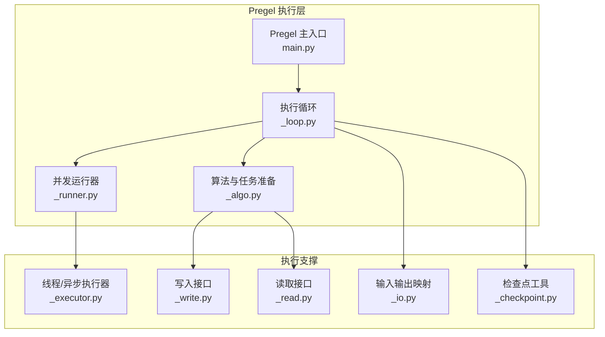
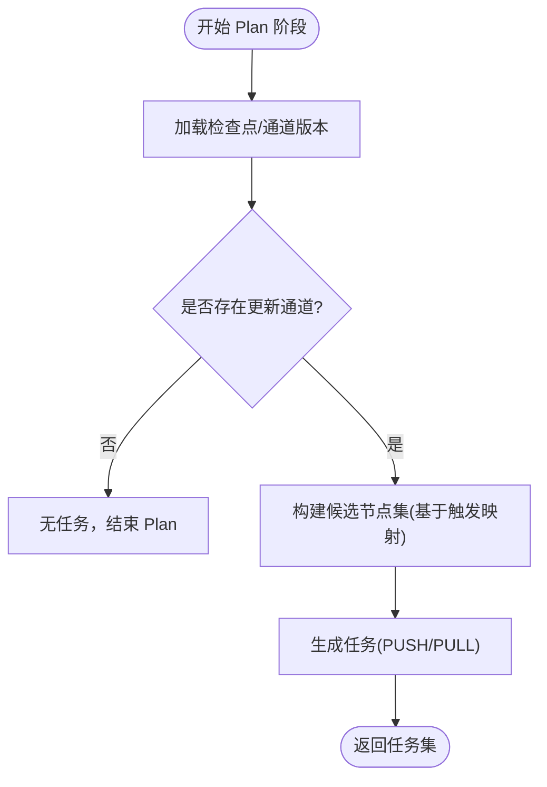
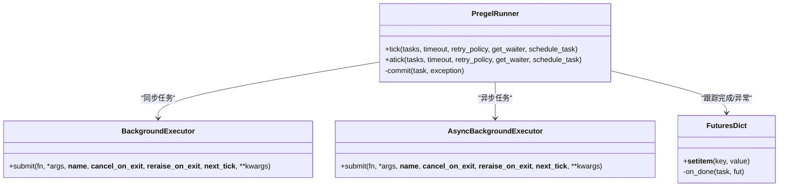
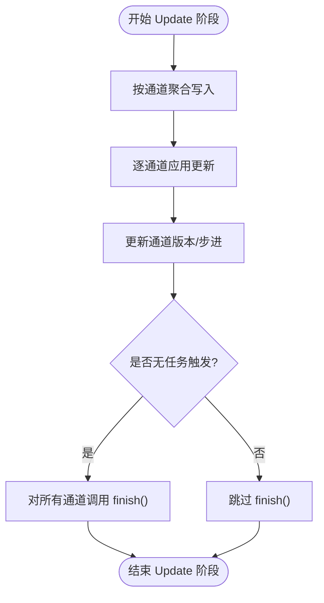
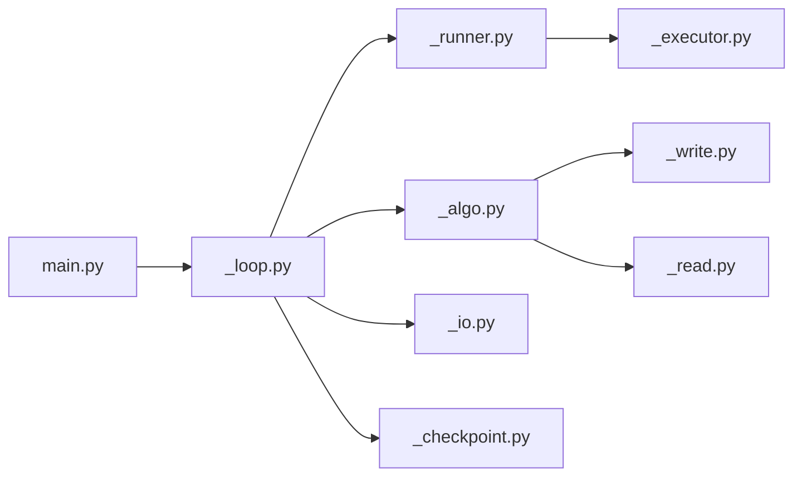

# 并行执行模型

<cite>
**本文档引用的文件**
- [main.py](file://libs/langgraph/langgraph/pregel/main.py)
- [_algo.py](file://libs/langgraph/langgraph/pregel/_algo.py)
- [_executor.py](file://libs/langgraph/langgraph/pregel/_executor.py)
- [_runner.py](file://libs/langgraph/langgraph/pregel/_runner.py)
- [_loop.py](file://libs/langgraph/langgraph/pregel/_loop.py)
- [_write.py](file://libs/langgraph/langgraph/pregel/_write.py)
- [_read.py](file://libs/langgraph/langgraph/pregel/_read.py)
- [_io.py](file://libs/langgraph/langgraph/pregel/_io.py)
- [_checkpoint.py](file://libs/langgraph/langgraph/pregel/_checkpoint.py)
</cite>

## 目录
1. [简介](#简介)
2. [项目结构](#项目结构)
3. [核心组件](#核心组件)
4. [架构总览](#架构总览)
5. [详细组件分析](#详细组件分析)
6. [依赖分析](#依赖分析)
7. [性能考虑](#性能考虑)
8. [故障排查指南](#故障排查指南)
9. [结论](#结论)

## 简介
本文件系统化阐述 LangGraph 中基于 Pregel 算法与 Bulk Synchronous Parallel（BSP）模型的并行执行机制，聚焦“计划（Plan）-执行（Execution）-更新（Update）”三阶段的工作流，以及在该模型下如何实现任务调度、并发控制、资源管理、状态可见性、数据竞争处理与错误传播。同时给出性能优化建议与执行监控方法，帮助开发者高效构建与调试长时序、状态持久化的智能体。

## 项目结构
LangGraph 的并行执行核心位于 `libs/langgraph/langgraph/pregel/` 目录，围绕 Pregel 协议、算法、执行器、循环与 IO 组件协同工作，形成完整的 BSP 执行框架。



图示来源
- [main.py:2672-3076](file://libs/langgraph/langgraph/pregel/main.py#L2672-L3076)
- [_loop.py:142-800](file://libs/langgraph/langgraph/pregel/_loop.py#L142-L800)
- [_runner.py:122-769](file://libs/langgraph/langgraph/pregel/_runner.py#L122-L769)
- [_algo.py:370-717](file://libs/langgraph/langgraph/pregel/_algo.py#L370-L717)
- [_executor.py:1-224](file://libs/langgraph/langgraph/pregel/_executor.py#L1-L224)
- [_write.py:1-193](file://libs/langgraph/langgraph/pregel/_write.py#L1-L193)
- [_read.py:1-278](file://libs/langgraph/langgraph/pregel/_read.py#L1-L278)
- [_io.py:1-175](file://libs/langgraph/langgraph/pregel/_io.py#L1-L175)
- [_checkpoint.py:1-89](file://libs/langgraph/langgraph/pregel/_checkpoint.py#L1-L89)

章节来源
- [main.py:2672-3076](file://libs/langgraph/langgraph/pregel/main.py#L2672-L3076)
- [_loop.py:142-800](file://libs/langgraph/langgraph/pregel/_loop.py#L142-L800)

## 核心组件
- Pregel 主入口：负责创建同步/异步执行循环与运行器，驱动 BSP 步进与输出流式传输。
- 执行循环（SyncPregelLoop/AsyncPregelLoop）：封装单步计划、执行、更新的生命周期；维护检查点、通道版本、待写入集合与中断逻辑。
- 并发运行器（PregelRunner）：在给定超时与等待器条件下并发调度任务，统一提交与回调，处理异常与中断传播。
- 算法与任务准备（prepare_next_tasks/apply_writes）：确定下一步要执行的任务集合并应用写入，保证通道在步骤边界原子更新。
- 执行器（BackgroundExecutor/AsyncBackgroundExecutor）：提供线程池与异步事件循环的并发执行能力，并支持最大并发限制。
- 写入/读取接口：通过 CONFIG_KEY_SEND/CONFIG_KEY_READ 注入到任务配置中，实现节点内读写通道与子图调用。
- 输入输出映射：将外部输入映射为通道写入，将通道值映射为输出或增量更新。
- 检查点工具：生成空检查点、从检查点恢复通道、复制检查点与创建新检查点。

章节来源
- [main.py:337-640](file://libs/langgraph/langgraph/pregel/main.py#L337-L640)
- [_loop.py:142-800](file://libs/langgraph/langgraph/pregel/_loop.py#L142-L800)
- [_runner.py:122-769](file://libs/langgraph/langgraph/pregel/_runner.py#L122-L769)
- [_algo.py:218-324](file://libs/langgraph/langgraph/pregel/_algo.py#L218-L324)
- [_executor.py:1-224](file://libs/langgraph/langgraph/pregel/_executor.py#L1-L224)
- [_write.py:46-193](file://libs/langgraph/langgraph/pregel/_write.py#L46-L193)
- [_read.py:23-278](file://libs/langgraph/langgraph/pregel/_read.py#L23-L278)
- [_io.py:81-175](file://libs/langgraph/langgraph/pregel/_io.py#L81-L175)
- [_checkpoint.py:16-89](file://libs/langgraph/langgraph/pregel/_checkpoint.py#L16-L89)

## 架构总览
LangGraph 的执行遵循 BSP 模型：每一步由 Plan-Execution-Update 三段组成，期间通道值保持不可变，所有写入仅在步骤切换时统一应用，从而避免数据竞争并确保状态一致性。

```mermaid
sequenceDiagram
participant App as "应用入口<br/>main.py"
participant Loop as "执行循环<br/>_loop.py"
participant Runner as "并发运行器<br/>_runner.py"
participant Exec as "执行器<br/>_executor.py"
participant Algo as "算法/写入<br/>_algo.py"
participant IO as "IO 映射<br/>_io.py"
App->>Loop : 初始化并进入 tick()
Loop->>Algo : 准备下一阶段任务集(Plan)
Algo-->>Loop : 返回待执行任务
Loop->>Runner : 提交并发执行(Execution)
Runner->>Exec : 提交任务到线程池/事件循环
Exec-->>Runner : 任务完成/异常/中断
Runner-->>Loop : 回调提交写入(commit)
Loop->>Algo : 应用写入(Update)<br/>原子更新通道版本
Algo-->>Loop : 返回已更新通道集合
Loop->>IO : 输出值/增量更新
IO-->>App : 流式输出/最终结果
```

图示来源
- [main.py:2672-3076](file://libs/langgraph/langgraph/pregel/main.py#L2672-L3076)
- [_loop.py:461-574](file://libs/langgraph/langgraph/pregel/_loop.py#L461-L574)
- [_runner.py:140-424](file://libs/langgraph/langgraph/pregel/_runner.py#L140-L424)
- [_algo.py:218-324](file://libs/langgraph/langgraph/pregel/_algo.py#L218-L324)
- [_io.py:100-175](file://libs/langgraph/langgraph/pregel/_io.py#L100-L175)

## 详细组件分析

### 计划（Plan）阶段
- 依据上一步更新的通道集合与触发映射，确定下一步可被触发的节点集合。
- 支持 PUSH（显式发送）与 PULL（按触发条件）两类任务，统一生成任务 ID 与命名空间，确保可重放与可追踪。
- 对于首次执行或恢复执行，会根据输入或命令映射为初始写入，推进到下一步。



图示来源
- [_algo.py:370-491](file://libs/langgraph/langgraph/pregel/_algo.py#L370-L491)
- [_loop.py:473-491](file://libs/langgraph/langgraph/pregel/_loop.py#L473-L491)

章节来源
- [_algo.py:370-491](file://libs/langgraph/langgraph/pregel/_algo.py#L370-L491)
- [_loop.py:473-491](file://libs/langgraph/langgraph/pregel/_loop.py#L473-L491)

### 执行（Execution）阶段
- 并发运行器使用线程池或异步事件循环提交任务，支持最大并发限制与超时控制。
- 任务间相互独立，异常通过 Future 回调收集并在步骤末统一处理；中断信号不视为失败，允许优雅停止其他任务。
- 任务内部通过 CONFIG_KEY_SEND 注入写入队列，通过 CONFIG_KEY_READ 注入读取函数，支持“新鲜视图”以避免脏读。



图示来源
- [_runner.py:122-424](file://libs/langgraph/langgraph/pregel/_runner.py#L122-L424)
- [_executor.py:40-224](file://libs/langgraph/langgraph/pregel/_executor.py#L40-L224)

章节来源
- [_runner.py:140-424](file://libs/langgraph/langgraph/pregel/_runner.py#L140-L424)
- [_executor.py:40-224](file://libs/langgraph/langgraph/pregel/_executor.py#L40-L224)

### 更新（Update）阶段
- 将当前步骤所有任务的写入进行去重与排序，原子性地更新通道值与版本号。
- 对未更新通道也触发一次“步进通知”，确保通道生命周期一致。
- 若无任何任务触发，对所有可用通道调用 finish()，标记超步结束。



图示来源
- [_algo.py:218-324](file://libs/langgraph/langgraph/pregel/_algo.py#L218-L324)

章节来源
- [_algo.py:218-324](file://libs/langgraph/langgraph/pregel/_algo.py#L218-L324)

### 任务调度策略与并发控制
- 调度器基于任务路径与任务 ID 生成策略，确保可重放与幂等。
- 最大并发可通过配置传递至异步执行器的信号量，限制同时运行的任务数。
- 超时控制：在同步/异步 tick 中设置截止时间，到达后统一抛出超时异常并取消剩余任务。
- 等待器：可注册等待器任务，在特定条件满足时唤醒主循环。

章节来源
- [_runner.py:140-424](file://libs/langgraph/langgraph/pregel/_runner.py#L140-L424)
- [_executor.py:122-224](file://libs/langgraph/langgraph/pregel/_executor.py#L122-L224)

### 资源管理
- 执行器在退出时可取消未启动任务、等待已完成任务、并按需重新抛出异常。
- 检查点保存采用“先写入待写入队列，再异步提交”的模式，降低阻塞风险。
- 子图与嵌套执行通过命名空间与配置传递，保证上下文隔离与可追踪性。

章节来源
- [_executor.py:93-121](file://libs/langgraph/langgraph/pregel/_executor.py#L93-L121)
- [_loop.py:306-421](file://libs/langgraph/langgraph/pregel/_loop.py#L306-L421)

### 状态可见性与数据竞争处理
- BSP 保证通道在步骤内不可变，写入仅在步骤边界统一应用，天然避免数据竞争。
- 读取接口支持“新鲜视图”（fresh），在条件分支中读取当前写入但尚未提交的状态副本，避免脏读。
- 通道版本递增与“已见版本”记录，用于判断中断与恢复场景下的可见性。

章节来源
- [_algo.py:174-211](file://libs/langgraph/langgraph/pregel/_algo.py#L174-L211)
- [_algo.py:218-324](file://libs/langgraph/langgraph/pregel/_algo.py#L218-L324)

### 错误传播机制
- 同步：Future 完成回调中收集异常，若任一任务失败且非中断，则取消其余任务并统一抛出异常。
- 异步：与同步类似，但使用 asyncio.CancelledError 区分取消与异常。
- 中断：GraphInterrupt 不作为失败处理，而是写入中断标记，允许恢复流程。
- 取消：GraphBubbleUp 用于在特定上下文中冒泡中断信号，不在退出时再次抛出。

章节来源
- [_runner.py:425-531](file://libs/langgraph/langgraph/pregel/_runner.py#L425-L531)
- [_runner.py:533-769](file://libs/langgraph/langgraph/pregel/_runner.py#L533-L769)

### 输入/输出与写入/读取接口
- 输入映射：将外部输入映射为通道写入，支持多通道选择与类型校验。
- 命令映射：Command 结构支持 goto/resume/update 等操作，转换为待写入序列。
- 写入接口：统一通过 CONFIG_KEY_SEND 注入，支持静态分析与运行时动态写入。
- 读取接口：通过 CONFIG_KEY_READ 注入，支持按通道名读取或批量读取，支持 fresh 视图。

章节来源
- [_io.py:81-175](file://libs/langgraph/langgraph/pregel/_io.py#L81-L175)
- [_write.py:46-193](file://libs/langgraph/langgraph/pregel/_write.py#L46-L193)
- [_read.py:23-278](file://libs/langgraph/langgraph/pregel/_read.py#L23-L278)

### 检查点与持久化
- 空检查点、从检查点恢复通道、复制检查点与创建新检查点。
- 待写入队列与检查点异步提交分离，减少阻塞。
- 版本号与“已见版本”配合，支持中断与恢复、回放与重入。

章节来源
- [_checkpoint.py:16-89](file://libs/langgraph/langgraph/pregel/_checkpoint.py#L16-L89)
- [_loop.py:306-421](file://libs/langgraph/langgraph/pregel/_loop.py#L306-L421)

## 依赖分析
- Pregel 主入口依赖执行循环与运行器，贯穿 BSP 生命周期。
- 执行循环依赖算法模块进行任务准备与写入应用，依赖 IO 进行输出映射。
- 并发运行器依赖执行器进行任务提交与等待，依赖算法模块进行写入提交。
- 写入/读取接口贯穿节点执行，注入到任务配置中，确保可测试与可追踪。



图示来源
- [main.py:2672-3076](file://libs/langgraph/langgraph/pregel/main.py#L2672-L3076)
- [_loop.py:142-800](file://libs/langgraph/langgraph/pregel/_loop.py#L142-L800)
- [_runner.py:122-769](file://libs/langgraph/langgraph/pregel/_runner.py#L122-L769)
- [_algo.py:370-717](file://libs/langgraph/langgraph/pregel/_algo.py#L370-L717)
- [_executor.py:1-224](file://libs/langgraph/langgraph/pregel/_executor.py#L1-L224)
- [_write.py:1-193](file://libs/langgraph/langgraph/pregel/_write.py#L1-L193)
- [_read.py:1-278](file://libs/langgraph/langgraph/pregel/_read.py#L1-L278)
- [_io.py:1-175](file://libs/langgraph/langgraph/pregel/_io.py#L1-L175)
- [_checkpoint.py:1-89](file://libs/langgraph/langgraph/pregel/_checkpoint.py#L1-L89)

章节来源
- [main.py:2672-3076](file://libs/langgraph/langgraph/pregel/main.py#L2672-L3076)
- [_loop.py:142-800](file://libs/langgraph/langgraph/pregel/_loop.py#L142-L800)

## 性能考虑
- 并发度控制：通过配置 max_concurrency 控制异步任务并发上限，避免资源争用与抖动。
- 任务粒度：尽量将长耗时任务拆分为细粒度子任务，提升吞吐与可观测性。
- 缓存策略：利用缓存策略减少重复计算，注意缓存键与 TTL 的设计。
- 写入批量化：合并连续写入，减少通道更新次数与版本号增长。
- 超时与等待器：合理设置 step_timeout 与等待器，避免长时间阻塞。
- 检查点异步：将检查点写入与业务逻辑解耦，减少阻塞。

## 故障排查指南
- 中断与恢复：确认中断写入与恢复写入的匹配关系，避免悬挂中断。
- 异常定位：查看 Future 完成回调中的异常栈，排除被屏蔽的异常帧。
- 超时问题：检查 step_timeout 设置与任务耗时分布，必要时增加超时或拆分任务。
- 并发冲突：核对最大并发配置与资源限制，避免死锁或饥饿。
- 状态不一致：确认通道更新是否在步骤边界统一应用，避免跨步骤读写。

章节来源
- [_runner.py:425-531](file://libs/langgraph/langgraph/pregel/_runner.py#L425-L531)
- [_loop.py:575-788](file://libs/langgraph/langgraph/pregel/_loop.py#L575-L788)

## 结论
LangGraph 的并行执行模型以 Pregel/BSP 为核心，通过“计划-执行-更新”的严格分层与通道版本化机制，实现了高并发、可恢复、可观察的执行环境。结合任务调度、并发控制、资源管理与错误传播策略，开发者可以构建稳定高效的长时序状态化智能体。建议在实际工程中关注并发度、超时与缓存策略，并充分利用检查点与流式输出进行可观测性建设。