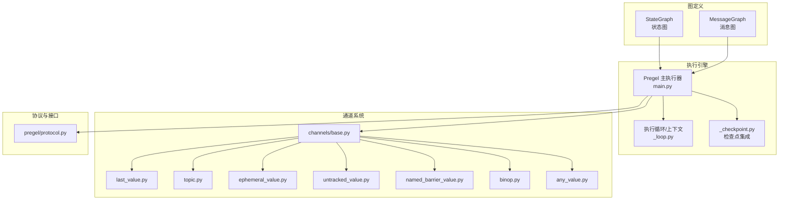
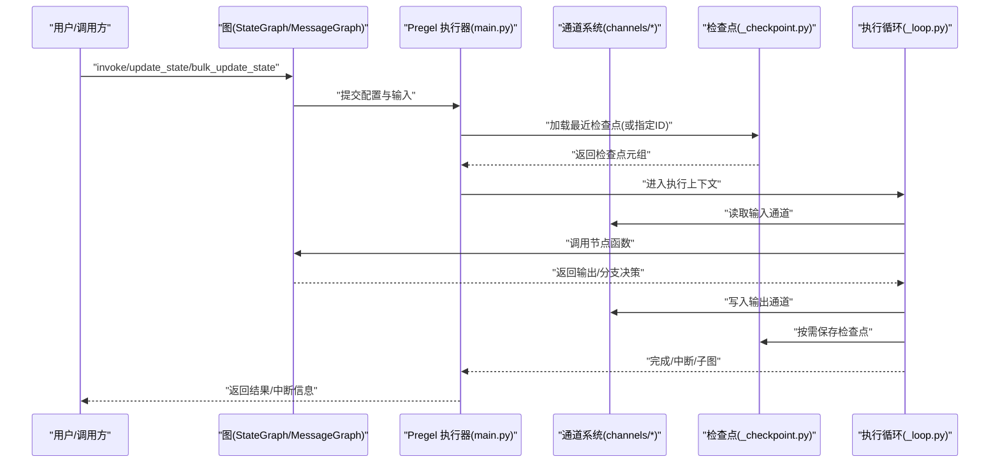
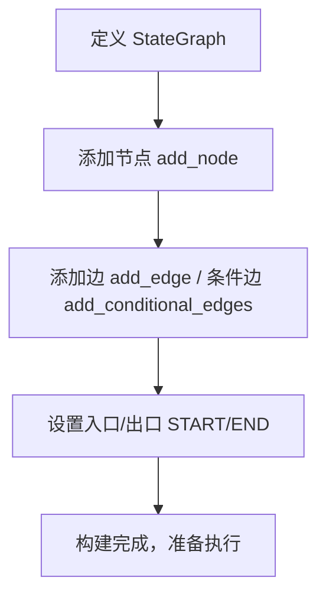
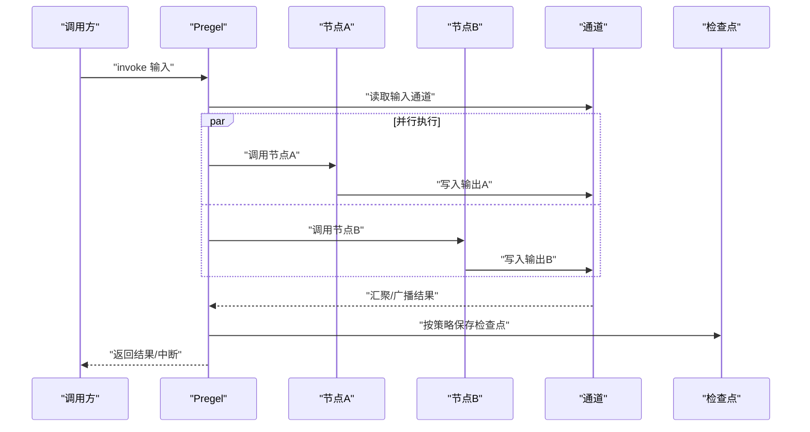
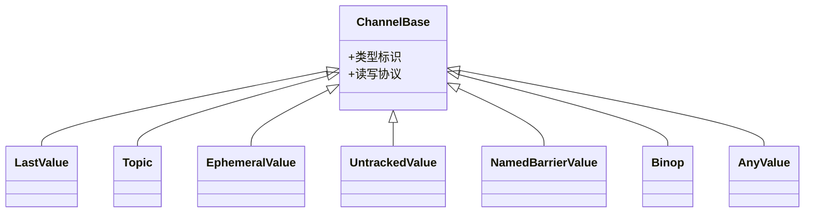
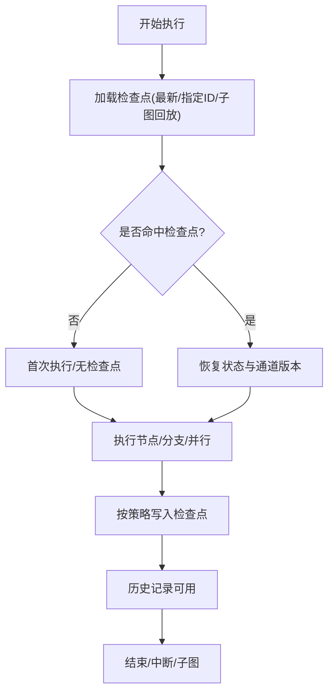
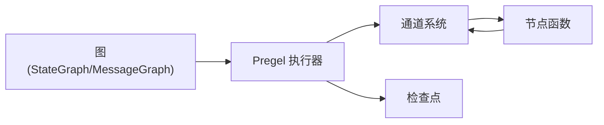

# 核心概念

<cite>
**本文引用的文件**
- [README.md](file://README.md)
- [__init__.py](file://libs/langgraph/langgraph/graph/__init__.py)
- [state.py](file://libs/langgraph/langgraph/graph/state.py)
- [message.py](file://libs/langgraph/langgraph/graph/message.py)
- [_node.py](file://libs/langgraph/langgraph/graph/_node.py)
- [_branch.py](file://libs/langgraph/langgraph/graph/_branch.py)
- [main.py](file://libs/langgraph/langgraph/pregel/main.py)
- [_loop.py](file://libs/langgraph/langgraph/pregel/_loop.py)
- [protocol.py](file://libs/langgraph/langgraph/pregel/protocol.py)
- [_checkpoint.py](file://libs/langgraph/langgraph/pregel/_checkpoint.py)
- [base.py](file://libs/langgraph/langgraph/channels/base.py)
- [last_value.py](file://libs/langgraph/langgraph/channels/last_value.py)
- [topic.py](file://libs/langgraph/langgraph/channels/topic.py)
- [ephemeral_value.py](file://libs/langgraph/langgraph/channels/ephemeral_value.py)
- [untracked_value.py](file://libs/langgraph/langgraph/channels/untracked_value.py)
- [named_barrier_value.py](file://libs/langgraph/langgraph/channels/named_barrier_value.py)
- [binop.py](file://libs/langgraph/langgraph/channels/binop.py)
- [any_value.py](file://libs/langgraph/langgraph/channels/any_value.py)
- [test_subgraph_persistence.py](file://libs/langgraph/tests/test_subgraph_persistence.py)
- [test_subgraph_persistence_async.py](file://libs/langgraph/tests/test_subgraph_persistence_async.py)
</cite>

## 目录
1. [引言](#引言)
2. [项目结构](#项目结构)
3. [核心组件](#核心组件)
4. [架构总览](#架构总览)
5. [详细组件分析](#详细组件分析)
6. [依赖分析](#依赖分析)
7. [性能考虑](#性能考虑)
8. [故障排查指南](#故障排查指南)
9. [结论](#结论)
10. [附录](#附录)

## 引言
本文件面向初学者与有经验的开发者，系统性梳理 LangGraph 的核心概念：状态化代理、图构建与编译、状态更新与并行执行、通道系统、检查点机制等。LangGraph 提供低层编排能力，支持持久化执行、人机协同、可调试的长时运行状态化工作流，并与 LangChain 生态无缝集成。

## 项目结构
LangGraph 的核心位于 libs/langgraph 模块，围绕“图（Graph）”“Pregel 执行引擎”“通道（Channels）”“检查点（Checkpoint）”四大支柱组织。上层通过 StateGraph/MessagesGraph 构建图，底层由 Pregel 负责并发调度与状态管理；通道抽象了数据在节点间的聚合与传播；检查点负责状态持久化与恢复。

**图示来源**
- [__init__.py:1-12](file://libs/langgraph/langgraph/graph/__init__.py#L1-L12)
- [state.py](file://libs/langgraph/langgraph/graph/state.py)
- [message.py](file://libs/langgraph/langgraph/graph/message.py)
- [main.py:1305-1329](file://libs/langgraph/langgraph/pregel/main.py#L1305-L1329)
- [_loop.py:1136-1361](file://libs/langgraph/langgraph/pregel/_loop.py#L1136-L1361)
- [_checkpoint.py](file://libs/langgraph/langgraph/pregel/_checkpoint.py)
- [base.py](file://libs/langgraph/langgraph/channels/base.py)
- [last_value.py](file://libs/langgraph/langgraph/channels/last_value.py)
- [topic.py](file://libs/langgraph/langgraph/channels/topic.py)
- [ephemeral_value.py](file://libs/langgraph/langgraph/channels/ephemeral_value.py)
- [untracked_value.py](file://libs/langgraph/langgraph/channels/untracked_value.py)
- [named_barrier_value.py](file://libs/langgraph/langgraph/channels/named_barrier_value.py)
- [binop.py](file://libs/langgraph/langgraph/channels/binop.py)
- [any_value.py](file://libs/langgraph/langgraph/channels/any_value.py)
- [protocol.py:52-105](file://libs/langgraph/langgraph/pregel/protocol.py#L52-L105)

**章节来源**
- [README.md:1-83](file://README.md#L1-L83)
- [__init__.py:1-12](file://libs/langgraph/langgraph/graph/__init__.py#L1-L12)

## 核心组件
- 图（Graph）
  - StateGraph：以键值状态为中心的状态化图，适合结构化状态与条件分支。
  - MessageGraph：以消息序列为中心的消息图，适合对话/多轮交互。
- 执行引擎（Pregel）
  - main.py 中的主执行器负责启动、调度、读写通道、调用节点函数、处理中断与子图。
  - _loop.py 实现执行上下文与恢复逻辑，支持从检查点恢复、子图回放、时间旅行重放。
- 通道（Channels）
  - 抽象通道基类与多种内置通道类型，控制数据如何汇聚、覆盖、广播与清空。
- 检查点（Checkpoint）
  - 将状态快照持久化，支持失败恢复、人机中断后恢复、历史查询与回放。
- 协议（Protocol）
  - 定义统一的状态查询、历史查询、批量更新等接口，便于外部系统集成。

**章节来源**
- [__init__.py:1-12](file://libs/langgraph/langgraph/graph/__init__.py#L1-L12)
- [main.py:1305-1329](file://libs/langgraph/langgraph/pregel/main.py#L1305-L1329)
- [_loop.py:1136-1361](file://libs/langgraph/langgraph/pregel/_loop.py#L1136-L1361)
- [protocol.py:52-105](file://libs/langgraph/langgraph/pregel/protocol.py#L52-L105)

## 架构总览
LangGraph 的执行路径从“图定义”到“Pregel 执行”，再到“通道聚合/广播”，最终由“检查点”持久化状态。下图展示一次典型调用的端到端流程：

**图示来源**
- [main.py:1305-1329](file://libs/langgraph/langgraph/pregel/main.py#L1305-L1329)
- [_loop.py:1136-1361](file://libs/langgraph/langgraph/pregel/_loop.py#L1136-L1361)
- [_checkpoint.py](file://libs/langgraph/langgraph/pregel/_checkpoint.py)
- [protocol.py:52-105](file://libs/langgraph/langgraph/pregel/protocol.py#L52-L105)

## 详细组件分析

### 状态化代理与传统流程图的区别与优势
- 区别
  - 传统流程图通常是一次性执行的线性/分支流程；状态化代理以“状态”为核心，节点可多次执行，状态在图内累积与共享。
  - 传统流程图难以表达“持续推理、记忆与人机协作”场景；状态化代理天然支持中断、恢复、历史回放。
- 优势
  - 可靠性：通过检查点实现“故障即恢复、长时间运行不丢失状态”。
  - 可调试性：可观测状态快照、历史轨迹与通道读写。
  - 可扩展性：通道抽象支持广播、汇聚、屏障同步，便于构建复杂并行与协作模式。

**章节来源**
- [README.md:35-46](file://README.md#L35-L46)

### 图构建与编译
- StateGraph
  - 使用键值对描述状态结构，通过 add_node/add_edge/add_conditional_edges 建图；通过 add_end_node/入口/出口常量组织流程。
  - 条件分支通过 add_conditional_edges 定义，结合状态读取进行路由。
- MessageGraph
  - 以消息列表为状态，适合对话/多轮交互；通过 add_node/add_edge 构建消息流转图。
- 编译/验证
  - 构图完成后，Pregel 在执行前进行图结构与通道一致性校验，确保节点、通道、分支合法。

**图示来源**
- [state.py](file://libs/langgraph/langgraph/graph/state.py)
- [message.py](file://libs/langgraph/langgraph/graph/message.py)
- [_node.py](file://libs/langgraph/langgraph/graph/_node.py)
- [_branch.py](file://libs/langgraph/langgraph/graph/_branch.py)

**章节来源**
- [__init__.py:1-12](file://libs/langgraph/langgraph/graph/__init__.py#L1-L12)
- [state.py](file://libs/langgraph/langgraph/graph/state.py)
- [message.py](file://libs/langgraph/langgraph/graph/message.py)
- [_node.py](file://libs/langgraph/langgraph/graph/_node.py)
- [_branch.py](file://libs/langgraph/langgraph/graph/_branch.py)

### 状态更新机制与并行执行模型
- 状态更新
  - update_state/abulk_update_state：按键写入状态，支持“作为某个节点写入”的语义标记。
  - get_state/aget_state：读取当前状态快照；get_state_history/aget_state_history：读取历史快照序列。
- 并行执行
  - Pregel 通过通道聚合与广播实现并行：多个节点可同时读取同一输入通道，各自写入输出通道。
  - named_barrier_value 支持“汇聚等待”：仅当所有参与者到达屏障时才触发下游节点。
- 中断与恢复
  - 执行过程中可插入中断；恢复时从最近检查点继续，保持状态一致。

**图示来源**
- [protocol.py:52-105](file://libs/langgraph/langgraph/pregel/protocol.py#L52-L105)
- [main.py:1305-1329](file://libs/langgraph/langgraph/pregel/main.py#L1305-L1329)
- [_loop.py:1136-1361](file://libs/langgraph/langgraph/pregel/_loop.py#L1136-L1361)

**章节来源**
- [protocol.py:52-105](file://libs/langgraph/langgraph/pregel/protocol.py#L52-L105)
- [main.py:1305-1329](file://libs/langgraph/langgraph/pregel/main.py#L1305-L1329)
- [_loop.py:1136-1361](file://libs/langgraph/langgraph/pregel/_loop.py#L1136-L1361)

### 通道系统设计与类型
通道是连接节点与状态的核心抽象，决定数据如何在节点间传播与聚合。主要类型包括：
- last_value：覆盖式写入，保留最新值。
- topic：广播式写入，所有订阅者都能收到。
- ephemeral_value：临时值，通常用于路由/中断信号，读取后即失效。
- untracked_value：不参与检查点序列追踪，适合一次性事件。
- named_barrier_value：命名屏障，等待所有命名参与者到达后触发。
- binop：二元聚合（如求和），适合计数/合并。
- any_value：任意值，常用于灵活通道。

**图示来源**
- [base.py](file://libs/langgraph/langgraph/channels/base.py)
- [last_value.py](file://libs/langgraph/langgraph/channels/last_value.py)
- [topic.py](file://libs/langgraph/langgraph/channels/topic.py)
- [ephemeral_value.py](file://libs/langgraph/langgraph/channels/ephemeral_value.py)
- [untracked_value.py](file://libs/langgraph/langgraph/channels/untracked_value.py)
- [named_barrier_value.py](file://libs/langgraph/langgraph/channels/named_barrier_value.py)
- [binop.py](file://libs/langgraph/langgraph/channels/binop.py)
- [any_value.py](file://libs/langgraph/langgraph/channels/any_value.py)

**章节来源**
- [base.py](file://libs/langgraph/langgraph/channels/base.py)
- [last_value.py](file://libs/langgraph/langgraph/channels/last_value.py)
- [topic.py](file://libs/langgraph/langgraph/channels/topic.py)
- [ephemeral_value.py](file://libs/langgraph/langgraph/channels/ephemeral_value.py)
- [untracked_value.py](file://libs/langgraph/langgraph/channels/untracked_value.py)
- [named_barrier_value.py](file://libs/langgraph/langgraph/channels/named_barrier_value.py)
- [binop.py](file://libs/langgraph/langgraph/channels/binop.py)
- [any_value.py](file://libs/langgraph/langgraph/channels/any_value.py)

### 检查点机制：原理与实现
- 原理
  - 将“当前状态、通道快照、版本信息、时间戳”等打包保存，支持：
    - 失败恢复：从最近检查点继续执行。
    - 人机中断：暂停后恢复，状态不丢失。
    - 历史回放：按时间轴重放执行，定位问题。
- 实现要点
  - 加载：根据配置选择“最新”“指定ID”“子图回放”等策略。
  - 写入：在关键节点/步骤后按策略保存，避免过度频繁写入。
  - 查询：支持历史快照迭代、过滤、分页。
- 子图隔离
  - 不同子图通过命名空间隔离，互不影响；测试覆盖了跨子图状态隔离与累积行为。

**图示来源**
- [_loop.py:1136-1361](file://libs/langgraph/langgraph/pregel/_loop.py#L1136-L1361)
- [main.py:1305-1329](file://libs/langgraph/langgraph/pregel/main.py#L1305-L1329)
- [protocol.py:52-105](file://libs/langgraph/langgraph/pregel/protocol.py#L52-L105)

**章节来源**
- [_loop.py:1136-1361](file://libs/langgraph/langgraph/pregel/_loop.py#L1136-L1361)
- [main.py:1305-1329](file://libs/langgraph/langgraph/pregel/main.py#L1305-L1329)
- [protocol.py:52-105](file://libs/langgraph/langgraph/pregel/protocol.py#L52-L105)
- [test_subgraph_persistence.py:521-558](file://libs/langgraph/tests/test_subgraph_persistence.py#L521-L558)
- [test_subgraph_persistence_async.py:537-575](file://libs/langgraph/tests/test_subgraph_persistence_async.py#L537-L575)

## 依赖分析
- 组件耦合
  - 图定义与执行器解耦：图只描述结构，执行器负责调度与状态管理。
  - 通道系统与执行器松耦合：通道只暴露读写协议，具体聚合策略可替换。
  - 检查点与执行器弱耦合：通过统一接口注入，可插拔不同存储实现。
- 关键依赖链
  - 图 → 执行器 → 通道 → 节点函数 → 通道 → 检查点
- 潜在环路
  - 通过命名空间与屏障通道避免死锁；条件分支与 START/END 明确终止。

**图示来源**
- [__init__.py:1-12](file://libs/langgraph/langgraph/graph/__init__.py#L1-L12)
- [main.py:1305-1329](file://libs/langgraph/langgraph/pregel/main.py#L1305-L1329)
- [protocol.py:52-105](file://libs/langgraph/langgraph/pregel/protocol.py#L52-L105)

**章节来源**
- [__init__.py:1-12](file://libs/langgraph/langgraph/graph/__init__.py#L1-L12)
- [main.py:1305-1329](file://libs/langgraph/langgraph/pregel/main.py#L1305-L1329)
- [protocol.py:52-105](file://libs/langgraph/langgraph/pregel/protocol.py#L52-L105)

## 性能考虑
- 通道选择
  - 高频广播使用 topic；仅需最新值使用 last_value；临时信号使用 ephemeral_value。
- 检查点频率
  - 避免每步都写入；在关键节点或分支处批量写入，减少 IO。
- 并行度
  - 合理拆分节点，利用 named_barrier_value 控制同步点，避免过度串行。
- 内存与序列化
  - 使用高效的序列化策略（如 JSON+ 或 msgpack），并限制状态体量。

## 故障排查指南
- 常见问题
  - 无检查点：调用 get_state 时若未设置检查点会报错，需配置检查点保存器。
  - 子图未找到：通过命名空间查找子图失败时会抛出异常，确认命名空间与子图名称一致。
  - 中断后无法恢复：确认检查点已保存且恢复配置正确。
- 排查步骤
  - 使用 get_state/get_state_history 获取当前状态与历史快照。
  - 检查通道读写是否符合预期（覆盖/广播/屏障）。
  - 验证条件分支与 START/END 是否完整。
- 测试参考
  - 子图状态隔离与累积行为可通过相关测试用例验证。

**章节来源**
- [main.py:1305-1329](file://libs/langgraph/langgraph/pregel/main.py#L1305-L1329)
- [protocol.py:52-105](file://libs/langgraph/langgraph/pregel/protocol.py#L52-L105)
- [test_subgraph_persistence.py:521-558](file://libs/langgraph/tests/test_subgraph_persistence.py#L521-L558)
- [test_subgraph_persistence_async.py:537-575](file://libs/langgraph/tests/test_subgraph_persistence_async.py#L537-L575)

## 结论
LangGraph 以“状态化”“通道抽象”“检查点持久化”“并行执行”为核心，提供了构建长时运行、可调试、可扩展的智能体与工作流的基础设施。通过清晰的图定义与强健的执行引擎，开发者可以快速搭建从简单分支到复杂并行协作的系统，并在生产环境中稳定运行与演进。

## 附录
- 快速上手建议
  - 从 StateGraph 开始，定义状态键与节点；逐步引入条件分支与并行节点。
  - 使用 last_value 与 topic 组合满足常见聚合与广播需求。
  - 为关键路径启用检查点，开启中断与恢复能力。
- 进一步阅读
  - 参考官方文档与示例笔记本，了解高级模式（子图、人机协同、RAG 等）。