# PostgreSQL 检查点实现

<cite>
**本文档引用的文件**
- [libs/checkpoint-postgres/pyproject.toml](file://libs/checkpoint-postgres/pyproject.toml)
- [libs/checkpoint-postgres/README.md](file://libs/checkpoint-postgres/README.md)
- [libs/checkpoint-postgres/langgraph/checkpoint/postgres/__init__.py](file://libs/checkpoint-postgres/langgraph/checkpoint/postgres/__init__.py)
- [libs/checkpoint-postgres/langgraph/checkpoint/postgres/base.py](file://libs/checkpoint-postgres/langgraph/checkpoint/postgres/base.py)
- [libs/checkpoint-postgres/langgraph/checkpoint/postgres/_internal.py](file://libs/checkpoint-postgres/langgraph/checkpoint/postgres/_internal.py)
- [libs/checkpoint-postgres/langgraph/checkpoint/postgres/_ainternal.py](file://libs/checkpoint-postgres/langgraph/checkpoint/postgres/_ainternal.py)
- [libs/checkpoint-postgres/langgraph/checkpoint/postgres/aio.py](file://libs/checkpoint-postgres/langgraph/checkpoint/postgres/aio.py)
</cite>

## 目录
1. [简介](#简介)
2. [项目结构](#项目结构)
3. [核心组件](#核心组件)
4. [架构概览](#架构概览)
5. [详细组件分析](#详细组件分析)
6. [依赖关系分析](#依赖关系分析)
7. [性能考虑](#性能考虑)
8. [故障排除指南](#故障排除指南)
9. [结论](#结论)
10. [附录](#附录)

## 简介

LangGraph 的 PostgreSQL 检查点实现提供了一个企业级的持久化解决方案，用于保存和恢复有状态图的执行进度。该实现基于 Psycopg 3 数据库驱动程序，提供了同步和异步两种接口，支持连接池管理和管道优化。

该检查点系统专为生产环境设计，具有以下关键特性：
- 基于 PostgreSQL 的企业级数据持久化
- 支持连接池以提高并发性能
- 提供同步和异步操作接口
- 内置数据库迁移和版本管理
- 支持检查点写入的原子性操作
- 完整的错误处理和资源管理

## 项目结构

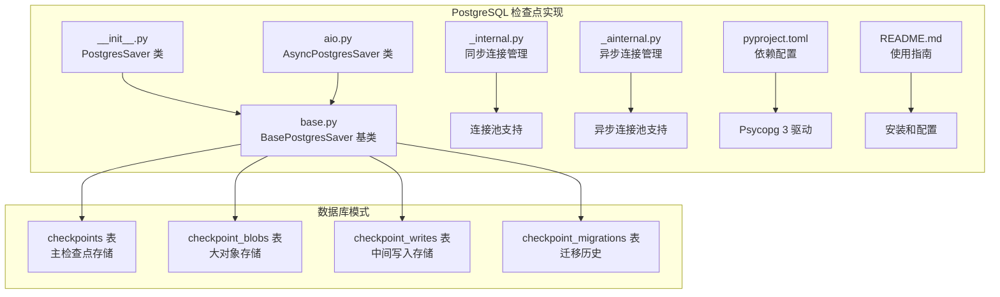

**图表来源**
- [libs/checkpoint-postgres/langgraph/checkpoint/postgres/__init__.py:1-50](file://libs/checkpoint-postgres/langgraph/checkpoint/postgres/__init__.py#L1-L50)
- [libs/checkpoint-postgres/langgraph/checkpoint/postgres/base.py:37-85](file://libs/checkpoint-postgres/langgraph/checkpoint/postgres/base.py#L37-L85)

**章节来源**
- [libs/checkpoint-postgres/pyproject.toml:14-19](file://libs/checkpoint-postgres/pyproject.toml#L14-L19)
- [libs/checkpoint-postgres/README.md:1-116](file://libs/checkpoint-postgres/README.md#L1-L116)

## 核心组件

### PostgresSaver（同步接口）

PostgresSaver 是 PostgreSQL 检查点实现的主要入口点，提供线程安全的同步操作接口：

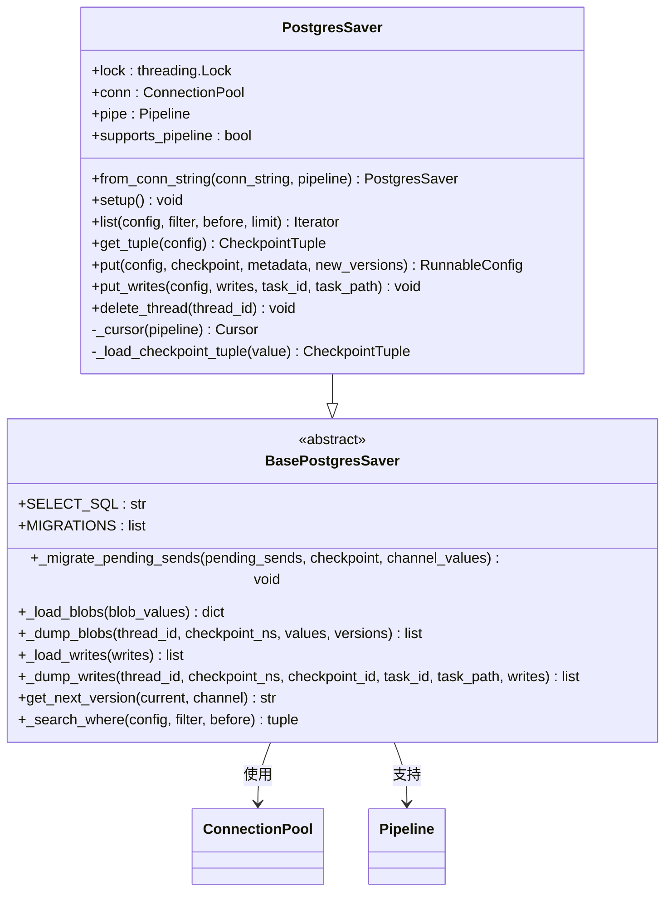

**图表来源**
- [libs/checkpoint-postgres/langgraph/checkpoint/postgres/__init__.py:32-53](file://libs/checkpoint-postgres/langgraph/checkpoint/postgres/__init__.py#L32-L53)
- [libs/checkpoint-postgres/langgraph/checkpoint/postgres/base.py:156-166](file://libs/checkpoint-postgres/langgraph/checkpoint/postgres/base.py#L156-L166)

### AsyncPostgresSaver（异步接口）

AsyncPostgresSaver 提供完全异步的操作接口，适用于高性能应用场景：

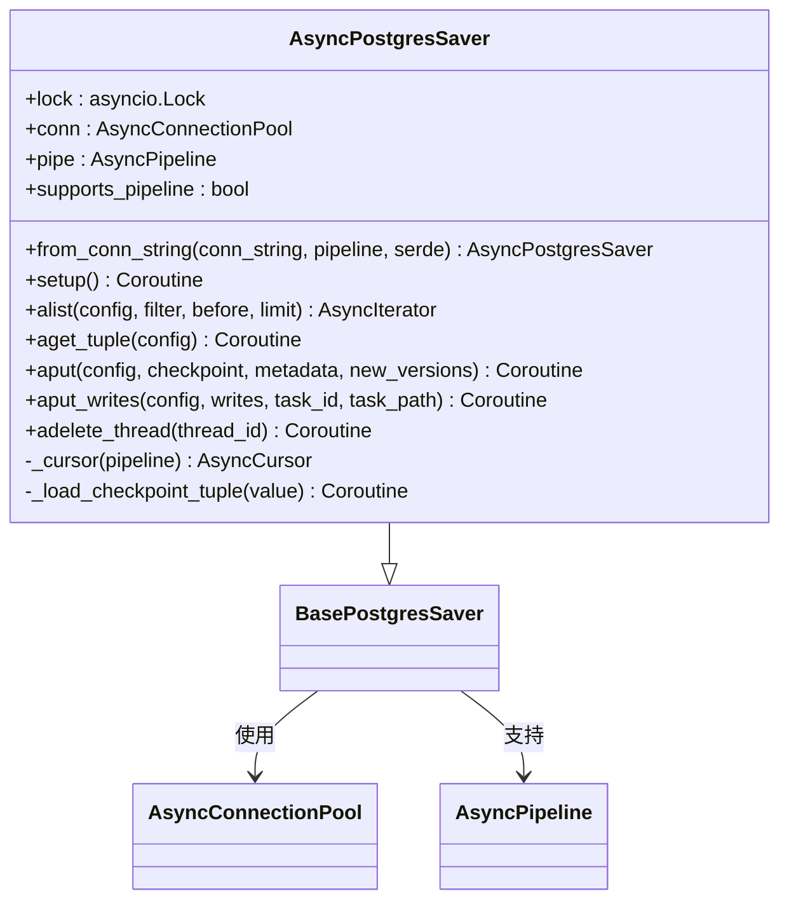

**图表来源**
- [libs/checkpoint-postgres/langgraph/checkpoint/postgres/aio.py:32-54](file://libs/checkpoint-postgres/langgraph/checkpoint/postgres/aio.py#L32-L54)
- [libs/checkpoint-postgres/langgraph/checkpoint/postgres/base.py:156-166](file://libs/checkpoint-postgres/langgraph/checkpoint/postgres/base.py#L156-L166)

**章节来源**
- [libs/checkpoint-postgres/langgraph/checkpoint/postgres/__init__.py:32-477](file://libs/checkpoint-postgres/langgraph/checkpoint/postgres/__init__.py#L32-L477)
- [libs/checkpoint-postgres/langgraph/checkpoint/postgres/aio.py:32-583](file://libs/checkpoint-postgres/langgraph/checkpoint/postgres/aio.py#L32-L583)

## 架构概览

### 数据库模式设计

PostgreSQL 检查点系统采用多表设计来优化不同类型的存储需求：

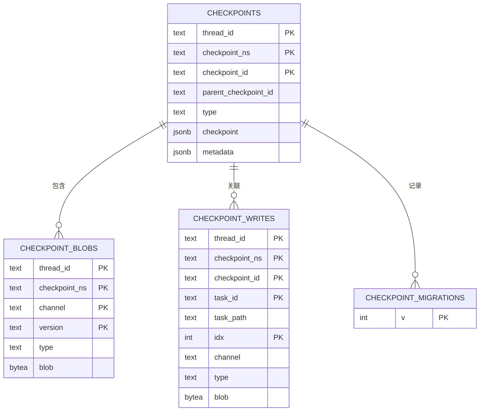

**图表来源**
- [libs/checkpoint-postgres/langgraph/checkpoint/postgres/base.py:41-85](file://libs/checkpoint-postgres/langgraph/checkpoint/postgres/base.py#L41-L85)

### 连接管理架构

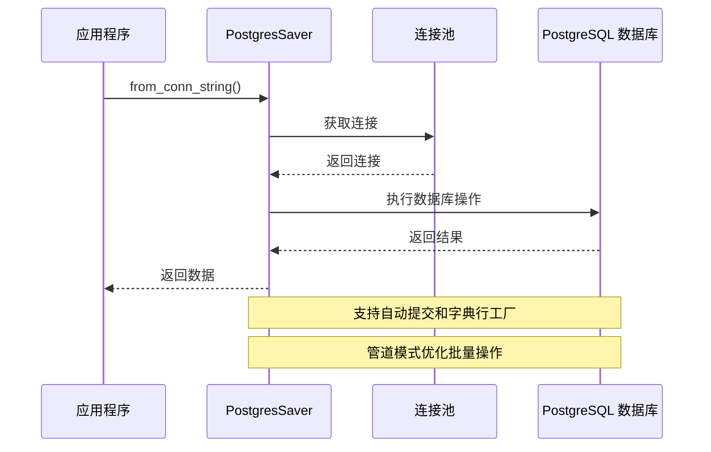

**图表来源**
- [libs/checkpoint-postgres/langgraph/checkpoint/postgres/_internal.py:13-21](file://libs/checkpoint-postgres/langgraph/checkpoint/postgres/_internal.py#L13-L21)
- [libs/checkpoint-postgres/langgraph/checkpoint/postgres/__init__.py:55-76](file://libs/checkpoint-postgres/langgraph/checkpoint/postgres/__init__.py#L55-L76)

**章节来源**
- [libs/checkpoint-postgres/langgraph/checkpoint/postgres/base.py:37-85](file://libs/checkpoint-postgres/langgraph/checkpoint/postgres/base.py#L37-L85)
- [libs/checkpoint-postgres/langgraph/checkpoint/postgres/_internal.py:1-22](file://libs/checkpoint-postgres/langgraph/checkpoint/postgres/_internal.py#L1-L22)

## 详细组件分析

### 数据序列化和反序列化

检查点系统实现了高效的序列化机制，将复杂的数据结构转换为数据库可存储的格式：

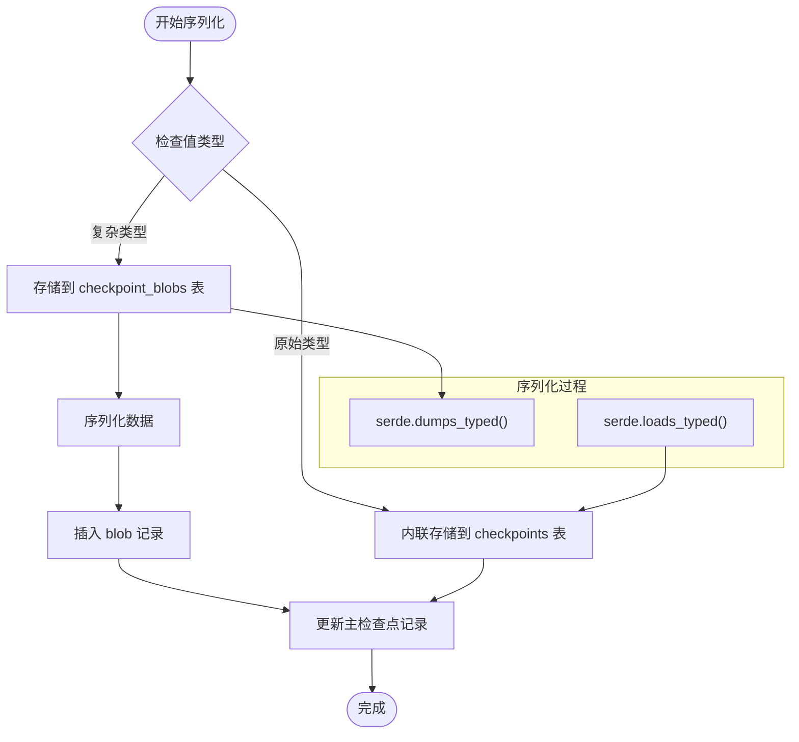

**图表来源**
- [libs/checkpoint-postgres/langgraph/checkpoint/postgres/__init__.py:304-334](file://libs/checkpoint-postgres/langgraph/checkpoint/postgres/__init__.py#L304-L334)
- [libs/checkpoint-postgres/langgraph/checkpoint/postgres/base.py:187-222](file://libs/checkpoint-postgres/langgraph/checkpoint/postgres/base.py#L187-L222)

### 检查点写入流程

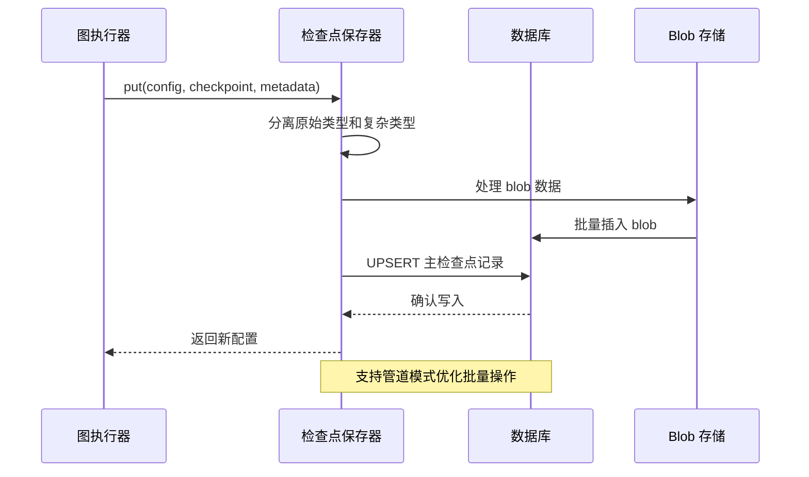

**图表来源**
- [libs/checkpoint-postgres/langgraph/checkpoint/postgres/__init__.py:255-334](file://libs/checkpoint-postgres/langgraph/checkpoint/postgres/__init__.py#L255-L334)
- [libs/checkpoint-postgres/langgraph/checkpoint/postgres/base.py:125-138](file://libs/checkpoint-postgres/langgraph/checkpoint/postgres/base.py#L125-L138)

### 异步操作优化

AsyncPostgresSaver 提供了完整的异步操作支持，包括：

- **异步连接管理**：使用 `AsyncConnectionPool` 和 `AsyncPipeline`
- **线程安全保证**：通过 `asyncio.Lock` 确保并发安全
- **阻塞调用检测**：防止在主线程中进行阻塞操作
- **智能资源管理**：自动处理连接和游标的生命周期

**章节来源**
- [libs/checkpoint-postgres/langgraph/checkpoint/postgres/aio.py:35-83](file://libs/checkpoint-postgres/langgraph/checkpoint/postgres/aio.py#L35-L83)
- [libs/checkpoint-postgres/langgraph/checkpoint/postgres/aio.py:352-392](file://libs/checkpoint-postgres/langgraph/checkpoint/postgres/aio.py#L352-L392)

## 依赖关系分析

### 外部依赖

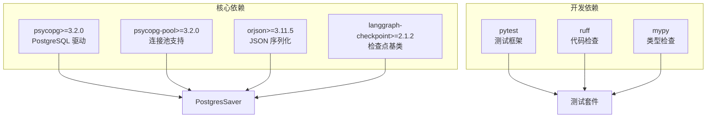

**图表来源**
- [libs/checkpoint-postgres/pyproject.toml:14-45](file://libs/checkpoint-postgres/pyproject.toml#L14-L45)

### 内部模块依赖

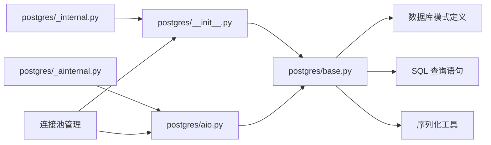

**图表来源**
- [libs/checkpoint-postgres/langgraph/checkpoint/postgres/__init__.py:25-27](file://libs/checkpoint-postgres/langgraph/checkpoint/postgres/__init__.py#L25-L27)
- [libs/checkpoint-postgres/langgraph/checkpoint/postgres/aio.py:25-27](file://libs/checkpoint-postgres/langgraph/checkpoint/postgres/aio.py#L25-L27)

**章节来源**
- [libs/checkpoint-postgres/pyproject.toml:14-87](file://libs/checkpoint-postgres/pyproject.toml#L14-L87)

## 性能考虑

### 连接池优化

PostgreSQL 检查点实现提供了多种性能优化策略：

1. **连接池复用**：通过 `ConnectionPool` 和 `AsyncConnectionPool` 减少连接建立开销
2. **管道模式**：使用 `Pipeline` 和 `AsyncPipeline` 批量执行多个操作
3. **索引优化**：预创建必要的索引以加速查询操作
4. **内存管理**：智能的内存使用和垃圾回收策略

### 并发控制

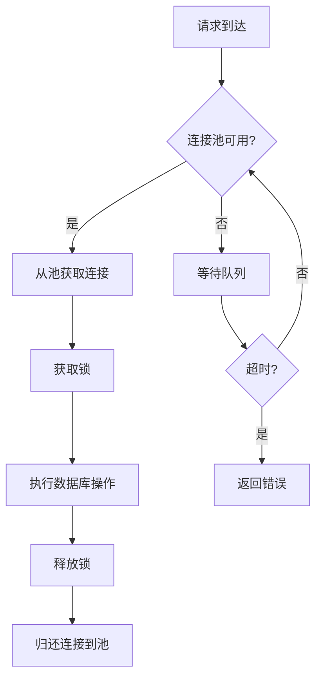

**图表来源**
- [libs/checkpoint-postgres/langgraph/checkpoint/postgres/_internal.py:13-21](file://libs/checkpoint-postgres/langgraph/checkpoint/postgres/_internal.py#L13-L21)
- [libs/checkpoint-postgres/langgraph/checkpoint/postgres/_ainternal.py:13-23](file://libs/checkpoint-postgres/langgraph/checkpoint/postgres/_ainternal.py#L13-L23)

### 数据库优化建议

1. **索引策略**：确保 `thread_id` 字段上有适当的索引
2. **分区策略**：对于大量数据，考虑按时间或业务逻辑进行表分区
3. **缓存策略**：结合应用层缓存减少数据库访问频率
4. **监控指标**：定期监控查询性能和连接池使用情况

## 故障排除指南

### 常见问题和解决方案

#### 连接参数配置错误

**问题描述**：使用 PostgreSQL 检查点时出现连接错误或类型转换异常

**解决方案**：
1. 确保使用 `autocommit=True` 参数
2. 设置 `row_factory=dict_row` 或使用 `from psycopg.rows import dict_row`
3. 验证数据库连接字符串格式

#### 版本兼容性问题

**问题描述**：与 langgraph 版本不兼容导致功能异常

**解决方案**：
1. 检查 langgraph 版本是否满足最低要求
2. 升级到兼容的版本组合
3. 查看警告信息中的版本兼容性提示

#### 性能问题

**问题描述**：检查点操作响应缓慢

**解决方案**：
1. 启用连接池以复用数据库连接
2. 使用管道模式批量执行操作
3. 优化数据库索引和查询计划
4. 考虑分页处理大量数据

**章节来源**
- [libs/checkpoint-postgres/README.md:11-30](file://libs/checkpoint-postgres/README.md#L11-L30)
- [libs/checkpoint-postgres/langgraph/checkpoint/postgres/base.py:21-31](file://libs/checkpoint-postgres/langgraph/checkpoint/postgres/base.py#L21-L31)

### 错误处理机制

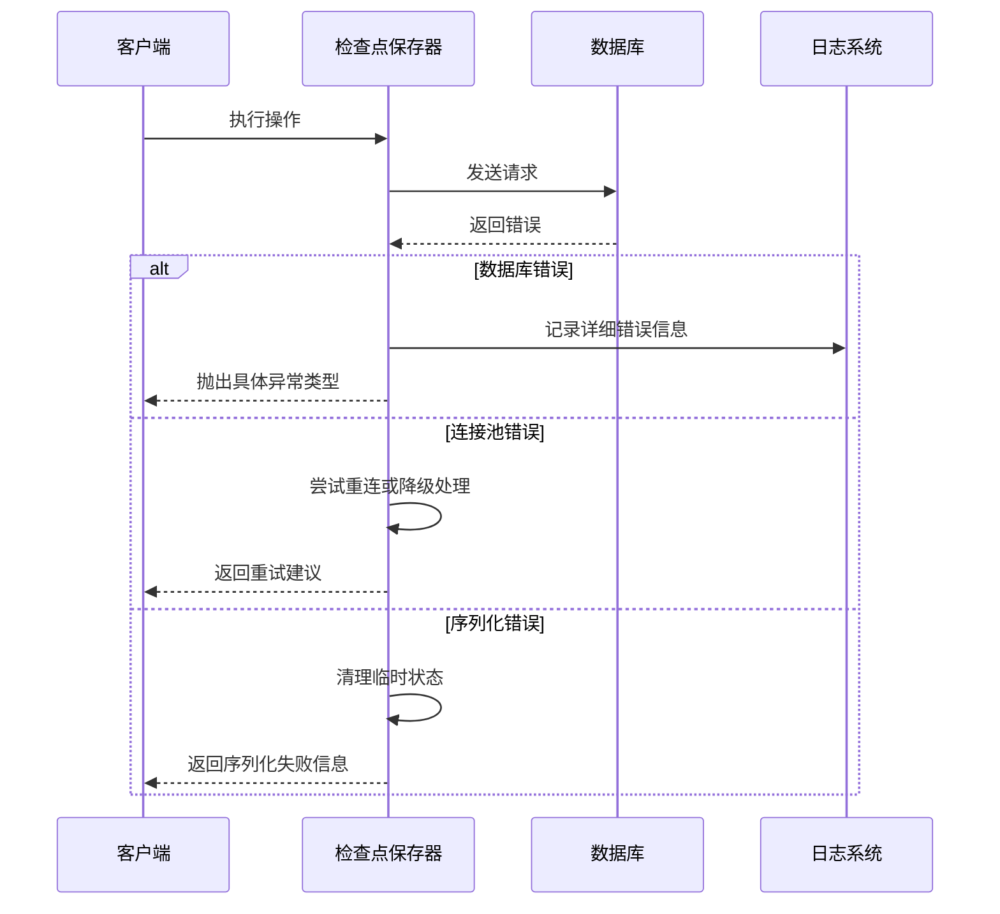

**图表来源**
- [libs/checkpoint-postgres/langgraph/checkpoint/postgres/__init__.py:394-432](file://libs/checkpoint-postgres/langgraph/checkpoint/postgres/__init__.py#L394-L432)
- [libs/checkpoint-postgres/langgraph/checkpoint/postgres/aio.py:352-392](file://libs/checkpoint-postgres/langgraph/checkpoint/postgres/aio.py#L352-L392)

## 结论

PostgreSQL 检查点实现为企业级应用提供了可靠的持久化解决方案。其设计特点包括：

1. **企业级可靠性**：基于成熟的 PostgreSQL 数据库，提供 ACID 事务保证
2. **高性能优化**：支持连接池、管道模式和智能索引策略
3. **灵活的接口设计**：同时提供同步和异步操作接口
4. **完善的错误处理**：全面的异常处理和资源管理机制
5. **易于维护**：清晰的代码结构和完整的文档支持

该实现特别适合需要高可靠性和复杂数据持久化的生产环境，能够有效支持大规模的并发操作和长期运行的应用场景。

## 附录

### 部署最佳实践

1. **数据库配置**
   - 使用专用的数据库用户和权限
   - 配置适当的连接超时和空闲超时
   - 设置合理的连接池大小

2. **监控和告警**
   - 监控数据库连接池使用率
   - 跟踪检查点操作的延迟和成功率
   - 设置数据库性能指标告警

3. **备份策略**
   - 定期备份检查点数据
   - 测试恢复流程的有效性
   - 考虑增量备份策略

### 性能基准测试

建议在生产部署前进行以下性能测试：
- 连接池大小对吞吐量的影响
- 管道模式与单个操作的性能对比
- 不同数据大小对序列化性能的影响
- 并发场景下的系统稳定性