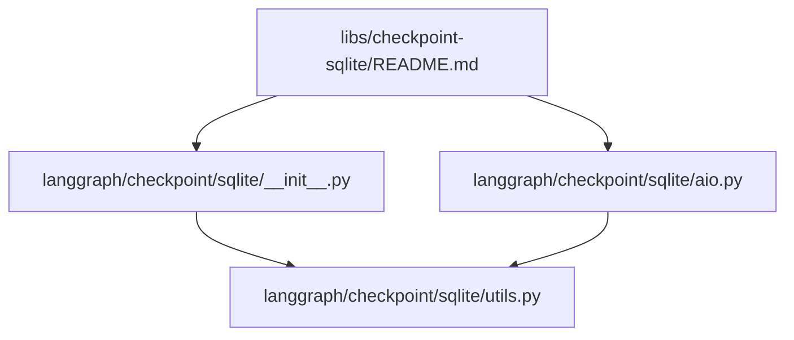
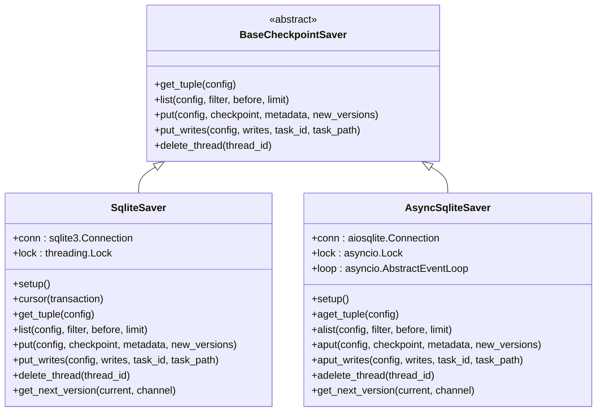
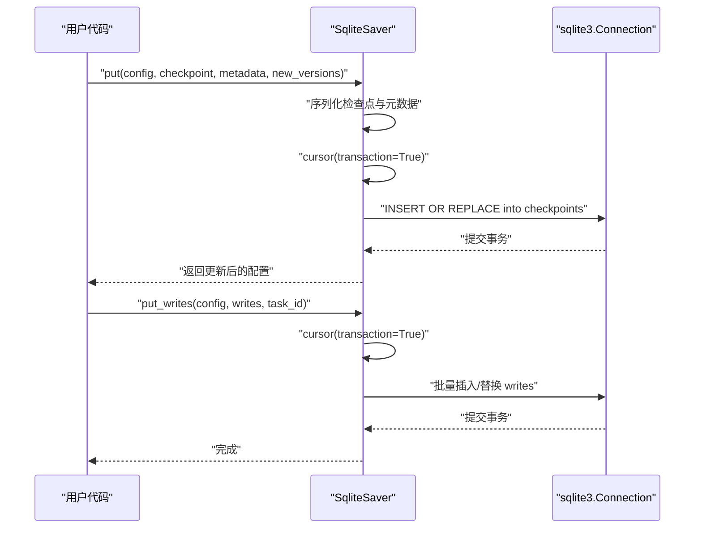
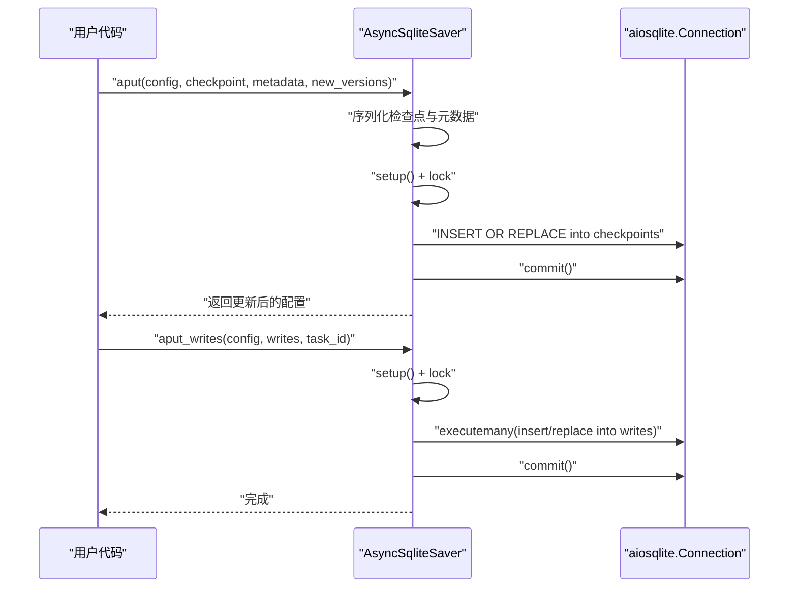
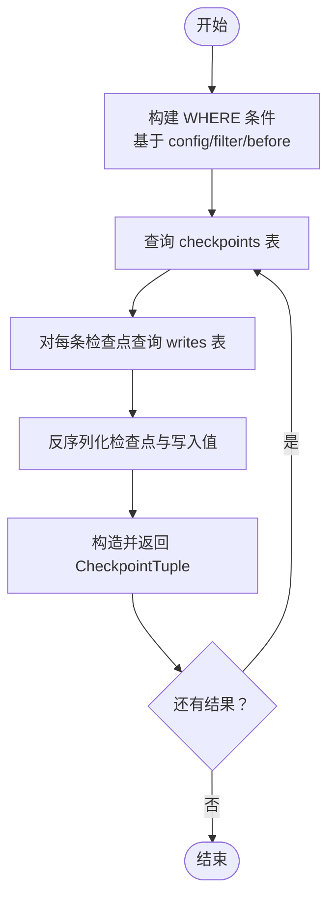
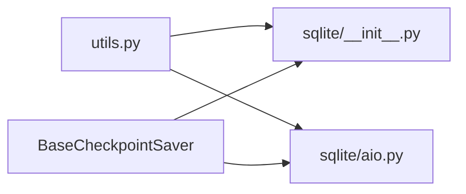

# SQLite 检查点实现

<cite>
**本文引用的文件**
- [libs/checkpoint-sqlite/README.md](file://libs/checkpoint-sqlite/README.md)
- [libs/checkpoint-sqlite/langgraph/checkpoint/sqlite/__init__.py](file://libs/checkpoint-sqlite/langgraph/checkpoint/sqlite/__init__.py)
- [libs/checkpoint-sqlite/langgraph/checkpoint/sqlite/aio.py](file://libs/checkpoint-sqlite/langgraph/checkpoint/sqlite/aio.py)
- [libs/checkpoint-sqlite/langgraph/checkpoint/sqlite/utils.py](file://libs/checkpoint-sqlite/langgraph/checkpoint/sqlite/utils.py)
</cite>

## 目录
1. [简介](#简介)
2. [项目结构](#项目结构)
3. [核心组件](#核心组件)
4. [架构总览](#架构总览)
5. [详细组件分析](#详细组件分析)
6. [依赖分析](#依赖分析)
7. [性能考虑](#性能考虑)
8. [故障排查指南](#故障排查指南)
9. [结论](#结论)
10. [附录](#附录)

## 简介
本文件围绕 LangGraph 的 SQLite 检查点实现进行系统化文档化，重点覆盖以下方面：
- 数据库表结构设计与索引策略
- 查询优化与元数据过滤机制
- 检查点数据的序列化存储格式
- 事务处理与并发访问控制（同步与异步）
- 与其他存储后端（如 PostgreSQL）的性能对比与适用场景
- SQLite 配置选项、连接池与备份恢复策略
- 常见问题排查与性能调优建议

该实现同时提供同步与异步两种接口：SqliteSaver（基于 sqlite3）与 AsyncSqliteSaver（基于 aiosqlite），满足不同运行时需求。

## 项目结构
SQLite 检查点相关代码位于 libs/checkpoint-sqlite 下，核心文件包括：
- 同步实现：langgraph/checkpoint/sqlite/__init__.py
- 异步实现：langgraph/checkpoint/sqlite/aio.py
- 工具函数：langgraph/checkpoint/sqlite/utils.py
- 使用示例与说明：libs/checkpoint-sqlite/README.md

图表来源
- [libs/checkpoint-sqlite/README.md:1-89](file://libs/checkpoint-sqlite/README.md#L1-L89)
- [libs/checkpoint-sqlite/langgraph/checkpoint/sqlite/__init__.py:1-557](file://libs/checkpoint-sqlite/langgraph/checkpoint/sqlite/__init__.py#L1-L557)
- [libs/checkpoint-sqlite/langgraph/checkpoint/sqlite/aio.py:1-632](file://libs/checkpoint-sqlite/langgraph/checkpoint/sqlite/aio.py#L1-L632)
- [libs/checkpoint-sqlite/langgraph/checkpoint/sqlite/utils.py:1-117](file://libs/checkpoint-sqlite/langgraph/checkpoint/sqlite/utils.py#L1-L117)

章节来源
- [libs/checkpoint-sqlite/README.md:1-89](file://libs/checkpoint-sqlite/README.md#L1-L89)
- [libs/checkpoint-sqlite/langgraph/checkpoint/sqlite/__init__.py:1-557](file://libs/checkpoint-sqlite/langgraph/checkpoint/sqlite/__init__.py#L1-L557)
- [libs/checkpoint-sqlite/langgraph/checkpoint/sqlite/aio.py:1-632](file://libs/checkpoint-sqlite/langgraph/checkpoint/sqlite/aio.py#L1-L632)
- [libs/checkpoint-sqlite/langgraph/checkpoint/sqlite/utils.py:1-117](file://libs/checkpoint-sqlite/langgraph/checkpoint/sqlite/utils.py#L1-L117)

## 核心组件
- SqliteSaver（同步）：基于 sqlite3.Connection，提供 get_tuple/list/put/put_writes/delete_thread 等方法；内部通过线程锁保证并发安全；自动启用 WAL 日志模式。
- AsyncSqliteSaver（异步）：基于 aiosqlite.Connection，提供 aget_tuple/alist/aput/aput_writes/adelete_thread 等异步方法；内部通过 asyncio.Lock 与连接存活检测保障并发与连接状态。
- 工具模块 utils：负责元数据过滤键的安全校验、JSON 元数据谓词构建与通用 WHERE 子句生成。

章节来源
- [libs/checkpoint-sqlite/langgraph/checkpoint/sqlite/__init__.py:38-182](file://libs/checkpoint-sqlite/langgraph/checkpoint/sqlite/__init__.py#L38-L182)
- [libs/checkpoint-sqlite/langgraph/checkpoint/sqlite/aio.py:31-314](file://libs/checkpoint-sqlite/langgraph/checkpoint/sqlite/aio.py#L31-L314)
- [libs/checkpoint-sqlite/langgraph/checkpoint/sqlite/utils.py:14-117](file://libs/checkpoint-sqlite/langgraph/checkpoint/sqlite/utils.py#L14-L117)

## 架构总览
下图展示同步与异步实现的类关系与关键交互：

图表来源
- [libs/checkpoint-sqlite/langgraph/checkpoint/sqlite/__init__.py:38-182](file://libs/checkpoint-sqlite/langgraph/checkpoint/sqlite/__init__.py#L38-L182)
- [libs/checkpoint-sqlite/langgraph/checkpoint/sqlite/aio.py:31-314](file://libs/checkpoint-sqlite/langgraph/checkpoint/sqlite/aio.py#L31-L314)

## 详细组件分析

### 表结构设计与索引策略
- 检查点表（checkpoints）
  - 主键：(thread_id, checkpoint_ns, checkpoint_id)，确保按线程与命名空间唯一性。
  - 字段：包含父检查点标识、类型标记、二进制序列化检查点与元数据（JSON 文本）。
  - 设计目的：支持多线程、多命名空间隔离，以及父子检查点链路追踪。
- 写入表（writes）
  - 主键：(thread_id, checkpoint_ns, checkpoint_id, task_id, idx)，确保每个任务在特定检查点下的写入有序且唯一。
  - 字段：记录任务标识、写入序号、通道名、类型标记与二进制值。
  - 设计目的：保存中间写入，便于在加载检查点时合并未提交的增量。

索引策略
- 主键即聚簇索引，天然具备高效查找能力。
- 查询路径
  - 按 thread_id + checkpoint_ns + checkpoint_id 定位具体检查点。
  - 按 thread_id + checkpoint_ns + checkpoint_id + task_id + idx 获取对应写入。
  - 列表查询通过可选 WHERE 条件与排序限制返回最新检查点。

章节来源
- [libs/checkpoint-sqlite/langgraph/checkpoint/sqlite/__init__.py:132-159](file://libs/checkpoint-sqlite/langgraph/checkpoint/sqlite/__init__.py#L132-L159)
- [libs/checkpoint-sqlite/langgraph/checkpoint/sqlite/aio.py:286-312](file://libs/checkpoint-sqlite/langgraph/checkpoint/sqlite/aio.py#L286-L312)

### 查询优化与元数据过滤
- 元数据过滤
  - 使用 json_extract 对 metadata 字段进行 JSON 路径查询，支持等值匹配与空值判断。
  - 过滤键白名单校验，防止注入风险。
- 列表查询
  - 支持基于 thread_id、checkpoint_ns、checkpoint_id、before 条件组合的 WHERE 子句动态拼接。
  - 默认按 checkpoint_id 降序返回，便于快速定位最新检查点。
- 参数化查询
  - 所有外部输入均以参数绑定方式传入，避免 SQL 注入。

章节来源
- [libs/checkpoint-sqlite/langgraph/checkpoint/sqlite/utils.py:31-117](file://libs/checkpoint-sqlite/langgraph/checkpoint/sqlite/utils.py#L31-L117)
- [libs/checkpoint-sqlite/langgraph/checkpoint/sqlite/__init__.py:327-378](file://libs/checkpoint-sqlite/langgraph/checkpoint/sqlite/__init__.py#L327-L378)
- [libs/checkpoint-sqlite/langgraph/checkpoint/sqlite/aio.py:422-477](file://libs/checkpoint-sqlite/langgraph/checkpoint/sqlite/aio.py#L422-L477)

### 检查点数据存储格式
- 序列化
  - 使用 JsonPlusSerializer 对检查点与写入值进行类型化序列化，存储为二进制 BLOB。
  - 元数据以 JSON 文本形式存储于 metadata 字段，供后续过滤与检索。
- 版本生成
  - 提供单调递增版本号生成逻辑，结合随机片段，保证全局唯一性与顺序性。

章节来源
- [libs/checkpoint-sqlite/langgraph/checkpoint/sqlite/__init__.py:413-436](file://libs/checkpoint-sqlite/langgraph/checkpoint/sqlite/__init__.py#L413-L436)
- [libs/checkpoint-sqlite/langgraph/checkpoint/sqlite/aio.py:503-529](file://libs/checkpoint-sqlite/langgraph/checkpoint/sqlite/aio.py#L503-L529)
- [libs/checkpoint-sqlite/langgraph/checkpoint/sqlite/__init__.py:537-557](file://libs/checkpoint-sqlite/langgraph/checkpoint/sqlite/__init__.py#L537-L557)
- [libs/checkpoint-sqlite/langgraph/checkpoint/sqlite/aio.py:592-612](file://libs/checkpoint-sqlite/langgraph/checkpoint/sqlite/aio.py#L592-L612)

### 事务处理机制
- 同步实现
  - cursor 上下文管理器在退出时自动提交事务，确保写入原子性。
  - setup 在首次使用前执行 executescript 初始化表结构。
- 异步实现
  - 通过 async with 与 await conn.commit() 显式提交事务。
  - setup 通过 executescript 初始化表结构，并在完成后提交。

章节来源
- [libs/checkpoint-sqlite/langgraph/checkpoint/sqlite/__init__.py:161-182](file://libs/checkpoint-sqlite/langgraph/checkpoint/sqlite/__init__.py#L161-L182)
- [libs/checkpoint-sqlite/langgraph/checkpoint/sqlite/__init__.py:122-159](file://libs/checkpoint-sqlite/langgraph/checkpoint/sqlite/__init__.py#L122-L159)
- [libs/checkpoint-sqlite/langgraph/checkpoint/sqlite/aio.py:282-314](file://libs/checkpoint-sqlite/langgraph/checkpoint/sqlite/aio.py#L282-L314)
- [libs/checkpoint-sqlite/langgraph/checkpoint/sqlite/aio.py:507-522](file://libs/checkpoint-sqlite/langgraph/checkpoint/sqlite/aio.py#L507-L522)

### 并发访问控制
- 同步实现
  - 使用 threading.Lock 包裹数据库操作，避免多线程竞争。
  - sqlite3.connect 以 check_same_thread=False 创建连接，配合锁实现跨线程安全。
- 异步实现
  - 使用 asyncio.Lock 保护数据库操作。
  - 提供连接存活检测函数，确保异步连接处于活跃状态。
  - 提示：仅允许后台线程进行阻塞调用，主线程应使用异步接口。

章节来源
- [libs/checkpoint-sqlite/langgraph/checkpoint/sqlite/__init__.py:78-88](file://libs/checkpoint-sqlite/langgraph/checkpoint/sqlite/__init__.py#L78-L88)
- [libs/checkpoint-sqlite/langgraph/checkpoint/sqlite/aio.py:111-122](file://libs/checkpoint-sqlite/langgraph/checkpoint/sqlite/aio.py#L111-L122)
- [libs/checkpoint-sqlite/langgraph/checkpoint/sqlite/aio.py:614-632](file://libs/checkpoint-sqlite/langgraph/checkpoint/sqlite/aio.py#L614-L632)

### API 调用流程（同步）

图表来源
- [libs/checkpoint-sqlite/langgraph/checkpoint/sqlite/__init__.py:380-476](file://libs/checkpoint-sqlite/langgraph/checkpoint/sqlite/__init__.py#L380-L476)

### API 调用流程（异步）

图表来源
- [libs/checkpoint-sqlite/langgraph/checkpoint/sqlite/aio.py:479-571](file://libs/checkpoint-sqlite/langgraph/checkpoint/sqlite/aio.py#L479-L571)

### 复杂逻辑流程（列表查询与写入合并）

图表来源
- [libs/checkpoint-sqlite/langgraph/checkpoint/sqlite/__init__.py:327-378](file://libs/checkpoint-sqlite/langgraph/checkpoint/sqlite/__init__.py#L327-L378)
- [libs/checkpoint-sqlite/langgraph/checkpoint/sqlite/aio.py:422-477](file://libs/checkpoint-sqlite/langgraph/checkpoint/sqlite/aio.py#L422-L477)

## 依赖分析
- 组件耦合
  - 两个实现均继承自 BaseCheckpointSaver，共享统一的接口契约。
  - 工具模块被同步与异步实现共同依赖，用于构建安全的元数据过滤条件。
- 外部依赖
  - 同步：sqlite3（标准库）、JsonPlusSerializer（序列化）。
  - 异步：aiosqlite（第三方包）、JsonPlusSerializer（序列化）。
- 循环依赖
  - 无循环导入或循环依赖迹象。

图表来源
- [libs/checkpoint-sqlite/langgraph/checkpoint/sqlite/__init__.py:12-25](file://libs/checkpoint-sqlite/langgraph/checkpoint/sqlite/__init__.py#L12-L25)
- [libs/checkpoint-sqlite/langgraph/checkpoint/sqlite/aio.py:13-26](file://libs/checkpoint-sqlite/langgraph/checkpoint/sqlite/aio.py#L13-L26)
- [libs/checkpoint-sqlite/langgraph/checkpoint/sqlite/utils.py:8-9](file://libs/checkpoint-sqlite/langgraph/checkpoint/sqlite/utils.py#L8-L9)

章节来源
- [libs/checkpoint-sqlite/langgraph/checkpoint/sqlite/__init__.py:12-25](file://libs/checkpoint-sqlite/langgraph/checkpoint/sqlite/__init__.py#L12-L25)
- [libs/checkpoint-sqlite/langgraph/checkpoint/sqlite/aio.py:13-26](file://libs/checkpoint-sqlite/langgraph/checkpoint/sqlite/aio.py#L13-L26)
- [libs/checkpoint-sqlite/langgraph/checkpoint/sqlite/utils.py:8-9](file://libs/checkpoint-sqlite/langgraph/checkpoint/sqlite/utils.py#L8-L9)

## 性能考虑
- WAL 模式
  - 初始化时启用 WAL，提升并发读写性能与崩溃恢复能力。
- 事务粒度
  - 单次写入（put/put_writes）默认在一个事务中提交，减少碎片与提升一致性。
- 查询路径
  - 主键查询与有序扫描为主，适合高并发读取与低频写入场景。
- 适用场景
  - 小型应用、演示与单机部署：同步与异步实现均可胜任。
  - 生产环境高吞吐写入：建议评估 PostgreSQL 等关系型数据库，以获得更优的并发写入与扩展性。
- 配置建议
  - 连接字符串：内存模式（:memory:）适合测试；磁盘文件适合持久化。
  - 异步实现需正确关闭连接，避免进程无法退出。
  - 元数据过滤尽量使用受控键集，避免复杂 JSON 路径导致的性能下降。

章节来源
- [libs/checkpoint-sqlite/langgraph/checkpoint/sqlite/__init__.py:132-139](file://libs/checkpoint-sqlite/langgraph/checkpoint/sqlite/__init__.py#L132-L139)
- [libs/checkpoint-sqlite/langgraph/checkpoint/sqlite/aio.py:286-297](file://libs/checkpoint-sqlite/langgraph/checkpoint/sqlite/aio.py#L286-L297)
- [libs/checkpoint-sqlite/README.md:1-89](file://libs/checkpoint-sqlite/README.md#L1-L89)

## 故障排查指南
- 异步接口在主线程使用阻塞调用
  - 现象：主线程调用同步接口会触发异常。
  - 处理：使用异步接口（aget_tuple、alist、aput 等）或在后台线程执行。
- 连接未关闭导致程序不退出
  - 现象：使用异步实现后未正确关闭连接，程序无法退出。
  - 处理：使用 async with 或显式 close。
- 元数据过滤键非法
  - 现象：过滤键包含非法字符引发异常。
  - 处理：仅使用字母、数字、下划线、点与连字符。
- 写入重复或遗漏
  - 现象：非标准通道写入可能被忽略。
  - 处理：遵循 WRITES_IDX_MAP 规范，或接受“忽略”策略以避免破坏主键约束。

章节来源
- [libs/checkpoint-sqlite/langgraph/checkpoint/sqlite/aio.py:154-168](file://libs/checkpoint-sqlite/langgraph/checkpoint/sqlite/aio.py#L154-L168)
- [libs/checkpoint-sqlite/langgraph/checkpoint/sqlite/aio.py:58-65](file://libs/checkpoint-sqlite/langgraph/checkpoint/sqlite/aio.py#L58-L65)
- [libs/checkpoint-sqlite/langgraph/checkpoint/sqlite/utils.py:14-28](file://libs/checkpoint-sqlite/langgraph/checkpoint/sqlite/utils.py#L14-L28)
- [libs/checkpoint-sqlite/langgraph/checkpoint/sqlite/__init__.py:455-475](file://libs/checkpoint-sqlite/langgraph/checkpoint/sqlite/__init__.py#L455-L475)

## 结论
SQLite 检查点实现提供了简洁可靠的本地化持久化方案，通过 WAL、主键索引与参数化查询保障了基本的性能与安全性。同步与异步实现分别适配不同的运行时需求，但在高并发写入与生产级扩展方面，仍建议优先考虑 PostgreSQL 等企业级数据库。合理使用元数据过滤、规范写入通道与正确的连接生命周期管理，是稳定运行的关键。

## 附录
- 使用示例与接口参考可参阅项目自述文件中的示例与说明。
- 如需在生产中大规模使用，请结合 PostgreSQL 实现进行性能基准测试与容量规划。

章节来源
- [libs/checkpoint-sqlite/README.md:1-89](file://libs/checkpoint-sqlite/README.md#L1-L89)