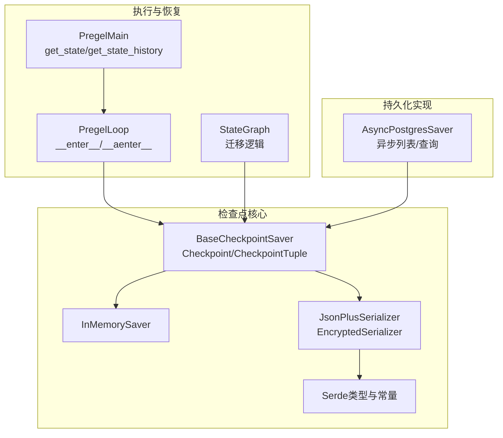
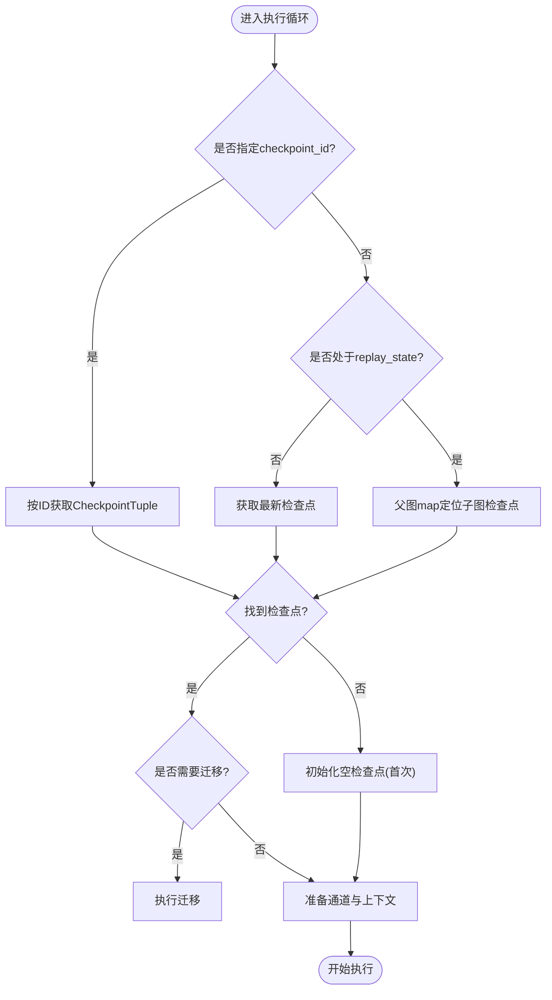
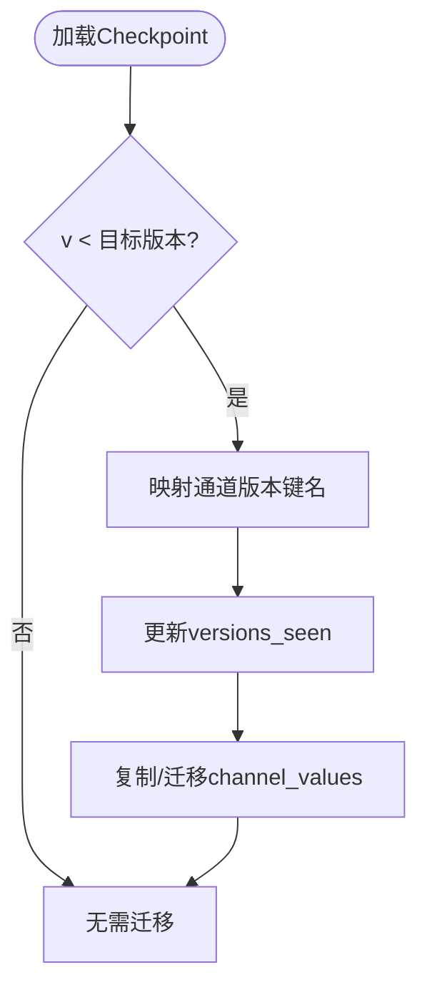
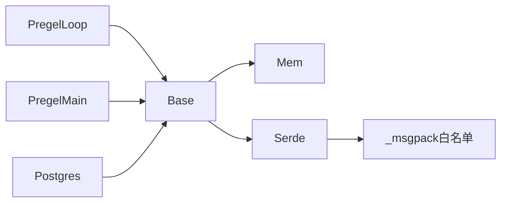

# 检查点恢复流程

<cite>
**本文档引用的文件**
- [libs/checkpoint/langgraph/checkpoint/base/__init__.py](file://libs/checkpoint/langgraph/checkpoint/base/__init__.py)
- [libs/checkpoint/langgraph/checkpoint/memory/__init__.py](file://libs/checkpoint/langgraph/checkpoint/memory/__init__.py)
- [libs/checkpoint/langgraph/checkpoint/serde/base.py](file://libs/checkpoint/langgraph/checkpoint/serde/base.py)
- [libs/checkpoint/langgraph/checkpoint/serde/jsonplus.py](file://libs/checkpoint/langgraph/checkpoint/serde/jsonplus.py)
- [libs/checkpoint/langgraph/checkpoint/serde/_msgpack.py](file://libs/checkpoint/langgraph/checkpoint/serde/_msgpack.py)
- [libs/checkpoint/langgraph/checkpoint/serde/encrypted.py](file://libs/checkpoint/langgraph/checkpoint/serde/encrypted.py)
- [libs/langgraph/langgraph/pregel/_loop.py](file://libs/langgraph/langgraph/pregel/_loop.py)
- [libs/langgraph/langgraph/pregel/main.py](file://libs/langgraph/langgraph/pregel/main.py)
- [libs/langgraph/langgraph/graph/state.py](file://libs/langgraph/langgraph/graph/state.py)
- [libs/langgraph/tests/test_checkpoint_migration.py](file://libs/langgraph/tests/test_checkpoint_migration.py)
- [libs/checkpoint-postgres/langgraph/checkpoint/postgres/aio.py](file://libs/checkpoint-postgres/langgraph/checkpoint/postgres/aio.py)
</cite>

## 目录
1. [简介](#简介)
2. [项目结构](#项目结构)
3. [核心组件](#核心组件)
4. [架构总览](#架构总览)
5. [详细组件分析](#详细组件分析)
6. [依赖关系分析](#依赖关系分析)
7. [性能考虑](#性能考虑)
8. [故障排查指南](#故障排查指南)
9. [结论](#结论)
10. [附录](#附录)

## 简介
本文件系统性阐述 LangGraph 中“检查点恢复流程”的完整机制，覆盖从故障检测到状态加载、执行上下文重建的全过程。重点说明恢复时机选择策略、版本兼容性检查与迁移、数据完整性校验、错误处理与回滚策略、以及数据一致性保障，并提供性能优化与监控建议。

## 项目结构
围绕检查点恢复的关键模块分布于以下子包与文件：
- 检查点基础模型与接口：libs/checkpoint/langgraph/checkpoint/base/__init__.py
- 内存检查点实现：libs/checkpoint/langgraph/checkpoint/memory/__init__.py
- 序列化与反序列化（含安全策略）：libs/checkpoint/langgraph/checkpoint/serde/*
- Pregel 执行循环与恢复入口：libs/langgraph/langgraph/pregel/_loop.py、libs/langgraph/langgraph/pregel/main.py
- 版本迁移与兼容性：libs/langgraph/langgraph/graph/state.py、libs/langgraph/tests/test_checkpoint_migration.py
- 异步持久化实现示例（Postgres）：libs/checkpoint-postgres/langgraph/checkpoint/postgres/aio.py



**图表来源**
- [libs/checkpoint/langgraph/checkpoint/base/__init__.py:122-480](file://libs/checkpoint/langgraph/checkpoint/base/__init__.py#L122-L480)
- [libs/checkpoint/langgraph/checkpoint/memory/__init__.py:31-604](file://libs/checkpoint/langgraph/checkpoint/memory/__init__.py#L31-L604)
- [libs/checkpoint/langgraph/checkpoint/serde/jsonplus.py:50-800](file://libs/checkpoint/langgraph/checkpoint/serde/jsonplus.py#L50-L800)
- [libs/checkpoint/langgraph/checkpoint/serde/encrypted.py:8-81](file://libs/checkpoint/langgraph/checkpoint/serde/encrypted.py#L8-L81)
- [libs/langgraph/langgraph/pregel/_loop.py:1138-1400](file://libs/langgraph/langgraph/pregel/_loop.py#L1138-L1400)
- [libs/langgraph/langgraph/pregel/main.py:1261-1400](file://libs/langgraph/langgraph/pregel/main.py#L1261-L1400)
- [libs/checkpoint-postgres/langgraph/checkpoint/postgres/aio.py:130-356](file://libs/checkpoint-postgres/langgraph/checkpoint/postgres/aio.py#L130-L356)

**章节来源**
- [libs/checkpoint/langgraph/checkpoint/base/__init__.py:1-629](file://libs/checkpoint/langgraph/checkpoint/base/__init__.py#L1-L629)
- [libs/checkpoint/langgraph/checkpoint/memory/__init__.py:1-604](file://libs/checkpoint/langgraph/checkpoint/memory/__init__.py#L1-L604)
- [libs/checkpoint/langgraph/checkpoint/serde/base.py:1-65](file://libs/checkpoint/langgraph/checkpoint/serde/base.py#L1-L65)
- [libs/checkpoint/langgraph/checkpoint/serde/jsonplus.py:1-800](file://libs/checkpoint/langgraph/checkpoint/serde/jsonplus.py#L1-L800)
- [libs/checkpoint/langgraph/checkpoint/serde/_msgpack.py:1-90](file://libs/checkpoint/langgraph/checkpoint/serde/_msgpack.py#L1-L90)
- [libs/checkpoint/langgraph/checkpoint/serde/encrypted.py:1-81](file://libs/checkpoint/langgraph/checkpoint/serde/encrypted.py#L1-L81)
- [libs/langgraph/langgraph/pregel/_loop.py:1130-1400](file://libs/langgraph/langgraph/pregel/_loop.py#L1130-L1400)
- [libs/langgraph/langgraph/pregel/main.py:1200-1400](file://libs/langgraph/langgraph/pregel/main.py#L1200-L1400)
- [libs/langgraph/langgraph/graph/state.py:1422-1456](file://libs/langgraph/langgraph/graph/state.py#L1422-L1456)
- [libs/langgraph/tests/test_checkpoint_migration.py:1-200](file://libs/langgraph/tests/test_checkpoint_migration.py#L1-L200)
- [libs/checkpoint-postgres/langgraph/checkpoint/postgres/aio.py:130-356](file://libs/checkpoint-postgres/langgraph/checkpoint/postgres/aio.py#L130-L356)

## 核心组件
- 基础接口与数据模型
  - BaseCheckpointSaver：定义检查点的获取、列出、写入、删除等接口；提供版本生成、元数据合并等工具函数。
  - Checkpoint/CheckpointTuple：检查点数据结构，包含版本号、时间戳、通道值、通道版本、节点可见版本、待发送消息、更新通道等字段。
- 内存实现
  - InMemorySaver：基于内存的检查点存储，支持同步与异步操作，负责序列化/反序列化、blobs分片存储、pending_writes管理。
- 序列化与安全
  - JsonPlusSerializer：优先使用 msgpack，支持扩展类型编码与解码，具备严格/宽松的模块白名单控制。
  - EncryptedSerializer：在任意底层序列化之上增加加密封装，确保数据机密性。
  - _msgpack：内置安全类型白名单与方法调用白名单，严格模式下限制可反序列化的类型。
- 执行与恢复入口
  - PregelLoop：在进入执行循环时根据配置决定是恢复到指定检查点、子图重放，还是取最新检查点；随后从检查点重建通道与执行上下文。
  - PregelMain：对外提供 get_state/get_state_history 等接口，内部通过 checkpointer 获取快照并应用 pending_writes。

**章节来源**
- [libs/checkpoint/langgraph/checkpoint/base/__init__.py:122-629](file://libs/checkpoint/langgraph/checkpoint/base/__init__.py#L122-L629)
- [libs/checkpoint/langgraph/checkpoint/memory/__init__.py:31-604](file://libs/checkpoint/langgraph/checkpoint/memory/__init__.py#L31-L604)
- [libs/checkpoint/langgraph/checkpoint/serde/base.py:14-65](file://libs/checkpoint/langgraph/checkpoint/serde/base.py#L14-L65)
- [libs/checkpoint/langgraph/checkpoint/serde/jsonplus.py:50-800](file://libs/checkpoint/langgraph/checkpoint/serde/jsonplus.py#L50-L800)
- [libs/checkpoint/langgraph/checkpoint/serde/_msgpack.py:14-90](file://libs/checkpoint/langgraph/checkpoint/serde/_msgpack.py#L14-L90)
- [libs/checkpoint/langgraph/checkpoint/serde/encrypted.py:8-81](file://libs/checkpoint/langgraph/checkpoint/serde/encrypted.py#L8-L81)
- [libs/langgraph/langgraph/pregel/_loop.py:1138-1400](file://libs/langgraph/langgraph/pregel/_loop.py#L1138-L1400)
- [libs/langgraph/langgraph/pregel/main.py:1261-1400](file://libs/langgraph/langgraph/pregel/main.py#L1261-L1400)

## 架构总览
检查点恢复的端到端流程如下：

```mermaid
sequenceDiagram
participant Caller as "调用方"
participant Pregel as "PregelMain"
participant Loop as "PregelLoop"
participant CP as "BaseCheckpointSaver"
participant Serde as "JsonPlusSerializer/EncryptedSerializer"
Caller->>Pregel : 调用 get_state(config)
Pregel->>CP : get_tuple(config)
CP->>Serde : loads_typed(检查点二进制)
Serde-->>CP : 反序列化后的CheckpointTuple
CP-->>Pregel : 返回CheckpointTuple(saved)
Pregel->>Pregel : _prepare_state_snapshot(saved,...)
Pregel-->>Caller : StateSnapshot(含pending_writes)
Caller->>Loop : 进入执行循环(__enter__/__aenter__)
Loop->>CP : get_tuple(checkpoint_config)
CP->>Serde : loads_typed(...)
Serde-->>CP : CheckpointTuple
CP-->>Loop : saved
Loop->>Loop : 重建channels_from_checkpoint(saved.checkpoint)
Loop->>Loop : 初始化step/updated_channels/previous_versions
Loop-->>Caller : 开始按版本驱动的执行
```

**图表来源**
- [libs/langgraph/langgraph/pregel/main.py:1261-1400](file://libs/langgraph/langgraph/pregel/main.py#L1261-L1400)
- [libs/langgraph/langgraph/pregel/_loop.py:1138-1400](file://libs/langgraph/langgraph/pregel/_loop.py#L1138-L1400)
- [libs/checkpoint/langgraph/checkpoint/base/__init__.py:173-287](file://libs/checkpoint/langgraph/checkpoint/base/__init__.py#L173-L287)
- [libs/checkpoint/langgraph/checkpoint/serde/jsonplus.py:228-261](file://libs/checkpoint/langgraph/checkpoint/serde/jsonplus.py#L228-L261)

## 详细组件分析

### 恢复时机选择策略
- 显式检查点ID：当配置中包含明确的 checkpoint_id 时，直接恢复到该检查点，用于精确回放或子图时间旅行。
- 子图重放：当父图处于重放状态且传入 replay_state 时，通过父图的 checkpoint_map 定位子图检查点，避免取最新。
- 正常恢复：默认取当前线程/命名空间下的最新检查点；首次调用返回空检查点并初始化步骤计数。



**图表来源**
- [libs/langgraph/langgraph/pregel/_loop.py:1138-1180](file://libs/langgraph/langgraph/pregel/_loop.py#L1138-L1180)
- [libs/langgraph/langgraph/pregel/_loop.py:1337-1397](file://libs/langgraph/langgraph/pregel/_loop.py#L1337-L1397)

**章节来源**
- [libs/langgraph/langgraph/pregel/_loop.py:1138-1180](file://libs/langgraph/langgraph/pregel/_loop.py#L1138-L1180)
- [libs/langgraph/langgraph/pregel/_loop.py:1337-1397](file://libs/langgraph/langgraph/pregel/_loop.py#L1337-L1397)

### 状态加载与上下文重建
- 状态加载
  - 通过 checkpointer.get_tuple 获取 CheckpointTuple，反序列化得到 Checkpoint 与元数据。
  - 对于 InMemorySaver，会从 blobs 中加载各通道版本对应的值，再合并到 channel_values。
- 上下文重建
  - 使用 channels_from_checkpoint 从 Checkpoint 中恢复通道状态。
  - 初始化 step、stop、updated_channels、previous_versions 等执行上下文。
  - 清理 RESUMING 标记以确保输入重新应用，从而自然触发路由。

```mermaid
sequenceDiagram
participant Loop as "PregelLoop"
participant CP as "BaseCheckpointSaver"
participant Serde as "JsonPlusSerializer"
participant Channels as "channels_from_checkpoint"
Loop->>CP : get_tuple(checkpoint_config)
CP->>Serde : loads_typed(检查点二进制)
Serde-->>CP : CheckpointTuple(saved)
CP-->>Loop : saved
Loop->>Channels : 从saved.checkpoint重建通道
Channels-->>Loop : channels/managed
Loop->>Loop : 设置step/stop/updated_channels/previous_versions
Loop-->>Loop : 清理RESUMING并准备首轮输入
```

**图表来源**
- [libs/langgraph/langgraph/pregel/_loop.py:1188-1202](file://libs/langgraph/langgraph/pregel/_loop.py#L1188-L1202)
- [libs/checkpoint/langgraph/checkpoint/memory/__init__.py:135-215](file://libs/checkpoint/langgraph/checkpoint/memory/__init__.py#L135-L215)
- [libs/checkpoint/langgraph/checkpoint/serde/jsonplus.py:228-261](file://libs/checkpoint/langgraph/checkpoint/serde/jsonplus.py#L228-L261)

**章节来源**
- [libs/checkpoint/langgraph/checkpoint/memory/__init__.py:135-215](file://libs/checkpoint/langgraph/checkpoint/memory/__init__.py#L135-L215)
- [libs/checkpoint/langgraph/checkpoint/serde/jsonplus.py:228-261](file://libs/checkpoint/langgraph/checkpoint/serde/jsonplus.py#L228-L261)
- [libs/langgraph/langgraph/pregel/_loop.py:1188-1202](file://libs/langgraph/langgraph/pregel/_loop.py#L1188-L1202)

### 版本兼容性检查与迁移
- 版本字段与格式
  - Checkpoint.v 表示检查点格式版本；BaseCheckpointSaver 提供 empty_checkpoint 与 create_checkpoint 等工具。
- 迁移策略
  - StateGraph 的迁移逻辑会根据旧版本键名映射（如从 start:node 到 branch:to:node）进行转换，并更新 versions_seen 与 channel_values。
  - 测试用例验证了不同版本之间的迁移结果一致性。
- 异步实现中的迁移
  - AsyncPostgresSaver 在列出历史时对需要迁移的记录进行补丁处理（如 pending_sends），确保下游读取一致。



**图表来源**
- [libs/checkpoint/langgraph/checkpoint/base/__init__.py:582-629](file://libs/checkpoint/langgraph/checkpoint/base/__init__.py#L582-L629)
- [libs/langgraph/langgraph/graph/state.py:1422-1456](file://libs/langgraph/langgraph/graph/state.py#L1422-L1456)
- [libs/langgraph/tests/test_checkpoint_migration.py:1480-1508](file://libs/langgraph/tests/test_checkpoint_migration.py#L1480-L1508)
- [libs/checkpoint-postgres/langgraph/checkpoint/postgres/aio.py:145-162](file://libs/checkpoint-postgres/langgraph/checkpoint/postgres/aio.py#L145-L162)

**章节来源**
- [libs/checkpoint/langgraph/checkpoint/base/__init__.py:582-629](file://libs/checkpoint/langgraph/checkpoint/base/__init__.py#L582-L629)
- [libs/langgraph/langgraph/graph/state.py:1422-1456](file://libs/langgraph/langgraph/graph/state.py#L1422-L1456)
- [libs/langgraph/tests/test_checkpoint_migration.py:1480-1508](file://libs/langgraph/tests/test_checkpoint_migration.py#L1480-L1508)
- [libs/checkpoint-postgres/langgraph/checkpoint/postgres/aio.py:145-162](file://libs/checkpoint-postgres/langgraph/checkpoint/postgres/aio.py#L145-L162)

### 数据完整性验证与安全
- 序列化与反序列化
  - JsonPlusSerializer 优先使用 msgpack，失败时可回退到 pickle；支持扩展类型编码（如 Pydantic、UUID、datetime 等）。
  - 支持严格模式（仅允许白名单类型/方法），以及宽松模式（允许注册类型但发出警告）。
- 加密序列化
  - EncryptedSerializer 在任意 serde 之上增加加密层，通过环境变量提供密钥，确保敏感数据机密性。
- 元数据与写入
  - BaseCheckpointSaver 维护 WRITES_IDX_MAP，区分普通写入与特殊写入（错误、中断、调度、恢复）。
  - InMemorySaver 将 blobs 与 pending_writes 分离存储，便于增量恢复与一致性校验。

**章节来源**
- [libs/checkpoint/langgraph/checkpoint/serde/jsonplus.py:50-800](file://libs/checkpoint/langgraph/checkpoint/serde/jsonplus.py#L50-L800)
- [libs/checkpoint/langgraph/checkpoint/serde/_msgpack.py:14-90](file://libs/checkpoint/langgraph/checkpoint/serde/_msgpack.py#L14-L90)
- [libs/checkpoint/langgraph/checkpoint/serde/encrypted.py:8-81](file://libs/checkpoint/langgraph/checkpoint/serde/encrypted.py#L8-L81)
- [libs/checkpoint/langgraph/checkpoint/base/__init__.py:563-576](file://libs/checkpoint/langgraph/checkpoint/base/__init__.py#L563-L576)
- [libs/checkpoint/langgraph/checkpoint/memory/__init__.py:372-409](file://libs/checkpoint/langgraph/checkpoint/memory/__init__.py#L372-L409)

### 错误处理机制、回滚策略与一致性保证
- 错误处理
  - pending_writes 中的 ERROR 类型写入会被跳过应用，避免错误传播到当前状态。
  - InMemorySaver 在 put_writes 时利用 WRITES_IDX_MAP 区分索引，防止重复写入。
- 回滚策略
  - 通过 checkpoint_id 精确回放历史检查点，实现“时间旅行”调试与回滚。
  - get_state_history 支持按 before/limit/filter 查询历史快照，便于定位问题点。
- 一致性保证
  - 通道版本（channel_versions）与节点可见版本（versions_seen）用于确定下次应执行的节点，避免重复执行或遗漏。
  - InMemorySaver 的 blobs 与 checkpoint 分离存储，确保即使部分通道未更新也能正确恢复。

**章节来源**
- [libs/checkpoint/langgraph/checkpoint/base/__init__.py:563-576](file://libs/checkpoint/langgraph/checkpoint/base/__init__.py#L563-L576)
- [libs/checkpoint/langgraph/checkpoint/memory/__init__.py:372-409](file://libs/checkpoint/langgraph/checkpoint/memory/__init__.py#L372-L409)
- [libs/langgraph/langgraph/pregel/main.py:1349-1400](file://libs/langgraph/langgraph/pregel/main.py#L1349-L1400)

## 依赖关系分析
- 组件耦合
  - PregelLoop 依赖 BaseCheckpointSaver 提供的 get_tuple 接口；InMemorySaver 实现具体存储与序列化。
  - JsonPlusSerializer 作为通用序列化器被多种实现共享，通过白名单控制安全边界。
- 外部依赖
  - AsyncPostgresSaver 展示了异步列表与查询的实现方式，体现与数据库的集成模式。
- 循环依赖规避
  - 迁移逻辑集中在 StateGraph 与测试用例中，不引入运行时循环依赖。



**图表来源**
- [libs/langgraph/langgraph/pregel/_loop.py:1138-1180](file://libs/langgraph/langgraph/pregel/_loop.py#L1138-L1180)
- [libs/langgraph/langgraph/pregel/main.py:1261-1400](file://libs/langgraph/langgraph/pregel/main.py#L1261-L1400)
- [libs/checkpoint/langgraph/checkpoint/base/__init__.py:122-480](file://libs/checkpoint/langgraph/checkpoint/base/__init__.py#L122-L480)
- [libs/checkpoint/langgraph/checkpoint/memory/__init__.py:31-604](file://libs/checkpoint/langgraph/checkpoint/memory/__init__.py#L31-L604)
- [libs/checkpoint/langgraph/checkpoint/serde/jsonplus.py:50-800](file://libs/checkpoint/langgraph/checkpoint/serde/jsonplus.py#L50-L800)
- [libs/checkpoint-postgres/langgraph/checkpoint/postgres/aio.py:130-356](file://libs/checkpoint-postgres/langgraph/checkpoint/postgres/aio.py#L130-L356)

**章节来源**
- [libs/langgraph/langgraph/pregel/_loop.py:1138-1180](file://libs/langgraph/langgraph/pregel/_loop.py#L1138-L1180)
- [libs/langgraph/langgraph/pregel/main.py:1261-1400](file://libs/langgraph/langgraph/pregel/main.py#L1261-L1400)
- [libs/checkpoint/langgraph/checkpoint/base/__init__.py:122-480](file://libs/checkpoint/langgraph/checkpoint/base/__init__.py#L122-L480)
- [libs/checkpoint/langgraph/checkpoint/memory/__init__.py:31-604](file://libs/checkpoint/langgraph/checkpoint/memory/__init__.py#L31-L604)
- [libs/checkpoint/langgraph/checkpoint/serde/jsonplus.py:50-800](file://libs/checkpoint/langgraph/checkpoint/serde/jsonplus.py#L50-L800)
- [libs/checkpoint-postgres/langgraph/checkpoint/postgres/aio.py:130-356](file://libs/checkpoint-postgres/langgraph/checkpoint/postgres/aio.py#L130-L356)

## 性能考虑
- 序列化性能
  - 优先使用 msgpack（JsonPlusSerializer），减少序列化开销；必要时启用 pickle 回退。
  - 合理设置 allowed_json_modules/allowed_msgpack_modules，避免不必要的反序列化尝试。
- 存储与并发
  - InMemorySaver 适合测试与本地开发；生产建议使用异步持久化实现（如 AsyncPostgresSaver）以提升并发与可靠性。
  - 利用 put_writes 的任务级索引避免重复写入，降低存储压力。
- 恢复路径优化
  - 明确指定 checkpoint_id 可跳过扫描，显著缩短恢复时间。
  - 使用 before/limit/filter 精准查询历史，避免全表扫描。

[本节为通用指导，无需特定文件引用]

## 故障排查指南
- 常见问题
  - 检查点缺失：确认 thread_id 与 checkpoint_ns 配置正确；若无检查点，系统将以空检查点初始化。
  - 反序列化失败：检查 JsonPlusSerializer 的 allowlist 配置；严格模式下需显式允许所需类型。
  - 迁移异常：核对版本映射规则（如 start:node → branch:to:node）；参考测试用例断言。
- 排查步骤
  - 使用 get_state_history 查看历史快照，定位问题发生点。
  - 通过 checkpoint_id 精确回放到上一个稳定状态，验证修复。
  - 检查 pending_writes 是否包含 ERROR，确认错误是否被正确隔离。

**章节来源**
- [libs/langgraph/langgraph/pregel/main.py:1349-1400](file://libs/langgraph/langgraph/pregel/main.py#L1349-L1400)
- [libs/checkpoint/langgraph/tests/test_checkpoint_migration.py:1480-1508](file://libs/checkpoint/langgraph/tests/test_checkpoint_migration.py#L1480-L1508)

## 结论
LangGraph 的检查点恢复流程通过“明确的恢复时机选择 + 完整的状态加载 + 严格的版本迁移 + 安全的序列化策略”，实现了高可靠、可审计、可回滚的长时序状态管理。结合异步持久化与白名单安全机制，可在生产环境中获得稳定的性能与安全性表现。

## 附录
- 关键配置键
  - thread_id：线程标识，决定检查点归属。
  - checkpoint_id：显式检查点ID，用于精确回放。
  - checkpoint_ns：命名空间，支持多子图/多会话隔离。
  - CONFIG_KEY_REPLAY_STATE：父图重放状态，用于子图时间旅行。
- 监控建议
  - 记录序列化/反序列化耗时与失败率。
  - 监控检查点写入延迟与 pending_writes 积压。
  - 观察通道版本增长速率与 versions_seen 更新频率。

[本节为概念性总结，无需特定文件引用]