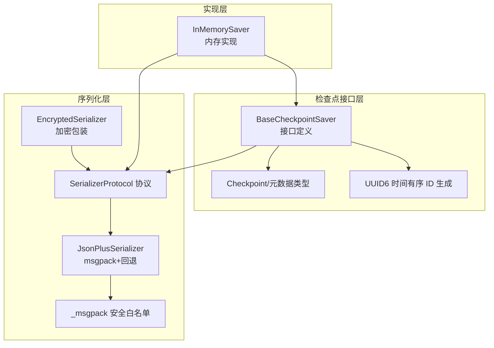
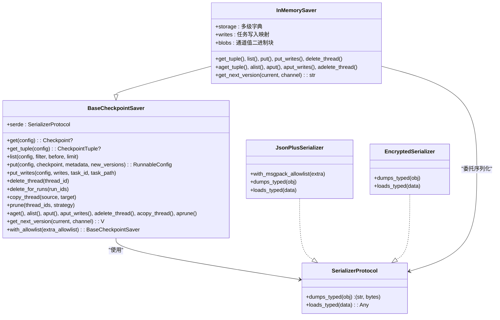
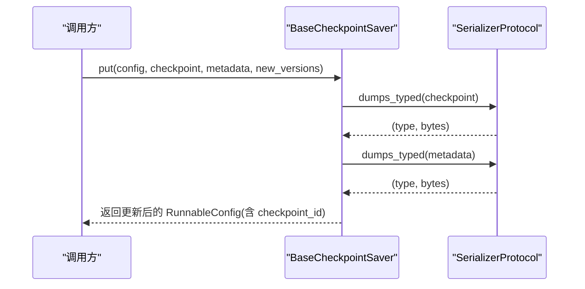
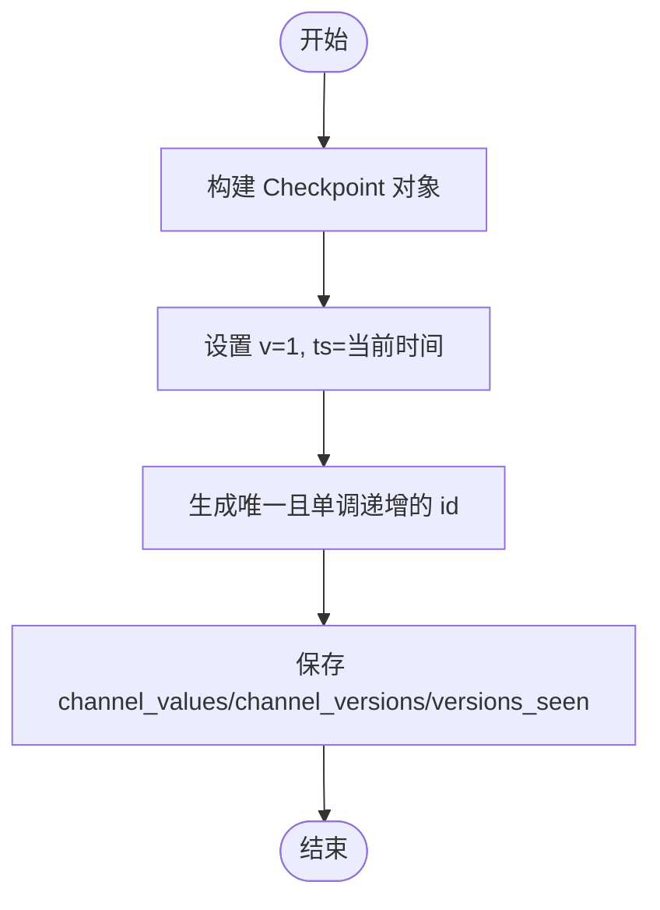
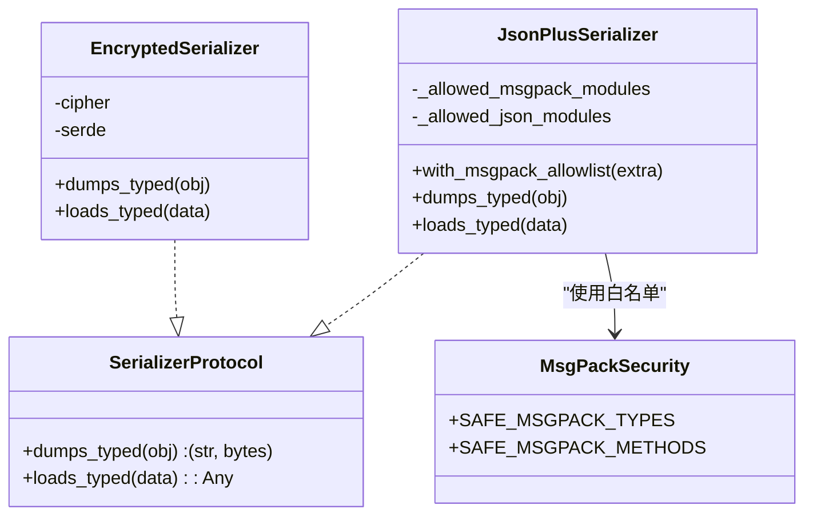
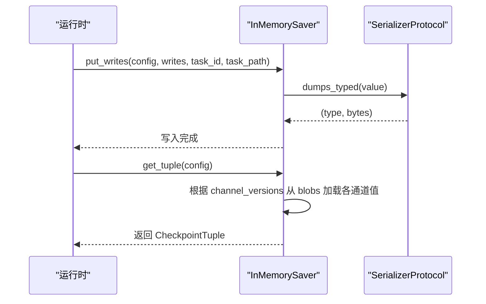
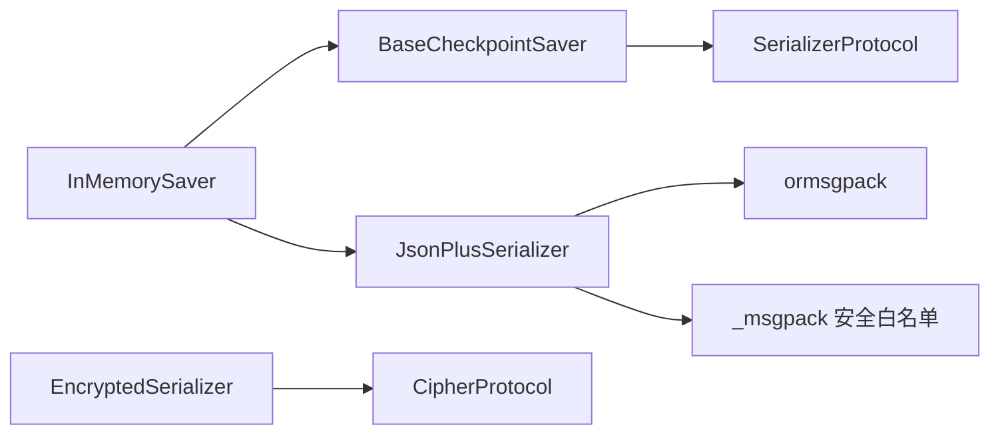

# 检查点接口设计

<cite>
**本文档引用的文件**
- [libs/checkpoint/langgraph/checkpoint/base/__init__.py](file://libs/checkpoint/langgraph/checkpoint/base/__init__.py)
- [libs/checkpoint/langgraph/checkpoint/base/id.py](file://libs/checkpoint/langgraph/checkpoint/base/id.py)
- [libs/checkpoint/langgraph/checkpoint/memory/__init__.py](file://libs/checkpoint/langgraph/checkpoint/memory/__init__.py)
- [libs/checkpoint/langgraph/checkpoint/serde/base.py](file://libs/checkpoint/langgraph/checkpoint/serde/base.py)
- [libs/checkpoint/langgraph/checkpoint/serde/types.py](file://libs/checkpoint/langgraph/checkpoint/serde/types.py)
- [libs/checkpoint/langgraph/checkpoint/serde/jsonplus.py](file://libs/checkpoint/langgraph/checkpoint/serde/jsonplus.py)
- [libs/checkpoint/langgraph/checkpoint/serde/_msgpack.py](file://libs/checkpoint/langgraph/checkpoint/serde/_msgpack.py)
- [libs/checkpoint/langgraph/checkpoint/serde/encrypted.py](file://libs/checkpoint/langgraph/checkpoint/serde/encrypted.py)
- [libs/checkpoint-conformance/langgraph/checkpoint/conformance/spec/test_put.py](file://libs/checkpoint-conformance/langgraph/checkpoint/conformance/spec/test_put.py)
</cite>

## 目录
1. [简介](#简介)
2. [项目结构](#项目结构)
3. [核心组件](#核心组件)
4. [架构总览](#架构总览)
5. [详细组件分析](#详细组件分析)
6. [依赖关系分析](#依赖关系分析)
7. [性能考虑](#性能考虑)
8. [故障排除指南](#故障排除指南)
9. [结论](#结论)
10. [附录](#附录)

## 简介
本文件系统性阐述检查点接口设计，围绕 BaseCheckpointSaver 接口展开，解释其设计原理、核心方法定义与职责边界；详解检查点数据结构（Checkpoint）的字段语义、版本标识符的作用与演进策略；阐明序列化与反序列化机制（SerializerProtocol 及其实现），以及如何通过扩展 BaseCheckpointSaver 实现自定义检查点存储后端。同时提供最佳实践、注意事项与常见问题排查建议。

## 项目结构
本仓库中与检查点接口直接相关的核心模块分布如下：
- 基础接口与数据模型：langgraph/checkpoint/base
- 内存实现：langgraph/checkpoint/memory
- 序列化协议与实现：langgraph/checkpoint/serde
- 接口一致性测试：langgraph/checkpoint/conformance/spec/test_put.py

**图表来源**
- [libs/checkpoint/langgraph/checkpoint/base/__init__.py:122-480](file://libs/checkpoint/langgraph/checkpoint/base/__init__.py#L122-L480)
- [libs/checkpoint/langgraph/checkpoint/base/id.py:79-110](file://libs/checkpoint/langgraph/checkpoint/base/id.py#L79-L110)
- [libs/checkpoint/langgraph/checkpoint/memory/__init__.py:31-122](file://libs/checkpoint/langgraph/checkpoint/memory/__init__.py#L31-L122)
- [libs/checkpoint/langgraph/checkpoint/serde/base.py:14-65](file://libs/checkpoint/langgraph/checkpoint/serde/base.py#L14-L65)
- [libs/checkpoint/langgraph/checkpoint/serde/jsonplus.py:50-120](file://libs/checkpoint/langgraph/checkpoint/serde/jsonplus.py#L50-L120)
- [libs/checkpoint/langgraph/checkpoint/serde/_msgpack.py:14-90](file://libs/checkpoint/langgraph/checkpoint/serde/_msgpack.py#L14-L90)
- [libs/checkpoint/langgraph/checkpoint/serde/encrypted.py:8-37](file://libs/checkpoint/langgraph/checkpoint/serde/encrypted.py#L8-L37)

**章节来源**
- [libs/checkpoint/langgraph/checkpoint/base/__init__.py:1-629](file://libs/checkpoint/langgraph/checkpoint/base/__init__.py#L1-L629)
- [libs/checkpoint/langgraph/checkpoint/base/id.py:1-110](file://libs/checkpoint/langgraph/checkpoint/base/id.py#L1-L110)
- [libs/checkpoint/langgraph/checkpoint/memory/__init__.py:1-604](file://libs/checkpoint/langgraph/checkpoint/memory/__init__.py#L1-L604)
- [libs/checkpoint/langgraph/checkpoint/serde/base.py:1-65](file://libs/checkpoint/langgraph/checkpoint/serde/base.py#L1-L65)
- [libs/checkpoint/langgraph/checkpoint/serde/types.py:1-52](file://libs/checkpoint/langgraph/checkpoint/serde/types.py#L1-L52)
- [libs/checkpoint/langgraph/checkpoint/serde/jsonplus.py:1-828](file://libs/checkpoint/langgraph/checkpoint/serde/jsonplus.py#L1-L828)
- [libs/checkpoint/langgraph/checkpoint/serde/_msgpack.py:1-90](file://libs/checkpoint/langgraph/checkpoint/serde/_msgpack.py#L1-L90)
- [libs/checkpoint/langgraph/checkpoint/serde/encrypted.py:1-81](file://libs/checkpoint/langgraph/checkpoint/serde/encrypted.py#L1-L81)

## 核心组件
- BaseCheckpointSaver：检查点持久化抽象接口，定义了获取、列出、写入、删除、复制、修剪等方法，并提供同步与异步版本，支持自定义序列化器与版本号生成策略。
- Checkpoint：检查点数据结构，包含格式版本、唯一 ID、时间戳、通道值、通道版本、节点已见版本映射、更新通道列表等字段。
- SerializerProtocol：序列化协议，统一 dumps_typed/loads_typed 接口，兼容旧式未类型化序列化器。
- JsonPlusSerializer：基于 ormsgpack 的高性能序列化器，支持安全白名单与严格模式，具备回退能力。
- InMemorySaver：内存实现示例，展示如何使用序列化器进行检查点与中间写入的持久化与恢复。

**章节来源**
- [libs/checkpoint/langgraph/checkpoint/base/__init__.py:65-121](file://libs/checkpoint/langgraph/checkpoint/base/__init__.py#L65-L121)
- [libs/checkpoint/langgraph/checkpoint/base/__init__.py:122-480](file://libs/checkpoint/langgraph/checkpoint/base/__init__.py#L122-L480)
- [libs/checkpoint/langgraph/checkpoint/serde/base.py:14-65](file://libs/checkpoint/langgraph/checkpoint/serde/base.py#L14-L65)
- [libs/checkpoint/langgraph/checkpoint/serde/jsonplus.py:50-120](file://libs/checkpoint/langgraph/checkpoint/serde/jsonplus.py#L50-L120)
- [libs/checkpoint/langgraph/checkpoint/memory/__init__.py:31-122](file://libs/checkpoint/langgraph/checkpoint/memory/__init__.py#L31-L122)

## 架构总览
检查点接口采用“接口 + 协议 + 实现”的分层设计：
- 接口层：BaseCheckpointSaver 定义统一契约，屏蔽具体存储细节。
- 协议层：SerializerProtocol 抽象序列化行为，JsonPlusSerializer 提供高性能实现，EncryptedSerializer 提供加密包装。
- 实现层：InMemorySaver 展示如何在内存中组织检查点、元数据与中间写入，体现版本管理与增量通道处理。

**图表来源**
- [libs/checkpoint/langgraph/checkpoint/base/__init__.py:122-480](file://libs/checkpoint/langgraph/checkpoint/base/__init__.py#L122-L480)
- [libs/checkpoint/langgraph/checkpoint/serde/base.py:14-65](file://libs/checkpoint/langgraph/checkpoint/serde/base.py#L14-L65)
- [libs/checkpoint/langgraph/checkpoint/serde/jsonplus.py:50-120](file://libs/checkpoint/langgraph/checkpoint/serde/jsonplus.py#L50-L120)
- [libs/checkpoint/langgraph/checkpoint/serde/encrypted.py:8-37](file://libs/checkpoint/langgraph/checkpoint/serde/encrypted.py#L8-L37)
- [libs/checkpoint/langgraph/checkpoint/memory/__init__.py:31-122](file://libs/checkpoint/langgraph/checkpoint/memory/__init__.py#L31-L122)

## 详细组件分析

### BaseCheckpointSaver 接口设计
- 设计原则
  - 职责单一：专注于检查点的持久化生命周期管理。
  - 可插拔：通过 SerializerProtocol 解耦序列化细节。
  - 异步优先：提供 async 版本以避免阻塞主线程。
  - 扩展友好：允许子类覆盖版本号生成策略与消息包白名单。
- 核心方法族
  - 同步：get/get_tuple/list/put/put_writes/delete_thread/delete_for_runs/copy_thread/prune
  - 异步：aget/aget_tuple/alist/aput/aput_writes/adelete_thread/adelete_for_runs/acopy_thread/aprune
- 版本管理
  - 默认整型递增版本；可重载为字符串/浮点单调递增策略。
  - 支持派生新的序列化器实例并注入消息包白名单。
- 元数据与配置
  - 通过 RunnableConfig 传递 thread_id、checkpoint_ns、checkpoint_id 等关键键值。
  - metadata 包含 source、step、parents、run_id 等扩展信息。

**图表来源**
- [libs/checkpoint/langgraph/checkpoint/base/__init__.py:223-244](file://libs/checkpoint/langgraph/checkpoint/base/__init__.py#L223-L244)
- [libs/checkpoint/langgraph/checkpoint/serde/base.py:14-27](file://libs/checkpoint/langgraph/checkpoint/serde/base.py#L14-L27)

**章节来源**
- [libs/checkpoint/langgraph/checkpoint/base/__init__.py:122-480](file://libs/checkpoint/langgraph/checkpoint/base/__init__.py#L122-L480)

### 检查点数据结构与版本标识
- 字段定义
  - v：格式版本号，当前为 1。
  - id：检查点唯一 ID，时间有序且单调递增，用于排序与检索。
  - ts：ISO 8601 时间戳。
  - channel_values：通道名到值的映射。
  - channel_versions：通道名到版本的映射。
  - versions_seen：节点 ID 到通道版本映射，用于调度决策。
  - updated_channels：本次更新涉及的通道列表（可选）。
- 版本标识作用
  - 保证通道值的线性演进与可追溯性。
  - 支持增量恢复：仅加载对应版本的通道值二进制块。
- ID 生成
  - 使用 UUID6，具备更好的数据库索引局部性与时间顺序。

**图表来源**
- [libs/checkpoint/langgraph/checkpoint/base/__init__.py:65-97](file://libs/checkpoint/langgraph/checkpoint/base/__init__.py#L65-L97)
- [libs/checkpoint/langgraph/checkpoint/base/id.py:79-110](file://libs/checkpoint/langgraph/checkpoint/base/id.py#L79-L110)

**章节来源**
- [libs/checkpoint/langgraph/checkpoint/base/__init__.py:65-121](file://libs/checkpoint/langgraph/checkpoint/base/__init__.py#L65-L121)
- [libs/checkpoint/langgraph/checkpoint/base/id.py:79-110](file://libs/checkpoint/langgraph/checkpoint/base/id.py#L79-L110)

### 序列化机制与安全控制
- SerializerProtocol
  - 统一 typed dumps/loads 接口，兼容旧式未类型化序列化器。
- JsonPlusSerializer
  - 优先使用 ormsgpack/msgpack 编解码；失败时可回退至 pickle。
  - 支持安全白名单（_msgpack 安全类型与方法集合），严格模式下阻止未注册类型。
  - 提供 with_msgpack_allowlist 动态合并白名单。
- EncryptedSerializer
  - 对序列化后的二进制数据进行加密包装，支持 AES-EAX 等模式。
- 类型与通道协议
  - ChannelProtocol/SendProtocol 等类型约束，确保通道与发送指令的可序列化与可恢复。

**图表来源**
- [libs/checkpoint/langgraph/checkpoint/serde/base.py:14-65](file://libs/checkpoint/langgraph/checkpoint/serde/base.py#L14-L65)
- [libs/checkpoint/langgraph/checkpoint/serde/jsonplus.py:50-120](file://libs/checkpoint/langgraph/checkpoint/serde/jsonplus.py#L50-L120)
- [libs/checkpoint/langgraph/checkpoint/serde/_msgpack.py:14-90](file://libs/checkpoint/langgraph/checkpoint/serde/_msgpack.py#L14-L90)
- [libs/checkpoint/langgraph/checkpoint/serde/encrypted.py:8-37](file://libs/checkpoint/langgraph/checkpoint/serde/encrypted.py#L8-L37)

**章节来源**
- [libs/checkpoint/langgraph/checkpoint/serde/base.py:14-65](file://libs/checkpoint/langgraph/checkpoint/serde/base.py#L14-L65)
- [libs/checkpoint/langgraph/checkpoint/serde/jsonplus.py:50-120](file://libs/checkpoint/langgraph/checkpoint/serde/jsonplus.py#L50-L120)
- [libs/checkpoint/langgraph/checkpoint/serde/_msgpack.py:14-90](file://libs/checkpoint/langgraph/checkpoint/serde/_msgpack.py#L14-L90)
- [libs/checkpoint/langgraph/checkpoint/serde/encrypted.py:8-37](file://libs/checkpoint/langgraph/checkpoint/serde/encrypted.py#L8-L37)

### 中间写入与增量通道处理
- 中间写入 put_writes
  - 将任务产生的写入按 (task_id, 写入索引) 存储，支持错误/中断/调度等特殊写入索引映射。
- 增量通道值
  - InMemorySaver 将每个通道在不同版本对应的值以二进制块形式独立存储，按需加载。
  - get_tuple 时根据 channel_versions 从 blobs 中重建 channel_values，未更新通道复用历史版本。

**图表来源**
- [libs/checkpoint/langgraph/checkpoint/memory/__init__.py:372-409](file://libs/checkpoint/langgraph/checkpoint/memory/__init__.py#L372-L409)
- [libs/checkpoint/langgraph/checkpoint/memory/__init__.py:123-134](file://libs/checkpoint/langgraph/checkpoint/memory/__init__.py#L123-L134)

**章节来源**
- [libs/checkpoint/langgraph/checkpoint/memory/__init__.py:372-409](file://libs/checkpoint/langgraph/checkpoint/memory/__init__.py#L372-L409)
- [libs/checkpoint/langgraph/checkpoint/memory/__init__.py:123-134](file://libs/checkpoint/langgraph/checkpoint/memory/__init__.py#L123-L134)

### 自定义检查点存储后端实现指南
- 必须实现的方法
  - get_tuple / put / put_writes / list / delete_thread / delete_for_runs / copy_thread / prune
  - 对应的异步版本（如需异步支持）
- 关键注意
  - 正确维护 thread_id、checkpoint_ns、checkpoint_id 的配置返回与查询。
  - 严格遵循 channel_versions 与 channel_values 的版本化存储与恢复。
  - 使用 SerializerProtocol 进行 typed dumps/loads，确保类型与二进制兼容。
  - 如需加密，使用 EncryptedSerializer 包装底层序列化器。
- 最佳实践
  - 将 Checkpoint 主体与通道值二进制块分离存储，支持增量恢复。
  - 在 put_writes 中处理特殊写入索引映射，避免与常规写入冲突。
  - 提供版本号生成策略（默认整型递增），必要时支持字符串/浮点单调递增。
  - 遵循严格模式下的安全白名单，避免反序列化风险。

**章节来源**
- [libs/checkpoint/langgraph/checkpoint/base/__init__.py:122-480](file://libs/checkpoint/langgraph/checkpoint/base/__init__.py#L122-L480)
- [libs/checkpoint/langgraph/checkpoint/serde/base.py:14-65](file://libs/checkpoint/langgraph/checkpoint/serde/base.py#L14-L65)
- [libs/checkpoint/langgraph/checkpoint/serde/encrypted.py:8-37](file://libs/checkpoint/langgraph/checkpoint/serde/encrypted.py#L8-L37)

### 接口一致性验证与回归测试
- 测试覆盖
  - put 返回配置正确性、round-trip 一致性、通道值与版本保留、元数据保留、命名空间隔离、父检查点跟踪、增量通道更新、新通道加入、通道移除、run_id 保留、versions_seen 值保留等。
- 测试驱动
  - 通过 conformance 测试确保实现满足接口契约，避免回归。

**章节来源**
- [libs/checkpoint-conformance/langgraph/checkpoint/conformance/spec/test_put.py:22-412](file://libs/checkpoint-conformance/langgraph/checkpoint/conformance/spec/test_put.py#L22-L412)

## 依赖关系分析
- 组件耦合
  - BaseCheckpointSaver 与 SerializerProtocol 弱耦合，通过协议注入序列化器。
  - InMemorySaver 依赖 SerializerProtocol 进行 typed 序列化，内部组织存储结构。
- 外部依赖
  - ormsgpack 用于高性能 msgpack 编解码。
  - pycryptodome（可选）用于 EncryptedSerializer 的 AES 加密。
- 安全与合规
  - _msgpack 安全白名单限制反序列化类型与方法，严格模式下阻止未注册类型。

**图表来源**
- [libs/checkpoint/langgraph/checkpoint/base/__init__.py:122-480](file://libs/checkpoint/langgraph/checkpoint/base/__init__.py#L122-L480)
- [libs/checkpoint/langgraph/checkpoint/serde/base.py:14-65](file://libs/checkpoint/langgraph/checkpoint/serde/base.py#L14-L65)
- [libs/checkpoint/langgraph/checkpoint/serde/jsonplus.py:50-120](file://libs/checkpoint/langgraph/checkpoint/serde/jsonplus.py#L50-L120)
- [libs/checkpoint/langgraph/checkpoint/serde/_msgpack.py:14-90](file://libs/checkpoint/langgraph/checkpoint/serde/_msgpack.py#L14-L90)
- [libs/checkpoint/langgraph/checkpoint/serde/encrypted.py:8-37](file://libs/checkpoint/langgraph/checkpoint/serde/encrypted.py#L8-L37)
- [libs/checkpoint/langgraph/checkpoint/memory/__init__.py:31-122](file://libs/checkpoint/langgraph/checkpoint/memory/__init__.py#L31-L122)

**章节来源**
- [libs/checkpoint/langgraph/checkpoint/serde/jsonplus.py:50-120](file://libs/checkpoint/langgraph/checkpoint/serde/jsonplus.py#L50-L120)
- [libs/checkpoint/langgraph/checkpoint/serde/_msgpack.py:14-90](file://libs/checkpoint/langgraph/checkpoint/serde/_msgpack.py#L14-L90)
- [libs/checkpoint/langgraph/checkpoint/serde/encrypted.py:8-37](file://libs/checkpoint/langgraph/checkpoint/serde/encrypted.py#L8-L37)

## 性能考虑
- 序列化性能
  - 优先使用 ormsgpack/msgpack，避免 Python 原生 pickle 的性能瓶颈。
  - 对大对象或复杂结构，合理拆分 Checkpoint 主体与通道值二进制块，减少重复序列化。
- 存储布局
  - InMemorySaver 将 blobs 按 (thread_id, checkpoint_ns, channel, version) 组织，支持 O(1) 精确定位与增量加载。
- 并发与异步
  - 提供异步接口以避免阻塞事件循环；在自定义实现中尽量使用异步存储后端。
- 白名单与安全
  - 严格模式下仅允许安全类型与方法，避免反序列化开销与安全风险。

[本节为通用指导，无需特定文件引用]

## 故障排除指南
- 反序列化被阻止
  - 症状：日志出现“Blocked deserialization”或“not in allowed_msgpack_modules”。
  - 处理：通过 JsonPlusSerializer 的 allowlist 或 with_msgpack_allowlist 添加所需类型；或在严格模式关闭时放宽限制。
- 未注册类型警告
  - 症状：日志提示“unregistered type”但默认允许。
  - 处理：尽快将类型加入 allowlist，避免未来版本被严格模式拦截。
- 加密相关错误
  - 症状：导入 pycryptodome 失败或 AES 密钥长度不合法。
  - 处理：安装 pycryptodome 并设置 LANGGRAPH_AES_KEY，确保长度为 16/24/32。
- 版本不一致导致的恢复异常
  - 症状：channel_versions 与 channel_values 不匹配。
  - 处理：确保 put 时传入正确的 new_versions；get 时依据 channel_versions 从 blobs 加载对应版本。

**章节来源**
- [libs/checkpoint/langgraph/checkpoint/serde/jsonplus.py:501-686](file://libs/checkpoint/langgraph/checkpoint/serde/jsonplus.py#L501-L686)
- [libs/checkpoint/langgraph/checkpoint/serde/_msgpack.py:14-90](file://libs/checkpoint/langgraph/checkpoint/serde/_msgpack.py#L14-L90)
- [libs/checkpoint/langgraph/checkpoint/serde/encrypted.py:38-81](file://libs/checkpoint/langgraph/checkpoint/serde/encrypted.py#L38-L81)

## 结论
BaseCheckpointSaver 通过清晰的接口与协议抽象，实现了检查点的可插拔持久化能力；配合 SerializerProtocol 与 JsonPlusSerializer 的高性能与安全控制，既满足生产可用性也兼顾安全性。InMemorySaver 展示了如何组织存储结构与处理增量通道，为自定义存储后端提供了良好范式。遵循本文的最佳实践与注意事项，可在保证一致性的同时实现高可靠、高性能的检查点服务。

[本节为总结，无需特定文件引用]

## 附录
- 关键术语
  - RunnableConfig：包含 thread_id、checkpoint_ns、checkpoint_id 等键值的运行时配置。
  - ChannelVersions：通道名到版本的映射，用于版本化通道值。
  - CheckpointTuple：包含配置、检查点、元数据、父配置与待处理写入的组合对象。
- 相关实现参考
  - 内存实现：InMemorySaver 的 put/get_tuple/list/put_writes 等方法。
  - 序列化实现：JsonPlusSerializer 的 dumps_typed/loads_typed 与白名单机制。
  - 加密实现：EncryptedSerializer 的加密封装与 AES 支持。

**章节来源**
- [libs/checkpoint/langgraph/checkpoint/memory/__init__.py:31-122](file://libs/checkpoint/langgraph/checkpoint/memory/__init__.py#L31-L122)
- [libs/checkpoint/langgraph/checkpoint/serde/jsonplus.py:228-261](file://libs/checkpoint/langgraph/checkpoint/serde/jsonplus.py#L228-L261)
- [libs/checkpoint/langgraph/checkpoint/serde/encrypted.py:8-37](file://libs/checkpoint/langgraph/checkpoint/serde/encrypted.py#L8-L37)