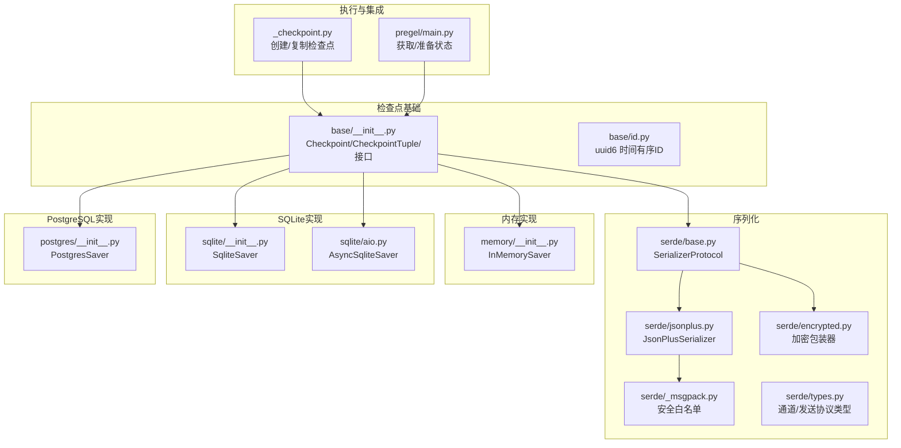
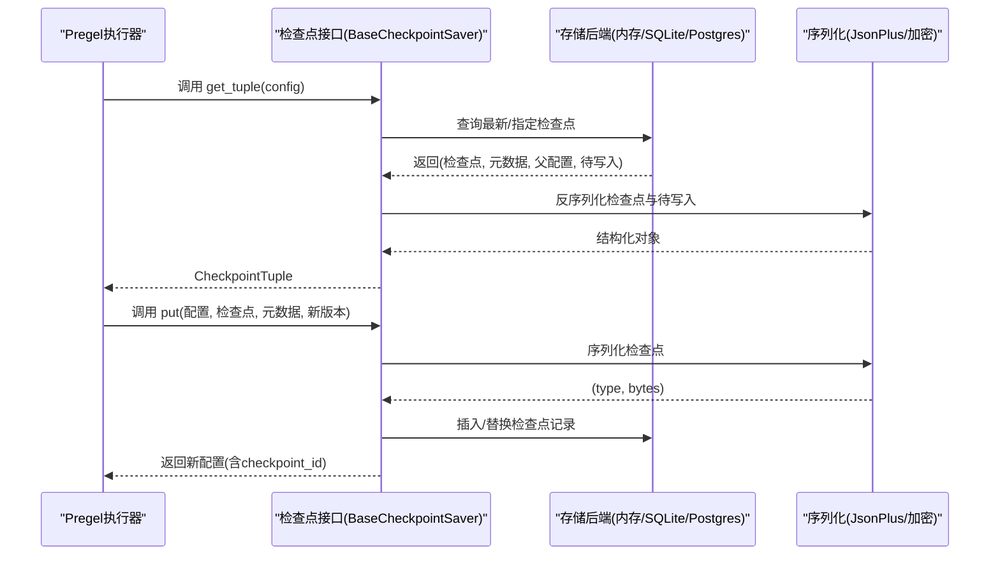
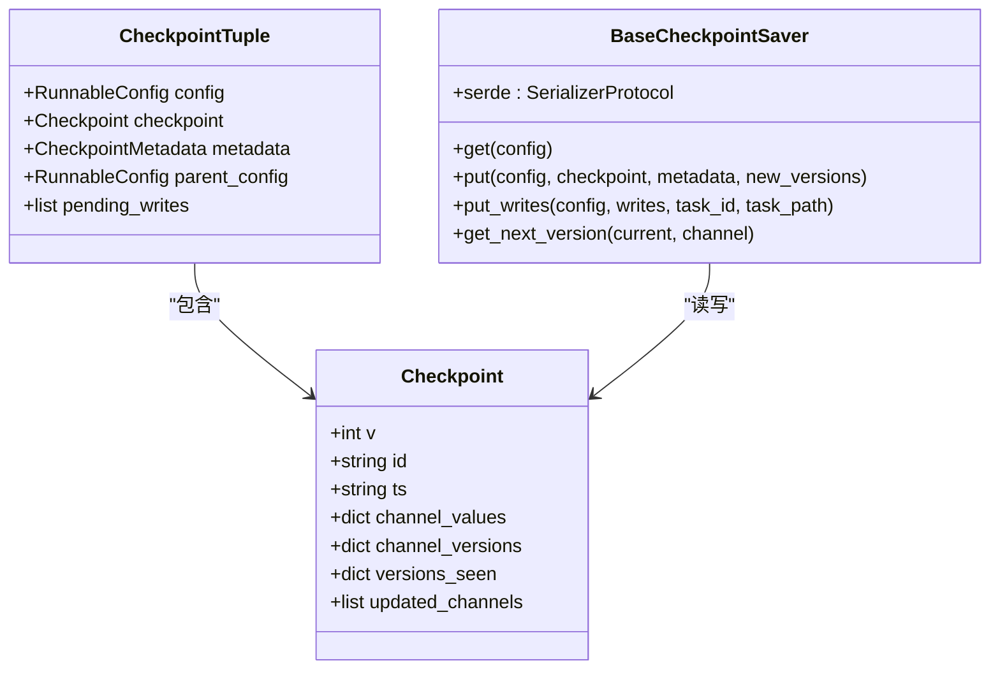
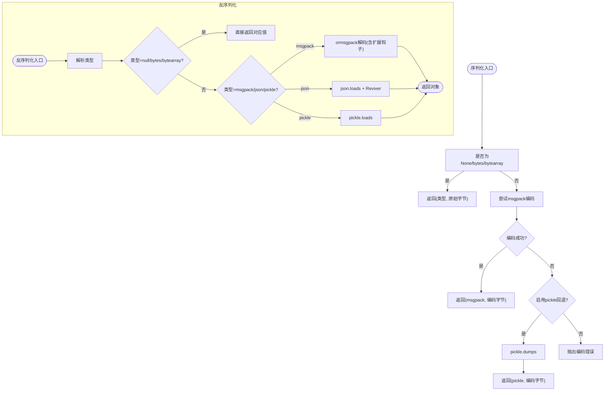
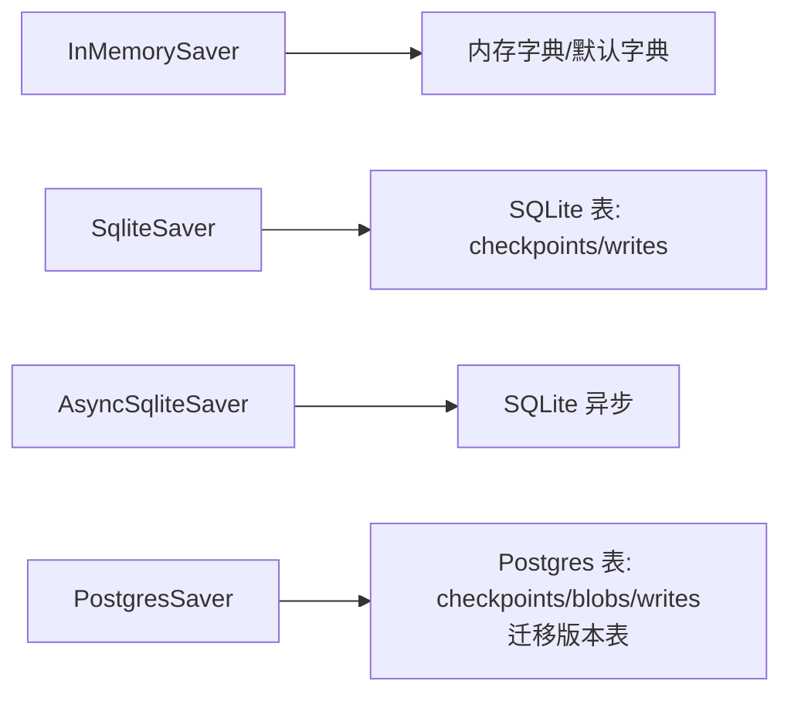
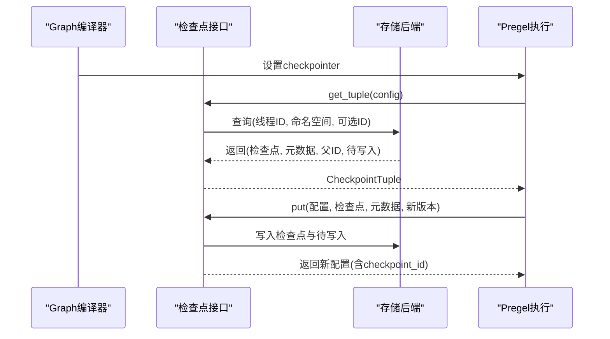
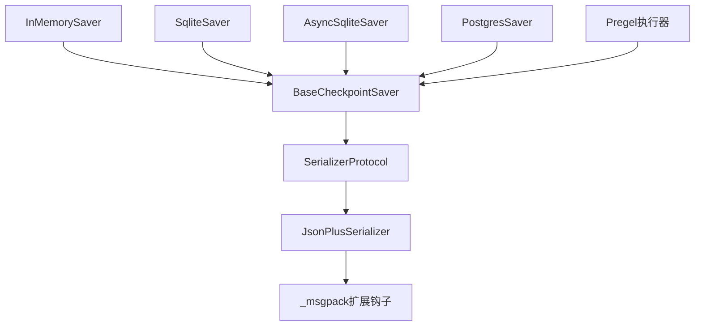

# 检查点机制

<cite>
**本文档引用的文件**
- [libs/checkpoint/langgraph/checkpoint/base/__init__.py](file://libs/checkpoint/langgraph/checkpoint/base/__init__.py)
- [libs/checkpoint/langgraph/checkpoint/base/id.py](file://libs/checkpoint/langgraph/checkpoint/base/id.py)
- [libs/checkpoint/langgraph/checkpoint/memory/__init__.py](file://libs/checkpoint/langgraph/checkpoint/memory/__init__.py)
- [libs/checkpoint/langgraph/checkpoint/serde/base.py](file://libs/checkpoint/langgraph/checkpoint/serde/base.py)
- [libs/checkpoint/langgraph/checkpoint/serde/jsonplus.py](file://libs/checkpoint/langgraph/checkpoint/serde/jsonplus.py)
- [libs/checkpoint/langgraph/checkpoint/serde/_msgpack.py](file://libs/checkpoint/langgraph/checkpoint/serde/_msgpack.py)
- [libs/checkpoint/langgraph/checkpoint/serde/encrypted.py](file://libs/checkpoint/langgraph/checkpoint/serde/encrypted.py)
- [libs/checkpoint/langgraph/checkpoint/serde/types.py](file://libs/checkpoint/langgraph/checkpoint/serde/types.py)
- [libs/checkpoint-sqlite/langgraph/checkpoint/sqlite/__init__.py](file://libs/checkpoint-sqlite/langgraph/checkpoint/sqlite/__init__.py)
- [libs/checkpoint-sqlite/langgraph/checkpoint/sqlite/aio.py](file://libs/checkpoint-sqlite/langgraph/checkpoint/sqlite/aio.py)
- [libs/checkpoint-postgres/langgraph/checkpoint/postgres/__init__.py](file://libs/checkpoint-postgres/langgraph/checkpoint/postgres/__init__.py)
- [libs/langgraph/langgraph/pregel/_checkpoint.py](file://libs/langgraph/langgraph/pregel/_checkpoint.py)
- [libs/langgraph/langgraph/pregel/main.py](file://libs/langgraph/langgraph/pregel/main.py)
- [libs/langgraph/tests/test_checkpoint_migration.py](file://libs/langgraph/tests/test_checkpoint_migration.py)
</cite>

## 目录
1. [简介](#简介)
2. [项目结构](#项目结构)
3. [核心组件](#核心组件)
4. [架构总览](#架构总览)
5. [详细组件分析](#详细组件分析)
6. [依赖关系分析](#依赖关系分析)
7. [性能考量](#性能考量)
8. [故障排查指南](#故障排查指南)
9. [结论](#结论)
10. [附录](#附录)

## 简介
本文件系统性阐述 LangGraph 中“检查点（Checkpoint）”机制的设计与实现，重点覆盖以下方面：
- 检查点在状态化代理中的持久化作用与恢复能力
- 检查点数据结构、版本管理与序列化机制
- 检查点的保存时机、恢复流程与版本迁移策略
- 不同存储后端（内存、SQLite、PostgreSQL）的实现差异与性能特征
- 配置与自定义扩展（接口设计、扩展方法）

## 项目结构
检查点相关代码主要分布在以下模块：
- 基础接口与数据模型：libs/checkpoint/langgraph/checkpoint/base
- 内存实现：libs/checkpoint/langgraph/checkpoint/memory
- 序列化子系统：libs/checkpoint/langgraph/checkpoint/serde
- 存储后端实现：libs/checkpoint-sqlite、libs/checkpoint-postgres
- Pregel 执行与检查点集成：libs/langgraph/langgraph/pregel
- 测试与迁移验证：libs/langgraph/tests

图表来源
- [libs/checkpoint/langgraph/checkpoint/base/__init__.py:65-120](file://libs/checkpoint/langgraph/checkpoint/base/__init__.py#L65-L120)
- [libs/checkpoint/langgraph/checkpoint/base/id.py:79-110](file://libs/checkpoint/langgraph/checkpoint/base/id.py#L79-L110)
- [libs/checkpoint/langgraph/checkpoint/serde/base.py:14-65](file://libs/checkpoint/langgraph/checkpoint/serde/base.py#L14-L65)
- [libs/checkpoint/langgraph/checkpoint/serde/jsonplus.py:50-120](file://libs/checkpoint/langgraph/checkpoint/serde/jsonplus.py#L50-L120)
- [libs/checkpoint/langgraph/checkpoint/serde/_msgpack.py:14-90](file://libs/checkpoint/langgraph/checkpoint/serde/_msgpack.py#L14-L90)
- [libs/checkpoint/langgraph/checkpoint/serde/encrypted.py:8-40](file://libs/checkpoint/langgraph/checkpoint/serde/encrypted.py#L8-L40)
- [libs/checkpoint/langgraph/checkpoint/serde/types.py:22-52](file://libs/checkpoint/langgraph/checkpoint/serde/types.py#L22-L52)
- [libs/checkpoint/langgraph/checkpoint/memory/__init__.py:31-122](file://libs/checkpoint/langgraph/checkpoint/memory/__init__.py#L31-L122)
- [libs/checkpoint-sqlite/langgraph/checkpoint/sqlite/__init__.py:38-121](file://libs/checkpoint-sqlite/langgraph/checkpoint/sqlite/__init__.py#L38-L121)
- [libs/checkpoint-sqlite/langgraph/checkpoint/sqlite/aio.py:351-383](file://libs/checkpoint-sqlite/langgraph/checkpoint/sqlite/aio.py#L351-L383)
- [libs/checkpoint-postgres/langgraph/checkpoint/postgres/__init__.py:32-103](file://libs/checkpoint-postgres/langgraph/checkpoint/postgres/__init__.py#L32-L103)
- [libs/langgraph/langgraph/pregel/_checkpoint.py:16-56](file://libs/langgraph/langgraph/pregel/_checkpoint.py#L16-L56)
- [libs/langgraph/langgraph/pregel/main.py:1273-1303](file://libs/langgraph/langgraph/pregel/main.py#L1273-L1303)

章节来源
- [libs/checkpoint/langgraph/checkpoint/base/__init__.py:65-120](file://libs/checkpoint/langgraph/checkpoint/base/__init__.py#L65-L120)
- [libs/checkpoint/langgraph/checkpoint/memory/__init__.py:31-122](file://libs/checkpoint/langgraph/checkpoint/memory/__init__.py#L31-L122)
- [libs/checkpoint-sqlite/langgraph/checkpoint/sqlite/__init__.py:38-121](file://libs/checkpoint-sqlite/langgraph/checkpoint/sqlite/__init__.py#L38-L121)
- [libs/checkpoint-postgres/langgraph/checkpoint/postgres/__init__.py:32-103](file://libs/checkpoint-postgres/langgraph/checkpoint/postgres/__init__.py#L32-L103)
- [libs/langgraph/langgraph/pregel/_checkpoint.py:16-56](file://libs/langgraph/langgraph/pregel/_checkpoint.py#L16-L56)
- [libs/langgraph/langgraph/pregel/main.py:1273-1303](file://libs/langgraph/langgraph/pregel/main.py#L1273-L1303)

## 核心组件
- 检查点数据模型
  - Checkpoint：包含版本号、唯一ID、时间戳、通道值、通道版本、节点可见版本映射、更新通道列表等字段
  - CheckpointTuple：封装配置、检查点、元数据、父配置、待写入项
  - CheckpointMetadata：附加元信息，如来源、步数、父检查点映射、运行ID等
- 版本与ID
  - 使用 uuid6 生成时间有序且单调递增的ID，确保检查点排序与一致性
- 序列化
  - SerializerProtocol 抽象了 typed dumps/loads 接口
  - JsonPlusSerializer 提供 msgpack/json/pickle 多格式支持，并内置安全白名单与可选回退
  - EncryptedSerializer 对底层序列化结果进行加密包装
- 存储后端
  - InMemorySaver：内存字典结构，适合测试与演示
  - SqliteSaver/AsyncSqliteSaver：SQLite 同步/异步实现
  - PostgresSaver：PostgreSQL 实现，支持迁移与管道优化

章节来源
- [libs/checkpoint/langgraph/checkpoint/base/__init__.py:65-120](file://libs/checkpoint/langgraph/checkpoint/base/__init__.py#L65-L120)
- [libs/checkpoint/langgraph/checkpoint/base/id.py:79-110](file://libs/checkpoint/langgraph/checkpoint/base/id.py#L79-L110)
- [libs/checkpoint/langgraph/checkpoint/serde/base.py:14-65](file://libs/checkpoint/langgraph/checkpoint/serde/base.py#L14-L65)
- [libs/checkpoint/langgraph/checkpoint/serde/jsonplus.py:50-120](file://libs/checkpoint/langgraph/checkpoint/serde/jsonplus.py#L50-L120)
- [libs/checkpoint/langgraph/checkpoint/serde/encrypted.py:8-40](file://libs/checkpoint/langgraph/checkpoint/serde/encrypted.py#L8-L40)
- [libs/checkpoint/langgraph/checkpoint/memory/__init__.py:31-122](file://libs/checkpoint/langgraph/checkpoint/memory/__init__.py#L31-L122)
- [libs/checkpoint-sqlite/langgraph/checkpoint/sqlite/__init__.py:38-121](file://libs/checkpoint-sqlite/langgraph/checkpoint/sqlite/__init__.py#L38-L121)
- [libs/checkpoint-postgres/langgraph/checkpoint/postgres/__init__.py:32-103](file://libs/checkpoint-postgres/langgraph/checkpoint/postgres/__init__.py#L32-L103)

## 架构总览
检查点在 Pregel 执行循环中的关键位置：
- 保存时机：在输入、循环内部、手动更新、分叉等场景下触发
- 恢复流程：通过 checkpointer 获取最新或指定检查点，结合父检查点与待写入项重建状态
- 迁移策略：Postgres 实现内置迁移逻辑，自动处理旧版本检查点的字段补齐

图表来源
- [libs/langgraph/langgraph/pregel/main.py:1273-1303](file://libs/langgraph/langgraph/pregel/main.py#L1273-L1303)
- [libs/checkpoint/langgraph/checkpoint/base/__init__.py:173-244](file://libs/checkpoint/langgraph/checkpoint/base/__init__.py#L173-L244)
- [libs/checkpoint/langgraph/checkpoint/memory/__init__.py:135-216](file://libs/checkpoint/langgraph/checkpoint/memory/__init__.py#L135-L216)
- [libs/checkpoint-sqlite/langgraph/checkpoint/sqlite/__init__.py:184-287](file://libs/checkpoint-sqlite/langgraph/checkpoint/sqlite/__init__.py#L184-L287)
- [libs/checkpoint-postgres/langgraph/checkpoint/postgres/__init__.py:184-254](file://libs/checkpoint-postgres/langgraph/checkpoint/postgres/__init__.py#L184-L254)

## 详细组件分析

### 数据模型与版本管理
- Checkpoint 字段
  - v：格式版本（当前为 1）
  - id：时间有序唯一ID（uuid6）
  - ts：ISO 8601 时间戳
  - channel_values：通道快照值
  - channel_versions：通道版本映射（单调递增）
  - versions_seen：节点到通道版本映射，用于调度决策
  - updated_channels：本次更新的通道列表
- 版本生成
  - 默认整型版本递增；内存/SQLite 实现支持字符串版本（带随机后缀）以保证单调性
- ID 生成
  - uuid6 保证时间有序与单调递增，便于数据库索引与排序

图表来源
- [libs/checkpoint/langgraph/checkpoint/base/__init__.py:65-120](file://libs/checkpoint/langgraph/checkpoint/base/__init__.py#L65-L120)
- [libs/checkpoint/langgraph/checkpoint/base/__init__.py:122-163](file://libs/checkpoint/langgraph/checkpoint/base/__init__.py#L122-L163)

章节来源
- [libs/checkpoint/langgraph/checkpoint/base/__init__.py:65-120](file://libs/checkpoint/langgraph/checkpoint/base/__init__.py#L65-L120)
- [libs/checkpoint/langgraph/checkpoint/base/__init__.py:460-480](file://libs/checkpoint/langgraph/checkpoint/base/__init__.py#L460-L480)
- [libs/checkpoint/langgraph/checkpoint/base/id.py:79-110](file://libs/checkpoint/langgraph/checkpoint/base/id.py#L79-L110)

### 序列化与安全
- SerializerProtocol
  - 规范 dumps_typed/loads_typed 接口，兼容旧式未typed实现
- JsonPlusSerializer
  - 优先使用 ormsgpack/msgpack 编解码，失败时可回退 pickle
  - 支持构造器扩展（Pydantic、datetime、集合、IP地址、Path、正则等），通过扩展码识别
  - 安全白名单控制允许反序列化的模块/方法，严格模式下阻断未注册类型
- 加密包装
  - EncryptedSerializer 将序列化后的二进制进行对称加密，类型名前缀携带加密算法标识

图表来源
- [libs/checkpoint/langgraph/checkpoint/serde/base.py:14-65](file://libs/checkpoint/langgraph/checkpoint/serde/base.py#L14-L65)
- [libs/checkpoint/langgraph/checkpoint/serde/jsonplus.py:228-261](file://libs/checkpoint/langgraph/checkpoint/serde/jsonplus.py#L228-L261)
- [libs/checkpoint/langgraph/checkpoint/serde/_msgpack.py:501-687](file://libs/checkpoint/langgraph/checkpoint/serde/_msgpack.py#L501-L687)
- [libs/checkpoint/langgraph/checkpoint/serde/encrypted.py:17-37](file://libs/checkpoint/langgraph/checkpoint/serde/encrypted.py#L17-L37)

章节来源
- [libs/checkpoint/langgraph/checkpoint/serde/base.py:14-65](file://libs/checkpoint/langgraph/checkpoint/serde/base.py#L14-L65)
- [libs/checkpoint/langgraph/checkpoint/serde/jsonplus.py:50-120](file://libs/checkpoint/langgraph/checkpoint/serde/jsonplus.py#L50-L120)
- [libs/checkpoint/langgraph/checkpoint/serde/_msgpack.py:14-90](file://libs/checkpoint/langgraph/checkpoint/serde/_msgpack.py#L14-L90)
- [libs/checkpoint/langgraph/checkpoint/serde/encrypted.py:8-40](file://libs/checkpoint/langgraph/checkpoint/serde/encrypted.py#L8-L40)

### 存储后端实现对比
- InMemorySaver
  - 存储结构：线程ID -> 命名空间 -> 检查点ID -> (检查点, 元数据, 父ID)
  - 待写入：(线程ID, 命名空间, 检查点ID) -> [(任务ID, 通道, 类型, 值, 路径)]
  - 版本生成：字符串版本（主版本+随机后缀），保证单调递增
  - 适用：测试/演示，不适用于生产多线程环境
- SqliteSaver
  - 表结构：checkpoints（主键）、writes（主键）
  - 并发：使用锁保护，不支持异步方法（提示使用 AsyncSqliteSaver）
  - 版本生成：字符串版本（主版本+随机后缀）
- AsyncSqliteSaver
  - 异步实现，需安装 aiosqlite
- PostgresSaver
  - 表结构：checkpoints、checkpoint_blobs、checkpoint_writes
  - 迁移：首次使用时自动执行迁移脚本，维护迁移版本表
  - 管道：支持使用 Pipeline 提升批量写入性能
  - 待写入：按任务ID与索引有序存储，支持特殊写入类型映射

图表来源
- [libs/checkpoint/langgraph/checkpoint/memory/__init__.py:66-98](file://libs/checkpoint/langgraph/checkpoint/memory/__init__.py#L66-L98)
- [libs/checkpoint-sqlite/langgraph/checkpoint/sqlite/__init__.py:132-159](file://libs/checkpoint-sqlite/langgraph/checkpoint/sqlite/__init__.py#L132-L159)
- [libs/checkpoint-postgres/langgraph/checkpoint/postgres/__init__.py:77-103](file://libs/checkpoint-postgres/langgraph/checkpoint/postgres/__init__.py#L77-L103)

章节来源
- [libs/checkpoint/langgraph/checkpoint/memory/__init__.py:31-122](file://libs/checkpoint/langgraph/checkpoint/memory/__init__.py#L31-L122)
- [libs/checkpoint-sqlite/langgraph/checkpoint/sqlite/__init__.py:38-121](file://libs/checkpoint-sqlite/langgraph/checkpoint/sqlite/__init__.py#L38-L121)
- [libs/checkpoint-sqlite/langgraph/checkpoint/sqlite/aio.py:351-383](file://libs/checkpoint-sqlite/langgraph/checkpoint/sqlite/aio.py#L351-L383)
- [libs/checkpoint-postgres/langgraph/checkpoint/postgres/__init__.py:32-103](file://libs/checkpoint-postgres/langgraph/checkpoint/postgres/__init__.py#L32-L103)

### 检查点保存与恢复流程
- 保存时机
  - 输入触发（source=input）
  - 循环内触发（source=loop）
  - 手动更新（source=update）
  - 分叉复制（source=fork）
- 恢复流程
  - 通过 checkpointer.get_tuple(config) 获取最新或指定检查点
  - 若未指定检查点ID，则自动选择最大ID（时间有序）
  - 合并父检查点与待写入项，重建通道状态
- 版本迁移
  - Postgres 实现会在查询/列表时检测旧版本检查点，必要时迁移“待发送”字段

图表来源
- [libs/langgraph/langgraph/pregel/main.py:1273-1303](file://libs/langgraph/langgraph/pregel/main.py#L1273-L1303)
- [libs/checkpoint/langgraph/checkpoint/base/__init__.py:173-244](file://libs/checkpoint/langgraph/checkpoint/base/__init__.py#L173-L244)
- [libs/checkpoint-postgres/langgraph/checkpoint/postgres/__init__.py:184-254](file://libs/checkpoint-postgres/langgraph/checkpoint/postgres/__init__.py#L184-L254)

章节来源
- [libs/langgraph/langgraph/pregel/main.py:1273-1303](file://libs/langgraph/langgraph/pregel/main.py#L1273-L1303)
- [libs/checkpoint/langgraph/checkpoint/base/__init__.py:35-61](file://libs/checkpoint/langgraph/checkpoint/base/__init__.py#L35-L61)
- [libs/checkpoint-postgres/langgraph/checkpoint/postgres/__init__.py:156-183](file://libs/checkpoint-postgres/langgraph/checkpoint/postgres/__init__.py#L156-L183)

### 版本迁移策略
- 检查点格式版本
  - Checkpoint.v 当前为 1；Pregel 内部使用更高版本常量
- 迁移实现
  - Postgres：在查询/列表时检测旧版本，必要时从父检查点迁移“待发送”字段
  - 测试覆盖：通过历史检查点序列模拟旧版本数据，验证迁移路径

章节来源
- [libs/langgraph/langgraph/pregel/_checkpoint.py:13-13](file://libs/langgraph/langgraph/pregel/_checkpoint.py#L13-L13)
- [libs/checkpoint-postgres/langgraph/checkpoint/postgres/__init__.py:156-183](file://libs/checkpoint-postgres/langgraph/checkpoint/postgres/__init__.py#L156-L183)
- [libs/langgraph/tests/test_checkpoint_migration.py:1673-1690](file://libs/langgraph/tests/test_checkpoint_migration.py#L1673-L1690)

### 配置与自定义扩展
- 配置要点
  - thread_id：主键，决定状态归属
  - checkpoint_ns：命名空间，支持多命名空间隔离
  - checkpoint_id：指定检查点ID，用于精确恢复或时间旅行调试
- 自定义实现
  - 继承 BaseCheckpointSaver，实现 get/get_tuple/put/put_writes/list/delete_thread 等方法
  - 可通过 with_allowlist 或 JsonSerializer 的 allowlist 控制反序列化白名单
  - 可通过 EncryptedSerializer 包装任意 serde 实现，实现透明加密

章节来源
- [libs/checkpoint/langgraph/checkpoint/base/__init__.py:122-163](file://libs/checkpoint/langgraph/checkpoint/base/__init__.py#L122-L163)
- [libs/checkpoint/langgraph/checkpoint/serde/jsonplus.py:89-120](file://libs/checkpoint/langgraph/checkpoint/serde/jsonplus.py#L89-L120)
- [libs/checkpoint/langgraph/checkpoint/serde/encrypted.py:8-40](file://libs/checkpoint/langgraph/checkpoint/serde/encrypted.py#L8-L40)

## 依赖关系分析
- 组件耦合
  - BaseCheckpointSaver 依赖 SerializerProtocol，具体由 JsonPlusSerializer 提供
  - 各存储后端均依赖 BaseCheckpointSaver 接口，保持统一行为
  - Pregel 执行器通过 get_tuple/put 与检查点接口交互
- 外部依赖
  - SQLite：sqlite3（同步）、aiosqlite（异步）
  - PostgreSQL：psycopg/psycopg_pool，支持 Pipeline
  - 序列化：ormsgpack、pickle、langchain-core Reviver

图表来源
- [libs/checkpoint/langgraph/checkpoint/base/__init__.py:122-163](file://libs/checkpoint/langgraph/checkpoint/base/__init__.py#L122-L163)
- [libs/checkpoint/langgraph/checkpoint/serde/base.py:14-65](file://libs/checkpoint/langgraph/checkpoint/serde/base.py#L14-L65)
- [libs/checkpoint/langgraph/checkpoint/serde/jsonplus.py:50-120](file://libs/checkpoint/langgraph/checkpoint/serde/jsonplus.py#L50-L120)
- [libs/checkpoint/langgraph/checkpoint/serde/_msgpack.py:501-687](file://libs/checkpoint/langgraph/checkpoint/serde/_msgpack.py#L501-L687)
- [libs/checkpoint/langgraph/checkpoint/memory/__init__.py:31-122](file://libs/checkpoint/langgraph/checkpoint/memory/__init__.py#L31-L122)
- [libs/checkpoint-sqlite/langgraph/checkpoint/sqlite/__init__.py:38-121](file://libs/checkpoint-sqlite/langgraph/checkpoint/sqlite/__init__.py#L38-L121)
- [libs/checkpoint-sqlite/langgraph/checkpoint/sqlite/aio.py:351-383](file://libs/checkpoint-sqlite/langgraph/checkpoint/sqlite/aio.py#L351-L383)
- [libs/checkpoint-postgres/langgraph/checkpoint/postgres/__init__.py:32-103](file://libs/checkpoint-postgres/langgraph/checkpoint/postgres/__init__.py#L32-L103)
- [libs/langgraph/langgraph/pregel/main.py:1273-1303](file://libs/langgraph/langgraph/pregel/main.py#L1273-L1303)

章节来源
- [libs/checkpoint/langgraph/checkpoint/base/__init__.py:122-163](file://libs/checkpoint/langgraph/checkpoint/base/__init__.py#L122-L163)
- [libs/checkpoint/langgraph/checkpoint/serde/base.py:14-65](file://libs/checkpoint/langgraph/checkpoint/serde/base.py#L14-L65)
- [libs/checkpoint/langgraph/checkpoint/serde/jsonplus.py:50-120](file://libs/checkpoint/langgraph/checkpoint/serde/jsonplus.py#L50-L120)
- [libs/checkpoint/langgraph/checkpoint/serde/_msgpack.py:501-687](file://libs/checkpoint/langgraph/checkpoint/serde/_msgpack.py#L501-L687)
- [libs/checkpoint/langgraph/checkpoint/memory/__init__.py:31-122](file://libs/checkpoint/langgraph/checkpoint/memory/__init__.py#L31-L122)
- [libs/checkpoint-sqlite/langgraph/checkpoint/sqlite/__init__.py:38-121](file://libs/checkpoint-sqlite/langgraph/checkpoint/sqlite/__init__.py#L38-L121)
- [libs/checkpoint-sqlite/langgraph/checkpoint/sqlite/aio.py:351-383](file://libs/checkpoint-sqlite/langgraph/checkpoint/sqlite/aio.py#L351-L383)
- [libs/checkpoint-postgres/langgraph/checkpoint/postgres/__init__.py:32-103](file://libs/checkpoint-postgres/langgraph/checkpoint/postgres/__init__.py#L32-L103)
- [libs/langgraph/langgraph/pregel/main.py:1273-1303](file://libs/langgraph/langgraph/pregel/main.py#L1273-L1303)

## 性能考量
- 序列化
  - JsonPlusSerializer 优先使用 msgpack，性能优于 pickle；严格模式下阻断未知类型，避免反序列化开销
- 存储
  - SQLite：单连接串行写入，适合轻量级场景；异步场景建议 AsyncSqliteSaver
  - PostgreSQL：支持 Pipeline 批量写入，减少网络往返；大对象拆分存储于 blobs 表
- 并发
  - InMemorySaver 仅适合单线程测试；SQLite/PG 实现通过锁或连接池保障一致性
- 版本与ID
  - uuid6 保证时间有序，利于索引与排序；字符串版本（含随机后缀）避免并发冲突

## 故障排查指南
- 常见问题
  - 反序列化类型被阻断：检查 allowed_json_modules/allowed_msgpack_modules 配置
  - 未设置 LANGGRAPH_AES_KEY：加密序列化器初始化失败
  - SQLite 异步调用报错：使用 AsyncSqliteSaver 或禁用异步方法
  - Postgres 迁移未执行：首次使用需显式调用 setup() 或让实现自动迁移
- 定位手段
  - 查看 CheckpointTuple 中的父配置与待写入项，确认恢复路径
  - 在 Postgres 实现中，利用迁移逻辑自动补齐旧版本字段

章节来源
- [libs/checkpoint/langgraph/checkpoint/serde/jsonplus.py:192-227](file://libs/checkpoint/langgraph/checkpoint/serde/jsonplus.py#L192-L227)
- [libs/checkpoint/langgraph/checkpoint/serde/encrypted.py:42-60](file://libs/checkpoint/langgraph/checkpoint/serde/encrypted.py#L42-L60)
- [libs/checkpoint-sqlite/langgraph/checkpoint/sqlite/__init__.py:27-35](file://libs/checkpoint-sqlite/langgraph/checkpoint/sqlite/__init__.py#L27-L35)
- [libs/checkpoint-postgres/langgraph/checkpoint/postgres/__init__.py:77-103](file://libs/checkpoint-postgres/langgraph/checkpoint/postgres/__init__.py#L77-L103)
- [libs/checkpoint-postgres/langgraph/checkpoint/postgres/__init__.py:156-183](file://libs/checkpoint-postgres/langgraph/checkpoint/postgres/__init__.py#L156-L183)

## 结论
检查点机制通过统一的接口抽象、严谨的数据模型与序列化安全策略，实现了状态化代理在故障与长时间运行中的持久化与可恢复性。不同存储后端在性能与功能上各有侧重：内存实现简单高效但不适用于生产；SQLite 适合轻量级应用；PostgreSQL 提供完善的迁移与性能优化能力。通过合理的配置与扩展，用户可在安全性、性能与易用性之间取得平衡。

## 附录
- 关键接口与类
  - BaseCheckpointSaver：检查点存取抽象
  - Checkpoint/CheckpointTuple：检查点数据结构
  - SerializerProtocol/JsonPlusSerializer/EncryptedSerializer：序列化与加密
  - InMemorySaver/SqliteSaver/AsyncSqliteSaver/PostgresSaver：存储后端
- 相关实现参考
  - 创建检查点：[libs/langgraph/langgraph/pregel/_checkpoint.py:27-56](file://libs/langgraph/langgraph/pregel/_checkpoint.py#L27-L56)
  - 恢复与准备状态：[libs/langgraph/langgraph/pregel/main.py:1273-1303](file://libs/langgraph/langgraph/pregel/main.py#L1273-L1303)
  - 迁移测试：[libs/langgraph/tests/test_checkpoint_migration.py:1673-1690](file://libs/langgraph/tests/test_checkpoint_migration.py#L1673-L1690)