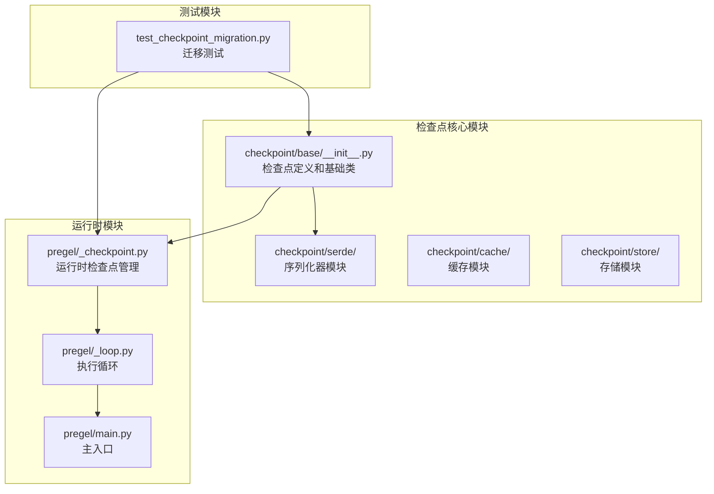
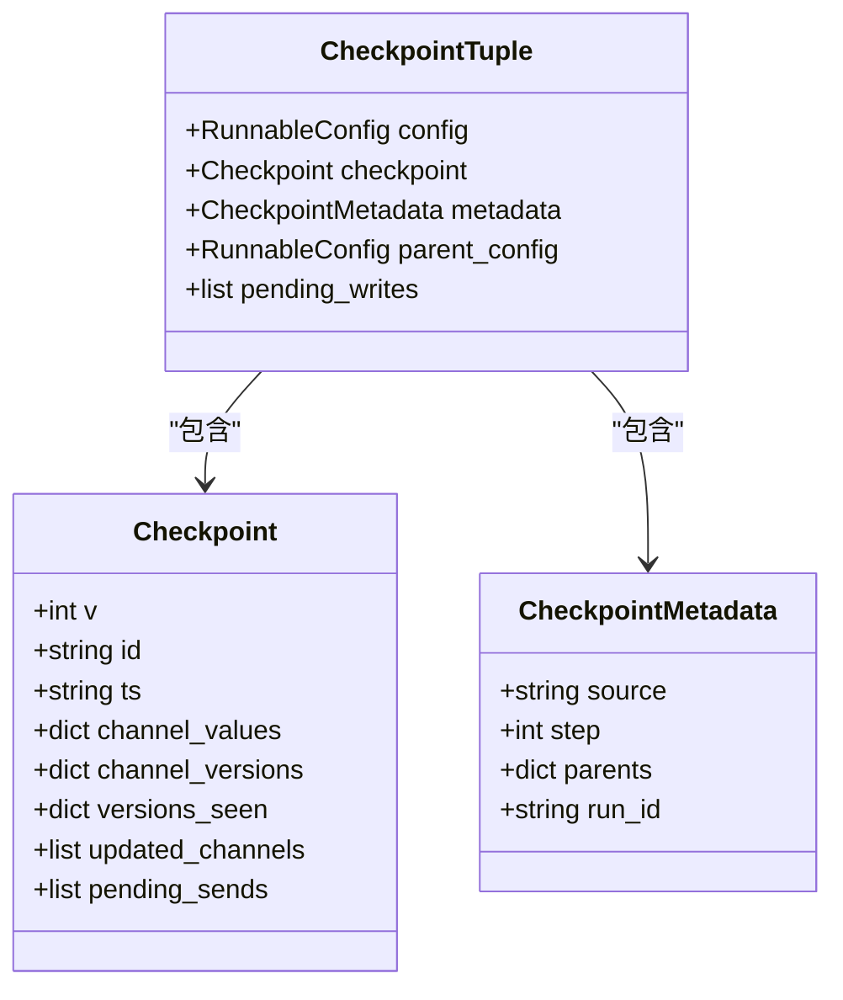
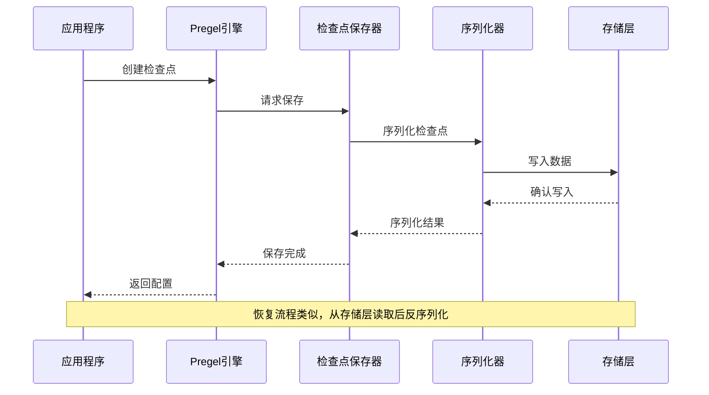
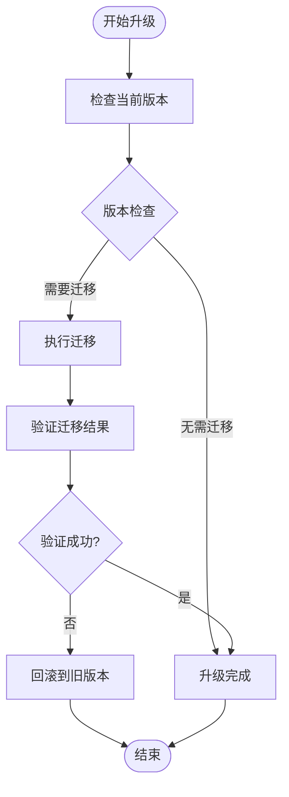
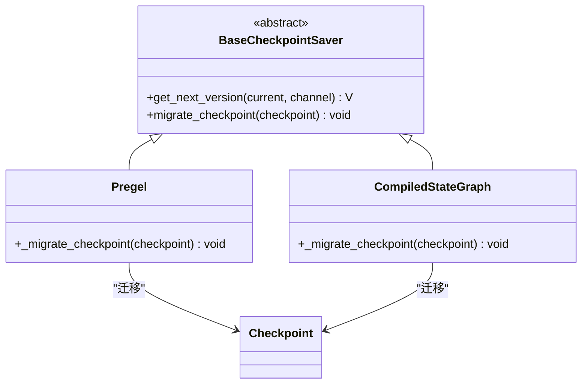
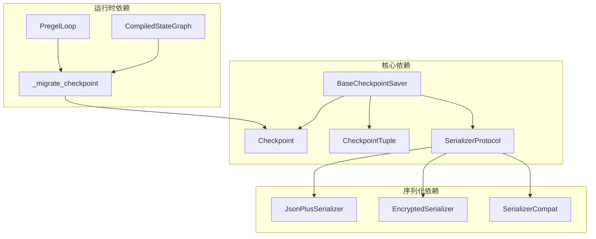

# 检查点版本管理

<cite>
**本文档引用的文件**
- [libs/checkpoint/langgraph/checkpoint/base/__init__.py](file://libs/checkpoint/langgraph/checkpoint/base/__init__.py)
- [libs/checkpoint/langgraph/checkpoint/serde/base.py](file://libs/checkpoint/langgraph/checkpoint/serde/base.py)
- [libs/checkpoint/langgraph/checkpoint/serde/jsonplus.py](file://libs/checkpoint/langgraph/checkpoint/serde/jsonplus.py)
- [libs/checkpoint/langgraph/checkpoint/serde/_msgpack.py](file://libs/checkpoint/langgraph/checkpoint/serde/_msgpack.py)
- [libs/checkpoint/langgraph/checkpoint/serde/encrypted.py](file://libs/checkpoint/langgraph/checkpoint/serde/encrypted.py)
- [libs/langgraph/langgraph/pregel/_checkpoint.py](file://libs/langgraph/langgraph/pregel/_checkpoint.py)
- [libs/langgraph/langgraph/pregel/_loop.py](file://libs/langgraph/langgraph/pregel/_loop.py)
- [libs/langgraph/langgraph/pregel/main.py](file://libs/langgraph/langgraph/pregel/main.py)
- [libs/langgraph/tests/test_checkpoint_migration.py](file://libs/langgraph/tests/test_checkpoint_migration.py)
</cite>

## 目录
1. [简介](#简介)
2. [项目结构](#项目结构)
3. [核心组件](#核心组件)
4. [架构概览](#架构概览)
5. [详细组件分析](#详细组件分析)
6. [依赖关系分析](#依赖关系分析)
7. [性能考虑](#性能考虑)
8. [故障排除指南](#故障排除指南)
9. [结论](#结论)
10. [附录](#附录)

## 简介

检查点版本管理是LangGraph框架中一个关键的基础设施组件，负责管理状态快照的持久化、版本演进和兼容性保证。该系统通过精心设计的版本标识符、迁移机制和向后兼容性策略，确保在不中断服务的情况下进行系统升级和功能演进。

LangGraph的检查点系统采用双层版本控制机制：应用层版本（LATEST_VERSION）和检查点格式版本（Checkpoint.v）。这种设计允许在保持运行时兼容性的同时，逐步引入新的功能和改进。

## 项目结构

检查点版本管理系统主要分布在以下模块中：

**图表来源**
- [libs/checkpoint/langgraph/checkpoint/base/__init__.py:1-629](file://libs/checkpoint/langgraph/checkpoint/base/__init__.py#L1-L629)
- [libs/langgraph/langgraph/pregel/_checkpoint.py:1-89](file://libs/langgraph/langgraph/pregel/_checkpoint.py#L1-L89)

**章节来源**
- [libs/checkpoint/langgraph/checkpoint/base/__init__.py:1-629](file://libs/checkpoint/langgraph/checkpoint/base/__init__.py#L1-L629)
- [libs/langgraph/langgraph/pregel/_checkpoint.py:1-89](file://libs/langgraph/langgraph/pregel/_checkpoint.py#L1-L89)

## 核心组件

### 检查点数据结构

检查点系统的核心数据结构是一个类型化的字典，包含以下关键字段：

**图表来源**
- [libs/checkpoint/langgraph/checkpoint/base/__init__.py:65-120](file://libs/checkpoint/langgraph/checkpoint/base/__init__.py#L65-L120)

### 版本标识符设计

检查点系统采用复合版本标识符机制：

1. **格式版本（v字段）**：表示检查点数据结构的格式版本
2. **通道版本（channel_versions）**：每个通道的独立版本号
3. **节点版本跟踪（versions_seen）**：记录节点看到的通道版本

**章节来源**
- [libs/checkpoint/langgraph/checkpoint/base/__init__.py:65-120](file://libs/checkpoint/langgraph/checkpoint/base/__init__.py#L65-L120)
- [libs/langgraph/langgraph/pregel/_checkpoint.py:13-24](file://libs/langgraph/langgraph/pregel/_checkpoint.py#L13-L24)

## 架构概览

检查点版本管理系统的整体架构如下：

**图表来源**
- [libs/langgraph/langgraph/pregel/_loop.py:1138-1204](file://libs/langgraph/langgraph/pregel/_loop.py#L1138-L1204)
- [libs/checkpoint/langgraph/checkpoint/serde/jsonplus.py:228-261](file://libs/checkpoint/langgraph/checkpoint/serde/jsonplus.py#L228-L261)

## 详细组件分析

### 版本演进策略

检查点系统的版本演进遵循渐进式升级原则：

**图表来源**
- [libs/langgraph/tests/test_checkpoint_migration.py:1474-1508](file://libs/langgraph/tests/test_checkpoint_migration.py#L1474-L1508)

### 迁移机制实现

迁移机制通过`_migrate_checkpoint`方法实现，支持多版本间的平滑转换：

**图表来源**
- [libs/langgraph/langgraph/pregel/main.py:1012-1017](file://libs/langgraph/langgraph/pregel/main.py#L1012-L1017)
- [libs/langgraph/langgraph/graph/state.py:1413-1417](file://libs/langgraph/langgraph/graph/state.py#L1413-L1417)

### 向后兼容性保证

系统通过多种机制确保向后兼容性：

1. **版本字段保留**：所有检查点都包含版本信息
2. **可选字段处理**：新版本中的可选字段在旧版本中被忽略
3. **默认值机制**：未提供的字段使用合理的默认值
4. **类型兼容性**：支持多种数据类型的序列化和反序列化

**章节来源**
- [libs/checkpoint/langgraph/checkpoint/base/__init__.py:460-490](file://libs/checkpoint/langgraph/checkpoint/base/__init__.py#L460-L490)
- [libs/checkpoint/langgraph/checkpoint/serde/jsonplus.py:142-227](file://libs/checkpoint/langgraph/checkpoint/serde/jsonplus.py#L142-L227)

### 数据格式升级

数据格式升级通过以下步骤实现：

1. **格式检测**：识别检查点的当前格式版本
2. **字段映射**：建立新旧格式字段之间的映射关系
3. **数据转换**：将旧格式数据转换为新格式
4. **完整性验证**：确保转换后的数据完整性和一致性

**章节来源**
- [libs/langgraph/tests/test_checkpoint_migration.py:1480-1508](file://libs/langgraph/tests/test_checkpoint_migration.py#L1480-L1508)

### 废弃字段处理

系统采用渐进式废弃策略：

```mermaid
stateDiagram-v2
[*] --> Active
Active --> Deprecated : 字段标记为废弃
Deprecated --> Removed : 经过兼容期
Removed --> [*] : 完全移除
note right of Deprecated
在兼容期内仍可读取
新版本中忽略该字段
end note
note right of Removed
完全不支持
读取时返回默认值
end note
```

**图表来源**
- [libs/checkpoint/langgraph/checkpoint/base/__init__.py:577-595](file://libs/checkpoint/langgraph/checkpoint/base/__init__.py#L577-L595)

## 依赖关系分析

检查点版本管理系统的关键依赖关系：

**图表来源**
- [libs/checkpoint/langgraph/checkpoint/base/__init__.py:122-153](file://libs/checkpoint/langgraph/checkpoint/base/__init__.py#L122-L153)
- [libs/checkpoint/langgraph/checkpoint/serde/base.py:14-65](file://libs/checkpoint/langgraph/checkpoint/serde/base.py#L14-L65)

**章节来源**
- [libs/checkpoint/langgraph/checkpoint/serde/base.py:1-65](file://libs/checkpoint/langgraph/checkpoint/serde/base.py#L1-L65)
- [libs/checkpoint/langgraph/checkpoint/serde/jsonplus.py:1-800](file://libs/checkpoint/langgraph/checkpoint/serde/jsonplus.py#L1-L800)

## 性能考虑

检查点版本管理在性能方面的优化策略：

1. **增量序列化**：只序列化发生变化的通道
2. **内存优化**：使用浅拷贝减少内存分配
3. **异步操作**：支持异步检查点操作
4. **缓存机制**：利用内存缓存提高访问速度

**章节来源**
- [libs/checkpoint/langgraph/checkpoint/base/__init__.py:99-109](file://libs/checkpoint/langgraph/checkpoint/base/__init__.py#L99-L109)
- [libs/checkpoint/langgraph/checkpoint/base/__init__.py:316-458](file://libs/checkpoint/langgraph/checkpoint/base/__init__.py#L316-L458)

## 故障排除指南

### 常见问题及解决方案

1. **版本不兼容错误**
   - 检查检查点格式版本是否匹配
   - 确认迁移函数是否正确实现
   - 验证序列化器配置

2. **序列化失败**
   - 检查对象是否在允许列表中
   - 验证加密密钥配置
   - 确认存储权限设置

3. **迁移失败**
   - 查看迁移日志输出
   - 验证源和目标版本的兼容性
   - 检查数据完整性

**章节来源**
- [libs/checkpoint/langgraph/checkpoint/serde/jsonplus.py:192-227](file://libs/checkpoint/langgraph/checkpoint/serde/jsonplus.py#L192-L227)
- [libs/checkpoint/langgraph/checkpoint/serde/encrypted.py:50-81](file://libs/checkpoint/langgraph/checkpoint/serde/encrypted.py#L50-L81)

## 结论

LangGraph的检查点版本管理系统通过精心设计的架构和完善的机制，实现了对状态持久化的可靠管理。其核心优势包括：

1. **强健的版本控制**：双层版本机制确保了系统的可演进性
2. **向后兼容性**：通过多种策略保证了升级过程的平滑过渡
3. **安全性保障**：严格的序列化控制和加密支持
4. **性能优化**：高效的序列化和缓存机制

该系统为构建长期运行的状态化代理提供了坚实的基础，支持在不影响现有服务的情况下进行功能扩展和系统升级。

## 附录

### 最佳实践指南

1. **版本管理**
   - 始终在新版本中保持向后兼容
   - 使用语义化版本控制
   - 提供明确的迁移路径文档

2. **数据安全**
   - 启用适当的加密选项
   - 定期轮换加密密钥
   - 实施访问控制机制

3. **监控和维护**
   - 建立版本升级监控
   - 定期备份检查点数据
   - 实施性能监控指标

4. **测试策略**
   - 编写全面的迁移测试
   - 实施灰度发布策略
   - 建立回滚机制