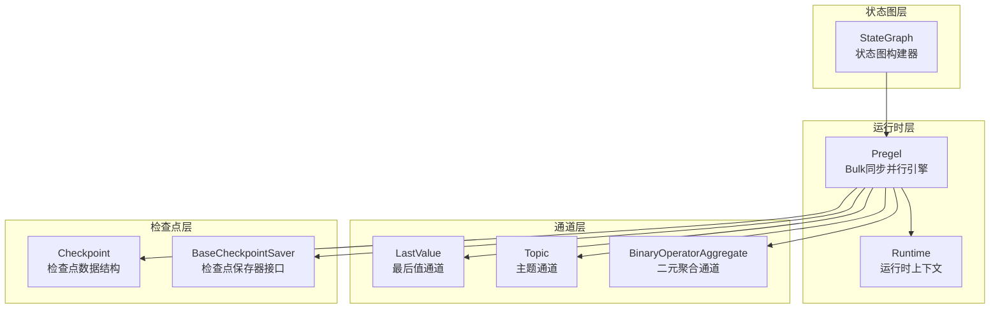
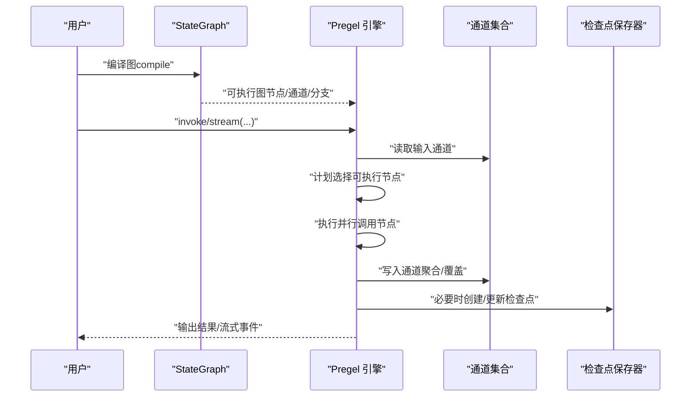
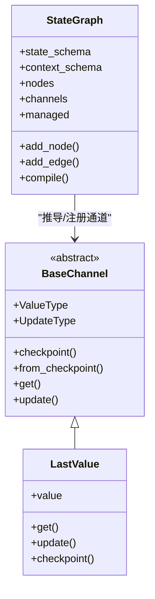
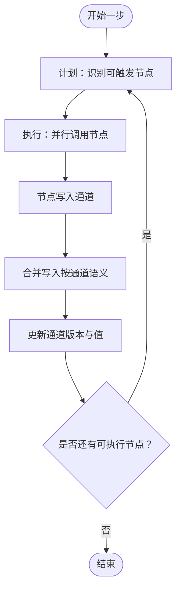
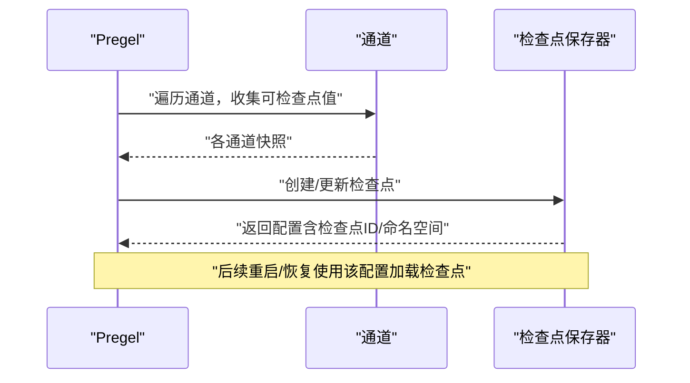
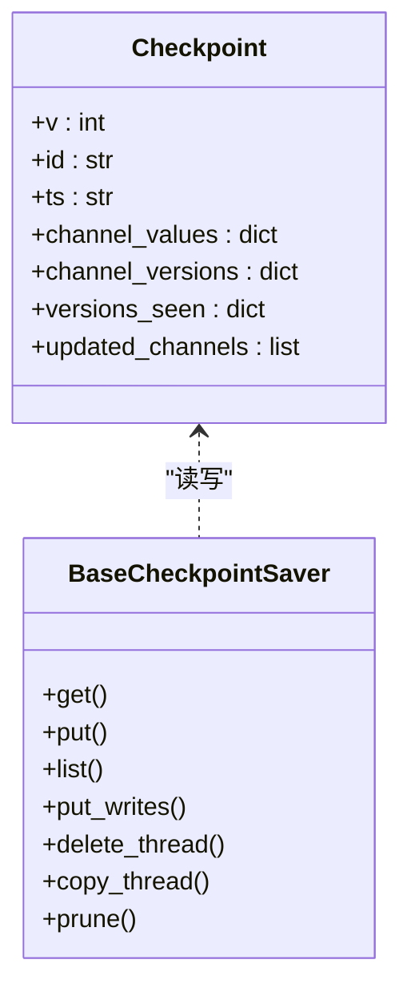
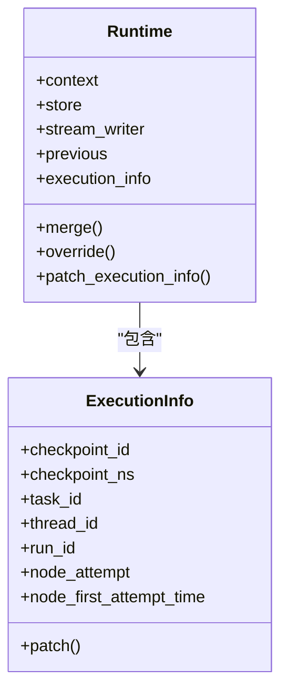
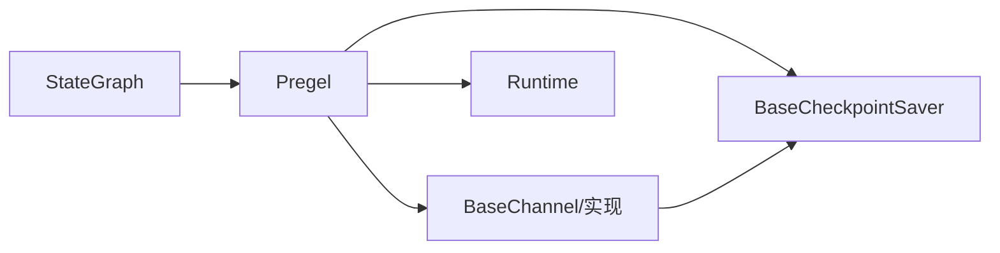

# 状态化代理原理

<cite>
**本文引用的文件**
- [README.md](file://README.md)
- [libs/langgraph/langgraph/graph/state.py](file://libs/langgraph/langgraph/graph/state.py)
- [libs/langgraph/langgraph/pregel/main.py](file://libs/langgraph/langgraph/pregel/main.py)
- [libs/langgraph/langgraph/pregel/_checkpoint.py](file://libs/langgraph/langgraph/pregel/_checkpoint.py)
- [libs/langgraph/langgraph/channels/base.py](file://libs/langgraph/langgraph/channels/base.py)
- [libs/langgraph/langgraph/channels/last_value.py](file://libs/langgraph/langgraph/channels/last_value.py)
- [libs/langgraph/langgraph/runtime.py](file://libs/langgraph/langgraph/runtime.py)
- [libs/checkpoint/langgraph/checkpoint/base/__init__.py](file://libs/checkpoint/langgraph/checkpoint/base/__init__.py)
</cite>

## 目录
1. [引言](#引言)
2. [项目结构](#项目结构)
3. [核心组件](#核心组件)
4. [架构总览](#架构总览)
5. [详细组件分析](#详细组件分析)
6. [依赖分析](#依赖分析)
7. [性能考量](#性能考量)
8. [故障排查指南](#故障排查指南)
9. [结论](#结论)
10. [附录：代码示例路径](#附录代码示例路径)

## 引言
本文件系统性阐述“状态化代理”的核心原理与实现方式，重点对比其与传统流程图范式的差异与优势，并深入解析状态在代理执行中的中心地位。我们将从以下维度展开：
- 状态定义与类型系统：如何通过 TypedDict/Annotated/reducer 定义可聚合的状态键。
- 状态在节点间的传递与更新：基于通道（channels）的读写模型与聚合策略。
- 长运行与持久化：检查点（checkpoint）、线程（thread）、版本追踪与恢复。
- 快照与恢复：状态快照格式、版本演进与时间旅行调试。
- 实战示例路径：提供可直接定位到仓库中示例与实现的路径，帮助读者快速上手。

LangGraph 的目标是为“长期运行、具备状态的编排工作流或智能体”提供底层基础设施，支持失败后自动恢复、人机协同中断、内存与持久化、可观测性与生产级部署。

章节来源
- [README.md:1-83](file://README.md#L1-L83)

## 项目结构
LangGraph 采用分层模块化设计：
- graph/state.py：状态图构建器，负责将节点、分支、通道与管理值组织成可编译的执行图。
- pregel/main.py：运行时引擎（Pregel），实现 Bulk Synchronous Parallel 模型，调度节点、管理通道与检查点。
- channels/*：通道抽象与具体实现（LastValue、Topic、BinaryOperatorAggregate 等），用于节点间通信与状态存储。
- checkpoint/*：检查点基类与序列化协议，支撑持久化、版本追踪与恢复。
- runtime.py：运行时上下文（Runtime），向节点注入上下文、存储、流写入器等。

图表来源
- [libs/langgraph/langgraph/graph/state.py:115-250](file://libs/langgraph/langgraph/graph/state.py#L115-L250)
- [libs/langgraph/langgraph/pregel/main.py:337-717](file://libs/langgraph/langgraph/pregel/main.py#L337-L717)
- [libs/langgraph/langgraph/channels/last_value.py:20-152](file://libs/langgraph/langgraph/channels/last_value.py#L20-L152)
- [libs/checkpoint/langgraph/checkpoint/base/__init__.py:65-120](file://libs/checkpoint/langgraph/checkpoint/base/__init__.py#L65-L120)

章节来源
- [libs/langgraph/langgraph/graph/state.py:115-250](file://libs/langgraph/langgraph/graph/state.py#L115-L250)
- [libs/langgraph/langgraph/pregel/main.py:337-717](file://libs/langgraph/langgraph/pregel/main.py#L337-L717)

## 核心组件
- 状态图（StateGraph）：声明式地定义状态模式、节点、边与分支；编译后生成可执行图。
- Pregel 引擎：按步推进执行，每步包含“计划—执行—更新”，并维护通道与任务队列。
- 通道（Channels）：抽象的共享内存单元，支持 LastValue、Topic、BinaryOperatorAggregate 等。
- 检查点（Checkpoint）：记录通道快照、版本与元数据，支持恢复、并发控制与调试。
- 运行时（Runtime）：向节点注入上下文、存储与流写入器，便于访问外部资源与调试。

章节来源
- [libs/langgraph/langgraph/graph/state.py:115-250](file://libs/langgraph/langgraph/graph/state.py#L115-L250)
- [libs/langgraph/langgraph/pregel/main.py:337-717](file://libs/langgraph/langgraph/pregel/main.py#L337-L717)
- [libs/langgraph/langgraph/channels/base.py:19-122](file://libs/langgraph/langgraph/channels/base.py#L19-L122)
- [libs/checkpoint/langgraph/checkpoint/base/__init__.py:65-120](file://libs/checkpoint/langgraph/checkpoint/base/__init__.py#L65-L120)
- [libs/langgraph/langgraph/runtime.py:89-245](file://libs/langgraph/langgraph/runtime.py#L89-L245)

## 架构总览
LangGraph 的执行遵循 Bulk Synchronous Parallel（BSP）模型：
- 计划阶段：根据通道版本与触发条件选择待执行节点。
- 执行阶段：并行执行节点，节点通过通道读取输入并写入输出。
- 更新阶段：合并节点写入，更新通道值，推进版本，准备下一步。

图表来源
- [libs/langgraph/langgraph/pregel/main.py:337-717](file://libs/langgraph/langgraph/pregel/main.py#L337-L717)
- [libs/langgraph/langgraph/pregel/_checkpoint.py:16-89](file://libs/langgraph/langgraph/pregel/_checkpoint.py#L16-L89)

章节来源
- [libs/langgraph/langgraph/pregel/main.py:337-717](file://libs/langgraph/langgraph/pregel/main.py#L337-L717)

## 详细组件分析

### 状态定义与类型系统
- 使用 TypedDict 或 Pydantic Model 描述状态键，键可选配 reducer 函数以实现多源写入的聚合。
- 通道由状态模式推导而来：每个键对应一个通道，LastValue 为默认通道类型。
- 管理值（Managed Values）用于注入不可变上下文（如 user_id、db_conn），不参与状态键聚合。

图表来源
- [libs/langgraph/langgraph/graph/state.py:115-250](file://libs/langgraph/langgraph/graph/state.py#L115-L250)
- [libs/langgraph/langgraph/channels/base.py:19-122](file://libs/langgraph/langgraph/channels/base.py#L19-L122)
- [libs/langgraph/langgraph/channels/last_value.py:20-152](file://libs/langgraph/langgraph/channels/last_value.py#L20-L152)

章节来源
- [libs/langgraph/langgraph/graph/state.py:115-250](file://libs/langgraph/langgraph/graph/state.py#L115-L250)
- [libs/langgraph/langgraph/channels/last_value.py:20-152](file://libs/langgraph/langgraph/channels/last_value.py#L20-L152)

### 状态在节点间传递与更新
- 节点签名通常为 State -> Partial<State>，返回部分键更新。
- 通道负责聚合来自多个节点的更新：LastValue 只保留最新值；BinaryOperatorAggregate 通过二元运算累积。
- 写入采用 ChannelWriteEntry，支持按通道写入或映射器写入；聚合顺序由通道语义决定。

图表来源
- [libs/langgraph/langgraph/pregel/main.py:337-717](file://libs/langgraph/langgraph/pregel/main.py#L337-L717)

章节来源
- [libs/langgraph/langgraph/pregel/main.py:337-717](file://libs/langgraph/langgraph/pregel/main.py#L337-L717)

### 长运行与持久化：检查点、线程与版本
- 检查点（Checkpoint）记录通道快照、版本与元数据，支持跨调用恢复。
- BaseCheckpointSaver 提供 get/put/list 等接口，支持异步实现。
- 线程（thread_id）作为主键，允许同一会话内累积状态；版本追踪确保仅执行必要的节点。
- Pregel 在循环中按需创建检查点，结合通道的 checkpoint/from_checkpoint 实现快照与恢复。

图表来源
- [libs/langgraph/langgraph/pregel/_checkpoint.py:16-89](file://libs/langgraph/langgraph/pregel/_checkpoint.py#L16-L89)
- [libs/checkpoint/langgraph/checkpoint/base/__init__.py:65-120](file://libs/checkpoint/langgraph/checkpoint/base/__init__.py#L65-L120)

章节来源
- [libs/langgraph/langgraph/pregel/_checkpoint.py:16-89](file://libs/langgraph/langgraph/pregel/_checkpoint.py#L16-L89)
- [libs/checkpoint/langgraph/checkpoint/base/__init__.py:65-120](file://libs/checkpoint/langgraph/checkpoint/base/__init__.py#L65-L120)

### 状态快照与恢复
- Checkpoint 数据结构包含版本号、ID、时间戳、通道值映射、通道版本映射、节点可见版本映射与更新通道列表。
- 通过 BaseCheckpointSaver 的 get/put 接口实现快照读写；支持按 thread_id 复制、裁剪与删除。
- Pregel 在启动时根据配置加载最近检查点，恢复通道与版本，继续执行。

图表来源
- [libs/checkpoint/langgraph/checkpoint/base/__init__.py:65-120](file://libs/checkpoint/langgraph/checkpoint/base/__init__.py#L65-L120)
- [libs/checkpoint/langgraph/checkpoint/base/__init__.py:122-314](file://libs/checkpoint/langgraph/checkpoint/base/__init__.py#L122-L314)

章节来源
- [libs/checkpoint/langgraph/checkpoint/base/__init__.py:65-120](file://libs/checkpoint/langgraph/checkpoint/base/__init__.py#L65-L120)
- [libs/checkpoint/langgraph/checkpoint/base/__init__.py:122-314](file://libs/checkpoint/langgraph/checkpoint/base/__init__.py#L122-L314)

### 运行时上下文与外部资源
- Runtime 注入 context（如 user_id）、store（持久化存储）、stream_writer（自定义流写入）与 execution_info（只读执行信息）。
- 节点可通过 Runtime 访问外部资源（如数据库连接、缓存），实现“有状态”的工具调用。

图表来源
- [libs/langgraph/langgraph/runtime.py:89-245](file://libs/langgraph/langgraph/runtime.py#L89-L245)

章节来源
- [libs/langgraph/langgraph/runtime.py:89-245](file://libs/langgraph/langgraph/runtime.py#L89-L245)

## 依赖分析
- StateGraph 依赖通道与管理值规格，编译时推导通道与版本映射。
- Pregel 依赖通道、检查点保存器与运行时，协调执行与持久化。
- 通道抽象统一了 LastValue、Topic、BinaryOperatorAggregate 等实现，保证多态一致性。
- 检查点保存器提供持久化接口，支持多种存储后端（内存、SQLite、PostgreSQL 等）。

图表来源
- [libs/langgraph/langgraph/graph/state.py:115-250](file://libs/langgraph/langgraph/graph/state.py#L115-L250)
- [libs/langgraph/langgraph/pregel/main.py:337-717](file://libs/langgraph/langgraph/pregel/main.py#L337-L717)
- [libs/langgraph/langgraph/channels/base.py:19-122](file://libs/langgraph/langgraph/channels/base.py#L19-L122)
- [libs/checkpoint/langgraph/checkpoint/base/__init__.py:122-314](file://libs/checkpoint/langgraph/checkpoint/base/__init__.py#L122-L314)

章节来源
- [libs/langgraph/langgraph/graph/state.py:115-250](file://libs/langgraph/langgraph/graph/state.py#L115-L250)
- [libs/langgraph/langgraph/pregel/main.py:337-717](file://libs/langgraph/langgraph/pregel/main.py#L337-L717)
- [libs/langgraph/langgraph/channels/base.py:19-122](file://libs/langgraph/langgraph/channels/base.py#L19-L122)
- [libs/checkpoint/langgraph/checkpoint/base/__init__.py:122-314](file://libs/checkpoint/langgraph/checkpoint/base/__init__.py#L122-L314)

## 性能考量
- 并行执行：Pregel 在每步内并行执行可触发节点，减少整体延迟。
- 版本追踪：通过 channel_versions 与 versions_seen，避免重复执行已满足条件的节点。
- 通道优化：LastValue 适合单值传递；Topic 支持多值聚合与去重；BinaryOperatorAggregate 适合累积计算。
- 序列化与持久化：检查点序列化应尽量紧凑，避免大对象频繁写入；合理设置检查点频率以平衡恢复速度与写放大。

## 故障排查指南
- 空通道错误：当尝试读取未初始化通道时抛出 EmptyChannelError，需确认上游节点是否正确写入。
- 无效并发更新：LastValue 每步仅接收一个值，多值并发会触发 InvalidUpdateError，需改用 Annotated/reducer 或 Topic。
- 中断与恢复：通过 interrupt_after/interrupt_before 控制中断点；使用 Command(resume=True) 继续执行。
- 检查点问题：若恢复失败，检查 thread_id、checkpoint_id 与命名空间是否一致；核对通道快照与版本映射。

章节来源
- [libs/langgraph/langgraph/channels/last_value.py:56-78](file://libs/langgraph/langgraph/channels/last_value.py#L56-L78)
- [libs/checkpoint/langgraph/checkpoint/base/__init__.py:513-518](file://libs/checkpoint/langgraph/checkpoint/base/__init__.py#L513-L518)

## 结论
状态化代理以“状态为中心”的范式，将节点间通信与协作建模为对共享状态的读写与聚合，从而实现：
- 更自然的复杂工作流建模：无需手工传递中间变量，状态自动在节点间传播。
- 更强的容错与可恢复性：通过检查点与版本追踪，实现失败后的精确恢复。
- 更好的可扩展性：通道抽象与管理值机制，使外部资源与上下文注入成为一等公民。

LangGraph 将这些能力以低层编排框架的形式提供，既可直接使用，也可与更高层工具集成，适用于需要长期运行、人机协同与可观测性的复杂智能体场景。

## 附录：代码示例路径
以下示例展示了状态化代理的常见用法与特性，读者可直接跳转至相应路径学习与验证：
- 基础状态图与节点：[libs/langgraph/langgraph/graph/state.py:143-184](file://libs/langgraph/langgraph/graph/state.py#L143-L184)
- Pregel 基本用法与通道示例：[libs/langgraph/langgraph/pregel/main.py:414-590](file://libs/langgraph/langgraph/pregel/main.py#L414-L590)
- 最后值通道与聚合：[libs/langgraph/langgraph/channels/last_value.py:20-152](file://libs/langgraph/langgraph/channels/last_value.py#L20-L152)
- 检查点数据结构与保存器接口：[libs/checkpoint/langgraph/checkpoint/base/__init__.py:65-120](file://libs/checkpoint/langgraph/checkpoint/base/__init__.py#L65-L120), [libs/checkpoint/langgraph/checkpoint/base/__init__.py:122-314](file://libs/checkpoint/langgraph/checkpoint/base/__init__.py#L122-L314)
- 运行时上下文注入：[libs/langgraph/langgraph/runtime.py:89-245](file://libs/langgraph/langgraph/runtime.py#L89-L245)