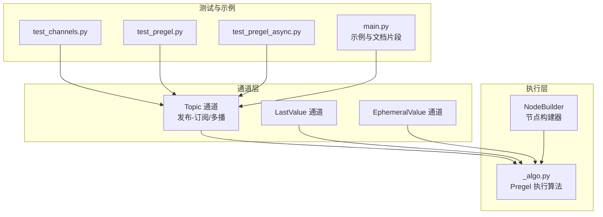
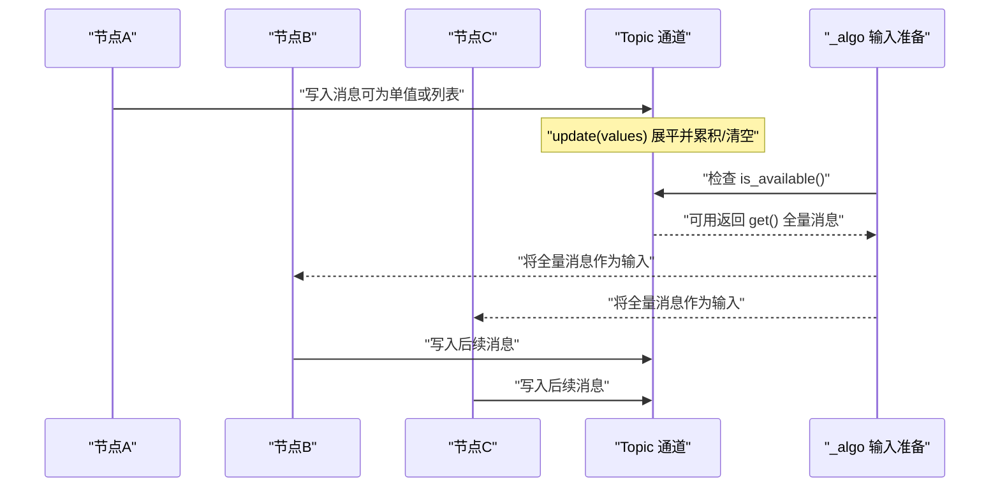
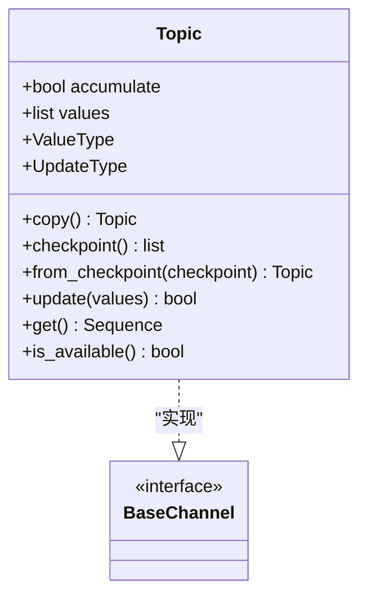
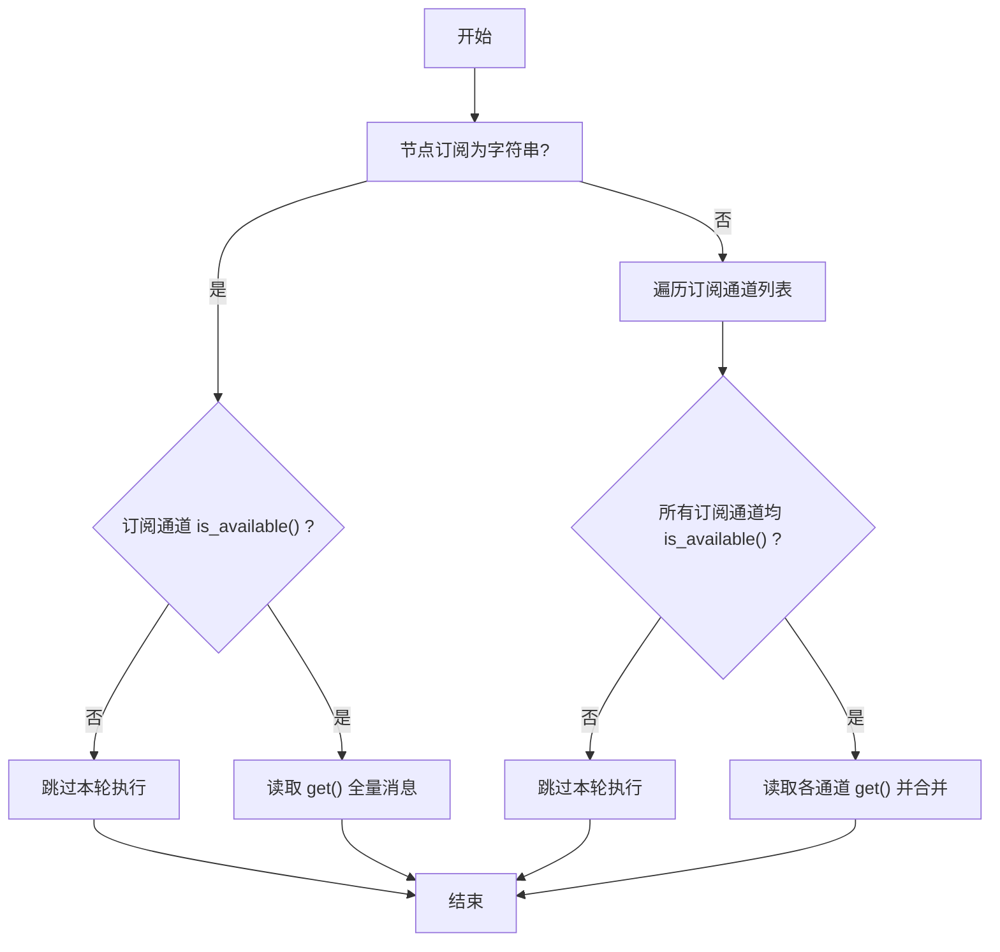
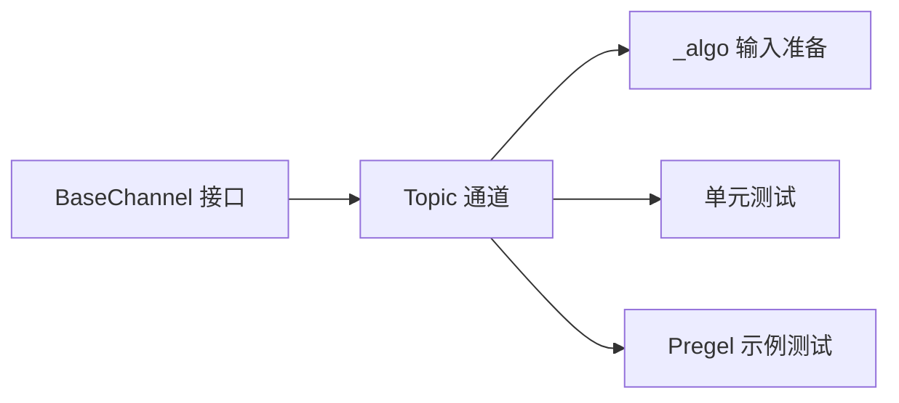

# 主题通道

<cite>
**本文引用的文件**
- [topic.py](file://libs/langgraph/langgraph/channels/topic.py)
- [__init__.py](file://libs/langgraph/langgraph/channels/__init__.py)
- [_algo.py](file://libs/langgraph/langgraph/pregel/_algo.py)
- [test_channels.py](file://libs/langgraph/tests/test_channels.py)
- [test_pregel.py](file://libs/langgraph/tests/test_pregel.py)
- [test_pregel_async.py](file://libs/langgraph/tests/test_pregel_async.py)
- [main.py](file://libs/langgraph/langgraph/pregel/main.py)
</cite>

## 目录
1. [简介](#简介)
2. [项目结构](#项目结构)
3. [核心组件](#核心组件)
4. [架构总览](#架构总览)
5. [详细组件分析](#详细组件分析)
6. [依赖分析](#依赖分析)
7. [性能考虑](#性能考虑)
8. [故障排查指南](#故障排查指南)
9. [结论](#结论)
10. [附录](#附录)

## 简介
本篇文档围绕“主题通道”（Topic）展开，系统阐述其在 LangGraph 中作为发布-订阅（Pub/Sub）与多路广播（多播/组播）机制的实现方式，以及如何通过该通道实现节点之间的松耦合通信。我们将从数据结构、处理逻辑、路由与过滤、订阅管理、消息累积与消费模式入手，并结合测试用例展示典型使用场景与高级模式（如多播、组播、条件路由）。最后给出配置选项、性能优化策略与适用场景分析。

## 项目结构
与主题通道直接相关的核心位置如下：
- 通道定义：libs/langgraph/langgraph/channels/topic.py
- 通道导出：libs/langgraph/langgraph/channels/__init__.py
- Pregel 执行算法：libs/langgraph/langgraph/pregel/_algo.py
- 单元测试与示例：libs/langgraph/tests/test_channels.py、libs/langgraph/tests/test_pregel.py、libs/langgraph/tests/test_pregel_async.py
- 使用示例与 API 文档：libs/langgraph/langgraph/pregel/main.py

图表来源
- [topic.py:1-95](file://libs/langgraph/langgraph/channels/topic.py#L1-L95)
- [_algo.py:1146-1190](file://libs/langgraph/langgraph/pregel/_algo.py#L1146-L1190)
- [test_channels.py:35-74](file://libs/langgraph/tests/test_channels.py#L35-L74)
- [test_pregel.py:760-776](file://libs/langgraph/tests/test_pregel.py#L760-L776)
- [test_pregel_async.py:3730-3750](file://libs/langgraph/tests/test_pregel_async.py#L3730-L3750)
- [main.py:478-500](file://libs/langgraph/langgraph/pregel/main.py#L478-L500)

章节来源
- [topic.py:1-95](file://libs/langgraph/langgraph/channels/topic.py#L1-L95)
- [__init__.py:1-28](file://libs/langgraph/langgraph/channels/__init__.py#L1-L28)
- [_algo.py:1146-1190](file://libs/langgraph/langgraph/pregel/_algo.py#L1146-L1190)
- [test_channels.py:35-74](file://libs/langgraph/tests/test_channels.py#L35-L74)
- [test_pregel.py:760-776](file://libs/langgraph/tests/test_pregel.py#L760-L776)
- [test_pregel_async.py:3730-3750](file://libs/langgraph/tests/test_pregel_async.py#L3730-L3750)
- [main.py:478-500](file://libs/langgraph/langgraph/pregel/main.py#L478-L500)

## 核心组件
- Topic 通道
  - 类型：泛型序列通道，支持单值或列表更新
  - 关键属性：类型参数 typ；累积开关 accumulate
  - 行为特征：默认每步清空；开启累积时保留历史消息
  - 接口要点：ValueType、UpdateType、update(values)、get()、is_available()、checkpoint()/from_checkpoint()

- 订阅与输入读取
  - Pregel 在准备节点输入时，会检查触发通道是否可用（is_available），若可用则读取 get() 的完整序列
  - 多通道订阅：当节点订阅多个通道时，仅当所有被订阅且存在于图中的非空通道都可用时，才会触发该节点

- 发布-订阅与多播
  - 节点通过 write_to 将消息写入一个或多个 Topic 通道
  - 任意数量的订阅者可同时读取该 Topic 的全量消息，形成天然的多播/组播

章节来源
- [topic.py:23-95](file://libs/langgraph/langgraph/channels/topic.py#L23-L95)
- [_algo.py:1146-1190](file://libs/langgraph/langgraph/pregel/_algo.py#L1146-L1190)
- [test_pregel.py:760-776](file://libs/langgraph/tests/test_pregel.py#L760-L776)

## 架构总览
下图展示了主题通道在 Pregel 执行流程中的角色：节点将消息发布到 Topic 通道，其他订阅节点在满足触发条件后读取 Topic 的全量消息并进行处理。

图表来源
- [topic.py:77-95](file://libs/langgraph/langgraph/channels/topic.py#L77-L95)
- [_algo.py:1146-1190](file://libs/langgraph/langgraph/pregel/_algo.py#L1146-L1190)
- [test_pregel.py:760-776](file://libs/langgraph/tests/test_pregel.py#L760-L776)

## 详细组件分析

### Topic 通道类与接口
- 数据结构
  - 内部维护一个可变列表 values 存储消息
  - 支持累积模式（accumulate=True）与非累积模式（默认）
- 更新与读取
  - update(values)：对传入的值进行展平（_flatten），在非累积模式下先清空旧值，再追加新值
  - get()：若为空则抛出 EmptyChannelError；否则返回当前全量消息列表
  - is_available()：判断是否有消息
- 检查点
  - checkpoint() 返回当前 values
  - from_checkpoint() 支持从检查点恢复状态

图表来源
- [topic.py:23-95](file://libs/langgraph/langgraph/channels/topic.py#L23-L95)

章节来源
- [topic.py:23-95](file://libs/langgraph/langgraph/channels/topic.py#L23-L95)

### 订阅管理与触发条件
- 触发条件
  - 当节点订阅的是字符串通道名时，仅当该通道 is_available() 为真时才触发
  - 当节点订阅的是列表通道名时，只有当所有被订阅且存在于图中的非空通道都可用时才触发
- 这一机制确保了 Topic 通道上的“全量消息”在被读取前已由发布者完成累积

图表来源
- [_algo.py:1146-1190](file://libs/langgraph/langgraph/pregel/_algo.py#L1146-L1190)

章节来源
- [_algo.py:1146-1190](file://libs/langgraph/langgraph/pregel/_algo.py#L1146-L1190)

### 消息累积与消费模式
- 非累积模式（默认）
  - 每次 update 后，旧值被清空，仅保留本次更新的展平后的消息
  - 适合“每步只处理最新一批”的场景
- 累积模式（accumulate=True）
  - 不清空旧值，新消息追加到末尾
  - 适合“累计处理”的场景，例如聚合统计、事件日志等
- 测试验证
  - 基础累积行为与检查点恢复
  - 展平更新（列表与单值混合）的行为

章节来源
- [test_channels.py:35-74](file://libs/langgraph/tests/test_channels.py#L35-L74)
- [topic.py:77-95](file://libs/langgraph/langgraph/channels/topic.py#L77-L95)

### 松耦合通信与多播/组播
- 多播（Fan-out）
  - 单个发布者写入 Topic，多个订阅者同时读取全量消息
  - 测试用例演示两个订阅相同 Topic 的节点各自得到全量消息
- 组播（Fan-in）
  - 多个发布者写入同一 Topic，订阅者读取全量消息集合
  - 测试用例演示多个发布者写入 Topic，最终一次性得到数组结果
- 条件路由
  - 可结合状态图与条件边，按条件将消息分发到不同 Topic 或下游节点
  - 示例：根据输入长度选择不同分支，分别写入不同 Topic，再由下游节点汇聚

章节来源
- [test_pregel.py:760-776](file://libs/langgraph/tests/test_pregel.py#L760-L776)
- [test_pregel.py:1540-1610](file://libs/langgraph/tests/test_pregel.py#L1540-L1610)
- [test_pregel_async.py:3730-3750](file://libs/langgraph/tests/test_pregel_async.py#L3730-L3750)

### 配置选项与使用建议
- 构造参数
  - typ：通道中元素的类型
  - accumulate：是否累积消息，默认 False
- 通道类型导出
  - Topic 通过 channels/__init__.py 对外暴露
- 使用示例
  - 在 Pregel 中声明 Topic 通道，并通过 NodeBuilder 的 write_to 发布消息
  - 可结合 stream_channels 实现流式输出

章节来源
- [topic.py:36-41](file://libs/langgraph/langgraph/channels/topic.py#L36-L41)
- [__init__.py:10-27](file://libs/langgraph/langgraph/channels/__init__.py#L10-L27)
- [main.py:478-500](file://libs/langgraph/langgraph/pregel/main.py#L478-L500)

## 依赖分析
- Topic 通道依赖 BaseChannel 接口，遵循统一的通道协议（ValueType、UpdateType、checkpoint/from_checkpoint、get/is_available）
- Pregel 执行算法在准备输入时，通过 is_available 与 get 统一读取 Topic 的全量消息
- 测试覆盖 Topic 的更新、读取、累积与检查点恢复

图表来源
- [topic.py:9-10](file://libs/langgraph/langgraph/channels/topic.py#L9-L10)
- [_algo.py:1146-1190](file://libs/langgraph/langgraph/pregel/_algo.py#L1146-L1190)
- [test_channels.py:35-74](file://libs/langgraph/tests/test_channels.py#L35-L74)
- [test_pregel.py:760-776](file://libs/langgraph/tests/test_pregel.py#L760-L776)

章节来源
- [topic.py:9-10](file://libs/langgraph/langgraph/channels/topic.py#L9-L10)
- [_algo.py:1146-1190](file://libs/langgraph/langgraph/pregel/_algo.py#L1146-L1190)
- [test_channels.py:35-74](file://libs/langgraph/tests/test_channels.py#L35-L74)
- [test_pregel.py:760-776](file://libs/langgraph/tests/test_pregel.py#L760-L776)

## 性能考虑
- 消息累积与内存占用
  - 累积模式会持续增长消息列表，需关注内存上限与清理策略
- 展平更新的成本
  - update 会对列表嵌套进行展平，避免深层嵌套可降低开销
- 触发频率与吞吐
  - 多订阅者读取全量消息可能带来重复计算，建议在节点内部做幂等处理或缓存
- 异步与并发
  - 异步测试表明 Topic 在并发调用下仍能稳定产出一致结果，适合高并发场景

[本节为通用性能建议，不直接分析具体文件]

## 故障排查指南
- EmptyChannelError
  - 当 Topic 为空且未开启累积时，get() 会抛出异常；确认发布者是否正确写入，或改为累积模式
- 触发失败
  - 若节点订阅的通道未 is_available()，节点不会被触发；检查上游写入与通道类型
- 检查点问题
  - from_checkpoint 恢复后状态独立，避免跨实例共享同一检查点导致状态污染

章节来源
- [topic.py:87-95](file://libs/langgraph/langgraph/channels/topic.py#L87-L95)
- [_algo.py:1146-1190](file://libs/langgraph/langgraph/pregel/_algo.py#L1146-L1190)

## 结论
主题通道通过“发布-订阅 + 多播/组播”的设计，实现了节点间低耦合、高扩展的消息传递。配合 Pregel 的触发条件与输入准备机制，Topic 能够可靠地承载全量消息的汇聚与分发。在实际工程中，应根据业务需求选择累积/非累积模式，并结合状态图与条件边实现复杂的路由与汇聚场景。

## 附录

### 复杂消息传递模式示例（基于测试用例）
- 多播：两个节点同时订阅同一 Topic，各自收到全量消息
- 组播：多个节点向同一 Topic 发布，下游一次性收到数组结果
- 条件路由：根据输入长度选择不同分支，分别写入不同 Topic，再由下游节点汇聚

章节来源
- [test_pregel.py:760-776](file://libs/langgraph/tests/test_pregel.py#L760-L776)
- [test_pregel.py:1540-1610](file://libs/langgraph/tests/test_pregel.py#L1540-L1610)
- [test_pregel_async.py:3730-3750](file://libs/langgraph/tests/test_pregel_async.py#L3730-L3750)