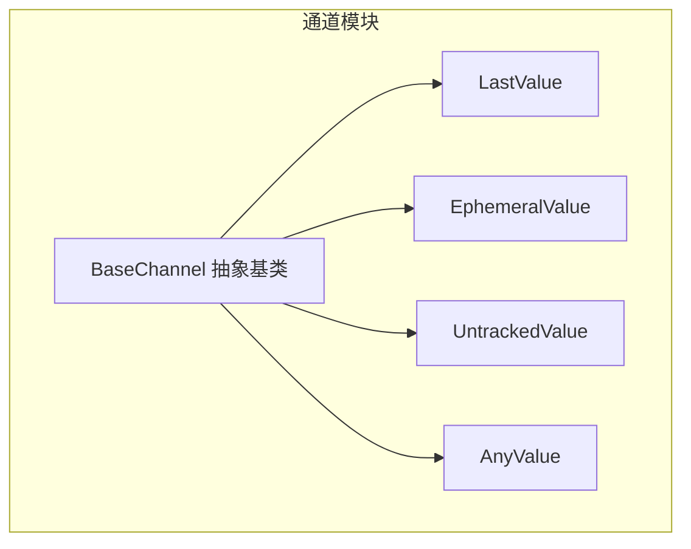
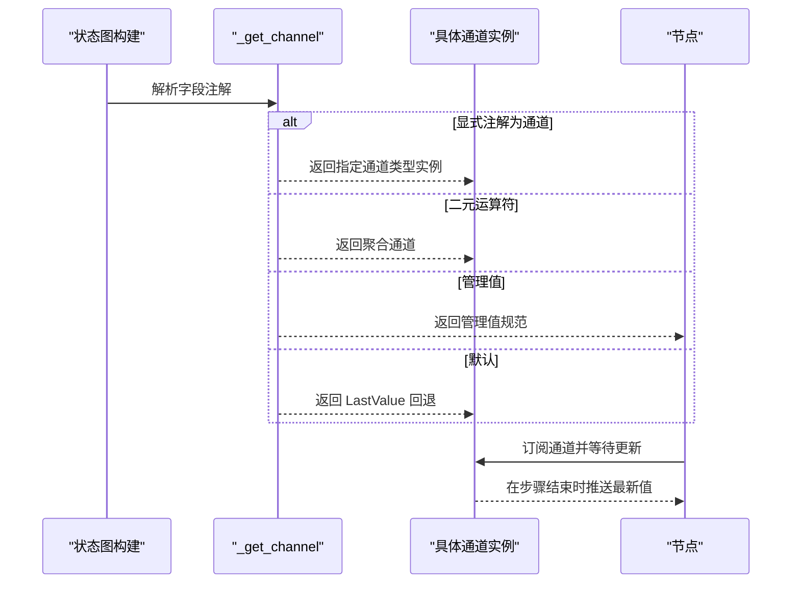
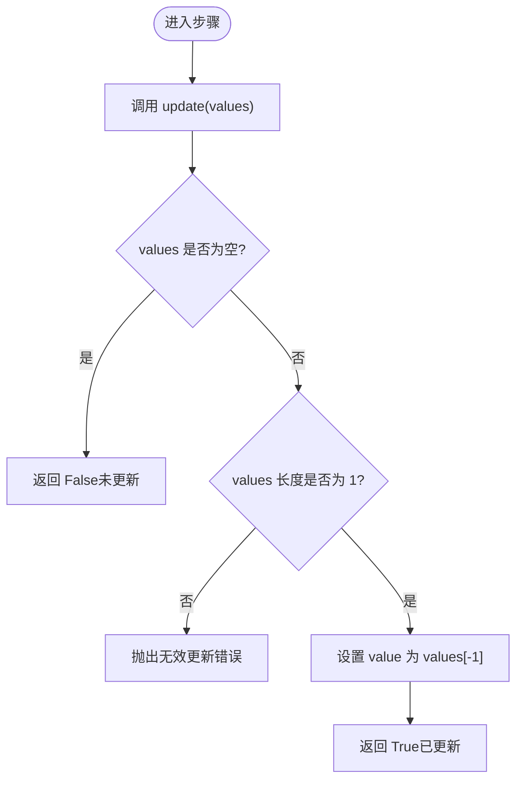
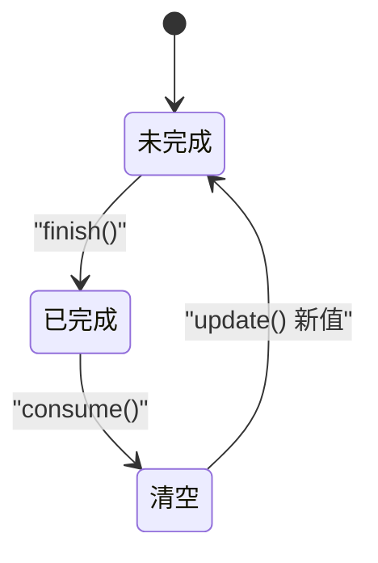
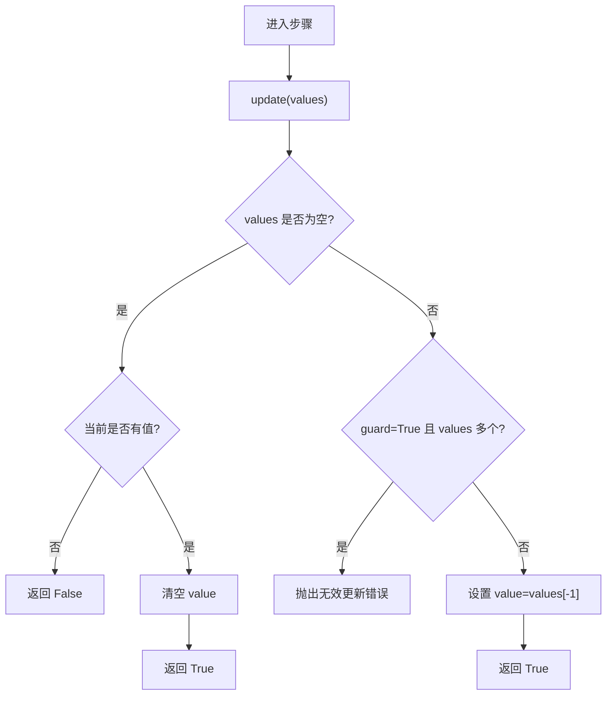
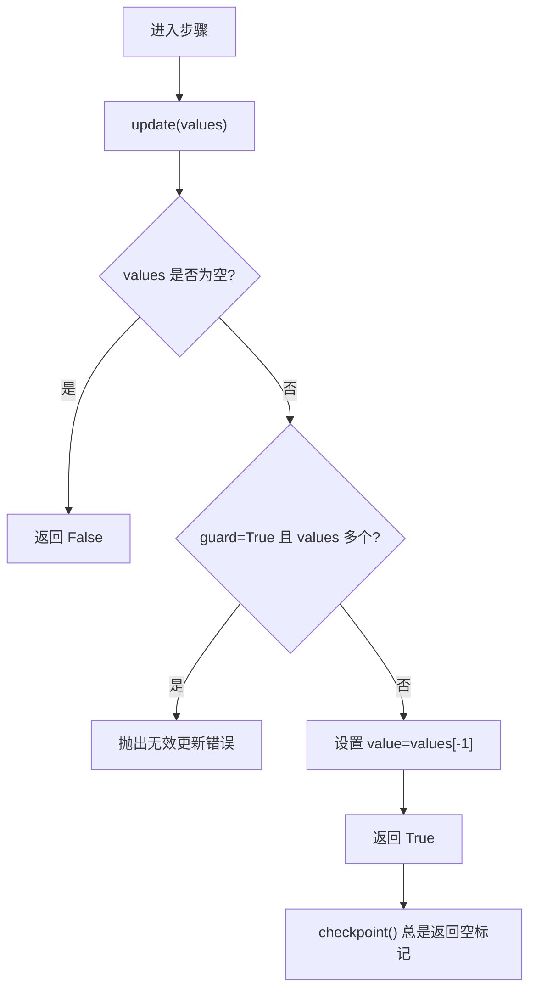
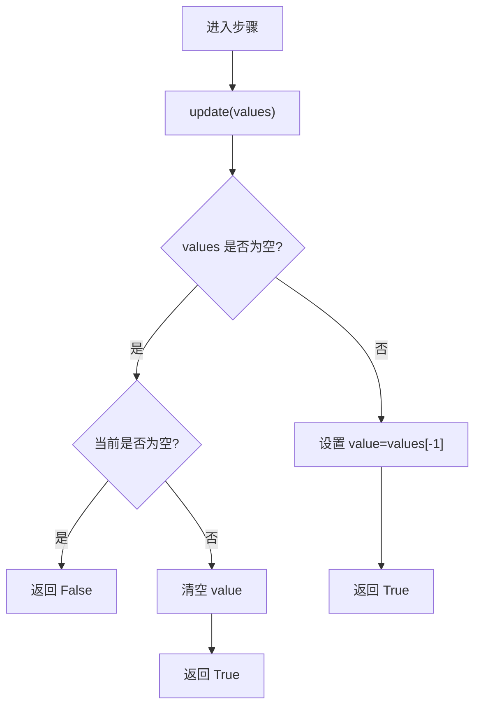
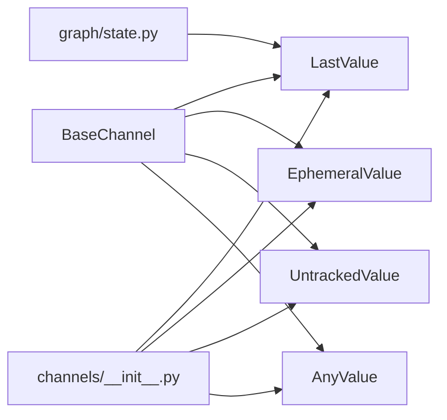

# 值通道类型

<cite>
**本文引用的文件**
- [libs/langgraph/langgraph/channels/base.py](file://libs/langgraph/langgraph/channels/base.py)
- [libs/langgraph/langgraph/channels/last_value.py](file://libs/langgraph/langgraph/channels/last_value.py)
- [libs/langgraph/langgraph/channels/ephemeral_value.py](file://libs/langgraph/langgraph/channels/ephemeral_value.py)
- [libs/langgraph/langgraph/channels/untracked_value.py](file://libs/langgraph/langgraph/channels/untracked_value.py)
- [libs/langgraph/langgraph/channels/any_value.py](file://libs/langgraph/langgraph/channels/any_value.py)
- [libs/langgraph/langgraph/channels/__init__.py](file://libs/langgraph/langgraph/channels/__init__.py)
- [libs/langgraph/langgraph/graph/state.py](file://libs/langgraph/langgraph/graph/state.py)
- [libs/langgraph/tests/test_channels.py](file://libs/langgraph/tests/test_channels.py)
</cite>

## 目录
1. [简介](#简介)
2. [项目结构](#项目结构)
3. [核心组件](#核心组件)
4. [架构总览](#架构总览)
5. [详细组件分析](#详细组件分析)
6. [依赖分析](#依赖分析)
7. [性能考量](#性能考量)
8. [故障排查指南](#故障排查指南)
9. [结论](#结论)
10. [附录](#附录)

## 简介
本篇文档聚焦于“值通道”类型，系统阐述 LastValue、EphemeralValue、UntrackedValue、AnyValue 的设计目标、数据存储策略、生命周期管理与更新机制，以及它们在状态传播中的作用与对代理执行行为的影响。同时给出配置要点、性能特征与适用场景对比，并提供可操作的最佳实践与排错建议。

## 项目结构
值通道位于 channels 子模块中，统一继承自 BaseChannel 抽象基类；在图构建阶段，状态模式会根据字段注解自动选择合适的通道类型（默认回退到 LastValue）。

图表来源
- [libs/langgraph/langgraph/channels/base.py:19-122](file://libs/langgraph/langgraph/channels/base.py#L19-L122)
- [libs/langgraph/langgraph/channels/last_value.py:20-152](file://libs/langgraph/langgraph/channels/last_value.py#L20-L152)
- [libs/langgraph/langgraph/channels/ephemeral_value.py:15-80](file://libs/langgraph/langgraph/channels/ephemeral_value.py#L15-L80)
- [libs/langgraph/langgraph/channels/untracked_value.py:15-74](file://libs/langgraph/langgraph/channels/untracked_value.py#L15-L74)
- [libs/langgraph/langgraph/channels/any_value.py:15-73](file://libs/langgraph/langgraph/channels/any_value.py#L15-L73)

章节来源
- [libs/langgraph/langgraph/channels/__init__.py:1-27](file://libs/langgraph/langgraph/channels/__init__.py#L1-L27)
- [libs/langgraph/langgraph/graph/state.py:1603-1661](file://libs/langgraph/langgraph/graph/state.py#L1603-L1661)

## 核心组件
- BaseChannel：定义通道的通用接口与默认行为（类型标注、序列化/反序列化、可用性判断、更新与读取等）。
- LastValue：仅保留最近一次更新的值，支持检查点；默认每个步骤最多接收一个更新。
- LastValueAfterFinish：仅在 finish() 后才可读取并自动清空，用于“完成后一次性输出”的场景。
- EphemeralValue：仅保留“上一步”接收到的值，在下一次更新后清空；适合临时信号或中间态。
- UntrackedValue：保存最新值但不参与检查点；适合临时数据或不需要持久化的中间结果。
- AnyValue：接收多个值时假设它们相等，仅保留最后一个；适合“多来源聚合但期望一致”的场景。

章节来源
- [libs/langgraph/langgraph/channels/base.py:19-122](file://libs/langgraph/langgraph/channels/base.py#L19-L122)
- [libs/langgraph/langgraph/channels/last_value.py:20-152](file://libs/langgraph/langgraph/channels/last_value.py#L20-L152)
- [libs/langgraph/langgraph/channels/ephemeral_value.py:15-80](file://libs/langgraph/langgraph/channels/ephemeral_value.py#L15-L80)
- [libs/langgraph/langgraph/channels/untracked_value.py:15-74](file://libs/langgraph/langgraph/channels/untracked_value.py#L15-L74)
- [libs/langgraph/langgraph/channels/any_value.py:15-73](file://libs/langgraph/langgraph/channels/any_value.py#L15-L73)

## 架构总览
值通道在状态图构建时由状态模式解析字段注解生成，默认回退到 LastValue。节点通过订阅通道进行触发与输入读取，通道的状态变化驱动节点执行。

图表来源
- [libs/langgraph/langgraph/graph/state.py:1638-1661](file://libs/langgraph/langgraph/graph/state.py#L1638-L1661)
- [libs/langgraph/langgraph/channels/__init__.py:1-27](file://libs/langgraph/langgraph/channels/__init__.py#L1-L27)

## 详细组件分析

### BaseChannel 抽象基类
- 职责：定义通道的统一接口，包括类型标注、序列化/反序列化、可用性判断、更新与读取等。
- 关键方法：
  - ValueType/UpdateType：分别表示存储值类型与更新值类型。
  - checkpoint/from_checkpoint：序列化与从检查点恢复。
  - get/is_available：读取当前值与可用性判断。
  - update：接收更新序列并返回是否更新成功。
  - consume/finish：生命周期事件通知（默认空实现）。

章节来源
- [libs/langgraph/langgraph/channels/base.py:19-122](file://libs/langgraph/langgraph/channels/base.py#L19-L122)

### LastValue
- 数据存储策略：仅保存最近一次更新的值，支持检查点。
- 生命周期管理：
  - 每步最多接收一个更新；若传入多个值将抛出无效更新错误。
  - 支持从检查点恢复，恢复后继续接收后续更新。
- 更新机制：
  - update(values)：当 values 非空且长度为 1 时更新；否则抛错或返回未更新。
  - get()：若未更新过则抛出空通道错误。
  - checkpoint()/from_checkpoint()：返回/接受最近值。
- 适用场景：
  - 作为默认通道类型，适用于大多数“最终态”状态字段。
  - 不适合需要“多来源聚合但允许多值”的场景。

图表来源
- [libs/langgraph/langgraph/channels/last_value.py:56-78](file://libs/langgraph/langgraph/channels/last_value.py#L56-L78)

章节来源
- [libs/langgraph/langgraph/channels/last_value.py:20-152](file://libs/langgraph/langgraph/channels/last_value.py#L20-L152)
- [libs/langgraph/tests/test_channels.py:16-33](file://libs/langgraph/tests/test_channels.py#L16-L33)

### LastValueAfterFinish
- 数据存储策略：与 LastValue 类似，但只在 finish() 后变为可用，且消费后清空。
- 生命周期管理：
  - finish()：标记完成，允许读取；若尚未有值或已完成则无效果。
  - consume()：若已完成后，清空并返回 True；否则返回 False。
  - get()：未完成或无值时抛出空通道错误。
- 更新机制：
  - update(values)：始终记录最新值，但不立即可用。
  - checkpoint()/from_checkpoint()：返回 (value, finished) 元组。
- 适用场景：
  - “任务完成后一次性输出”的结果通道。
  - 需要延迟暴露中间结果的流程控制。

图表来源
- [libs/langgraph/langgraph/channels/last_value.py:81-152](file://libs/langgraph/langgraph/channels/last_value.py#L81-L152)

章节来源
- [libs/langgraph/langgraph/channels/last_value.py:81-152](file://libs/langgraph/langgraph/channels/last_value.py#L81-L152)

### EphemeralValue
- 数据存储策略：仅保留“上一步”接收到的值，一旦再次更新即清空。
- 生命周期管理：
  - 若 update([]) 且当前有值，则清空并返回 True；否则返回 False。
  - 若 guard=True 且传入多个值，抛出无效更新错误。
- 更新机制：
  - update(values)：当 values 非空时设置为最后一条；为空时尝试清空。
  - get()/is_available()/checkpoint()：行为与普通值通道一致。
- 适用场景：
  - 临时信号或中间态标志，避免长期占用内存。
  - 仅需“上一步有效”的状态传播。

图表来源
- [libs/langgraph/langgraph/channels/ephemeral_value.py:55-79](file://libs/langgraph/langgraph/channels/ephemeral_value.py#L55-L79)

章节来源
- [libs/langgraph/langgraph/channels/ephemeral_value.py:15-80](file://libs/langgraph/langgraph/channels/ephemeral_value.py#L15-L80)
- [libs/langgraph/tests/test_channels.py:93-119](file://libs/langgraph/tests/test_channels.py#L93-L119)

### UntrackedValue
- 数据存储策略：保存最新值，但 checkpoint() 总是返回空标记，不参与持久化。
- 生命周期管理：
  - 从检查点恢复时，总是以“空”状态开始。
  - 适合临时数据或仅在运行期内使用的中间结果。
- 更新机制：
  - update(values)：当 values 非空且长度为 1（或 guard=False 时可接受多条）时更新。
  - get()/is_available()：行为与普通值通道一致。
- 适用场景：
  - 运行期临时缓存、调试信息、一次性中间结果。
  - 不希望被检查点/恢复影响的字段。

图表来源
- [libs/langgraph/langgraph/channels/untracked_value.py:48-73](file://libs/langgraph/langgraph/channels/untracked_value.py#L48-L73)

章节来源
- [libs/langgraph/langgraph/channels/untracked_value.py:15-74](file://libs/langgraph/langgraph/channels/untracked_value.py#L15-L74)
- [libs/langgraph/tests/test_channels.py:93-119](file://libs/langgraph/tests/test_channels.py#L93-L119)

### AnyValue
- 数据存储策略：接收多个值时假设它们相等，仅保留最后一个；允许空更新清除值。
- 生命周期管理：
  - 空更新会将值设为空标记；非空更新则覆盖为最后一个值。
- 更新机制：
  - update(values)：空则清除；非空则取最后一个。
  - get()/is_available()/checkpoint()：行为与普通值通道一致。
- 适用场景：
  - 多来源汇聚但预期一致的场景，例如并行分支产生相同结果。
  - 需要容忍重复/并发写入但不关心中间过程的字段。

图表来源
- [libs/langgraph/langgraph/channels/any_value.py:52-72](file://libs/langgraph/langgraph/channels/any_value.py#L52-L72)

章节来源
- [libs/langgraph/langgraph/channels/any_value.py:15-73](file://libs/langgraph/langgraph/channels/any_value.py#L15-L73)

## 依赖分析
- 继承关系：所有值通道均继承自 BaseChannel，复用其类型标注与序列化接口。
- 导出入口：channels/__init__.py 将各通道类型集中导出，供上层使用。
- 图构建：graph/state.py 在解析字段注解时，若未显式声明通道类型，则回退到 LastValue。

图表来源
- [libs/langgraph/langgraph/channels/base.py:19-122](file://libs/langgraph/langgraph/channels/base.py#L19-L122)
- [libs/langgraph/langgraph/channels/__init__.py:1-27](file://libs/langgraph/langgraph/channels/__init__.py#L1-L27)
- [libs/langgraph/langgraph/graph/state.py:1638-1661](file://libs/langgraph/langgraph/graph/state.py#L1638-L1661)

章节来源
- [libs/langgraph/langgraph/channels/__init__.py:1-27](file://libs/langgraph/langgraph/channels/__init__.py#L1-L27)
- [libs/langgraph/langgraph/graph/state.py:1603-1661](file://libs/langgraph/langgraph/graph/state.py#L1603-L1661)

## 性能考量
- 内存占用
  - LastValue/EphemeralValue/AnyValue：仅保存单值，内存开销小。
  - UntrackedValue：同样仅单值，但不参与检查点，避免额外序列化成本。
- 序列化/恢复
  - LastValue/AnyValue：checkpoint() 返回当前值，适合持久化。
  - EphemeralValue：checkpoint() 返回当前值，但通常期望在下一步被清空。
  - UntrackedValue：checkpoint() 返回空标记，不参与持久化。
  - LastValueAfterFinish：checkpoint() 返回 (value, finished)，便于恢复完成态。
- 并发与更新
  - LastValue：每步最多一个更新，避免竞争条件。
  - EphemeralValue/UntrackedValue：guard=True 时限制每步一个更新，减少歧义。
  - AnyValue：允许多个值但假设相等，适合并行汇聚场景。

## 故障排查指南
- 空通道错误
  - 症状：首次读取或消费后读取时报错。
  - 排查：确认通道是否已更新；检查是否误用 LastValueAfterFinish 未调用 finish()。
- 无效更新错误
  - 症状：传入多个值时报错。
  - 排查：将 guard=False 或改用聚合通道；或确保上游只发送一个值。
- 检查点异常
  - 症状：恢复后状态不符合预期。
  - 排查：确认 checkpoint()/from_checkpoint() 行为是否符合预期；UntrackedValue 恢复应为空。

章节来源
- [libs/langgraph/langgraph/channels/last_value.py:56-78](file://libs/langgraph/langgraph/channels/last_value.py#L56-L78)
- [libs/langgraph/langgraph/channels/ephemeral_value.py:55-79](file://libs/langgraph/langgraph/channels/ephemeral_value.py#L55-L79)
- [libs/langgraph/langgraph/channels/untracked_value.py:48-73](file://libs/langgraph/langgraph/channels/untracked_value.py#L48-L73)
- [libs/langgraph/tests/test_channels.py:16-33](file://libs/langgraph/tests/test_channels.py#L16-L33)

## 结论
- 选择建议
  - 默认优先 LastValue；需要“完成后一次性输出”用 LastValueAfterFinish。
  - 需要临时信号或中间态用 EphemeralValue。
  - 不希望持久化的临时数据用 UntrackedValue。
  - 多来源汇聚且假设一致用 AnyValue。
- 最佳实践
  - 显式声明通道类型，避免默认回退带来的歧义。
  - 对易并发的字段启用 guard 限制每步单值。
  - 使用检查点前明确各通道的持久化语义。
  - 对需要延迟暴露的结果，配合 finish()/consume() 控制可见性。

## 附录
- 配置选项
  - guard：限制每步只能接收一个值（EphemeralValue/UntrackedValue）。
  - key：通道键名，用于错误消息与调试。
  - typ：值类型，用于类型约束与序列化。
- 适用场景对比
  - 单值持久化：LastValue
  - 完成后可见：LastValueAfterFinish
  - 上一步有效：EphemeralValue
  - 不持久化临时：UntrackedValue
  - 多源一致汇聚：AnyValue