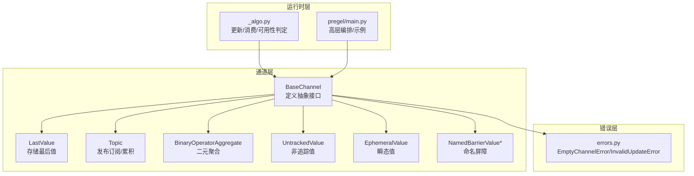
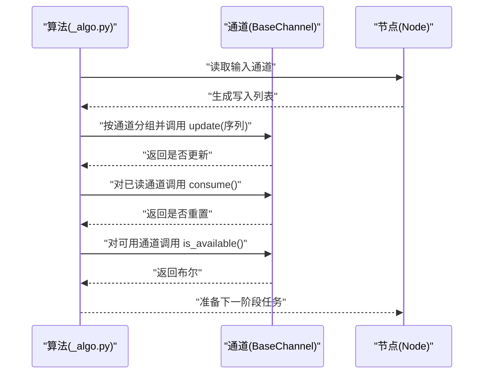
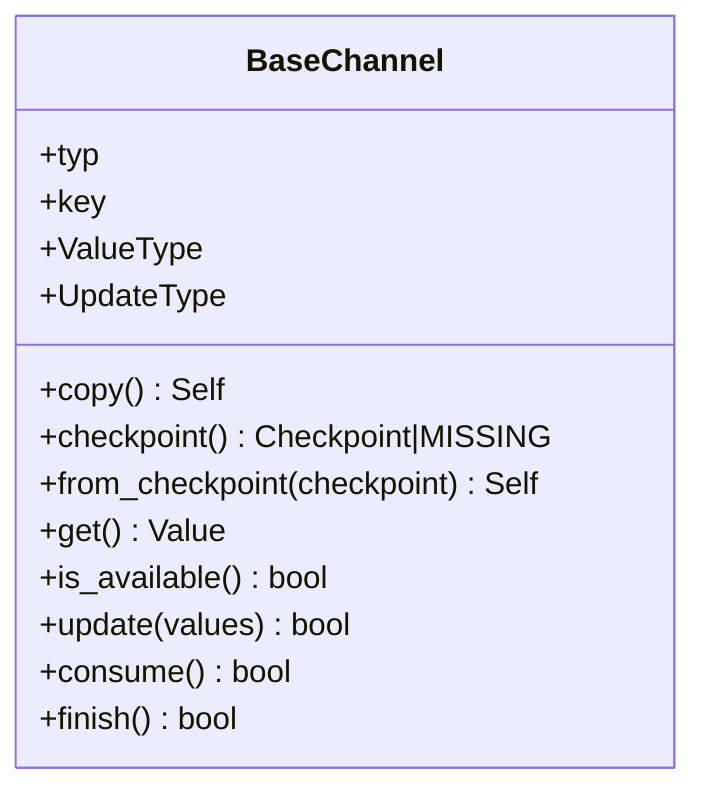
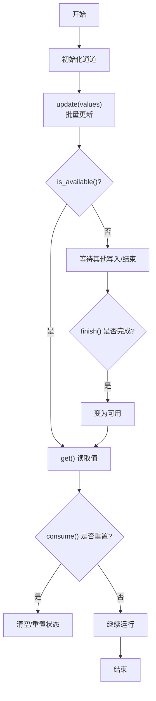
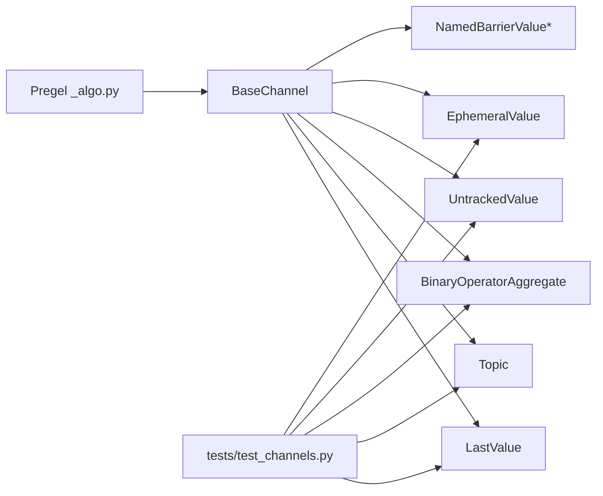

# 基础通道接口

<cite>
**本文引用的文件**
- [libs/langgraph/langgraph/channels/base.py](file://libs/langgraph/langgraph/channels/base.py)
- [libs/langgraph/tests/test_channels.py](file://libs/langgraph/tests/test_channels.py)
- [libs/langgraph/langgraph/channels/last_value.py](file://libs/langgraph/langgraph/channels/last_value.py)
- [libs/langgraph/langgraph/channels/topic.py](file://libs/langgraph/langgraph/channels/topic.py)
- [libs/langgraph/langgraph/channels/binop.py](file://libs/langgraph/langgraph/channels/binop.py)
- [libs/langgraph/langgraph/channels/untracked_value.py](file://libs/langgraph/langgraph/channels/untracked_value.py)
- [libs/langgraph/langgraph/channels/ephemeral_value.py](file://libs/langgraph/langgraph/channels/ephemeral_value.py)
- [libs/langgraph/langgraph/channels/named_barrier_value.py](file://libs/langgraph/langgraph/channels/named_barrier_value.py)
- [libs/langgraph/langgraph/errors.py](file://libs/langgraph/langgraph/errors.py)
- [libs/langgraph/langgraph/pregel/_algo.py](file://libs/langgraph/langgraph/pregel/_algo.py)
- [libs/langgraph/langgraph/pregel/main.py](file://libs/langgraph/langgraph/pregel/main.py)
</cite>

## 目录
1. [简介](#简介)
2. [项目结构](#项目结构)
3. [核心组件](#核心组件)
4. [架构总览](#架构总览)
5. [详细组件分析](#详细组件分析)
6. [依赖分析](#依赖分析)
7. [性能考虑](#性能考虑)
8. [故障排查指南](#故障排查指南)
9. [结论](#结论)
10. [附录](#附录)

## 简介
本文件围绕基础通道接口 BaseChannel 展开，系统性阐述其设计原理、接口规范与生命周期管理，并结合多种内置通道实现（如 LastValue、Topic、BinaryOperatorAggregate、UntrackedValue、EphemeralValue、NamedBarrierValue）说明“必须实现的方法”（get、update、checkpoint、from_checkpoint 等）的作用、调用时机与最佳实践。同时给出自定义通道实现的完整指导，帮助开发者在不破坏并发安全与一致性前提下扩展通道能力。

## 项目结构
本主题涉及的代码主要位于 langgraph 的 channels 子模块与相关运行时（pregel）中：
- 基类与类型参数：BaseChannel 定义于 channels/base.py
- 典型实现：last_value.py、topic.py、binop.py、untracked_value.py、ephemeral_value.py、named_barrier_value.py
- 错误模型：errors.py 中定义 EmptyChannelError、InvalidUpdateError 等
- 运行时集成：pregel/_algo.py 展示了 update/get/is_available/consume 的典型调用流程；pregel/main.py 提供高层编排与示例

图表来源
- [libs/langgraph/langgraph/channels/base.py:19-122](file://libs/langgraph/langgraph/channels/base.py#L19-L122)
- [libs/langgraph/langgraph/channels/last_value.py:20-152](file://libs/langgraph/langgraph/channels/last_value.py#L20-L152)
- [libs/langgraph/langgraph/channels/topic.py:23-95](file://libs/langgraph/langgraph/channels/topic.py#L23-L95)
- [libs/langgraph/langgraph/channels/binop.py:41-135](file://libs/langgraph/langgraph/channels/binop.py#L41-L135)
- [libs/langgraph/langgraph/channels/untracked_value.py:15-74](file://libs/langgraph/langgraph/channels/untracked_value.py#L15-L74)
- [libs/langgraph/langgraph/channels/ephemeral_value.py:15-80](file://libs/langgraph/langgraph/channels/ephemeral_value.py#L15-L80)
- [libs/langgraph/langgraph/channels/named_barrier_value.py:46-167](file://libs/langgraph/langgraph/channels/named_barrier_value.py#L46-L167)
- [libs/langgraph/langgraph/pregel/_algo.py:270-301](file://libs/langgraph/langgraph/pregel/_algo.py#L270-L301)
- [libs/langgraph/langgraph/pregel/main.py:1-200](file://libs/langgraph/langgraph/pregel/main.py#L1-L200)
- [libs/langgraph/langgraph/errors.py:15-128](file://libs/langgraph/langgraph/errors.py#L15-L128)

章节来源
- [libs/langgraph/langgraph/channels/base.py:19-122](file://libs/langgraph/langgraph/channels/base.py#L19-L122)
- [libs/langgraph/langgraph/pregel/_algo.py:270-301](file://libs/langgraph/langgraph/pregel/_algo.py#L270-L301)

## 核心组件
- BaseChannel 抽象基类：定义通道的统一接口与生命周期钩子，包括序列化/反序列化（checkpoint/from_checkpoint）、读取（get/is_available）、写入（update）、任务消费通知（consume）、运行结束通知（finish），并提供默认实现（如 copy、checkpoint）。
- 典型实现：
  - LastValue：每步仅接收一个值，覆盖语义；支持 finish 后才可读取的变体。
  - Topic：发布订阅，支持累积或每步清空；可展平多值。
  - BinaryOperatorAggregate：对当前值与新值应用二元运算，支持覆盖写入。
  - UntrackedValue/EphemeralValue：不参与检查点或仅保留一步；Guard 模式限制并发更新数量。
  - NamedBarrierValue*：等待一组命名值全部到达后才可用，支持 finish 后才可用版本。

章节来源
- [libs/langgraph/langgraph/channels/base.py:19-122](file://libs/langgraph/langgraph/channels/base.py#L19-L122)
- [libs/langgraph/langgraph/channels/last_value.py:20-152](file://libs/langgraph/langgraph/channels/last_value.py#L20-L152)
- [libs/langgraph/langgraph/channels/topic.py:23-95](file://libs/langgraph/langgraph/channels/topic.py#L23-L95)
- [libs/langgraph/langgraph/channels/binop.py:41-135](file://libs/langgraph/langgraph/channels/binop.py#L41-L135)
- [libs/langgraph/langgraph/channels/untracked_value.py:15-74](file://libs/langgraph/langgraph/channels/untracked_value.py#L15-L74)
- [libs/langgraph/langgraph/channels/ephemeral_value.py:15-80](file://libs/langgraph/langgraph/channels/ephemeral_value.py#L15-L80)
- [libs/langgraph/langgraph/channels/named_barrier_value.py:46-167](file://libs/langgraph/langgraph/channels/named_barrier_value.py#L46-L167)

## 架构总览
下面的时序图展示了 Pregel 在一轮执行中的典型通道交互：收集待消费通道、批量写入、应用更新、判定可用性并触发后续任务。

图表来源
- [libs/langgraph/langgraph/pregel/_algo.py:270-301](file://libs/langgraph/langgraph/pregel/_algo.py#L270-L301)
- [libs/langgraph/langgraph/channels/base.py:69-122](file://libs/langgraph/langgraph/channels/base.py#L69-L122)

章节来源
- [libs/langgraph/langgraph/pregel/_algo.py:270-301](file://libs/langgraph/langgraph/pregel/_algo.py#L270-L301)

## 详细组件分析

### BaseChannel 抽象基类
- 设计要点
  - 泛型参数 Value/Update/Checkpoint 明确三类类型职责，便于静态类型约束与序列化契约。
  - 关键方法均为抽象或有明确约定，确保实现的一致性与可组合性。
  - 默认实现（如 copy/checkpoint）提供便捷的序列化/恢复能力，但鼓励子类覆盖以提升效率。
- 生命周期钩子
  - consume：订阅者执行后通知通道，常用于 Topic/EphemeralValue 清理；返回是否改变状态。
  - finish：Pregel 运行结束通知，常用于 LastValueAfterFinish/NB 等延迟暴露值。
- 异常模型
  - EmptyChannelError：通道为空时 get 抛出。
  - InvalidUpdateError：非法更新序列（如并发多值、覆盖冲突）抛出。

图表来源
- [libs/langgraph/langgraph/channels/base.py:19-122](file://libs/langgraph/langgraph/channels/base.py#L19-L122)

章节来源
- [libs/langgraph/langgraph/channels/base.py:19-122](file://libs/langgraph/langgraph/channels/base.py#L19-L122)
- [libs/langgraph/langgraph/errors.py:15-128](file://libs/langgraph/langgraph/errors.py#L15-L128)

### 必须实现的方法与调用时机
- get
  - 作用：返回当前值；若未初始化或清空则抛 EmptyChannelError。
  - 调用时机：运行时读取通道值前；或 is_available 内部通过 try/catch 判空。
- update
  - 作用：以序列形式批量更新；顺序任意；返回是否发生实质性更新。
  - 调用时机：每轮结束由 Pregel 统一调度；Topic 支持累积模式；BinaryOperatorAggregate 应用二元运算。
- checkpoint/from_checkpoint
  - 作用：序列化/反序列化通道状态；from_checkpoint 可从检查点重建。
  - 调用时机：检查点保存/恢复；LastValue/Topic/BinaryOperatorAggregate 等直接基于内部状态；UntrackedValue 返回 MISSING 表示不参与检查点。
- is_available
  - 作用：快速判断是否可读；建议子类避免 get+异常路径，直接返回布尔。
  - 调用时机：Pregel 决定是否触发下游任务。
- consume/finish
  - 作用：消费通知/结束通知；用于 Topic/EphemeralValue/NamedBarrierValue 等控制可见性与清理策略。
  - 调用时机：Pregel 在读取后调用 consume；在运行结束时调用 finish。

章节来源
- [libs/langgraph/langgraph/channels/base.py:49-122](file://libs/langgraph/langgraph/channels/base.py#L49-L122)
- [libs/langgraph/langgraph/pregel/_algo.py:270-301](file://libs/langgraph/langgraph/pregel/_algo.py#L270-L301)

### 通道生命周期与状态维护
- 初始化：构造函数接收 typ/key；部分通道（如 Topic）还包含 accumulate 等配置。
- 更新：update 批量处理，遵循各通道的合并/覆盖规则；Topic 可展平列表；BinaryOperatorAggregate 支持覆盖写入。
- 可用性：is_available 快速判定；consume 在读取后可能清空值（如 EphemeralValue/Topic 非累积）。
- 结束：finish 使 LastValueAfterFinish/NB 等通道变为可用；consume 将值重置。
- 检查点：checkpoint 返回当前状态；from_checkpoint 重建；UntrackedValue 不参与检查点。

图表来源
- [libs/langgraph/langgraph/channels/base.py:69-122](file://libs/langgraph/langgraph/channels/base.py#L69-L122)
- [libs/langgraph/langgraph/channels/last_value.py:81-152](file://libs/langgraph/langgraph/channels/last_value.py#L81-L152)
- [libs/langgraph/langgraph/channels/ephemeral_value.py:15-80](file://libs/langgraph/langgraph/channels/ephemeral_value.py#L15-L80)
- [libs/langgraph/langgraph/channels/topic.py:23-95](file://libs/langgraph/langgraph/channels/topic.py#L23-L95)

章节来源
- [libs/langgraph/langgraph/channels/last_value.py:81-152](file://libs/langgraph/langgraph/channels/last_value.py#L81-L152)
- [libs/langgraph/langgraph/channels/ephemeral_value.py:15-80](file://libs/langgraph/langgraph/channels/ephemeral_value.py#L15-L80)
- [libs/langgraph/langgraph/channels/topic.py:23-95](file://libs/langgraph/langgraph/channels/topic.py#L23-L95)

### 并发安全与一致性
- 并发模型：Pregel 在单轮内对每个通道调用 update(values)，values 来自本轮所有任务的写入汇总；实现应保证 update 的原子性与幂等性（例如 Topic 的累积/清空逻辑、BinaryOperatorAggregate 的覆盖写入检查）。
- 异常保护：EmptyChannelError/InvalidUpdateError 明确边界；实现需在 get/update 中严格遵守契约。
- 版本与可见性：consume/finish 控制可见性与重置；Pregel 在合适时机调用，避免重复消费。

章节来源
- [libs/langgraph/langgraph/pregel/_algo.py:270-301](file://libs/langgraph/langgraph/pregel/_algo.py#L270-L301)
- [libs/langgraph/langgraph/errors.py:15-128](file://libs/langgraph/langgraph/errors.py#L15-L128)

### 自定义通道实现指南
- 接口实现要求
  - 必须实现：get、update、checkpoint、from_checkpoint（如需检查点）
  - 建议实现：is_available（避免 get+异常路径）
  - 可选钩子：consume、finish（根据业务需要）
- 类型参数选择
  - Value：通道存储的最终值类型
  - Update：节点写入的更新类型（可能为 Value 或 Value 的序列）
  - Checkpoint：可序列化的检查点类型（通常与 Value 相同或包含额外状态）
- 最佳实践
  - update 内部处理顺序无关的合并逻辑；对覆盖写入进行唯一性校验（参考 BinaryOperatorAggregate）
  - 对外部可见性与内部状态分离（参考 LastValueAfterFinish/NamedBarrierValue）
  - 对空状态抛 EmptyChannelError，避免返回 None
  - 对非法更新抛 InvalidUpdateError，便于上层定位问题
- 常见陷阱
  - 忘记区分“空”与“未初始化”，导致 get 误判
  - 多值并发写入未做覆盖写入唯一性检查
  - consume/finish 未正确配合，导致重复消费或不可见
  - 检查点未复制复杂对象，导致共享引用引发竞态

章节来源
- [libs/langgraph/langgraph/channels/base.py:19-122](file://libs/langgraph/langgraph/channels/base.py#L19-L122)
- [libs/langgraph/langgraph/channels/binop.py:102-123](file://libs/langgraph/langgraph/channels/binop.py#L102-L123)
- [libs/langgraph/langgraph/channels/last_value.py:56-75](file://libs/langgraph/langgraph/channels/last_value.py#L56-L75)
- [libs/langgraph/langgraph/channels/topic.py:77-85](file://libs/langgraph/langgraph/channels/topic.py#L77-L85)

### 实现示例与对比
- LastValue
  - 语义：每步仅保留最后一个值；支持 finish 后才可用的变体
  - 关键点：update 限制长度为 1；finish 标记可用；consume 清空
- Topic
  - 语义：发布订阅；可累积或每步清空；支持展平列表
  - 关键点：update 展平并追加；accumulate 控制清空策略；is_available 快速判定
- BinaryOperatorAggregate
  - 语义：对当前值与新值应用二元运算；支持覆盖写入
  - 关键点：覆盖写入唯一性检查；初始值类型推导
- UntrackedValue/EphemeralValue
  - 语义：不参与检查点或仅保留一步；可选 guard 限制并发写入数量
  - 关键点：checkpoint 返回 MISSING；update 清空旧值或覆盖
- NamedBarrierValue*
  - 语义：等待一组命名值全部到达；finish 后才可用
  - 关键点：consume 清空 seen；finish 触发可用

章节来源
- [libs/langgraph/langgraph/channels/last_value.py:20-152](file://libs/langgraph/langgraph/channels/last_value.py#L20-L152)
- [libs/langgraph/langgraph/channels/topic.py:23-95](file://libs/langgraph/langgraph/channels/topic.py#L23-L95)
- [libs/langgraph/langgraph/channels/binop.py:41-135](file://libs/langgraph/langgraph/channels/binop.py#L41-L135)
- [libs/langgraph/langgraph/channels/untracked_value.py:15-74](file://libs/langgraph/langgraph/channels/untracked_value.py#L15-L74)
- [libs/langgraph/langgraph/channels/ephemeral_value.py:15-80](file://libs/langgraph/langgraph/channels/ephemeral_value.py#L15-L80)
- [libs/langgraph/langgraph/channels/named_barrier_value.py:46-167](file://libs/langgraph/langgraph/channels/named_barrier_value.py#L46-L167)

## 依赖分析
- BaseChannel 作为所有通道的共同父类，被多个具体实现继承
- Pregel 在 _algo.py 中集中调用通道的 update/is_available/consume
- 测试用例 test_channels.py 验证各通道的 get/update/checkpoint 行为与异常

图表来源
- [libs/langgraph/langgraph/channels/base.py:19-122](file://libs/langgraph/langgraph/channels/base.py#L19-L122)
- [libs/langgraph/langgraph/pregel/_algo.py:270-301](file://libs/langgraph/langgraph/pregel/_algo.py#L270-L301)
- [libs/langgraph/tests/test_channels.py:16-120](file://libs/langgraph/tests/test_channels.py#L16-L120)

章节来源
- [libs/langgraph/langgraph/pregel/_algo.py:270-301](file://libs/langgraph/langgraph/pregel/_algo.py#L270-L301)
- [libs/langgraph/tests/test_channels.py:16-120](file://libs/langgraph/tests/test_channels.py#L16-L120)

## 性能考虑
- is_available 的高效实现：避免 get+异常捕获，直接基于内部状态返回布尔
- update 的批处理：充分利用 Pregel 的批量写入，减少多次序列化/反序列化
- 检查点粒度：仅保存必要状态；UntrackedValue/EphemeralValue 返回 MISSING，避免不必要的持久化
- 状态复制：from_checkpoint 中对复杂数据结构进行深拷贝，防止共享引用导致竞态

## 故障排查指南
- EmptyChannelError
  - 现象：调用 get 时抛出
  - 排查：确认通道是否已初始化；是否被 consume/finish 清空；是否在正确的时机读取
- InvalidUpdateError
  - 现象：update 传入非法序列（如并发多值、覆盖写入冲突）
  - 排查：核对节点写入逻辑；确保覆盖写入唯一性；检查 guard 设置
- 消费/可见性问题
  - 现象：值无法读取或重复消费
  - 排查：确认 finish 是否被调用；consume 是否按预期清空；is_available 的实现是否正确

章节来源
- [libs/langgraph/langgraph/errors.py:15-128](file://libs/langgraph/langgraph/errors.py#L15-L128)
- [libs/langgraph/langgraph/channels/binop.py:102-123](file://libs/langgraph/langgraph/channels/binop.py#L102-L123)
- [libs/langgraph/langgraph/channels/last_value.py:130-151](file://libs/langgraph/langgraph/channels/last_value.py#L130-L151)
- [libs/langgraph/langgraph/channels/ephemeral_value.py:55-79](file://libs/langgraph/langgraph/channels/ephemeral_value.py#L55-L79)

## 结论
BaseChannel 通过清晰的接口与生命周期钩子，为通道提供了统一的抽象与一致的行为契约。借助多种内置实现，用户可以快速搭建从简单“最后值”到复杂“发布订阅/屏障同步”的通道网络。自定义通道时，务必遵循 get/update/checkpoint/from_checkpoint 的契约，合理使用 consume/finish 控制可见性，并在异常与并发场景下保持严谨的边界处理。

## 附录
- 使用示例与高层编排参见 pregel/main.py 中的示例片段，涵盖 Topic、LastValue、EphemeralValue 的组合使用方式。

章节来源
- [libs/langgraph/langgraph/pregel/main.py:401-493](file://libs/langgraph/langgraph/pregel/main.py#L401-L493)