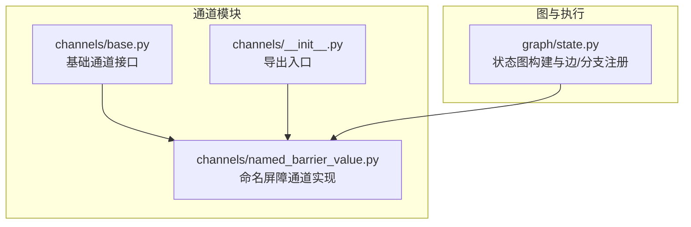
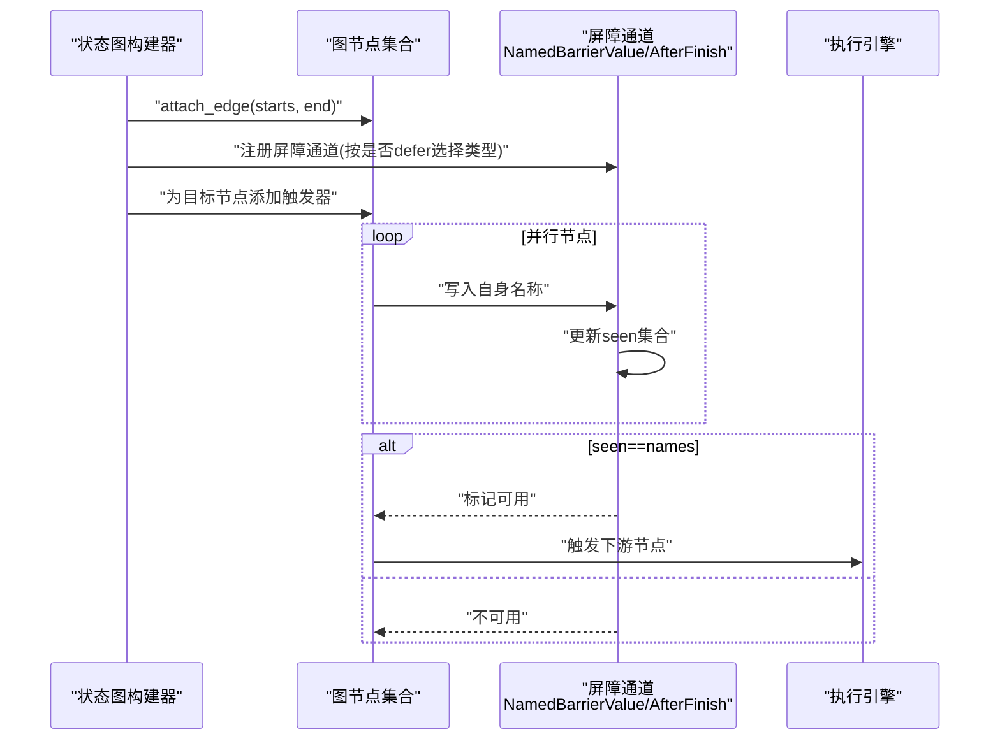
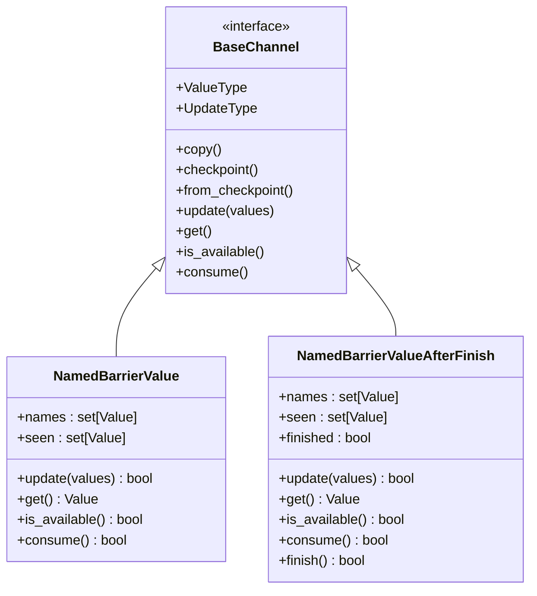
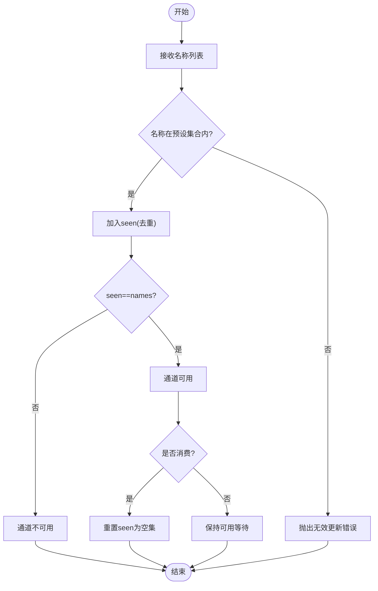
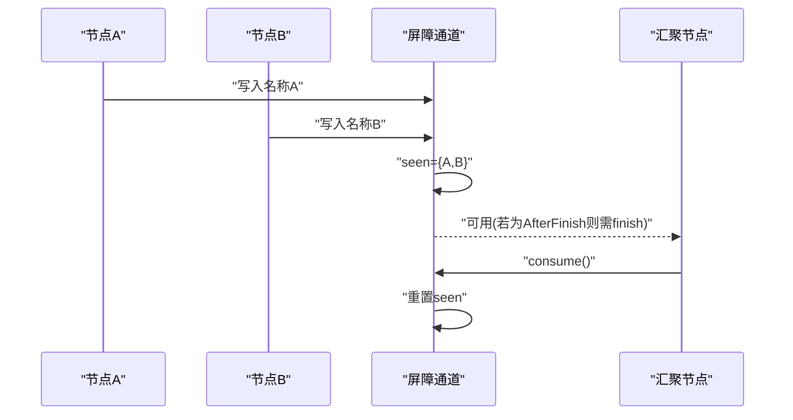
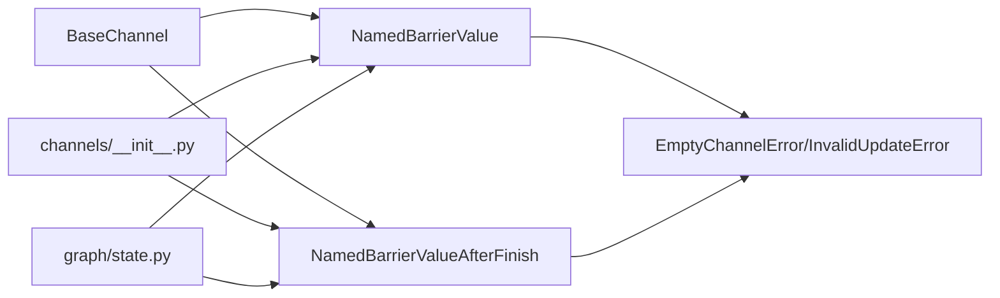

# 屏障通道

<cite>
**本文引用的文件**
- [named_barrier_value.py](file://libs/langgraph/langgraph/channels/named_barrier_value.py)
- [__init__.py](file://libs/langgraph/langgraph/channels/__init__.py)
- [state.py](file://libs/langgraph/langgraph/graph/state.py)
- [base.py](file://libs/langgraph/langgraph/channels/base.py)
- [errors.py](file://libs/langgraph/langgraph/errors.py)
</cite>

## 目录
1. [简介](#简介)
2. [项目结构](#项目结构)
3. [核心组件](#核心组件)
4. [架构总览](#架构总览)
5. [详细组件分析](#详细组件分析)
6. [依赖分析](#依赖分析)
7. [性能考量](#性能考量)
8. [故障排查指南](#故障排查指南)
9. [结论](#结论)
10. [附录](#附录)

## 简介
本篇文档围绕“屏障通道”展开，重点解释 NamedBarrierValue 与 NamedBarrierValueAfterFinish 两类通道的同步机制与屏障控制原理。它们用于协调多个并行执行的节点，确保满足特定的“全部命名值已到达”的条件后才继续推进流程。文档将阐述：
- 命名机制：通过预定义的名称集合进行匹配与追踪
- 等待策略：基于 seen 集合与 names 集合的比较决定可用性
- 超时处理：当前实现未内置超时逻辑，需结合上层调度或外部机制
- 复杂工作流场景：并行任务聚合、条件分支合并、延迟触发的屏障
- 配置参数与使用要点：类型约束、名称集合、消费与重置行为
- 性能与故障处理策略：时间/空间复杂度、错误传播与恢复建议

## 项目结构
屏障通道位于通道子系统中，作为基础通道类型的扩展实现之一，供状态图与 Pregel 执行引擎使用。

图表来源
- [base.py](file://libs/langgraph/langgraph/channels/base.py)
- [named_barrier_value.py](file://libs/langgraph/langgraph/channels/named_barrier_value.py)
- [__init__.py](file://libs/langgraph/langgraph/channels/__init__.py)
- [state.py](file://libs/langgraph/langgraph/graph/state.py)

章节来源
- [__init__.py:1-28](file://libs/langgraph/langgraph/channels/__init__.py#L1-L28)
- [state.py:1339-1364](file://libs/langgraph/langgraph/graph/state.py#L1339-L1364)

## 核心组件
- NamedBarrierValue：等待所有指定名称到达后，使通道可用；可用后可被消费并重置 seen 集合，以便下一轮聚合。
- NamedBarrierValueAfterFinish：与前者类似，但只有在显式调用 finish 后才会变为可用；适合需要“先收集再统一触发”的场景。

两者均继承自基础通道接口，具备类型泛型、更新、检查点、可用性判断与消费等能力。

章节来源
- [named_barrier_value.py:13-82](file://libs/langgraph/langgraph/channels/named_barrier_value.py#L13-L82)
- [named_barrier_value.py:84-168](file://libs/langgraph/langgraph/channels/named_barrier_value.py#L84-L168)
- [base.py](file://libs/langgraph/langgraph/channels/base.py)

## 架构总览
屏障通道在状态图构建阶段被动态注册到图的通道集中，作为汇聚边（join）的同步原语。当多条并行路径完成各自节点后，会向共享的屏障通道写入各自的名称；当 seen 集合等于预设 names 集合时，目标节点被触发继续执行。

图表来源
- [state.py:1339-1364](file://libs/langgraph/langgraph/graph/state.py#L1339-L1364)
- [named_barrier_value.py:56-81](file://libs/langgraph/langgraph/channels/named_barrier_value.py#L56-L81)
- [named_barrier_value.py:134-168](file://libs/langgraph/langgraph/channels/named_barrier_value.py#L134-L168)

## 详细组件分析

### 类与接口关系

图表来源
- [base.py](file://libs/langgraph/langgraph/channels/base.py)
- [named_barrier_value.py:13-82](file://libs/langgraph/langgraph/channels/named_barrier_value.py#L13-L82)
- [named_barrier_value.py:84-168](file://libs/langgraph/langgraph/channels/named_barrier_value.py#L84-L168)

章节来源
- [named_barrier_value.py:13-168](file://libs/langgraph/langgraph/channels/named_barrier_value.py#L13-L168)
- [base.py](file://libs/langgraph/langgraph/channels/base.py)

### 同步机制与屏障控制原理
- 命名机制：构造函数接收一个类型与名称集合；通道仅接受属于该集合的名称，否则抛出无效更新错误。
- 等待策略：维护 seen 集合，每次收到新名称若不在 seen 中则加入；当 seen 完全等于 names 时，通道变为可用。
- 消费与重置：consume 成功后将重置 seen，允许下一轮屏障继续使用。
- AfterFinish 变体：在 seen==names 的前提下，还需 finish 被调用后才可用；consume 后会重置 finished 与 seen，便于循环复用。

图表来源
- [named_barrier_value.py:56-81](file://libs/langgraph/langgraph/channels/named_barrier_value.py#L56-L81)
- [named_barrier_value.py:134-168](file://libs/langgraph/langgraph/channels/named_barrier_value.py#L134-L168)

章节来源
- [named_barrier_value.py:56-81](file://libs/langgraph/langgraph/channels/named_barrier_value.py#L56-L81)
- [named_barrier_value.py:134-168](file://libs/langgraph/langgraph/channels/named_barrier_value.py#L134-L168)

### 在复杂工作流中的应用
- 并行任务聚合：多条并行路径完成后，分别向共享屏障通道写入各自名称；当所有名称到达后，汇聚节点被触发。
- 条件分支合并：不同分支可能根据条件输出不同的名称；屏障通道统一等待这些名称齐备后继续。
- 延迟触发的屏障：当目标节点声明 defer 时，使用 NamedBarrierValueAfterFinish；在所有名称到达后，需显式 finish 才能触发，适合需要“收集阶段”与“触发阶段”分离的场景。

图表来源
- [state.py:1349-1363](file://libs/langgraph/langgraph/graph/state.py#L1349-L1363)
- [named_barrier_value.py:77-81](file://libs/langgraph/langgraph/channels/named_barrier_value.py#L77-L81)
- [named_barrier_value.py:155-160](file://libs/langgraph/langgraph/channels/named_barrier_value.py#L155-L160)

章节来源
- [state.py:1349-1363](file://libs/langgraph/langgraph/graph/state.py#L1349-L1363)

### 配置参数与使用要点
- 类型参数：泛型类型约束，确保名称与通道内部存储一致。
- 名称集合：在构造时确定，决定 update 的合法性与 is_available 的判定条件。
- 消费与重置：consume 仅在满足条件时生效，成功后重置 seen，支持循环复用。
- AfterFinish 特性：finish 仅在 seen==names 且尚未 finished 时生效，避免重复触发。

章节来源
- [named_barrier_value.py:21-24](file://libs/langgraph/langgraph/channels/named_barrier_value.py#L21-L24)
- [named_barrier_value.py:77-81](file://libs/langgraph/langgraph/channels/named_barrier_value.py#L77-L81)
- [named_barrier_value.py:162-168](file://libs/langgraph/langgraph/channels/named_barrier_value.py#L162-L168)

## 依赖分析
- 继承关系：两类屏障通道均继承自基础通道接口，遵循统一的生命周期与契约。
- 错误模型：非法更新与通道为空时的访问分别映射到对应的错误类型，便于上层捕获与处理。
- 导出入口：通道模块对外导出屏障通道类，供上层图构建与运行时使用。

图表来源
- [base.py](file://libs/langgraph/langgraph/channels/base.py)
- [named_barrier_value.py:8-8](file://libs/langgraph/langgraph/channels/named_barrier_value.py#L8-L8)
- [__init__.py:6-11](file://libs/langgraph/langgraph/channels/__init__.py#L6-L11)
- [state.py:1351-1356](file://libs/langgraph/langgraph/graph/state.py#L1351-L1356)

章节来源
- [named_barrier_value.py:8-8](file://libs/langgraph/langgraph/channels/named_barrier_value.py#L8-L8)
- [__init__.py:6-11](file://libs/langgraph/langgraph/channels/__init__.py#L6-L11)
- [state.py:1351-1356](file://libs/langgraph/langgraph/graph/state.py#L1351-L1356)

## 性能考量
- 时间复杂度
  - update：对每个输入名称执行常数时间的集合成员检查与插入，整体 O(n)，n 为输入数量。
  - is_available：集合相等性比较 O(m)，m 为预设名称数量。
  - consume：条件判断与清空 seen，O(m)。
- 空间复杂度
  - seen 与 names 均为集合，空间开销与预设名称数量线性相关。
- 优化建议
  - 尽量减少不必要的重复写入，update 已做去重，但仍应避免冗余触发。
  - 对于大规模名称集合，可考虑在上层进行分组与局部屏障，降低单个屏障的规模。
  - AfterFinish 变体适合长流程的阶段性触发，避免一次性等待过多名称导致阻塞。

[本节为通用性能讨论，不直接分析具体文件]

## 故障排查指南
- 无效更新错误
  - 现象：向通道写入了不在预设名称集合内的值。
  - 排查：确认写入侧是否正确传递了预期名称；检查名称拼写与类型一致性。
- 通道为空错误
  - 现象：在条件未满足时尝试读取通道值。
  - 排查：确认所有并行分支均已写入对应名称；对于 AfterFinish，确保 finish 已被调用。
- 消费后未触发
  - 现象：消费成功但下游未继续执行。
  - 排查：确认目标节点已注册为屏障通道的触发器；检查图的边与分支是否正确连接。
- AfterFinish 无法触发
  - 现象：即使所有名称已到达，通道仍不可用。
  - 排查：确认 finish 是否被调用；检查 finish 的返回值与调用时机。

章节来源
- [named_barrier_value.py:64-66](file://libs/langgraph/langgraph/channels/named_barrier_value.py#L64-L66)
- [named_barrier_value.py:70-72](file://libs/langgraph/langgraph/channels/named_barrier_value.py#L70-L72)
- [named_barrier_value.py:148-150](file://libs/langgraph/langgraph/channels/named_barrier_value.py#L148-L150)
- [errors.py](file://libs/langgraph/langgraph/errors.py)

## 结论
NamedBarrierValue 与 NamedBarrierValueAfterFinish 提供了强一致性的“全部到达”同步原语，适用于复杂的并行与分支汇聚场景。通过预设名称集合与 seen 集合的对比，它们能够可靠地协调多个节点的执行顺序。在实际工程中，建议结合图的 defer 语义与显式 finish 机制，设计清晰的触发边界，配合上层的错误处理与可观测性，确保屏障通道在高并发与长流程中稳定运行。

[本节为总结性内容，不直接分析具体文件]

## 附录
- 使用建议
  - 名称集合应尽量固定且语义明确，避免动态生成导致的不一致。
  - 对于长流程，优先采用 AfterFinish，将“收集阶段”与“触发阶段”解耦。
  - 在调试阶段，可通过日志记录 seen 的变化，快速定位缺失的名称。
- 相关实现位置
  - 屏障通道定义：[named_barrier_value.py:13-168](file://libs/langgraph/langgraph/channels/named_barrier_value.py#L13-L168)
  - 图构建注册：[state.py:1349-1363](file://libs/langgraph/langgraph/graph/state.py#L1349-L1363)
  - 导出入口：[__init__.py:6-11](file://libs/langgraph/langgraph/channels/__init__.py#L6-L11)