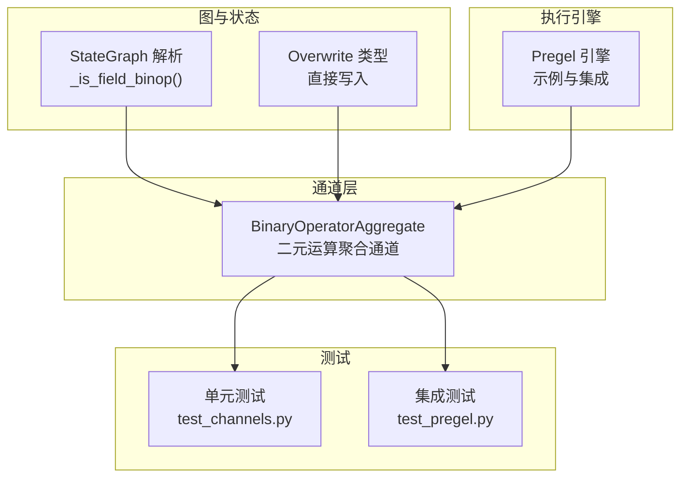
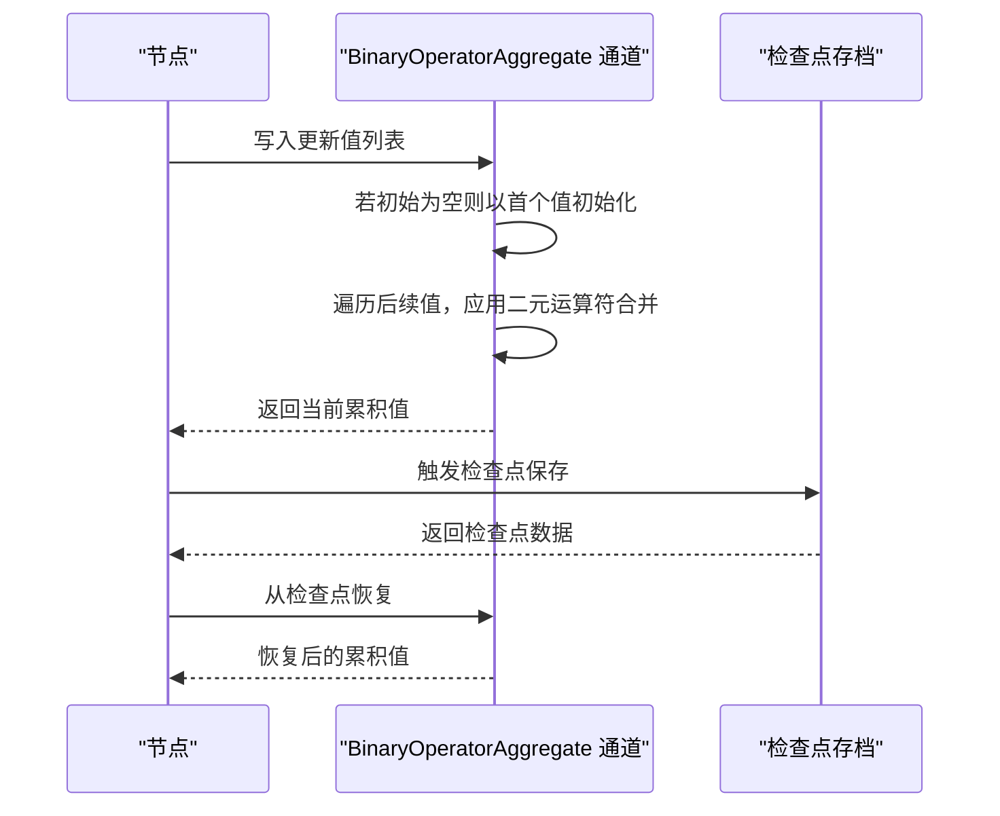
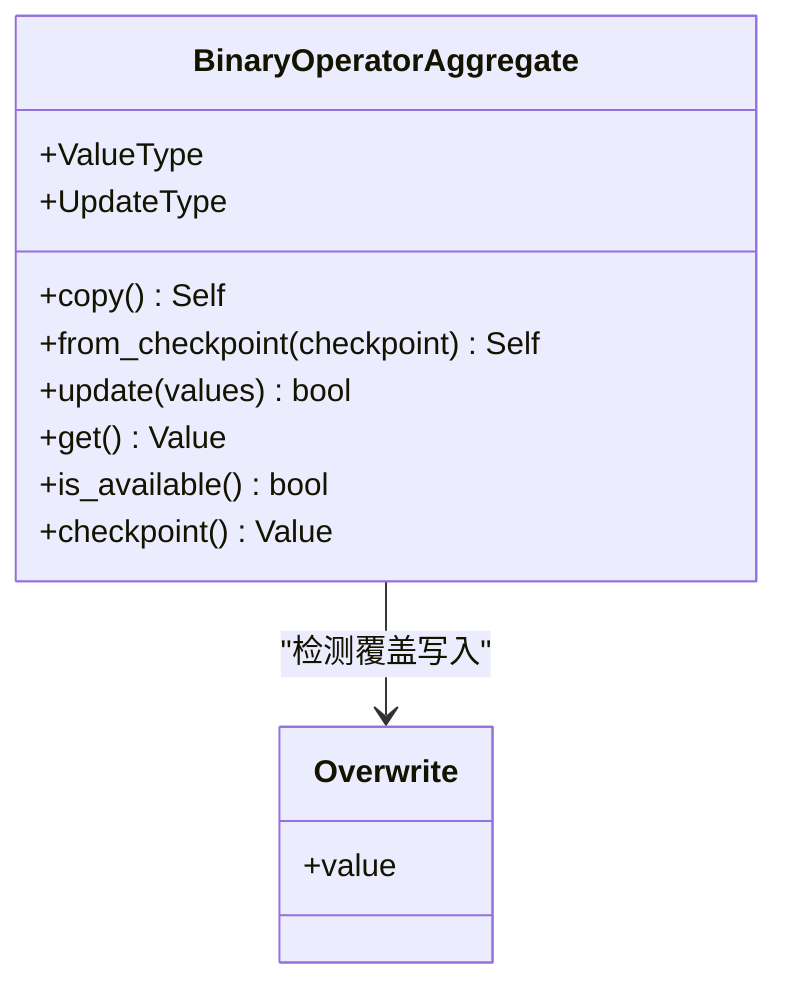
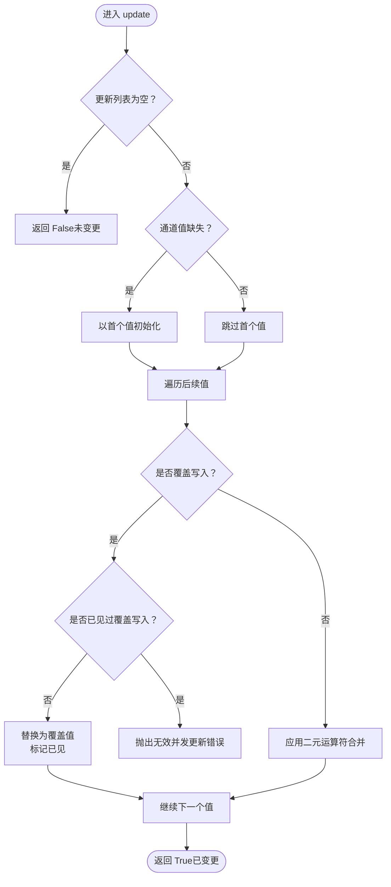
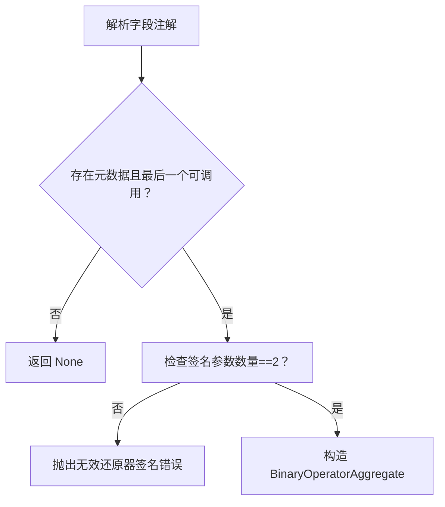
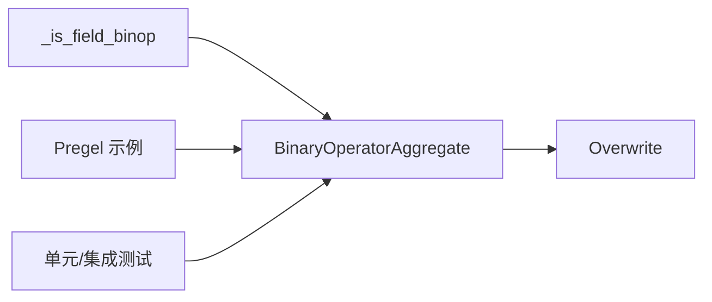

# 聚合通道

<cite>
**本文引用的文件**
- [libs/langgraph/langgraph/channels/binop.py](file://libs/langgraph/langgraph/channels/binop.py)
- [libs/langgraph/langgraph/pregel/main.py](file://libs/langgraph/langgraph/pregel/main.py)
- [libs/langgraph/langgraph/graph/state.py](file://libs/langgraph/langgraph/graph/state.py)
- [libs/langgraph/langgraph/types.py](file://libs/langgraph/langgraph/types.py)
- [libs/langgraph/tests/test_channels.py](file://libs/langgraph/tests/test_channels.py)
- [libs/langgraph/tests/test_pregel.py](file://libs/langgraph/tests/test_pregel.py)
</cite>

## 目录
1. [简介](#简介)
2. [项目结构](#项目结构)
3. [核心组件](#核心组件)
4. [架构总览](#架构总览)
5. [详细组件分析](#详细组件分析)
6. [依赖分析](#依赖分析)
7. [性能考虑](#性能考虑)
8. [故障排查指南](#故障排查指南)
9. [结论](#结论)
10. [附录](#附录)

## 简介
本篇文档围绕 BinaryOperatorAggregate（二元运算聚合）通道展开，系统阐述其在 LangGraph 中的聚合计算机制与二元运算策略。该通道用于将多个输入值通过指定的二元运算符进行合并，形成持久化的累积状态，并支持检查点恢复、覆盖写入与幂等更新。文档同时解释聚合运算的顺序性、幂等性与一致性保障，给出求和、最大值、最小值、字符串拼接等常见场景的实现思路，并提供性能优化建议与复杂聚合逻辑的实现指导。

## 项目结构
与聚合通道直接相关的模块与文件如下：
- channels/binop.py：定义 BinaryOperatorAggregate 通道类及其二元运算聚合逻辑
- pregel/main.py：展示如何在 Pregel 引擎中使用 BinaryOperatorAggregate 的示例
- graph/state.py：解析注解中的二元运算器并构造 BinaryOperatorAggregate 的辅助函数
- types.py：Overwrite 类型定义，允许在单步内绕过二元运算器直接写入
- tests/test_channels.py：对 BinaryOperatorAggregate 的单元测试
- tests/test_pregel.py：在 Pregel 与 StateGraph 场景中使用 BinaryOperatorAggregate 的集成测试

图表来源
- [libs/langgraph/langgraph/channels/binop.py:41-135](file://libs/langgraph/langgraph/channels/binop.py#L41-L135)
- [libs/langgraph/langgraph/graph/state.py:1678-1696](file://libs/langgraph/langgraph/graph/state.py#L1678-L1696)
- [libs/langgraph/langgraph/types.py:832-873](file://libs/langgraph/langgraph/types.py#L832-L873)
- [libs/langgraph/langgraph/pregel/main.py:390-589](file://libs/langgraph/langgraph/pregel/main.py#L390-L589)
- [libs/langgraph/tests/test_channels.py:77-91](file://libs/langgraph/tests/test_channels.py#L77-L91)
- [libs/langgraph/tests/test_pregel.py:800-847](file://libs/langgraph/tests/test_pregel.py#L800-L847)

章节来源
- [libs/langgraph/langgraph/channels/binop.py:41-135](file://libs/langgraph/langgraph/channels/binop.py#L41-L135)
- [libs/langgraph/langgraph/pregel/main.py:390-589](file://libs/langgraph/langgraph/pregel/main.py#L390-L589)
- [libs/langgraph/langgraph/graph/state.py:1678-1696](file://libs/langgraph/langgraph/graph/state.py#L1678-L1696)
- [libs/langgraph/langgraph/types.py:832-873](file://libs/langgraph/langgraph/types.py#L832-L873)
- [libs/langgraph/tests/test_channels.py:77-91](file://libs/langgraph/tests/test_channels.py#L77-L91)
- [libs/langgraph/tests/test_pregel.py:800-847](file://libs/langgraph/tests/test_pregel.py#L800-L847)

## 核心组件
- BinaryOperatorAggregate：泛型通道，存储当前累积值，接收一系列更新值，按序通过二元运算符合并；支持检查点持久化与从检查点恢复；支持在单步内通过 Overwrite 直接覆盖整个值。
- Overwrite：包装类型，允许在一次“超步骤”（super-step）内仅接收一个覆盖写入，绕过二元运算器，直接替换通道值。
- StateGraph 注解解析：当字段注解包含可调用的二元运算器时，自动构造 BinaryOperatorAggregate 通道实例。
- Pregel 示例：展示如何在 Pregel 应用中声明与使用 BinaryOperatorAggregate 通道。

章节来源
- [libs/langgraph/langgraph/channels/binop.py:41-135](file://libs/langgraph/langgraph/channels/binop.py#L41-L135)
- [libs/langgraph/langgraph/types.py:832-873](file://libs/langgraph/langgraph/types.py#L832-L873)
- [libs/langgraph/langgraph/graph/state.py:1678-1696](file://libs/langgraph/langgraph/graph/state.py#L1678-L1696)
- [libs/langgraph/langgraph/pregel/main.py:514-556](file://libs/langgraph/langgraph/pregel/main.py#L514-L556)

## 架构总览
BinaryOperatorAggregate 在 LangGraph 中作为“高级通道”之一，与 LastValue、Topic、EphemeralValue 等共同构成图的通道体系。它在 Pregel 执行过程中负责累积更新，典型用法包括：
- 求和、计数、连接字符串、集合合并、字典合并等
- 与 StateGraph 的 Annotated 字段配合，自动推导通道类型与运算器
- 支持检查点保存与恢复，确保一致性与可重放

图表来源
- [libs/langgraph/langgraph/channels/binop.py:102-135](file://libs/langgraph/langgraph/channels/binop.py#L102-L135)
- [libs/langgraph/langgraph/pregel/main.py:396-399](file://libs/langgraph/langgraph/pregel/main.py#L396-L399)

## 详细组件分析

### BinaryOperatorAggregate 类设计
- 泛型与类型处理：构造时根据类型参数推导具体容器类型（序列、集合、映射），并尝试实例化空值；若不可实例化则标记为缺失。
- 二元运算器：在 update 过程中，将当前值与每个新值通过运算器合并；支持覆盖写入（Overwrite）优先于常规合并。
- 并发与错误：单步内仅允许一次覆盖写入；重复覆盖会触发无效并发更新错误。
- 可用性与检查点：提供 is_available、checkpoint、from_checkpoint 等接口，便于引擎持久化与恢复。

图表来源
- [libs/langgraph/langgraph/channels/binop.py:41-135](file://libs/langgraph/langgraph/channels/binop.py#L41-L135)
- [libs/langgraph/langgraph/types.py:832-873](file://libs/langgraph/langgraph/types.py#L832-L873)

章节来源
- [libs/langgraph/langgraph/channels/binop.py:41-135](file://libs/langgraph/langgraph/channels/binop.py#L41-L135)
- [libs/langgraph/langgraph/types.py:832-873](file://libs/langgraph/langgraph/types.py#L832-L873)

### 更新流程与覆盖写入
- 初始化：若通道值缺失且传入非空更新列表，则以第一个值初始化。
- 合并：遍历剩余值，若遇到覆盖写入则仅接受一次；否则对当前值与新值应用二元运算符。
- 返回：返回当前累积值；若仍为缺失则抛出空通道异常。

图表来源
- [libs/langgraph/langgraph/channels/binop.py:102-123](file://libs/langgraph/langgraph/channels/binop.py#L102-L123)

章节来源
- [libs/langgraph/langgraph/channels/binop.py:102-123](file://libs/langgraph/langgraph/channels/binop.py#L102-L123)

### 与 StateGraph 的集成
- 注解解析：当字段注解的最后一个元数据项为可调用对象且签名形如 (a, b) -> c 时，自动构造 BinaryOperatorAggregate 通道。
- 错误校验：若签名参数个数不等于 2，抛出无效还原器签名错误。

图表来源
- [libs/langgraph/langgraph/graph/state.py:1678-1696](file://libs/langgraph/langgraph/graph/state.py#L1678-L1696)

章节来源
- [libs/langgraph/langgraph/graph/state.py:1678-1696](file://libs/langgraph/langgraph/graph/state.py#L1678-L1696)

### 在 Pregel 中的使用示例
- 文档示例展示了如何在 Pregel 中声明 BinaryOperatorAggregate 通道，并通过自定义二元运算器实现字符串拼接等场景。
- 集成测试展示了在 StateGraph 中使用 operator.add 对整数进行累积求和，并结合检查点存档与恢复。

章节来源
- [libs/langgraph/langgraph/pregel/main.py:514-556](file://libs/langgraph/langgraph/pregel/main.py#L514-L556)
- [libs/langgraph/tests/test_pregel.py:800-847](file://libs/langgraph/tests/test_pregel.py#L800-L847)
- [libs/langgraph/tests/test_pregel.py:1410-1471](file://libs/langgraph/tests/test_pregel.py#L1410-L1471)

### 单元测试验证
- 基础行为：初始值为零元构造结果；连续更新累加；检查点恢复后值一致。
- 边界条件：空更新返回未变更；从检查点恢复后值正确。

章节来源
- [libs/langgraph/tests/test_channels.py:77-91](file://libs/langgraph/tests/test_channels.py#L77-L91)

## 依赖分析
- 组件耦合
  - BinaryOperatorAggregate 依赖 Overwrite 类型与常量标识，用于识别覆盖写入。
  - StateGraph 解析函数依赖二元运算器签名约束，确保类型安全。
  - Pregel 示例与集成测试依赖通道的检查点与恢复能力。
- 外部依赖
  - operator 模块常用二元运算器（如加法、连接等）。
  - typing 与 typing_extensions 提供类型推断与泛型支持。

图表来源
- [libs/langgraph/langgraph/channels/binop.py:32-38](file://libs/langgraph/langgraph/channels/binop.py#L32-L38)
- [libs/langgraph/langgraph/graph/state.py:1678-1696](file://libs/langgraph/langgraph/graph/state.py#L1678-L1696)
- [libs/langgraph/langgraph/pregel/main.py:514-556](file://libs/langgraph/langgraph/pregel/main.py#L514-L556)
- [libs/langgraph/tests/test_channels.py:77-91](file://libs/langgraph/tests/test_channels.py#L77-L91)
- [libs/langgraph/tests/test_pregel.py:800-847](file://libs/langgraph/tests/test_pregel.py#L800-L847)

章节来源
- [libs/langgraph/langgraph/channels/binop.py:32-38](file://libs/langgraph/langgraph/channels/binop.py#L32-L38)
- [libs/langgraph/langgraph/graph/state.py:1678-1696](file://libs/langgraph/langgraph/graph/state.py#L1678-L1696)
- [libs/langgraph/langgraph/pregel/main.py:514-556](file://libs/langgraph/langgraph/pregel/main.py#L514-L556)
- [libs/langgraph/tests/test_channels.py:77-91](file://libs/langgraph/tests/test_channels.py#L77-L91)
- [libs/langgraph/tests/test_pregel.py:800-847](file://libs/langgraph/tests/test_pregel.py#L800-L847)

## 性能考虑
- 时间复杂度
  - update 操作对每个新值执行一次二元运算，整体为 O(n)，n 为更新列表长度。
  - get/checkpoint/is_available 为 O(1)。
- 空间复杂度
  - 仅存储当前累积值，空间复杂度为 O(1)（相对于累积值本身）。
- 优化建议
  - 尽量批量传递更新值，减少多次调用带来的开销。
  - 对昂贵的二元运算（如深度合并、大对象拼接）考虑缓存中间结果或延迟计算。
  - 使用检查点避免频繁重算，结合线程隔离与幂等写入降低重复工作。
  - 对不可变类型（如 frozenset、tuple）与可变类型（如 list、dict）选择合适的初始容器类型，减少拷贝成本。

## 故障排查指南
- 空通道错误
  - 现象：首次访问通道值即抛出空通道异常。
  - 原因：通道尚未被任何值初始化。
  - 处理：确保至少有一个更新值写入，或在构造时提供合适的零元初始值。
- 无效并发更新错误
  - 现象：在同一超步骤内出现多次覆盖写入，抛出无效并发更新错误。
  - 原因：覆盖写入仅允许一次。
  - 处理：在单步内仅使用一次 Overwrite，或改用常规合并。
- 还原器签名错误
  - 现象：注解中的二元运算器签名不符合 (a, b) -> c。
  - 原因：参数个数不等于 2。
  - 处理：修正运算器签名，确保两个参数位置可用。
- 检查点不一致
  - 现象：从检查点恢复后值与预期不符。
  - 原因：二元运算器不满足结合律或幂等性导致顺序敏感。
  - 处理：确保运算器满足结合律（如加法、字符串拼接、集合/字典合并）；必要时引入稳定排序或规范化策略。

章节来源
- [libs/langgraph/langgraph/channels/binop.py:102-123](file://libs/langgraph/langgraph/channels/binop.py#L102-L123)
- [libs/langgraph/langgraph/graph/state.py:1693-1695](file://libs/langgraph/langgraph/graph/state.py#L1693-L1695)
- [libs/langgraph/tests/test_channels.py:77-91](file://libs/langgraph/tests/test_channels.py#L77-L91)

## 结论
BinaryOperatorAggregate 通道通过二元运算器将多步更新有序地合并为单一累积值，具备良好的可组合性与持久化能力。结合 Overwrite、StateGraph 注解解析与 Pregel 执行引擎，可在多种场景下实现高效、一致的聚合逻辑。遵循结合律与幂等性原则、合理使用检查点与覆盖写入，是构建健壮聚合通道的关键。

## 附录

### 常见聚合场景与实现要点
- 求和/计数
  - 使用 operator.add 或自定义加法运算器；注意数值溢出与类型一致性。
- 最大值/最小值
  - 使用 max/min 二元运算器；确保比较操作对输入类型有效。
- 字符串拼接
  - 使用自定义连接器（如带分隔符的拼接函数）；控制顺序与分隔符。
- 列表/集合/字典合并
  - 使用 operator.add（列表）、集合运算符（如 |）、字典合并（如浅拷贝 + 更新）；注意深浅拷贝与键冲突处理。
- 幂等性与顺序性
  - 对可交换/结合的运算（如加法、并集、字典合并）天然满足顺序无关；对不可交换运算需显式排序或引入稳定策略。

### 一致性与幂等性保证
- 顺序性：update 按传入顺序依次应用二元运算，最终结果与顺序相关。
- 幂等性：若二元运算满足 f(f(a,b),b)=f(a,b)，则多次写入相同值不会改变结果。
- 一致性：结合检查点与覆盖写入规则，确保在失败重试与并发写入场景下的最终一致性。