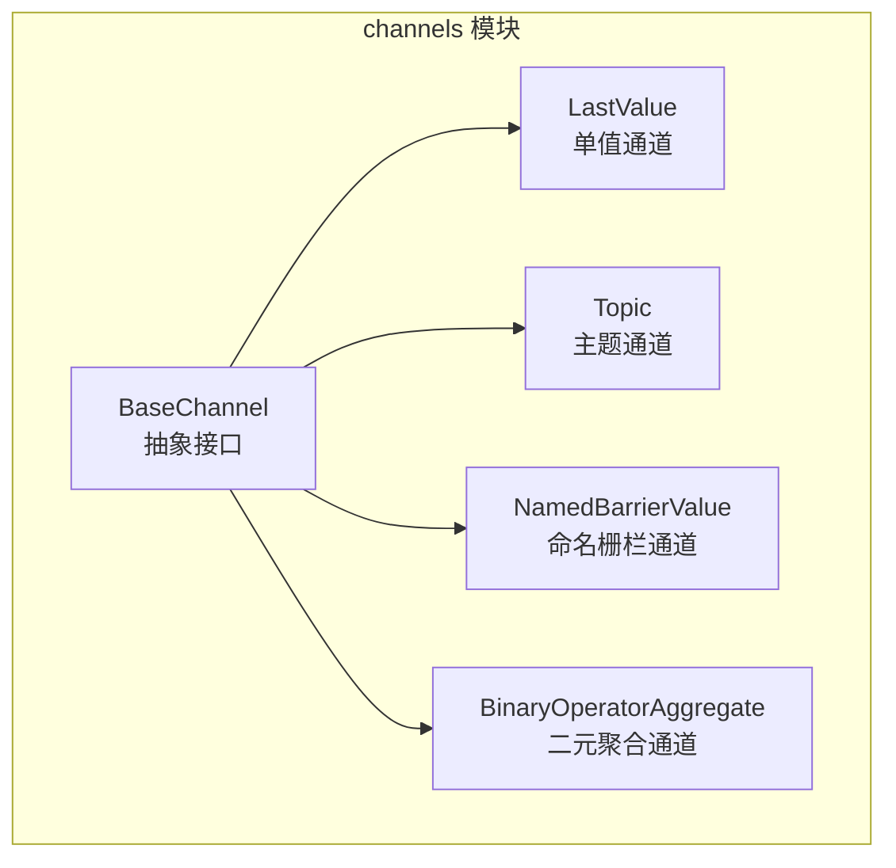
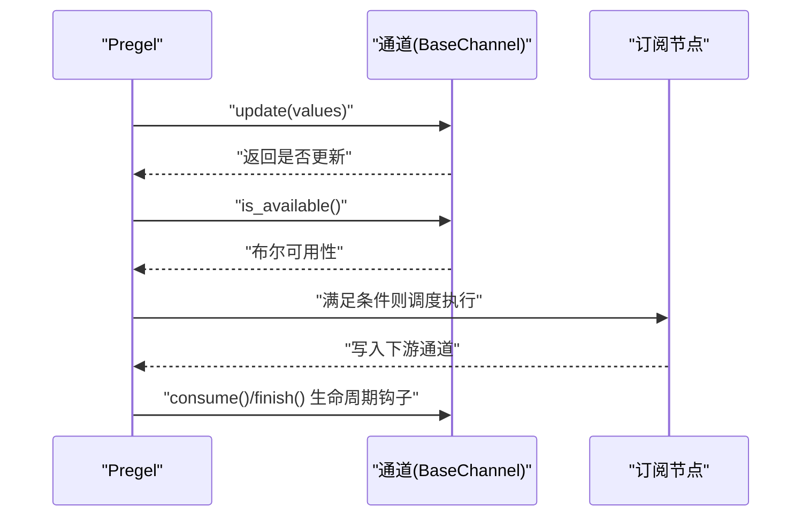
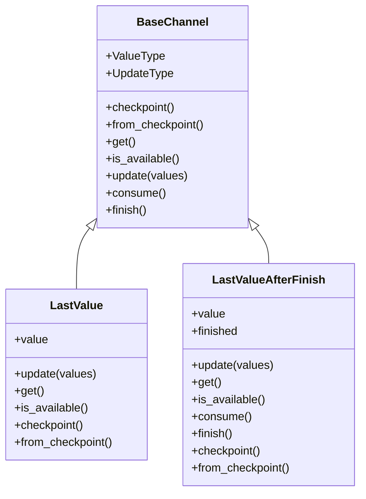
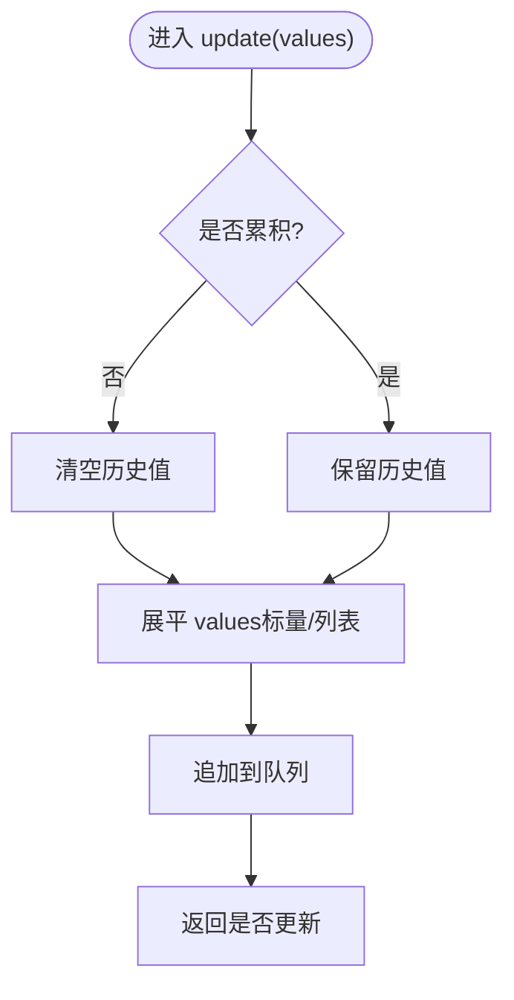
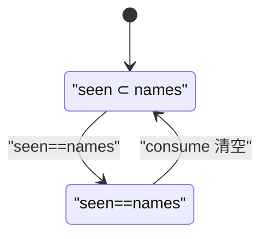
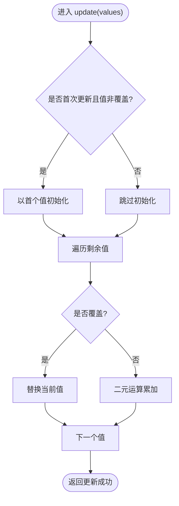
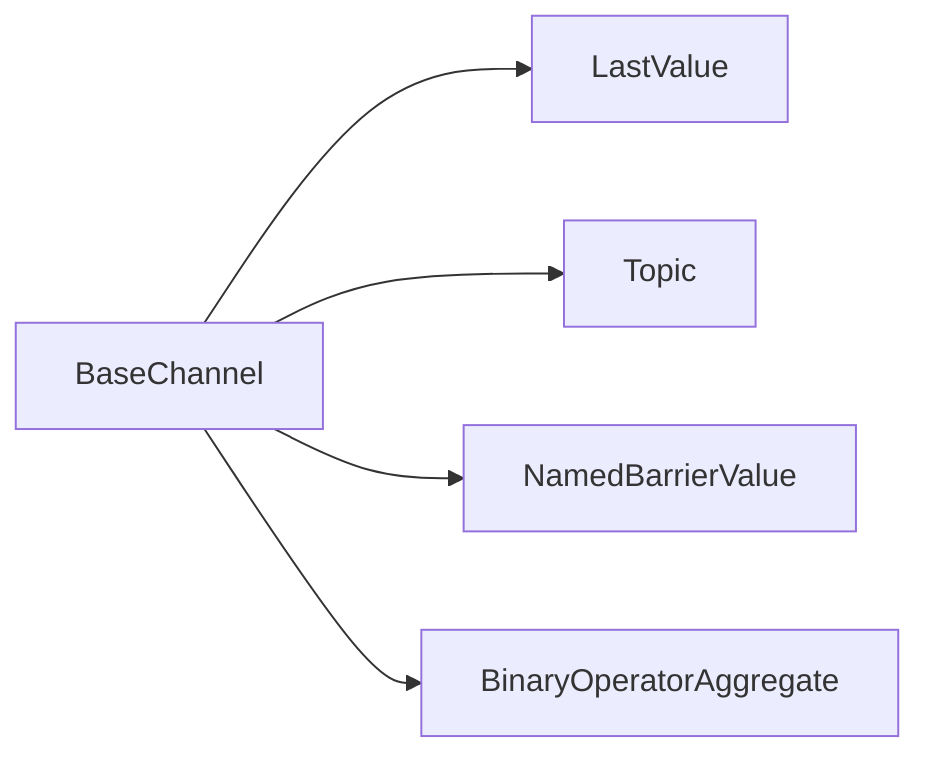

# 通道系统

<cite>
**本文引用的文件**
- [libs/langgraph/langgraph/channels/base.py](file://libs/langgraph/langgraph/channels/base.py)
- [libs/langgraph/langgraph/channels/last_value.py](file://libs/langgraph/langgraph/channels/last_value.py)
- [libs/langgraph/langgraph/channels/topic.py](file://libs/langgraph/langgraph/channels/topic.py)
- [libs/langgraph/langgraph/channels/named_barrier_value.py](file://libs/langgraph/langgraph/channels/named_barrier_value.py)
- [libs/langgraph/langgraph/channels/binop.py](file://libs/langgraph/langgraph/channels/binop.py)
- [libs/langgraph/tests/test_channels.py](file://libs/langgraph/tests/test_channels.py)
</cite>

## 目录
1. [简介](#简介)
2. [项目结构](#项目结构)
3. [核心组件](#核心组件)
4. [架构总览](#架构总览)
5. [详细组件分析](#详细组件分析)
6. [依赖分析](#依赖分析)
7. [性能考虑](#性能考虑)
8. [故障排查指南](#故障排查指南)
9. [结论](#结论)
10. [附录](#附录)

## 简介
本文件围绕状态化代理（Pregel）中的“通道”系统进行系统性说明，重点阐释通道如何在节点之间实现解耦与数据传递，以及通道的生命周期管理、数据更新策略与并发访问控制。文档同时覆盖内置通道类型：LastValue、Topic、NamedBarrierValue、BinaryOperatorAggregate 的特性与典型使用场景，并给出通道组合与自定义通道实现的设计建议与最佳实践。

## 项目结构
通道系统位于 langgraph 的 channels 子模块中，采用面向对象抽象与泛型设计，通过统一的 BaseChannel 接口约束不同通道的行为。测试用例集中于 tests/test_channels.py，用于验证各通道的可用性、更新语义与检查点行为。

图表来源
- [libs/langgraph/langgraph/channels/base.py:19-122](file://libs/langgraph/langgraph/channels/base.py#L19-L122)
- [libs/langgraph/langgraph/channels/last_value.py:20-152](file://libs/langgraph/langgraph/channels/last_value.py#L20-L152)
- [libs/langgraph/langgraph/channels/topic.py:23-95](file://libs/langgraph/langgraph/channels/topic.py#L23-L95)
- [libs/langgraph/langgraph/channels/named_barrier_value.py:13-168](file://libs/langgraph/langgraph/channels/named_barrier_value.py#L13-L168)
- [libs/langgraph/langgraph/channels/binop.py:41-135](file://libs/langgraph/langgraph/channels/binop.py#L41-L135)

章节来源
- [libs/langgraph/langgraph/channels/base.py:1-122](file://libs/langgraph/langgraph/channels/base.py#L1-L122)
- [libs/langgraph/tests/test_channels.py:1-120](file://libs/langgraph/tests/test_channels.py#L1-L120)

## 核心组件
- BaseChannel 抽象接口：定义通道的类型参数（Value、Update、Checkpoint）、序列化/反序列化（checkpoint/from_checkpoint）、读取（get/is_available）、写入（update）与生命周期钩子（consume/finish）。该接口确保所有通道具备一致的契约，便于 Pregel 在每步结束时批量应用更新并驱动节点执行。
- 各内置通道均继承 BaseChannel 并实现具体语义，覆盖单值存储、主题发布订阅、命名栅栏汇聚、二元运算聚合等常见模式。

章节来源
- [libs/langgraph/langgraph/channels/base.py:19-122](file://libs/langgraph/langgraph/channels/base.py#L19-L122)

## 架构总览
通道系统在 Pregel 执行循环中的位置如下：每轮调度结束后，Pregel 调用各通道的 update 方法合并本轮更新；随后根据通道可用性决定是否触发订阅该通道的节点；节点执行完成后，通道可选择 consume/finish 进行状态清理或延迟暴露。

图表来源
- [libs/langgraph/langgraph/channels/base.py:69-122](file://libs/langgraph/langgraph/channels/base.py#L69-L122)

## 详细组件分析

### BaseChannel 抽象与生命周期
- 类型参数
  - ValueType：通道当前值的类型
  - UpdateType：通道接收的更新值类型
  - Checkpoint：可序列化的检查点类型
- 关键方法
  - checkpoint/from_checkpoint：支持通道状态持久化与恢复
  - get/is_available：读取当前值与可用性判断
  - update：批量应用更新（顺序无关），返回是否发生状态变化
  - consume/finish：生命周期钩子，用于消费后清空或延迟暴露
- 错误处理
  - EmptyChannelError：当通道为空时读取抛出
  - InvalidUpdateError：当更新违反通道约束时抛出

章节来源
- [libs/langgraph/langgraph/channels/base.py:19-122](file://libs/langgraph/langgraph/channels/base.py#L19-L122)

### LastValue 单值通道
- 特性
  - 每步仅接受一个更新值，多值更新将触发错误
  - 提供 LastValueAfterFinish 变体：仅在 finish() 后才可读取，且首次消费后清空
- 使用场景
  - 作为节点输入的“上一步结果”或“最近事件”
  - 需要严格限制每步输入数量的场景
- 更新策略
  - update 接收序列，若长度不为 1 则报错
  - get 返回最新值，未初始化时报空错误
- 生命周期
  - consume/finish 可配合 AfterFinish 变体实现“一次性读取”语义

图表来源
- [libs/langgraph/langgraph/channels/base.py:19-122](file://libs/langgraph/langgraph/channels/base.py#L19-L122)
- [libs/langgraph/langgraph/channels/last_value.py:20-152](file://libs/langgraph/langgraph/channels/last_value.py#L20-L152)

章节来源
- [libs/langgraph/langgraph/channels/last_value.py:20-152](file://libs/langgraph/langgraph/channels/last_value.py#L20-L152)
- [libs/langgraph/tests/test_channels.py:16-33](file://libs/langgraph/tests/test_channels.py#L16-L33)

### Topic 主题通道
- 特性
  - 支持累积（accumulate）与非累积两种模式
  - update 接受标量或列表，内部展平为单一值序列
  - 非累积模式下每步开始清空历史
- 使用场景
  - 多节点向同一目标广播消息
  - 流式事件队列，按步分片消费
- 更新策略
  - 若未开启累积且存在旧值，则先清空
  - 展平并追加新值，返回是否发生更新
- 生命周期
  - get 在无值时抛空错误；is_available 基于是否有值

图表来源
- [libs/langgraph/langgraph/channels/topic.py:77-85](file://libs/langgraph/langgraph/channels/topic.py#L77-L85)

章节来源
- [libs/langgraph/langgraph/channels/topic.py:23-95](file://libs/langgraph/langgraph/channels/topic.py#L23-L95)
- [libs/langgraph/tests/test_channels.py:35-75](file://libs/langgraph/tests/test_channels.py#L35-L75)

### NamedBarrierValue 命名栅栏通道
- 特性
  - 维护一组期望名称集合，仅当收到全部名称后才视为可用
  - 提供 AfterFinish 变体：需在 finish() 后才可读取，且首次消费后重置
- 使用场景
  - 多源汇聚：等待多个上游完成信号后再继续
  - 条件放行：只有当特定“令牌”齐备才允许下一步
- 更新策略
  - update 仅接受在预设集合内的名称，否则报错
  - consume 仅在齐备时允许消费并重置
- 生命周期
  - finish 将通道标记为“已完成”，AfterFinish 变体据此延迟暴露

图表来源
- [libs/langgraph/langgraph/channels/named_barrier_value.py:56-81](file://libs/langgraph/langgraph/channels/named_barrier_value.py#L56-L81)

章节来源
- [libs/langgraph/langgraph/channels/named_barrier_value.py:13-168](file://libs/langgraph/langgraph/channels/named_barrier_value.py#L13-L168)
- [libs/langgraph/tests/test_channels.py:101-120](file://libs/langgraph/tests/test_channels.py#L101-L120)

### BinaryOperatorAggregate 二元运算聚合通道
- 特性
  - 对当前值与新值序列应用二元运算符进行累积
  - 支持“覆盖”语义（Overwrite），在同一超步内仅允许一次覆盖
- 使用场景
  - 累加计数、拼接序列、合并字典、集合运算等
- 更新策略
  - 若初始为空则以第一个非覆盖值作为种子
  - 遍历后续值：遇到覆盖则替换当前值，否则对当前值与新值执行二元运算
  - 同步步内仅允许一次覆盖
- 生命周期
  - get 返回累积结果；未初始化时报空错误

图表来源
- [libs/langgraph/langgraph/channels/binop.py:102-123](file://libs/langgraph/langgraph/channels/binop.py#L102-L123)

章节来源
- [libs/langgraph/langgraph/channels/binop.py:41-135](file://libs/langgraph/langgraph/channels/binop.py#L41-L135)
- [libs/langgraph/tests/test_channels.py:77-91](file://libs/langgraph/tests/test_channels.py#L77-L91)

## 依赖分析
- 继承关系
  - 所有内置通道均继承 BaseChannel，遵循统一接口契约
- 内部依赖
  - 各通道依赖错误类型（EmptyChannelError、InvalidUpdateError）与工具常量（如 OVERWRITE）
  - Topic 内部使用展平函数处理标量/列表混合输入
  - BinaryOperatorAggregate 内部解析覆盖语义并进行类型特化
- 测试依赖
  - 测试用例覆盖各通道的可用性、更新与检查点行为，验证异常路径

图表来源
- [libs/langgraph/langgraph/channels/base.py:19-122](file://libs/langgraph/langgraph/channels/base.py#L19-L122)
- [libs/langgraph/langgraph/channels/last_value.py:20-152](file://libs/langgraph/langgraph/channels/last_value.py#L20-L152)
- [libs/langgraph/langgraph/channels/topic.py:23-95](file://libs/langgraph/langgraph/channels/topic.py#L23-L95)
- [libs/langgraph/langgraph/channels/named_barrier_value.py:13-168](file://libs/langgraph/langgraph/channels/named_barrier_value.py#L13-L168)
- [libs/langgraph/langgraph/channels/binop.py:41-135](file://libs/langgraph/langgraph/channels/binop.py#L41-L135)

章节来源
- [libs/langgraph/langgraph/channels/base.py:19-122](file://libs/langgraph/langgraph/channels/base.py#L19-L122)
- [libs/langgraph/tests/test_channels.py:1-120](file://libs/langgraph/tests/test_channels.py#L1-L120)

## 性能考虑
- 时间复杂度
  - LastValue/update：O(1)，仅记录最新值
  - Topic/update：O(n)，n 为展平后的值数量；非累积模式每次清空 O(m)，m 为历史长度
  - NamedBarrierValue/update：O(k)，k 为传入值数量；集合比较 O(1) 或 O(|names|) 视实现
  - BinaryOperatorAggregate/update：O(n)，n 为传入值数量；覆盖检测 O(1)
- 空间复杂度
  - LastValue：O(1)
  - Topic：O(n)，累积模式下随步增长
  - NamedBarrierValue：O(|names|) 存储 seen 集合
  - BinaryOperatorAggregate：O(1)，仅保存当前累积值
- 并发与线程安全
  - 通道接口未内置锁；在多线程/异步环境中，应由上层调度器保证每步内调用 update 的原子性与幂等性
- 优化建议
  - 对频繁清空的 Topic，优先使用非累积模式减少拷贝
  - 对高吞吐聚合场景，尽量复用通道实例并避免重复 checkpoint 序列化
  - NamedBarrierValue 的 names 集合应保持稳定且规模适中

## 故障排查指南
- 读取空通道
  - 症状：调用 get 抛出空通道错误
  - 排查：确认通道是否已更新；检查 is_available；确认订阅节点是否正确写入
- 更新非法
  - LastValue：每步仅允许一个更新值
  - NamedBarrierValue：仅允许在预设名称集合内的值
  - BinaryOperatorAggregate：同超步内仅允许一次覆盖
- 检查点问题
  - 确认 checkpoint/from_checkpoint 是否正确恢复状态
  - Topic/NamedBarrierValue/BinaryOperatorAggregate 支持检查点；LastValueAfterFinish 的检查点包含完成标志

章节来源
- [libs/langgraph/langgraph/channels/base.py:69-122](file://libs/langgraph/langgraph/channels/base.py#L69-L122)
- [libs/langgraph/langgraph/channels/last_value.py:56-72](file://libs/langgraph/langgraph/channels/last_value.py#L56-L72)
- [libs/langgraph/langgraph/channels/named_barrier_value.py:56-75](file://libs/langgraph/langgraph/channels/named_barrier_value.py#L56-L75)
- [libs/langgraph/langgraph/channels/binop.py:102-123](file://libs/langgraph/langgraph/channels/binop.py#L102-L123)
- [libs/langgraph/tests/test_channels.py:16-120](file://libs/langgraph/tests/test_channels.py#L16-L120)

## 结论
通道系统通过统一抽象与多种内置实现，为状态化代理提供了灵活而强大的数据通路。开发者可根据场景选择合适通道：单值输入用 LastValue，广播/流式事件用 Topic，多源汇聚用 NamedBarrierValue，累积计算用 BinaryOperatorAggregate。结合生命周期钩子与检查点能力，可在复杂工作流中实现可靠的解耦与可恢复执行。

## 附录

### 通道组合与最佳实践
- 组合策略
  - 输入汇聚：使用 NamedBarrierValue 等待多源信号，再由 Topic 广播给下游节点
  - 累积输出：使用 BinaryOperatorAggregate 聚合中间结果，最后由 Topic 输出
  - 一次性读取：使用 LastValueAfterFinish 实现“仅在完成时暴露”的语义
- 自定义通道实现要点
  - 明确 ValueType/UpdateType/Checkpoint 类型，确保序列化安全
  - 实现 update 的幂等与原子性，避免竞态
  - 正确处理 consume/finish 生命周期，避免资源泄漏
  - 提供高效的 is_available 实现，避免每次 get 捕获异常
- 典型场景示例（描述性）
  - 多分支并行计算后汇聚：Topic 作为广播器，NamedBarrierValue 作为汇聚器
  - 流式日志累积：BinaryOperatorAggregate 与 Topic 结合，逐步输出批次结果
  - 条件放行：NamedBarrierValue 等待特定令牌，AfterFinish 变体延迟暴露