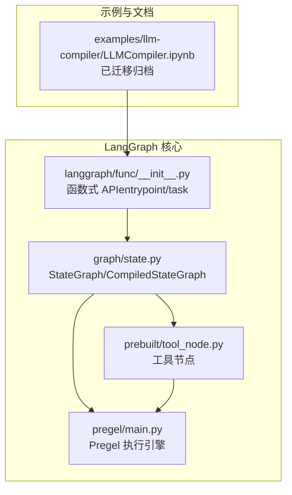
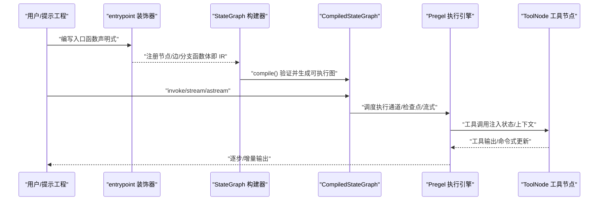
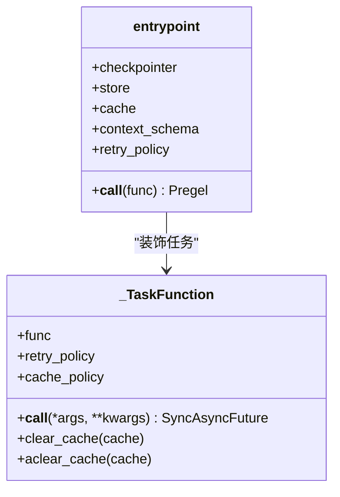
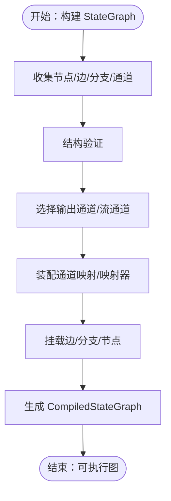
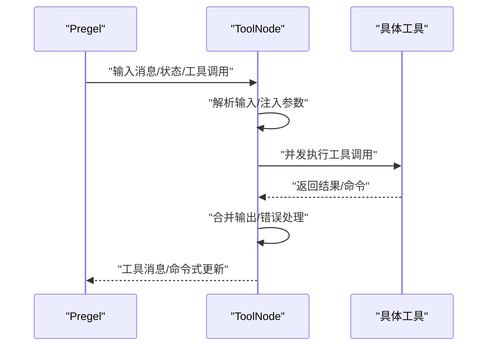
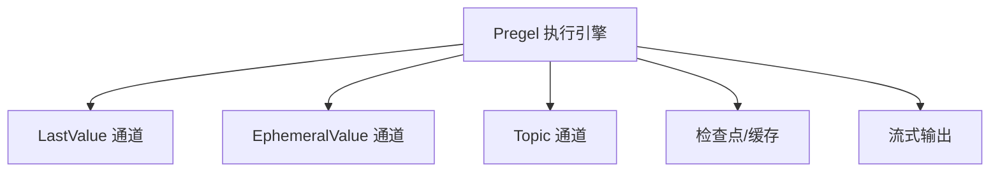
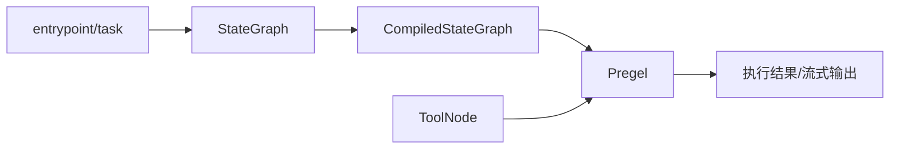

# LLM 编译器示例

<cite>
**本文引用的文件**
- [LLMCompiler.ipynb](file://examples/llm-compiler/LLMCompiler.ipynb)
- [README.md](file://README.md)
- [state.py](file://libs/langgraph/langgraph/graph/state.py)
- [__init__.py](file://libs/langgraph/langgraph/func/__init__.py)
- [tool_node.py](file://libs/prebuilt/langgraph/prebuilt/tool_node.py)
- [main.py](file://libs/langgraph/langgraph/pregel/main.py)
</cite>

## 目录
1. [简介](#简介)
2. [项目结构](#项目结构)
3. [核心组件](#核心组件)
4. [架构总览](#架构总览)
5. [详细组件分析](#详细组件分析)
6. [依赖关系分析](#依赖关系分析)
7. [性能考量](#性能考量)
8. [故障排查指南](#故障排查指南)
9. [结论](#结论)
10. [附录](#附录)

## 简介
本文件围绕“LLM 编译器示例”主题，系统化梳理如何将自然语言指令转化为可执行的 LangGraph 程序。文档覆盖从语法解析、语义分析、代码生成到优化策略的完整流程，并深入解释编译器的架构设计、中间表示（IR）以及目标代码生成机制。通过结合仓库中的函数式 API、状态图编译器、工具节点与 Pregel 执行引擎，展示面向 LLM 的原生编程新范式：以声明式方式描述工作流，自动编译为高效可执行图，并支持检查点、缓存、重试与人类中断等工程能力。

## 项目结构
- 示例与文档迁移说明：LLM 编译器示例已迁移至 LangChain 官方文档，当前仓库保留归档目录用于历史参考。
- 核心实现位于 LangGraph 库中，包括：
  - 函数式 API：提供入口点装饰器与任务封装，支持同步/异步调用与并行化。
  - 状态图编译器：将状态型图构建为可执行的 CompiledStateGraph。
  - 工具节点：统一处理工具调用、状态注入、错误处理与命令式控制流。
  - Pregel 执行引擎：负责调度、通道读写、检查点与流式输出。

**图表来源**
- [LLMCompiler.ipynb](file://examples/llm-compiler/LLMCompiler.ipynb)
- [__init__.py](file://libs/langgraph/langgraph/func/__init__.py)
- [state.py](file://libs/langgraph/langgraph/graph/state.py)
- [tool_node.py](file://libs/prebuilt/langgraph/prebuilt/tool_node.py)
- [main.py](file://libs/langgraph/langgraph/pregel/main.py)

**章节来源**
- [README.md](file://README.md)
- [LLMCompiler.ipynb](file://examples/llm-compiler/LLMCompiler.ipynb)

## 核心组件
- 函数式 API（entrypoint/task）
  - 提供声明式入口点与任务定义，支持同步/异步、重试策略、缓存策略与检查点集成。
  - 将函数签名与返回类型推断为输入/输出 JSON Schema，便于运行时校验与可视化。
- 状态图编译器（StateGraph/CompiledStateGraph）
  - 构建阶段：注册节点、边与分支，收集通道与管理值。
  - 编译阶段：验证图结构，组装通道映射，生成可执行图对象。
- 工具节点（ToolNode）
  - 统一解析消息中的工具调用，注入状态/存储/runtime 上下文，执行并合并结果。
  - 支持命令式更新（如发送到下游节点、父图控制），并提供灵活的错误处理策略。
- Pregel 执行引擎
  - 调度循环、通道读写、检查点恢复、流式输出与调试信息。

**章节来源**
- [__init__.py](file://libs/langgraph/langgraph/func/__init__.py)
- [state.py](file://libs/langgraph/langgraph/graph/state.py)
- [tool_node.py](file://libs/prebuilt/langgraph/prebuilt/tool_node.py)
- [main.py](file://libs/langgraph/langgraph/pregel/main.py)

## 架构总览
下图展示了从自然语言指令到可执行图的关键步骤：先由函数式 API 将高层意图转为节点与边的描述，再由状态图编译器生成可执行图，最终由 Pregel 引擎驱动执行；工具节点贯穿其中，作为外部系统与 LLM 的桥梁。

**图表来源**
- [__init__.py](file://libs/langgraph/langgraph/func/__init__.py)
- [state.py](file://libs/langgraph/langgraph/graph/state.py)
- [tool_node.py](file://libs/prebuilt/langgraph/prebuilt/tool_node.py)
- [main.py](file://libs/langgraph/langgraph/pregel/main.py)

## 详细组件分析

### 函数式 API（entrypoint/task）
- 设计要点
  - 入口点装饰器将函数包装为 Pregel 图，自动提取输入/输出类型并建立通道映射。
  - 任务装饰器支持同步/异步、重试与缓存，调用返回 Future 以支持并行化。
  - 支持 previous/context/store/runtime 注入，便于状态持久化与上下文访问。
- 关键行为
  - 输入类型推断与输出类型处理（含 entrypoint.final 解耦返回值与保存值）。
  - 严格序列化策略（当启用严格模式时）确保可检查性与可移植性。
- 适用场景
  - 将自然语言指令转化为函数式工作流，自动编译为可执行图，适合快速原型与工程化落地。

**图表来源**
- [__init__.py](file://libs/langgraph/langgraph/func/__init__.py)

**章节来源**
- [__init__.py](file://libs/langgraph/langgraph/func/__init__.py)

### 状态图编译器（StateGraph/CompiledStateGraph）
- 设计要点
  - 构建阶段：收集节点、边、分支、通道与管理值，形成图的静态描述。
  - 编译阶段：进行结构验证、输出通道选择、映射器装配与边/分支挂载。
  - 可执行图：继承自 Pregel，具备 invoke/stream/astream 等执行方法。
- 关键行为
  - 输出通道与流通道的选择逻辑，支持根通道与多通道场景。
  - 状态更新解析：将节点返回值映射到通道写入条目，支持命令式控制。
- 适用场景
  - 将复杂的状态机与条件分支转化为可执行图，便于调试与可视化。

**图表来源**
- [state.py](file://libs/langgraph/langgraph/graph/state.py)

**章节来源**
- [state.py](file://libs/langgraph/langgraph/graph/state.py)

### 工具节点（ToolNode）
- 设计要点
  - 输入解析：支持消息列表、字典状态与直接工具调用三种格式。
  - 参数注入：自动注入状态、存储与 runtime 上下文，避免模型暴露内部状态。
  - 并行执行：使用线程池并发执行多个工具调用，提升吞吐。
  - 错误处理：可配置多种策略，支持将异常转换为工具消息或直接抛出。
  - 命令式更新：支持返回 Command 对象以触发父图控制或发送到下游节点。
- 适用场景
  - 将 LLM 的工具调用请求安全地路由到外部系统，同时保持工作流的可控性与可观测性。

**图表来源**
- [tool_node.py](file://libs/prebuilt/langgraph/prebuilt/tool_node.py)

**章节来源**
- [tool_node.py](file://libs/prebuilt/langgraph/prebuilt/tool_node.py)

### Pregel 执行引擎
- 设计要点
  - 调度循环：按触发关系推进任务队列，读取通道状态，写入更新。
  - 通道抽象：LastValue、EphemeralValue、Topic 等通道类型支撑不同数据流。
  - 检查点与缓存：支持持久化状态快照与写入缓存，保障容错与复用。
  - 流式输出：支持增量输出与消息级流式事件，便于前端与调试。
- 适用场景
  - 驱动复杂工作流的执行，提供高吞吐、低延迟与强一致性的运行时环境。

**图表来源**
- [main.py](file://libs/langgraph/langgraph/pregel/main.py)

**章节来源**
- [main.py](file://libs/langgraph/langgraph/pregel/main.py)

## 依赖关系分析
- 函数式 API 依赖 Pregel 进行执行，通过入口点装饰器将函数体转换为节点与边的描述。
- 状态图编译器依赖通道与节点抽象，生成可执行图后复用 Pregel 的调度与流式能力。
- 工具节点作为通用执行单元，被状态图或入口点工作流复用，贯穿外部系统交互。
- 整体依赖链路清晰，模块内聚高、耦合低，便于扩展与维护。

**图表来源**
- [__init__.py](file://libs/langgraph/langgraph/func/__init__.py)
- [state.py](file://libs/langgraph/langgraph/graph/state.py)
- [tool_node.py](file://libs/prebuilt/langgraph/prebuilt/tool_node.py)
- [main.py](file://libs/langgraph/langgraph/pregel/main.py)

**章节来源**
- [__init__.py](file://libs/langgraph/langgraph/func/__init__.py)
- [state.py](file://libs/langgraph/langgraph/graph/state.py)
- [tool_node.py](file://libs/prebuilt/langgraph/prebuilt/tool_node.py)
- [main.py](file://libs/langgraph/langgraph/pregel/main.py)

## 性能考量
- 并行化
  - 任务装饰器返回 Future，便于并发执行；工具节点使用线程池并发调用工具，减少等待时间。
- 缓存与检查点
  - 合理设置缓存策略与检查点，避免重复计算与长流程中断后的重跑。
- 通道选择
  - 多通道输出时，优先选择根通道或精简通道集合，降低序列化与传输开销。
- 流式输出
  - 使用增量流式输出，缩短首包延迟，提升用户体验。

## 故障排查指南
- 入口点参数校验
  - 入口点函数必须至少有一个参数；若未满足，将抛出参数缺失错误。
- 返回值类型校验
  - 节点返回值需符合状态键更新规范；非法返回将触发更新错误。
- 工具调用错误
  - 工具调用失败时，可根据配置策略返回错误消息或直接抛出异常；必要时开启调试日志定位问题。
- 检查点与序列化
  - 当启用严格序列化时，输入/输出与上下文需可序列化；否则会触发序列化限制错误。

**章节来源**
- [__init__.py](file://libs/langgraph/langgraph/func/__init__.py)
- [state.py](file://libs/langgraph/langgraph/graph/state.py)
- [tool_node.py](file://libs/prebuilt/langgraph/prebuilt/tool_node.py)

## 结论
本示例展示了将自然语言指令转化为可执行 LangGraph 程序的完整路径：通过函数式 API 描述高层意图，借助状态图编译器生成可执行图，再由 Pregel 引擎驱动执行；工具节点作为 LLM 与外部系统的桥梁，提供安全、可控且可观测的执行能力。该范式既适合快速原型，也便于工程化部署与长期演进。

## 附录
- 示例迁移说明：LLM 编译器示例已迁移至 LangChain 官方文档，当前仓库保留归档目录以便追溯。
- 相关资源：LangGraph 概览、快速入门与 API 参考请参阅官方文档链接。

**章节来源**
- [README.md](file://README.md)
- [LLMCompiler.ipynb](file://examples/llm-compiler/LLMCompiler.ipynb)