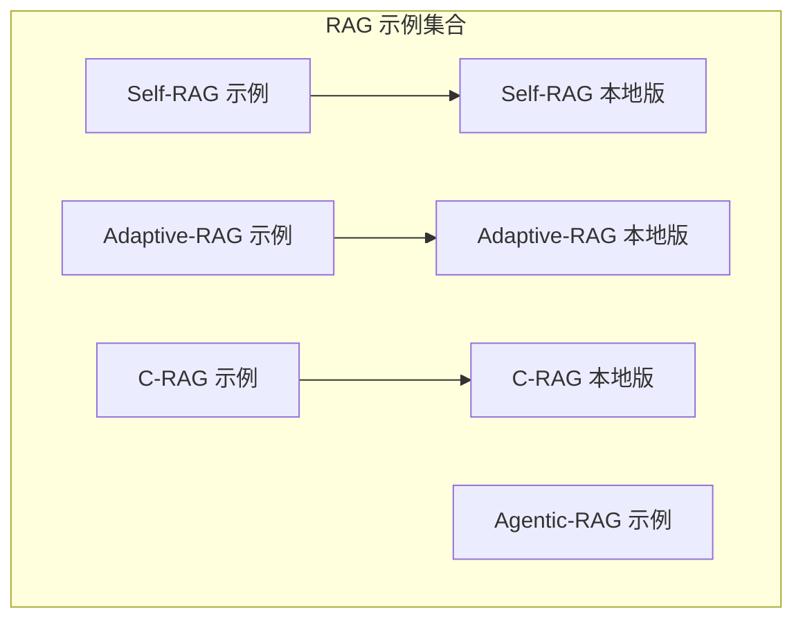
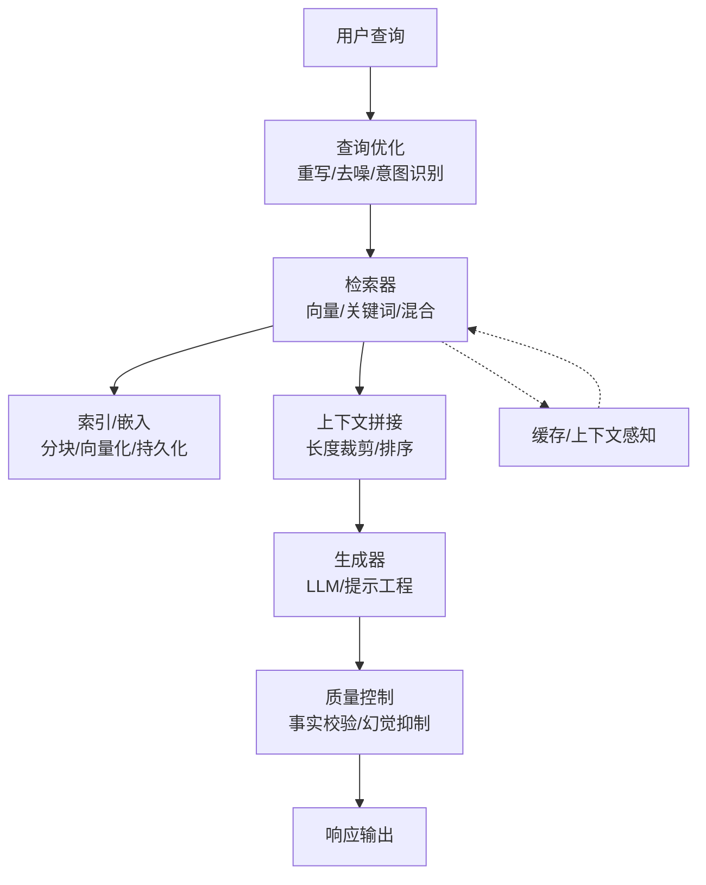
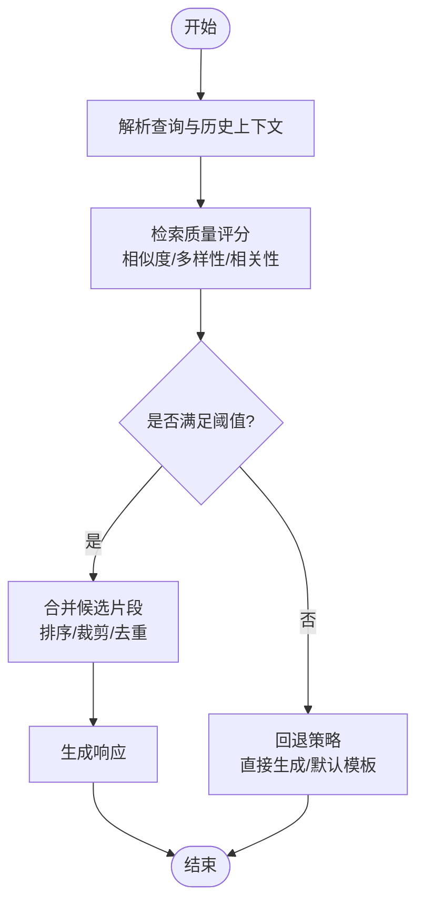
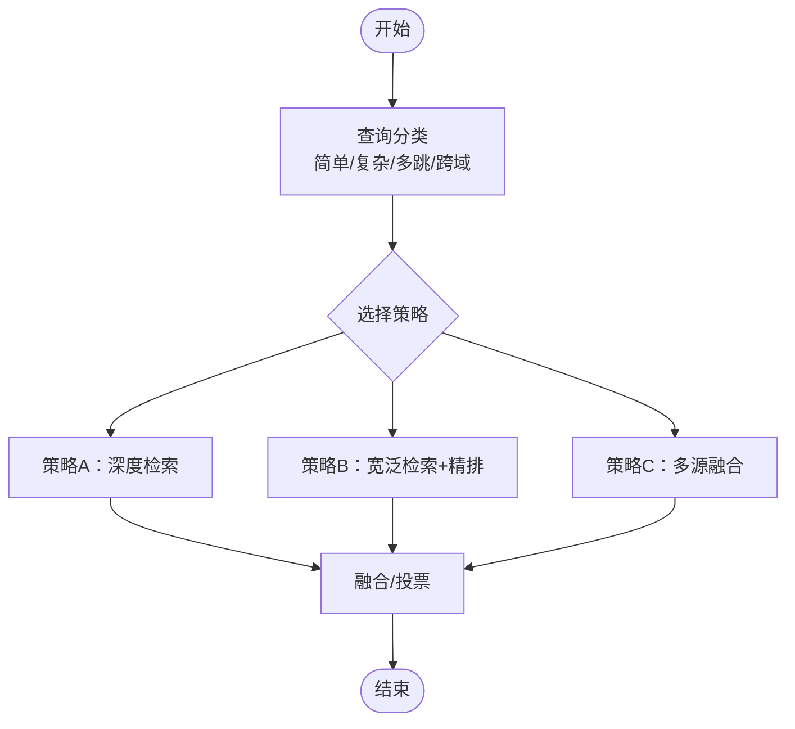
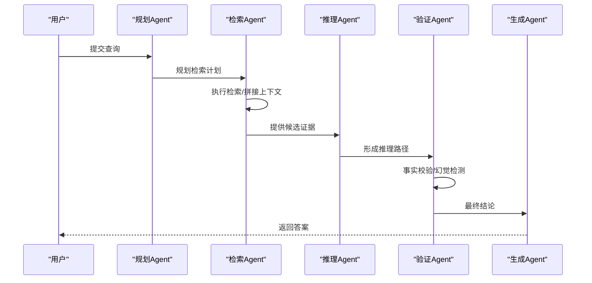
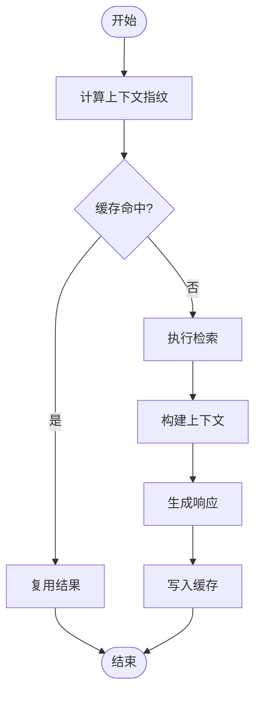
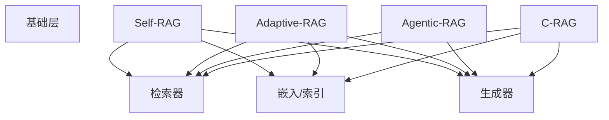

# RAG 应用示例

<cite>
**本文引用的文件**
- [langgraph_self_rag.ipynb](file://examples/rag/langgraph_self_rag.ipynb)
- [langgraph_adaptive_rag.ipynb](file://examples/rag/langgraph_adaptive_rag.ipynb)
- [langgraph_agentic_rag.ipynb](file://examples/rag/langgraph_agentic_rag.ipynb)
- [langgraph_crag.ipynb](file://examples/rag/langgraph_crag.ipynb)
- [langgraph_self_rag_local.ipynb](file://examples/rag/langgraph_self_rag_local.ipynb)
- [langgraph_adaptive_rag_local.ipynb](file://examples/rag/langgraph_adaptive_rag_local.ipynb)
- [langgraph_crag_local.ipynb](file://examples/rag/langgraph_crag_local.ipynb)
</cite>

## 目录
1. [简介](#简介)
2. [项目结构](#项目结构)
3. [核心组件](#核心组件)
4. [架构总览](#架构总览)
5. [详细组件分析](#详细组件分析)
6. [依赖关系分析](#依赖关系分析)
7. [性能考量](#性能考量)
8. [故障排查指南](#故障排查指南)
9. [结论](#结论)
10. [附录](#附录)

## 简介
本文件面向希望构建与部署 RAG（检索增强生成）系统的工程师与研究者，系统化梳理仓库中提供的 Self-RAG、Adaptive-RAG、Agentic-RAG 与 C-RAG 等变体示例，并围绕检索策略、文档索引、查询优化与生成质量控制等关键主题展开。同时给出本地部署与云端服务两种配置思路，以及可操作的性能基准与效果评估方法，帮助读者在不同场景下快速落地高质量的 RAG 应用。

## 项目结构
本仓库 examples/rag 目录提供了多套 RAG 示例，覆盖多种变体与部署形态：
- Self-RAG：强调“自检”式检索决策，结合检索质量与上下文相关性进行动态选择
- Adaptive-RAG：根据查询复杂度与领域特性，自适应地切换检索策略或融合策略
- Agentic-RAG：以智能体驱动的多步检索与推理流程，提升复杂问题的处理能力
- C-RAG：结合上下文感知与缓存机制，优化检索效率与一致性

此外，各变体均提供本地与云端两套示例，便于对比不同运行环境下的行为差异与性能表现。

**图表来源**
- [langgraph_self_rag.ipynb](file://examples/rag/langgraph_self_rag.ipynb)
- [langgraph_adaptive_rag.ipynb](file://examples/rag/langgraph_adaptive_rag.ipynb)
- [langgraph_agentic_rag.ipynb](file://examples/rag/langgraph_agentic_rag.ipynb)
- [langgraph_crag.ipynb](file://examples/rag/langgraph_crag.ipynb)
- [langgraph_self_rag_local.ipynb](file://examples/rag/langgraph_self_rag_local.ipynb)
- [langgraph_adaptive_rag_local.ipynb](file://examples/rag/langgraph_adaptive_rag_local.ipynb)
- [langgraph_crag_local.ipynb](file://examples/rag/langgraph_crag_local.ipynb)

**章节来源**
- [langgraph_self_rag.ipynb](file://examples/rag/langgraph_self_rag.ipynb)
- [langgraph_adaptive_rag.ipynb](file://examples/rag/langgraph_adaptive_rag.ipynb)
- [langgraph_agentic_rag.ipynb](file://examples/rag/langgraph_agentic_rag.ipynb)
- [langgraph_crag.ipynb](file://examples/rag/langgraph_crag.ipynb)
- [langgraph_self_rag_local.ipynb](file://examples/rag/langgraph_self_rag_local.ipynb)
- [langgraph_adaptive_rag_local.ipynb](file://examples/rag/langgraph_adaptive_rag_local.ipynb)
- [langgraph_crag_local.ipynb](file://examples/rag/langgraph_crag_local.ipynb)

## 核心组件
- 检索器（Retriever）
  - 基于向量数据库的语义检索与关键词混合检索
  - 支持多段落拼接与分块策略，兼顾召回与上下文长度约束
- 索引与嵌入（Index & Embedding）
  - 文档分块、向量化与持久化索引
  - 支持增量更新与版本管理
- 查询优化（Query Optimization）
  - 查询重写、去噪与意图识别，降低歧义与噪声影响
- 生成与质量控制（Generation & Quality Control）
  - 多轮对话上下文管理、事实校验与幻觉抑制
  - 可插拔的后处理与反馈回路
- 智能体编排（Agent Orchestration）
  - 多步检索、推理与决策链路，支持条件分支与重试机制
- 缓存与上下文感知（Caching & Context Awareness）
  - 命中率优化与上下文一致性保障

**章节来源**
- [langgraph_self_rag.ipynb](file://examples/rag/langgraph_self_rag.ipynb)
- [langgraph_adaptive_rag.ipynb](file://examples/rag/langgraph_adaptive_rag.ipynb)
- [langgraph_agentic_rag.ipynb](file://examples/rag/langgraph_agentic_rag.ipynb)
- [langgraph_crag.ipynb](file://examples/rag/langgraph_crag.ipynb)

## 架构总览
下图展示了 RAG 的通用数据流与关键模块交互关系，适用于 Self-RAG、Adaptive-RAG、Agentic-RAG 与 C-RAG 的统一视图。

[此图为概念性架构示意，不直接映射到具体源码文件，故无“图表来源”标注]

## 详细组件分析

### Self-RAG 组件分析
Self-RAG 的核心在于“自检式检索”，通过引入检索质量评分与上下文相关性判断，动态决定是否进行检索、如何拼接上下文以及是否回退到默认策略。

**图表来源**
- [langgraph_self_rag.ipynb](file://examples/rag/langgraph_self_rag.ipynb)

**章节来源**
- [langgraph_self_rag.ipynb](file://examples/rag/langgraph_self_rag.ipynb)

### Adaptive-RAG 组件分析
Adaptive-RAG 面向复杂查询，依据查询类型与领域特征，自动选择最优检索与融合策略；同时支持多策略并行与投票集成，提升鲁棒性。

**图表来源**
- [langgraph_adaptive_rag.ipynb](file://examples/rag/langgraph_adaptive_rag.ipynb)

**章节来源**
- [langgraph_adaptive_rag.ipynb](file://examples/rag/langgraph_adaptive_rag.ipynb)

### Agentic-RAG 组件分析
Agentic-RAG 将检索与生成过程分解为多个 Agent 步骤：规划、检索、推理、验证与生成，形成可解释、可调试的端到端流水线。

**图表来源**
- [langgraph_agentic_rag.ipynb](file://examples/rag/langgraph_agentic_rag.ipynb)

**章节来源**
- [langgraph_agentic_rag.ipynb](file://examples/rag/langgraph_agentic_rag.ipynb)

### C-RAG 组件分析
C-RAG 强调上下文感知与缓存复用，通过上下文指纹与命中率统计，减少重复检索与生成开销，提升整体吞吐。

**图表来源**
- [langgraph_crag.ipynb](file://examples/rag/langgraph_crag.ipynb)

**章节来源**
- [langgraph_crag.ipynb](file://examples/rag/langgraph_crag.ipynb)

### 本地部署与云端服务配置
- 本地部署（Local）
  - 使用本地向量数据库与模型服务，适合隐私敏感与离线场景
  - 示例文件提供本地路径与端口配置，便于快速启动
- 云端服务（Cloud）
  - 调用云厂商向量服务与托管大模型，具备弹性扩展与高可用
  - 示例文件展示 API 密钥、Endpoint 与资源配额的设置方式

**章节来源**
- [langgraph_self_rag_local.ipynb](file://examples/rag/langgraph_self_rag_local.ipynb)
- [langgraph_adaptive_rag_local.ipynb](file://examples/rag/langgraph_adaptive_rag_local.ipynb)
- [langgraph_crag_local.ipynb](file://examples/rag/langgraph_crag_local.ipynb)

## 依赖关系分析
RAG 各变体共享检索、索引与生成三大基础层，但在编排与策略上存在差异化：

[此图为概念性依赖示意，不直接映射到具体源码文件，故无“图表来源”标注]

**章节来源**
- [langgraph_self_rag.ipynb](file://examples/rag/langgraph_self_rag.ipynb)
- [langgraph_adaptive_rag.ipynb](file://examples/rag/langgraph_adaptive_rag.ipynb)
- [langgraph_agentic_rag.ipynb](file://examples/rag/langgraph_agentic_rag.ipynb)
- [langgraph_crag.ipynb](file://examples/rag/langgraph_crag.ipynb)

## 性能考量
- 检索性能
  - 向量维度与索引规模对延迟与吞吐有显著影响；建议采用分片索引与近似最近邻（ANN）加速
  - 混合检索时需平衡关键词与语义检索权重，避免过度召回导致上下文冗长
- 生成性能
  - 上下文裁剪与摘要策略可降低上下文长度；对长文档采用分段生成与拼接
  - 并行化与批处理可提升吞吐；注意并发度与资源配额的平衡
- 缓存与一致性
  - 缓存命中率与失效策略直接影响响应时间；建议基于上下文指纹与 TTL 策略
  - 对于动态知识库，需设计增量更新与版本回滚机制

[本节为通用性能指导，不直接分析具体文件，故无“章节来源”标注]

## 故障排查指南
- 检索无结果或结果相关性差
  - 检查嵌入质量与索引完整性；确认分块策略与查询预处理是否一致
- 生成内容不一致或幻觉
  - 引入外部知识核对与外部事实库；加强提示工程与后处理规则
- 响应延迟过高
  - 分析检索瓶颈与生成耗时；评估缓存命中率与批处理策略
- 本地与云端行为差异
  - 对比模型版本、参数与资源配额；检查网络与权限配置

[本节为通用排查建议，不直接分析具体文件，故无“章节来源”标注]

## 结论
本示例集合覆盖了从基础 Self-RAG 到高级 Agentic-RAG 与 C-RAG 的完整谱系，既可作为学习 RAG 的入门材料，也可作为生产级应用的参考实现。通过合理选择检索策略、优化索引与生成流程、完善质量控制与缓存机制，并结合本地与云端的灵活部署，可在不同业务场景下取得稳定且高效的检索增强生成效果。

[本节为总结性内容，不直接分析具体文件，故无“章节来源”标注]

## 附录
- 评估指标建议
  - 检索：准确率@k、召回率@k、平均倒数排名（MRR）、语义相似度
  - 生成：人工相关性评分、事实正确率、回答一致性、用户满意度
- 基准测试方法
  - 构建标准化数据集与查询集合；固定随机种子与模型参数；记录延迟、吞吐与质量指标
- 部署清单
  - 本地：最小化依赖、端口开放、日志与监控
  - 云端：密钥管理、资源配额、网络访问控制与审计日志

[本节为通用附录内容，不直接分析具体文件，故无“章节来源”标注]