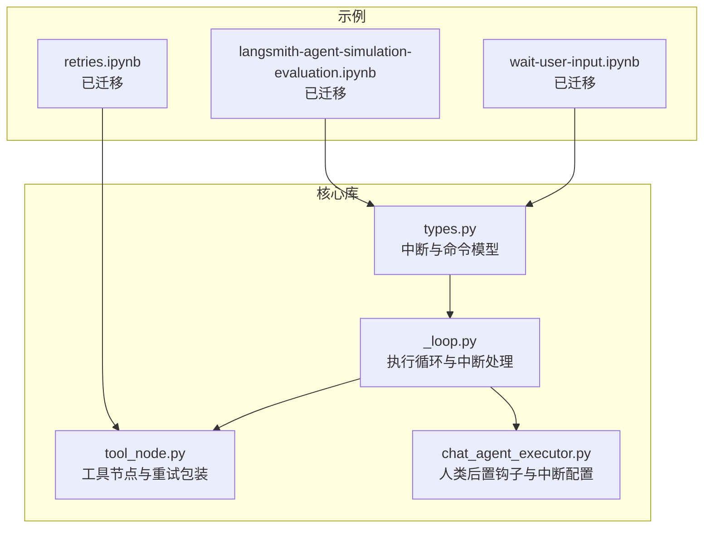
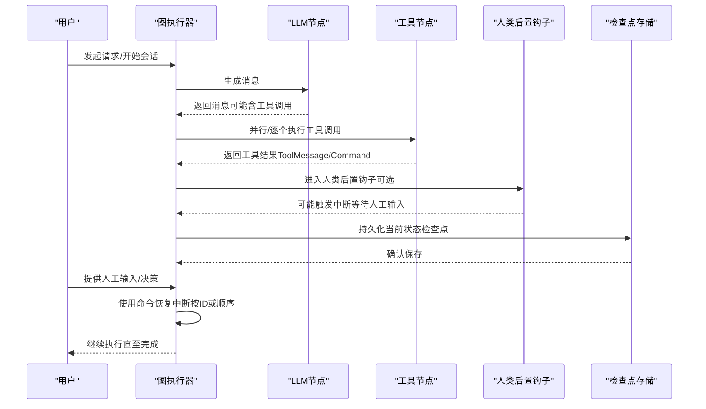
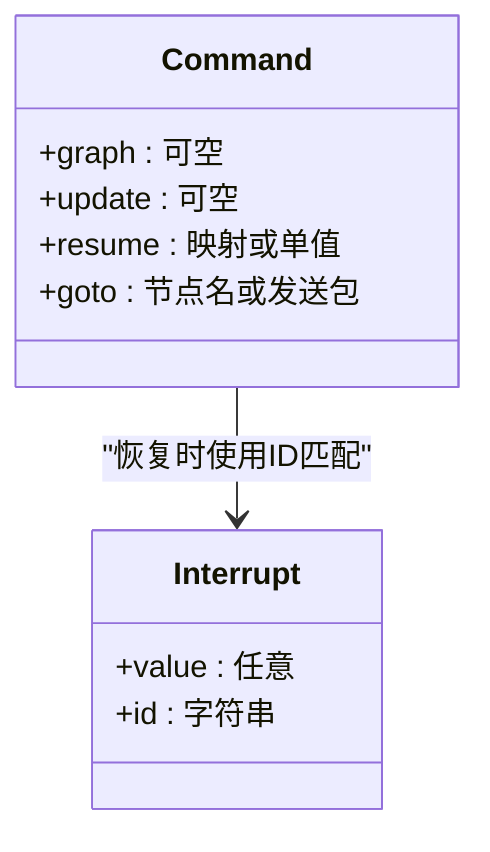
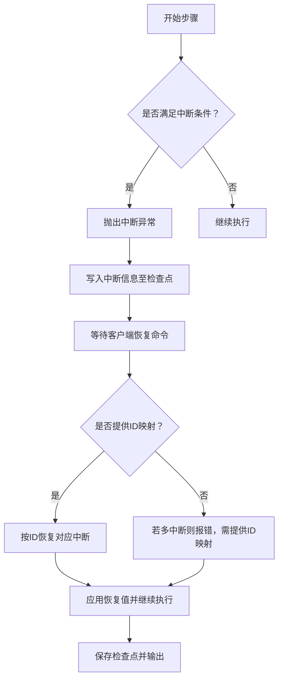
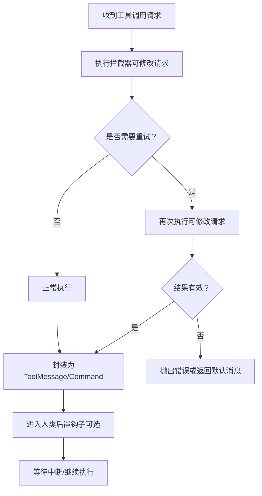
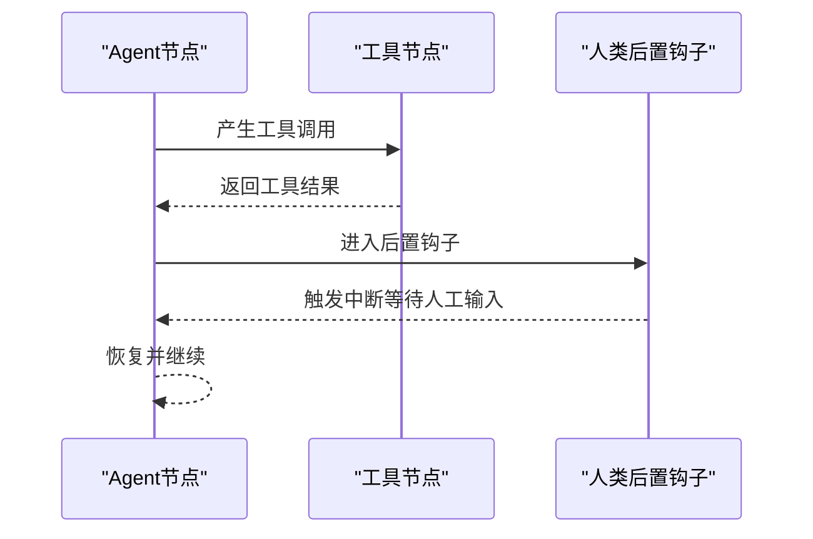
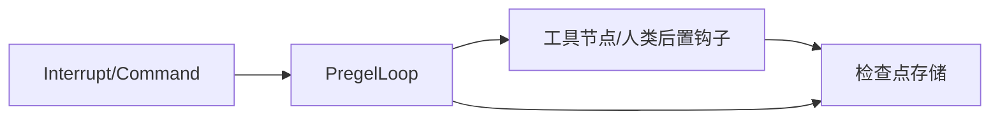

# 人机协作示例

<cite>
**本文引用的文件**
- [types.py](file://libs/langgraph/langgraph/types.py)
- [_loop.py](file://libs/langgraph/langgraph/pregel/_loop.py)
- [chat_agent_executor.py](file://libs/prebuilt/langgraph/prebuilt/chat_agent_executor.py)
- [tool_node.py](file://libs/prebuilt/langgraph/prebuilt/tool_node.py)
- [wait-user-input.ipynb](file://examples/human_in_the_loop/wait-user-input.ipynb)
- [langsmith-agent-simulation-evaluation.ipynb](file://examples/chatbot-simulation-evaluation/langsmith-agent-simulation-evaluation.ipynb)
- [retries.ipynb](file://examples/extraction/retries.ipynb)
</cite>

## 目录
1. [简介](#简介)
2. [项目结构](#项目结构)
3. [核心组件](#核心组件)
4. [架构总览](#架构总览)
5. [详细组件分析](#详细组件分析)
6. [依赖分析](#依赖分析)
7. [性能考虑](#性能考虑)
8. [故障排查指南](#故障排查指南)
9. [结论](#结论)
10. [附录](#附录)

## 简介
本示例文档围绕“人机协作系统”的关键能力，系统性介绍如何在 LangGraph 中实现人工干预、用户输入等待、重试机制与 LangSmith 监控集成，并覆盖中断处理、状态保存、用户交互设计与生产可靠性保障。文档以仓库中的核心实现为依据，结合示例 Notebook 的迁移说明，帮助读者快速构建稳定、可观测且可扩展的人机协作工作流。

## 项目结构
本仓库包含多个示例与核心库模块。与“人机协作”直接相关的关键位置如下：
- 核心类型与中断模型：libs/langgraph/langgraph/types.py
- 执行循环与中断逻辑：libs/langgraph/langgraph/pregel/_loop.py
- 预置工具节点与人类后置处理钩子：libs/prebuilt/langgraph/prebuilt/tool_node.py、libs/prebuilt/langgraph/prebuilt/chat_agent_executor.py
- 示例迁移说明（来自 examples 目录）：examples/human_in_the_loop/wait-user-input.ipynb、examples/chatbot-simulation-evaluation/langsmith-agent-simulation-evaluation.ipynb、examples/extraction/retries.ipynb

**图表来源**
- [types.py:705-794](file://libs/langgraph/langgraph/types.py#L705-L794)
- [_loop.py:520-571](file://libs/langgraph/langgraph/pregel/_loop.py#L520-L571)
- [tool_node.py:284-305](file://libs/prebuilt/langgraph/prebuilt/tool_node.py#L284-L305)
- [chat_agent_executor.py:425-430](file://libs/prebuilt/langgraph/prebuilt/chat_agent_executor.py#L425-L430)

**章节来源**
- [types.py:705-794](file://libs/langgraph/langgraph/types.py#L705-L794)
- [_loop.py:520-571](file://libs/langgraph/langgraph/pregel/_loop.py#L520-L571)
- [tool_node.py:284-305](file://libs/prebuilt/langgraph/prebuilt/tool_node.py#L284-L305)
- [chat_agent_executor.py:425-430](file://libs/prebuilt/langgraph/prebuilt/chat_agent_executor.py#L425-L430)
- [wait-user-input.ipynb:1-42](file://examples/human_in_the_loop/wait-user-input.ipynb#L1-L42)
- [langsmith-agent-simulation-evaluation.ipynb:1-42](file://examples/chatbot-simulation-evaluation/langsmith-agent-simulation-evaluation.ipynb#L1-L42)
- [retries.ipynb:1-42](file://examples/extraction/retries.ipynb#L1-L42)

## 核心组件
- 中断与命令模型
  - 中断值与唯一标识：用于在节点中暂停执行并将上下文暴露给客户端，支持多中断场景与按序恢复。
  - 命令对象：用于在有检查点的状态下更新状态、导航到指定节点或发送消息，以及恢复中断。
- 执行循环与中断处理
  - 在每步执行前后根据配置触发中断，抛出可恢复异常，使客户端可在合适时机注入人工输入或决策。
  - 支持“恢复”写入与多中断匹配，确保多中断场景下的精确恢复。
- 工具节点与重试包装
  - 提供工具调用拦截器，支持在单次或多轮尝试中修改请求、缓存结果、条件重试与错误处理。
  - 与人类后置钩子配合，实现“先LLM再人工确认”的工作流。
- 人类后置钩子与中断配置
  - 在“agent/tools”节点之后添加钩子，允许在输出返回前进行校验、补充或人工介入。
  - 通过中断配置在关键节点前/后暂停，便于用户确认或补充信息。

**章节来源**
- [types.py:444-500](file://libs/langgraph/langgraph/types.py#L444-L500)
- [types.py:652-703](file://libs/langgraph/langgraph/types.py#L652-L703)
- [_loop.py:520-571](file://libs/langgraph/langgraph/pregel/_loop.py#L520-L571)
- [_loop.py:688-691](file://libs/langgraph/langgraph/pregel/_loop.py#L688-L691)
- [tool_node.py:200-275](file://libs/prebuilt/langgraph/prebuilt/tool_node.py#L200-L275)
- [chat_agent_executor.py:425-430](file://libs/prebuilt/langgraph/prebuilt/chat_agent_executor.py#L425-L430)

## 架构总览
下图展示了从“人机协作”视角抽象出的端到端流程：LLM生成内容、工具调用、人类后置钩子、中断与恢复、状态保存与监控上报。

**图表来源**
- [types.py:705-794](file://libs/langgraph/langgraph/types.py#L705-L794)
- [_loop.py:520-571](file://libs/langgraph/langgraph/pregel/_loop.py#L520-L571)
- [tool_node.py:284-305](file://libs/prebuilt/langgraph/prebuilt/tool_node.py#L284-L305)
- [chat_agent_executor.py:425-430](file://libs/prebuilt/langgraph/prebuilt/chat_agent_executor.py#L425-L430)

## 详细组件分析

### 中断与命令模型
- 中断（Interrupt）
  - 作用：在节点内部暂停执行，向客户端暴露中断值；后续通过命令恢复。
  - 关键属性：值与唯一ID；支持从命名空间派生ID或显式指定。
- 命令（Command）
  - 作用：在存在检查点时更新状态、导航到节点或发送消息，并可携带恢复值。
  - 恢复语义：可按ID映射恢复，或按顺序恢复；多中断时必须明确ID。

**图表来源**
- [types.py:444-500](file://libs/langgraph/langgraph/types.py#L444-L500)
- [types.py:652-703](file://libs/langgraph/langgraph/types.py#L652-L703)

**章节来源**
- [types.py:444-500](file://libs/langgraph/langgraph/types.py#L444-L500)
- [types.py:652-703](file://libs/langgraph/langgraph/types.py#L652-L703)

### 执行循环与中断处理
- 中断触发点
  - 在“执行前/执行后”根据配置决定是否抛出中断异常，使客户端有机会注入人工输入。
- 多中断匹配与恢复
  - 通过“待恢复任务集合”与“中断ID集合”匹配，确保多中断场景下精准恢复。
- 恢复命令解析
  - 将命令映射为写入，写入检查点；若为多中断且未提供ID映射，则报错提示。

**图表来源**
- [_loop.py:520-571](file://libs/langgraph/langgraph/pregel/_loop.py#L520-L571)
- [_loop.py:688-691](file://libs/langgraph/langgraph/pregel/_loop.py#L688-L691)

**章节来源**
- [_loop.py:520-571](file://libs/langgraph/langgraph/pregel/_loop.py#L520-L571)
- [_loop.py:688-691](file://libs/langgraph/langgraph/pregel/_loop.py#L688-L691)

### 工具节点与重试包装
- 工具调用拦截器
  - 同步/异步拦截器接收“请求+执行回调”，可在多次尝试中修改请求参数、缓存结果、条件重试。
- 错误处理策略
  - 默认对“工具调用错误”友好反馈，其他错误可选择抛出或自定义模板。
- 与人类后置钩子协同
  - 在工具执行完成后进入钩子阶段，可进行二次校验或触发中断等待人工确认。

**图表来源**
- [tool_node.py:200-275](file://libs/prebuilt/langgraph/prebuilt/tool_node.py#L200-L275)
- [tool_node.py:392-439](file://libs/prebuilt/langgraph/prebuilt/tool_node.py#L392-L439)

**章节来源**
- [tool_node.py:200-275](file://libs/prebuilt/langgraph/prebuilt/tool_node.py#L200-L275)
- [tool_node.py:392-439](file://libs/prebuilt/langgraph/prebuilt/tool_node.py#L392-L439)

### 人类后置钩子与中断配置
- 后置钩子
  - 在“agent/tools”节点之后添加，用于实施人类在环控制、守卫规则、验证与后处理。
- 中断配置
  - 可在“agent”或“tools”节点前/后设置中断，以便在采取行动前进行用户确认或在输出返回前进行额外处理。

**图表来源**
- [chat_agent_executor.py:425-430](file://libs/prebuilt/langgraph/prebuilt/chat_agent_executor.py#L425-L430)

**章节来源**
- [chat_agent_executor.py:425-430](file://libs/prebuilt/langgraph/prebuilt/chat_agent_executor.py#L425-L430)

### LangSmith 集成与监控
- 示例迁移说明
  - 与 LangSmith 相关的示例 Notebook 已迁移至集中文档，本仓库保留归档说明。
- 实践建议
  - 在图执行器上启用运行ID与检查点，结合流模式输出事件，将关键节点与检查点事件上报至 LangSmith。
  - 利用调试流模式（tasks/checkpoints/debug）捕获任务生命周期与状态快照，便于回放与分析。

**章节来源**
- [langsmith-agent-simulation-evaluation.ipynb:1-42](file://examples/chatbot-simulation-evaluation/langsmith-agent-simulation-evaluation.ipynb#L1-L42)

### 重试机制
- 工具层重试
  - 通过拦截器实现多轮尝试、参数修正与条件重试，提升工具调用稳定性。
- 执行层重试策略
  - 类型中提供重试策略配置（初始间隔、退避因子、最大间隔、最大次数、抖动与异常过滤），可用于节点级重试。

**章节来源**
- [tool_node.py:200-275](file://libs/prebuilt/langgraph/prebuilt/tool_node.py#L200-L275)
- [types.py:404-424](file://libs/langgraph/langgraph/types.py#L404-L424)

## 依赖分析
- 组件耦合
  - 中断与命令模型是执行循环与人类后置钩子之间的契约；工具节点通过拦截器与执行循环解耦。
- 外部依赖
  - 检查点存储（持久化）、流协议（事件输出）、运行时上下文（配置、线程ID、任务ID）贯穿整个协作链路。

**图表来源**
- [types.py:444-500](file://libs/langgraph/langgraph/types.py#L444-L500)
- [_loop.py:520-571](file://libs/langgraph/langgraph/pregel/_loop.py#L520-L571)
- [tool_node.py:284-305](file://libs/prebuilt/langgraph/prebuilt/tool_node.py#L284-L305)

**章节来源**
- [types.py:444-500](file://libs/langgraph/langgraph/types.py#L444-L500)
- [_loop.py:520-571](file://libs/langgraph/langgraph/pregel/_loop.py#L520-L571)
- [tool_node.py:284-305](file://libs/prebuilt/langgraph/prebuilt/tool_node.py#L284-L305)

## 性能考虑
- 流式输出与事件粒度
  - 使用“values/updates/messages/tasks/checkpoints/debug”等流模式，平衡实时性与开销。
- 缓存与去重
  - 对工具调用结果进行缓存与去重，减少重复计算与外部调用。
- 并行工具执行
  - 工具节点支持并行分发工具调用，缩短整体延迟。
- 检查点持久化策略
  - 根据“durability”策略选择同步/异步/退出时持久化，权衡一致性与吞吐。

[本节为通用指导，无需特定文件引用]

## 故障排查指南
- 多中断恢复报错
  - 现象：多中断场景下直接恢复未提供ID映射导致失败。
  - 处理：为每个中断提供ID映射，或在客户端按顺序恢复。
- 空输入错误
  - 现象：无输入或无效命令导致执行失败。
  - 处理：确保传入有效输入或命令；必要时使用恢复命令携带值。
- 工具调用错误
  - 现象：参数校验失败或工具执行异常。
  - 处理：利用拦截器的错误处理策略，返回友好消息或抛出异常；必要时在人类后置钩子中进行二次校验。

**章节来源**
- [_loop.py:688-691](file://libs/langgraph/langgraph/pregel/_loop.py#L688-L691)
- [_loop.py:759-760](file://libs/langgraph/langgraph/pregel/_loop.py#L759-L760)
- [tool_node.py:392-439](file://libs/prebuilt/langgraph/prebuilt/tool_node.py#L392-L439)

## 结论
通过中断与命令模型、执行循环的中断触发、工具节点的重试拦截与人类后置钩子，LangGraph 提供了完整的人机协作能力。结合检查点持久化与流式事件输出，可实现可靠的生产级工作流：在关键节点暂停以等待人工输入，在工具调用失败时自动重试或由人工介入，在完成时保存状态并持续监控。示例 Notebook 的迁移说明表明，LangSmith 等监控能力可通过标准接口无缝接入现有工作流。

[本节为总结，无需特定文件引用]

## 附录
- 示例迁移说明
  - 与“人机协作”相关的示例 Notebook 已迁移至集中文档，本仓库仅保留归档说明。
- 最佳实践清单
  - 必须启用检查点以支持中断与恢复。
  - 在关键节点配置中断（before/after），并在人类后置钩子中实施守卫与验证。
  - 为工具调用提供重试拦截器，确保稳健性。
  - 使用调试流模式捕获任务与检查点事件，便于回放与分析。
  - 在生产环境中合理设置重试策略与缓存策略，平衡可靠性与性能。

**章节来源**
- [wait-user-input.ipynb:1-42](file://examples/human_in_the_loop/wait-user-input.ipynb#L1-L42)
- [langsmith-agent-simulation-evaluation.ipynb:1-42](file://examples/chatbot-simulation-evaluation/langsmith-agent-simulation-evaluation.ipynb#L1-L42)
- [retries.ipynb:1-42](file://examples/extraction/retries.ipynb#L1-L42)