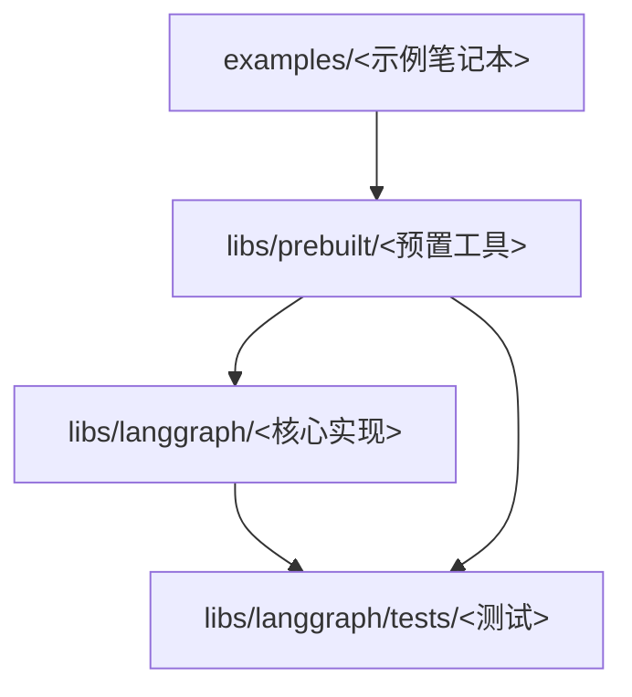
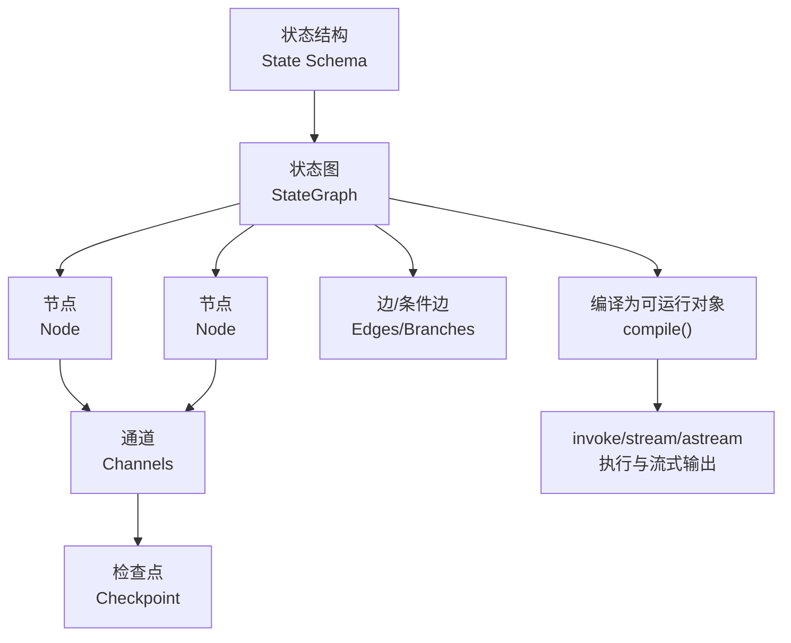
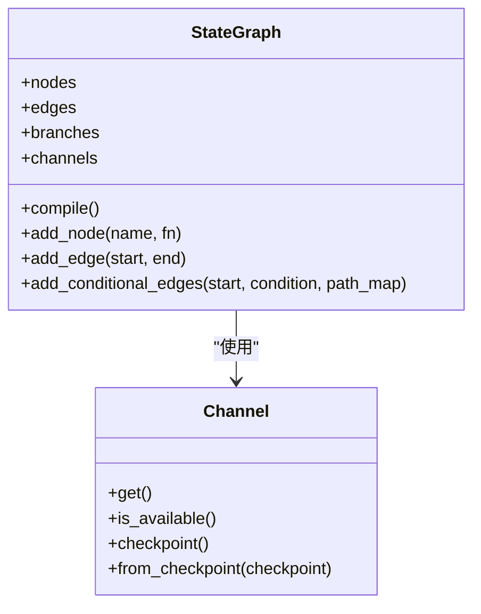
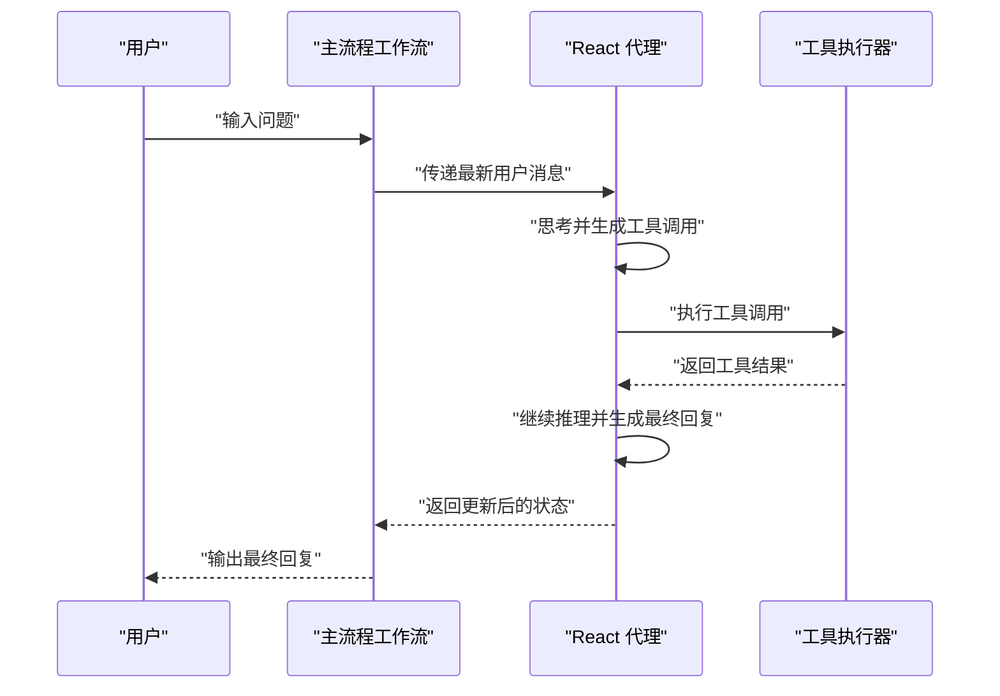
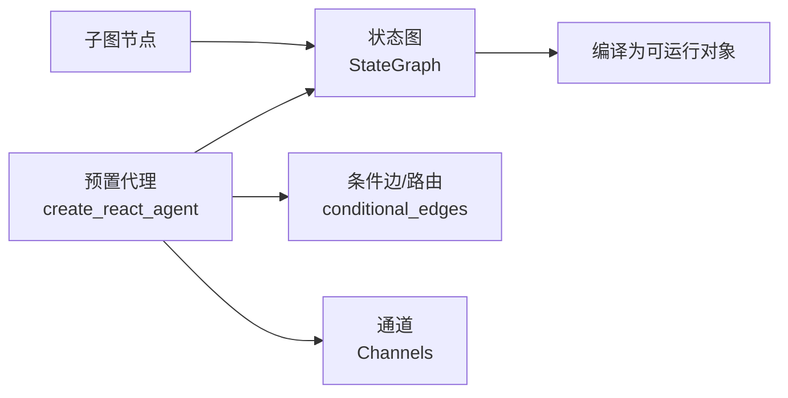

# 基础示例

<cite>
**本文引用的文件**
- [README.md](file://README.md)
- [examples/react-agent-from-scratch.ipynb](file://examples/react-agent-from-scratch.ipynb)
- [examples/react-agent-structured-output.ipynb](file://examples/react-agent-structured-output.ipynb)
- [examples/tool-calling.ipynb](file://examples/tool-calling.ipynb)
- [examples/subgraph.ipynb](file://examples/subgraph.ipynb)
- [libs/prebuilt/langgraph/prebuilt/chat_agent_executor.py](file://libs/prebuilt/langgraph/prebuilt/chat_agent_executor.py)
- [libs/prebuilt/tests/test_react_agent.py](file://libs/prebuilt/tests/test_react_agent.py)
- [libs/langgraph/langgraph/graph/state.py](file://libs/langgraph/langgraph/graph/state.py)
- [libs/langgraph/langgraph/channels/base.py](file://libs/langgraph/langgraph/channels/base.py)
- [libs/langgraph/tests/test_pregel.py](file://libs/langgraph/tests/test_pregel.py)
</cite>

## 目录
1. [简介](#简介)
2. [项目结构](#项目结构)
3. [核心组件](#核心组件)
4. [架构总览](#架构总览)
5. [详细组件分析](#详细组件分析)
6. [依赖分析](#依赖分析)
7. [性能考虑](#性能考虑)
8. [故障排查指南](#故障排查指南)
9. [结论](#结论)
10. [附录](#附录)

## 简介
本文件面向初学者，系统讲解 LangGraph 的基础示例与核心概念，包括：从零开始构建 React 风格代理、结构化输出代理、工具调用以及子图（Subgraph）等。文档以循序渐进的方式，结合仓库中的示例与测试代码，帮助读者理解基础 API 的使用方法、状态管理、节点连接与通道系统的工作方式。

LangGraph 是一个用于构建“有状态、可持久化、可中断”的长时运行智能体的低层编排框架。它提供状态图（State Graph）、通道（Channels）、检查点（Checkpoint）等能力，使开发者可以以声明式方式定义状态流转与节点行为，并在生产环境中可靠地执行与调试。

章节来源
- [README.md:1-83](file://README.md#L1-L83)

## 项目结构
本仓库包含以下与本指南密切相关的部分：
- examples：官方示例笔记本，演示从零构建 React 代理、结构化输出、工具调用与子图等主题（当前示例已迁移至集中文档，目录保留归档用途）。
- libs/langgraph：LangGraph 核心实现，包含状态图、通道、检查点等基础设施。
- libs/prebuilt：预置工具集，如 React 风格代理、工具调用执行器等。
- libs/langgraph/tests：大量端到端与单元测试，展示如何使用 API、流式输出、条件分支、子图等。

章节来源
- [examples/react-agent-from-scratch.ipynb:1-41](file://examples/react-agent-from-scratch.ipynb#L1-L41)
- [examples/react-agent-structured-output.ipynb:1-41](file://examples/react-agent-structured-output.ipynb#L1-L41)
- [examples/tool-calling.ipynb:1-41](file://examples/tool-calling.ipynb#L1-L41)
- [examples/subgraph.ipynb:1-41](file://examples/subgraph.ipynb#L1-L41)

## 核心组件
- 状态图（StateGraph）：定义节点与边，描述状态在不同节点之间的流转。支持条件边、等待边、起止节点等。
- 节点（Node）：函数或可运行对象，接收当前状态并返回更新后的状态键值对。
- 边（Edge）：连接节点，可为简单边或条件边；条件边根据状态判断下一步节点。
- 通道（Channels）：状态图内部的数据通道抽象，负责读写状态、合并消息、检查点等。
- 预置代理（Prebuilt）：如 React 风格代理、工具调用执行器等，封装常见模式，便于快速上手。

章节来源
- [libs/langgraph/langgraph/graph/state.py:236-258](file://libs/langgraph/langgraph/graph/state.py#L236-L258)
- [libs/langgraph/langgraph/channels/base.py:49-87](file://libs/langgraph/langgraph/channels/base.py#L49-L87)
- [libs/prebuilt/langgraph/prebuilt/chat_agent_executor.py:964-1002](file://libs/prebuilt/langgraph/prebuilt/chat_agent_executor.py#L964-L1002)

## 架构总览
LangGraph 的执行流程通常如下：
- 定义状态结构（State Schema），声明需要跟踪的状态键（如 messages）。
- 使用 StateGraph 构建图：添加节点、设置边（含条件边）、指定 START/END。
- 编译得到可运行对象（Runnable），支持同步/异步调用与流式输出。
- 在运行过程中，通道负责读取/写入状态，必要时进行检查点持久化与恢复。

图表来源
- [libs/langgraph/langgraph/graph/state.py:236-258](file://libs/langgraph/langgraph/graph/state.py#L236-L258)
- [libs/langgraph/langgraph/channels/base.py:49-87](file://libs/langgraph/langgraph/channels/base.py#L49-L87)

## 详细组件分析

### 从零开始构建 React 代理（从示例笔记本迁移）
- 背景：examples 目录下的“从零开始构建 React 代理”示例已被迁移至集中文档，当前目录仅保留归档用途。
- 实践要点（基于预置代理与测试用例总结）：
  - 使用预置的 React 风格代理工厂创建代理，传入模型、工具与提示词。
  - 通过工具调用链路实现“思考-行动-观察-再思考”，最终生成自然语言回复。
  - 支持结构化响应格式（如 Pydantic 模型），便于下游解析与一致性校验。
  - 可作为子图节点嵌入更复杂的主流程中，实现多级协作。

章节来源
- [examples/react-agent-from-scratch.ipynb:1-41](file://examples/react-agent-from-scratch.ipynb#L1-L41)
- [libs/prebuilt/tests/test_react_agent.py:502-523](file://libs/prebuilt/tests/test_react_agent.py#L502-L523)
- [libs/prebuilt/tests/test_react_agent.py:1253-1286](file://libs/prebuilt/tests/test_react_agent.py#L1253-L1286)
- [libs/prebuilt/tests/test_react_agent.py:1327-1391](file://libs/prebuilt/tests/test_react_agent.py#L1327-L1391)

### 结构化输出代理
- 目标：让代理输出符合特定结构（如 Pydantic 模型）的结果，便于下游处理。
- 关键点：
  - 在创建代理时指定 response_format，使模型在最终回复中遵循该结构。
  - 测试用例验证了结构化响应被正确填充到状态中，并与对话历史共同构成完整输出。
  - 适用于需要稳定数据形态的场景（如抽取、分类、摘要等）。

章节来源
- [libs/prebuilt/tests/test_react_agent.py:502-523](file://libs/prebuilt/tests/test_react_agent.py#L502-L523)

### 工具调用
- 目标：让代理能够选择并调用外部工具，完成信息收集与推理。
- 关键点：
  - 工具注册与绑定：确保模型绑定的工具集合与传入工具列表一致且一一对应。
  - 工具调用链路：代理生成工具调用 → 执行工具 → 返回工具结果 → 代理继续推理。
  - 条件边路由：根据工具调用结果决定是否直接结束或回到代理继续思考。
  - 流式输出：支持在主流程中开启子图流式，按消息粒度输出中间结果。

章节来源
- [libs/prebuilt/langgraph/prebuilt/chat_agent_executor.py:964-1002](file://libs/prebuilt/langgraph/prebuilt/chat_agent_executor.py#L964-L1002)
- [libs/prebuilt/tests/test_react_agent.py:1327-1391](file://libs/prebuilt/tests/test_react_agent.py#L1327-L1391)

### 子图（Subgraph）
- 目标：将复杂流程拆分为多个子图，主图调度子图节点，实现模块化与复用。
- 关键点：
  - 将一个已编译的子图作为节点接入主图，传入状态并接收更新后的状态。
  - 支持在主图中对子图进行流式输出控制（subgraphs 参数），灵活选择是否透出子图事件。
  - 测试用例展示了将 React 代理作为子图节点运行，并收集其流式输出拼接为最终回复。

章节来源
- [libs/prebuilt/tests/test_react_agent.py:1253-1286](file://libs/prebuilt/tests/test_react_agent.py#L1253-L1286)
- [libs/prebuilt/tests/test_react_agent.py:1327-1391](file://libs/prebuilt/tests/test_react_agent.py#L1327-L1391)

### 状态管理与通道系统
- 状态结构（State Schema）：定义代理需要跟踪的状态键（如 messages），并可扩展自定义字段。
- 通道（Channels）：负责状态的读取、写入、合并与检查点序列化；提供 is_available、checkpoint 等接口。
- 边与条件边：定义节点间的流转规则，支持等待边与条件分支，实现复杂的控制流。

图表来源
- [libs/langgraph/langgraph/graph/state.py:236-258](file://libs/langgraph/langgraph/graph/state.py#L236-L258)
- [libs/langgraph/langgraph/channels/base.py:49-87](file://libs/langgraph/langgraph/channels/base.py#L49-L87)

章节来源
- [libs/langgraph/langgraph/graph/state.py:236-258](file://libs/langgraph/langgraph/graph/state.py#L236-L258)
- [libs/langgraph/langgraph/channels/base.py:49-87](file://libs/langgraph/langgraph/channels/base.py#L49-L87)

### API 使用流程（以工具调用为例）

图表来源
- [libs/prebuilt/langgraph/prebuilt/chat_agent_executor.py:964-1002](file://libs/prebuilt/langgraph/prebuilt/chat_agent_executor.py#L964-L1002)
- [libs/prebuilt/tests/test_react_agent.py:1327-1391](file://libs/prebuilt/tests/test_react_agent.py#L1327-L1391)

## 依赖分析
- 预置代理依赖状态图与通道系统，通过编译后形成可运行对象。
- 工具调用执行器内部使用条件边与路由逻辑，将工具调用结果与代理节点解耦。
- 子图模式通过将已编译子图作为节点接入主图，实现模块化与复用。

图表来源
- [libs/prebuilt/langgraph/prebuilt/chat_agent_executor.py:964-1002](file://libs/prebuilt/langgraph/prebuilt/chat_agent_executor.py#L964-L1002)
- [libs/langgraph/langgraph/graph/state.py:236-258](file://libs/langgraph/langgraph/graph/state.py#L236-L258)

章节来源
- [libs/prebuilt/langgraph/prebuilt/chat_agent_executor.py:964-1002](file://libs/prebuilt/langgraph/prebuilt/chat_agent_executor.py#L964-L1002)
- [libs/langgraph/langgraph/graph/state.py:236-258](file://libs/langgraph/langgraph/graph/state.py#L236-L258)

## 性能考虑
- 流式输出：在主图中启用子图流式（subgraphs=True/False）可减少事件风暴，按需控制事件粒度。
- 检查点与恢复：在长时间运行的任务中，合理使用检查点可避免重复计算，提升鲁棒性。
- 工具调用批量化：当存在多个工具调用时，尽量合并为一次调用或并行执行，降低往返延迟。
- 状态精简：仅保留必要的状态键，避免冗余数据影响内存与序列化开销。

## 故障排查指南
- 工具不匹配错误：当模型绑定的工具集合与传入工具列表不一致或数量不匹配时会抛出异常。请确保两者完全一致。
- 空通道错误：通道未初始化或为空时，读取会抛出空通道异常。请在节点中先写入状态，再读取。
- 条件边未命中：若条件函数未覆盖所有可能路径，可能导致无法前进。请补充默认分支或完善条件逻辑。
- 子图流式事件为空：当 subgraphs=False 或流式模式配置不当，可能导致事件为空。请检查参数与流式粒度。

章节来源
- [libs/prebuilt/tests/test_react_agent.py:362-368](file://libs/prebuilt/tests/test_react_agent.py#L362-L368)
- [libs/langgraph/langgraph/channels/base.py:49-87](file://libs/langgraph/langgraph/channels/base.py#L49-L87)
- [libs/prebuilt/tests/test_react_agent.py:1386-1409](file://libs/prebuilt/tests/test_react_agent.py#L1386-L1409)

## 结论
通过本指南，初学者可以掌握 LangGraph 的核心概念与基础 API 使用方法：以状态图为骨架，以节点为执行单元，以通道为状态载体，以条件边为控制流，配合预置代理与子图模式，即可快速搭建从零开始的 React 代理、结构化输出代理、工具调用与多级子图协作的智能体系统。建议结合测试用例与官方文档进一步深入实践。

## 附录
- 进一步阅读与示例：参见 examples 目录下各示例笔记本（当前已迁移至集中文档），以及 libs/langgraph/tests 中的大量端到端测试，均可作为实践参考。
- 快速开始：安装 LangGraph 后，可直接使用预置代理工厂创建代理，并通过编译后的可运行对象进行同步/异步调用与流式输出。

章节来源
- [README.md:26-30](file://README.md#L26-L30)
- [examples/react-agent-from-scratch.ipynb:1-41](file://examples/react-agent-from-scratch.ipynb#L1-L41)
- [examples/react-agent-structured-output.ipynb:1-41](file://examples/react-agent-structured-output.ipynb#L1-L41)
- [examples/tool-calling.ipynb:1-41](file://examples/tool-calling.ipynb#L1-L41)
- [examples/subgraph.ipynb:1-41](file://examples/subgraph.ipynb#L1-L41)