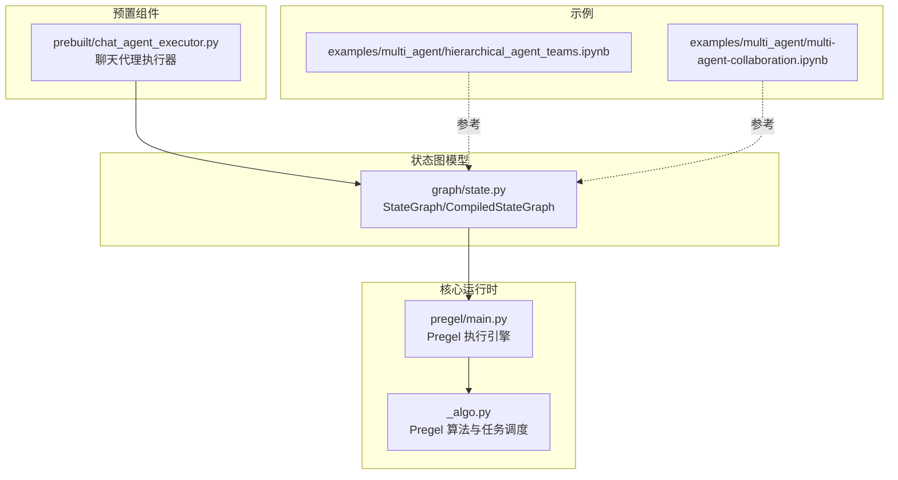
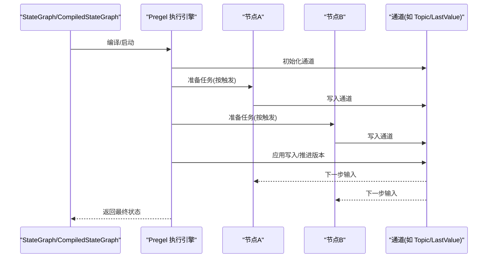
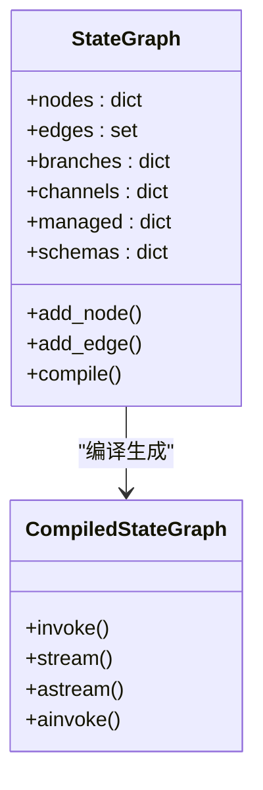
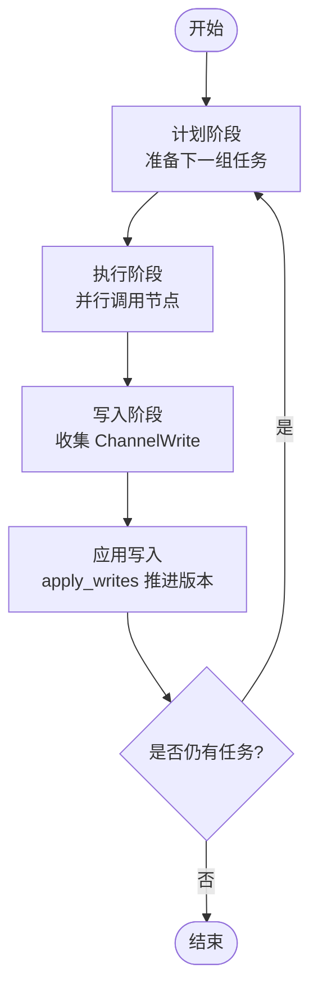
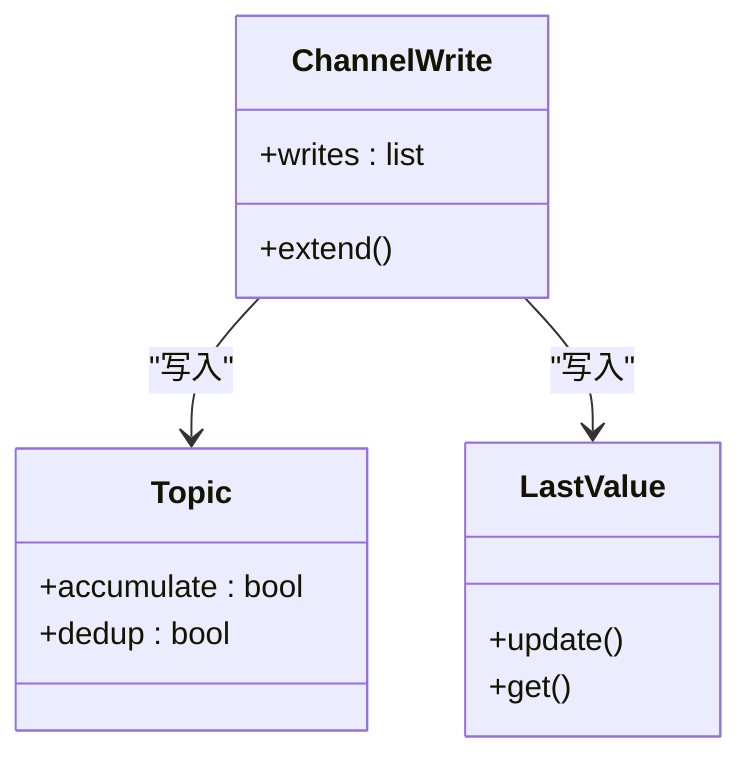
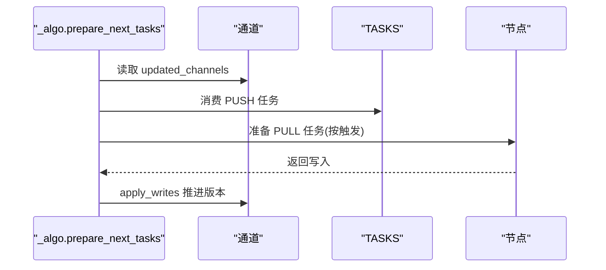
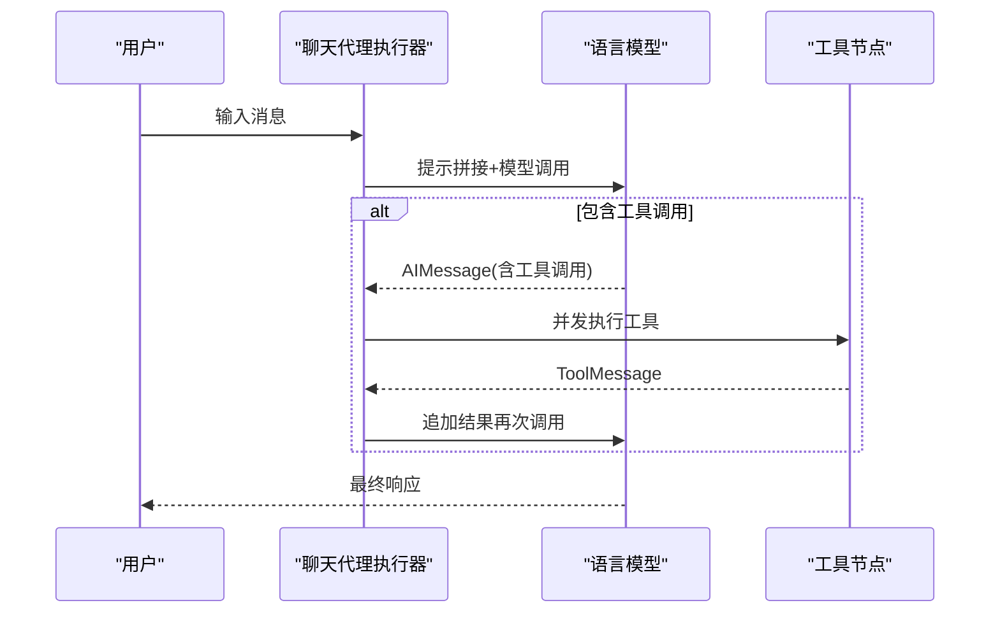
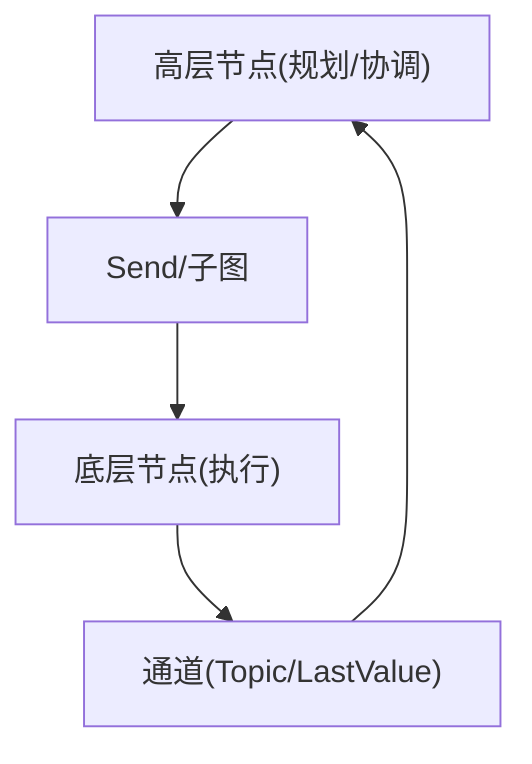
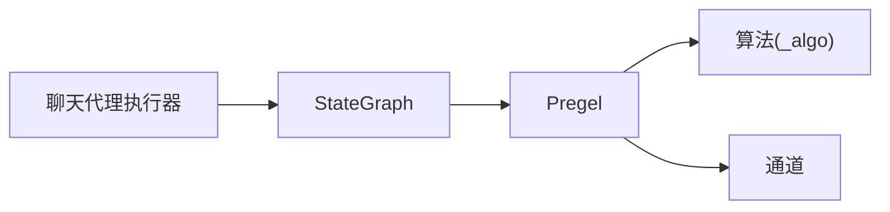

# 多代理协作示例

<cite>
**本文档引用的文件**
- [state.py](file://libs/langgraph/langgraph/graph/state.py)
- [main.py](file://libs/langgraph/langgraph/pregel/main.py)
- [_algo.py](file://libs/langgraph/langgraph/pregel/_algo.py)
- [chat_agent_executor.py](file://libs/prebuilt/langgraph/prebuilt/chat_agent_executor.py)
- [hierarchical_agent_teams.ipynb](file://examples/multi_agent/hierarchical_agent_teams.ipynb)
- [multi-agent-collaboration.ipynb](file://examples/multi_agent/multi-agent-collaboration.ipynb)
</cite>

## 目录
1. [简介](#简介)
2. [项目结构](#项目结构)
3. [核心组件](#核心组件)
4. [架构总览](#架构总览)
5. [详细组件分析](#详细组件分析)
6. [依赖关系分析](#依赖关系分析)
7. [性能考虑](#性能考虑)
8. [故障排除指南](#故障排除指南)
9. [结论](#结论)
10. [附录](#附录)

## 简介
本文件面向需要构建“多代理协作系统”的工程师与架构师，基于仓库中的核心运行时与图模型，系统性讲解如何在 LangGraph 中实现层级代理团队与多代理协作。内容覆盖代理分工、通信协议（通道与写入）、协调机制（任务调度与版本控制）、冲突解决策略（通道聚合与条件路由）、复杂业务场景下的设计模式（计划-执行-更新循环）、状态同步与任务分配、最佳实践与性能优化建议。

## 项目结构
该仓库以“分层模块”组织：核心运行时位于 langgraph/pregel，状态图模型位于 langgraph/graph，预置工具与代理执行器位于 prebuilt。示例 notebook 已迁移至集中化文档，但其思想仍可映射到当前 API。

图表来源
- [main.py:337-800](file://libs/langgraph/langgraph/pregel/main.py#L337-L800)
- [state.py:115-250](file://libs/langgraph/langgraph/graph/state.py#L115-L250)
- [chat_agent_executor.py:278-520](file://libs/prebuilt/langgraph/prebuilt/chat_agent_executor.py#L278-L520)

章节来源
- [main.py:337-800](file://libs/langgraph/langgraph/pregel/main.py#L337-L800)
- [state.py:115-250](file://libs/langgraph/langgraph/graph/state.py#L115-L250)
- [chat_agent_executor.py:278-520](file://libs/prebuilt/langgraph/prebuilt/chat_agent_executor.py#L278-L520)

## 核心组件
- StateGraph/CompiledStateGraph：定义节点、边与分支，支持按键聚合的共享状态。节点签名通常为“状态 -> 部分状态”，通过 reducer 聚合来自多个节点的写入。
- Pregel：执行引擎，采用“计划-执行-更新”的 Bulk Synchronous Parallel 模型；节点通过订阅通道进行通信；支持 Topic、LastValue 等内置通道类型。
- 通道与写入：节点通过 ChannelWrite 将值写入通道；通道负责去重、累积或二元聚合；Pregel 在每步结束应用写入并推进版本。
- 任务调度：prepare_next_tasks 基于触发通道与节点触发集确定下一步待执行任务；支持 PUSH（显式发送）与 PULL（按需拉取）两类任务。
- 预置代理执行器：提供聊天代理的典型工作流（提示拼接、模型调用、工具调用、消息历史校验等），可作为多代理协作中的“单代理节点”。

章节来源
- [state.py:115-250](file://libs/langgraph/langgraph/graph/state.py#L115-L250)
- [main.py:337-800](file://libs/langgraph/langgraph/pregel/main.py#L337-L800)
- [_algo.py:326-492](file://libs/langgraph/langgraph/pregel/_algo.py#L326-L492)
- [chat_agent_executor.py:278-520](file://libs/prebuilt/langgraph/prebuilt/chat_agent_executor.py#L278-L520)

## 架构总览
LangGraph 的多代理协作以“共享状态 + 通道通信 + 任务调度”为核心。每个代理被建模为一个节点，节点从共享状态读取并写回通道；Pregel 在每步中决定哪些节点可执行，执行后统一应用写入，驱动后续节点。

图表来源
- [state.py:115-250](file://libs/langgraph/langgraph/graph/state.py#L115-L250)
- [main.py:337-800](file://libs/langgraph/langgraph/pregel/main.py#L337-L800)
- [_algo.py:218-324](file://libs/langgraph/langgraph/pregel/_algo.py#L218-L324)

## 详细组件分析

### 组件A：StateGraph（状态图）
- 角色：定义节点、边与分支，声明 state_schema/input_schema/output_schema/context_schema，注册节点与连接。
- 关键点：
  - 节点签名“State -> Partial<State>”，reducer 聚合来自多源的同名状态键。
  - 支持显式路由（BranchSpec）与命令式路由（返回 Command/SEND）。
  - 输入/输出 schema 与状态 schema 解耦，便于扩展上下文与输入输出格式。
- 设计模式参考：在复杂业务中，可用多个 StateGraph 子图组合，通过 Send/子图嵌套实现跨图协作。

图表来源
- [state.py:115-250](file://libs/langgraph/langgraph/graph/state.py#L115-L250)

章节来源
- [state.py:115-250](file://libs/langgraph/langgraph/graph/state.py#L115-L250)

### 组件B：Pregel（执行引擎）
- 角色：实现 Bulk Synchronous Parallel 的“计划-执行-更新”循环；管理节点、通道、检查点与缓存。
- 关键点：
  - 计划阶段：根据触发通道与 trigger_to_nodes 快速筛选候选节点，避免全图扫描。
  - 执行阶段：并行执行候选节点，注入 CONFIG_KEY_SEND/CONFIG_KEY_READ/CONFIG_KEY_CHECKPOINTER 等上下文。
  - 更新阶段：apply_writes 将本轮写入合并到通道，推进 channel_versions，触发下一轮。
- 通信协议：
  - 节点通过 ChannelWrite 写入通道；通道类型决定语义（LastValue、Topic、BinaryOperatorAggregate 等）。
  - TASKS 通道用于 PUSH 任务（显式发送）与 PULL 任务（按需拉取）的统一调度。

图表来源
- [main.py:337-800](file://libs/langgraph/langgraph/pregel/main.py#L337-L800)
- [_algo.py:218-324](file://libs/langgraph/langgraph/pregel/_algo.py#L218-L324)

章节来源
- [main.py:337-800](file://libs/langgraph/langgraph/pregel/main.py#L337-L800)
- [_algo.py:326-492](file://libs/langgraph/langgraph/pregel/_algo.py#L326-L492)

### 组件C：通道与写入（ChannelWrite/通道类型）
- 通道类型：
  - LastValue：存储最近一次写入，适合输入/输出或跨步传递。
  - Topic：发布-订阅主题，支持去重与累积，适合广播/多播。
  - BinaryOperatorAggregate：持久聚合，适合累计统计。
- 写入与聚合：
  - 节点通过 ChannelWrite 写入；Pregel 在每步结束按通道聚合并推进版本。
  - 未知通道写入会被忽略并记录警告，确保健壮性。

图表来源
- [main.py:337-800](file://libs/langgraph/langgraph/pregel/main.py#L337-L800)
- [_algo.py:218-324](file://libs/langgraph/langgraph/pregel/_algo.py#L218-L324)

章节来源
- [main.py:337-800](file://libs/langgraph/langgraph/pregel/main.py#L337-L800)
- [_algo.py:218-324](file://libs/langgraph/langgraph/pregel/_algo.py#L218-L324)

### 组件D：任务调度与版本控制
- prepare_next_tasks：基于 updated_channels 与 trigger_to_nodes 快速定位候选节点；对 PUSH 任务从 TASKS 通道消费。
- 版本推进：apply_writes 对更新通道推进 channel_versions，未更新通道也以 EMPTY_SEQ 通知进入新步骤，保证收敛。
- 中断与恢复：支持在特定节点中断，结合检查点与 TASKS 通道实现恢复与继续。

图表来源
- [_algo.py:326-492](file://libs/langgraph/langgraph/pregel/_algo.py#L326-L492)
- [_algo.py:218-324](file://libs/langgraph/langgraph/pregel/_algo.py#L218-L324)

章节来源
- [_algo.py:326-492](file://libs/langgraph/langgraph/pregel/_algo.py#L326-L492)
- [_algo.py:218-324](file://libs/langgraph/langgraph/pregel/_algo.py#L218-L324)

### 组件E：聊天代理执行器（预置组件）
- 功能：封装提示拼接、模型绑定工具、工具调用、消息历史校验、结构化输出等常见流程。
- 协作模式：可作为“单代理节点”接入 StateGraph，与其他代理节点协同；支持动态模型选择与异步调用。
- 适用场景：在多代理团队中承担“信息收集/工具调用/总结输出”等职责。

图表来源
- [chat_agent_executor.py:278-520](file://libs/prebuilt/langgraph/prebuilt/chat_agent_executor.py#L278-L520)

章节来源
- [chat_agent_executor.py:278-520](file://libs/prebuilt/langgraph/prebuilt/chat_agent_executor.py#L278-L520)

### 概念总览
- 层级代理团队：高层节点负责规划与协调，底层节点负责具体执行；通过 Send/子图嵌套实现跨层通信。
- 通信协议：以通道为中心，节点只关心读写，不直接耦合。
- 协调机制：Pregel 的版本推进与触发集确保确定性与收敛性。
- 冲突解决：通道聚合函数（reducer）与 LastValue 的覆盖语义明确冲突处理策略。

（此图为概念示意，无需图表来源）

## 依赖关系分析
- StateGraph 依赖 Pregel 的执行能力；Pregel 依赖通道与写入协议；预置执行器可作为节点接入 StateGraph。
- 任务调度依赖 updated_channels 与 trigger_to_nodes 的映射，减少不必要的节点扫描。

图表来源
- [state.py:115-250](file://libs/langgraph/langgraph/graph/state.py#L115-L250)
- [main.py:337-800](file://libs/langgraph/langgraph/pregel/main.py#L337-L800)
- [_algo.py:326-492](file://libs/langgraph/langgraph/pregel/_algo.py#L326-L492)
- [chat_agent_executor.py:278-520](file://libs/prebuilt/langgraph/prebuilt/chat_agent_executor.py#L278-L520)

章节来源
- [state.py:115-250](file://libs/langgraph/langgraph/graph/state.py#L115-L250)
- [main.py:337-800](file://libs/langgraph/langgraph/pregel/main.py#L337-L800)
- [_algo.py:326-492](file://libs/langgraph/langgraph/pregel/_algo.py#L326-L492)
- [chat_agent_executor.py:278-520](file://libs/prebuilt/langgraph/prebuilt/chat_agent_executor.py#L278-L520)

## 性能考虑
- 任务筛选优化：利用 updated_channels 与 trigger_to_nodes，仅扫描可能被触发的节点集合，降低每步计算量。
- 通道选择：高频广播使用 Topic 并开启去重；跨步传递使用 LastValue；累计统计使用 BinaryOperatorAggregate。
- 缓存与重试：为节点配置 CachePolicy 与 RetryPolicy，减少重复计算与提升鲁棒性。
- 流式输出：合理设置 stream_mode 与 stream_channels，避免不必要的事件传输。
- 版本推进：保持通道聚合函数幂等，避免不必要的版本推进导致的额外调度。

（本节为通用指导，无需章节来源）

## 故障排除指南
- 通道写入异常：若节点写入未知通道，Pregel 会记录警告并忽略；请检查通道注册与名称一致性。
- 死循环/收敛问题：确认通道聚合函数与终止条件；必要时引入中断与检查点。
- 工具调用不匹配：确保 AIMessage 中的工具调用均有对应的 ToolMessage 结果；预置执行器提供历史校验逻辑。
- 异步模型调用：静态模型同步调用时不要传入异步模型解析器；异步场景使用 ainvoke/astream。

章节来源
- [_algo.py:280-324](file://libs/langgraph/langgraph/pregel/_algo.py#L280-L324)
- [chat_agent_executor.py:243-272](file://libs/prebuilt/langgraph/prebuilt/chat_agent_executor.py#L243-L272)

## 结论
LangGraph 通过“状态图 + 通道 + 执行引擎”的组合，提供了清晰、可扩展的多代理协作框架。借助 Pregel 的确定性调度与通道语义，团队可以实现复杂的分工、通信与协调；通过预置执行器与子图嵌套，可快速搭建端到端的协作系统。实践中应重视通道设计、版本推进与任务筛选优化，以获得稳定且高性能的协作效果。

## 附录
- 示例迁移说明：示例 notebook 已迁移至集中化文档，可参考其思路在当前 API 上实现层级代理团队与多代理协作。

章节来源
- [hierarchical_agent_teams.ipynb:1-42](file://examples/multi_agent/hierarchical_agent_teams.ipynb#L1-L42)
- [multi-agent-collaboration.ipynb:1-42](file://examples/multi_agent/multi-agent-collaboration.ipynb#L1-L42)