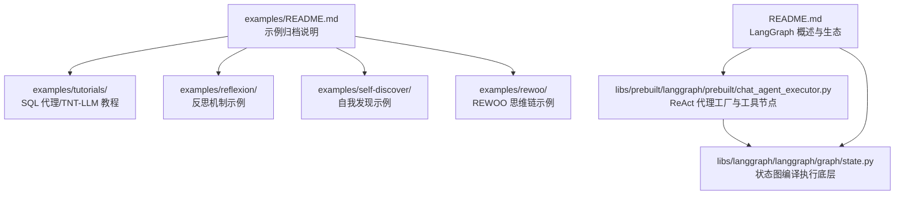
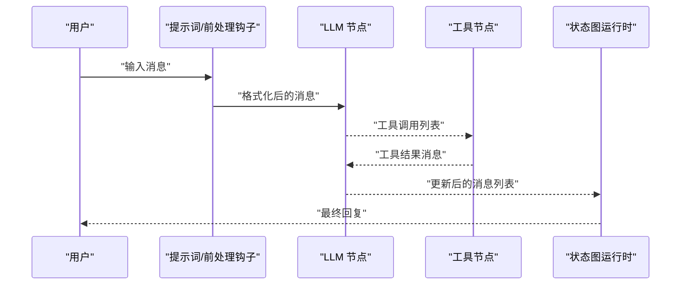
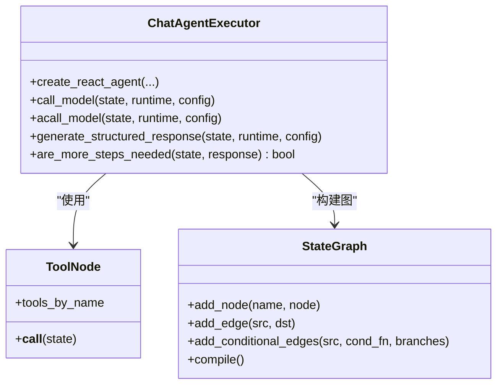
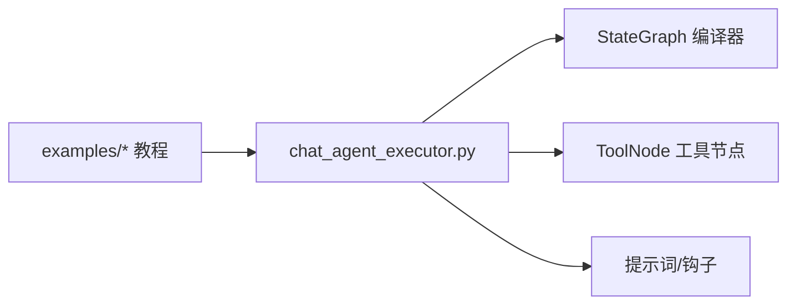

# 教程和实践示例

<cite>
**本文引用的文件**
- [examples/README.md](file://examples/README.md)
- [examples/tutorials/sql-agent.ipynb](file://examples/tutorials/sql-agent.ipynb)
- [examples/tutorials/tnt-llm/tnt-llm.ipynb](file://examples/tutorials/tnt-llm/tnt-llm.ipynb)
- [examples/reflexion/reflexion.ipynb](file://examples/reflexion/reflexion.ipynb)
- [examples/self-discover/self-discover.ipynb](file://examples/self-discover/self-discover.ipynb)
- [examples/rewoo/rewoo.ipynb](file://examples/rewoo/rewoo.ipynb)
- [libs/prebuilt/langgraph/prebuilt/chat_agent_executor.py](file://libs/prebuilt/langgraph/prebuilt/chat_agent_executor.py)
- [README.md](file://README.md)
</cite>

## 目录
1. [引言](#引言)
2. [项目结构](#项目结构)
3. [核心组件](#核心组件)
4. [架构总览](#架构总览)
5. [详细组件分析](#详细组件分析)
6. [依赖关系分析](#依赖关系分析)
7. [性能考虑](#性能考虑)
8. [故障排查指南](#故障排查指南)
9. [结论](#结论)
10. [附录](#附录)

## 引言
本文件面向希望深入掌握 LangGraph 高级特性与实战应用的学习者，围绕“SQL 代理”“TNT-LLM”“反思机制（Reflexion）”“自我发现（Self-Discover）”“REWOO 思维链”等主题，提供系统化的理论背景、实现步骤与学习要点。内容强调不同推理模式、元认知能力与智能体思维过程在 LangGraph 中的落地方式，并结合仓库中的示例与核心库源码进行图解与实操指导。

## 项目结构
仓库 examples 目录包含多个教程与实践示例，当前这些示例已迁移至 LangChain 官方文档，但其概念与范式仍可作为 LangGraph 高阶用法的参考。核心库位于 libs/langgraph 与 libs/prebuilt，前者提供底层状态图编译执行能力，后者提供预置工具节点与常见智能体模式（如 ReAct 代理）。

图表来源
- [examples/README.md:1-4](file://examples/README.md#L1-L4)
- [examples/tutorials/sql-agent.ipynb:1-41](file://examples/tutorials/sql-agent.ipynb#L1-L41)
- [examples/tutorials/tnt-llm/tnt-llm.ipynb:1-41](file://examples/tutorials/tnt-llm/tnt-llm.ipynb#L1-L41)
- [examples/reflexion/reflexion.ipynb:1-41](file://examples/reflexion/reflexion.ipynb#L1-L41)
- [examples/self-discover/self-discover.ipynb:1-41](file://examples/self-discover/self-discover.ipynb#L1-L41)
- [examples/rewoo/rewoo.ipynb:1-41](file://examples/rewoo/rewoo.ipynb#L1-L41)
- [libs/prebuilt/langgraph/prebuilt/chat_agent_executor.py:1-800](file://libs/prebuilt/langgraph/prebuilt/chat_agent_executor.py#L1-L800)
- [README.md:1-83](file://README.md#L1-L83)

章节来源
- [examples/README.md:1-4](file://examples/README.md#L1-L4)
- [README.md:1-83](file://README.md#L1-L83)

## 核心组件
- ReAct 代理与工具节点：预置的 ReAct 代理工厂支持动态模型选择、结构化输出、前置/后置钩子、人机交互中断等能力，是构建多轮工具调用智能体的基础。
- 工具节点：负责解析 LLM 的工具调用请求并执行对应工具，返回结果消息供后续迭代使用。
- 状态图编译执行：底层状态图编译器支持条件边、自循环、检查点与流式执行，为复杂推理流程提供稳定运行时。

章节来源
- [libs/prebuilt/langgraph/prebuilt/chat_agent_executor.py:274-516](file://libs/prebuilt/langgraph/prebuilt/chat_agent_executor.py#L274-L516)
- [libs/prebuilt/langgraph/prebuilt/chat_agent_executor.py:560-620](file://libs/prebuilt/langgraph/prebuilt/chat_agent_executor.py#L560-L620)
- [libs/prebuilt/langgraph/prebuilt/chat_agent_executor.py:787-800](file://libs/prebuilt/langgraph/prebuilt/chat_agent_executor.py#L787-L800)

## 架构总览
下图展示了 ReAct 代理在 LangGraph 中的典型工作流：用户输入经提示词处理后进入 LLM；若 LLM 返回工具调用，则由工具节点执行并回写结果消息，随后再次调用 LLM 进行下一步推理，直至无工具调用为止。

图表来源
- [libs/prebuilt/langgraph/prebuilt/chat_agent_executor.py:485-497](file://libs/prebuilt/langgraph/prebuilt/chat_agent_executor.py#L485-L497)
- [libs/prebuilt/langgraph/prebuilt/chat_agent_executor.py:660-694](file://libs/prebuilt/langgraph/prebuilt/chat_agent_executor.py#L660-L694)
- [libs/prebuilt/langgraph/prebuilt/chat_agent_executor.py:787-800](file://libs/prebuilt/langgraph/prebuilt/chat_agent_executor.py#L787-L800)

## 详细组件分析

### SQL 代理（基于教程）
- 理论背景：通过将自然语言问题转化为结构化查询，结合数据库检索与生成，实现可解释、可控的问答闭环。
- 实现要点：
  - 使用工具节点封装数据库访问接口，确保每次工具调用返回明确的结构化结果。
  - 在 LLM 节点中加入约束性提示词，引导其仅输出合法 SQL 并避免幻觉。
  - 利用状态图的条件边与检查点，记录中间推理与工具调用历史，便于调试与重放。
- 学习要点：
  - 将“问题→SQL→结果→回答”的链路显式建模为状态图节点与边。
  - 结合人机交互中断，在关键节点暂停以校验 SQL 合理性或安全性。
- 适用场景：企业知识库问答、合规审计查询、数据探索型对话。

章节来源
- [examples/tutorials/sql-agent.ipynb:1-41](file://examples/tutorials/sql-agent.ipynb#L1-L41)
- [examples/README.md:1-4](file://examples/README.md#L1-L4)

### TNT-LLM（基于教程）
- 理论背景：TNT-LLM 将“思维链（Chain of Thought）”与“工具调用”结合，使智能体在推理过程中可按需调用外部工具，提升复杂任务的解决能力。
- 实现要点：
  - 将思维链分解为多个中间思考步骤，每步可决定是否调用工具。
  - 工具节点并发/串行调度取决于版本配置，v2 支持更细粒度的任务分发。
  - 借助结构化输出确保最终答案符合预期格式。
- 学习要点：
  - 区分“思考”与“行动”，在状态图中为每个思考步骤设置独立节点。
  - 使用剩余步数限制防止无限循环，结合人机中断进行人工校验。
- 适用场景：数学推理、代码生成、跨系统信息整合。

章节来源
- [examples/tutorials/tnt-llm/tnt-llm.ipynb:1-41](file://examples/tutorials/tnt-llm/tnt-llm.ipynb#L1-L41)
- [examples/README.md:1-4](file://examples/README.md#L1-L4)
- [libs/prebuilt/langgraph/prebuilt/chat_agent_executor.py:456-466](file://libs/prebuilt/langgraph/prebuilt/chat_agent_executor.py#L456-L466)

### 反思机制（Reflexion）
- 理论背景：通过引入“元认知反思”模块，对先前的推理与工具调用进行自评估与修正，从而提升稳定性与准确性。
- 实现要点：
  - 在生成节点之后插入“反思/评分”节点，对上一步生成内容与问题的相关性进行打分。
  - 若分数低于阈值，触发“重写/再检索/再生成”的闭环，直到满足质量要求。
  - 可结合 RAG 的 Self-RAG/CRAG 思想，将反思扩展到检索阶段。
- 学习要点：
  - 将反思视为“第二层推理”，与主推理路径并行或串行插入。
  - 设计清晰的终止条件（如连续多次低分或达到最大迭代次数）。
- 适用场景：长文本生成、多跳推理、需要高可靠性的决策支持。

章节来源
- [examples/reflexion/reflexion.ipynb:1-41](file://examples/reflexion/reflexion.ipynb#L1-L41)
- [examples/README.md:1-4](file://examples/README.md#L1-L4)

### 自我发现（Self-Discover）
- 理论背景：让智能体在与环境交互的过程中自动发现新的工具、策略或知识边界，形成“自我演化”的能力。
- 实现要点：
  - 在状态图中嵌入“探索/验证”节点，对新发现的工具或策略进行小规模实验。
  - 通过奖励信号或启发式规则评估探索收益，逐步扩大可用工具集。
  - 与反思机制结合，对探索失败的尝试进行归纳总结。
- 学习要点：
  - 将“发现”抽象为状态图中的可选分支，允许在运行时动态启用/禁用。
  - 控制探索成本与风险，避免破坏已有稳定路径。
- 适用场景：开放域探索、工具生态扩展、自适应规划。

章节来源
- [examples/self-discover/self-discover.ipynb:1-41](file://examples/self-discover/self-discover.ipynb#L1-L41)
- [examples/README.md:1-4](file://examples/README.md#L1-L4)

### REWOO（基于教程）
- 理论背景：REWOO 将“反思”与“计划-执行-观察-反思”的循环结合，形成可解释、可优化的多步推理框架。
- 实现要点：
  - 计划阶段：将复杂问题拆分为子目标与工具调用序列。
  - 执行阶段：逐个子目标调用工具并收集证据。
  - 观察阶段：评估已完成步骤的有效性与完整性。
  - 反思阶段：根据观察结果调整后续计划或修正错误。
- 学习要点：
  - 明确“计划→执行→观察→反思”的四段式节点划分。
  - 使用条件边连接各阶段，依据评估结果动态切换路径。
- 适用场景：科研助理、工程设计辅助、复杂问题求解。

章节来源
- [examples/rewoo/rewoo.ipynb:1-41](file://examples/rewoo/rewoo.ipynb#L1-L41)
- [examples/README.md:1-4](file://examples/README.md#L1-L4)

### ReAct 代理与工具节点（代码级分析）
- 类图概览：ReAct 代理工厂创建包含“LLM 节点”“工具节点”“钩子节点”等的有向状态图，编译后可在运行时接收输入、执行、流式输出更新。

图表来源
- [libs/prebuilt/langgraph/prebuilt/chat_agent_executor.py:274-516](file://libs/prebuilt/langgraph/prebuilt/chat_agent_executor.py#L274-L516)
- [libs/prebuilt/langgraph/prebuilt/chat_agent_executor.py:560-620](file://libs/prebuilt/langgraph/prebuilt/chat_agent_executor.py#L560-L620)
- [libs/prebuilt/langgraph/prebuilt/chat_agent_executor.py:787-800](file://libs/prebuilt/langgraph/prebuilt/chat_agent_executor.py#L787-L800)

## 依赖关系分析
- ReAct 代理依赖于工具节点与状态图编译器；工具节点依赖于 LangChain 的工具抽象与消息类型。
- 示例教程虽已迁移，但其思想与范式在预置代理工厂中得到体现：例如动态模型绑定、结构化输出、人机中断等。

图表来源
- [libs/prebuilt/langgraph/prebuilt/chat_agent_executor.py:274-516](file://libs/prebuilt/langgraph/prebuilt/chat_agent_executor.py#L274-L516)
- [examples/README.md:1-4](file://examples/README.md#L1-L4)

章节来源
- [libs/prebuilt/langgraph/prebuilt/chat_agent_executor.py:274-516](file://libs/prebuilt/langgraph/prebuilt/chat_agent_executor.py#L274-L516)
- [examples/README.md:1-4](file://examples/README.md#L1-L4)

## 性能考虑
- 流式执行与增量输出：通过状态图的流式接口，逐步输出中间节点更新，降低端到端延迟并提升可观测性。
- 条件边与短路：在工具调用与反思环节设置合理的终止条件，避免无效迭代。
- 检查点与恢复：对长流程启用检查点，以便在失败后从最近检查点恢复，减少重复计算。
- 动态模型选择：在上下文变化时切换模型或工具集合，平衡成本与效果。

## 故障排查指南
- 工具调用与结果不匹配：确保每个工具调用都有对应的工具结果消息，否则会触发历史校验错误。
- 递归深度与剩余步数：当剩余步数不足且仍有工具调用时，代理会返回提示性消息而非抛出异常，应检查状态中的剩余步数逻辑。
- 提示词与输出格式：若启用结构化输出，需确保模型支持相应格式并正确绑定工具。

章节来源
- [libs/prebuilt/langgraph/prebuilt/chat_agent_executor.py:243-272](file://libs/prebuilt/langgraph/prebuilt/chat_agent_executor.py#L243-L272)
- [libs/prebuilt/langgraph/prebuilt/chat_agent_executor.py:435-440](file://libs/prebuilt/langgraph/prebuilt/chat_agent_executor.py#L435-L440)
- [libs/prebuilt/langgraph/prebuilt/chat_agent_executor.py:373-394](file://libs/prebuilt/langgraph/prebuilt/chat_agent_executor.py#L373-L394)

## 结论
通过对 SQL 代理、TNT-LLM、反思机制、自我发现与 REWOO 的系统梳理，可以将复杂的智能体行为抽象为状态图节点与边的组合：以 ReAct 代理为基础，结合工具节点、反思与自我发现模块，形成可解释、可调试、可演进的推理闭环。建议在实践中优先从简单节点开始，逐步叠加条件边与反思/发现模块，同时善用检查点与流式输出提升可观测性与性能。

## 附录
- 进一步阅读：LangGraph 生态与官方文档链接见根目录 README。
- 示例迁移：examples 目录中的教程已迁移至 LangChain 官方文档，可参考其最新示例与最佳实践。

章节来源
- [README.md:61-67](file://README.md#L61-L67)
- [examples/README.md:1-4](file://examples/README.md#L1-L4)