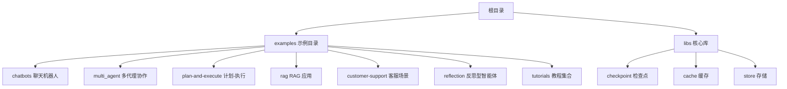
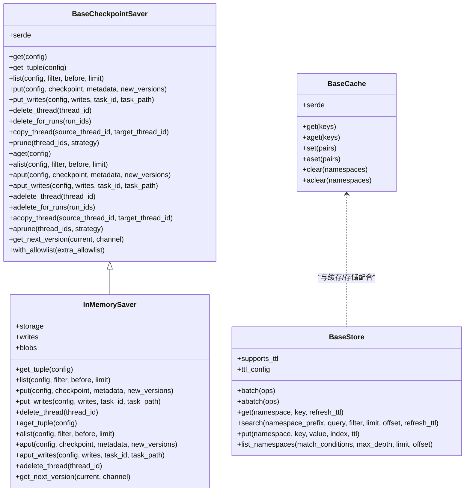
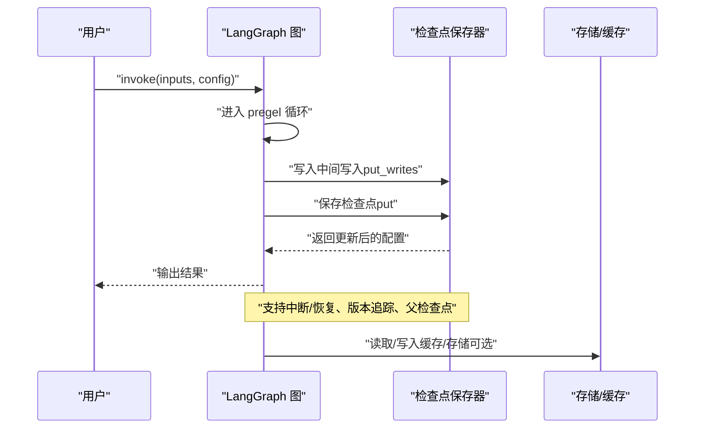
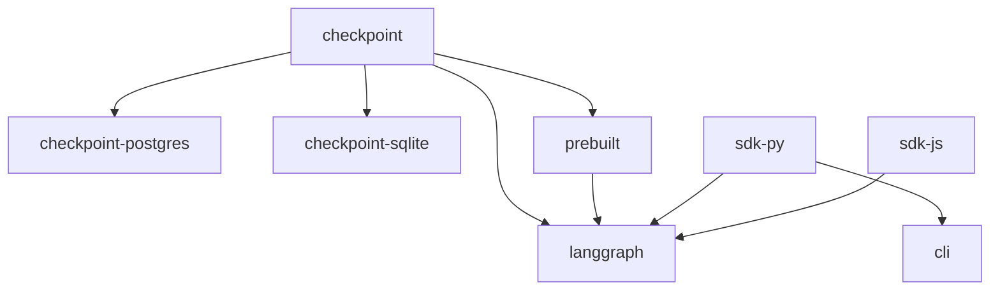

# 示例和教程

<cite>
**本文引用的文件**
- [README.md](file://README.md)
- [examples/README.md](file://examples/README.md)
- [AGENTS.md](file://AGENTS.md)
- [examples/chatbots/information-gather-prompting.ipynb](file://examples/chatbots/information-gather-prompting.ipynb)
- [examples/multi_agent/multi-agent-collaboration.ipynb](file://examples/multi_agent/multi-agent-collaboration.ipynb)
- [examples/plan-and-execute/plan-and-execute.ipynb](file://examples/plan-and-execute/plan-and-execute.ipynb)
- [examples/customer-support/customer-support.ipynb](file://examples/customer-support/customer-support.ipynb)
- [libs/checkpoint/langgraph/checkpoint/base/__init__.py](file://libs/checkpoint/langgraph/checkpoint/base/__init__.py)
- [libs/checkpoint/langgraph/checkpoint/memory/__init__.py](file://libs/checkpoint/langgraph/checkpoint/memory/__init__.py)
- [libs/checkpoint/langgraph/cache/base/__init__.py](file://libs/checkpoint/langgraph/cache/base/__init__.py)
- [libs/checkpoint/langgraph/store/base/__init__.py](file://libs/checkpoint/langgraph/store/base/__init__.py)
</cite>

## 目录
1. [简介](#简介)
2. [项目结构](#项目结构)
3. [核心组件](#核心组件)
4. [架构总览](#架构总览)
5. [详细组件分析](#详细组件分析)
6. [依赖分析](#依赖分析)
7. [性能考虑](#性能考虑)
8. [故障排查指南](#故障排查指南)
9. [结论](#结论)
10. [附录](#附录)

## 简介
本文件面向希望系统学习 LangGraph 示例与教程的读者，提供从入门到进阶的完整学习路径。LangGraph 是一个用于构建“有状态、可持久化、可中断”的长时运行智能体与工作流的低层编排框架。仓库中 examples 目录已迁移至 LangChain 官方文档，但本仓库仍保留了示例说明与框架核心库（检查点、缓存、存储）的源码，便于深入理解其架构与实现。

LangGraph 的典型应用包括：
- 聊天机器人与信息收集
- 多代理协作与团队编排
- 计划-执行范式
- RAG（检索增强生成）与自洽检索
- 反思与反思型智能体
- 人类在环路（Human-in-the-loop）

为帮助不同背景的读者循序渐进掌握，本文件将示例按“基础 → 进阶 → 实战”进行分层，并配套架构图、流程图与最佳实践建议。

## 项目结构
仓库采用多库（monorepo）结构，核心库位于 libs 下，examples 目录保留示例说明与归档信息。examples 中多数示例已迁移到 LangChain 官方文档，但本仓库仍可通过核心库源码理解其运行机制。

图表来源
- [examples/README.md:1-4](file://examples/README.md#L1-L4)
- [AGENTS.md:19-53](file://AGENTS.md#L19-L53)

章节来源
- [examples/README.md:1-4](file://examples/README.md#L1-L4)
- [AGENTS.md:19-53](file://AGENTS.md#L19-L53)

## 核心组件
LangGraph 的核心能力由以下模块支撑：
- 检查点（Checkpoint）：持久化状态快照，支持版本管理、父子关系、中间写入等。
- 缓存（Cache）：键值缓存抽象，支持同步/异步接口。
- 存储（Store）：持久化键值存储，支持命名空间、过滤、分页、可选向量索引与 TTL。

图表来源
- [libs/checkpoint/langgraph/checkpoint/base/__init__.py:122-491](file://libs/checkpoint/langgraph/checkpoint/base/__init__.py#L122-L491)
- [libs/checkpoint/langgraph/checkpoint/memory/__init__.py:31-528](file://libs/checkpoint/langgraph/checkpoint/memory/__init__.py#L31-L528)
- [libs/checkpoint/langgraph/cache/base/__init__.py:15-49](file://libs/checkpoint/langgraph/cache/base/__init__.py#L15-L49)
- [libs/checkpoint/langgraph/store/base/__init__.py:700-800](file://libs/checkpoint/langgraph/store/base/__init__.py#L700-L800)

章节来源
- [libs/checkpoint/langgraph/checkpoint/base/__init__.py:122-491](file://libs/checkpoint/langgraph/checkpoint/base/__init__.py#L122-L491)
- [libs/checkpoint/langgraph/checkpoint/memory/__init__.py:31-528](file://libs/checkpoint/langgraph/checkpoint/memory/__init__.py#L31-L528)
- [libs/checkpoint/langgraph/cache/base/__init__.py:15-49](file://libs/checkpoint/langgraph/cache/base/__init__.py#L15-L49)
- [libs/checkpoint/langgraph/store/base/__init__.py:700-800](file://libs/checkpoint/langgraph/store/base/__init__.py#L700-L800)

## 架构总览
LangGraph 的运行时由“状态通道（Channels）+ 节点（Nodes）+ 边界条件（Edges）+ 检查点（Checkpoints）+ 缓存/存储（Cache/Store）”构成。下图展示从调用到持久化的整体流程：

图表来源
- [libs/checkpoint/langgraph/checkpoint/base/__init__.py:223-299](file://libs/checkpoint/langgraph/checkpoint/base/__init__.py#L223-L299)
- [libs/checkpoint/langgraph/checkpoint/memory/__init__.py:326-409](file://libs/checkpoint/langgraph/checkpoint/memory/__init__.py#L326-L409)

章节来源
- [libs/checkpoint/langgraph/checkpoint/base/__init__.py:173-299](file://libs/checkpoint/langgraph/checkpoint/base/__init__.py#L173-L299)
- [libs/checkpoint/langgraph/checkpoint/memory/__init__.py:135-409](file://libs/checkpoint/langgraph/checkpoint/memory/__init__.py#L135-L409)

## 详细组件分析

### 基础示例：聊天机器人与信息收集
- 场景目标：通过提示工程引导模型逐步收集用户信息，形成结构化对话。
- 关键点：状态通道（如 messages）、工具调用、人类在环路（等待输入）。
- 运行步骤（概念性）：
  1) 初始化图与检查点保存器
  2) 配置线程 ID 与可选中断
  3) invoke 输入，观察状态变化与工具调用
  4) 使用 list 检查点回溯历史
- 预期结果：对话逐步收敛到所需信息，状态稳定增长。

章节来源
- [examples/chatbots/information-gather-prompting.ipynb:1-42](file://examples/chatbots/information-gather-prompting.ipynb#L1-L42)

### 进阶示例：多代理协作与团队编排
- 场景目标：多个子代理分工协作，通过协调者节点进行编排与路由。
- 关键点：层级团队、代理间通信、共享状态、错误处理与重试。
- 运行步骤（概念性）：
  1) 定义子代理与协调者节点
  2) 设置入口/结束点与分支逻辑
  3) 启动编排，观察各代理执行顺序与状态流转
  4) 使用检查点恢复与调试
- 预期结果：任务被分解并有序完成，失败可重试或人工介入。

章节来源
- [examples/multi_agent/multi-agent-collaboration.ipynb:1-42](file://examples/multi_agent/multi-agent-collaboration.ipynb#L1-L42)

### 进阶示例：计划-执行（Plan-and-Execute）
- 场景目标：先制定计划，再按计划执行具体动作，最后评估与修正。
- 关键点：计划节点、执行节点、反馈循环、工具调用。
- 运行步骤（概念性）：
  1) 计划节点生成可执行步骤
  2) 执行节点逐一执行步骤并记录结果
  3) 评估节点根据结果决定是否修正计划
  4) 通过检查点保存每一步状态
- 预期结果：复杂任务被拆解为可追踪的步骤，具备自我修正能力。

章节来源
- [examples/plan-and-execute/plan-and-execute.ipynb:1-42](file://examples/plan-and-execute/plan-and-execute.ipynb#L1-L42)

### 实战示例：客服场景
- 场景目标：基于知识库与上下文进行智能客服问答，支持转接人工。
- 关键点：意图识别、检索增强、工具调用、人机协作。
- 运行步骤（概念性）：
  1) 用户输入进入图
  2) 判定是否需要检索/调用工具
  3) 生成回复或触发人工接入
  4) 通过检查点记录会话历史
- 预期结果：准确回答率提升，复杂问题可转人工。

章节来源
- [examples/customer-support/customer-support.ipynb:1-42](file://examples/customer-support/customer-support.ipynb#L1-L42)

### RAG 应用：检索增强生成与自洽检索
- 场景目标：结合检索与生成，实现更可靠的问答；支持自洽检索与跨模态检索。
- 关键点：嵌入、向量索引、检索排序、生成与校验。
- 运行步骤（概念性）：
  1) 构建/加载向量数据库
  2) 将查询嵌入并检索相关片段
  3) 将上下文与问题送入生成器
  4) 自洽验证与迭代优化
- 预期结果：降低幻觉，提高事实性与一致性。

章节来源
- [examples/rag/langgraph_self_rag.ipynb:1-14](file://examples/rag/langgraph_self_rag.ipynb#L1-L14)

### 反思与反思型智能体
- 场景目标：让智能体对自身行为进行反思与改进，提升鲁棒性。
- 关键点：反思节点、元认知、策略调整。
- 运行步骤（概念性）：
  1) 执行一次推理
  2) 反思节点评估过程与结果
  3) 更新策略或重新规划
- 预期结果：在复杂任务中表现更稳定。

章节来源
- [examples/reflection/reflection.ipynb:1-42](file://examples/reflection/reflection.ipynb#L1-L42)
- [examples/reflexion/reflexion.ipynb:1-42](file://examples/reflexion/reflexion.ipynb#L1-L42)

### 教程集合：SQL Agent、TNT LLM 等
- 场景目标：快速上手特定任务（如 SQL 查询、教学场景），提供最小可用范式。
- 关键点：工具定义、提示模板、状态管理。
- 运行步骤（概念性）：
  1) 定义工具与节点
  2) 组合为最小图
  3) 通过检查点持久化状态
- 预期结果：快速落地特定领域 Agent。

章节来源
- [examples/tutorials/sql-agent.ipynb:1-42](file://examples/tutorials/sql-agent.ipynb#L1-L42)
- [examples/tutorials/tnt-llm/tnt-llm.ipynb:1-42](file://examples/tutorials/tnt-llm/tnt-llm.ipynb#L1-L42)

## 依赖分析
LangGraph 生态中的库依赖关系如下：

图表来源
- [AGENTS.md:33-53](file://AGENTS.md#L33-L53)

章节来源
- [AGENTS.md:19-53](file://AGENTS.md#L19-L53)

## 性能考虑
- 检查点与序列化
  - 使用高效的序列化器（如 JSON+ 或加密序列化）以平衡安全与性能。
  - 对大对象采用“blob”分离存储，仅在必要时加载。
- 并发与异步
  - 提供异步接口（aget、alist、aput 等），在高并发场景下减少阻塞。
- 内存与持久化
  - InMemorySaver 适合测试与调试；生产环境建议使用持久化检查点（如 Postgres/SQLite）。
- 缓存与存储
  - 合理设置 TTL 与命名空间，避免无界增长。
  - 向量索引需权衡维度与召回质量。

## 故障排查指南
- 常见问题
  - 状态未持久化：确认已配置检查点保存器与线程 ID。
  - 中断后无法恢复：检查中断类型与恢复策略。
  - 数据不一致：核对通道版本与更新日志。
- 排查步骤
  1) 使用 list 检查点查看历史快照
  2) 检查 put_writes 是否正确记录中间写入
  3) 核对 serde 配置与允许白名单
  4) 在异步场景下确保异步接口正确使用
- 相关实现参考
  - 检查点元数据与版本管理
  - 内存检查点的 get/put/list 流程
  - 缓存与存储的抽象接口

章节来源
- [libs/checkpoint/langgraph/checkpoint/base/__init__.py:173-299](file://libs/checkpoint/langgraph/checkpoint/base/__init__.py#L173-L299)
- [libs/checkpoint/langgraph/checkpoint/memory/__init__.py:135-409](file://libs/checkpoint/langgraph/checkpoint/memory/__init__.py#L135-L409)
- [libs/checkpoint/langgraph/cache/base/__init__.py:15-49](file://libs/checkpoint/langgraph/cache/base/__init__.py#L15-L49)
- [libs/checkpoint/langgraph/store/base/__init__.py:700-800](file://libs/checkpoint/langgraph/store/base/__init__.py#L700-L800)

## 结论
LangGraph 提供了构建复杂、可调试、可扩展的有状态智能体与工作流的基础设施。通过检查点、缓存与存储三大支柱，开发者可以在不同场景下灵活组合节点与工具，实现从聊天机器人到多代理协作、从计划-执行到 RAG 的多种应用。建议初学者从基础示例入手，逐步过渡到实战场景，并在生产环境中优先选择持久化检查点与可观测性工具链。

## 附录
- 快速开始与生态链接：参见根目录 README 的“文档”与“生态系统”部分。
- 示例迁移说明：examples 目录已迁移至 LangChain 官方文档，此处保留归档说明。

章节来源
- [README.md:61-76](file://README.md#L61-L76)
- [examples/README.md:1-4](file://examples/README.md#L1-L4)