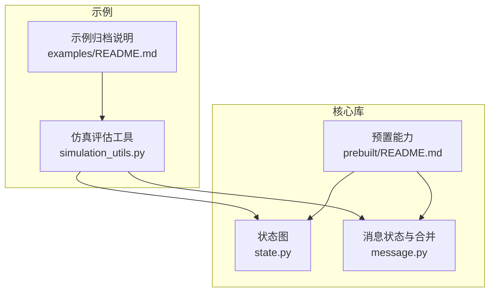
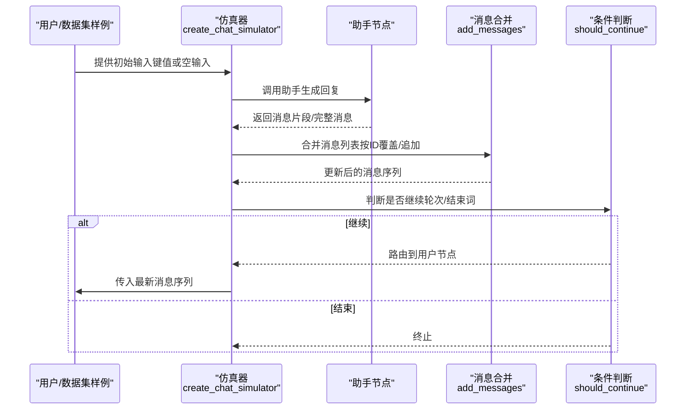
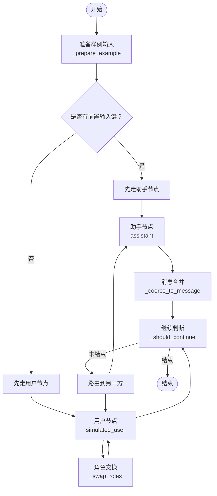
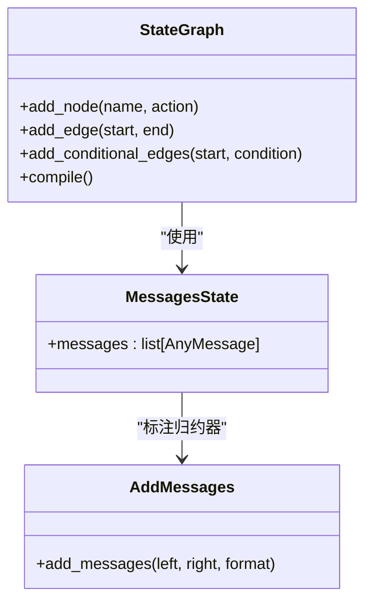
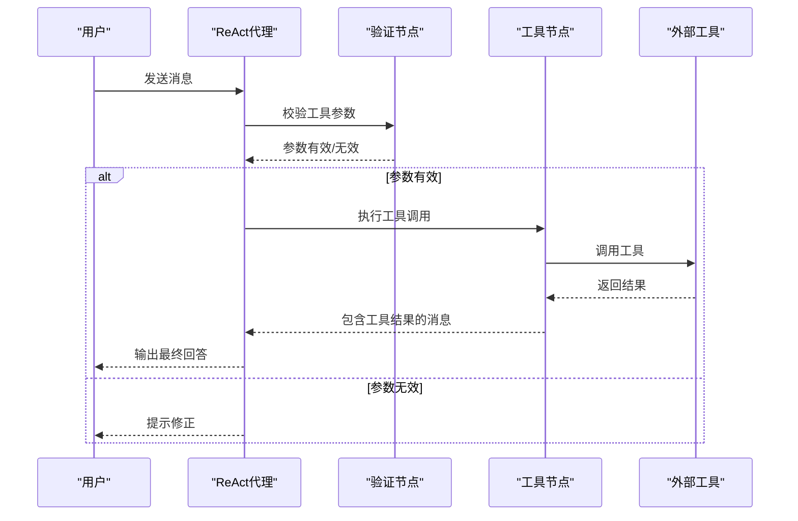
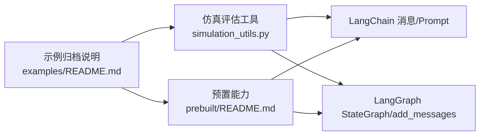

# 聊天机器人示例

<cite>
**本文引用的文件**
- [examples/README.md](file://examples/README.md)
- [examples/chatbot-simulation-evaluation/simulation_utils.py](file://examples/chatbot-simulation-evaluation/simulation_utils.py)
- [libs/langgraph/langgraph/graph/state.py](file://libs/langgraph/langgraph/graph/state.py)
- [libs/langgraph/langgraph/graph/message.py](file://libs/langgraph/langgraph/graph/message.py)
- [libs/prebuilt/README.md](file://libs/prebuilt/README.md)
</cite>

## 目录
1. [简介](#简介)
2. [项目结构](#项目结构)
3. [核心组件](#核心组件)
4. [架构总览](#架构总览)
5. [详细组件分析](#详细组件分析)
6. [依赖分析](#依赖分析)
7. [性能考虑](#性能考虑)
8. [故障排查指南](#故障排查指南)
9. [结论](#结论)
10. [附录](#附录)

## 简介
本文件围绕聊天机器人在信息收集提示、客户支持对话与代理模拟评估等场景的应用，系统梳理基于 LangGraph 的实现方式与最佳实践。内容覆盖对话状态管理、上下文保持、多轮对话处理与用户体验优化，并结合仓库中的仿真评估工具与核心图执行引擎，给出可落地的部署与性能优化建议。

需要特别说明的是：示例目录已迁移至集中化的 LangChain 文档，当前仓库保留归档用途。本文仍以现有源码为依据进行技术解读，帮助读者快速掌握从简单到复杂的聊天机器人实现路径。

章节来源
- [examples/README.md:1-4](file://examples/README.md#L1-L4)

## 项目结构
- examples/chatbot-simulation-evaluation：包含聊天仿真评估工具与辅助函数，用于构建“用户-助手”对话语料与自动化评估流程。
- libs/langgraph/langgraph/graph：核心图执行与状态管理实现（StateGraph、消息通道与合并策略）。
- libs/prebuilt：高层预置能力（如 ReAct 风格代理、工具节点等），便于快速搭建聊天机器人。

图表来源
- [examples/chatbot-simulation-evaluation/simulation_utils.py:1-204](file://examples/chatbot-simulation-evaluation/simulation_utils.py#L1-L204)
- [libs/langgraph/langgraph/graph/state.py:115-800](file://libs/langgraph/langgraph/graph/state.py#L115-L800)
- [libs/langgraph/langgraph/graph/message.py:1-373](file://libs/langgraph/langgraph/graph/message.py#L1-L373)
- [libs/prebuilt/README.md:1-117](file://libs/prebuilt/README.md#L1-L117)
- [examples/README.md:1-4](file://examples/README.md#L1-L4)

章节来源
- [examples/README.md:1-4](file://examples/README.md#L1-L4)
- [libs/langgraph/langgraph/graph/state.py:115-800](file://libs/langgraph/langgraph/graph/state.py#L115-L800)
- [libs/langgraph/langgraph/graph/message.py:1-373](file://libs/langgraph/langgraph/graph/message.py#L1-L373)
- [libs/prebuilt/README.md:1-117](file://libs/prebuilt/README.md#L1-L117)

## 核心组件
- 仿真评估工具链：提供“模拟用户”与“聊天仿真器”的构建方法，支持设定最大轮次、终止条件与输入键位，便于自动化评测与回归验证。
- 状态图（StateGraph）：定义节点、边与通道，支持通过注解的归约器（reducer）实现状态增量更新与并发汇聚。
- 消息状态与合并：提供消息列表的合并策略与格式化能力，确保多轮对话中消息有序追加与按 ID 替换/删除。
- 预置能力（Prebuilt）：提供 ReAct 风格代理、工具节点与校验节点等高层抽象，降低工具调用与对话编排的开发成本。

章节来源
- [examples/chatbot-simulation-evaluation/simulation_utils.py:32-204](file://examples/chatbot-simulation-evaluation/simulation_utils.py#L32-L204)
- [libs/langgraph/langgraph/graph/state.py:115-800](file://libs/langgraph/langgraph/graph/state.py#L115-L800)
- [libs/langgraph/langgraph/graph/message.py:60-245](file://libs/langgraph/langgraph/graph/message.py#L60-L245)
- [libs/prebuilt/README.md:10-85](file://libs/prebuilt/README.md#L10-L85)

## 架构总览
下图展示从“输入请求”到“多轮对话输出”的典型流程，包括仿真评估与消息合并的关键环节：

图表来源
- [examples/chatbot-simulation-evaluation/simulation_utils.py:80-124](file://examples/chatbot-simulation-evaluation/simulation_utils.py#L80-L124)
- [examples/chatbot-simulation-evaluation/simulation_utils.py:195-204](file://examples/chatbot-simulation-evaluation/simulation_utils.py#L195-L204)
- [libs/langgraph/langgraph/graph/message.py:60-245](file://libs/langgraph/langgraph/graph/message.py#L60-L245)

## 详细组件分析

### 仿真评估工具链
- 模拟用户：基于系统提示与历史消息模板，构造“用户”角色的响应，作为仿真器输入。
- 仿真器：以状态图为骨架，串联“助手-用户”节点，支持自定义最大轮次与终止条件；可选从数据集提取特定输入键位。
- 消息合并：统一将字符串或消息对象转换为 AIMessage/HumanMessage 并追加到消息列表。
- 终止逻辑：默认以消息数量阈值与特定结束词判定终止。

图表来源
- [examples/chatbot-simulation-evaluation/simulation_utils.py:130-141](file://examples/chatbot-simulation-evaluation/simulation_utils.py#L130-L141)
- [examples/chatbot-simulation-evaluation/simulation_utils.py:179-185](file://examples/chatbot-simulation-evaluation/simulation_utils.py#L179-L185)
- [examples/chatbot-simulation-evaluation/simulation_utils.py:195-204](file://examples/chatbot-simulation-evaluation/simulation_utils.py#L195-L204)

章节来源
- [examples/chatbot-simulation-evaluation/simulation_utils.py:32-204](file://examples/chatbot-simulation-evaluation/simulation_utils.py#L32-L204)

### 状态图与消息合并
- 状态图（StateGraph）：节点签名接收/返回状态字典，通过通道与归约器聚合来自多节点的更新；支持设置入口/出口点与分支条件。
- 消息合并（add_messages）：保证消息列表“追加优先”，若新消息含相同 ID，则替换旧消息；支持批量删除与全清空标记。
- 消息状态（MessagesState）：以 TypedDict 定义 messages 字段并标注合并归约器，简化多轮对话状态建模。

图表来源
- [libs/langgraph/langgraph/graph/state.py:115-800](file://libs/langgraph/langgraph/graph/state.py#L115-L800)
- [libs/langgraph/langgraph/graph/message.py:60-245](file://libs/langgraph/langgraph/graph/message.py#L60-L245)
- [libs/langgraph/langgraph/graph/message.py:307-309](file://libs/langgraph/langgraph/graph/message.py#L307-L309)

章节来源
- [libs/langgraph/langgraph/graph/state.py:115-800](file://libs/langgraph/langgraph/graph/state.py#L115-L800)
- [libs/langgraph/langgraph/graph/message.py:60-245](file://libs/langgraph/langgraph/graph/message.py#L60-L245)
- [libs/langgraph/langgraph/graph/message.py:307-309](file://libs/langgraph/langgraph/graph/message.py#L307-L309)

### 预置能力与工具调用
- ReAct 风格代理：封装思考-行动-观察循环，自动调度工具调用与消息流。
- 工具节点（ToolNode）：根据 AIMessage 中的工具调用清单执行对应工具。
- 校验节点（ValidationNode）：基于 Pydantic 模型校验工具参数，提升鲁棒性。
- 人机中断（Agent Inbox）：在关键步骤插入人工确认，增强可控性与安全性。

图表来源
- [libs/prebuilt/README.md:10-85](file://libs/prebuilt/README.md#L10-L85)

章节来源
- [libs/prebuilt/README.md:10-85](file://libs/prebuilt/README.md#L10-L85)

### 复杂度与实现方案
- 简单提示驱动：仅使用 ChatPromptTemplate + LLM，适合一次性问答与基础引导。
- 基础对话状态：引入 MessagesState 与 add_messages，实现上下文累积与消息去重。
- 工具调用增强：接入 ToolNode 与 ValidationNode，实现“思考-行动-观察”闭环。
- 仿真评估：使用 create_chat_simulator 构建自动化评测流水线，支持多轮与终止控制。
- 高级编排：利用 StateGraph 的条件边与并发汇聚，实现多分支、多阶段的复杂对话流程。

章节来源
- [libs/langgraph/langgraph/graph/message.py:60-245](file://libs/langgraph/langgraph/graph/message.py#L60-L245)
- [examples/chatbot-simulation-evaluation/simulation_utils.py:80-124](file://examples/chatbot-simulation-evaluation/simulation_utils.py#L80-L124)
- [libs/prebuilt/README.md:10-85](file://libs/prebuilt/README.md#L10-L85)

## 依赖分析
- 仿真评估工具依赖 LangChain 的消息类型与 Prompt 模板，以及 LangGraph 的 StateGraph 与消息合并归约器。
- 预置能力依赖 LangGraph 的图执行引擎与通道系统，同时与 LangChain 的工具接口保持一致。
- 示例归档说明表明当前示例已迁移至集中文档，后续请参考最新官方文档获取更新示例。

图表来源
- [examples/chatbot-simulation-evaluation/simulation_utils.py:1-12](file://examples/chatbot-simulation-evaluation/simulation_utils.py#L1-L12)
- [libs/prebuilt/README.md:1-8](file://libs/prebuilt/README.md#L1-L8)
- [examples/README.md:1-4](file://examples/README.md#L1-L4)

章节来源
- [examples/chatbot-simulation-evaluation/simulation_utils.py:1-12](file://examples/chatbot-simulation-evaluation/simulation_utils.py#L1-L12)
- [libs/prebuilt/README.md:1-8](file://libs/prebuilt/README.md#L1-L8)
- [examples/README.md:1-4](file://examples/README.md#L1-L4)

## 性能考虑
- 消息合并策略：使用按 ID 覆盖与追加的合并策略，避免重复存储与无序增长，降低内存占用。
- 条件边与并发：合理设计分支与汇聚，减少不必要的串行等待，提升吞吐。
- 缓存与检查点：结合缓存与检查点机制，可在长对话中复用中间结果，缩短冷启动时间。
- 流式输出：利用流式事件与分片消息，改善首屏延迟与交互体验。
- 评估批量化：仿真评估时可并行运行多个样例，配合限速与重试策略，平衡吞吐与稳定性。

## 故障排查指南
- 输入键缺失：当使用带 input_key 的仿真器时，若样例缺少该键会抛出异常，需检查数据集字段一致性。
- 终止条件误判：若对话未按预期结束，检查 should_continue 的轮次阈值与结束词配置。
- 消息格式不匹配：确保输出消息被正确转换为 AIMessage/HumanMessage，避免下游节点解析失败。
- 工具参数校验失败：ValidationNode 将拒绝不符合模型定义的参数，需调整工具签名或提示用户修正。
- 通道冲突：StateGraph 中同名通道类型不一致会导致错误，需统一通道定义。

章节来源
- [examples/chatbot-simulation-evaluation/simulation_utils.py:130-141](file://examples/chatbot-simulation-evaluation/simulation_utils.py#L130-L141)
- [examples/chatbot-simulation-evaluation/simulation_utils.py:195-204](file://examples/chatbot-simulation-evaluation/simulation_utils.py#L195-L204)
- [libs/langgraph/langgraph/graph/message.py:60-245](file://libs/langgraph/langgraph/graph/message.py#L60-L245)
- [libs/prebuilt/README.md:62-85](file://libs/prebuilt/README.md#L62-L85)

## 结论
通过仿真评估工具链、状态图与消息合并机制，以及预置的 ReAct 代理与工具节点，LangGraph 为聊天机器人的多场景应用提供了清晰的实现路径。从简单提示到复杂工具调用与多轮编排，均可在统一的图执行框架下完成。建议在生产环境中结合缓存、检查点与流式输出优化用户体验，并以仿真评估持续迭代对话质量。

## 附录
- 迁移提示：示例目录已迁移至集中化文档，请参考最新官方文档获取更新示例与使用指南。
- 参考实现：可基于 simulation_utils.py 的仿真器模式与 prebuilt 的代理模板，快速搭建信息收集、客户支持与代理评估场景。

章节来源
- [examples/README.md:1-4](file://examples/README.md#L1-L4)
- [libs/prebuilt/README.md:1-117](file://libs/prebuilt/README.md#L1-L117)