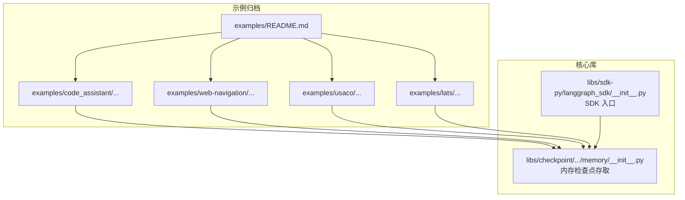
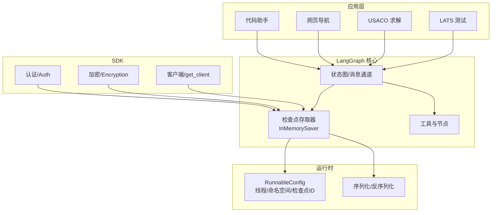
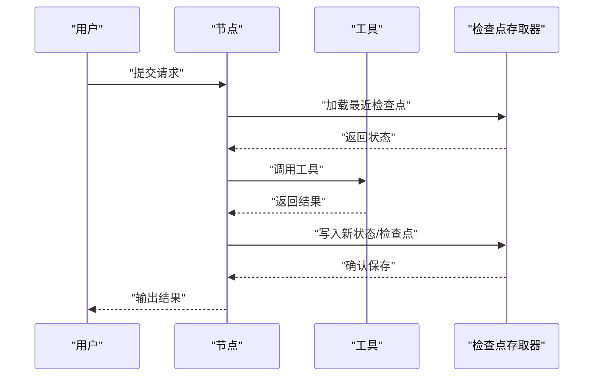
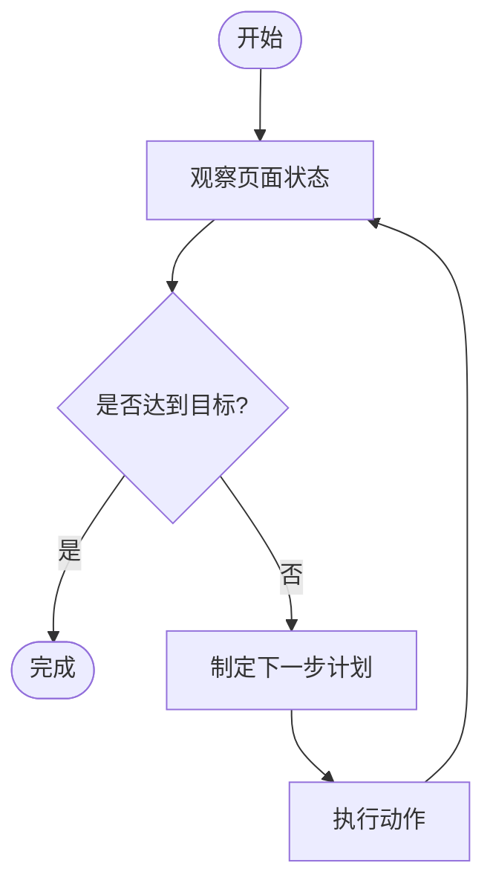
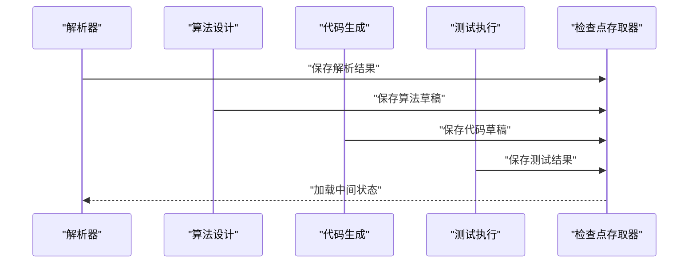
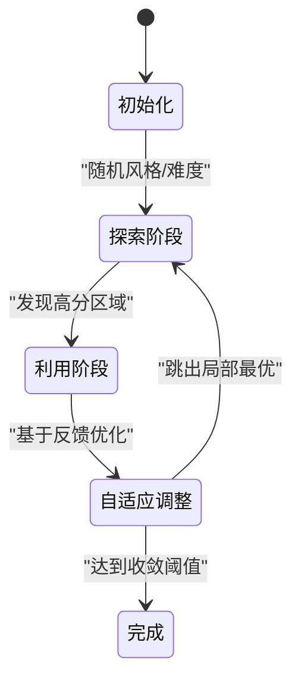
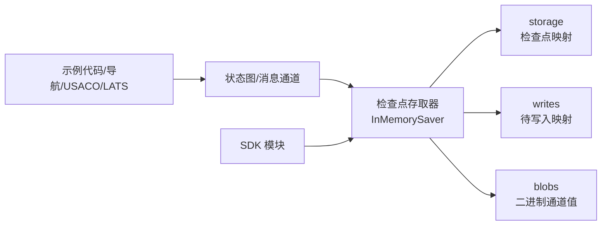

# 高级应用示例

<cite>
**本文档引用的文件**
- [examples/README.md](file://examples/README.md)
- [examples/code_assistant/langgraph_code_assistant.ipynb](file://examples/code_assistant/langgraph_code_assistant.ipynb)
- [examples/web-navigation/web_voyager.ipynb](file://examples/web-navigation/web_voyager.ipynb)
- [examples/usaco/usaco.ipynb](file://examples/usaco/usaco.ipynb)
- [examples/lats/lats.ipynb](file://examples/lats/lats.ipynb)
- [libs/checkpoint/langgraph/checkpoint/memory/__init__.py](file://libs/checkpoint/langgraph/checkpoint/memory/__init__.py)
- [libs/sdk-py/langgraph_sdk/__init__.py](file://libs/sdk-py/langgraph_sdk/__init__.py)
</cite>

## 目录
1. [简介](#简介)
2. [项目结构](#项目结构)
3. [核心组件](#核心组件)
4. [架构总览](#架构总览)
5. [详细组件分析](#详细组件分析)
6. [依赖关系分析](#依赖关系分析)
7. [性能考虑](#性能考虑)
8. [故障排除指南](#故障排除指南)
9. [结论](#结论)
10. [附录](#附录)

## 简介
本文件面向高级应用场景，系统化梳理 LangGraph 在以下专业领域的实践：代码助手、网页导航、USACO 竞赛问题求解、LATS（语言适应性测试）。每个示例均体现 LangGraph 在复杂状态管理、多模态交互与领域特定优化方面的强大能力，并提供最佳实践与性能调优建议。

LangGraph 的核心优势在于：
- **状态图式建模**：以消息通道与状态字典为核心，清晰表达复杂流程与条件分支。
- **检查点持久化**：支持内存与外部存储的检查点保存器，保障长流程的可恢复性与并发一致性。
- **工具与节点解耦**：通过工具调用与节点逻辑分离，便于在不同领域复用与扩展。
- **多模态交互**：结合文本、图像、结构化输出等，满足多样化输入输出需求。

## 项目结构
示例目录已迁移至集中化的 LangChain 文档，但本仓库仍保留归档说明，便于追溯历史版本与迁移路径。核心库包括：
- 检查点模块：提供内存与持久化检查点存取接口，支撑状态恢复与并发控制。
- SDK 模块：提供客户端与认证封装，便于集成到生产环境。

**图表来源**
- [examples/README.md:1-4](file://examples/README.md#L1-L4)
- [libs/checkpoint/langgraph/checkpoint/memory/__init__.py:31-64](file://libs/checkpoint/langgraph/checkpoint/memory/__init__.py#L31-L64)
- [libs/sdk-py/langgraph_sdk/__init__.py:1-9](file://libs/sdk-py/langgraph_sdk/__init__.py#L1-L9)

**章节来源**
- [examples/README.md:1-4](file://examples/README.md#L1-L4)

## 核心组件
- 状态与消息通道：通过状态字典与消息通道实现跨节点的状态传递与累积，支持增量更新与版本化写入。
- 检查点存取器：InMemorySaver 提供线程与命名空间隔离的检查点存储，支持按配置检索、列出与删除线程数据。
- 工具与节点：将具体任务抽象为工具与节点，通过条件判断与分支控制实现复杂流程。
- 多模态适配：在不同示例中结合文本、结构化输出与外部工具，形成端到端的多模态工作流。

**章节来源**
- [libs/checkpoint/langgraph/checkpoint/memory/__init__.py:66-98](file://libs/checkpoint/langgraph/checkpoint/memory/__init__.py#L66-L98)
- [libs/checkpoint/langgraph/checkpoint/memory/__init__.py:135-215](file://libs/checkpoint/langgraph/checkpoint/memory/__init__.py#L135-L215)
- [libs/checkpoint/langgraph/checkpoint/memory/__init__.py:326-370](file://libs/checkpoint/langgraph/checkpoint/memory/__init__.py#L326-L370)

## 架构总览
下图展示 LangGraph 在高级应用中的典型架构：状态图定义流程，检查点存取器负责状态持久化，工具与节点负责执行具体任务，SDK 提供统一入口与加密能力。

**图表来源**
- [libs/checkpoint/langgraph/checkpoint/memory/__init__.py:31-64](file://libs/checkpoint/langgraph/checkpoint/memory/__init__.py#L31-L64)
- [libs/sdk-py/langgraph_sdk/__init__.py:1-9](file://libs/sdk-py/langgraph_sdk/__init__.py#L1-L9)

## 详细组件分析

### 代码助手（Code Assistant）
- 场景特点：需要在多轮对话中维护上下文、调用工具（如代码解释器、文件读写）、进行状态管理与错误恢复。
- 关键设计：
  - 使用状态字典累积消息与中间结果，避免重复计算。
  - 结合检查点存取器实现长对话的断点续跑。
  - 将工具调用与节点逻辑解耦，便于扩展更多工具。
- 最佳实践：
  - 对工具调用结果进行缓存与去重，减少重复请求。
  - 在节点间传递最小必要信息，降低状态膨胀风险。
  - 使用命名空间隔离不同会话，避免交叉污染。

**图表来源**
- [libs/checkpoint/langgraph/checkpoint/memory/__init__.py:135-215](file://libs/checkpoint/langgraph/checkpoint/memory/__init__.py#L135-L215)
- [libs/checkpoint/langgraph/checkpoint/memory/__init__.py:326-370](file://libs/checkpoint/langgraph/checkpoint/memory/__init__.py#L326-L370)

**章节来源**
- [examples/code_assistant/langgraph_code_assistant.ipynb:1-42](file://examples/code_assistant/langgraph_code_assistant.ipynb#L1-L42)

### 网页导航（Web Navigation）
- 场景特点：需要在浏览器环境中执行复杂交互（点击、输入、滚动），并根据页面反馈动态调整策略。
- 关键设计：
  - 将“观察-决策-行动”循环抽象为节点，通过状态记录当前页面与目标。
  - 利用检查点存取器记录导航轨迹，便于回放与调试。
  - 工具层封装浏览器操作，节点层聚焦策略与规划。
- 最佳实践：
  - 对页面元素进行稳定选择器设计，提升鲁棒性。
  - 在节点中加入超时与重试机制，应对网络波动。
  - 使用命名空间区分不同任务的导航轨迹。

**图表来源**
- [libs/checkpoint/langgraph/checkpoint/memory/__init__.py:217-324](file://libs/checkpoint/langgraph/checkpoint/memory/__init__.py#L217-L324)

**章节来源**
- [examples/web-navigation/web_voyager.ipynb:1-42](file://examples/web-navigation/web_voyager.ipynb#L1-L42)

### USACO 竞赛问题求解
- 场景特点：需要对题目进行解析、生成算法思路、编写代码并通过测试用例验证。
- 关键设计：
  - 节点分层：解析题意、设计算法、生成代码、测试验证。
  - 检查点用于记录中间步骤，便于失败重试与人工干预。
  - 工具层集成编译器与测试框架，确保执行一致性。
- 最佳实践：
  - 将“样例输入输出”作为约束条件融入节点逻辑。
  - 对生成的代码进行静态检查与边界条件验证。
  - 使用命名空间隔离不同题目或不同尝试。

**图表来源**
- [libs/checkpoint/langgraph/checkpoint/memory/__init__.py:372-409](file://libs/checkpoint/langgraph/checkpoint/memory/__init__.py#L372-L409)

**章节来源**
- [examples/usaco/usaco.ipynb:1-42](file://examples/usaco/usaco.ipynb#L1-L42)

### LATS（语言适应性测试）
- 场景特点：需要评估模型在不同语言风格与难度下的表现，进行自适应调整与反馈。
- 关键设计：
  - 将“风格/难度/主题”作为状态维度，动态调整提示词与评估标准。
  - 检查点记录每次测试的得分与反馈，形成自适应曲线。
  - 工具层封装评分与统计分析，节点层负责策略迭代。
- 最佳实践：
  - 设计多维评估指标，避免单一指标误导。
  - 引入“探索-利用”机制，在未知区域进行探索，在已知区域精细优化。
  - 使用命名空间区分不同被试者或测试批次。

**图表来源**
- [libs/checkpoint/langgraph/checkpoint/memory/__init__.py:410-427](file://libs/checkpoint/langgraph/checkpoint/memory/__init__.py#L410-L427)

**章节来源**
- [examples/lats/lats.ipynb:1-42](file://examples/lats/lats.ipynb#L1-L42)

## 依赖关系分析
- 示例与核心库的耦合：
  - 示例通过状态图与工具调用间接依赖检查点存取器，实现状态持久化。
  - SDK 模块为运行时提供认证与加密能力，便于在生产环境部署。
- 内部依赖链：
  - InMemorySaver 维护三类结构：storage（检查点）、writes（待写入）、blobs（二进制通道值）。
  - 通过 RunnableConfig 的 thread_id、checkpoint_ns、checkpoint_id 实现隔离与检索。

**图表来源**
- [libs/checkpoint/langgraph/checkpoint/memory/__init__.py:66-98](file://libs/checkpoint/langgraph/checkpoint/memory/__init__.py#L66-L98)
- [libs/sdk-py/langgraph_sdk/__init__.py:1-9](file://libs/sdk-py/langgraph_sdk/__init__.py#L1-L9)

**章节来源**
- [libs/checkpoint/langgraph/checkpoint/memory/__init__.py:66-98](file://libs/checkpoint/langgraph/checkpoint/memory/__init__.py#L66-L98)
- [libs/sdk-py/langgraph_sdk/__init__.py:1-9](file://libs/sdk-py/langgraph_sdk/__init__.py#L1-L9)

## 性能考虑
- 状态规模控制
  - 限制状态字段数量与单次消息长度，避免过度膨胀。
  - 使用增量更新而非全量替换，减少序列化开销。
- 检查点频率
  - 长流程中适度增加检查点频率，平衡恢复成本与数据安全。
  - 对只读或可重算的数据不写入检查点，降低 IO 压力。
- 并发与隔离
  - 使用 thread_id 与 checkpoint_ns 区分并发任务，避免竞态。
  - 在高并发场景优先使用外部持久化存取器替代内存存取器。
- 工具调用优化
  - 对工具调用结果进行本地缓存，减少重复请求。
  - 批量处理相似工具调用，合并网络往返。
- 序列化与压缩
  - 合理选择序列化格式，权衡可读性与体积。
  - 对大对象采用分片或延迟加载策略。

## 故障排除指南
- 状态不一致
  - 症状：节点读取到过期或冲突状态。
  - 处理：检查 RunnableConfig 中的 checkpoint_id 是否正确；必要时显式指定父检查点。
- 检查点丢失
  - 症状：重启后无法恢复进度。
  - 处理：切换到外部持久化存取器；确保 thread_id 与命名空间配置正确。
- 工具调用失败
  - 症状：工具返回错误或超时。
  - 处理：增加重试与熔断；记录工具输入输出以便复现。
- 并发冲突
  - 症状：多个任务互相覆盖状态。
  - 处理：为每个任务分配独立 thread_id；使用命名空间隔离不同会话。

**章节来源**
- [libs/checkpoint/langgraph/checkpoint/memory/__init__.py:135-215](file://libs/checkpoint/langgraph/checkpoint/memory/__init__.py#L135-L215)
- [libs/checkpoint/langgraph/checkpoint/memory/__init__.py:326-370](file://libs/checkpoint/langgraph/checkpoint/memory/__init__.py#L326-L370)

## 结论
LangGraph 在高级应用场景中展现出强大的状态管理、工具解耦与多模态适配能力。通过合理的状态设计、检查点策略与工具抽象，可在代码助手、网页导航、USACO 求解与 LATS 测试等复杂任务中实现稳健、可扩展与高性能的解决方案。建议在生产环境中结合 SDK 的认证与加密能力，配合外部持久化存取器，构建可审计、可恢复的智能体系统。

## 附录
- 迁移说明：示例目录已迁移至集中化 LangChain 文档，归档目录不再更新，请参考最新文档获取示例与使用指南。
- 版本与兼容性：SDK 模块提供版本号与导出清单，确保与上游依赖的兼容性。

**章节来源**
- [examples/README.md:1-4](file://examples/README.md#L1-L4)
- [libs/sdk-py/langgraph_sdk/__init__.py:1-9](file://libs/sdk-py/langgraph_sdk/__init__.py#L1-L9)