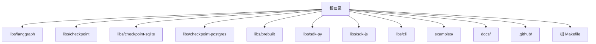
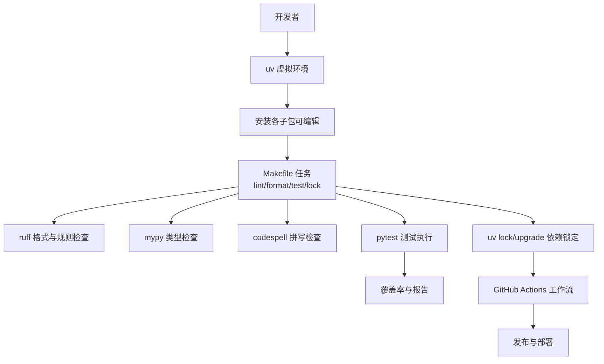
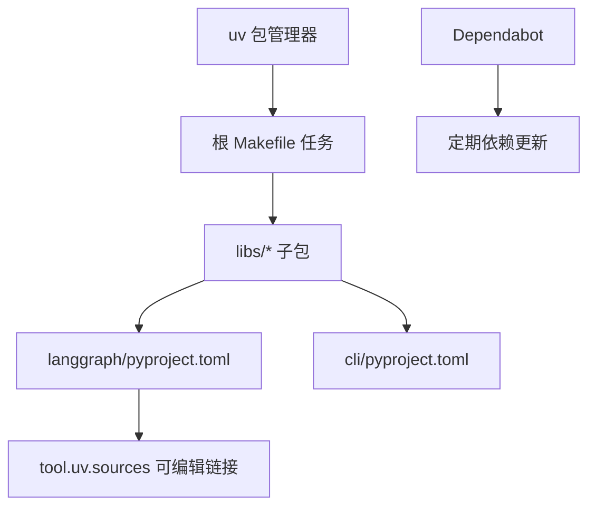

# 贡献指南

<cite>
**本文引用的文件**
- [README.md](file://README.md)
- [Makefile](file://Makefile)
- [.github/PULL_REQUEST_TEMPLATE.md](file://.github/PULL_REQUEST_TEMPLATE.md)
- [.github/dependabot.yml](file://.github/dependabot.yml)
- [.gitignore](file://.gitignore)
- [.markdownlint.json](file://.markdownlint.json)
- [libs/langgraph/pyproject.toml](file://libs/langgraph/pyproject.toml)
- [libs/cli/pyproject.toml](file://libs/cli/pyproject.toml)
</cite>

## 目录
1. [简介](#简介)
2. [项目结构](#项目结构)
3. [核心组件](#核心组件)
4. [架构总览](#架构总览)
5. [详细组件分析](#详细组件分析)
6. [依赖分析](#依赖分析)
7. [性能考虑](#性能考虑)
8. [故障排查指南](#故障排查指南)
9. [结论](#结论)
10. [附录](#附录)

## 简介
本贡献指南面向希望参与 LangGraph 项目的开发者与文档贡献者，涵盖开发环境搭建、依赖安装、代码规范、测试与提交流程、项目结构与开发工作流、问题报告与功能请求流程、文档与翻译贡献、Pull Request 模板与审查流程、社区行为准则与沟通渠道，以及新贡献者的入门与导师支持机制。LangGraph 是一个用于构建有状态代理的低层编排框架，项目采用多包（monorepo）结构，使用 uv 作为包管理与锁定工具，并通过 Makefile 提供统一的开发任务入口。

## 项目结构
LangGraph 仓库采用多包（libs/*）组织方式，核心包包括：
- langgraph：核心 Python 包，提供状态图与代理运行时能力
- checkpoint / checkpoint-sqlite / checkpoint-postgres：检查点存储实现
- prebuilt：预置工具与模式
- sdk-py / sdk-js：Python/JS SDK
- cli：命令行工具
- examples：示例与教程笔记本
- docs：文档生成与重定向脚本
- .github：CI 工作流、模板与安全策略

图表来源
- [Makefile:1-68](file://Makefile#L1-L68)
- [libs/langgraph/pyproject.toml:1-129](file://libs/langgraph/pyproject.toml#L1-L129)
- [libs/cli/pyproject.toml:1-79](file://libs/cli/pyproject.toml#L1-L79)

章节来源
- [README.md:1-83](file://README.md#L1-L83)
- [Makefile:1-68](file://Makefile#L1-L68)

## 核心组件
- 开发工具链
  - 包管理与锁定：uv（根 Makefile 使用 uv 创建虚拟环境并安装各子包；各子包 pyproject.toml 中定义依赖组）
  - 代码格式与静态检查：ruff（格式与规则）、mypy（类型检查）、codespell（拼写检查）
  - 测试：pytest（含覆盖率、watcher、repeat 等扩展）
  - 文档与样式：markdownlint（Markdown 规则）
- 依赖分组
  - test：测试相关依赖（含数据库、SDK、监控等）
  - lint：格式与类型检查依赖
  - dev：包含 test 与 lint 的开发依赖
- 统一任务入口
  - 根 Makefile 提供 install、lint、format、lock、lock-upgrade、test 等目标，遍历 libs/* 子包执行对应任务

章节来源
- [libs/langgraph/pyproject.toml:45-80](file://libs/langgraph/pyproject.toml#L45-L80)
- [libs/langgraph/pyproject.toml:91-129](file://libs/langgraph/pyproject.toml#L91-L129)
- [libs/cli/pyproject.toml:39-79](file://libs/cli/pyproject.toml#L39-L79)
- [Makefile:8-68](file://Makefile#L8-L68)
- [.markdownlint.json:1-15](file://.markdownlint.json#L1-L15)

## 架构总览
LangGraph 的开发与发布流水线围绕以下要素展开：
- 本地开发：uv 虚拟环境 + 各子包可编辑安装
- 代码质量：ruff/mypy/codespell 在本地与 CI 中执行
- 测试：pytest 驱动，覆盖单元与集成场景
- 锁定与升级：uv lock/upgrade 保证依赖一致性
- CI：GitHub Actions 工作流负责 lint、test、release 等

图表来源
- [Makefile:8-68](file://Makefile#L8-L68)
- [libs/langgraph/pyproject.toml:91-129](file://libs/langgraph/pyproject.toml#L91-L129)
- [libs/cli/pyproject.toml:68-79](file://libs/cli/pyproject.toml#L68-L79)
- [.github/dependabot.yml:1-189](file://.github/dependabot.yml#L1-L189)

## 详细组件分析

### 开发环境设置与依赖安装
- 建议使用 uv 进行包管理与虚拟环境管理
- 安装步骤
  - 创建虚拟环境：在根目录执行安装目标，自动为每个子包安装依赖
  - 可选：为特定子包单独安装（例如 langgraph、cli 等）
- 依赖锁定
  - 使用 uv lock 生成/更新锁文件
  - 如需升级依赖，使用 uv lock --upgrade
- 依赖来源
  - 各子包通过 pyproject.toml 的 dependency-groups 定义开发与测试依赖
  - langgraph 通过 tool.uv.sources 将子包以可编辑模式链接到本地 libs/*

章节来源
- [Makefile:10-18](file://Makefile#L10-L18)
- [Makefile:42-58](file://Makefile#L42-L58)
- [libs/langgraph/pyproject.toml:83-89](file://libs/langgraph/pyproject.toml#L83-L89)

### 代码规范与格式化
- 格式化与规则
  - ruff：启用 E/F/I/TID251/UP 等规则，忽略过长行（E501），行宽 88，缩进宽度 4，目标版本 py310
  - mypy：严格类型检查，允许重定义，忽略部分错误类型
  - codespell：忽略与项目相关的术语列表
- Markdown 规范
  - markdownlint 关闭 MD013/MD025/MD033/MD034/MD036/MD041 等规则，强制围栏代码块风格
- 本地执行
  - 使用 make format 执行格式化
  - 使用 make lint 执行静态检查

章节来源
- [libs/langgraph/pyproject.toml:91-129](file://libs/langgraph/pyproject.toml#L91-L129)
- [libs/cli/pyproject.toml:68-79](file://libs/cli/pyproject.toml#L68-L79)
- [.markdownlint.json:1-15](file://.markdownlint.json#L1-L15)
- [Makefile:21-38](file://Makefile#L21-L38)

### 测试要求与执行
- 测试工具
  - pytest：启用严格标记与配置，显示耗时排行，支持快照与重复执行
  - pytest-cov：覆盖率统计
  - pytest-watcher：监听文件变化自动重跑
  - pytest-xdist：并行执行
- 依赖
  - langgraph 测试组包含多种运行时与 SDK 依赖（如 sqlite/postgres、redis、httpx 等）
- 本地执行
  - 使用 make test 遍历子包执行测试
  - 单包测试：在对应子包目录执行 pytest

章节来源
- [libs/langgraph/pyproject.toml:46-80](file://libs/langgraph/pyproject.toml#L46-L80)
- [libs/langgraph/pyproject.toml:123-125](file://libs/langgraph/pyproject.toml#L123-L125)
- [Makefile:61-68](file://Makefile#L61-L68)

### 提交流程与 PR 模板
- PR 标题规范
  - 格式：TYPE(SCOPE): DESCRIPTION
  - 允许的 TYPE 与 SCOPE 参考工作流配置
- PR 描述要求
  - 简要总结变更内容
  - 必须包含 Fixes #issue_number（外部贡献者）
  - 如有破坏性变更需明确说明
  - 若依赖其他 PR，请注明 Depends on #PR_NUMBER
- 本地验证
  - 在修改的包上执行 make format、make lint、make test
  - CI 将拒绝未通过上述三类检查的 PR
- 附加规则
  - 外部 PR 必须关联已批准的问题或讨论且被指派
  - 每次 PR 仅修改一个包（除非绝对必要）
  - 未经维护者许可不得更新 uv.lock 或向 pyproject.toml 添加依赖

章节来源
- [.github/PULL_REQUEST_TEMPLATE.md:13-36](file://.github/PULL_REQUEST_TEMPLATE.md#L13-L36)

### 项目结构与开发工作流
- 多包结构
  - libs/* 下的每个子包独立维护，通过 pyproject.toml 管理依赖与脚本
  - 根 Makefile 提供统一入口，遍历子包执行任务
- 开发流程建议
  - 新功能/修复先在单包内完成
  - 本地完成 format/lint/test
  - 提交 PR 并确保 CI 通过
  - 如涉及多个包，需在 PR 中说明影响范围

章节来源
- [Makefile:1-68](file://Makefile#L1-L68)
- [libs/langgraph/pyproject.toml:1-129](file://libs/langgraph/pyproject.toml#L1-L129)
- [libs/cli/pyproject.toml:1-79](file://libs/cli/pyproject.toml#L1-L79)

### 问题报告与功能请求
- 问题类型
  - Bug 报告：描述重现步骤、期望结果、实际结果、环境信息
  - 功能请求：描述使用场景、期望行为、影响范围
- 提交渠道
  - 讨论区：LangChain Forum
  - 社区支持：Twitter、Slack、Reddit
- 关联与跟进
  - 外部贡献者需先在问题或讨论中获得维护者批准后再提交 PR
  - PR 中使用 Fixes #issue_number 自动关闭问题

章节来源
- [README.md:68-76](file://README.md#L68-L76)
- [.github/PULL_REQUEST_TEMPLATE.md:33-35](file://.github/PULL_REQUEST_TEMPLATE.md#L33-L35)

### 文档贡献与翻译指南
- 文档来源
  - 项目文档位于 docs/ 目录，包含重定向与生成脚本
- 贡献方式
  - 通过 PR 修改文档内容，遵循 PR 模板与本地检查要求
  - Markdown 内容遵循 markdownlint 规则
- 翻译与本地化
  - 仓库未提供专门的翻译指南，建议在 PR 描述中说明翻译范围与注意事项

章节来源
- [README.md:61-67](file://README.md#L61-L67)
- [.markdownlint.json:1-15](file://.markdownlint.json#L1-L15)

### Pull Request 模板与审查流程
- 模板要点
  - 标题格式、描述要求、验证步骤、附加规则
- 审查关注点
  - 代码质量（格式、类型、拼写）
  - 测试覆盖与稳定性
  - 依赖变更与锁定文件
  - 影响范围与破坏性变更声明
- CI 要求
  - 必须通过 make format、make lint、make test
  - 锁文件与依赖变更需经维护者批准

章节来源
- [.github/PULL_REQUEST_TEMPLATE.md:1-41](file://.github/PULL_REQUEST_TEMPLATE.md#L1-L41)

### 社区行为准则与沟通渠道
- 行为准则
  - 项目遵循 LangChain 社区行为准则
- 沟通渠道
  - 论坛：LangChain Forum
  - 社交媒体：Twitter
  - 社区：Slack
  - 讨论：Reddit
- 导师与新贡献者支持
  - 仓库未提供正式导师制度说明，可在讨论区寻求帮助或认领“good first issue”

章节来源
- [README.md:76-76](file://README.md#L76-L76)

## 依赖分析
- 依赖管理
  - uv：虚拟环境、安装、锁定与升级
  - 各子包通过 dependency-groups 定义开发与测试依赖
  - langgraph 通过 tool.uv.sources 将子包以可编辑模式链接到本地 libs/*
- 自动化策略
  - Dependabot：按月自动更新 GitHub Actions 与各子包的 uv 依赖（区分 minor/patch 与 major）

图表来源
- [Makefile:10-18](file://Makefile#L10-L18)
- [libs/langgraph/pyproject.toml:83-89](file://libs/langgraph/pyproject.toml#L83-L89)
- [.github/dependabot.yml:1-189](file://.github/dependabot.yml#L1-L189)

章节来源
- [Makefile:10-18](file://Makefile#L10-L18)
- [libs/langgraph/pyproject.toml:83-89](file://libs/langgraph/pyproject.toml#L83-L89)
- [.github/dependabot.yml:1-189](file://.github/dependabot.yml#L1-L189)

## 性能考虑
- 测试与观测
  - langgraph 测试组包含 pyperf、py-spy 等性能分析工具，便于定位性能瓶颈
- 并行与缓存
  - 使用 pytest-xdist 并行执行，减少回归时间
  - 使用 pytest-watcher 实现快速迭代
- 依赖锁定
  - 通过 uv lock 保持依赖版本稳定，避免性能回退

章节来源
- [libs/langgraph/pyproject.toml:63-66](file://libs/langgraph/pyproject.toml#L63-L66)
- [libs/langgraph/pyproject.toml:115-118](file://libs/langgraph/pyproject.toml#L115-L118)

## 故障排查指南
- 常见问题
  - 依赖冲突：使用 uv lock --upgrade 更新锁文件，或清理虚拟环境后重新安装
  - 格式与类型错误：运行 make format 与 mypy，修正 ruff/mypy 报错
  - 测试失败：使用 pytest --tb=short 查看堆栈，结合覆盖率报告定位问题
- 本地清理
  - 清理构建产物与缓存：删除 dist、build、__pycache__、.pytest_cache 等
  - 忽略项参考 .gitignore

章节来源
- [.gitignore:1-103](file://.gitignore#L1-L103)
- [Makefile:21-68](file://Makefile#L21-L68)
- [libs/langgraph/pyproject.toml:112-113](file://libs/langgraph/pyproject.toml#L112-L113)

## 结论
LangGraph 项目提供了完善的多包开发与测试体系，依托 uv、ruff、mypy、pytest 与 GitHub Actions 构建高质量的协作流程。新贡献者应优先遵循 PR 模板与本地检查要求，逐步熟悉各子包职责与依赖关系，在讨论区与维护者沟通后推进变更。

## 附录
- 快速开始
  - 安装：在根目录执行安装目标，自动为各子包安装依赖
  - 格式化：make format
  - 静态检查：make lint
  - 测试：make test
  - 依赖锁定：uv lock / uv lock --upgrade
- 参考资源
  - 项目主页与文档：README.md 中的链接
  - 社区与沟通：README.md 中的论坛、社交媒体与社区链接

章节来源
- [README.md:61-76](file://README.md#L61-L76)
- [Makefile:10-68](file://Makefile#L10-L68)