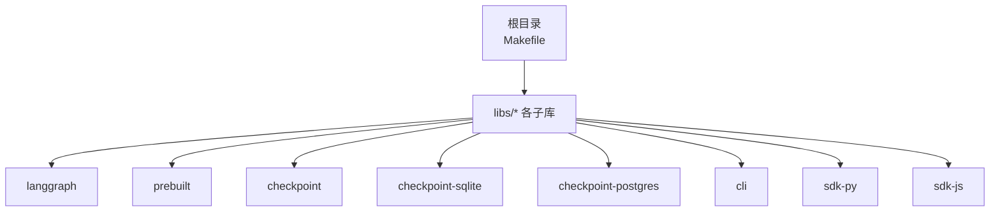
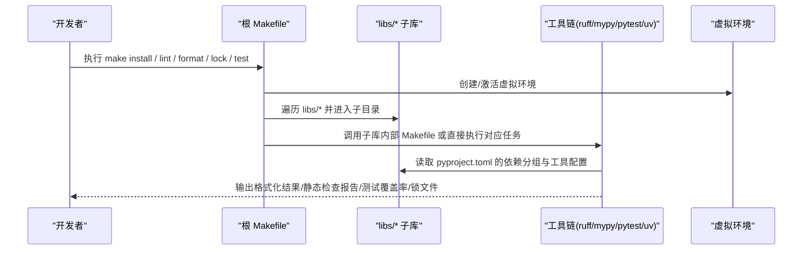
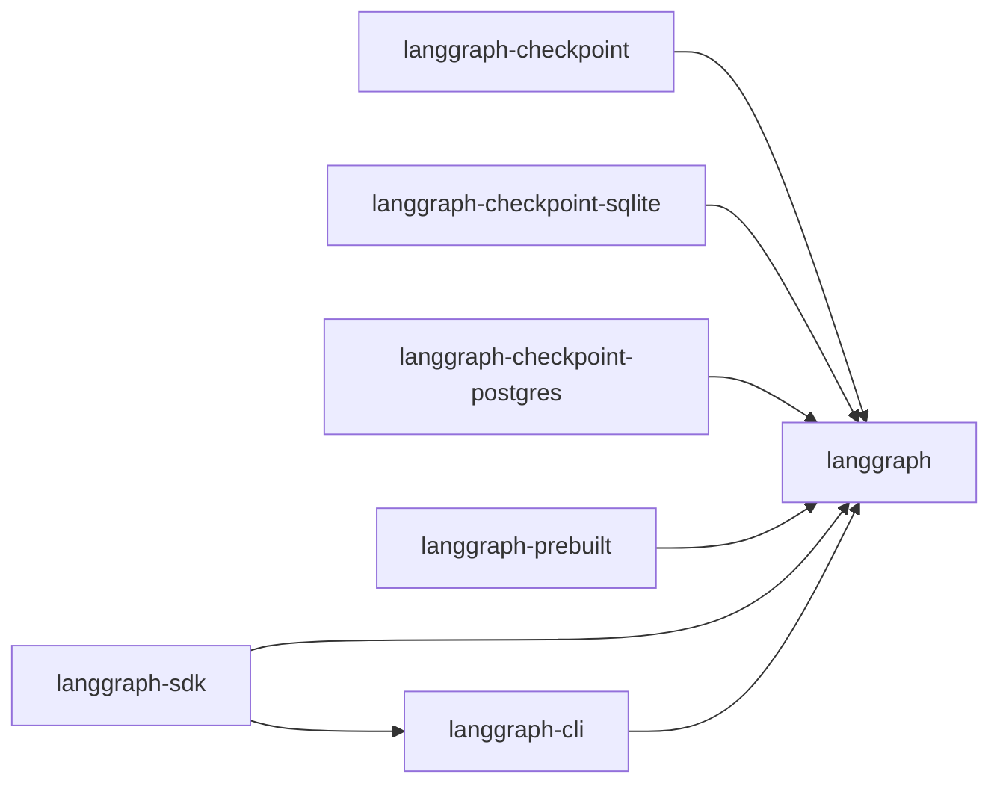

# 开发环境搭建

<cite>
**本文引用的文件**
- [README.md](file://README.md)
- [Makefile](file://Makefile)
- [CLAUDE.md](file://CLAUDE.md)
- [AGENTS.md](file://AGENTS.md)
- [examples/README.md](file://examples/README.md)
- [libs/langgraph/pyproject.toml](file://libs/langgraph/pyproject.toml)
- [libs/cli/pyproject.toml](file://libs/cli/pyproject.toml)
- [libs/prebuilt/pyproject.toml](file://libs/prebuilt/pyproject.toml)
- [libs/checkpoint/pyproject.toml](file://libs/checkpoint/pyproject.toml)
</cite>

## 目录
1. [简介](#简介)
2. [项目结构](#项目结构)
3. [核心组件](#核心组件)
4. [架构总览](#架构总览)
5. [详细组件分析](#详细组件分析)
6. [依赖分析](#依赖分析)
7. [性能考虑](#性能考虑)
8. [故障排查指南](#故障排查指南)
9. [结论](#结论)
10. [附录](#附录)

## 简介
本指南面向希望在本地搭建 LangGraph 开发生态的开发者，覆盖以下内容：
- Python 环境与工具链准备（uv、Python 版本要求）
- 依赖安装与项目初始化流程
- Makefile 提供的开发命令与脚本用法
- 代码格式化、静态分析与测试配置
- 开发调试技巧与最佳实践
- 常见问题排查与解决方案

LangGraph 采用多库（monorepo）结构，核心库与周边库通过可编辑安装与统一的构建/测试工具协同工作。

章节来源
- [README.md:1-83](file://README.md#L1-L83)

## 项目结构
仓库为多库（monorepo）结构，根目录包含 Makefile 与各子库（libs 下的多个包），每个子库均维护独立的 pyproject.toml，定义构建系统、依赖分组与开发工具配置。根 Makefile 负责对所有 libs 子目录执行统一的开发任务（格式化、静态检查、锁定依赖、测试等）。

图表来源
- [Makefile:1-68](file://Makefile#L1-L68)
- [libs/langgraph/pyproject.toml:1-129](file://libs/langgraph/pyproject.toml#L1-L129)
- [libs/prebuilt/pyproject.toml:1-97](file://libs/prebuilt/pyproject.toml#L1-L97)
- [libs/checkpoint/pyproject.toml:1-82](file://libs/checkpoint/pyproject.toml#L1-L82)
- [libs/cli/pyproject.toml:1-79](file://libs/cli/pyproject.toml#L1-L79)

章节来源
- [Makefile:1-68](file://Makefile#L1-L68)
- [CLAUDE.md:19-53](file://CLAUDE.md#L19-L53)
- [AGENTS.md:19-53](file://AGENTS.md#L19-L53)

## 核心组件
- 根级 Makefile：提供 install、lint、format、lock、lock-upgrade、test 等统一开发命令，遍历 libs/* 子目录并调用其内部 Makefile 或直接执行对应任务。
- 各子库 pyproject.toml：定义构建后端、依赖分组（test、lint、dev）、工具配置（ruff、mypy、pytest、hatch 等），并声明可编辑源路径以支持本地联调。
- CLI 工具链：langgraph-cli 提供命令行入口与相关脚本，便于本地开发与部署前的配置生成。

章节来源
- [Makefile:8-68](file://Makefile#L8-L68)
- [libs/langgraph/pyproject.toml:45-129](file://libs/langgraph/pyproject.toml#L45-L129)
- [libs/cli/pyproject.toml:36-79](file://libs/cli/pyproject.toml#L36-L79)

## 架构总览
下图展示根 Makefile 如何协调各子库的开发任务，并结合 pyproject.toml 的依赖分组与工具配置，形成统一的开发流水线。

图表来源
- [Makefile:8-68](file://Makefile#L8-L68)
- [libs/langgraph/pyproject.toml:45-129](file://libs/langgraph/pyproject.toml#L45-L129)
- [libs/prebuilt/pyproject.toml:37-97](file://libs/prebuilt/pyproject.toml#L37-L97)
- [libs/checkpoint/pyproject.toml:25-82](file://libs/checkpoint/pyproject.toml#L25-L82)
- [libs/cli/pyproject.toml:39-79](file://libs/cli/pyproject.toml#L39-L79)

## 详细组件分析

### 1) Python 环境与工具链准备
- Python 版本要求：各子库的 requires-python 均为 3.10 及以上，建议使用 3.10–3.13 之间的版本进行开发与测试。
- 包管理器：推荐使用 uv 作为包管理与虚拟环境工具，根 Makefile 默认使用 uv 创建虚拟环境并安装各子库的可编辑依赖。
- 可选工具：ruff（格式化与静态检查）、mypy（类型检查）、pytest（测试框架）、hatch（构建后端）等由各子库的 pyproject.toml 统一声明。

章节来源
- [libs/langgraph/pyproject.toml:10, 26-33:10-33](file://libs/langgraph/pyproject.toml#L10-L33)
- [libs/prebuilt/pyproject.toml:10, 26-29:10-29](file://libs/prebuilt/pyproject.toml#L10-L29)
- [libs/checkpoint/pyproject.toml:10, 14-17:10-17](file://libs/checkpoint/pyproject.toml#L10-L17)
- [libs/cli/pyproject.toml:10, 14-21:10-21](file://libs/cli/pyproject.toml#L10-L21)
- [Makefile:11-18](file://Makefile#L11-L18)

### 2) 依赖安装与项目初始化
- 初始化步骤（推荐）：
  - 在根目录创建虚拟环境并安装所有子库的可编辑依赖。
  - 安装完成后，可在任意子库目录运行该子库的开发命令（如 format、lint、test）。
- 注意事项：
  - 若子库未提供内部 Makefile，根 Makefile 会尝试直接在子库目录执行相应任务。
  - 锁定依赖时，根 Makefile 会在每个子库目录执行 uv lock 或 uv lock --upgrade。

章节来源
- [Makefile:10-18](file://Makefile#L10-L18)
- [Makefile:42-58](file://Makefile#L42-L58)

### 3) Makefile 开发命令详解
- all：默认目标，依次执行 lint、format、lock、test。
- install：创建虚拟环境并为每个子库执行可编辑安装。
- lint：遍历子库，若存在子库 Makefile 则在子目录执行 lint。
- format：遍历子库，若存在子库 Makefile 则在子目录执行 format。
- lock：遍历子库，执行 uv lock。
- lock-upgrade：遍历子库，执行 uv lock --upgrade。
- test：遍历子库，若存在子库 Makefile 则在子目录执行 test；否则跳过或按需处理。

章节来源
- [Makefile:4-68](file://Makefile#L4-L68)

### 4) 代码格式化、静态分析与测试配置
- 格式化与静态检查（ruff）：
  - 各子库在 pyproject.toml 中配置 ruff 的规则集、忽略项、行宽、缩进宽度、目标版本等。
  - 建议在提交前先执行 make format 与 make lint，确保风格一致。
- 类型检查（mypy）：
  - 各子库在 mypy 配置中设置严格选项，如 disallow_untyped_defs、warn_unused_ignores 等。
- 测试（pytest）：
  - 各子库在 pyproject.toml 中声明 test 分组依赖，包含 pytest、pytest-cov、pytest-mock、pytest-watcher 等。
  - pytest.ini_options 中设置严格标记与配置、持续时间统计等。
- 依赖锁定与开发组：
  - 各子库通过 tool.uv.default-groups 指定默认开发组（dev），包含 test 与 lint。
  - 可通过根 Makefile 的 lock/lock-upgrade 对所有子库执行依赖锁定。

章节来源
- [libs/langgraph/pyproject.toml:71-129](file://libs/langgraph/pyproject.toml#L71-L129)
- [libs/prebuilt/pyproject.toml:37-97](file://libs/prebuilt/pyproject.toml#L37-L97)
- [libs/checkpoint/pyproject.toml:25-82](file://libs/checkpoint/pyproject.toml#L25-L82)
- [libs/cli/pyproject.toml:39-79](file://libs/cli/pyproject.toml#L39-L79)
- [Makefile:20-68](file://Makefile#L20-L68)

### 5) 开发调试技巧与最佳实践
- 使用可编辑安装（-e）：通过 pyproject.toml 的 tool.uv.sources 将上游库指向本地 libs/* 子目录，实现“边改边测”。
- 单库调试：在具体子库目录执行 make format、make lint、make test，或使用 TEST 变量指定特定测试文件与参数。
- 自动重跑测试：部分子库启用 pytest-watcher，修改文件后自动触发测试。
- 依赖升级与锁定：使用 make lock-upgrade 更新依赖版本，再执行 make lock 固化版本。

章节来源
- [libs/langgraph/pyproject.toml:83-89](file://libs/langgraph/pyproject.toml#L83-L89)
- [libs/prebuilt/pyproject.toml:64-68](file://libs/prebuilt/pyproject.toml#L64-L68)
- [CLAUDE.md:5-17](file://CLAUDE.md#L5-L17)
- [AGENTS.md:5-17](file://AGENTS.md#L5-L17)

### 6) 示例与文档位置
- examples 目录用于归档，最新示例与教程已迁移至 LangChain 官方文档，请参考官方链接获取最新示例与使用指南。

章节来源
- [examples/README.md:1-4](file://examples/README.md#L1-L4)

## 依赖分析
下图展示各子库之间的依赖关系与可编辑源映射，帮助理解本地联调时的依赖流向。

图表来源
- [libs/langgraph/pyproject.toml:83-89](file://libs/langgraph/pyproject.toml#L83-L89)
- [libs/prebuilt/pyproject.toml:64-68](file://libs/prebuilt/pyproject.toml#L64-L68)
- [libs/cli/pyproject.toml:14-21](file://libs/cli/pyproject.toml#L14-L21)

章节来源
- [libs/langgraph/pyproject.toml:83-89](file://libs/langgraph/pyproject.toml#L83-L89)
- [libs/prebuilt/pyproject.toml:64-68](file://libs/prebuilt/pyproject.toml#L64-L68)
- [libs/cli/pyproject.toml:14-21](file://libs/cli/pyproject.toml#L14-L21)

## 性能考虑
- 测试性能：部分子库引入 pyperf、py-spy 等工具，可用于基准测试与性能剖析。
- 并行测试：pytest-xdist 支持并行执行，提升测试吞吐。
- 依赖锁定：使用 uv lock 固化依赖版本，减少 CI/本地差异导致的性能波动。

章节来源
- [libs/langgraph/pyproject.toml:63-67](file://libs/langgraph/pyproject.toml#L63-L67)
- [libs/langgraph/pyproject.toml:54-55](file://libs/langgraph/pyproject.toml#L54-L55)
- [Makefile:42-58](file://Makefile#L42-L58)

## 故障排查指南
- Python 版本不匹配
  - 症状：安装失败或运行时报错。
  - 处理：确保 Python 版本满足 requires-python（3.10+），并在 uv 虚拟环境中执行。
- 依赖解析冲突
  - 症状：uv 安装卡住或报错。
  - 处理：先执行 make lock-upgrade 更新版本，再执行 make lock 固化；必要时清理缓存后重试。
- 子库无内部 Makefile
  - 症状：根 Makefile 无法在子库执行对应目标。
  - 处理：在子库目录直接使用对应工具（ruff/mypy/pytest 等）或为子库补充 Makefile。
- 测试未触发或未自动重跑
  - 症状：修改文件后无反应。
  - 处理：确认子库是否启用 pytest-watcher；检查 runner_args 与 patterns 设置；确保安装了 dev 组依赖。
- CLI 配置校验错误
  - 症状：langgraph-cli 校验失败（如版本格式、认证/加密路径格式、HTTP 应用入口格式等）。
  - 处理：根据错误提示修正配置字段格式与最小版本要求；确保使用 uv 源管理且提供依赖列表。

章节来源
- [Makefile:11-18](file://Makefile#L11-L18)
- [libs/langgraph/pyproject.toml:10, 45-80:10-80](file://libs/langgraph/pyproject.toml#L10-L80)
- [libs/cli/pyproject.toml:14-21](file://libs/cli/pyproject.toml#L14-L21)
- [libs/cli/langgraph_cli/config.py:255-284](file://libs/cli/langgraph_cli/config.py#L255-L284)
- [libs/cli/langgraph_cli/config.py:345-375](file://libs/cli/langgraph_cli/config.py#L345-L375)
- [libs/cli/langgraph_cli/config.py:1060-1084](file://libs/cli/langgraph_cli/config.py#L1060-L1084)

## 结论
通过根 Makefile 与各子库 pyproject.toml 的协同，LangGraph 提供了统一、可扩展的开发与测试流水线。建议遵循以下步骤完成本地开发环境搭建：
- 使用 uv 创建虚拟环境并安装所有子库的可编辑依赖；
- 在子库目录执行 format、lint、test 以保证质量；
- 使用 lock/lock-upgrade 管理依赖版本；
- 遇到问题时依据各子库的工具配置与错误提示定位修复。

## 附录
- 官方文档与示例：请参考 README 中的官方文档链接获取最新示例与使用指南。
- 示例归档说明：examples 目录仅保留归档用途，示例已迁移至官方文档。

章节来源
- [README.md:61-76](file://README.md#L61-L76)
- [examples/README.md:1-4](file://examples/README.md#L1-L4)