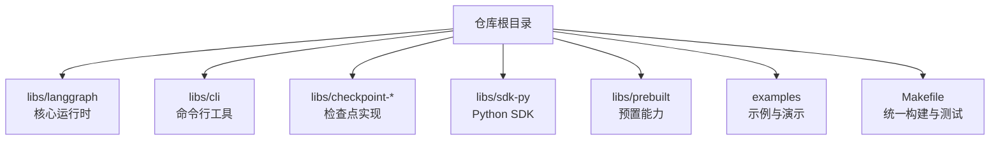
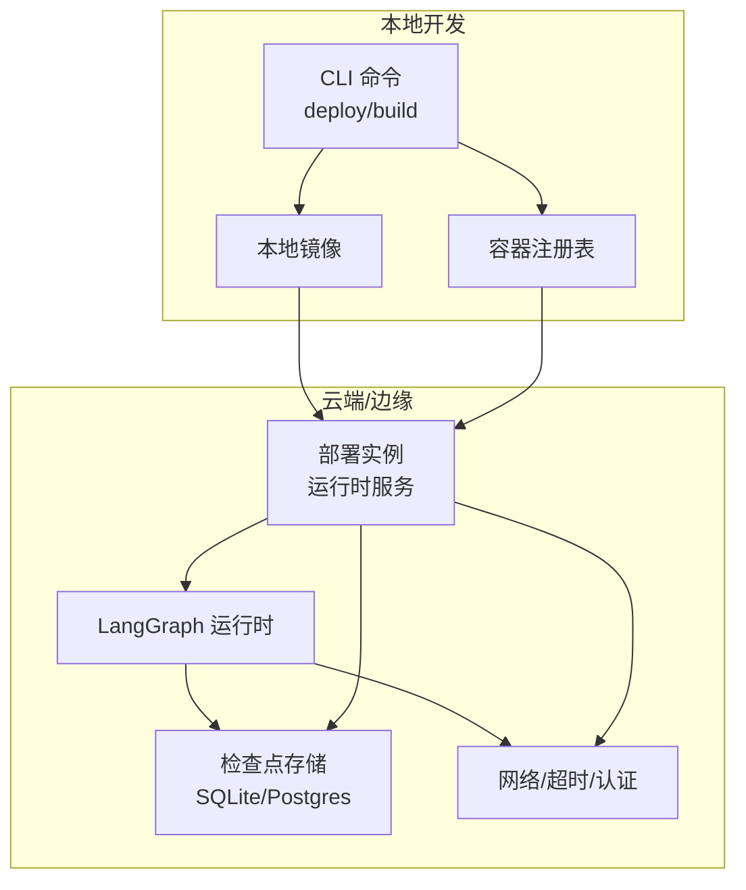
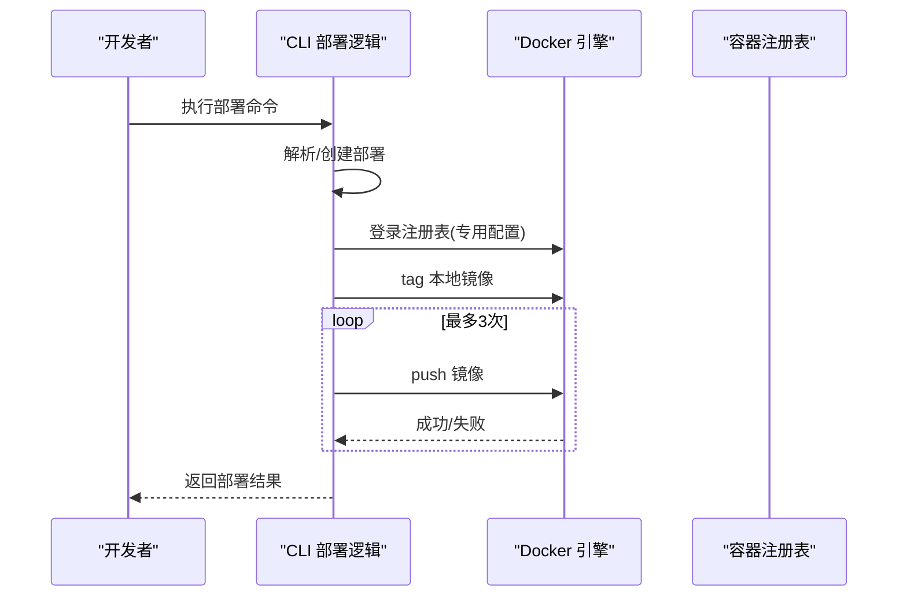
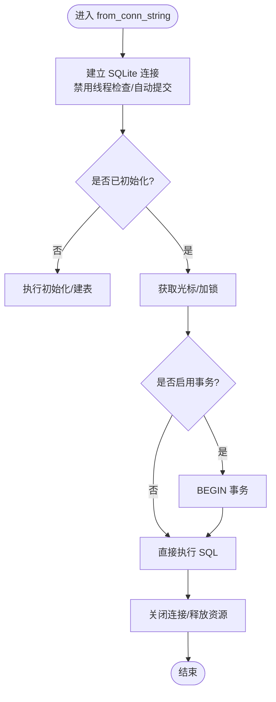
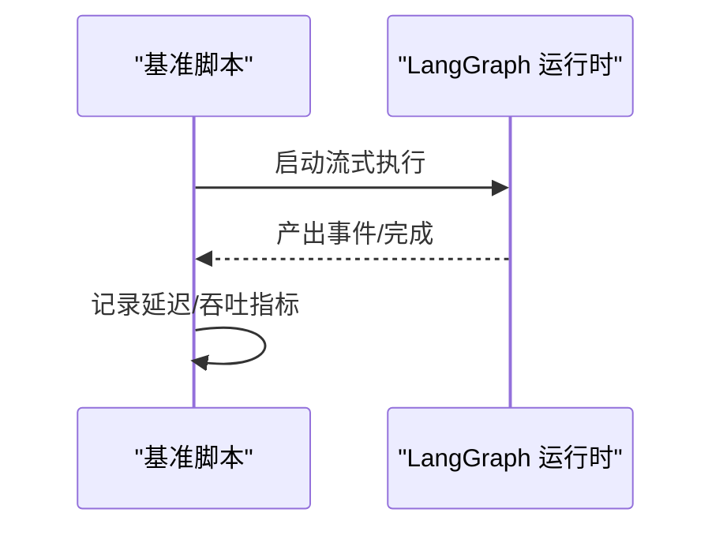
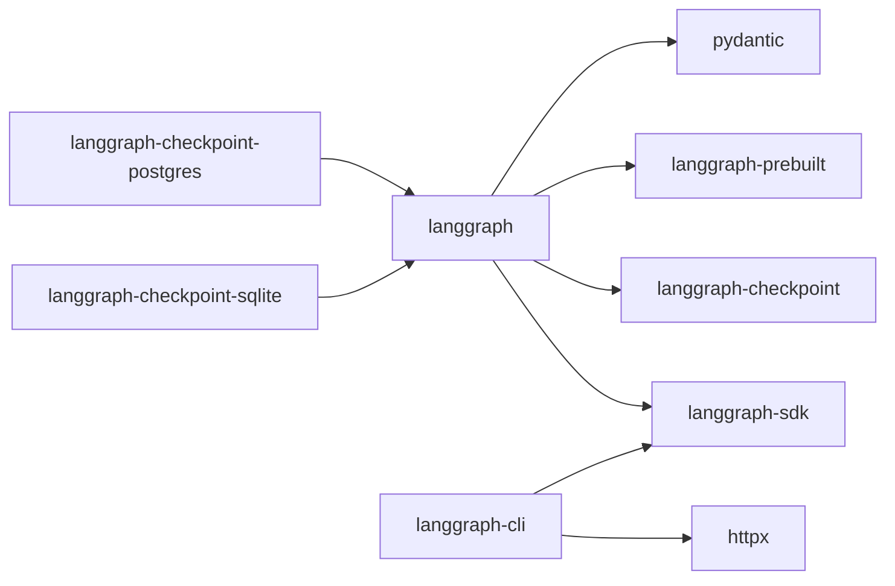

# 故障排除

<cite>
**本文引用的文件**
- [README.md](file://README.md)
- [Makefile](file://Makefile)
- [libs/langgraph/pyproject.toml](file://libs/langgraph/pyproject.toml)
- [libs/cli/pyproject.toml](file://libs/cli/pyproject.toml)
- [libs/cli/langgraph_cli/deploy.py](file://libs/cli/langgraph_cli/deploy.py)
- [libs/cli/langgraph_cli/config.py](file://libs/cli/langgraph_cli/config.py)
- [libs/checkpoint-sqlite/langgraph/store/sqlite/base.py](file://libs/checkpoint-sqlite/langgraph/store/sqlite/base.py)
- [libs/langgraph/bench/__main__.py](file://libs/langgraph/bench/__main__.py)
- [libs/checkpoint-conformance/langgraph/checkpoint/conformance/report.py](file://libs/checkpoint-conformance/langgraph/checkpoint/conformance/report.py)
</cite>

## 目录
1. [简介](#简介)
2. [项目结构](#项目结构)
3. [核心组件](#核心组件)
4. [架构总览](#架构总览)
5. [详细组件分析](#详细组件分析)
6. [依赖分析](#依赖分析)
7. [性能考虑](#性能考虑)
8. [故障排除指南](#故障排除指南)
9. [结论](#结论)
10. [附录](#附录)

## 简介
本指南面向在生产环境中使用 LangGraph 的工程团队与运维人员，聚焦于常见部署问题的诊断与解决，涵盖 Docker 相关问题、网络连接问题、数据库连接问题；提供错误日志分析与根因定位方法；给出性能问题排查流程（内存泄漏、CPU 占用过高、并发问题）；并包含应急响应流程与回滚策略，以及标准化的问题报告模板与信息收集清单。

## 项目结构
LangGraph 采用多库（monorepo）组织方式，核心库与相关工具分布在 libs 目录下，包含运行时、检查点存储、SDK、CLI 等模块。顶层 Makefile 提供统一的安装、格式化、锁定与测试流程；各子库通过 pyproject.toml 定义依赖与开发工具链。

图表来源
- [Makefile:1-68](file://Makefile#L1-L68)
- [libs/langgraph/pyproject.toml:1-129](file://libs/langgraph/pyproject.toml#L1-L129)
- [libs/cli/pyproject.toml:1-79](file://libs/cli/pyproject.toml#L1-L79)

章节来源
- [Makefile:1-68](file://Makefile#L1-L68)
- [README.md:1-83](file://README.md#L1-L83)

## 核心组件
- 运行时与调度：LangGraph 核心负责状态图执行、流式输出与持久化恢复，是大多数运行时问题的焦点。
- 检查点存储：SQLite/Postgres 等后端用于保存中间状态与元数据，是数据库连接问题的主要入口。
- CLI 部署：CLI 负责镜像构建、登录注册表、推送与远程/本地构建模式选择，是 Docker 与网络问题的关键节点。
- 性能基准：内置基准脚本与工具用于评估吞吐与延迟，辅助定位 CPU/并发瓶颈。
- 规范性报告：检查点规范验证工具用于确认实现能力与一致性，辅助回归与兼容性问题排查。

章节来源
- [libs/langgraph/pyproject.toml:26-33](file://libs/langgraph/pyproject.toml#L26-L33)
- [libs/cli/pyproject.toml:14-21](file://libs/cli/pyproject.toml#L14-L21)
- [libs/checkpoint-sqlite/langgraph/store/sqlite/base.py:927-967](file://libs/checkpoint-sqlite/langgraph/store/sqlite/base.py#L927-L967)
- [libs/langgraph/bench/__main__.py:1-48](file://libs/langgraph/bench/__main__.py#L1-L48)
- [libs/checkpoint-conformance/langgraph/checkpoint/conformance/report.py:1-40](file://libs/checkpoint-conformance/langgraph/checkpoint/conformance/report.py#L1-L40)

## 架构总览
下图展示从 CLI 到运行时与存储的典型部署与执行路径，帮助定位 Docker、网络与数据库三类问题。

图表来源
- [libs/cli/langgraph_cli/deploy.py:751-820](file://libs/cli/langgraph_cli/deploy.py#L751-L820)
- [libs/checkpoint-sqlite/langgraph/store/sqlite/base.py:927-967](file://libs/checkpoint-sqlite/langgraph/store/sqlite/base.py#L927-L967)
- [libs/langgraph/pyproject.toml:26-33](file://libs/langgraph/pyproject.toml#L26-L33)

## 详细组件分析

### 组件一：CLI 部署与 Docker 流程
- 登录注册表：CLI 使用专用 Docker 配置进行凭据注入，避免系统凭据助手干扰，支持重试推送。
- 镜像标签与推送：生成远端镜像名，执行 tag 与 push，并在失败时进行有限次重试。
- 部署解析与创建：根据主机 URL 与密钥创建后端客户端，解析或创建部署，确保部署 ID 可用。

图表来源
- [libs/cli/langgraph_cli/deploy.py:751-820](file://libs/cli/langgraph_cli/deploy.py#L751-L820)

章节来源
- [libs/cli/langgraph_cli/deploy.py:751-820](file://libs/cli/langgraph_cli/deploy.py#L751-L820)

### 组件二：检查点存储（SQLite）
- 连接字符串与上下文管理：通过连接字符串创建连接，禁用线程检查以支持异步/并发场景，自动提交模式。
- 光标与事务：使用锁保护数据库操作，按需开启事务，确保并发安全与一致性。
- 典型问题：连接字符串格式错误、并发写入冲突、事务未正确提交导致的数据不一致。

图表来源
- [libs/checkpoint-sqlite/langgraph/store/sqlite/base.py:927-967](file://libs/checkpoint-sqlite/langgraph/store/sqlite/base.py#L927-L967)

章节来源
- [libs/checkpoint-sqlite/langgraph/store/sqlite/base.py:927-967](file://libs/checkpoint-sqlite/langgraph/store/sqlite/base.py#L927-L967)

### 组件三：运行时与性能基准
- 运行时：LangGraph 核心负责状态图执行、流式输出与持久化恢复，是大多数运行时问题的焦点。
- 基准：提供异步执行与首事件延迟测量等基准能力，便于定位 CPU/并发瓶颈。

图表来源
- [libs/langgraph/bench/__main__.py:1-48](file://libs/langgraph/bench/__main__.py#L1-L48)

章节来源
- [libs/langgraph/bench/__main__.py:1-48](file://libs/langgraph/bench/__main__.py#L1-L48)

## 依赖分析
- LangGraph 运行时依赖 SDK、检查点、预置能力与序列化库，测试组包含性能与采样工具，便于定位性能问题。
- CLI 依赖 HTTP 客户端与 SDK，提供内存在线模式可选依赖，便于快速部署与调试。
- 检查点实现分别针对 SQLite 与 Postgres，测试覆盖 JSON 元数据查询与 TTL 等特性。

图表来源
- [libs/langgraph/pyproject.toml:26-33](file://libs/langgraph/pyproject.toml#L26-L33)
- [libs/cli/pyproject.toml:14-21](file://libs/cli/pyproject.toml#L14-L21)
- [libs/checkpoint-sqlite/langgraph/store/sqlite/base.py:927-967](file://libs/checkpoint-sqlite/langgraph/store/sqlite/base.py#L927-L967)

章节来源
- [libs/langgraph/pyproject.toml:26-33](file://libs/langgraph/pyproject.toml#L26-L33)
- [libs/cli/pyproject.toml:14-21](file://libs/cli/pyproject.toml#L14-L21)

## 性能考虑
- 事件循环与并发：运行时默认使用高性能事件循环，建议在高并发场景下评估线程模型与锁竞争。
- 序列化与状态大小：宽状态、大字典与频繁序列化会增加 CPU 与内存压力，应优化状态结构与序列化白名单。
- 数据库写入：SQLite 并发写入可能成为瓶颈，建议评估读写分离、连接池与事务批量提交策略。
- 基准与采样：使用内置基准与采样工具（如性能计数器）识别热点路径，结合火焰图与采样器定位 CPU 占用过高的函数。

章节来源
- [libs/langgraph/bench/__main__.py:1-48](file://libs/langgraph/bench/__main__.py#L1-L48)
- [libs/langgraph/pyproject.toml:63-69](file://libs/langgraph/pyproject.toml#L63-L69)

## 故障排除指南

### 一、Docker 相关问题
- 现象
  - 推送镜像失败或超时
  - 登录注册表失败或权限不足
  - 本地构建失败或依赖缺失
- 诊断步骤
  - 检查 CLI 登录流程与凭据注入是否成功，确认注册表主机与令牌格式
  - 查看推送重试日志，确认网络连通性与代理设置
  - 校验本地镜像标签与远端镜像命名规则，确保无特殊字符与长度限制
  - 若使用远程构建，确认构建模式解析与回退逻辑
- 解决方案
  - 使用专用 Docker 配置进行登录，避免系统凭据助手冲突
  - 在网络受限环境配置代理与超时参数
  - 清理构建缓存，重新执行本地构建或切换为远程构建
- 应急回滚
  - 回退到上一个稳定镜像标签，确保部署配置不变
  - 如远程构建失败，临时切换为本地构建并修复依赖

章节来源
- [libs/cli/langgraph_cli/deploy.py:751-820](file://libs/cli/langgraph_cli/deploy.py#L751-L820)

### 二、网络连接问题
- 现象
  - 无法访问注册表或 API
  - 运行时请求超时或认证失败
- 诊断步骤
  - 使用 CLI 创建后端客户端时，检查主机 URL 与 API 密钥
  - 校验 DNS 解析、防火墙与代理设置
  - 对比不同环境（开发/测试/生产）的网络策略
- 解决方案
  - 配置企业代理与 CA 证书，确保 TLS 互通
  - 为 API 设置合理的超时与重试策略
  - 使用内网域名或私有注册表降低外部依赖
- 应急回滚
  - 切换到备用注册表或离线镜像
  - 临时降级为本地运行模式（若可用）

章节来源
- [libs/cli/langgraph_cli/deploy.py:1283-1317](file://libs/cli/langgraph_cli/deploy.py#L1283-L1317)

### 三、数据库连接问题
- 现象
  - SQLite 连接失败或句柄泄漏
  - 并发写入冲突或事务未提交
- 诊断步骤
  - 检查连接字符串格式与文件权限
  - 关注线程模型与锁竞争，确认禁用线程检查与自动提交模式是否符合预期
  - 分析事务边界与异常处理，避免长事务占用
- 解决方案
  - 为 SQLite 配置合适的 WAL/页大小/同步策略
  - 限制并发写入，合并小事务，使用批量提交
  - 在应用层增加重试与指数退避
- 应急回滚
  - 回退到只读或内存模式（若适用）
  - 切换到 Postgres 等具备更强并发能力的存储

章节来源
- [libs/checkpoint-sqlite/langgraph/store/sqlite/base.py:927-967](file://libs/checkpoint-sqlite/langgraph/store/sqlite/base.py#L927-L967)

### 四、错误日志分析与根因定位
- 日志采集
  - CLI 部署阶段：关注登录、tag、push 与重试日志
  - 运行时阶段：捕获流式事件、异常堆栈与状态快照
  - 存储阶段：记录连接、事务与锁等待
- 分析方法
  - 以时间轴对齐部署、启动与异常发生点
  - 区分瞬时网络抖动与持续性配置错误
  - 结合基准与采样工具定位 CPU/内存热点
- 工具与指标
  - 使用内置基准脚本与性能计数器
  - 结合采样器与火焰图识别热点函数

章节来源
- [libs/cli/langgraph_cli/deploy.py:751-820](file://libs/cli/langgraph_cli/deploy.py#L751-L820)
- [libs/langgraph/bench/__main__.py:1-48](file://libs/langgraph/bench/__main__.py#L1-L48)

### 五、性能问题排查流程
- 内存泄漏
  - 步骤：对比长时间运行前后对象数量、引用关系与垃圾回收行为
  - 关注：状态对象缓存、事件流缓冲与序列化缓存
- CPU 占用过高
  - 步骤：采样热点函数，检查序列化开销与锁竞争
  - 关注：宽状态、深度递归与频繁 I/O
- 并发问题
  - 步骤：验证事务边界、锁粒度与重试策略
  - 关注：SQLite 并发写入与存储层限流

章节来源
- [libs/langgraph/bench/__main__.py:1-48](file://libs/langgraph/bench/__main__.py#L1-L48)
- [libs/checkpoint-sqlite/langgraph/store/sqlite/base.py:927-967](file://libs/checkpoint-sqlite/langgraph/store/sqlite/base.py#L927-L967)

### 六、应急响应流程与回滚策略
- 应急响应
  - 立即隔离受影响实例，停止新流量进入
  - 快速回滚到上一个稳定版本/镜像
  - 切换到备用注册表或离线镜像
  - 临时降级为本地运行模式（若可用）
- 回滚策略
  - 保留最近 N 个稳定镜像标签，确保可回溯
  - 部署配置与存储迁移脚本需可逆
  - 回滚后进行最小范围的功能验证

章节来源
- [libs/cli/langgraph_cli/deploy.py:751-820](file://libs/cli/langgraph_cli/deploy.py#L751-L820)

### 七、问题报告标准格式与信息收集清单
- 报告模板
  - 事件摘要：简述现象、影响范围与时间窗口
  - 复现步骤：最小可复现步骤与前置条件
  - 影响面：涉及的组件、服务与数据范围
  - 诊断证据：日志片段、指标截图、配置差异
  - 根因分析：基于证据的推断与假设验证
  - 处理过程：采取的措施与效果
  - 改进计划：修复、加固与预防措施
- 信息收集清单
  - 版本与构建：LangGraph、CLI、运行时与存储版本
  - 环境变量与配置：注册表、网络、数据库连接串
  - 日志与指标：CLI 部署日志、运行时事件流、数据库慢查询
  - 基准与采样：CPU/内存/延迟基准结果与火焰图
  - 配置文件：部署配置、Dockerfile 与检查点配置

## 结论
通过将 CLI 部署、运行时执行与存储层串联起来，可以系统化地定位与解决 Docker、网络与数据库三大类问题。配合基准与采样工具，能够高效识别性能瓶颈并制定针对性优化策略。建议在生产中建立标准化的应急回滚与问题报告流程，确保快速恢复与持续改进。

## 附录
- 参考文档与生态：LangGraph 文档、LangSmith 观测平台、部署指南与社区论坛
- 开发与测试：统一 Makefile 流程、依赖锁定与测试覆盖

章节来源
- [README.md:61-76](file://README.md#L61-L76)
- [Makefile:1-68](file://Makefile#L1-L68)