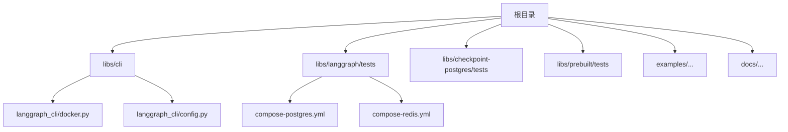
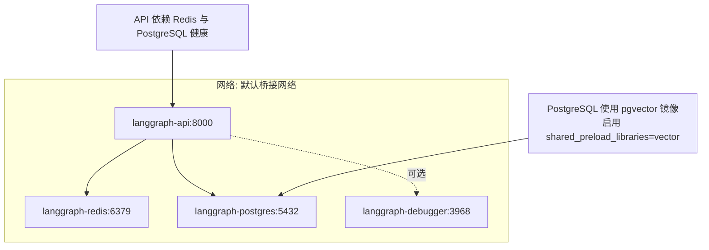
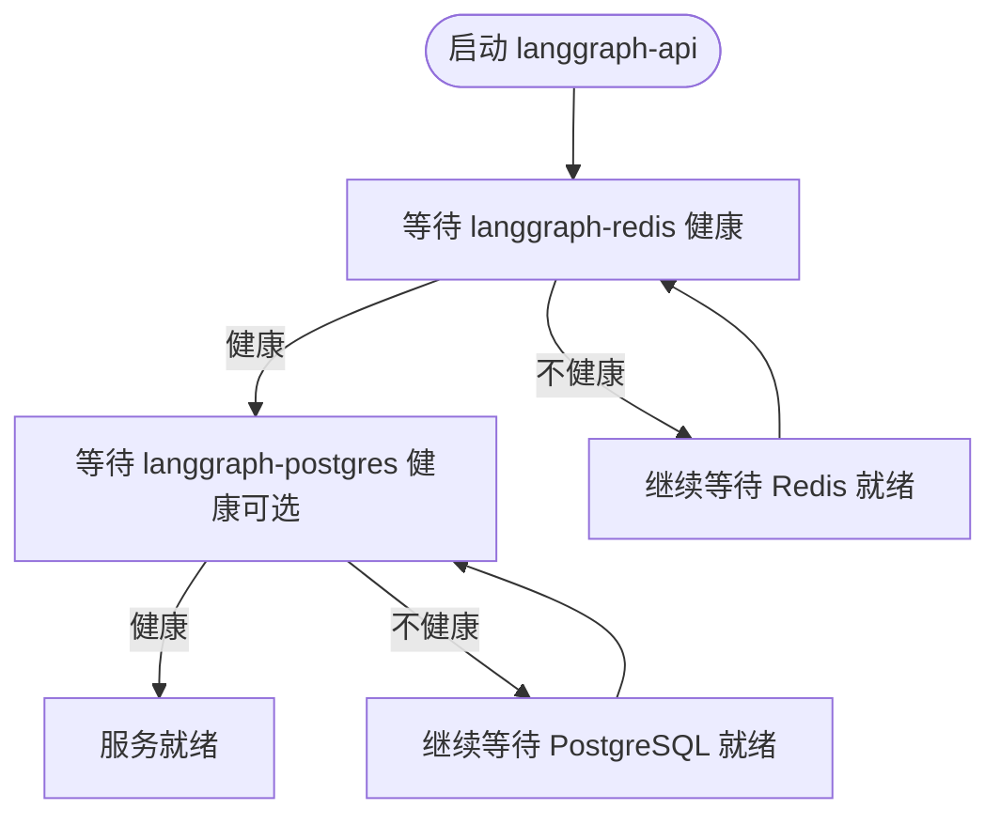
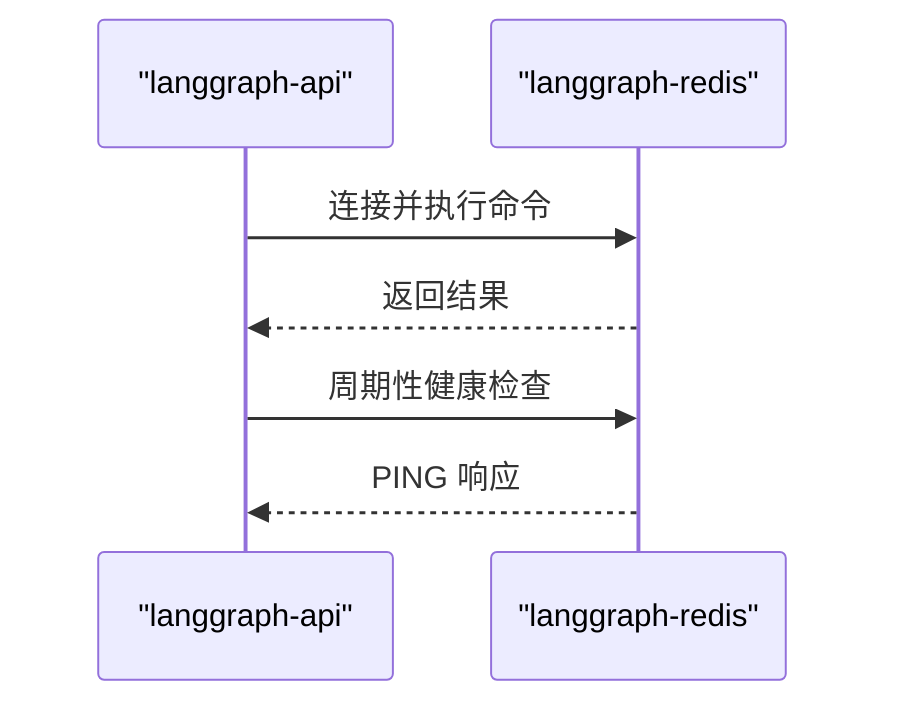
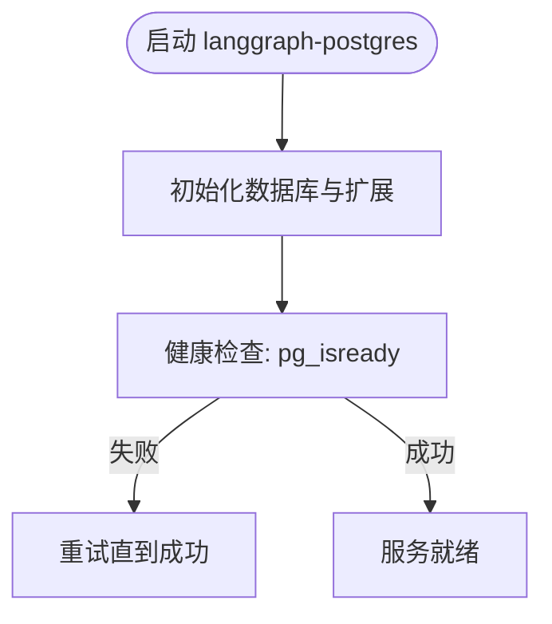
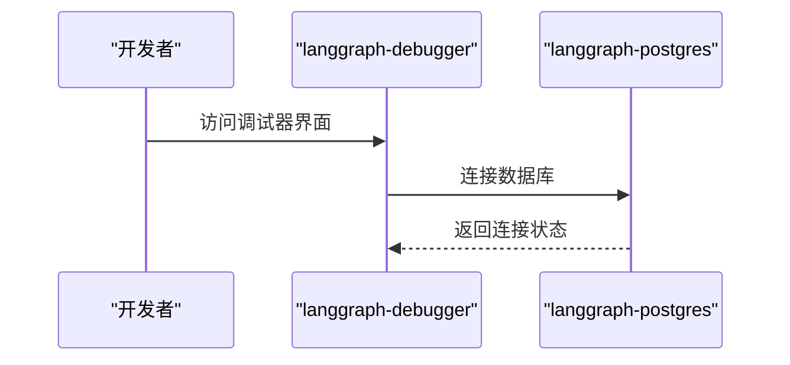
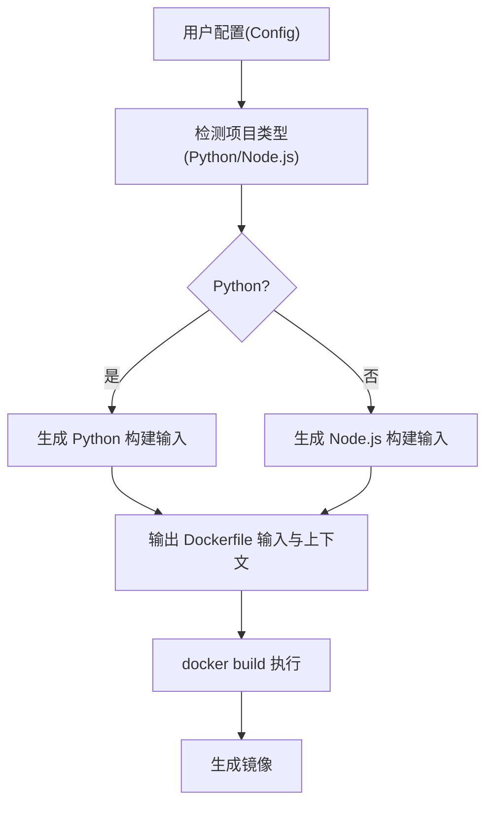
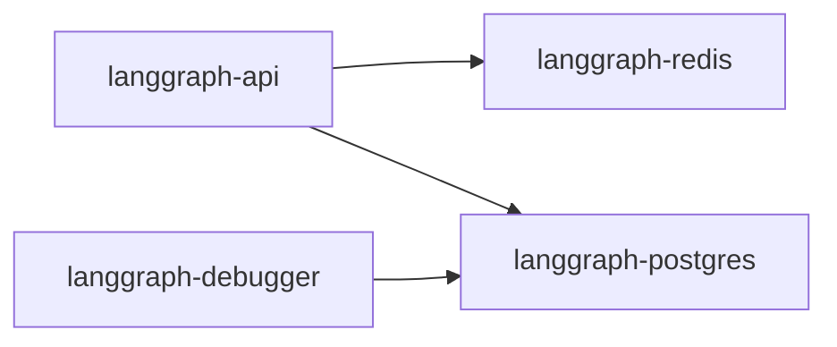

# 生产环境部署

<cite>
**本文引用的文件**
- [README.md](file://README.md)
- [docker.py](file://libs/cli/langgraph_cli/docker.py)
- [config.py](file://libs/cli/langgraph_cli/config.py)
- [compose-postgres.yml（langgraph 测试）](file://libs/langgraph/tests/compose-postgres.yml)
- [compose-redis.yml（langgraph 测试）](file://libs/langgraph/tests/compose-redis.yml)
- [Makefile](file://Makefile)
</cite>

## 目录
1. [简介](#简介)
2. [项目结构](#项目结构)
3. [核心组件](#核心组件)
4. [架构总览](#架构总览)
5. [详细组件分析](#详细组件分析)
6. [依赖分析](#依赖分析)
7. [性能考虑](#性能考虑)
8. [故障排查指南](#故障排查指南)
9. [结论](#结论)
10. [附录](#附录)

## 简介
本指南面向在生产环境中部署 LangGraph 的工程团队，聚焦容器化与多服务编排，覆盖以下主题：
- 基于 Docker 的容器化方案与 Docker Compose 编排
- 多服务架构：API 服务器、Redis、PostgreSQL 的配置与依赖关系
- 环境变量、网络与存储卷管理
- 不同部署场景：单机、集群、云平台
- 部署前检查清单与部署后验证步骤

LangGraph 在仓库中提供了 CLI 工具用于生成 Docker Compose 配置，以及测试用的 Redis/PostgreSQL 示例，这些是构建生产部署的基础。

章节来源
- [README.md: 1-83:1-83](file://README.md#L1-L83)

## 项目结构
仓库采用多库（monorepo）结构，生产部署相关的实现主要集中在 CLI 库中，同时在各子库中包含测试用的 Compose 片段，便于理解服务编排模式。

图表来源
- [docker.py: 190-330:190-330](file://libs/cli/langgraph_cli/docker.py#L190-L330)
- [compose-postgres.yml（langgraph 测试）: 1-18:1-18](file://libs/langgraph/tests/compose-postgres.yml#L1-L18)
- [compose-redis.yml（langgraph 测试）: 1-17:1-17](file://libs/langgraph/tests/compose-redis.yml#L1-L17)

章节来源
- [Makefile: 1-68:1-68](file://Makefile#L1-L68)

## 核心组件
- Docker Compose 生成器：负责根据运行时能力与参数生成完整的 Compose 配置，支持本地调试器、自定义数据库连接串、镜像标签、分布式/队列工作模式等。
- 配置到 Docker 映像转换：将用户配置转换为可构建的 Dockerfile 输入与上下文，支持 Python/Node.js 项目。
- 测试用 Compose 片段：提供 Redis 与 PostgreSQL 的最小可用示例，便于理解服务健康检查、端口映射与数据持久化。

章节来源
- [docker.py: 100-142:100-142](file://libs/cli/langgraph_cli/docker.py#L100-L142)
- [docker.py: 190-330:190-330](file://libs/cli/langgraph_cli/docker.py#L190-L330)
- [config.py: 1439-1481:1439-1481](file://libs/cli/langgraph_cli/config.py#L1439-L1481)
- [compose-postgres.yml（langgraph 测试）: 1-18:1-18](file://libs/langgraph/tests/compose-postgres.yml#L1-L18)
- [compose-redis.yml（langgraph 测试）: 1-17:1-17](file://libs/langgraph/tests/compose-redis.yml#L1-L17)

## 架构总览
LangGraph 生产部署的核心由三类服务组成：
- API 服务器：对外提供服务，依赖 Redis 进行任务队列与状态缓存，依赖 PostgreSQL 存储检查点与向量数据。
- Redis：作为消息队列与会话缓存，需健康检查保障可用性。
- PostgreSQL（含向量扩展）：持久化检查点、会话状态与向量索引，使用专用镜像以启用向量扩展。

图表来源
- [docker.py: 219-301:219-301](file://libs/cli/langgraph_cli/docker.py#L219-L301)
- [compose-postgres.yml（langgraph 测试）: 3-17:3-17](file://libs/langgraph/tests/compose-postgres.yml#L3-L17)
- [compose-redis.yml（langgraph 测试）: 3-16:3-16](file://libs/langgraph/tests/compose-redis.yml#L3-L16)

## 详细组件分析

### API 服务器（langgraph-api）
- 端口映射：默认暴露 8000 端口，可通过参数映射到宿主机端口。
- 依赖关系：
  - 必须等待 Redis 就绪（健康检查通过）。
  - 若包含内置 PostgreSQL，则需等待其健康检查通过。
- 环境变量：
  - REDIS_URI：指向内部网络中的 Redis 地址。
  - POSTGRES_URI：指向内部网络中的 PostgreSQL 地址；若未提供则使用内置默认值。
  - 分布式运行模式下，会设置 N_JOBS_PER_WORKER 为 0，以启用分布式队列工作模式。
- 健康检查：当 Docker 引擎版本满足条件时，会添加健康检查，检测 /api/healthcheck.py 脚本返回。

图表来源
- [docker.py: 263-294:263-294](file://libs/cli/langgraph_cli/docker.py#L263-L294)

章节来源
- [docker.py: 263-294:263-294](file://libs/cli/langgraph_cli/docker.py#L263-L294)

### Redis（langgraph-redis）
- 镜像：官方 Redis 6.x。
- 健康检查：通过 redis-cli ping 检测，间隔与重试策略已配置。
- 端口映射：默认 6379，测试样例展示了端口映射方式。
- 注意：生产中建议使用持久化策略与资源限制，避免内存压力导致的淘汰影响。

图表来源
- [docker.py: 220-229:220-229](file://libs/cli/langgraph_cli/docker.py#L220-L229)
- [compose-redis.yml（langgraph 测试）: 8-14:8-14](file://libs/langgraph/tests/compose-redis.yml#L8-L14)

章节来源
- [docker.py: 220-229:220-229](file://libs/cli/langgraph_cli/docker.py#L220-L229)
- [compose-redis.yml（langgraph 测试）: 1-17:1-17](file://libs/langgraph/tests/compose-redis.yml#L1-L17)

### PostgreSQL（langgraph-postgres）
- 镜像：pgvector/pgvector:pg16，启用向量扩展。
- 命令：以指定共享预加载库启动，确保向量扩展可用。
- 环境变量：数据库名、用户名、密码。
- 数据卷：使用命名卷持久化数据。
- 健康检查：使用 pg_isready 检查数据库可用性，带起始间隔与重试策略。
- 端口映射：默认 5433:5432，避免与宿主冲突。

图表来源
- [docker.py: 233-249:233-249](file://libs/cli/langgraph_cli/docker.py#L233-L249)
- [compose-postgres.yml（langgraph 测试）: 11-17:11-17](file://libs/langgraph/tests/compose-postgres.yml#L11-L17)

章节来源
- [docker.py: 233-249:233-249](file://libs/cli/langgraph_cli/docker.py#L233-L249)
- [compose-postgres.yml（langgraph 测试）: 1-18:1-18](file://libs/langgraph/tests/compose-postgres.yml#L1-L18)

### 可选：调试器（langgraph-debugger）
- 镜像：langchain/langgraph-debugger。
- 端口映射：默认 3968，可通过参数映射到宿主机。
- 依赖：必须等待 PostgreSQL 健康（当使用内置数据库时）。
- 环境变量：可设置本地图形 URL，便于本地联调。

图表来源
- [docker.py: 145-165:145-165](file://libs/cli/langgraph_cli/docker.py#L145-L165)

章节来源
- [docker.py: 145-165:145-165](file://libs/cli/langgraph_cli/docker.py#L145-L165)

### 配置到 Docker 映像转换（Python/Node.js）
- 支持从配置生成可构建的 Docker 输入，自动处理项目类型识别（Python/Node.js）、基础镜像选择、安装与构建命令注入、额外构建上下文等。
- 对 Python 项目，提供基于 uv 的锁定与安装流程；对 Node.js 项目，支持安装与构建命令注入。

图表来源
- [config.py: 1439-1481:1439-1481](file://libs/cli/langgraph_cli/config.py#L1439-L1481)

章节来源
- [config.py: 1439-1481:1439-1481](file://libs/cli/langgraph_cli/config.py#L1439-L1481)

## 依赖分析
- 组件内聚与耦合：
  - API 服务器与 Redis/PostgreSQL 的耦合度高，通过健康检查与依赖声明保证启动顺序。
  - 调试器与 PostgreSQL 的耦合度高，仅在需要可视化调试时启用。
- 外部依赖：
  - Docker 与 Docker Compose（CLI 工具会检测版本与能力）。
  - pgvector 镜像用于向量扩展。
- 潜在循环依赖：
  - 无直接循环依赖，服务间通过健康检查与 depends_on 解耦。

图表来源
- [docker.py: 272-284:272-284](file://libs/cli/langgraph_cli/docker.py#L272-L284)

章节来源
- [docker.py: 272-284:272-284](file://libs/cli/langgraph_cli/docker.py#L272-L284)

## 性能考虑
- Redis 内存与淘汰策略：生产中建议设置合理的 maxmemory 与淘汰策略，避免 OOM 导致的任务丢失或延迟。
- PostgreSQL 向量扩展：启用 shared_preload_libraries=vector 会增加启动时间与内存占用，建议在专用实例上运行并预留足够资源。
- 健康检查间隔：根据服务规模调整健康检查间隔与超时，避免频繁探针造成额外负载。
- 镜像与构建：优先使用稳定的基础镜像与锁定依赖，减少构建时间与镜像体积。

## 故障排查指南
- Docker/Compose 能力检测失败
  - 症状：提示 Docker 或 Compose 未安装或未运行。
  - 排查：确认 Docker 服务状态、版本与 Compose 插件/独立版本匹配。
  - 参考路径：[docker.py: 100-142:100-142](file://libs/cli/langgraph_cli/docker.py#L100-L142)
- API 无法启动或频繁重启
  - 症状：健康检查失败。
  - 排查：检查 Redis 与 PostgreSQL 是否健康；核对 REDIS_URI/POSTGRES_URI；查看日志与健康检查脚本。
  - 参考路径：[docker.py: 287-294:287-294](file://libs/cli/langgraph_cli/docker.py#L287-L294)
- PostgreSQL 无法连接或启动缓慢
  - 症状：健康检查失败、启动时间过长。
  - 排查：确认数据卷挂载、共享库加载、端口映射；必要时增加资源限制。
  - 参考路径：[docker.py: 233-249:233-249](file://libs/cli/langgraph_cli/docker.py#L233-L249)
- Redis 连接异常或内存不足
  - 症状：任务积压、连接失败。
  - 排查：检查 maxmemory 与淘汰策略；确认 tmpfs 使用是否合理。
  - 参考路径：[compose-redis.yml（langgraph 测试）: 7-16:7-16](file://libs/langgraph/tests/compose-redis.yml#L7-L16)

章节来源
- [docker.py: 100-142:100-142](file://libs/cli/langgraph_cli/docker.py#L100-L142)
- [docker.py: 233-249:233-249](file://libs/cli/langgraph_cli/docker.py#L233-L249)
- [docker.py: 287-294:287-294](file://libs/cli/langgraph_cli/docker.py#L287-L294)
- [compose-redis.yml（langgraph 测试）: 7-16:7-16](file://libs/langgraph/tests/compose-redis.yml#L7-L16)

## 结论
通过 CLI 工具生成的 Compose 配置，LangGraph 可以在生产环境中以“API + Redis + PostgreSQL（可选）+ 调试器（可选）”的多服务架构稳定运行。遵循本文档的环境变量、网络与存储卷管理建议，并结合健康检查与资源规划，可在单机、集群与云平台上实现可靠的部署与运维。

## 附录

### 部署前检查清单
- 本地/CI 环境
  - Docker 与 Docker Compose 已安装且版本满足要求
  - 有权限执行 docker build 与 docker compose
- 网络与安全
  - 防火墙放行 API 端口（默认 8000）
  - Redis/PostgreSQL 端口在内网可达
  - 如使用外部数据库/缓存，提前准备连接串与证书
- 存储与备份
  - PostgreSQL 数据卷已正确挂载并具备备份策略
  - Redis 内存与持久化策略符合预期
- 配置项
  - REDIS_URI/POSTGRES_URI 正确指向目标服务
  - 分布式运行模式按需设置 N_JOBS_PER_WORKER
  - 如启用调试器，确保端口映射与本地图形 URL 设置正确

### 部署后验证步骤
- 服务健康
  - docker compose ps 查看所有服务状态
  - docker compose logs 查看关键服务日志
- 功能验证
  - 访问 API 服务健康端点（如 /health）
  - 执行一次简单推理或检查点操作，确认 Redis 与 PostgreSQL 协同工作
- 性能与容量
  - 观察 Redis 内存使用与淘汰事件
  - 监控 PostgreSQL 查询与向量索引性能

### 不同部署场景示例

- 单机部署（本地开发/演示）
  - 使用内置 PostgreSQL 与 Redis，端口映射到宿主机，便于快速验证。
  - 参考路径：[docker.py: 219-301:219-301](file://libs/cli/langgraph_cli/docker.py#L219-L301)
- 集群部署（Kubernetes/Docker Swarm）
  - 将 Compose 生成的配置转换为对应编排格式；为 Redis/PostgreSQL 提供高可用与持久化存储；为 API 服务设置副本与滚动更新策略。
  - 参考路径：[docker.py: 190-330:190-330](file://libs/cli/langgraph_cli/docker.py#L190-L330)
- 云平台部署（AWS/GCP/Azure）
  - 使用托管 Redis/PostgreSQL（如云数据库服务），在 Compose 中替换 REDIS_URI/POSTGRES_URI 指向云服务地址；为 API 服务配置弹性伸缩与安全组。
  - 参考路径：[docker.py: 190-330:190-330](file://libs/cli/langgraph_cli/docker.py#L190-L330)