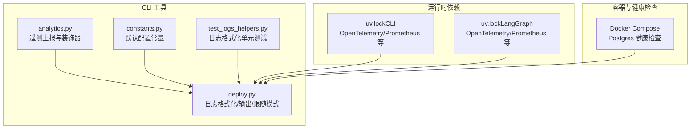
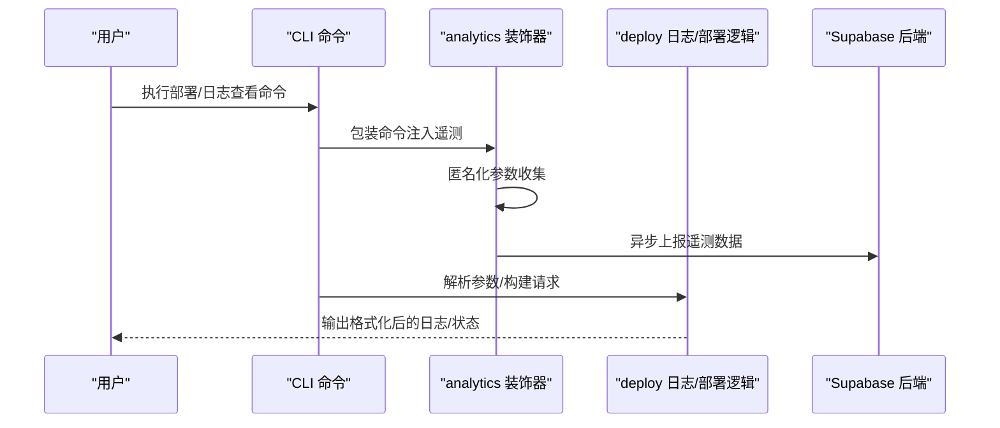
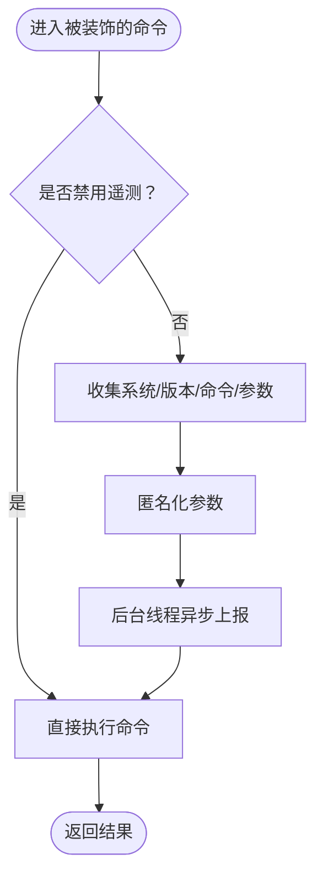
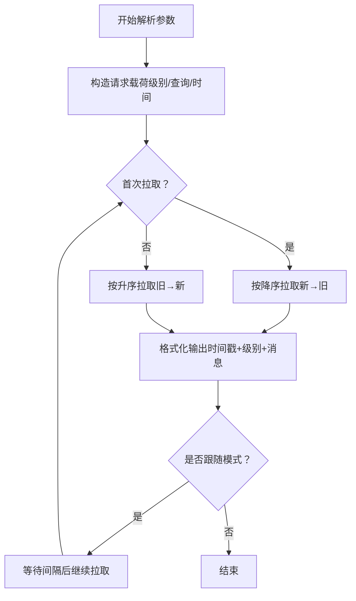
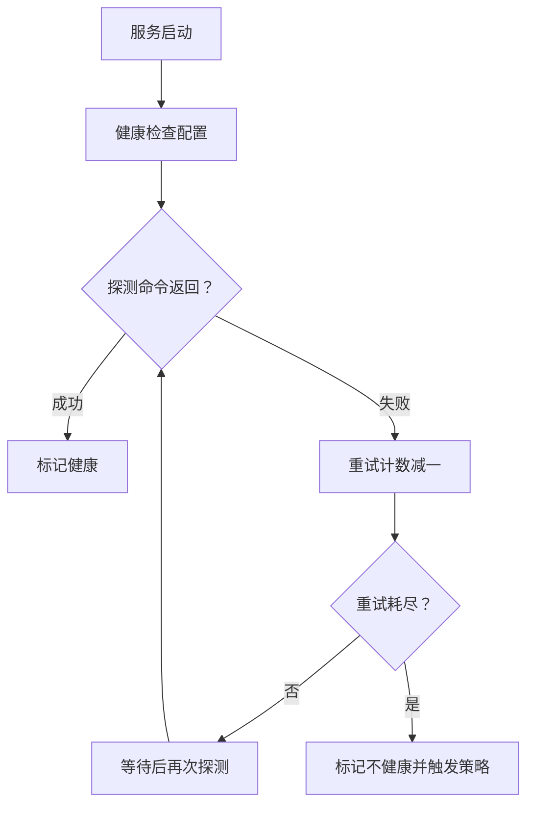
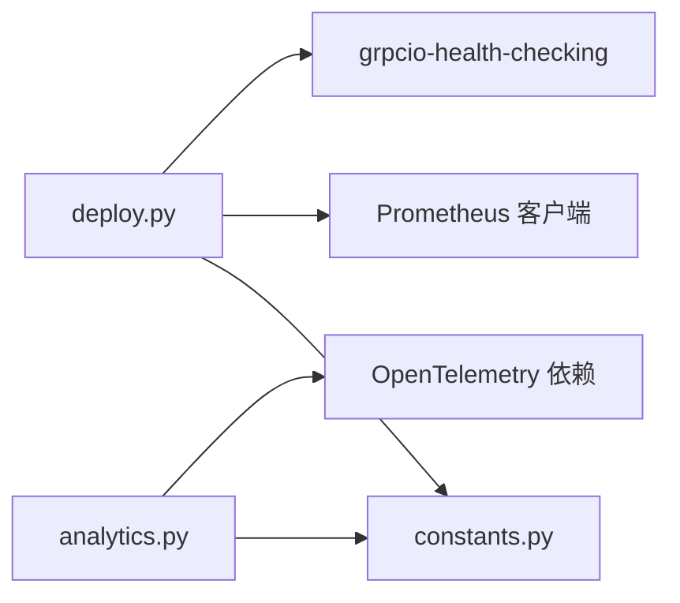

# 监控和日志

<cite>
**本文引用的文件**   
- [README.md](file://README.md)
- [analytics.py](file://libs/cli/langgraph_cli/analytics.py)
- [deploy.py](file://libs/cli/langgraph_cli/deploy.py)
- [constants.py](file://libs/cli/langgraph_cli/constants.py)
- [test_logs_helpers.py](file://libs/cli/tests/unit_tests/test_logs_helpers.py)
- [uv.lock（CLI）](file://libs/cli/uv.lock)
- [uv.lock（LangGraph）](file://libs/langgraph/uv.lock)
</cite>

## 目录
1. [简介](#简介)
2. [项目结构](#项目结构)
3. [核心组件](#核心组件)
4. [架构总览](#架构总览)
5. [详细组件分析](#详细组件分析)
6. [依赖关系分析](#依赖关系分析)
7. [性能考量](#性能考量)
8. [故障排查指南](#故障排查指南)
9. [结论](#结论)
10. [附录](#附录)

## 简介
本指南面向在生产环境中使用 LangGraph 的工程团队，聚焦于“监控与日志”主题，帮助你完成以下目标：
- 配置应用性能监控：明确关键指标采集范围与告警策略建议
- 日志最佳实践：统一结构化日志格式、合理设置日志级别
- 健康检查与故障检测：容器与服务健康检查配置要点
- 第三方监控工具集成：Prometheus、Grafana、OpenTelemetry 等
- 日志分析与问题诊断：工具链与方法论建议

LangGraph 本身提供可观测性基础设施的生态能力（例如与 LangSmith 的集成），同时 CLI 工具提供了日志展示、健康检查与遥测上报等实用功能。本指南将结合仓库中已有的实现与依赖，给出可落地的配置与操作建议。

## 项目结构
围绕监控与日志，仓库中与之直接相关的关键位置如下：
- CLI 分析与遥测：analytics 模块负责匿名化遥测上报；部署与日志展示逻辑集中在 deploy 模块
- 日志格式化与输出：测试用例展示了日志条目格式化与颜色映射规则
- 健康检查与容器编排：Docker Compose 中包含数据库健康检查示例
- 可观测性依赖：uv.lock 展示了 OpenTelemetry、Prometheus 客户端等依赖的存在

图表来源
- [analytics.py:1-99](file://libs/cli/langgraph_cli/analytics.py#L1-L99)
- [deploy.py:1-200](file://libs/cli/langgraph_cli/deploy.py#L1-L200)
- [constants.py:1-7](file://libs/cli/langgraph_cli/constants.py#L1-L7)
- [test_logs_helpers.py:1-58](file://libs/cli/tests/unit_tests/test_logs_helpers.py#L1-L58)
- [uv.lock（CLI）:589-600](file://libs/cli/uv.lock#L589-L600)
- [uv.lock（CLI）:1399-1427](file://libs/cli/uv.lock#L1399-L1427)
- [uv.lock（CLI）:1441-1466](file://libs/cli/uv.lock#L1441-L1466)
- [uv.lock（LangGraph）:2217-2297](file://libs/langgraph/uv.lock#L2217-L2297)
- [uv.lock（LangGraph）:2510-2517](file://libs/langgraph/uv.lock#L2510-L2517)

章节来源
- [README.md:1-83](file://README.md#L1-L83)
- [deploy.py:1-200](file://libs/cli/langgraph_cli/deploy.py#L1-L200)

## 核心组件
- 遥测与分析（analytics）
  - 提供命令级遥测上报与装饰器，支持匿名化参数收集，并通过后台线程异步发送至后端，避免阻塞主流程
- 日志格式化与输出（deploy）
  - 提供时间戳转换、日志条目格式化、日志级别到终端颜色的映射，以及“跟随式”日志流拉取与打印
- 健康检查（Docker Compose）
  - 在本地开发栈中为数据库服务配置健康检查，便于容器编排与自动重启
- 可观测性依赖（uv.lock）
  - 展示了 OpenTelemetry、Prometheus 客户端等依赖的存在，为后续接入外部监控系统提供基础

章节来源
- [analytics.py:1-99](file://libs/cli/langgraph_cli/analytics.py#L1-L99)
- [deploy.py:265-293](file://libs/cli/langgraph_cli/deploy.py#L265-L293)
- [deploy.py:1619-1704](file://libs/cli/langgraph_cli/deploy.py#L1619-L1704)
- [uv.lock（CLI）:1399-1427](file://libs/cli/uv.lock#L1399-L1427)
- [uv.lock（LangGraph）:2217-2297](file://libs/langgraph/uv.lock#L2217-L2297)
- [uv.lock（LangGraph）:2510-2517](file://libs/langgraph/uv.lock#L2510-L2517)

## 架构总览
下图展示了 CLI 在部署与日志查看场景下的关键交互路径，以及与可观测性依赖的关系：

图表来源
- [analytics.py:79-98](file://libs/cli/langgraph_cli/analytics.py#L79-L98)
- [analytics.py:58-76](file://libs/cli/langgraph_cli/analytics.py#L58-L76)
- [deploy.py:1619-1704](file://libs/cli/langgraph_cli/deploy.py#L1619-L1704)

## 详细组件分析

### 组件一：遥测与分析（analytics）
- 功能要点
  - 命令装饰器：对 CLI 命令进行包装，自动收集系统信息、Python 版本、CLI 版本与命令参数（匿名化处理）
  - 异步上报：通过后台线程发起 HTTP 请求，失败时静默忽略，避免影响主流程
  - 环境开关：可通过环境变量禁用遥测
- 关键行为
  - 参数匿名化：仅标记是否传入非默认值的配置、端口、布尔标志等，不上传敏感内容
  - 上报目标：使用公开 API Key 的 Supabase 表，接口路径固定
- 最佳实践
  - 生产环境建议保留遥测以获取使用画像，但需确保合规与最小化数据
  - 如需关闭，设置对应环境变量

图表来源
- [analytics.py:82-98](file://libs/cli/langgraph_cli/analytics.py#L82-L98)
- [analytics.py:29-55](file://libs/cli/langgraph_cli/analytics.py#L29-L55)
- [analytics.py:58-76](file://libs/cli/langgraph_cli/analytics.py#L58-L76)

章节来源
- [analytics.py:1-99](file://libs/cli/langgraph_cli/analytics.py#L1-L99)
- [constants.py:4-7](file://libs/cli/langgraph_cli/constants.py#L4-L7)

### 组件二：日志格式化与输出（deploy）
- 功能要点
  - 时间戳格式化：支持毫秒级时间戳与 ISO 字符串，统一转为可读字符串
  - 日志条目格式化：按“时间戳+级别+消息”的结构输出
  - 级别到颜色映射：错误/严重映射为红色，警告映射为黄色，其他保持默认
  - 跟随模式：持续轮询新日志，自动更新起始时间，支持中断退出
- 关键行为
  - 支持按级别过滤、查询关键字、时间窗口筛选
  - 初始拉取按“新→旧”顺序，随后切换为“旧→新”顺序以保证连续性
- 最佳实践
  - 在 CI/CD 或生产日志采集场景中，建议将日志输出重定向到结构化日志管道
  - 使用级别过滤与时间窗口缩小检索范围，提升定位效率

图表来源
- [deploy.py:1633-1651](file://libs/cli/langgraph_cli/deploy.py#L1633-L1651)
- [deploy.py:1660-1671](file://libs/cli/langgraph_cli/deploy.py#L1660-L1671)
- [deploy.py:1697-1704](file://libs/cli/langgraph_cli/deploy.py#L1697-L1704)

章节来源
- [deploy.py:265-293](file://libs/cli/langgraph_cli/deploy.py#L265-L293)
- [deploy.py:1619-1704](file://libs/cli/langgraph_cli/deploy.py#L1619-L1704)
- [test_logs_helpers.py:1-58](file://libs/cli/tests/unit_tests/test_logs_helpers.py#L1-L58)

### 组件三：健康检查与容器编排
- 功能要点
  - Docker Compose 中为数据库服务配置健康检查，包含探测命令、启动期、超时与重试次数
  - 可根据启动间隔动态调整健康检查频率
- 最佳实践
  - 将健康检查作为容器编排的基础保障，配合自动重启策略提升可用性
  - 在多服务场景中，为每个关键服务都配置独立的健康检查

图表来源
- [deploy.py:231-260](file://libs/cli/langgraph_cli/deploy.py#L231-L260)

章节来源
- [deploy.py:231-260](file://libs/cli/langgraph_cli/deploy.py#L231-L260)

### 组件四：可观测性依赖与外部集成
- 依赖现状
  - CLI 与 LangGraph 依赖中包含 OpenTelemetry（API、SDK、导出器、协议）、Prometheus 客户端等
- 集成建议
  - OpenTelemetry：可作为统一的遥测入口，将应用指标、链路追踪与日志统一导出
  - Prometheus：用于采集应用指标，结合 Grafana 进行可视化与告警
  - Grafana：基于 Prometheus 数据源构建仪表盘，设置阈值告警
- 注意事项
  - 选择与当前 Python 版本兼容的依赖版本
  - 在生产环境启用采样与限流，避免遥测开销过大

章节来源
- [uv.lock（CLI）:1399-1427](file://libs/cli/uv.lock#L1399-L1427)
- [uv.lock（CLI）:1441-1466](file://libs/cli/uv.lock#L1441-L1466)
- [uv.lock（LangGraph）:2217-2297](file://libs/langgraph/uv.lock#L2217-L2297)
- [uv.lock（LangGraph）:2510-2517](file://libs/langgraph/uv.lock#L2510-L2517)

## 依赖关系分析
- 内部依赖
  - deploy 依赖 constants 提供默认端口与配置文件名
  - analytics 依赖 constants 提供 Supabase 公共 API Key 与后端地址
- 外部依赖
  - OpenTelemetry（API/SDK/导出器/协议）
  - Prometheus 客户端
  - grpcio-health-checking（健康检查）

图表来源
- [deploy.py:1-78](file://libs/cli/langgraph_cli/deploy.py#L1-L78)
- [constants.py:1-7](file://libs/cli/langgraph_cli/constants.py#L1-L7)
- [uv.lock（CLI）:589-600](file://libs/cli/uv.lock#L589-L600)
- [uv.lock（CLI）:1399-1427](file://libs/cli/uv.lock#L1399-L1427)
- [uv.lock（LangGraph）:2510-2517](file://libs/langgraph/uv.lock#L2510-L2517)

章节来源
- [deploy.py:1-78](file://libs/cli/langgraph_cli/deploy.py#L1-L78)
- [constants.py:1-7](file://libs/cli/langgraph_cli/constants.py#L1-L7)
- [uv.lock（CLI）:589-600](file://libs/cli/uv.lock#L589-L600)
- [uv.lock（CLI）:1399-1427](file://libs/cli/uv.lock#L1399-L1427)
- [uv.lock（LangGraph）:2510-2517](file://libs/langgraph/uv.lock#L2510-L2517)

## 性能考量
- 遥测上报
  - 异步线程上报避免阻塞主流程，但在高并发或网络异常时仍可能产生堆积，建议在生产环境限制上报频率或合并批次
- 日志输出
  - “跟随模式”会周期性轮询，建议在大规模日志场景中开启级别过滤与时间窗口，减少 IO 压力
- 健康检查
  - 合理设置启动期、超时与重试次数，避免频繁探测导致资源浪费
- 可观测性
  - OpenTelemetry 与 Prometheus 的采样率与批量大小应结合业务流量调优，防止指标丢失或内存占用过高

## 故障排查指南
- 日志无法显示或为空
  - 检查日志级别过滤与时间窗口是否过窄
  - 确认“跟随模式”是否开启，必要时关闭后重新拉取
- 遥测未上报
  - 检查是否设置了禁用遥测的环境变量
  - 网络异常或后端不可达会导致上报失败，可在后台线程中观察异常
- 健康检查失败
  - 检查数据库服务是否正常启动，确认健康检查命令与容器内可用性
  - 调整启动期与重试次数，避免过早判定不健康

章节来源
- [deploy.py:1676-1679](file://libs/cli/langgraph_cli/deploy.py#L1676-L1679)
- [deploy.py:1697-1704](file://libs/cli/langgraph_cli/deploy.py#L1697-L1704)
- [analytics.py:82-83](file://libs/cli/langgraph_cli/analytics.py#L82-L83)
- [analytics.py:73-76](file://libs/cli/langgraph_cli/analytics.py#L73-L76)

## 结论
- LangGraph 生态强调可观测性与调试能力，CLI 工具提供了日志格式化、健康检查与遥测上报的实用能力
- 建议在生产环境中结合 OpenTelemetry 与 Prometheus/Grafana，形成统一的指标与可视化体系
- 通过合理的日志级别、结构化输出与告警策略，可以显著提升问题定位与恢复效率

## 附录
- 关键指标建议
  - 应用层：请求延迟、错误率、吞吐量、队列长度、重试次数
  - 服务层：连接池使用率、数据库响应时间、缓存命中率
  - 健康度：服务存活、健康检查成功率、重启次数
- 告警策略建议
  - 基于阈值与趋势的组合告警，区分严重、警告与通知级别
  - 对关键路径设置 SLO/SLO 告警，避免误报与漏报
- 日志最佳实践
  - 结构化日志：统一字段（时间戳、级别、服务名、实例 ID、TraceId、SpanId、消息体）
  - 日志级别：DEBUG/INFO/WARNING/ERROR，生产环境建议 INFO 或以上
  - 日志轮转：按大小与时间轮转，保留必要历史以便回溯