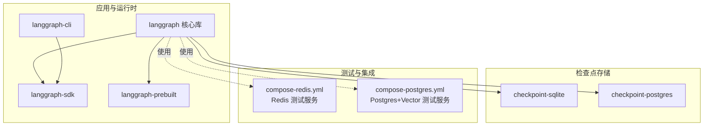
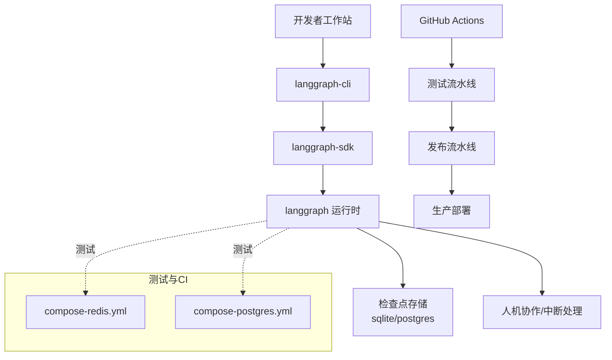
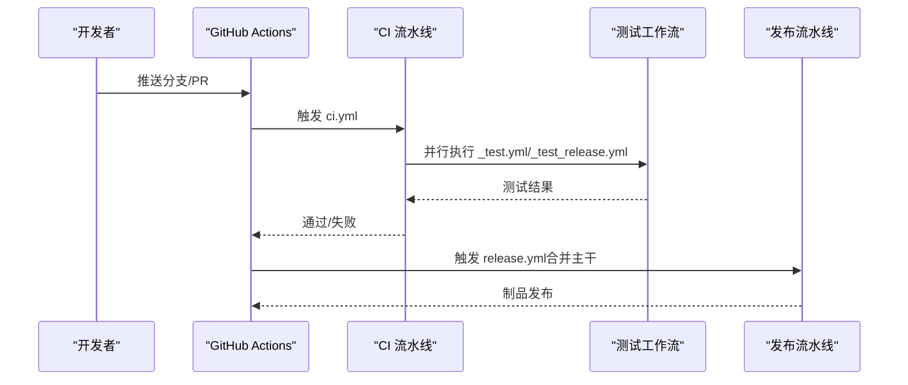
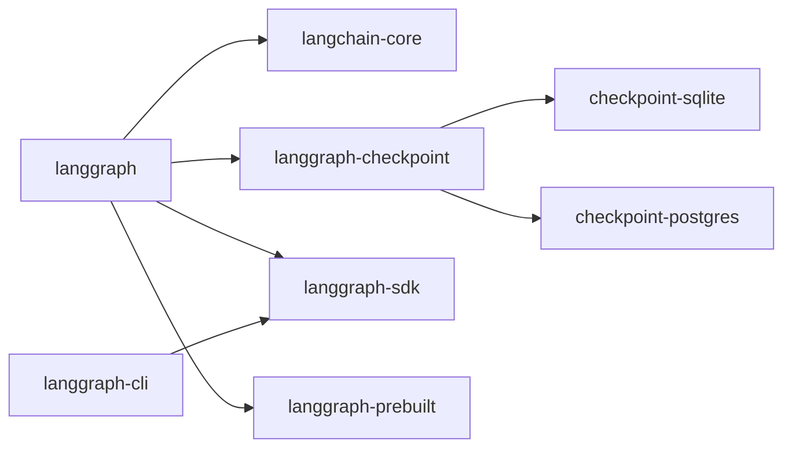

# 部署和运维

<cite>
**本文引用的文件**
- [README.md](file://README.md)
- [Makefile](file://Makefile)
- [libs/langgraph/pyproject.toml](file://libs/langgraph/pyproject.toml)
- [libs/cli/pyproject.toml](file://libs/cli/pyproject.toml)
- [.github/dependabot.yml](file://.github/dependabot.yml)
- [libs/langgraph/tests/compose-redis.yml](file://libs/langgraph/tests/compose-redis.yml)
- [libs/checkpoint-postgres/tests/compose-postgres.yml](file://libs/checkpoint-postgres/tests/compose-postgres.yml)
- [.github/workflows/ci.yml](file://.github/workflows/ci.yml)
- [.github/workflows/release.yml](file://.github/workflows/release.yml)
- [.github/workflows/_test.yml](file://.github/workflows/_test.yml)
- [.github/workflows/_test_release.yml](file://.github/workflows/_test_release.yml)
</cite>

## 目录
1. [简介](#简介)
2. [项目结构](#项目结构)
3. [核心组件](#核心组件)
4. [架构总览](#架构总览)
5. [详细组件分析](#详细组件分析)
6. [依赖关系分析](#依赖关系分析)
7. [性能考量](#性能考量)
8. [故障排除指南](#故障排除指南)
9. [结论](#结论)
10. [附录](#附录)

## 简介
本指南面向在生产环境中部署与运维基于 LangGraph 的长生命周期、有状态智能体系统，覆盖开发环境与生产环境的搭建、Docker 容器化与编排、CI/CD 流水线与自动化发布、监控与日志、性能指标采集、故障排除与应急响应、安全与访问控制、扩展性与高可用设计，以及运维最佳实践与常见问题解决方案。LangGraph 提供低层编排能力，支持持久化执行、人机协同、内存与调试可观测性，并可与 LangSmith 等工具结合实现生产级可观测性与部署。

## 项目结构
仓库采用多库（monorepo）结构，核心库包括：
- langgraph：核心运行时与图编排逻辑
- langgraph-checkpoint 及其后端（sqlite/postgres）
- langgraph-sdk 与 langgraph-cli
- langgraph-prebuilt：预置工具集
- 示例与测试位于 examples 与各库 tests 目录中

下图展示与部署运维相关的关键模块与依赖关系：

图表来源
- [libs/langgraph/pyproject.toml:26-33](file://libs/langgraph/pyproject.toml#L26-L33)
- [libs/cli/pyproject.toml:14-21](file://libs/cli/pyproject.toml#L14-L21)
- [libs/langgraph/tests/compose-redis.yml:1-17](file://libs/langgraph/tests/compose-redis.yml#L1-L17)
- [libs/checkpoint-postgres/tests/compose-postgres.yml:1-18](file://libs/checkpoint-postgres/tests/compose-postgres.yml#L1-L18)

章节来源
- [README.md:1-83](file://README.md#L1-L83)
- [Makefile:1-68](file://Makefile#L1-L68)
- [libs/langgraph/pyproject.toml:1-129](file://libs/langgraph/pyproject.toml#L1-L129)
- [libs/cli/pyproject.toml:1-79](file://libs/cli/pyproject.toml#L1-L79)

## 核心组件
- 运行时与图编排：langgraph 核心库提供状态管理、检查点与持久化、中断与人机协作等能力，是生产部署的基石。
- 检查点后端：根据数据一致性与性能需求选择 sqlite 或 postgres；postgres 版本包含向量扩展以支持向量检索场景。
- SDK 与 CLI：SDK 提供 API 客户端能力，CLI 支持本地开发与交互式操作。
- 预置工具集：prebuilt 提供常用工具与模式，便于快速落地。
- 测试编排：Redis 与 Postgres 的 docker-compose 配置用于本地与 CI 环境的基础设施准备。

章节来源
- [libs/langgraph/pyproject.toml:26-33](file://libs/langgraph/pyproject.toml#L26-L33)
- [libs/checkpoint-postgres/tests/compose-postgres.yml:1-18](file://libs/checkpoint-postgres/tests/compose-postgres.yml#L1-L18)
- [libs/langgraph/tests/compose-redis.yml:1-17](file://libs/langgraph/tests/compose-redis.yml#L1-L17)
- [libs/cli/pyproject.toml:14-21](file://libs/cli/pyproject.toml#L14-L21)

## 架构总览
下图给出从开发到生产的典型路径：开发者通过 CLI/SDK 与图进行交互，运行时使用检查点持久化状态，测试阶段通过 docker-compose 启动 Redis 与 Postgres，CI 执行测试与质量门禁，最终发布制品并部署至生产环境。

图表来源
- [libs/cli/pyproject.toml:36-37](file://libs/cli/pyproject.toml#L36-L37)
- [libs/langgraph/pyproject.toml:26-33](file://libs/langgraph/pyproject.toml#L26-L33)
- [libs/langgraph/tests/compose-redis.yml:1-17](file://libs/langgraph/tests/compose-redis.yml#L1-L17)
- [libs/checkpoint-postgres/tests/compose-postgres.yml:1-18](file://libs/checkpoint-postgres/tests/compose-postgres.yml#L1-L18)
- [.github/workflows/ci.yml](file://.github/workflows/ci.yml)
- [.github/workflows/release.yml](file://.github/workflows/release.yml)

## 详细组件分析

### 开发环境搭建
- 语言与包管理：Python 版本要求与依赖分组在各库的 pyproject.toml 中定义；推荐使用 uv 进行虚拟环境与依赖安装。
- 一键安装与任务：顶层 Makefile 提供统一的安装、格式化、锁定、测试等目标，便于在 monorepo 中批量执行。
- 本地服务：使用 compose-redis.yml 与 compose-postgres.yml 快速启动测试所需的缓存与数据库服务。

建议步骤
- 创建并激活虚拟环境
- 在根目录执行安装命令，逐库安装可编辑依赖
- 启动 Redis 与 Postgres 测试服务
- 运行测试验证环境

章节来源
- [Makefile:8-18](file://Makefile#L8-L18)
- [libs/langgraph/pyproject.toml:45-80](file://libs/langgraph/pyproject.toml#L45-L80)
- [libs/langgraph/tests/compose-redis.yml:1-17](file://libs/langgraph/tests/compose-redis.yml#L1-L17)
- [libs/checkpoint-postgres/tests/compose-postgres.yml:1-18](file://libs/checkpoint-postgres/tests/compose-postgres.yml#L1-L18)

### 生产环境准备
- 运行时依赖：确保生产镜像包含 langgraph 核心库及其依赖（如 SDK、预置工具集），并按需启用检查点后端。
- 数据持久化：根据吞吐与一致性需求选择 sqlite 或 postgres；postgres 建议启用向量扩展以支持检索增强。
- 人机协作：生产中应保留中断与人工干预能力，配合可观测性平台进行调试与审计。

章节来源
- [libs/langgraph/pyproject.toml:26-33](file://libs/langgraph/pyproject.toml#L26-L33)
- [libs/checkpoint-postgres/tests/compose-postgres.yml:3-10](file://libs/checkpoint-postgres/tests/compose-postgres.yml#L3-L10)

### Docker 配置与容器化
- 基础镜像：建议基于官方 Python 基础镜像，安装生产依赖并复制应用代码。
- 服务编排：使用 compose-redis.yml 与 compose-postgres.yml 作为参考，映射端口、设置健康检查与资源限制。
- 环境变量：通过环境变量传递数据库连接、检查点路径、运行时参数等。
- 健康检查：为 Redis 与 Postgres 设置合理的健康检查策略，确保容器编排系统能及时发现异常。

章节来源
- [libs/langgraph/tests/compose-redis.yml:1-17](file://libs/langgraph/tests/compose-redis.yml#L1-L17)
- [libs/checkpoint-postgres/tests/compose-postgres.yml:1-18](file://libs/checkpoint-postgres/tests/compose-postgres.yml#L1-L18)

### CI/CD 工作流与自动化部署
- CI 流水线：ci.yml 负责拉取代码、安装依赖、运行测试与质量检查。
- 发布流水线：release.yml 负责版本标记、打包与发布制品。
- 测试工作流：_test.yml 与 _test_release.yml 分别用于通用测试与发布前测试，确保质量门禁。
- 依赖更新：dependabot.yml 对 GitHub Actions 与各库的 uv 包生态进行定期更新，降低供应链风险。

图表来源
- [.github/workflows/ci.yml](file://.github/workflows/ci.yml)
- [.github/workflows/_test.yml](file://.github/workflows/_test.yml)
- [.github/workflows/_test_release.yml](file://.github/workflows/_test_release.yml)
- [.github/workflows/release.yml](file://.github/workflows/release.yml)

章节来源
- [.github/workflows/ci.yml](file://.github/workflows/ci.yml)
- [.github/workflows/release.yml](file://.github/workflows/release.yml)
- [.github/workflows/_test.yml](file://.github/workflows/_test.yml)
- [.github/workflows/_test_release.yml](file://.github/workflows/_test_release.yml)
- [.github/dependabot.yml:1-189](file://.github/dependabot.yml#L1-L189)

### 监控、日志记录与性能指标
- 可观测性：结合 LangSmith 进行可视化追踪、状态转换记录与运行时指标采集。
- 日志：在应用层输出结构化日志，区分请求级与作业级日志，避免敏感信息泄露。
- 指标：采集关键指标（请求延迟、错误率、检查点写入耗时、并发队列长度等），并上报至监控系统。
- 健康检查：容器层面使用健康检查，平台层面使用探针与告警规则。

章节来源
- [README.md:35-46](file://README.md#L35-L46)

### 故障排除与应急响应
- 常见问题
  - 检查点不可用：确认后端连接字符串、权限与网络连通性。
  - 内存不足：调整 Redis 最大内存策略或扩容实例。
  - 数据库超时：优化查询、增加索引或切换到更合适的后端。
- 应急响应
  - 快速降级：临时关闭人机协作或回退到稳定版本。
  - 快速恢复：利用检查点恢复未完成的会话，避免重复计算。
  - 回滚策略：遵循发布流水线的版本标签与制品备份，确保可回滚。

章节来源
- [libs/langgraph/tests/compose-redis.yml:7-16](file://libs/langgraph/tests/compose-redis.yml#L7-L16)
- [libs/checkpoint-postgres/tests/compose-postgres.yml:11-16](file://libs/checkpoint-postgres/tests/compose-postgres.yml#L11-L16)

### 安全配置与访问控制
- 认证与授权：通过 SDK/CLI 的认证机制与平台侧的访问控制策略，限制对图与运行时的访问。
- 网络隔离：将数据库与缓存置于内网子网，仅开放必要端口。
- 密钥管理：使用环境变量或密钥管理服务注入敏感配置，避免硬编码。
- 审计与合规：开启操作审计与日志留存，满足合规要求。

章节来源
- [libs/cli/pyproject.toml:14-21](file://libs/cli/pyproject.toml#L14-L21)
- [libs/langgraph/pyproject.toml:26-33](file://libs/langgraph/pyproject.toml#L26-L33)

### 扩展性与高可用设计
- 水平扩展：通过无状态 API 与共享检查点后端实现多副本部署；使用负载均衡分发请求。
- 存储扩展：Postgres 可通过主从复制与读副本提升读扩展；Redis 可启用集群或哨兵模式。
- 容灾：跨可用区部署、定期备份与演练，确保故障切换时间与数据一致性目标达成。

章节来源
- [libs/checkpoint-postgres/tests/compose-postgres.yml:3-10](file://libs/checkpoint-postgres/tests/compose-postgres.yml#L3-L10)
- [libs/langgraph/tests/compose-redis.yml:1-17](file://libs/langgraph/tests/compose-redis.yml#L1-L17)

## 依赖关系分析
LangGraph 运行时依赖多个子库，其中部分为可选或测试依赖。下图展示核心依赖关系与可选组件：

图表来源
- [libs/langgraph/pyproject.toml:26-33](file://libs/langgraph/pyproject.toml#L26-L33)
- [libs/cli/pyproject.toml:14-21](file://libs/cli/pyproject.toml#L14-L21)

章节来源
- [libs/langgraph/pyproject.toml:26-33](file://libs/langgraph/pyproject.toml#L26-L33)
- [libs/cli/pyproject.toml:14-21](file://libs/cli/pyproject.toml#L14-L21)

## 性能考量
- 检查点策略：根据会话长度与中断频率选择合适的检查点间隔，减少回放成本。
- 缓存命中：合理配置 Redis 内存策略与淘汰策略，避免频繁淘汰热键。
- 数据库性能：为向量检索与状态表建立合适索引，控制查询复杂度。
- 并发与队列：限制并发与队列深度，避免资源争用导致的尾延迟。

章节来源
- [libs/langgraph/tests/compose-redis.yml:7-16](file://libs/langgraph/tests/compose-redis.yml#L7-L16)
- [libs/checkpoint-postgres/tests/compose-postgres.yml:11-16](file://libs/checkpoint-postgres/tests/compose-postgres.yml#L11-L16)

## 故障排除指南
- 启动失败
  - 检查依赖安装是否完整、Python 版本是否满足要求。
  - 查看容器健康检查输出，定位 Redis/Postgres 初始化问题。
- 运行时异常
  - 关注检查点读写错误与序列化异常，核对数据模型与版本兼容性。
  - 结合可观测性平台定位慢调用与热点节点。
- 回滚与恢复
  - 使用检查点快速恢复未完成会话；若后端损坏，优先恢复备份。

章节来源
- [libs/langgraph/tests/compose-redis.yml:8-14](file://libs/langgraph/tests/compose-redis.yml#L8-L14)
- [libs/checkpoint-postgres/tests/compose-postgres.yml:11-16](file://libs/checkpoint-postgres/tests/compose-postgres.yml#L11-L16)
- [README.md:35-46](file://README.md#L35-L46)

## 结论
通过明确的开发与生产环境边界、规范化的容器化与编排、完善的 CI/CD 与可观测性体系，以及严格的安全与高可用设计，LangGraph 的部署与运维可以达到工程化与规模化标准。建议在上线前完成压测与演练，持续优化检查点策略与存储性能，并建立完善的变更与回滚流程。

## 附录
- 快速清单
  - 准备 Python 环境与 uv
  - 启动 Redis 与 Postgres 测试服务
  - 运行测试并通过质量门禁
  - 配置 CI/CD 与发布流水线
  - 部署生产环境并接入监控
  - 制定应急响应与回滚预案