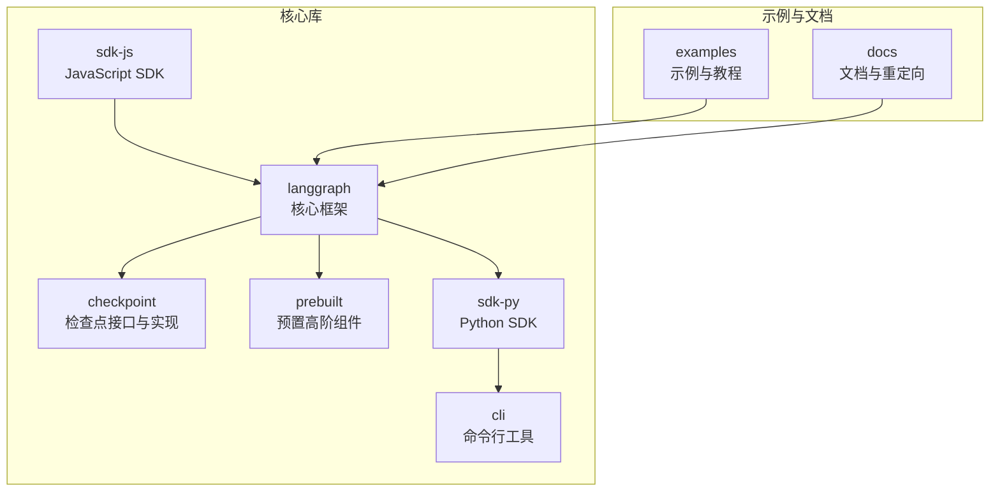
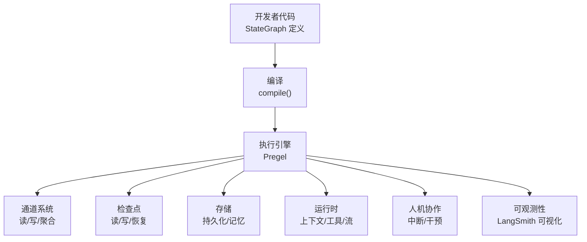
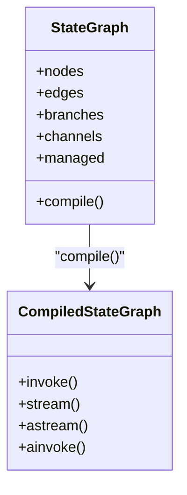
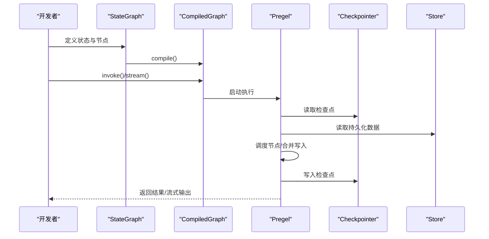
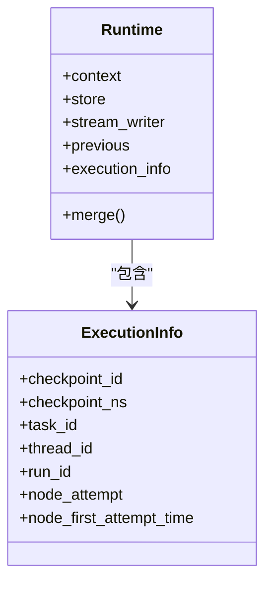
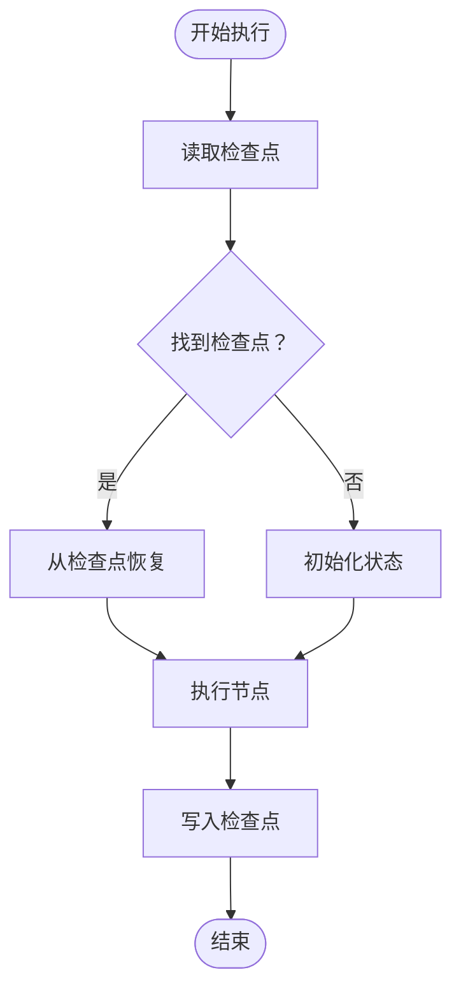
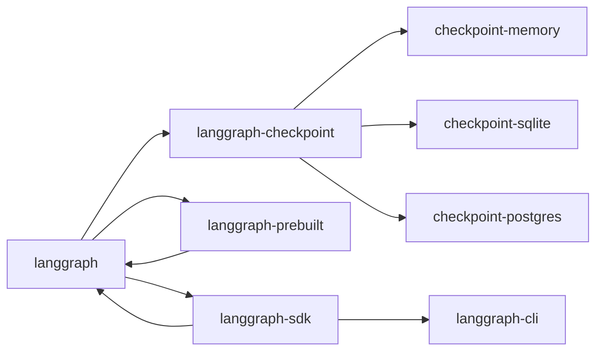

# 项目概述

<cite>
**本文引用的文件**
- [README.md](file://README.md)
- [AGENTS.md](file://AGENTS.md)
- [libs/langgraph/README.md](file://libs/langgraph/README.md)
- [libs/langgraph/pyproject.toml](file://libs/langgraph/pyproject.toml)
- [libs/checkpoint/pyproject.toml](file://libs/checkpoint/pyproject.toml)
- [libs/langgraph/langgraph/graph/state.py](file://libs/langgraph/langgraph/graph/state.py)
- [libs/langgraph/langgraph/pregel/main.py](file://libs/langgraph/langgraph/pregel/main.py)
- [libs/langgraph/langgraph/runtime.py](file://libs/langgraph/langgraph/runtime.py)
- [libs/cli/langgraph_cli/__init__.py](file://libs/cli/langgraph_cli/__init__.py)
</cite>

## 目录
1. [引言](#引言)
2. [项目结构](#项目结构)
3. [核心组件](#核心组件)
4. [架构总览](#架构总览)
5. [详细组件分析](#详细组件分析)
6. [依赖分析](#依赖分析)
7. [性能考虑](#性能考虑)
8. [故障排查指南](#故障排查指南)
9. [结论](#结论)
10. [附录](#附录)

## 引言
LangGraph 是一个面向“长运行、状态化代理”的低层编排框架，专注于为复杂、可扩展的多参与者工作流提供稳定、可观测且可生产的基础设施。它不抽象提示或架构，而是提供可组合、可调试、可持久化的执行内核，使开发者能够构建从简单到复杂的各类智能体与工作流，并在生产环境中可靠地运行与演进。

LangGraph 的核心价值主张包括：
- 持久执行：在失败后自动恢复，支持长时间运行与断点续跑
- 人机协作：在任意节点插入中断，允许人工介入与修改状态
- 综合记忆：同时支持短期工作记忆与长期持久记忆
- 调试与可观测性：与 LangSmith 深度集成，可视化追踪执行路径与状态变化
- 生产就绪部署：提供可扩展的部署方案，适配长运行、状态化工作负载

LangGraph 既可独立使用，也可无缝融入 LangChain 生态（如 LangChain、LangSmith、LangSmith Deployment），形成从开发、调试到部署的一体化能力闭环。

章节来源
- [README.md:35-46](file://README.md#L35-L46)
- [README.md:48-57](file://README.md#L48-L57)
- [libs/langgraph/README.md:69-77](file://libs/langgraph/README.md#L69-L77)
- [libs/langgraph/README.md:79-85](file://libs/langgraph/README.md#L79-L85)

## 项目结构
本仓库采用多库（monorepo）组织方式，核心库与配套工具分布在 libs 目录下。LangGraph 的核心能力由 langgraph 库提供，持久化与缓存能力由 checkpoint 系列库提供，预置高阶组件由 prebuilt 提供，SDK 与 CLI 则分别面向服务端交互与本地命令行。

图表来源
- [AGENTS.md:19-53](file://AGENTS.md#L19-L53)

章节来源
- [AGENTS.md:3-53](file://AGENTS.md#L3-L53)

## 核心组件
- StateGraph 与 CompiledStateGraph：用于声明式定义状态化图结构，支持节点、分支、通道与受管值，最终通过 compile() 生成可执行图。
- Pregel 执行引擎：负责调度、并发、写入合并、检查点读写、消息流与重试策略，是 LangGraph 的执行内核。
- Runtime 与上下文：为节点注入运行时上下文（如用户标识、存储、流写入器、执行元数据），支持工具节点等扩展。
- 检查点与存储：通过 Checkpointer 与 Store 实现状态持久化与跨会话记忆，支持内存、SQLite、PostgreSQL 等后端。
- 预置组件与 SDK：提供常见模式（如 React Agent、工具节点）与服务端交互能力，加速原型与生产落地。

章节来源
- [libs/langgraph/langgraph/graph/state.py:115-184](file://libs/langgraph/langgraph/graph/state.py#L115-L184)
- [libs/langgraph/langgraph/pregel/main.py:173-200](file://libs/langgraph/langgraph/pregel/main.py#L173-L200)
- [libs/langgraph/langgraph/runtime.py:90-200](file://libs/langgraph/langgraph/runtime.py#L90-L200)

## 架构总览
LangGraph 的整体架构围绕“状态化图 + 执行引擎 + 持久化/存储”展开。开发者以 StateGraph 描述状态与节点间的关系，通过 compile() 生成可执行图；Pregel 负责实际执行，协调通道读写、任务调度、检查点与重试；Runtime 注入上下文与工具；Checkpoint 与 Store 提供持久化与记忆。

图表来源
- [libs/langgraph/langgraph/graph/state.py:115-184](file://libs/langgraph/langgraph/graph/state.py#L115-L184)
- [libs/langgraph/langgraph/pregel/main.py:173-200](file://libs/langgraph/langgraph/pregel/main.py#L173-L200)
- [libs/langgraph/langgraph/runtime.py:90-200](file://libs/langgraph/langgraph/runtime.py#L90-L200)

## 详细组件分析

### StateGraph 与状态建模
StateGraph 将“状态键 + 可选归约器”抽象为图的核心单元，每个节点签名形如“State -> Partial<State>”，通过通道与受管值实现多源聚合与并发写入。该设计使得状态更新具备确定性与可组合性，便于构建复杂分支与子图。

图表来源
- [libs/langgraph/langgraph/graph/state.py:115-184](file://libs/langgraph/langgraph/graph/state.py#L115-L184)

章节来源
- [libs/langgraph/langgraph/graph/state.py:115-184](file://libs/langgraph/langgraph/graph/state.py#L115-L184)

### Pregel 执行引擎与调度
Pregel 是 LangGraph 的执行内核，负责：
- 任务准备与并发调度
- 通道读取与写入合并
- 检查点创建、读取与恢复
- 流式输出与消息处理
- 重试策略与错误传播

图表来源
- [libs/langgraph/langgraph/pregel/main.py:173-200](file://libs/langgraph/langgraph/pregel/main.py#L173-L200)

章节来源
- [libs/langgraph/langgraph/pregel/main.py:173-200](file://libs/langgraph/langgraph/pregel/main.py#L173-L200)

### Runtime 与上下文注入
Runtime 为节点提供运行时上下文（如用户标识、数据库连接）、存储访问、流写入器与执行元数据。通过 context 与 store，节点可以实现个性化逻辑与跨会话记忆。

图表来源
- [libs/langgraph/langgraph/runtime.py:90-200](file://libs/langgraph/langgraph/runtime.py#L90-L200)

章节来源
- [libs/langgraph/langgraph/runtime.py:90-200](file://libs/langgraph/langgraph/runtime.py#L90-L200)

### 持久化与存储
LangGraph 通过 Checkpointer 与 Store 实现两类持久化：
- 检查点（Checkpoint）：保存通道快照与执行状态，支持恢复与回放
- 存储（Store）：持久化键值对数据，用于长期记忆与共享资源

图表来源
- [libs/langgraph/pyproject.toml:26-33](file://libs/langgraph/pyproject.toml#L26-L33)

章节来源
- [libs/langgraph/pyproject.toml:26-33](file://libs/langgraph/pyproject.toml#L26-L33)

## 依赖分析
LangGraph 的依赖关系清晰分层：langgraph 为核心，checkpoint 提供检查点接口与实现，prebuilt 提供高层封装，sdk-py/sd-js 提供客户端能力，cli 提供本地命令行工具。

图表来源
- [AGENTS.md:33-53](file://AGENTS.md#L33-L53)
- [libs/langgraph/pyproject.toml:83-89](file://libs/langgraph/pyproject.toml#L83-L89)
- [libs/checkpoint/pyproject.toml:14-17](file://libs/checkpoint/pyproject.toml#L14-L17)

章节来源
- [AGENTS.md:33-53](file://AGENTS.md#L33-L53)
- [libs/langgraph/pyproject.toml:83-89](file://libs/langgraph/pyproject.toml#L83-L89)
- [libs/checkpoint/pyproject.toml:14-17](file://libs/checkpoint/pyproject.toml#L14-L17)

## 性能考虑
- 并发与调度：Pregel 支持多任务并发与通道聚合，合理设计节点与通道可提升吞吐
- 检查点频率：根据业务需求平衡检查点频率与 IO 成本，避免过度写入
- 缓存策略：结合 BaseCache 与 Store，减少重复计算与外部调用
- 流式输出：利用流式接口降低延迟，提升用户体验
- 部署与伸缩：配合 LangSmith Deployment 与容器化方案，按需弹性扩缩容

## 故障排查指南
- 中断与恢复：当执行被中断时，可通过检查点恢复到最近稳定状态，重新评估与修正状态后再继续
- 日志与追踪：结合 LangSmith 进行可视化追踪，定位异常节点与状态变更
- 错误码与诊断：利用错误码与诊断信息快速定位问题根因
- 回放与重放：借助检查点与历史状态进行回放，验证修复效果

章节来源
- [README.md:35-46](file://README.md#L35-L46)
- [libs/langgraph/README.md:69-77](file://libs/langgraph/README.md#L69-L77)

## 结论
LangGraph 以“状态化、可持久、可观测、可扩展”为核心理念，为构建长运行、多参与者智能体提供了坚实的底层支撑。通过与 LangChain 生态的深度整合，开发者可以在同一套工具链中完成从设计、调试到生产的全生命周期管理。对于需要强状态管理、人机协作与生产级部署的场景，LangGraph 是优先选择。

## 附录
- 版本与生态：CLI 版本信息位于 langgraph_cli 包；LangGraph 与相关库版本与依赖见各库的 pyproject.toml
- 快速开始与示例：参考官方文档与 examples 目录中的示例笔记本
- 社区与支持：通过 LangChain 论坛与官方文档获取帮助与最佳实践

章节来源
- [libs/cli/langgraph_cli/__init__.py:1-2](file://libs/cli/langgraph_cli/__init__.py#L1-L2)
- [libs/langgraph/README.md:28-67](file://libs/langgraph/README.md#L28-L67)
- [README.md:61-76](file://README.md#L61-L76)