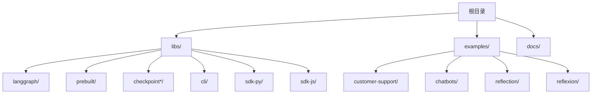
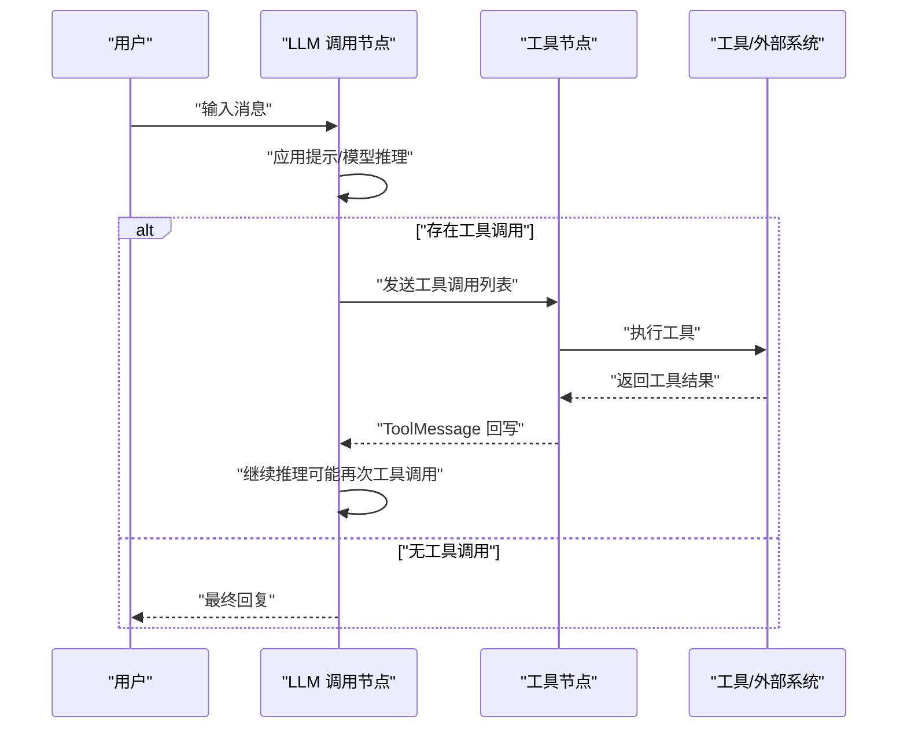
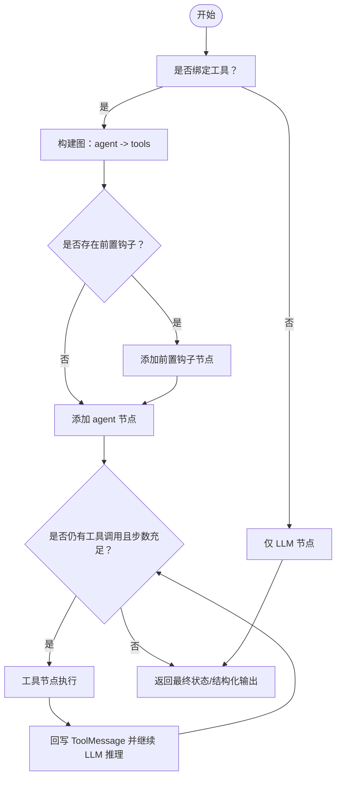
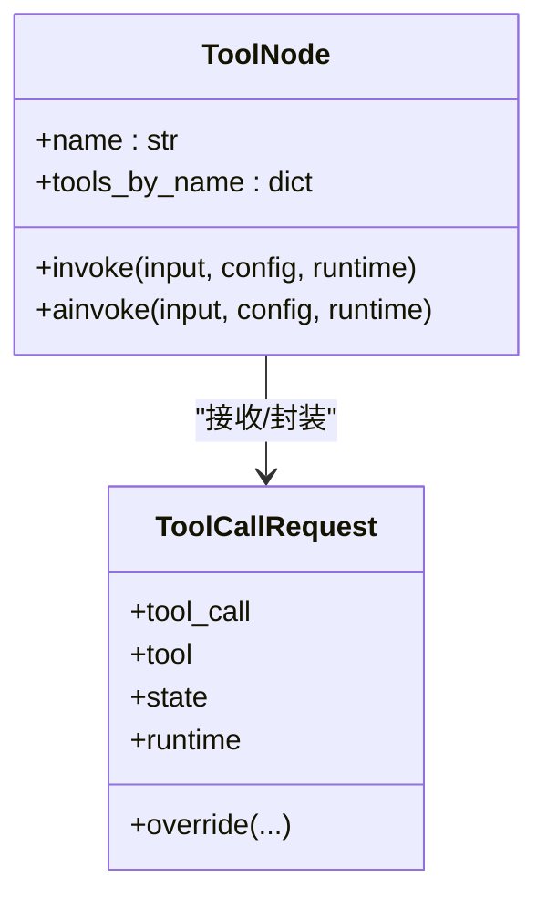
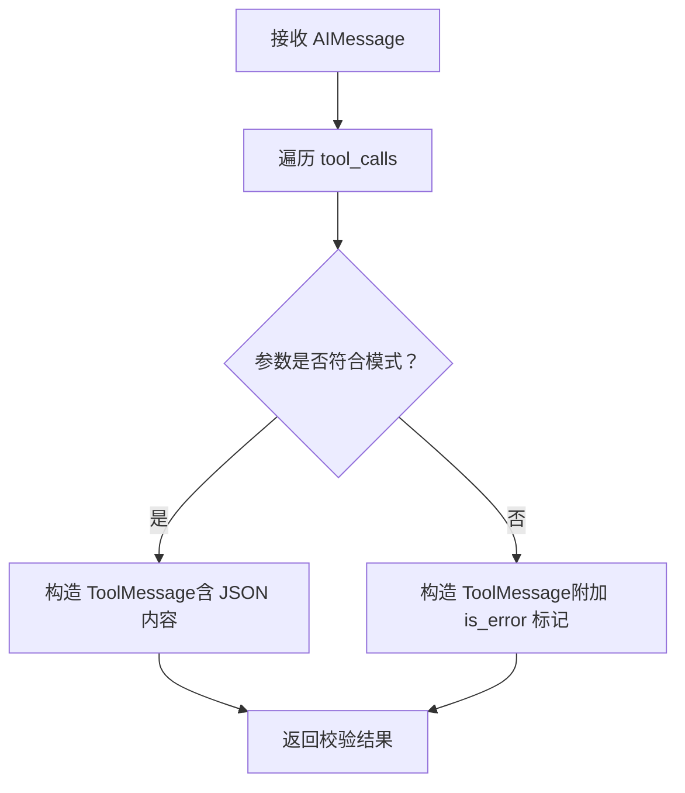
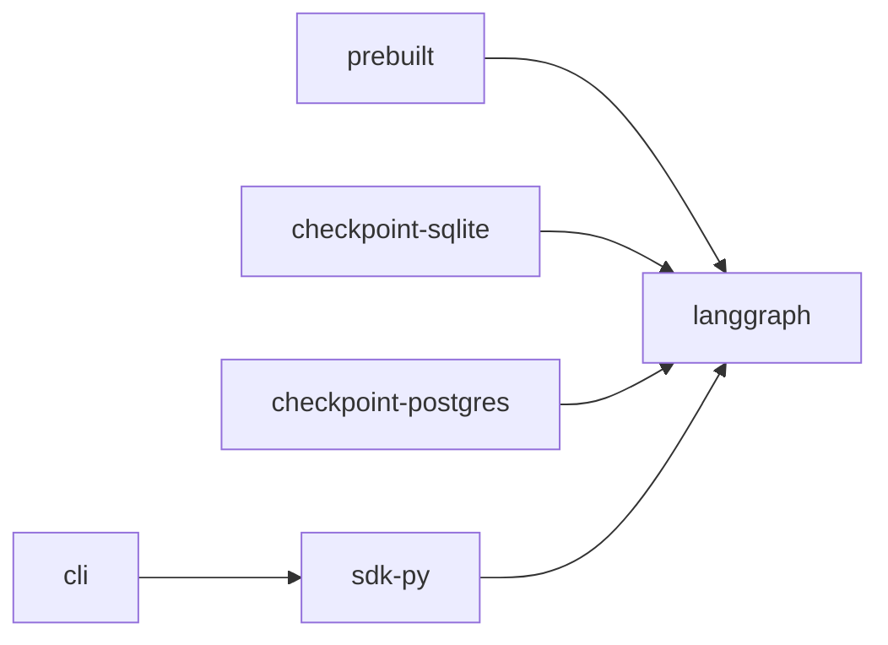

# 代理模板和最佳实践

<cite>
**本文引用的文件**
- [README.md](file://README.md)
- [AGENTS.md](file://AGENTS.md)
- [examples/README.md](file://examples/README.md)
- [libs/prebuilt/README.md](file://libs/prebuilt/README.md)
- [libs/prebuilt/langgraph/prebuilt/__init__.py](file://libs/prebuilt/langgraph/prebuilt/__init__.py)
- [libs/prebuilt/langgraph/prebuilt/chat_agent_executor.py](file://libs/prebuilt/langgraph/prebuilt/chat_agent_executor.py)
- [libs/prebuilt/langgraph/prebuilt/tool_node.py](file://libs/prebuilt/langgraph/prebuilt/tool_node.py)
- [libs/prebuilt/langgraph/prebuilt/tool_validator.py](file://libs/prebuilt/langgraph/prebuilt/tool_validator.py)
- [libs/prebuilt/langgraph/prebuilt/interrupt.py](file://libs/prebuilt/langgraph/prebuilt/interrupt.py)
</cite>

## 目录
1. [简介](#简介)
2. [项目结构](#项目结构)
3. [核心组件](#核心组件)
4. [架构总览](#架构总览)
5. [详细组件分析](#详细组件分析)
6. [依赖分析](#依赖分析)
7. [性能考虑](#性能考虑)
8. [故障排除指南](#故障排除指南)
9. [结论](#结论)
10. [附录：代理模板与最佳实践清单](#附录代理模板与最佳实践清单)

## 简介
本文件面向需要在 LangGraph 生态中快速构建、调试与部署“有状态、可持久、可中断”的智能体（Agent）的工程师与产品团队。内容基于仓库中的预构建代理能力与示例，系统性整理了以下主题：
- 预构建代理模板与标准配置模式：ReAct 风格代理、信息收集型聊天机器人、带反思/验证的代理等
- 代理设计最佳实践：状态管理、工具集成、错误处理、性能优化
- 调试技巧、可观测性与故障排除
- 如何根据业务场景选择合适模板并进行定制化改造

LangGraph 提供低层编排框架，支持长时运行、状态持久化、人机协同与生产级部署；配合 LangSmith 可实现可视化追踪与评估。

**章节来源**
- [README.md:1-83](file://README.md#L1-L83)

## 项目结构
该仓库为多库（monorepo）结构，核心与预构建能力集中在 libs 子目录，examples 用于归档与指引迁移至 LangChain 官方文档。

**图表来源**
- [AGENTS.md:19-58](file://AGENTS.md#L19-L58)

**章节来源**
- [AGENTS.md:1-58](file://AGENTS.md#L1-L58)
- [examples/README.md:1-4](file://examples/README.md#L1-L4)

## 核心组件
- 预构建代理工厂：提供 ReAct 风格的工具调用代理，支持动态模型选择、结构化输出、前置/后置钩子、检查点与存储注入、人机中断等。
- 工具节点：统一执行工具调用，支持并行执行、错误处理策略、状态/存储注入、拦截器包装与重试。
- 验证节点：对 LLM 的工具调用参数进行 Pydantic 校验，返回校验结果或错误消息，便于提取与重提示。
- 中断与人机交互：提供人类中断请求/响应的数据结构与使用方式，便于在关键步骤引入人工审核。

**章节来源**
- [libs/prebuilt/README.md:1-117](file://libs/prebuilt/README.md#L1-L117)
- [libs/prebuilt/langgraph/prebuilt/__init__.py:1-22](file://libs/prebuilt/langgraph/prebuilt/__init__.py#L1-L22)

## 架构总览
下图展示了“ReAct 风格代理”的核心数据流：LLM 生成消息（可能包含工具调用），工具节点执行工具并将结果以 ToolMessage 形式回写到消息历史，随后再次调用 LLM，直至不再产生工具调用或达到步数限制。

**图表来源**
- [libs/prebuilt/langgraph/prebuilt/chat_agent_executor.py:485-497](file://libs/prebuilt/langgraph/prebuilt/chat_agent_executor.py#L485-L497)
- [libs/prebuilt/langgraph/prebuilt/tool_node.py:619-736](file://libs/prebuilt/langgraph/prebuilt/tool_node.py#L619-L736)

## 详细组件分析

### 组件一：ReAct 风格代理（create_react_agent）
- 设计要点
  - 支持静态与动态模型选择，动态模型可按状态/上下文切换模型与绑定工具集合
  - 可选前置钩子（如消息裁剪/摘要）与后置钩子（如人机中断、守卫/验证）
  - 结构化输出：通过 with_structured_output 在代理循环结束后生成结构化结果
  - 版本控制：v1（单消息内并行执行所有工具调用）与 v2（每个工具调用分发到独立实例，支持 Send API 并行与中断）
  - 消息历史校验：强制要求每个工具调用都必须有对应的 ToolMessage，否则抛出错误
- 关键参数与行为
  - prompt：支持字符串、SystemMessage、可调用、Runnable，决定传入 LLM 的输入
  - response_format：可为函数/JSON/TypedDict/Pydantic 类或二元组（系统提示+模式），用于最终结构化输出
  - pre_model_hook/post_model_hook：分别在 LLM 前后插入处理逻辑
  - checkpointer/store：持久化会话状态与跨会话共享数据
  - interrupt_before/after：在 agent/tools 节点前/后插入中断，便于人工审核
  - remaining_steps：限制递归步数，避免无限循环

**图表来源**
- [libs/prebuilt/langgraph/prebuilt/chat_agent_executor.py:278-516](file://libs/prebuilt/langgraph/prebuilt/chat_agent_executor.py#L278-L516)
- [libs/prebuilt/langgraph/prebuilt/chat_agent_executor.py:787-800](file://libs/prebuilt/langgraph/prebuilt/chat_agent_executor.py#L787-L800)

**章节来源**
- [libs/prebuilt/langgraph/prebuilt/chat_agent_executor.py:278-800](file://libs/prebuilt/langgraph/prebuilt/chat_agent_executor.py#L278-L800)

### 组件二：工具节点（ToolNode）
- 设计要点
  - 输入支持：图状态（含 messages）、消息列表、直接工具调用数组
  - 输出支持：字典（含 messages 键）或消息列表；支持命令式工具返回 Command
  - 并行执行：针对多个工具调用，使用线程池并发执行，提升吞吐
  - 错误处理：支持多种策略（布尔开关、字符串、异常类型、自定义回调），默认对“工具调用参数错误”友好反馈，其他错误可选择重抛
  - 注入能力：支持注入状态片段、完整状态、存储与运行时信息，简化工具签名
  - 拦截器：wrap_tool_call/awrap_tool_call 提供重试、缓存、参数修改、条件路由等高级控制
- 典型用法
  - 基础工具调用
  - 使用 InjectedState/InjectedStore 注入上下文
  - 自定义错误处理回调
  - 包装工具调用以实现重试/缓存/条件执行

**图表来源**
- [libs/prebuilt/langgraph/prebuilt/tool_node.py:619-736](file://libs/prebuilt/langgraph/prebuilt/tool_node.py#L619-L736)
- [libs/prebuilt/langgraph/prebuilt/tool_node.py:130-198](file://libs/prebuilt/langgraph/prebuilt/tool_node.py#L130-L198)

**章节来源**
- [libs/prebuilt/langgraph/prebuilt/tool_node.py:619-800](file://libs/prebuilt/langgraph/prebuilt/tool_node.py#L619-L800)

### 组件三：验证节点（ValidationNode）
- 设计要点
  - 对 AIMessage 中的工具调用参数进行 Pydantic 校验，不实际执行工具
  - 返回 ToolMessage（成功）或带 is_error 标记的消息（失败），便于后续重提示
  - 支持多种模式：Pydantic v1/v2、BaseTool.args_schema、函数签名推导
- 典型用法
  - 在 LLM 之后插入验证节点，若失败则回到模型重新生成

**图表来源**
- [libs/prebuilt/langgraph/prebuilt/tool_validator.py:168-222](file://libs/prebuilt/langgraph/prebuilt/tool_validator.py#L168-L222)

**章节来源**
- [libs/prebuilt/langgraph/prebuilt/tool_validator.py:47-114](file://libs/prebuilt/langgraph/prebuilt/tool_validator.py#L47-L114)
- [libs/prebuilt/langgraph/prebuilt/tool_validator.py:168-222](file://libs/prebuilt/langgraph/prebuilt/tool_validator.py#L168-L222)

### 组件四：人机中断（HumanInterrupt/HumanResponse）
- 设计要点
  - 定义允许的操作：忽略、回应、编辑、接受
  - 将当前动作请求与描述封装为中断，等待人工响应后恢复执行
  - 适用于高风险工具调用、合规审核、内容确认等场景
- 典型用法
  - 在 agent/tools 节点前后设置中断点
  - 根据工具调用动态构造中断请求

**章节来源**
- [libs/prebuilt/langgraph/prebuilt/interrupt.py:51-106](file://libs/prebuilt/langgraph/prebuilt/interrupt.py#L51-L106)

## 依赖分析
- 预构建模块依赖关系
  - prebuilt 依赖 langgraph 核心
  - checkpoint-* 实现持久化（SQLite/Postgres）供预构建代理复用
  - sdk-py/cli 与 langgraph 交互，提供服务端/CLI 能力
- 库间耦合
  - 预构建代理通过 ToolNode 执行工具，ToolNode 依赖 langgraph 运行时与消息模型
  - ValidationNode 作为独立节点可插入任意图中，与工具链解耦

**图表来源**
- [AGENTS.md:33-53](file://AGENTS.md#L33-L53)

**章节来源**
- [AGENTS.md:33-53](file://AGENTS.md#L33-L53)

## 性能考虑
- 工具执行并行化
  - ToolNode 使用线程池并发执行多个工具调用，建议合理设置并发度与资源配额，避免阻塞 IO 或外部限流
- 消息历史管理
  - 使用前置钩子对历史消息进行裁剪/摘要，减少上下文长度，提高推理效率
- 动态模型选择
  - 在高成本模型与低成本模型之间按上下文特征切换，平衡质量与成本
- 结构化输出
  - 在代理循环结束后再做一次结构化输出，避免在工具调用过程中频繁切换模式导致开销增加
- 检查点与存储
  - 合理配置检查点频率与存储后端，避免频繁写入造成延迟

[本节为通用指导，无需特定文件引用]

## 故障排除指南
- 工具调用未匹配对应 ToolMessage
  - 现象：抛出无效消息历史错误
  - 处理：确保每个 AIMessage 的 tool_call 都有对应的 ToolMessage 回写
  - 参考：消息历史校验逻辑
- 工具参数校验失败
  - 现象：ValidationNode 返回带 is_error 标记的消息
  - 处理：根据错误定位 LLM 参数问题，必要时重提示或调整模式
- 工具执行异常
  - 现象：ToolNode 默认对“工具调用参数错误”友好反馈，其他错误可能重抛
  - 处理：自定义 handle_tool_errors 回调，或在 wrap_tool_call 中实现重试/降级
- 步数不足提前终止
  - 现象：当 remaining_steps 较少且仍存在工具调用时，返回“需要更多步数”的提示
  - 处理：增大 remaining_steps 或拆分任务
- 人机中断未生效
  - 现象：未在指定节点触发中断
  - 处理：确认 interrupt_before/after 配置与节点名称一致，并正确传递中断请求

**章节来源**
- [libs/prebuilt/langgraph/prebuilt/chat_agent_executor.py:243-272](file://libs/prebuilt/langgraph/prebuilt/chat_agent_executor.py#L243-L272)
- [libs/prebuilt/langgraph/prebuilt/tool_validator.py:184-222](file://libs/prebuilt/langgraph/prebuilt/tool_validator.py#L184-L222)
- [libs/prebuilt/langgraph/prebuilt/tool_node.py:381-440](file://libs/prebuilt/langgraph/prebuilt/tool_node.py#L381-L440)
- [libs/prebuilt/langgraph/prebuilt/chat_agent_executor.py:620-635](file://libs/prebuilt/langgraph/prebuilt/chat_agent_executor.py#L620-L635)

## 结论
LangGraph 的预构建代理提供了从“工具调用”到“人机协同”的完整能力谱系。通过合理的状态设计、工具集成与错误处理策略，可以在客户服务、信息收集、反思与验证等典型场景中快速落地。结合 LangSmith 的可观测性与生产部署平台，可实现从开发到上线的全生命周期管理。

[本节为总结，无需特定文件引用]

## 附录：代理模板与最佳实践清单

- 客户服务代理模板
  - 场景：FAQ、账户查询、退换货流程引导
  - 模板要点
    - 使用 create_react_agent，绑定客服相关工具（账户查询、订单状态、工单创建）
    - 设置 interrupt_before/after 在高风险操作（退款）前插入人工审核
    - 使用 checkpointer 记忆对话上下文，使用 store 跨会话共享用户偏好
    - 建议开启结构化输出，统一返回 JSON 化的处理结果
  - 参考路径
    - [libs/prebuilt/README.md:8-36](file://libs/prebuilt/README.md#L8-L36)
    - [libs/prebuilt/langgraph/prebuilt/chat_agent_executor.py:278-516](file://libs/prebuilt/langgraph/prebuilt/chat_agent_executor.py#L278-L516)

- 信息收集聊天机器人模板
  - 场景：问卷/表单自动填充、知识抽取、需求澄清
  - 模板要点
    - 使用 ValidationNode 对工具调用参数进行严格校验，失败即重提示
    - 使用 pre_model_hook 对历史消息进行裁剪，保持上下文简洁
    - 使用 InjectedState 注入当前表单状态，减少重复询问
  - 参考路径
    - [libs/prebuilt/langgraph/prebuilt/tool_validator.py:168-222](file://libs/prebuilt/langgraph/prebuilt/tool_validator.py#L168-L222)
    - [libs/prebuilt/langgraph/prebuilt/tool_node.py:713-736](file://libs/prebuilt/langgraph/prebuilt/tool_node.py#L713-L736)

- 反思/验证代理模板
  - 场景：内容审核、合规检查、多轮推理后的终审
  - 模板要点
    - 在 agent 节点后插入 ValidationNode，确保最终输出满足复杂模式
    - 使用 post_model_hook 实施守卫逻辑（如敏感词过滤、阈值判断）
    - 使用 HumanInterrupt 对高风险决策进行人工复核
  - 参考路径
    - [libs/prebuilt/langgraph/prebuilt/tool_validator.py:47-114](file://libs/prebuilt/langgraph/prebuilt/tool_validator.py#L47-L114)
    - [libs/prebuilt/langgraph/prebuilt/interrupt.py:51-106](file://libs/prebuilt/langgraph/prebuilt/interrupt.py#L51-L106)

- 最佳实践清单
  - 状态管理
    - 明确 state_schema 的必需字段（messages、remaining_steps），必要时加入 structured_response
    - 使用 messages_key 与消息合并策略（add_messages）保证一致性
  - 工具集成
    - 优先使用 BaseTool/Pydantic args_schema，便于 ValidationNode 与错误反馈
    - 对外部 API/数据库工具实现幂等与超时控制
  - 错误处理
    - 为 ToolNode 配置合适的 handle_tool_errors；为关键工具实现 wrap_tool_call 重试/降级
    - 对 ValidationNode 的失败结果进行重提示或回退策略
  - 性能优化
    - 合理设置 remaining_steps，避免无限循环
    - 使用并发工具节点与消息裁剪，降低上下文开销
  - 调试与监控
    - 使用 LangSmith 追踪执行路径、消息历史与工具调用
    - 为关键节点设置中断点，便于人工介入与观测
  - 定制化改造
    - 通过 pre_model_hook/post_model_hook 插入业务逻辑（如鉴权、限流、审计）
    - 使用动态模型选择适配不同上下文的成本/质量权衡

[本节为汇总，无需特定文件引用]