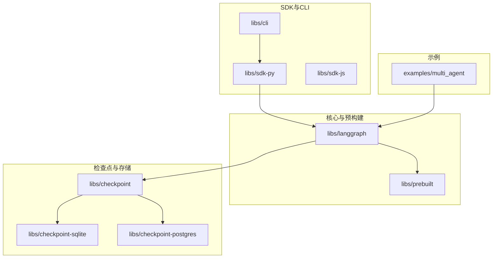
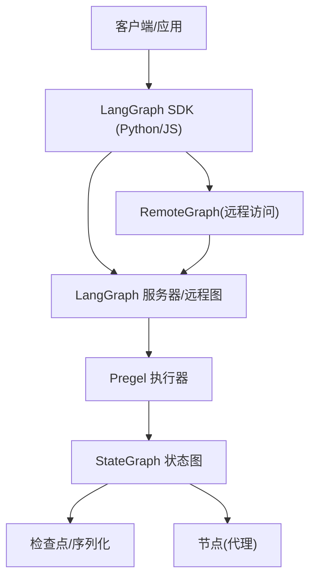
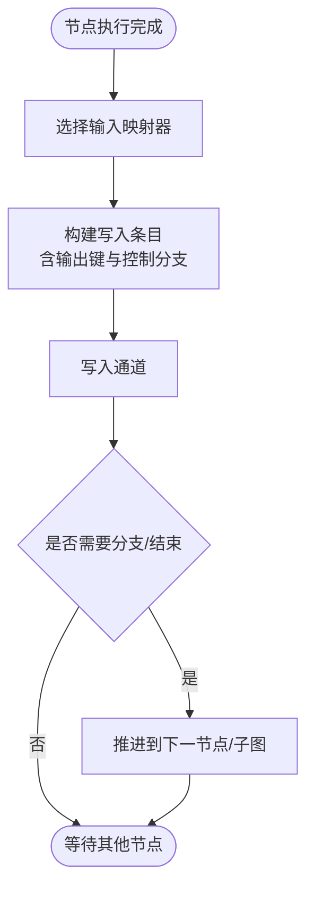
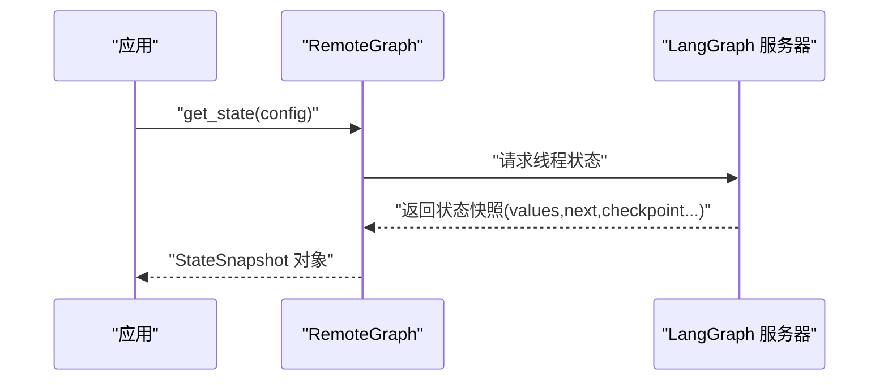
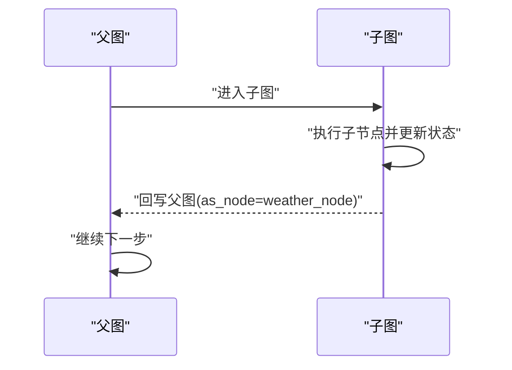
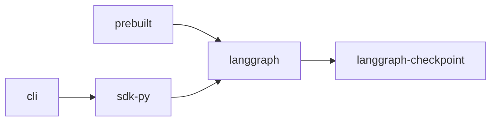

# 多代理协作

<cite>
**本文引用的文件**
- [README.md](file://README.md)
- [AGENTS.md](file://AGENTS.md)
- [libs/langgraph/pyproject.toml](file://libs/langgraph/pyproject.toml)
- [libs/prebuilt/pyproject.toml](file://libs/prebuilt/pyproject.toml)
- [libs/langgraph/langgraph/graph/state.py](file://libs/langgraph/langgraph/graph/state.py)
- [libs/langgraph/langgraph/pregel/__init__.py](file://libs/langgraph/langgraph/pregel/__init__.py)
- [libs/langgraph/tests/test_remote_graph.py](file://libs/langgraph/tests/test_remote_graph.py)
- [libs/langgraph/tests/test_large_cases_async.py](file://libs/langgraph/tests/test_large_cases_async.py)
- [examples/multi_agent/hierarchical_agent_teams.ipynb](file://examples/multi_agent/hierarchical_agent_teams.ipynb)
- [examples/multi_agent/multi-agent-collaboration.ipynb](file://examples/multi_agent/multi-agent-collaboration.ipynb)
</cite>

## 目录
1. [简介](#简介)
2. [项目结构](#项目结构)
3. [核心组件](#核心组件)
4. [架构总览](#架构总览)
5. [详细组件分析](#详细组件分析)
6. [依赖关系分析](#依赖关系分析)
7. [性能考虑](#性能考虑)
8. [故障排查指南](#故障排查指南)
9. [结论](#结论)
10. [附录](#附录)

## 简介
本文件面向希望构建“多代理协作系统”的读者，围绕层级代理团队与多代理协作的设计模式与实现方法展开，重点解释代理间通信机制、协调策略与冲突解决思路，并提供可落地的配置示例与最佳实践。LangGraph 是一个低层编排框架，支持状态化、多参与者（多代理）工作流的持久化执行、人机协同、内存与调试能力，适合用于搭建复杂代理生态，如监督代理、执行代理、协调代理等。

## 项目结构
该仓库为多语言/多包的单体仓库（monorepo），核心与示例分布如下：
- 核心框架：libs/langgraph（多代理图执行引擎）
- 预构建高层 API：libs/prebuilt（简化代理与工具的创建与运行）
- 检查点与存储相关子库：libs/checkpoint 及其具体实现（sqlite/postgres/redis 等）
- 命令行与 SDK：libs/cli、libs/sdk-py、libs/sdk-js
- 示例：examples 下包含多代理协作、计划-执行、RAG、客户服务等场景

图表来源
- [AGENTS.md:33-53](file://AGENTS.md#L33-L53)
- [libs/langgraph/pyproject.toml:26-33](file://libs/langgraph/pyproject.toml#L26-L33)
- [libs/prebuilt/pyproject.toml:26-29](file://libs/prebuilt/pyproject.toml#L26-L29)

章节来源
- [AGENTS.md:19-58](file://AGENTS.md#L19-L58)
- [libs/langgraph/pyproject.toml:1-129](file://libs/langgraph/pyproject.toml#L1-L129)
- [libs/prebuilt/pyproject.toml:1-97](file://libs/prebuilt/pyproject.toml#L1-L97)

## 核心组件
- 多代理执行内核（Pregel）：负责节点调度、通道写入、状态更新与分支控制，是多代理协作的底层执行引擎。
- 状态图（StateGraph）：以状态为中心的图模型，定义节点、边与状态字段，支持多代理在统一状态空间中协作。
- 远程图（RemoteGraph）：通过 SDK 访问远程部署的图，便于分布式或多租户场景下的多代理协作。
- 预构建 API（prebuilt）：提供高层封装，加速构建常见代理类型与工具调用流程。
- 检查点与序列化：保障状态持久化、恢复与跨进程/网络传输的一致性。

章节来源
- [libs/langgraph/langgraph/pregel/__init__.py:1-3](file://libs/langgraph/langgraph/pregel/__init__.py#L1-L3)
- [libs/langgraph/langgraph/graph/state.py:1286-1315](file://libs/langgraph/langgraph/graph/state.py#L1286-L1315)
- [libs/langgraph/tests/test_remote_graph.py:164-246](file://libs/langgraph/tests/test_remote_graph.py#L164-L246)
- [libs/prebuilt/pyproject.toml:26-29](file://libs/prebuilt/pyproject.toml#L26-L29)

## 架构总览
下图展示了多代理协作的端到端架构：客户端/服务端通过 SDK 调用图执行；图由 Pregel 执行器驱动，状态在 StateGraph 中管理；持久化通过检查点实现；预构建 API 提供高层封装。

图表来源
- [libs/langgraph/tests/test_remote_graph.py:164-246](file://libs/langgraph/tests/test_remote_graph.py#L164-L246)
- [libs/langgraph/langgraph/pregel/__init__.py:1-3](file://libs/langgraph/langgraph/pregel/__init__.py#L1-L3)
- [libs/langgraph/langgraph/graph/state.py:1286-1315](file://libs/langgraph/langgraph/graph/state.py#L1286-L1315)

## 详细组件分析

### 组件一：状态图与节点写入（StateGraph 与 Pregel 写入器）
- StateGraph 定义状态字段与节点映射，Pregel 在节点执行后通过写入器将输出写入对应通道，并处理控制分支（如结束或进入子图）。
- 关键路径：节点注册时根据输入模式选择映射器，生成写入条目，最终写入通道并触发后续节点。

图表来源
- [libs/langgraph/langgraph/graph/state.py:1286-1315](file://libs/langgraph/langgraph/graph/state.py#L1286-L1315)

章节来源
- [libs/langgraph/langgraph/graph/state.py:1286-1315](file://libs/langgraph/langgraph/graph/state.py#L1286-L1315)

### 组件二：远程图访问（RemoteGraph）
- RemoteGraph 封装远程图的读取与状态查询，支持同步与异步客户端，便于在多代理协作中跨进程/网络访问共享状态。
- 典型流程：构造 RemoteGraph → 调用 get_state/aget_state 获取状态快照 → 解析 values/next/tasks 等字段进行决策。

图表来源
- [libs/langgraph/tests/test_remote_graph.py:164-246](file://libs/langgraph/tests/test_remote_graph.py#L164-L246)

章节来源
- [libs/langgraph/tests/test_remote_graph.py:164-246](file://libs/langgraph/tests/test_remote_graph.py#L164-L246)

### 组件三：异步大用例与子图协作（异步测试）
- 异步测试展示了多代理在子图中的协作：父图推进到子图，子图节点更新状态后回写父图，形成嵌套协作。
- 关键点：父图 next 字段指示进入子图；子图状态回写需指定 as_node 指定目标节点。

图表来源
- [libs/langgraph/tests/test_large_cases_async.py:3832-3877](file://libs/langgraph/tests/test_large_cases_async.py#L3832-L3877)

章节来源
- [libs/langgraph/tests/test_large_cases_async.py:3832-3877](file://libs/langgraph/tests/test_large_cases_async.py#L3832-L3877)

### 组件四：多代理协作示例（归档说明）
- examples/multi_agent 目录中的两个笔记本已迁移至集中化的 LangChain 文档，当前仅保留归档说明。
- 建议参考官方教程获取最新的层级代理团队与多代理协作示例。

章节来源
- [examples/multi_agent/hierarchical_agent_teams.ipynb:1-42](file://examples/multi_agent/hierarchical_agent_teams.ipynb#L1-L42)
- [examples/multi_agent/multi-agent-collaboration.ipynb:1-42](file://examples/multi_agent/multi-agent-collaboration.ipynb#L1-L42)

## 依赖关系分析
- langgraph 依赖 langgraph-checkpoint、langgraph-sdk、langgraph-prebuilt 等子库，形成“执行内核 + 存储/序列化 + SDK + 预构建 API”的组合。
- prebuilt 依赖 langgraph 与检查点库，提供高层 API。
- CLI 依赖 SDK，用于本地开发与部署。

图表来源
- [libs/langgraph/pyproject.toml:26-33](file://libs/langgraph/pyproject.toml#L26-L33)
- [libs/prebuilt/pyproject.toml:26-29](file://libs/prebuilt/pyproject.toml#L26-L29)
- [libs/langgraph/pyproject.toml:83-89](file://libs/langgraph/pyproject.toml#L83-L89)

章节来源
- [libs/langgraph/pyproject.toml:1-129](file://libs/langgraph/pyproject.toml#L1-L129)
- [libs/prebuilt/pyproject.toml:1-97](file://libs/prebuilt/pyproject.toml#L1-L97)

## 性能考虑
- 并发与事件循环：测试环境使用 uvloop，有助于提升异步 I/O 密集场景的吞吐。
- 序列化与检查点：使用高效的序列化与检查点策略，减少状态读写开销。
- 调试与观测：结合 LangSmith 进行可视化追踪与指标采集，定位瓶颈与异常路径。
- 部署与扩展：利用 LangSmith 部署平台，按需扩展多代理实例与状态存储。

章节来源
- [libs/langgraph/pyproject.toml:63-67](file://libs/langgraph/pyproject.toml#L63-L67)
- [README.md:35-46](file://README.md#L35-L46)

## 故障排查指南
- 状态快照不一致：确认线程 ID、命名空间与检查点 ID 的一致性，避免并发写入导致的状态错配。
- 分支与子图：检查父图 next 字段与子图入口，确保回写时 as_node 正确指向目标节点。
- 远程访问：验证 RemoteGraph 的客户端配置与服务器可达性，关注 get_state/aget_state 返回的 next 与 tasks 字段。
- 异常与中断：利用 LangSmith 观测执行轨迹，定位阻断点与错误节点。

章节来源
- [libs/langgraph/tests/test_remote_graph.py:164-246](file://libs/langgraph/tests/test_remote_graph.py#L164-L246)
- [libs/langgraph/tests/test_large_cases_async.py:3832-3877](file://libs/langgraph/tests/test_large_cases_async.py#L3832-L3877)
- [README.md:40-46](file://README.md#L40-L46)

## 结论
LangGraph 提供了构建多代理协作系统所需的基础设施：以状态为中心的图模型、可靠的执行内核、持久化与远程访问能力，以及高层预构建 API。通过合理设计代理角色（监督/协调/执行）、明确通信协议（通道写入/分支/子图）、制定冲突解决策略（优先级/仲裁/回滚），可构建稳定、可观测且可扩展的复杂代理生态系统。

## 附录
- 快速开始与文档入口：参见根目录 README 的“文档”与“快速开始”链接。
- 示例迁移说明：多代理示例已迁移至集中化文档，建议直接参考官方教程获取最新示例。

章节来源
- [README.md:61-67](file://README.md#L61-L67)
- [examples/multi_agent/hierarchical_agent_teams.ipynb:8-18](file://examples/multi_agent/hierarchical_agent_teams.ipynb#L8-L18)
- [examples/multi_agent/multi-agent-collaboration.ipynb:8-18](file://examples/multi_agent/multi-agent-collaboration.ipynb#L8-L18)