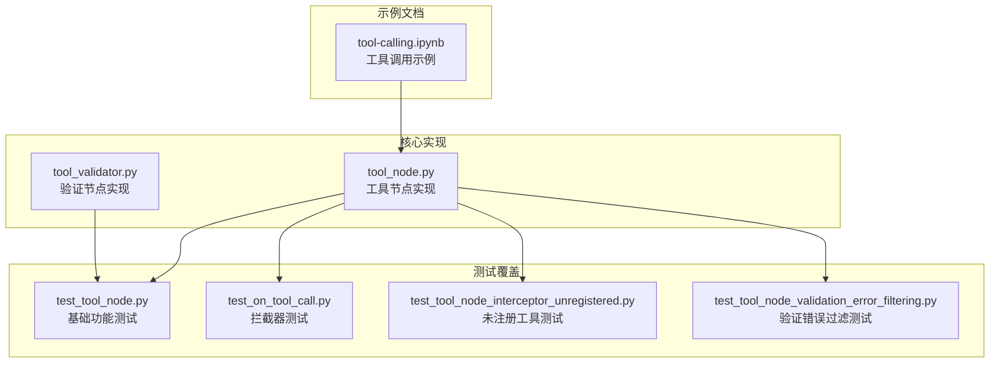
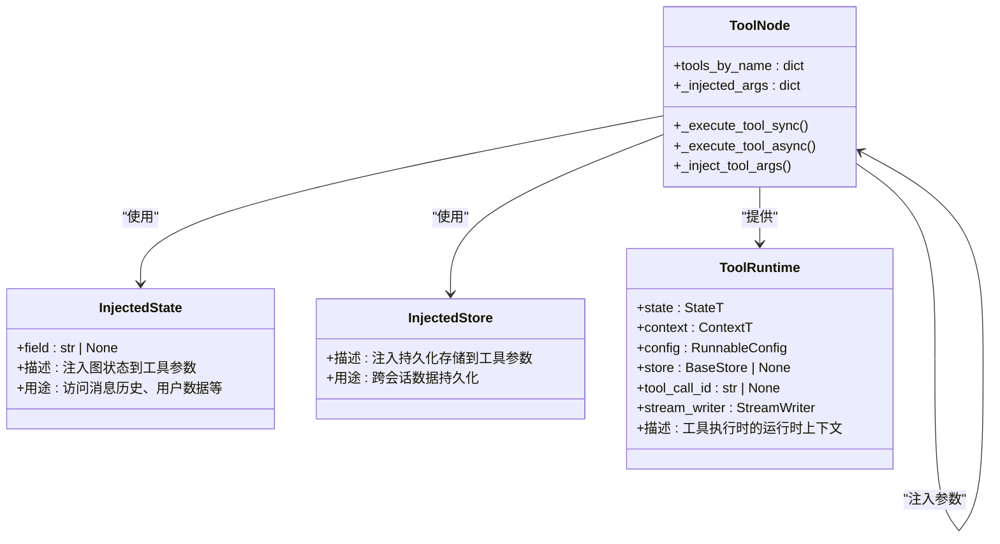
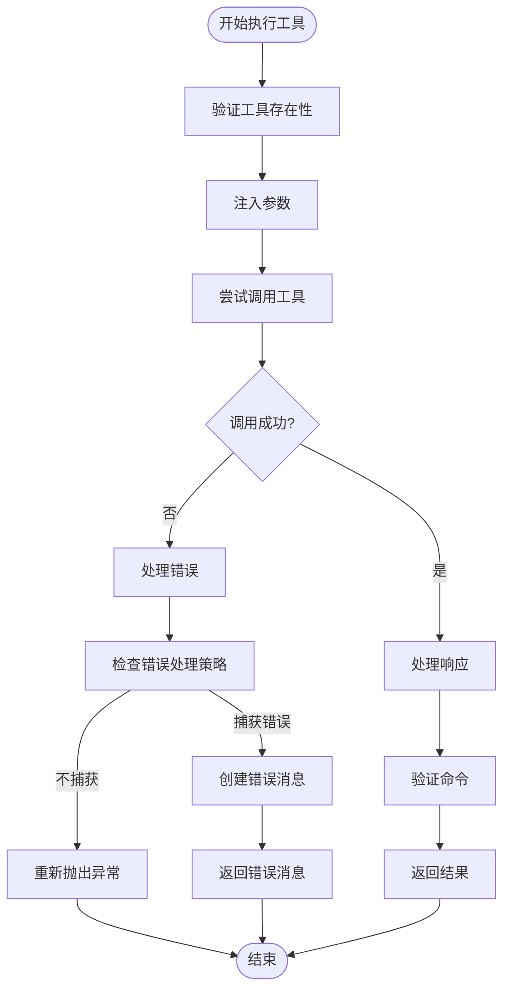
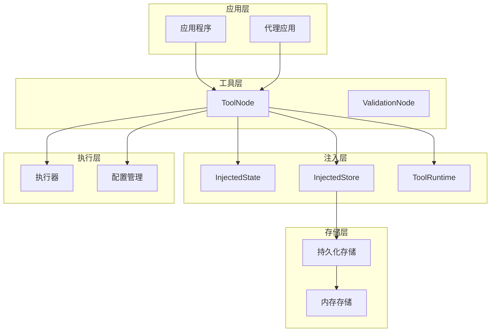
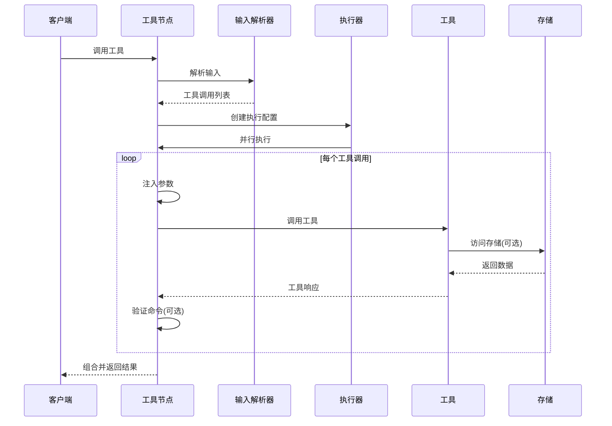
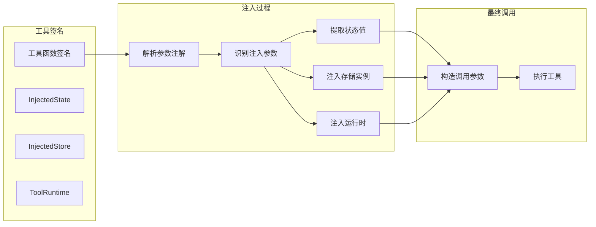
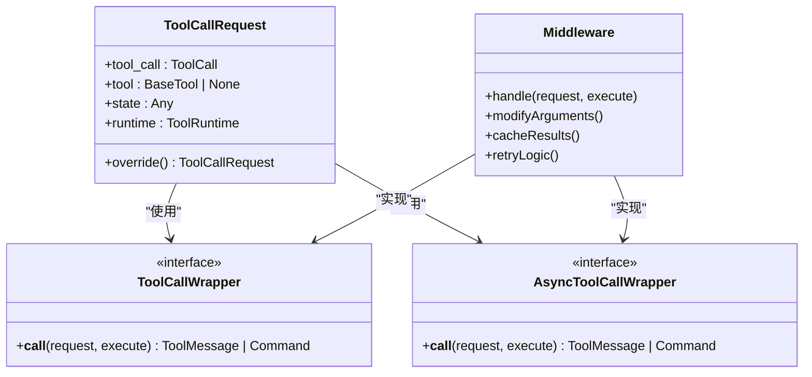
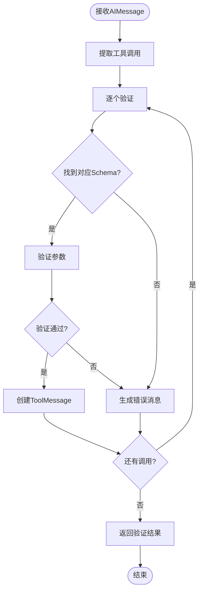
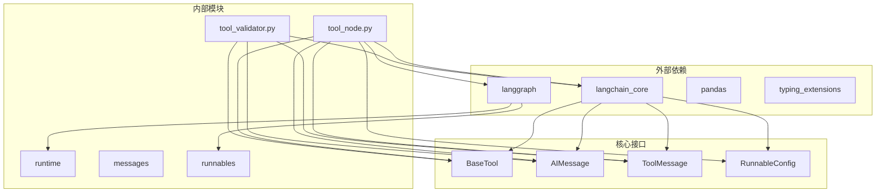

# 工具调用代理

<cite>
**本文档引用的文件**
- [tool_node.py](file://libs/prebuilt/langgraph/prebuilt/tool_node.py)
- [tool_validator.py](file://libs/prebuilt/langgraph/prebuilt/tool_validator.py)
- [test_tool_node.py](file://libs/prebuilt/tests/test_tool_node.py)
- [test_on_tool_call.py](file://libs/prebuilt/tests/test_on_tool_call.py)
- [test_tool_node_interceptor_unregistered.py](file://libs/prebuilt/tests/test_tool_node_interceptor_unregistered.py)
- [test_tool_node_validation_error_filtering.py](file://libs/prebuilt/tests/test_tool_node_validation_error_filtering.py)
- [tool-calling.ipynb](file://examples/tool-calling.ipynb)
</cite>

## 目录
1. [简介](#简介)
2. [项目结构](#项目结构)
3. [核心组件](#核心组件)
4. [架构概览](#架构概览)
5. [详细组件分析](#详细组件分析)
6. [依赖分析](#依赖分析)
7. [性能考虑](#性能考虑)
8. [故障排除指南](#故障排除指南)
9. [结论](#结论)
10. [附录](#附录)

## 简介

工具调用代理是 LangGraph 中用于执行工具的核心组件，它提供了强大的工具执行、状态注入、持久化存储访问和错误处理能力。本文档深入解析工具调用代理的设计模式、实现机制和最佳实践。

工具调用代理主要包含以下关键特性：
- **并行工具执行**：支持同时执行多个工具调用以提高效率
- **状态注入**：允许工具访问图状态而无需暴露给语言模型
- **持久化存储**：为工具提供跨会话的数据持久化能力
- **智能错误处理**：提供灵活的错误处理策略和验证错误过滤
- **中间件支持**：通过拦截器实现请求修改、重试逻辑和缓存功能

## 项目结构

工具调用代理相关的代码主要分布在以下文件中：



**图表来源**
- [tool_node.py:1-1893](file://libs/prebuilt/langgraph/prebuilt/tool_node.py#L1-L1893)
- [tool_validator.py:1-222](file://libs/prebuilt/langgraph/prebuilt/tool_validator.py#L1-L222)

**章节来源**
- [tool_node.py:1-1893](file://libs/prebuilt/langgraph/prebuilt/tool_node.py#L1-L1893)
- [tool_validator.py:1-222](file://libs/prebuilt/langgraph/prebuilt/tool_validator.py#L1-L222)

## 核心组件

### ToolNode 类

ToolNode 是工具调用代理的核心类，负责执行工具调用并管理整个执行流程。

**主要职责**：
- 解析输入格式（消息列表、字典状态或直接工具调用）
- 并行执行多个工具调用
- 处理工具参数注入（状态、存储、运行时上下文）
- 执行错误处理和验证
- 支持命令式工具返回（Command）

**关键属性**：
- `tools_by_name`：工具名称到工具实例的映射
- `_injected_args`：注入参数的预计算映射
- `handle_tool_errors`：错误处理配置
- `_wrap_tool_call`：同步工具调用包装器
- `_awrap_tool_call`：异步工具调用包装器

**章节来源**
- [tool_node.py:619-789](file://libs/prebuilt/langgraph/prebuilt/tool_node.py#L619-L789)

### 注入系统

工具调用代理提供了三种类型的自动注入：



**图表来源**
- [tool_node.py:1620-1893](file://libs/prebuilt/langgraph/prebuilt/tool_node.py#L1620-L1893)

**章节来源**
- [tool_node.py:1620-1893](file://libs/prebuilt/langgraph/prebuilt/tool_node.py#L1620-L1893)

### 错误处理系统

工具调用代理提供了灵活的错误处理机制：



**图表来源**
- [tool_node.py:901-998](file://libs/prebuilt/langgraph/prebuilt/tool_node.py#L901-L998)

**章节来源**
- [tool_node.py:901-998](file://libs/prebuilt/langgraph/prebuilt/tool_node.py#L901-L998)

## 架构概览

工具调用代理采用分层架构设计，确保了高内聚低耦合：



**图表来源**
- [tool_node.py:1-1893](file://libs/prebuilt/langgraph/prebuilt/tool_node.py#L1-L1893)
- [tool_validator.py:1-222](file://libs/prebuilt/langgraph/prebuilt/tool_validator.py#L1-L222)

## 详细组件分析

### 工具节点执行流程

工具节点的执行流程包含多个阶段：



**图表来源**
- [tool_node.py:790-855](file://libs/prebuilt/langgraph/prebuilt/tool_node.py#L790-L855)

**章节来源**
- [tool_node.py:790-855](file://libs/prebuilt/langgraph/prebuilt/tool_node.py#L790-L855)

### 参数注入机制

参数注入是工具调用代理的核心功能之一，它允许工具访问图状态和存储而无需暴露给语言模型：



**图表来源**
- [tool_node.py:1287-1396](file://libs/prebuilt/langgraph/prebuilt/tool_node.py#L1287-L1396)

**章节来源**
- [tool_node.py:1287-1396](file://libs/prebuilt/langgraph/prebuilt/tool_node.py#L1287-L1396)

### 拦截器模式

工具调用代理支持拦截器模式，允许在工具执行前后进行自定义处理：



**图表来源**
- [tool_node.py:200-281](file://libs/prebuilt/langgraph/prebuilt/tool_node.py#L200-L281)

**章节来源**
- [tool_node.py:200-281](file://libs/prebuilt/langgraph/prebuilt/tool_node.py#L200-L281)

### 验证节点

验证节点用于验证工具调用的结构和参数，而不实际执行工具：



**图表来源**
- [tool_validator.py:184-222](file://libs/prebuilt/langgraph/prebuilt/tool_validator.py#L184-L222)

**章节来源**
- [tool_validator.py:184-222](file://libs/prebuilt/langgraph/prebuilt/tool_validator.py#L184-L222)

## 依赖分析

工具调用代理的依赖关系相对清晰，主要依赖于 LangChain Core 和 LangGraph 运行时：



**图表来源**
- [tool_node.py:40-92](file://libs/prebuilt/langgraph/prebuilt/tool_node.py#L40-L92)
- [tool_validator.py:8-31](file://libs/prebuilt/langgraph/prebuilt/tool_validator.py#L8-L31)

**章节来源**
- [tool_node.py:40-92](file://libs/prebuilt/langgraph/prebuilt/tool_node.py#L40-L92)
- [tool_validator.py:8-31](file://libs/prebuilt/langgraph/prebuilt/tool_validator.py#L8-L31)

## 性能考虑

工具调用代理在设计时充分考虑了性能优化：

### 并行执行优化
- 使用线程池执行器进行并行工具调用
- 异步工具调用使用 asyncio.gather 实现并发
- 配置级别的执行器选择

### 内存管理
- 注入参数的预计算和缓存
- 工具调用请求的不可变模式
- 响应内容的类型转换优化

### 缓存策略
- 拦截器支持的缓存实现
- 验证结果的短期缓存
- 存储访问的批量操作

## 故障排除指南

### 常见错误类型

**工具不存在错误**：
```python
# 错误信息格式
"Error: {requested_tool} is not a valid tool, try one of [{available_tools}]."
```

**参数验证错误**：
- 自动过滤系统注入参数
- 只显示LLM可控参数的错误信息
- 支持详细的错误位置和消息

**执行时错误**：
- 可配置的错误处理策略
- 支持多种异常类型处理
- 错误消息的自定义格式

### 调试技巧

1. **启用详细日志**：检查工具调用的完整生命周期
2. **验证工具注册**：确认工具已正确添加到 ToolNode
3. **检查注入参数**：验证状态和存储注入是否正确
4. **测试拦截器**：验证自定义拦截器的实现

**章节来源**
- [tool_node.py:106-119](file://libs/prebuilt/langgraph/prebuilt/tool_node.py#L106-L119)
- [tool_node.py:508-561](file://libs/prebuilt/langgraph/prebuilt/tool_node.py#L508-L561)

## 结论

工具调用代理是 LangGraph 生态系统中的核心组件，它提供了强大而灵活的工具执行能力。通过状态注入、持久化存储访问、智能错误处理和拦截器支持，它能够满足各种复杂的代理应用场景。

主要优势包括：
- **高度可扩展**：支持自定义拦截器和错误处理策略
- **类型安全**：完整的类型注解和验证
- **性能优化**：并行执行和缓存机制
- **易用性**：简洁的API设计和丰富的配置选项

对于开发者而言，理解工具调用代理的工作原理有助于构建更加强大和可靠的AI代理应用。

## 附录

### 最佳实践

1. **工具设计**：合理使用注入参数，避免过度依赖系统状态
2. **错误处理**：根据应用场景选择合适的错误处理策略
3. **性能优化**：利用并行执行和缓存机制提升性能
4. **测试覆盖**：编写全面的单元测试和集成测试

### 扩展指南

1. **自定义拦截器**：实现复杂的业务逻辑和控制流
2. **错误处理器**：开发专门的错误处理策略
3. **存储适配器**：实现自定义的持久化存储后端
4. **监控集成**：添加性能监控和日志记录