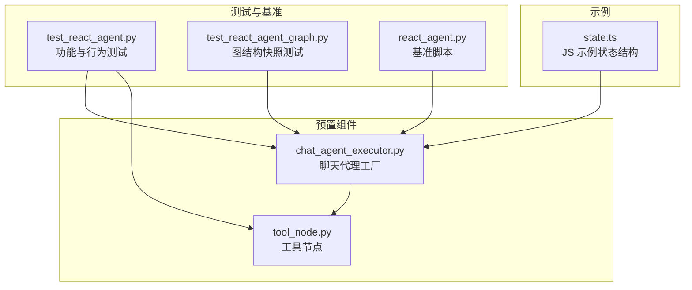
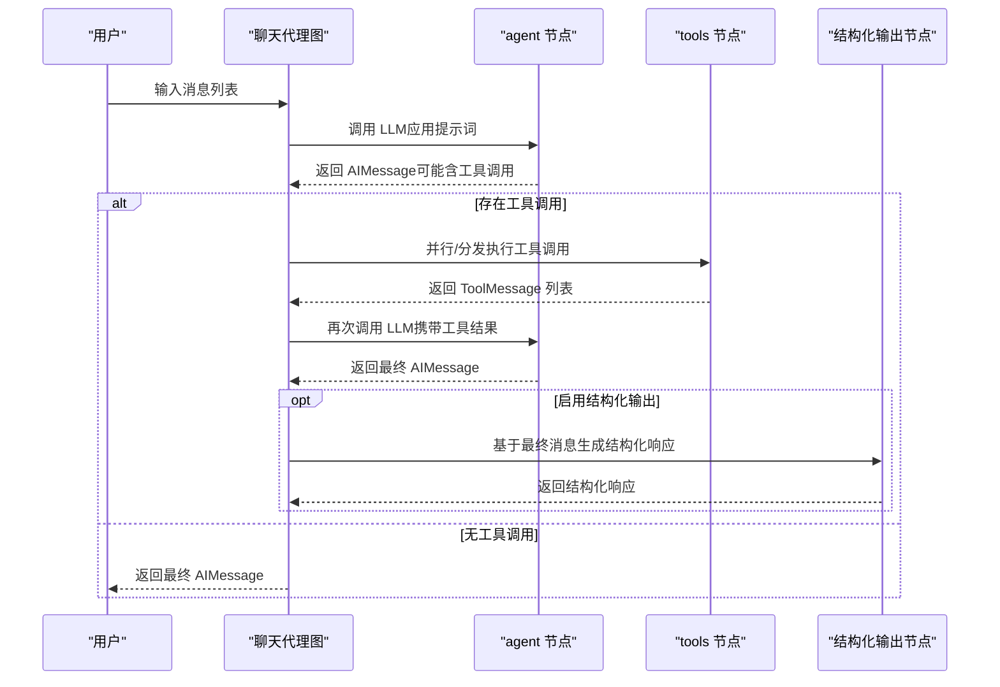
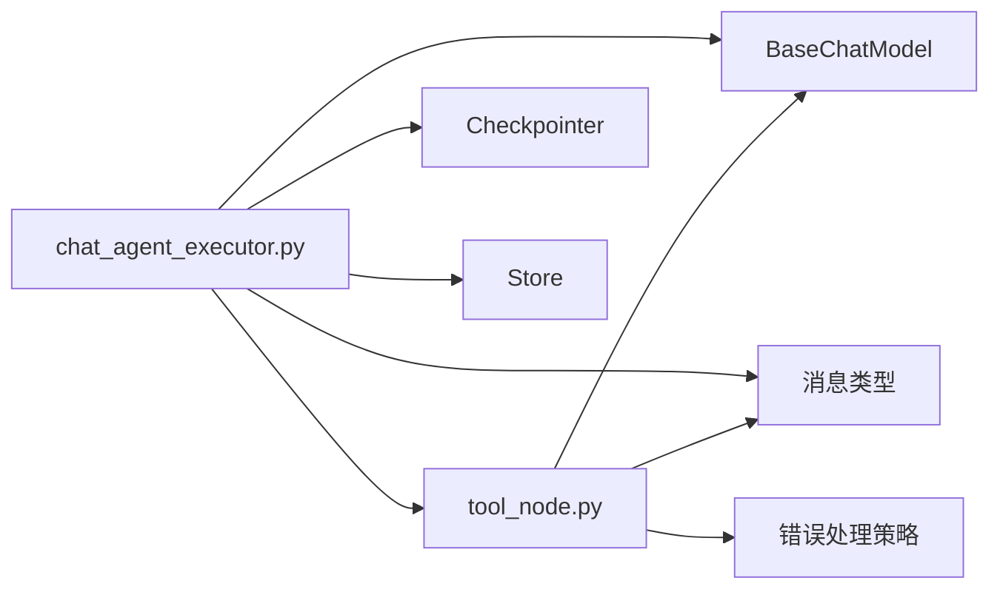

# 聊天代理

<cite>
**本文引用的文件**
- [libs/prebuilt/langgraph/prebuilt/chat_agent_executor.py](file://libs/prebuilt/langgraph/prebuilt/chat_agent_executor.py)
- [libs/prebuilt/tests/test_react_agent.py](file://libs/prebuilt/tests/test_react_agent.py)
- [libs/prebuilt/tests/test_react_agent_graph.py](file://libs/prebuilt/tests/test_react_agent_graph.py)
- [libs/prebuilt/langgraph/prebuilt/tool_node.py](file://libs/prebuilt/langgraph/prebuilt/tool_node.py)
- [libs/langgraph/bench/react_agent.py](file://libs/langgraph/bench/react_agent.py)
- [libs/cli/js-examples/src/agent/state.ts](file://libs/cli/js-examples/src/agent/state.ts)
</cite>

## 目录
1. [简介](#简介)
2. [项目结构](#项目结构)
3. [核心组件](#核心组件)
4. [架构总览](#架构总览)
5. [详细组件分析](#详细组件分析)
6. [依赖分析](#依赖分析)
7. [性能考量](#性能考量)
8. [故障排查指南](#故障排查指南)
9. [结论](#结论)
10. [附录](#附录)

## 简介
本文件系统性阐述 React 模型聊天代理（ReAct）在 LangGraph 中的实现与使用方法，重点围绕 create_react_agent 的参数配置、状态管理机制、消息处理流程展开，并提供完整配置示例与最佳实践。同时解释聊天代理与“工具调用代理”的区别与联系，覆盖对话状态管理、上下文维护、多轮对话处理策略，以及针对不同应用场景的可调优点。

## 项目结构
本主题涉及的核心代码位于预置组件库中，主要由以下模块构成：
- 聊天代理工厂：负责构建 ReAct 图谱、绑定 LLM 与工具、路由工具调用、生成最终响应等
- 工具节点：执行工具调用、错误处理、状态注入、并发执行等
- 测试与基准：验证行为一致性、图结构、并发工具调用、结构化输出等

图表来源
- [libs/prebuilt/langgraph/prebuilt/chat_agent_executor.py](file://libs/prebuilt/langgraph/prebuilt/chat_agent_executor.py)
- [libs/prebuilt/langgraph/prebuilt/tool_node.py](file://libs/prebuilt/langgraph/prebuilt/tool_node.py)
- [libs/prebuilt/tests/test_react_agent.py](file://libs/prebuilt/tests/test_react_agent.py)
- [libs/prebuilt/tests/test_react_agent_graph.py](file://libs/prebuilt/tests/test_react_agent_graph.py)
- [libs/langgraph/bench/react_agent.py](file://libs/langgraph/bench/react_agent.py)
- [libs/cli/js-examples/src/agent/state.ts](file://libs/cli/js-examples/src/agent/state.ts)

章节来源
- [libs/prebuilt/langgraph/prebuilt/chat_agent_executor.py](file://libs/prebuilt/langgraph/prebuilt/chat_agent_executor.py)
- [libs/prebuilt/langgraph/prebuilt/tool_node.py](file://libs/prebuilt/langgraph/prebuilt/tool_node.py)
- [libs/prebuilt/tests/test_react_agent.py](file://libs/prebuilt/tests/test_react_agent.py)
- [libs/prebuilt/tests/test_react_agent_graph.py](file://libs/prebuilt/tests/test_react_agent_graph.py)
- [libs/langgraph/bench/react_agent.py](file://libs/langgraph/bench/react_agent.py)
- [libs/cli/js-examples/src/agent/state.ts](file://libs/cli/js-examples/src/agent/state.ts)

## 核心组件
- create_react_agent：构建 ReAct 聊天代理图谱，支持静态/动态模型选择、提示词注入、工具绑定、前置/后置钩子、结构化输出、检查点与中断等
- ToolNode：执行工具调用，支持并发、错误处理策略、状态/存储注入、命令式更新等
- 状态模式：默认使用包含 messages 与 remaining_steps 的状态；可自定义状态模式以扩展字段或使用 Pydantic 模型

章节来源
- [libs/prebuilt/langgraph/prebuilt/chat_agent_executor.py](file://libs/prebuilt/langgraph/prebuilt/chat_agent_executor.py)
- [libs/prebuilt/langgraph/prebuilt/tool_node.py](file://libs/prebuilt/langgraph/prebuilt/tool_node.py)

## 架构总览
ReAct 聊天代理采用状态图（StateGraph）驱动，核心节点包括：
- agent：调用 LLM 生成消息，可能包含工具调用
- tools：执行工具调用，返回 ToolMessage
- 可选：pre_model_hook（前置）、post_model_hook（后置）、generate_structured_response（结构化输出）
- 路由逻辑：根据是否仍有未完成的工具调用决定继续循环还是结束

图表来源
- [libs/prebuilt/langgraph/prebuilt/chat_agent_executor.py](file://libs/prebuilt/langgraph/prebuilt/chat_agent_executor.py)

章节来源
- [libs/prebuilt/langgraph/prebuilt/chat_agent_executor.py](file://libs/prebuilt/langgraph/prebuilt/chat_agent_executor.py)

## 详细组件分析

### create_react_agent 参数与配置
- 模型（model）
  - 支持字符串标识（如 provider:model）、静态模型实例、动态模型函数（同步/异步），动态模型需返回 BaseChatModel 或可调用的 Runnable
  - 若模型已绑定工具，需与 tools 参数保持一致；否则会自动绑定
- 工具（tools）
  - 支持工具列表或 ToolNode 实例；可混合内置工具描述与普通工具
  - 若存在 return_direct 的工具，命中时可直接结束
- 提示词（prompt）
  - 支持字符串、SystemMessage、可调用对象、Runnable；用于在调用 LLM 前注入系统信息或动态构造输入
- 结构化输出（response_format）
  - 可为 OpenAI 函数/schema、JSON Schema、TypedDict、Pydantic 类，或二元组（提示词, schema）
  - v2 版本会在主循环结束后单独调用 LLM 生成结构化响应
- 钩子（pre_model_hook/post_model_hook）
  - pre_model_hook：在 agent 节点前执行，可用于裁剪/压缩消息历史、注入 llm_input_messages 等
  - post_model_hook：在 agent 节点后执行，可用于人机交互、守卫/校验、后处理等（v2 可用）
- 状态模式（state_schema/context_schema）
  - 默认包含 messages 与 remaining_steps；可自定义状态结构（字典/TypedDict/Pydantic）
  - remaining_steps 用于限制最大步数，避免无限循环
- 检查点与存储（checkpointer/store）
  - 支持线程级持久化（单对话记忆）与跨线程持久化（多对话/用户共享）
- 中断（interrupt_before/interrupt_after）
  - 可在 agent/tools 节点前/后插入中断，便于人工确认或外部干预
- 版本（version）
  - v1：工具节点一次性处理整条消息中的所有工具调用，内部并行执行
  - v2：工具节点按单个工具调用分发，使用 Send API 并行调度，支持更灵活的人机交互与路由

章节来源
- [libs/prebuilt/langgraph/prebuilt/chat_agent_executor.py](file://libs/prebuilt/langgraph/prebuilt/chat_agent_executor.py)
- [libs/prebuilt/tests/test_react_agent.py](file://libs/prebuilt/tests/test_react_agent.py)

### 状态管理与消息处理
- 状态键
  - messages：累积人类消息、AI 回复、工具结果等，遵循追加合并策略
  - remaining_steps：剩余步数，控制循环终止条件
  - structured_response（可选）：当启用结构化输出时，保存最终结构化结果
- 消息历史校验
  - 要求每个 AIMessage 中的工具调用都必须有对应的 ToolMessage，否则抛出错误
- 多轮对话与上下文维护
  - 使用检查点保存每条线程的状态快照，支持历史查询与恢复
  - 可通过 store 注入持久化存储，实现跨轮次的数据共享

章节来源
- [libs/prebuilt/langgraph/prebuilt/chat_agent_executor.py](file://libs/prebuilt/langgraph/prebuilt/chat_agent_executor.py)
- [libs/prebuilt/tests/test_react_agent.py](file://libs/prebuilt/tests/test_react_agent.py)
- [libs/cli/js-examples/src/agent/state.ts](file://libs/cli/js-examples/src/agent/state.ts)

### 工具节点（ToolNode）与工具调用
- 执行模式
  - v1：同一消息内所有工具调用并行执行
  - v2：按工具调用分发到多个工具节点实例，支持 Send API 与中断
- 错误处理
  - 可配置为捕获特定异常类型、自定义错误消息、或直接抛出
  - 对参数校验失败的工具调用，过滤掉系统注入参数，仅向 LLM 暴露可修复的错误
- 状态/存储注入
  - 工具可通过注解注入 graph state、store、runtime 等上下文
- 命令式更新
  - 工具可返回 Command，实现状态更新、路由跳转、发送消息等高级控制流

章节来源
- [libs/prebuilt/langgraph/prebuilt/tool_node.py](file://libs/prebuilt/langgraph/prebuilt/tool_node.py)
- [libs/prebuilt/tests/test_react_agent.py](file://libs/prebuilt/tests/test_react_agent.py)

### 结构化输出流程
- 当启用 response_format 时，主循环结束后会基于最终消息列表与指定 schema 调用 LLM 生成结构化响应
- 支持传入（提示词, schema）二元组，将系统提示词与消息合并后再生成结构化输出

章节来源
- [libs/prebuilt/langgraph/prebuilt/chat_agent_executor.py](file://libs/prebuilt/langgraph/prebuilt/chat_agent_executor.py)
- [libs/prebuilt/tests/test_react_agent.py](file://libs/prebuilt/tests/test_react_agent.py)

### 图结构与路由
- 条件边：根据是否仍有未完成的工具调用决定下一步路径
- v2 的工具调用分发：使用 Send API 将每个工具调用分发到独立实例，提升并发与可控性
- 可选后置钩子：在 agent 之后插入 post_model_hook，实现人机交互、守卫/校验等

章节来源
- [libs/prebuilt/langgraph/prebuilt/chat_agent_executor.py](file://libs/prebuilt/langgraph/prebuilt/chat_agent_executor.py)
- [libs/prebuilt/tests/test_react_agent_graph.py](file://libs/prebuilt/tests/test_react_agent_graph.py)

### 聊天代理与“工具调用代理”的区别与联系
- 区别
  - 聊天代理：强调对话与多轮交互，通常包含消息历史、提示词注入、检查点与中断等
  - 工具调用代理：更聚焦于“思考-行动”循环，强调工具调用与结果回写
- 联系
  - 聊天代理可视为在工具调用代理基础上增加对话状态管理、提示词与检查点能力的增强版
  - 两者均通过 StateGraph 与工具节点协作，实现 ReAct 循环

章节来源
- [libs/prebuilt/langgraph/prebuilt/chat_agent_executor.py](file://libs/prebuilt/langgraph/prebuilt/chat_agent_executor.py)
- [libs/prebuilt/langgraph/prebuilt/tool_node.py](file://libs/prebuilt/langgraph/prebuilt/tool_node.py)

## 依赖分析
- 组件耦合
  - create_react_agent 依赖 ToolNode 执行工具调用
  - 可选钩子与结构化输出节点作为扩展点接入主图
- 外部依赖
  - LLM 接口（BaseChatModel）、工具接口（BaseTool）、消息类型（HumanMessage、AIMessage、ToolMessage）
  - 检查点与存储接口（Checkpointer、Store）

图表来源
- [libs/prebuilt/langgraph/prebuilt/chat_agent_executor.py](file://libs/prebuilt/langgraph/prebuilt/chat_agent_executor.py)
- [libs/prebuilt/langgraph/prebuilt/tool_node.py](file://libs/prebuilt/langgraph/prebuilt/tool_node.py)

章节来源
- [libs/prebuilt/langgraph/prebuilt/chat_agent_executor.py](file://libs/prebuilt/langgraph/prebuilt/chat_agent_executor.py)
- [libs/prebuilt/langgraph/prebuilt/tool_node.py](file://libs/prebuilt/langgraph/prebuilt/tool_node.py)

## 性能考量
- 工具调用并发
  - v2 版本通过 Send API 并行分发工具调用，显著提升吞吐
- 消息历史优化
  - 使用 pre_model_hook 进行消息裁剪/摘要，降低上下文长度与延迟
- 结构化输出成本
  - v2 在主循环后额外一次 LLM 调用生成结构化响应，需权衡准确性与延迟
- 检查点与存储
  - 合理设置检查点频率与存储策略，避免频繁 IO 影响性能

章节来源
- [libs/prebuilt/langgraph/prebuilt/chat_agent_executor.py](file://libs/prebuilt/langgraph/prebuilt/chat_agent_executor.py)
- [libs/langgraph/bench/react_agent.py](file://libs/langgraph/bench/react_agent.py)

## 故障排查指南
- 工具调用未匹配
  - 现象：提示模型绑定工具与传入 tools 不一致
  - 处理：确保模型绑定工具数量与名称与 tools 完全一致
- 缺少对应工具结果
  - 现象：AIMessage 含工具调用但无对应 ToolMessage
  - 处理：补齐工具调用结果或修正工具调用逻辑
- 参数校验失败
  - 现象：工具参数不符合 schema
  - 处理：过滤系统注入参数后的错误信息反馈给 LLM，指导修正
- 步数不足提前终止
  - 现象：remaining_steps 较低且存在工具调用时提前返回提示
  - 处理：增大 recursion_limit 或 remaining_steps，或减少工具调用次数

章节来源
- [libs/prebuilt/tests/test_react_agent.py](file://libs/prebuilt/tests/test_react_agent.py)
- [libs/prebuilt/langgraph/prebuilt/chat_agent_executor.py](file://libs/prebuilt/langgraph/prebuilt/chat_agent_executor.py)

## 结论
create_react_agent 提供了从 LLM 到工具调用再到最终回复的完整闭环，结合状态管理、提示词注入、钩子扩展、结构化输出与检查点/存储，能够满足复杂对话场景的需求。通过合理选择版本（v1/v2）、配置工具与钩子、优化消息历史与结构化输出策略，可在准确性、延迟与可维护性之间取得平衡。

## 附录

### 配置示例（步骤说明）
- LLM 设置
  - 静态模型：传入模型实例或字符串标识
  - 动态模型：传入返回模型的函数（支持同步/异步），并在其中绑定工具
- 工具集成
  - 工具列表：传入工具函数或工具类实例
  - ToolNode：直接传入 ToolNode 实例以获得更细粒度控制
- 提示词设计
  - 字符串/SystemMessage：简单注入系统角色
  - 可调用对象/Runnable：基于当前状态动态构造输入
- 结构化输出
  - 指定 schema（如 Pydantic 类或 JSON Schema），或（提示词, schema）二元组
- 钩子与中断
  - pre_model_hook：消息裁剪/摘要、注入 llm_input_messages
  - post_model_hook：人机交互、守卫/校验、后处理（v2）
  - 中断：在 agent/tools 前/后插入中断，等待外部确认
- 检查点与存储
  - 单线程：使用 InMemorySaver 或其他 Checkpointer
  - 多线程/多用户：结合 Store 实现跨会话持久化

章节来源
- [libs/prebuilt/langgraph/prebuilt/chat_agent_executor.py](file://libs/prebuilt/langgraph/prebuilt/chat_agent_executor.py)
- [libs/prebuilt/tests/test_react_agent.py](file://libs/prebuilt/tests/test_react_agent.py)