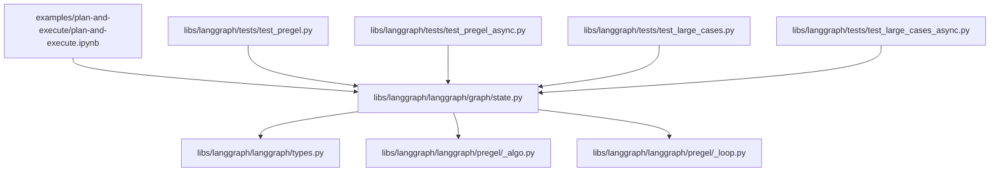
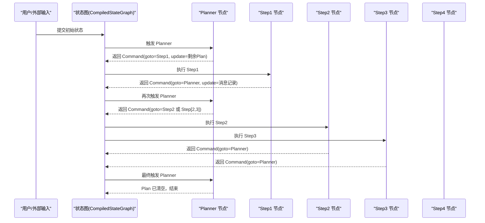
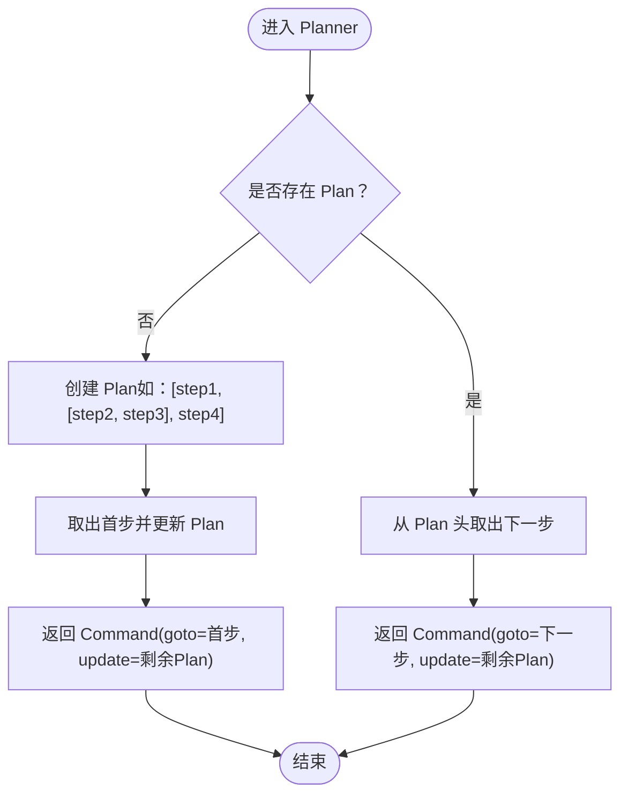
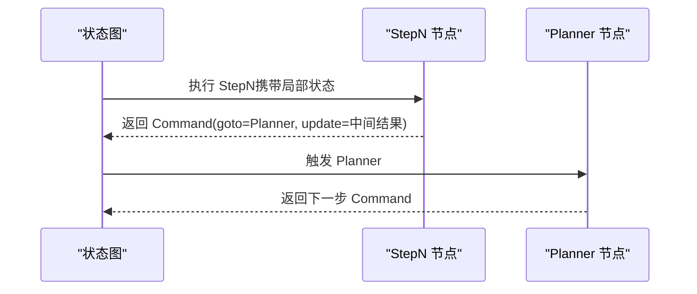
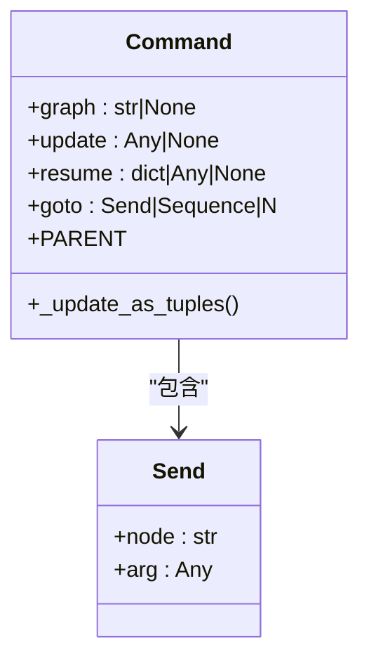
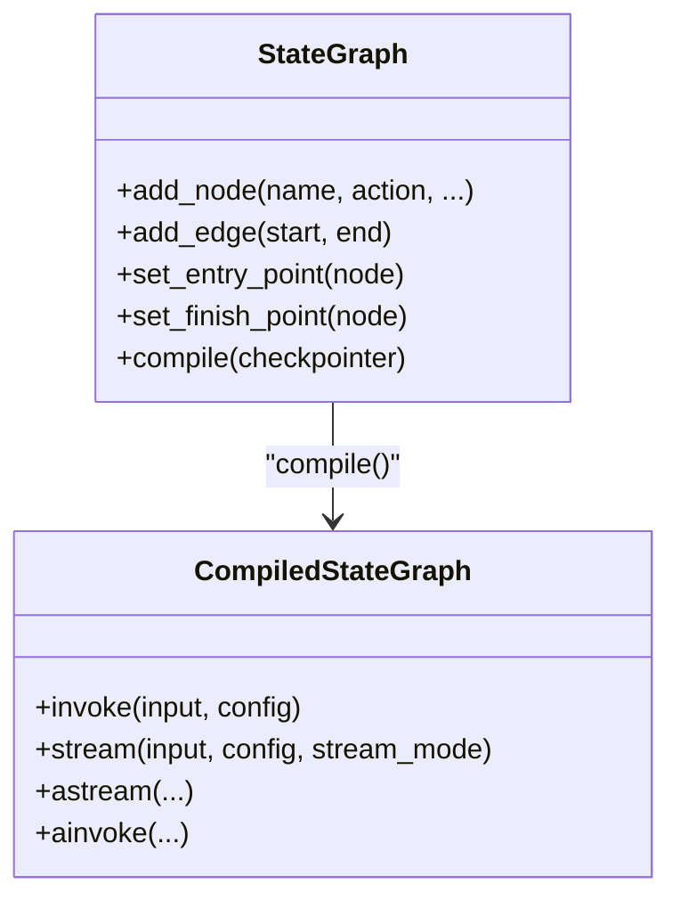
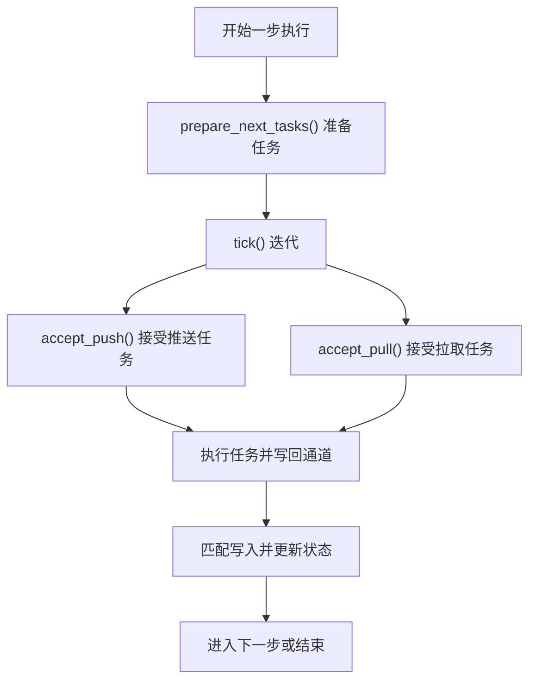
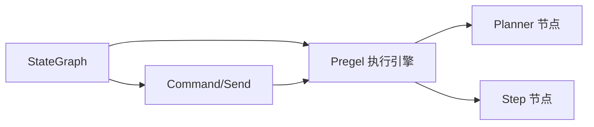

# 计划-执行代理

<cite>
**本文引用的文件**
- [examples/plan-and-execute/plan-and-execute.ipynb](file://examples/plan-and-execute/plan-and-execute.ipynb)
- [libs/langgraph/langgraph/graph/state.py](file://libs/langgraph/langgraph/graph/state.py)
- [libs/langgraph/langgraph/types.py](file://libs/langgraph/langgraph/types.py)
- [libs/langgraph/langgraph/pregel/_algo.py](file://libs/langgraph/langgraph/pregel/_algo.py)
- [libs/langgraph/langgraph/pregel/_loop.py](file://libs/langgraph/langgraph/pregel/_loop.py)
- [libs/langgraph/tests/test_pregel.py](file://libs/langgraph/tests/test_pregel.py)
- [libs/langgraph/tests/test_pregel_async.py](file://libs/langgraph/tests/test_pregel_async.py)
- [libs/langgraph/tests/test_large_cases.py](file://libs/langgraph/tests/test_large_cases.py)
- [libs/langgraph/tests/test_large_cases_async.py](file://libs/langgraph/tests/test_large_cases_async.py)
</cite>

## 目录
1. [简介](#简介)
2. [项目结构](#项目结构)
3. [核心组件](#核心组件)
4. [架构总览](#架构总览)
5. [详细组件分析](#详细组件分析)
6. [依赖关系分析](#依赖关系分析)
7. [性能考量](#性能考量)
8. [故障排查指南](#故障排查指南)
9. [结论](#结论)
10. [附录：配置与使用范式](#附录配置与使用范式)

## 简介
本文件系统性阐述“计划-执行代理”的双阶段工作流：计划生成阶段与执行阶段，并结合 LangGraph 的状态图（StateGraph）与命令（Command）机制，给出可操作的配置示例、复杂任务分解与逐步执行策略、质量评估与错误恢复、动态调整策略，以及针对不同任务复杂度的代理行为调优建议与最佳实践。

## 项目结构
围绕计划-执行代理的关键实现位于以下模块：
- 状态图与编译执行：libs/langgraph/langgraph/graph/state.py
- 命令与发送机制：libs/langgraph/langgraph/types.py
- 执行循环与任务调度：libs/langgraph/langgraph/pregel/_algo.py、libs/langgraph/langgraph/pregel/_loop.py
- 示例与测试用例：examples/plan-and-execute/plan-and-execute.ipynb、libs/langgraph/tests/test_pregel*.py

**图表来源**
- [libs/langgraph/langgraph/graph/state.py:1165-1203](file://libs/langgraph/langgraph/graph/state.py#L1165-L1203)
- [libs/langgraph/langgraph/types.py:652-703](file://libs/langgraph/langgraph/types.py#L652-L703)
- [libs/langgraph/langgraph/pregel/_algo.py:410-444](file://libs/langgraph/langgraph/pregel/_algo.py#L410-L444)
- [libs/langgraph/langgraph/pregel/_loop.py:422-491](file://libs/langgraph/langgraph/pregel/_loop.py#L422-L491)

**章节来源**
- [libs/langgraph/langgraph/graph/state.py:1165-1203](file://libs/langgraph/langgraph/graph/state.py#L1165-L1203)

## 核心组件
- 计划生成器（Planner）：负责从当前状态生成下一步可执行的计划（Plan），Plan 可为线性步骤或嵌套子计划；通过返回命令（Command.goto）驱动后续节点执行。
- 执行器（Executor）：按计划逐步执行具体步骤（Step），每步完成后回写状态，推进到下一个计划项。
- 状态图（StateGraph）：以 TypedDict/Pydantic 模型定义共享状态，节点间通过通道读写共享状态，支持条件边、并行发送（Send）、中断与检查点。
- 命令（Command）：用于更新状态（update）与导航到目标节点（goto），支持单个节点名、序列、Send 对象或父图跳转。
- 发送（Send）：向指定节点发送独立状态，实现并行映射与聚合。
- 执行循环（Pregel）：管理任务准备、调度、重试、缓存与检查点，确保可恢复与可观测。

**章节来源**
- [libs/langgraph/langgraph/graph/state.py:1165-1203](file://libs/langgraph/langgraph/graph/state.py#L1165-L1203)
- [libs/langgraph/langgraph/types.py:652-703](file://libs/langgraph/langgraph/types.py#L652-L703)
- [libs/langgraph/langgraph/types.py:574-647](file://libs/langgraph/langgraph/types.py#L574-L647)

## 架构总览
计划-执行代理采用“状态驱动 + 命令导航”的双阶段模式：
- 计划生成阶段：Planner 基于当前状态生成 Plan，并通过 Command.goto 将执行权交给首个 Step。
- 执行阶段：Step 完成后，通过 Command 回写状态并指向下一项，直至 Plan 清空，结束执行。

**图表来源**
- [libs/langgraph/tests/test_pregel.py:5151-5207](file://libs/langgraph/tests/test_pregel.py#L5151-L5207)
- [libs/langgraph/tests/test_pregel_async.py:6364-6404](file://libs/langgraph/tests/test_pregel_async.py#L6364-L6404)

## 详细组件分析

### 组件A：计划生成器（Planner）
- 输入：当前状态（含未完成的 Plan 列表）
- 输出：Command（更新剩余 Plan 并 goto 首个 Step）
- 关键点：
  - 首次执行时创建 Plan 并取出首步；
  - 后续每次执行从 Plan 头部取下一 Step；
  - Plan 为空则不再推进，等待外部信号或结束。

**图表来源**
- [libs/langgraph/tests/test_pregel.py:5158-5173](file://libs/langgraph/tests/test_pregel.py#L5158-L5173)
- [libs/langgraph/tests/test_pregel_async.py:6368-6383](file://libs/langgraph/tests/test_pregel_async.py#L6368-L6383)

**章节来源**
- [libs/langgraph/tests/test_pregel.py:5158-5173](file://libs/langgraph/tests/test_pregel.py#L5158-L5173)
- [libs/langgraph/tests/test_pregel_async.py:6368-6383](file://libs/langgraph/tests/test_pregel_async.py#L6368-L6383)

### 组件B：执行器（Step 节点）
- 输入：由 Planner 通过 Command 指定的状态片段
- 输出：Command(goto=Planner, update=消息/中间结果)
- 关键点：
  - 每个 Step 完成后回写状态，推进到 Planner；
  - 支持并行映射（多个 Step 同时执行）与嵌套 Plan。

**图表来源**
- [libs/langgraph/tests/test_pregel.py:5174-5184](file://libs/langgraph/tests/test_pregel.py#L5174-L5184)
- [libs/langgraph/tests/test_pregel_async.py:6384-6394](file://libs/langgraph/tests/test_pregel_async.py#L6384-L6394)

**章节来源**
- [libs/langgraph/tests/test_pregel.py:5174-5184](file://libs/langgraph/tests/test_pregel.py#L5174-L5184)
- [libs/langgraph/tests/test_pregel_async.py:6384-6394](file://libs/langgraph/tests/test_pregel_async.py#L6384-L6394)

### 组件C：命令（Command）与发送（Send）
- Command.update：增量更新状态键值；
- Command.goto：可为字符串（节点名）、序列（多节点）、Send 对象或父图跳转；
- Send：向指定节点发送独立状态，实现并行映射。

**图表来源**
- [libs/langgraph/langgraph/types.py:652-703](file://libs/langgraph/langgraph/types.py#L652-L703)
- [libs/langgraph/langgraph/types.py:574-647](file://libs/langgraph/langgraph/types.py#L574-L647)

**章节来源**
- [libs/langgraph/langgraph/types.py:652-703](file://libs/langgraph/langgraph/types.py#L652-L703)
- [libs/langgraph/langgraph/types.py:574-647](file://libs/langgraph/langgraph/types.py#L574-L647)

### 组件D：状态图（StateGraph）与编译执行
- StateGraph 定义 state_schema、输入/输出 schema、上下文 schema；
- add_node 支持输入 schema 推断、重试策略、缓存策略、延迟执行；
- compile 生成可执行图，支持 invoke/stream/astream/ainvoke；
- 编译产物 CompiledStateGraph 组合 Pregel 执行引擎。

**图表来源**
- [libs/langgraph/langgraph/graph/state.py:1165-1203](file://libs/langgraph/langgraph/graph/state.py#L1165-L1203)

**章节来源**
- [libs/langgraph/langgraph/graph/state.py:1165-1203](file://libs/langgraph/langgraph/graph/state.py#L1165-L1203)

### 组件E：执行循环（Pregel）与任务调度
- prepare_next_tasks/prepare_single_task：准备待执行任务集合；
- accept_push/accept_pull：接受推送/拉取任务，启动新任务；
- tick：单步迭代，准备任务、执行、匹配写入、更新状态；
- 支持重试策略、缓存策略、检查点持久化。

**图表来源**
- [libs/langgraph/langgraph/pregel/_algo.py:410-444](file://libs/langgraph/langgraph/pregel/_algo.py#L410-L444)
- [libs/langgraph/langgraph/pregel/_loop.py:422-491](file://libs/langgraph/langgraph/pregel/_loop.py#L422-L491)

**章节来源**
- [libs/langgraph/langgraph/pregel/_algo.py:410-444](file://libs/langgraph/langgraph/pregel/_algo.py#L410-L444)
- [libs/langgraph/langgraph/pregel/_loop.py:422-491](file://libs/langgraph/langgraph/pregel/_loop.py#L422-L491)

## 依赖关系分析
- Planner 依赖状态图的共享状态与命令机制；
- Step 依赖 Planner 的命令导航与状态回写；
- Command/Send 作为跨节点通信与控制流的抽象；
- Pregel 执行引擎负责任务调度、重试、缓存与检查点，保障可恢复性。

**图表来源**
- [libs/langgraph/langgraph/graph/state.py:1165-1203](file://libs/langgraph/langgraph/graph/state.py#L1165-L1203)
- [libs/langgraph/langgraph/types.py:652-703](file://libs/langgraph/langgraph/types.py#L652-L703)
- [libs/langgraph/langgraph/pregel/_loop.py:422-491](file://libs/langgraph/langgraph/pregel/_loop.py#L422-L491)

**章节来源**
- [libs/langgraph/langgraph/graph/state.py:1165-1203](file://libs/langgraph/langgraph/graph/state.py#L1165-L1203)
- [libs/langgraph/langgraph/types.py:652-703](file://libs/langgraph/langgraph/types.py#L652-L703)
- [libs/langgraph/langgraph/pregel/_loop.py:422-491](file://libs/langgraph/langgraph/pregel/_loop.py#L422-L491)

## 性能考量
- 任务并发与并行映射：通过 Send 实现多 Step 并行执行，缩短端到端时间；
- 缓存策略：对昂贵节点启用缓存（CachePolicy），减少重复计算；
- 重试策略：对易失败节点配置指数退避重试（RetryPolicy），提升鲁棒性；
- 检查点持久化：开启检查点（Checkpointer）以支持断点续跑与可观测调试；
- 状态聚合：使用 Annotated reducer 聚合列表/消息，避免全量拷贝；
- 步数限制：合理设置 step 限制，防止无限循环或过度迭代。

## 故障排查指南
- 中断与恢复：使用 interrupt 触发可恢复异常，配合 Command.resume 恢复执行；
- 错误定位：通过 stream_mode="debug" 获取检查点与任务事件，定位失败节点与错误信息；
- 循环与死锁：确认 Planner 是否正确推进 Plan，避免 goto 指向不存在节点；
- 并发一致性：并行 Step 间避免竞态写同一状态键，必要时使用 reducer；
- 异步与同步：异步场景下注意 step_timeout 与 durability 设置。

**章节来源**
- [libs/langgraph/langgraph/types.py:705-794](file://libs/langgraph/langgraph/types.py#L705-L794)
- [libs/langgraph/tests/test_pregel.py:1783-1860](file://libs/langgraph/tests/test_pregel.py#L1783-L1860)
- [libs/langgraph/tests/test_large_cases.py:547-601](file://libs/langgraph/tests/test_large_cases.py#L547-L601)

## 结论
计划-执行代理通过“状态驱动 + 命令导航”实现了清晰的双阶段工作流：先由 Planner 生成可执行计划，再由 Step 逐步执行并回写状态。借助 Command/Send、Pregel 执行引擎与检查点机制，该模式具备良好的可扩展性、可观测性与可恢复性。在实践中，应结合任务复杂度选择合适的并发策略、缓存与重试配置，并通过调试流与检查点进行质量评估与问题定位。

## 附录：配置与使用范式

### 配置要点（概览）
- 状态模型：定义 TypedDict/Pydantic 模型，明确 state_schema、input_schema、output_schema；
- 节点注册：add_node 支持输入 schema、重试策略、缓存策略、延迟执行；
- 边与入口：set_entry_point/set_finish_point，条件边与并行发送；
- 执行：compile 后使用 invoke/stream/astream/ainvoke；
- 恢复：启用检查点，使用 Command.resume 恢复中断。

**章节来源**
- [libs/langgraph/langgraph/graph/state.py:1165-1203](file://libs/langgraph/langgraph/graph/state.py#L1165-L1203)
- [libs/langgraph/langgraph/types.py:652-703](file://libs/langgraph/langgraph/types.py#L652-L703)

### 复杂任务分解与逐步执行
- 嵌套计划：Plan 可包含子列表表示并行步骤，Planner 在头部取出并行组；
- 并行映射：使用 Send 将相同逻辑映射到多个输入，聚合结果；
- 条件推进：根据上一步结果决定下一步或分支。

**章节来源**
- [libs/langgraph/tests/test_pregel.py:5158-5173](file://libs/langgraph/tests/test_pregel.py#L5158-L5173)
- [libs/langgraph/tests/test_pregel_async.py:6368-6383](file://libs/langgraph/tests/test_pregel_async.py#L6368-L6383)

### 计划质量评估与动态调整
- 质量指标：执行耗时、重试次数、中间结果完整性、Plan 层级深度；
- 动态调整：根据任务复杂度调整并发度（Send 数量）、缓存 TTL、重试上限；
- 评估手段：通过 stream_mode="debug" 与检查点历史分析执行路径与瓶颈。

**章节来源**
- [libs/langgraph/tests/test_pregel.py:5151-5207](file://libs/langgraph/tests/test_pregel.py#L5151-L5207)
- [libs/langgraph/tests/test_pregel_async.py:6364-6404](file://libs/langgraph/tests/test_pregel_async.py#L6364-L6404)

### 错误恢复与健壮性
- 中断恢复：interrupt 触发后，使用 Command(resume=...) 恢复；
- 重试与退避：为易失败节点配置 RetryPolicy；
- 检查点：启用持久化检查点，支持断点续跑与状态回溯。

**章节来源**
- [libs/langgraph/langgraph/types.py:705-794](file://libs/langgraph/langgraph/types.py#L705-L794)
- [libs/langgraph/tests/test_large_cases.py:547-601](file://libs/langgraph/tests/test_large_cases.py#L547-L601)

### 示例参考
- 计划-执行示例笔记本已迁移至 LangChain 文档，保留目录仅作归档用途。

**章节来源**
- [examples/plan-and-execute/plan-and-execute.ipynb:1-42](file://examples/plan-and-execute/plan-and-execute.ipynb#L1-L42)