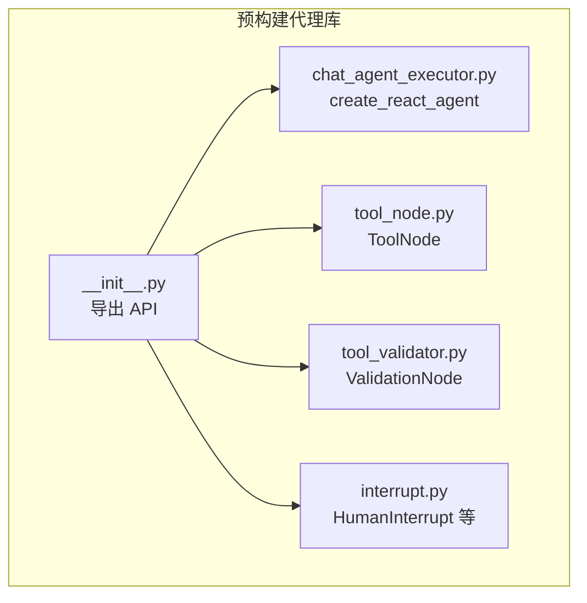
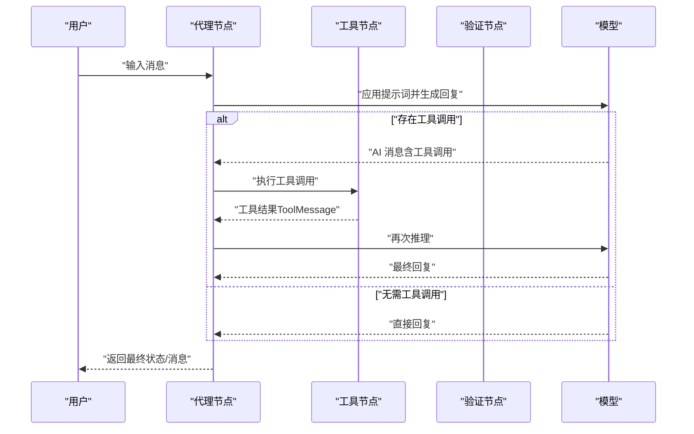
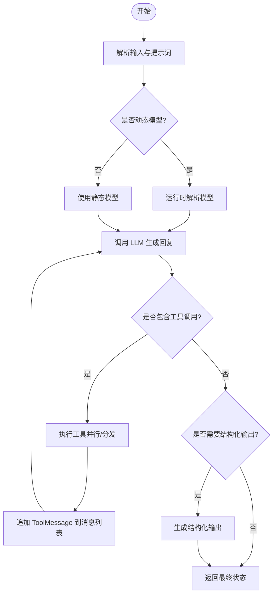
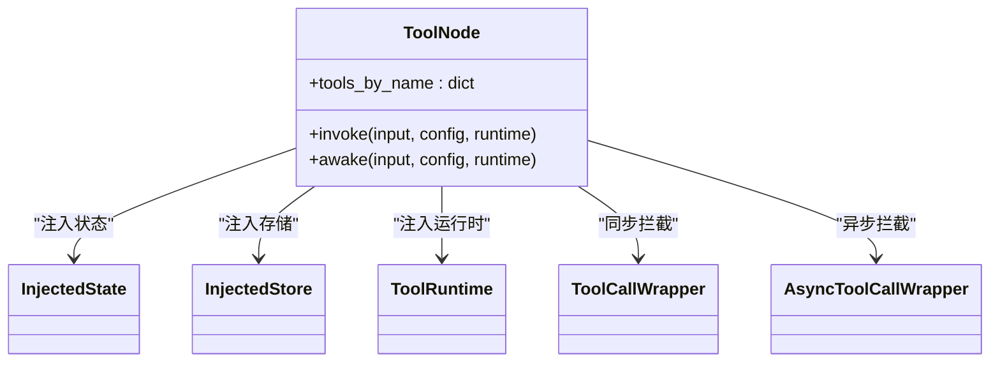
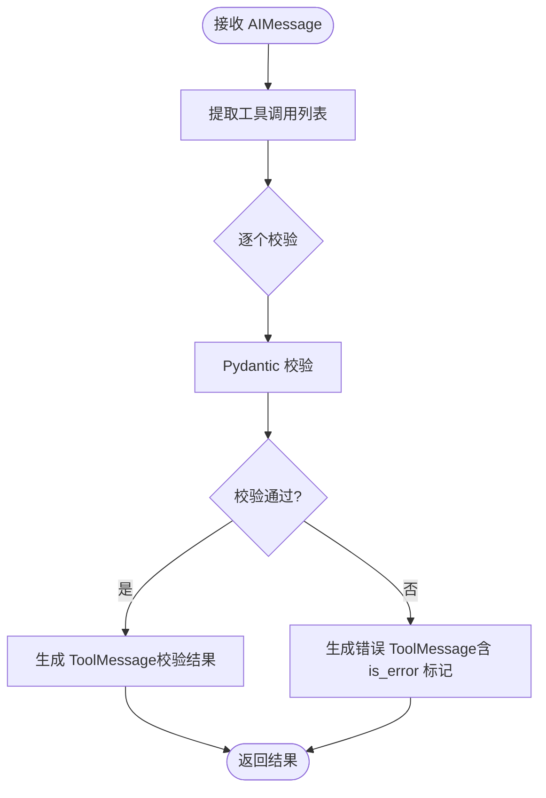
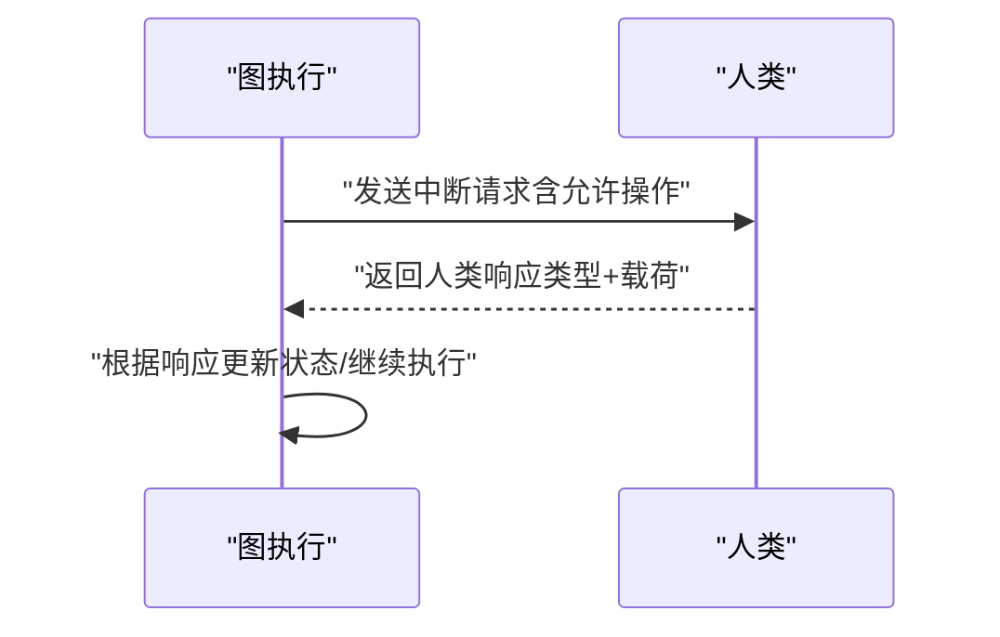
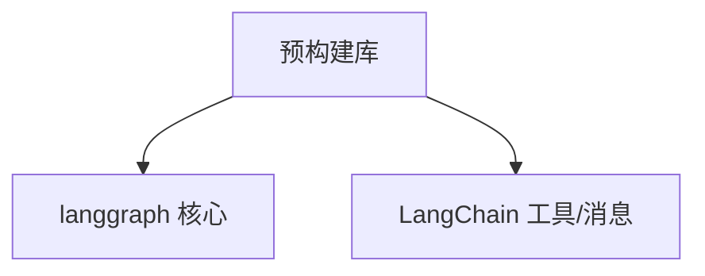

# 预构建代理

<cite>
**本文引用的文件**
- [README.md](file://README.md)
- [AGENTS.md](file://AGENTS.md)
- [libs/prebuilt/langgraph/prebuilt/__init__.py](file://libs/prebuilt/langgraph/prebuilt/__init__.py)
- [libs/prebuilt/README.md](file://libs/prebuilt/README.md)
- [libs/prebuilt/langgraph/prebuilt/chat_agent_executor.py](file://libs/prebuilt/langgraph/prebuilt/chat_agent_executor.py)
- [libs/prebuilt/langgraph/prebuilt/tool_node.py](file://libs/prebuilt/langgraph/prebuilt/tool_node.py)
- [libs/prebuilt/langgraph/prebuilt/tool_validator.py](file://libs/prebuilt/langgraph/prebuilt/tool_validator.py)
- [libs/prebuilt/langgraph/prebuilt/interrupt.py](file://libs/prebuilt/langgraph/prebuilt/interrupt.py)
- [examples/tool-calling.ipynb](file://examples/tool-calling.ipynb)
- [examples/react-agent-from-scratch.ipynb](file://examples/react-agent-from-scratch.ipynb)
- [examples/react-agent-structured-output.ipynb](file://examples/react-agent-structured-output.ipynb)
</cite>

## 目录
1. [简介](#简介)
2. [项目结构](#项目结构)
3. [核心组件](#核心组件)
4. [架构总览](#架构总览)
5. [详细组件分析](#详细组件分析)
6. [依赖分析](#依赖分析)
7. [性能考虑](#性能考虑)
8. [故障排查指南](#故障排查指南)
9. [结论](#结论)
10. [附录](#附录)

## 简介
本文件系统性梳理 LangGraph 预构建代理库（langgraph.prebuilt）的能力与使用方法，重点覆盖以下内容：
- 工具调用代理（ReAct 风格）
- 聊天代理（消息驱动的对话）
- 计划-执行代理（概念性说明与迁移路径）
- 工具节点与验证节点
- 中断与人类协作
- 使用示例、配置项说明、工作流与内部机制
- 自定义与扩展方法、最佳实践与性能优化
- 与自定义代理开发的关系与迁移路径

LangGraph 预构建代理库提供高层 API，帮助快速搭建具备工具调用、消息管理、错误处理、状态持久化与人类中断能力的智能体。

章节来源
- [README.md:1-83](file://README.md#L1-L83)
- [AGENTS.md:1-58](file://AGENTS.md#L1-L58)

## 项目结构
预构建代理位于 libs/prebuilt 子模块中，对外暴露工具节点、验证节点、以及 ReAct 风格的工具调用代理工厂函数。其核心文件如下：
- 预构建导出入口：langgraph/prebuilt/__init__.py
- ReAct 工具调用代理：chat_agent_executor.py
- 工具执行节点：tool_node.py
- 工具调用验证节点：tool_validator.py
- 人类中断相关类型：interrupt.py
- 使用示例与说明：examples 下的工具调用与 React 示例笔记本

图表来源
- [libs/prebuilt/langgraph/prebuilt/__init__.py:1-22](file://libs/prebuilt/langgraph/prebuilt/__init__.py#L1-L22)
- [libs/prebuilt/langgraph/prebuilt/chat_agent_executor.py:278-516](file://libs/prebuilt/langgraph/prebuilt/chat_agent_executor.py#L278-L516)
- [libs/prebuilt/langgraph/prebuilt/tool_node.py:619-736](file://libs/prebuilt/langgraph/prebuilt/tool_node.py#L619-L736)
- [libs/prebuilt/langgraph/prebuilt/tool_validator.py:47-114](file://libs/prebuilt/langgraph/prebuilt/tool_validator.py#L47-L114)
- [libs/prebuilt/langgraph/prebuilt/interrupt.py:11-84](file://libs/prebuilt/langgraph/prebuilt/interrupt.py#L11-L84)

章节来源
- [libs/prebuilt/README.md:1-117](file://libs/prebuilt/README.md#L1-L117)
- [libs/prebuilt/langgraph/prebuilt/__init__.py:1-22](file://libs/prebuilt/langgraph/prebuilt/__init__.py#L1-L22)

## 核心组件
- 工具调用代理（ReAct 风格）
  - 工厂函数：create_react_agent
  - 支持静态/动态模型选择、提示词注入、结构化输出、前置/后置钩子、人类中断、检查点与存储
  - 版本 v1 与 v2 的工具分发策略不同
- 工具节点（ToolNode）
  - 并行执行多工具调用、状态注入、持久化存储注入、错误处理策略、拦截器包装
- 验证节点（ValidationNode）
  - 对 AIMessage 中的工具调用参数进行 Pydantic 校验，返回 ToolMessage 或错误消息
- 人类中断（HumanInterrupt）
  - 定义可允许的人类操作（忽略、响应、编辑、接受），用于人机协作

章节来源
- [libs/prebuilt/langgraph/prebuilt/chat_agent_executor.py:278-516](file://libs/prebuilt/langgraph/prebuilt/chat_agent_executor.py#L278-L516)
- [libs/prebuilt/langgraph/prebuilt/tool_node.py:619-736](file://libs/prebuilt/langgraph/prebuilt/tool_node.py#L619-L736)
- [libs/prebuilt/langgraph/prebuilt/tool_validator.py:47-114](file://libs/prebuilt/langgraph/prebuilt/tool_validator.py#L47-L114)
- [libs/prebuilt/langgraph/prebuilt/interrupt.py:11-84](file://libs/prebuilt/langgraph/prebuilt/interrupt.py#L11-L84)

## 架构总览
预构建代理以状态图（StateGraph）为核心，将“语言模型”“工具节点”“验证节点”“人类中断”等节点按条件路由组合，形成可迭代的 ReAct 循环：LLM -> 工具调用 -> 工具执行 -> 再次 LLM 推理，直至满足停止条件或完成结构化输出。

图表来源
- [libs/prebuilt/langgraph/prebuilt/chat_agent_executor.py:485-497](file://libs/prebuilt/langgraph/prebuilt/chat_agent_executor.py#L485-L497)
- [libs/prebuilt/langgraph/prebuilt/tool_node.py:619-736](file://libs/prebuilt/langgraph/prebuilt/tool_node.py#L619-L736)
- [libs/prebuilt/langgraph/prebuilt/tool_validator.py:47-114](file://libs/prebuilt/langgraph/prebuilt/tool_validator.py#L47-L114)

## 详细组件分析

### 组件一：工具调用代理（ReAct 风格）
- 功能概述
  - 基于 StateGraph 的 ReAct 循环，自动在 LLM 与工具之间切换
  - 支持结构化输出（通过额外的 LLM 调用）
  - 支持前置/后置钩子、动态模型选择、人类中断、检查点与存储
- 关键配置
  - 模型：字符串标识、模型实例、或动态返回模型的可调用对象
  - 工具：工具列表或 ToolNode 实例；支持内置工具字典
  - 提示词：字符串、SystemMessage、可调用或 Runnable
  - 结构化输出：支持多种模式（OpenAI 函数 schema、JSON Schema、TypedDict、Pydantic 类、元组形式）
  - pre/post 模型钩子：用于消息裁剪、摘要、人类确认、守卫等
  - 版本：v1（单消息内并行执行所有工具调用）、v2（按工具调用分发到多个工具节点实例）
  - 其他：状态模式、运行时上下文、检查点、存储、中断点、调试开关
- 工作流程
  - 解析输入消息，校验历史中每个工具调用都有对应 ToolMessage
  - 动态解析模型（静态或动态），应用提示词
  - 调用模型生成回复；若包含工具调用则进入工具执行阶段
  - 工具执行完成后再次推理，直到无工具调用或达到步数限制
  - 可选：对最终输出进行结构化格式化
- 使用示例
  - 参考示例笔记本：工具调用、从零实现 React 代理、结构化输出

图表来源
- [libs/prebuilt/langgraph/prebuilt/chat_agent_executor.py:599-721](file://libs/prebuilt/langgraph/prebuilt/chat_agent_executor.py#L599-L721)
- [libs/prebuilt/langgraph/prebuilt/tool_node.py:790-850](file://libs/prebuilt/langgraph/prebuilt/tool_node.py#L790-L850)

章节来源
- [libs/prebuilt/langgraph/prebuilt/chat_agent_executor.py:278-516](file://libs/prebuilt/langgraph/prebuilt/chat_agent_executor.py#L278-L516)
- [libs/prebuilt/README.md:10-36](file://libs/prebuilt/README.md#L10-L36)
- [examples/tool-calling.ipynb](file://examples/tool-calling.ipynb)
- [examples/react-agent-from-scratch.ipynb](file://examples/react-agent-from-scratch.ipynb)
- [examples/react-agent-structured-output.ipynb](file://examples/react-agent-structured-output.ipynb)

### 组件二：工具节点（ToolNode）
- 功能概述
  - 执行 AIMessage 中的工具调用，支持并行执行、状态注入、存储注入、运行时上下文注入
  - 错误处理策略灵活（捕获异常、自定义错误消息、仅针对参数校验错误的反馈）
  - 可通过拦截器包装实现重试、缓存、请求修改、条件控制流
- 输入/输出
  - 输入：支持三种形态（图状态、消息列表、直接工具调用）
  - 输出：ToolMessage 列表；支持命令式更新（Command）
- 关键特性
  - 注入参数：InjectedState、InjectedStore、ToolRuntime
  - 并行执行：基于线程池并发执行多个工具调用
  - 参数校验过滤：仅向 LLM 返回其可控参数的错误信息
- 使用示例
  - 参考示例笔记本：工具调用

图表来源
- [libs/prebuilt/langgraph/prebuilt/tool_node.py:619-736](file://libs/prebuilt/langgraph/prebuilt/tool_node.py#L619-L736)
- [libs/prebuilt/langgraph/prebuilt/tool_node.py:130-198](file://libs/prebuilt/langgraph/prebuilt/tool_node.py#L130-L198)
- [libs/prebuilt/langgraph/prebuilt/tool_node.py:564-617](file://libs/prebuilt/langgraph/prebuilt/tool_node.py#L564-L617)

章节来源
- [libs/prebuilt/langgraph/prebuilt/tool_node.py:619-736](file://libs/prebuilt/langgraph/prebuilt/tool_node.py#L619-L736)
- [libs/prebuilt/README.md:40-60](file://libs/prebuilt/README.md#L40-L60)
- [examples/tool-calling.ipynb](file://examples/tool-calling.ipynb)

### 组件三：验证节点（ValidationNode）
- 功能概述
  - 对 AIMessage 中的工具调用参数进行 Pydantic 校验，不实际执行工具
  - 将校验结果封装为 ToolMessage 或错误消息，便于后续重试或重提示
- 使用场景
  - 结构化输出提取、复杂 schema 的前置校验、多轮对话中的参数收敛
- 注意事项
  - ValidationNode 已标记为弃用，推荐使用 create_agent 并结合自定义工具错误处理

图表来源
- [libs/prebuilt/langgraph/prebuilt/tool_validator.py:168-221](file://libs/prebuilt/langgraph/prebuilt/tool_validator.py#L168-L221)

章节来源
- [libs/prebuilt/langgraph/prebuilt/tool_validator.py:47-114](file://libs/prebuilt/langgraph/prebuilt/tool_validator.py#L47-L114)
- [libs/prebuilt/README.md:62-85](file://libs/prebuilt/README.md#L62-L85)

### 组件四：人类中断（HumanInterrupt）
- 功能概述
  - 在代理执行过程中暂停，等待人类决策（忽略、响应、编辑、接受）
  - 通过中断配置控制可用操作
- 迁移提示
  - 该模块已标记为弃用，建议迁移到 langchain.agents.interrupt

图表来源
- [libs/prebuilt/langgraph/prebuilt/interrupt.py:51-84](file://libs/prebuilt/langgraph/prebuilt/interrupt.py#L51-L84)

章节来源
- [libs/prebuilt/langgraph/prebuilt/interrupt.py:11-84](file://libs/prebuilt/langgraph/prebuilt/interrupt.py#L11-L84)
- [libs/prebuilt/README.md:87-117](file://libs/prebuilt/README.md#L87-L117)

## 依赖分析
- 预构建代理库与核心框架的关系
  - 预构建库依赖 langgraph 核心框架（StateGraph、消息工具、运行时等）
  - 工具节点与验证节点进一步依赖 LangChain 的工具与消息体系
- 导出接口
  - create_react_agent、ToolNode、tools_condition、ValidationNode、InjectedState、InjectedStore、ToolRuntime
- 迁移路径
  - create_react_agent 已标记为弃用，建议迁移到 langchain.agents.create_agent，并利用其更灵活的中间件系统

图表来源
- [libs/prebuilt/langgraph/prebuilt/__init__.py:3-21](file://libs/prebuilt/langgraph/prebuilt/__init__.py#L3-L21)
- [AGENTS.md:29-52](file://AGENTS.md#L29-L52)

章节来源
- [libs/prebuilt/langgraph/prebuilt/__init__.py:1-22](file://libs/prebuilt/langgraph/prebuilt/__init__.py#L1-L22)
- [AGENTS.md:19-58](file://AGENTS.md#L19-L58)

## 性能考虑
- 工具执行并行化
  - ToolNode 支持并发执行多个工具调用，提升吞吐；注意工具间资源竞争与限流
- 消息历史管理
  - 使用 pre_model_hook 对消息进行裁剪或摘要，避免上下文过长导致延迟与成本上升
- 结构化输出策略
  - 结构化输出会触发一次额外的 LLM 调用，建议在必要时启用，并评估成本与延迟
- 步数限制与循环保护
  - remaining_steps 用于防止无限循环；合理设置以平衡能力与稳定性
- 异步模型与同步调用
  - 提供异步模型解析时，同步调用会报错；确保调用方式与模型解析一致

章节来源
- [libs/prebuilt/langgraph/prebuilt/tool_node.py:790-850](file://libs/prebuilt/langgraph/prebuilt/tool_node.py#L790-L850)
- [libs/prebuilt/langgraph/prebuilt/chat_agent_executor.py:620-634](file://libs/prebuilt/langgraph/prebuilt/chat_agent_executor.py#L620-L634)
- [libs/prebuilt/langgraph/prebuilt/chat_agent_executor.py:744-785](file://libs/prebuilt/langgraph/prebuilt/chat_agent_executor.py#L744-L785)

## 故障排查指南
- 工具调用与结果配对错误
  - 若 AIMessage 中存在工具调用但缺少对应的 ToolMessage，将抛出错误；请确保工具执行后正确追加 ToolMessage
- 参数校验错误反馈
  - ValidationNode 与 ToolNode 均支持将错误信息回传给 LLM；注意仅返回 LLM 可控参数的错误细节
- 未注册工具或工具名不匹配
  - ToolNode 会校验工具名称；请确认工具注册与调用名称一致
- 结构化输出失败
  - 确保模型支持结构化输出；必要时调整 schema 或改用其他结构化策略
- 人类中断与权限
  - 中断配置决定人类可执行的操作；请根据业务需求合理开放/限制

章节来源
- [libs/prebuilt/langgraph/prebuilt/chat_agent_executor.py:243-272](file://libs/prebuilt/langgraph/prebuilt/chat_agent_executor.py#L243-L272)
- [libs/prebuilt/langgraph/prebuilt/tool_node.py:508-561](file://libs/prebuilt/langgraph/prebuilt/tool_node.py#L508-L561)
- [libs/prebuilt/langgraph/prebuilt/tool_validator.py:168-221](file://libs/prebuilt/langgraph/prebuilt/tool_validator.py#L168-L221)

## 结论
LangGraph 预构建代理库提供了开箱即用的 ReAct 工具调用代理与配套工具节点、验证节点及人类中断支持。通过合理的配置与扩展，可在保证可维护性的同时获得良好的性能与可观测性。随着 create_react_agent 的弃用，建议逐步迁移到 langchain.agents.create_agent，以享受更完善的中间件生态与长期支持。

## 附录
- 快速上手
  - 工具调用示例与 React 代理示例参见 examples 目录
- 进一步阅读
  - LangGraph 生态与文档链接参见根目录 README

章节来源
- [libs/prebuilt/README.md:10-36](file://libs/prebuilt/README.md#L10-L36)
- [README.md:61-67](file://README.md#L61-L67)