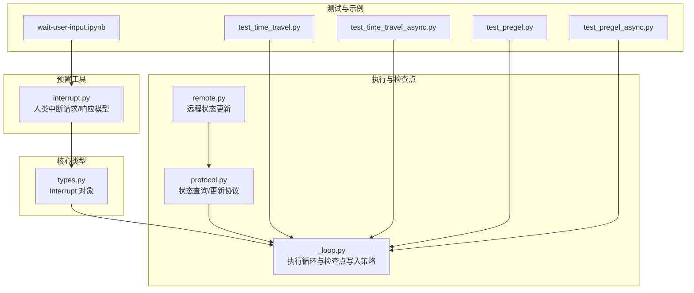
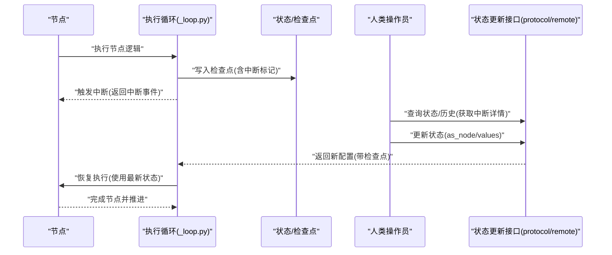
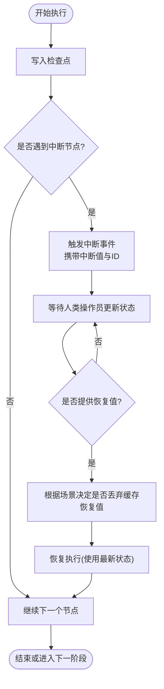
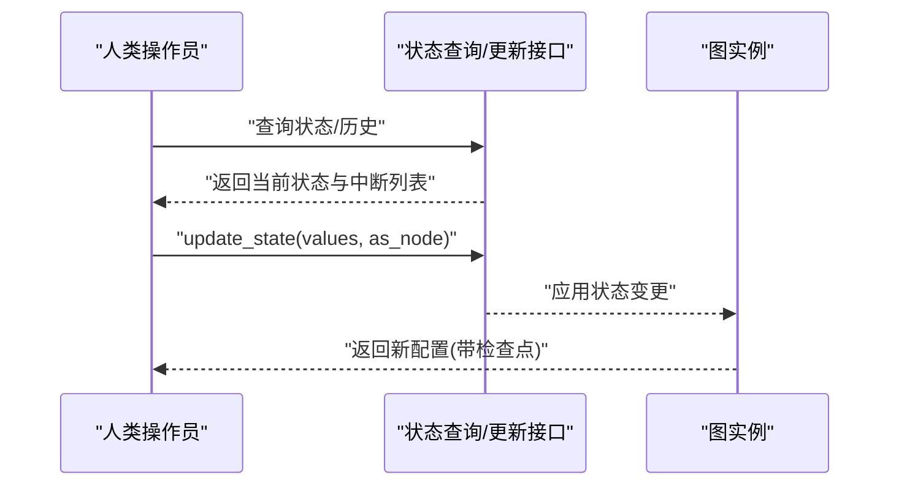
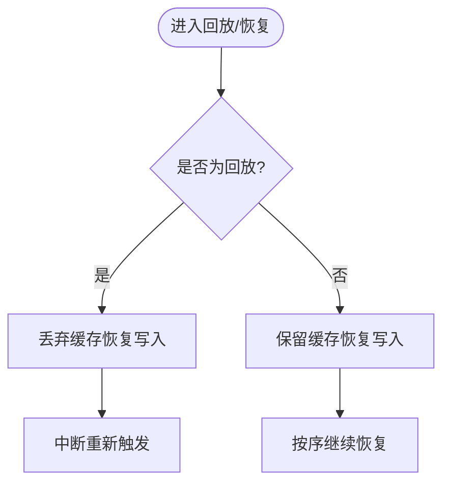
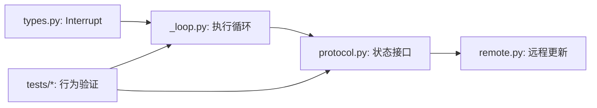

# 人机协作

<cite>
**本文引用的文件**
- [README.md](file://README.md)
- [wait-user-input.ipynb](file://examples/human_in_the_loop/wait-user-input.ipynb)
- [interrupt.py](file://libs/prebuilt/langgraph/prebuilt/interrupt.py)
- [types.py](file://libs/langgraph/langgraph/types.py)
- [_loop.py](file://libs/langgraph/langgraph/pregel/_loop.py)
- [protocol.py](file://libs/langgraph/langgraph/pregel/protocol.py)
- [remote.py](file://libs/langgraph/langgraph/pregel/remote.py)
- [test_time_travel.py](file://libs/langgraph/tests/test_time_travel.py)
- [test_time_travel_async.py](file://libs/langgraph/tests/test_time_travel_async.py)
- [test_pregel.py](file://libs/langgraph/tests/test_pregel.py)
- [test_pregel_async.py](file://libs/langgraph/tests/test_pregel_async.py)
</cite>

## 目录
1. [简介](#简介)
2. [项目结构](#项目结构)
3. [核心组件](#核心组件)
4. [架构总览](#架构总览)
5. [详细组件分析](#详细组件分析)
6. [依赖关系分析](#依赖关系分析)
7. [性能考量](#性能考量)
8. [故障排查指南](#故障排查指南)
9. [结论](#结论)
10. [附录](#附录)

## 简介
本文件系统化阐述 LangGraph 的“人机协作”机制，重点围绕以下主题：
- 中断与恢复：如何在代理执行过程中暂停执行以等待人工输入，并在后续恢复继续执行。
- 状态修改：允许人类操作员在关键时刻修改代理状态，以及如何通过命令或接口进行更新。
- 检查点（Checkpoint）保存与恢复的时机选择策略：何时持久化、何时回放、何时重放中断。
- 最佳实践：交互设计与用户体验建议，涵盖多中断场景、并行中断、嵌套子图等复杂情形。
- 安全与权限：如何在多中断并存时进行明确的恢复选择，避免误恢复。

LangGraph 在其官方文档中明确强调了“可中断的执行”和“持久化”的能力，这些能力共同构成了人机协作的基础。

**章节来源**
- [README.md:35-46](file://README.md#L35-L46)

## 项目结构
与“人机协作”直接相关的关键模块与文件如下：
- 预置工具与中断类型定义：libs/prebuilt/langgraph/prebuilt/interrupt.py
- 核心类型与中断对象：libs/langgraph/langgraph/types.py
- 执行循环与检查点写入逻辑：libs/langgraph/langgraph/pregel/_loop.py
- 运行时协议与状态查询/更新接口：libs/langgraph/langgraph/pregel/protocol.py
- 远程客户端状态更新：libs/langgraph/langgraph/pregel/remote.py
- 示例与测试用例（验证中断、恢复、时间旅行与并行/嵌套中断）：libs/langgraph/tests 下的多个文件

**图表来源**
- [interrupt.py:61-105](file://libs/prebuilt/langgraph/prebuilt/interrupt.py#L61-L105)
- [types.py:441-489](file://libs/langgraph/langgraph/types.py#L441-L489)
- [_loop.py:646-671](file://libs/langgraph/langgraph/pregel/_loop.py#L646-L671)
- [protocol.py:52-105](file://libs/langgraph/langgraph/pregel/protocol.py#L52-L105)
- [remote.py:561-601](file://libs/langgraph/langgraph/pregel/remote.py#L561-L601)
- [test_time_travel.py:283-365](file://libs/langgraph/tests/test_time_travel.py#L283-L365)
- [test_time_travel_async.py:456-580](file://libs/langgraph/tests/test_time_travel_async.py#L456-L580)
- [test_pregel.py:6152-6203](file://libs/langgraph/tests/test_pregel.py#L6152-L6203)
- [test_pregel_async.py:7894-7925](file://libs/langgraph/tests/test_pregel_async.py#L7894-L7925)
- [wait-user-input.ipynb:1-42](file://examples/human_in_the_loop/wait-user-input.ipynb#L1-L42)

**章节来源**
- [interrupt.py:61-105](file://libs/prebuilt/langgraph/prebuilt/interrupt.py#L61-L105)
- [types.py:441-489](file://libs/langgraph/langgraph/types.py#L441-L489)
- [_loop.py:646-671](file://libs/langgraph/langgraph/pregel/_loop.py#L646-L671)
- [protocol.py:52-105](file://libs/langgraph/langgraph/pregel/protocol.py#L52-L105)
- [remote.py:561-601](file://libs/langgraph/langgraph/pregel/remote.py#L561-L601)
- [test_time_travel.py:283-365](file://libs/langgraph/tests/test_time_travel.py#L283-L365)
- [test_time_travel_async.py:456-580](file://libs/langgraph/tests/test_time_travel_async.py#L456-L580)
- [test_pregel.py:6152-6203](file://libs/langgraph/tests/test_pregel.py#L6152-L6203)
- [test_pregel_async.py:7894-7925](file://libs/langgraph/tests/test_pregel_async.py#L7894-L7925)
- [wait-user-input.ipynb:1-42](file://examples/human_in_the_loop/wait-user-input.ipynb#L1-L42)

## 核心组件
- 中断对象与人类响应模型
  - Interrupt：封装中断值与中断 ID，用于在节点执行期间触发中断并携带上下文信息。
  - HumanInterrupt/HumanResponse：预置的人类中断请求与响应模型，支持接受、忽略、文本反馈、编辑等类型。
- 执行循环与检查点写入
  - 在回放（时间旅行）与恢复之间，对“缓存的恢复值”进行处理，确保中断在特定场景下重新触发，而不是返回过期值。
- 状态查询与更新
  - 提供同步/异步的状态快照查询、历史查询、批量更新与单次更新接口，支持在中断后按需修改状态。
- 远程状态更新
  - 通过远程客户端调用线程状态更新端点，支持指定检查点与作为某个节点更新状态。

**章节来源**
- [types.py:441-489](file://libs/langgraph/langgraph/types.py#L441-L489)
- [interrupt.py:61-105](file://libs/prebuilt/langgraph/prebuilt/interrupt.py#L61-L105)
- [_loop.py:646-671](file://libs/langgraph/langgraph/pregel/_loop.py#L646-L671)
- [protocol.py:52-105](file://libs/langgraph/langgraph/pregel/protocol.py#L52-L105)
- [remote.py:561-601](file://libs/langgraph/langgraph/pregel/remote.py#L561-L601)

## 架构总览
下图展示了从节点执行到中断触发、状态更新、恢复与继续执行的整体流程。

**图表来源**
- [_loop.py:646-671](file://libs/langgraph/langgraph/pregel/_loop.py#L646-L671)
- [protocol.py:52-105](file://libs/langgraph/langgraph/pregel/protocol.py#L52-L105)
- [remote.py:561-601](file://libs/langgraph/langgraph/pregel/remote.py#L561-L601)

## 详细组件分析

### 中断与恢复：实现原理与流程
- 触发中断
  - 节点在关键决策点调用中断函数，向运行时注入中断事件，同时携带中断值与中断 ID。
- 回放与重放策略
  - 当从特定检查点回放时，会丢弃缓存的“恢复写入”，以确保中断重新触发；当处于主动恢复阶段则保留先前的恢复值，保证多中断场景下的正确顺序。
- 多中断与并行中断
  - 若存在多个待处理中断，必须显式指定中断 ID 进行恢复，否则抛出错误提示。
- 嵌套子图与时间旅行
  - 子图中断与父图恢复协同工作，支持从中间分叉恢复，仅重新触发后续中断，保留已解决的中断结果。

**图表来源**
- [_loop.py:646-671](file://libs/langgraph/langgraph/pregel/_loop.py#L646-L671)
- [test_time_travel.py:477-504](file://libs/langgraph/tests/test_time_travel.py#L477-L504)
- [test_time_travel_async.py:456-580](file://libs/langgraph/tests/test_time_travel_async.py#L456-L580)
- [test_pregel_async.py:7894-7925](file://libs/langgraph/tests/test_pregel_async.py#L7894-L7925)

**章节来源**
- [types.py:441-489](file://libs/langgraph/langgraph/types.py#L441-L489)
- [_loop.py:646-671](file://libs/langgraph/langgraph/pregel/_loop.py#L646-L671)
- [test_time_travel.py:477-504](file://libs/langgraph/tests/test_time_travel.py#L477-L504)
- [test_time_travel_async.py:456-580](file://libs/langgraph/tests/test_time_travel_async.py#L456-L580)
- [test_pregel_async.py:7894-7925](file://libs/langgraph/tests/test_pregel_async.py#L7894-L7925)

### 状态修改机制：人类操作员如何介入
- 查询状态与历史
  - 使用状态查询与历史迭代接口，定位当前中断位置与上下文，便于人类操作员理解需要修改的内容。
- 更新状态
  - 支持按节点视角更新状态（as_node），或直接覆盖部分字段；远程客户端也提供统一的线程状态更新入口。
- 并发与一致性
  - 在多中断场景下，必须明确指定中断 ID 进行恢复，避免不同中断之间的混淆。

**图表来源**
- [protocol.py:52-105](file://libs/langgraph/langgraph/pregel/protocol.py#L52-L105)
- [remote.py:561-601](file://libs/langgraph/langgraph/pregel/remote.py#L561-L601)
- [test_pregel.py:6152-6203](file://libs/langgraph/tests/test_pregel.py#L6152-L6203)

**章节来源**
- [protocol.py:52-105](file://libs/langgraph/langgraph/pregel/protocol.py#L52-L105)
- [remote.py:561-601](file://libs/langgraph/langgraph/pregel/remote.py#L561-L601)
- [test_pregel.py:6152-6203](file://libs/langgraph/tests/test_pregel.py#L6152-L6203)

### 检查点保存与恢复的时机选择策略
- 回放时丢弃缓存恢复值
  - 当从特定检查点回放时，为确保中断重新触发而非返回过期值，会移除缓存的恢复写入。
- 主动恢复时保留缓存恢复值
  - 在活跃恢复过程中，保留先前已解析的恢复值，保证多中断顺序正确。
- 时间旅行与子图
  - 子图时间旅行时，父图会设置“正在恢复”标志，需结合命名空间映射判断是否应丢弃缓存恢复值。

**图表来源**
- [_loop.py:646-671](file://libs/langgraph/langgraph/pregel/_loop.py#L646-L671)

**章节来源**
- [_loop.py:646-671](file://libs/langgraph/langgraph/pregel/_loop.py#L646-L671)

### 人机协作最佳实践模式
- 中断设计
  - 在关键决策点插入中断，提供清晰的描述与上下文，便于人类操作员快速理解并做出决策。
  - 对于可能产生多个中断的流程，优先采用“并行中断 + 明确 ID 恢复”的模式，避免歧义。
- 用户体验
  - 提供“接受/忽略/编辑/反馈”等多类型响应，使人类操作员能以最小成本完成操作。
  - 在多中断场景下，前端应列出所有待处理中断及其描述，引导用户逐项恢复。
- 嵌套与分叉
  - 子图中断与父图恢复协同：从中间分叉恢复时，仅重新触发后续中断，保留已解决的结果。
  - 时间旅行回放时，确保中断重新触发，以便人类操作员基于最新上下文再次确认。

**章节来源**
- [interrupt.py:61-105](file://libs/prebuilt/langgraph/prebuilt/interrupt.py#L61-L105)
- [test_time_travel.py:477-504](file://libs/langgraph/tests/test_time_travel.py#L477-L504)
- [test_time_travel_async.py:456-580](file://libs/langgraph/tests/test_time_travel_async.py#L456-L580)
- [test_pregel_async.py:7894-7925](file://libs/langgraph/tests/test_pregel_async.py#L7894-L7925)

### 实际代码示例路径（展示中断-恢复循环）
- 单一中断与顺序恢复
  - 参考：[test_time_travel.py:477-504](file://libs/langgraph/tests/test_time_travel.py#L477-L504)
  - 参考：[test_time_travel_async.py:456-580](file://libs/langgraph/tests/test_time_travel_async.py#L456-L580)
- 多个连续中断与分叉恢复
  - 参考：[test_time_travel.py:477-504](file://libs/langgraph/tests/test_time_travel.py#L477-L504)
- 并行中断与必须指定中断 ID 的恢复
  - 参考：[test_pregel_async.py:7894-7925](file://libs/langgraph/tests/test_pregel_async.py#L7894-L7925)
- 嵌套子图中断与时间旅行
  - 参考：[test_pregel.py:3494-3659](file://libs/langgraph/tests/test_pregel.py#L3494-L3659)

**章节来源**
- [test_time_travel.py:477-504](file://libs/langgraph/tests/test_time_travel.py#L477-L504)
- [test_time_travel_async.py:456-580](file://libs/langgraph/tests/test_time_travel_async.py#L456-L580)
- [test_pregel_async.py:7894-7925](file://libs/langgraph/tests/test_pregel_async.py#L7894-L7925)
- [test_pregel.py:3494-3659](file://libs/langgraph/tests/test_pregel.py#L3494-L3659)

### 安全考虑与权限控制
- 多中断恢复的强制性选择
  - 当存在多个待处理中断时，必须显式提供中断 ID 进行恢复，防止误恢复导致状态不一致。
- 权限与访问控制
  - 通过远程客户端更新状态时，应结合线程标识与检查点参数进行鉴权与授权，确保只有具备权限的操作员可以修改状态。
- 一致性与审计
  - 每次状态更新应记录元数据（如时间戳、操作员标识、检查点 ID），便于审计与问题追踪。

**章节来源**
- [test_pregel_async.py:7894-7925](file://libs/langgraph/tests/test_pregel_async.py#L7894-L7925)
- [remote.py:561-601](file://libs/langgraph/langgraph/pregel/remote.py#L561-L601)

## 依赖关系分析
- 组件耦合
  - 中断对象与执行循环紧密耦合：执行循环负责在回放/恢复场景下正确处理中断与检查点写入。
  - 状态查询/更新接口为上层（人类操作员）提供统一入口，远程客户端进一步抽象网络访问。
- 外部依赖
  - 测试用例覆盖了同步/异步、时间旅行、嵌套子图等多种场景，验证中断与恢复行为的一致性。

**图表来源**
- [types.py:441-489](file://libs/langgraph/langgraph/types.py#L441-L489)
- [_loop.py:646-671](file://libs/langgraph/langgraph/pregel/_loop.py#L646-L671)
- [protocol.py:52-105](file://libs/langgraph/langgraph/pregel/protocol.py#L52-L105)
- [remote.py:561-601](file://libs/langgraph/langgraph/pregel/remote.py#L561-L601)

**章节来源**
- [types.py:441-489](file://libs/langgraph/langgraph/types.py#L441-L489)
- [_loop.py:646-671](file://libs/langgraph/langgraph/pregel/_loop.py#L646-L671)
- [protocol.py:52-105](file://libs/langgraph/langgraph/pregel/protocol.py#L52-L105)
- [remote.py:561-601](file://libs/langgraph/langgraph/pregel/remote.py#L561-L601)

## 性能考量
- 中断频率与检查点粒度
  - 高频中断会增加检查点写入与回放成本，建议在关键节点设置中断，避免过度细粒度中断。
- 并行中断与批量更新
  - 并行中断场景下，批量更新状态可减少多次往返开销；但需确保每个中断都有明确的 ID 以便恢复。
- 异步执行
  - 异步模式下，中断与恢复的延迟更低，适合高并发的人机协作场景。

[本节为通用指导，无需具体文件分析]

## 故障排查指南
- 多中断未指定 ID 导致恢复失败
  - 现象：尝试单一恢复值时抛出错误，提示必须指定中断 ID。
  - 处理：从状态中读取所有中断列表，构造“中断 ID -> 恢复值”的映射再进行恢复。
  - 参考：[test_pregel_async.py:7894-7925](file://libs/langgraph/tests/test_pregel_async.py#L7894-L7925)
- 回放时中断未重新触发
  - 现象：从历史检查点回放，中断被跳过。
  - 处理：确认回放逻辑是否丢弃了缓存恢复值；必要时调整配置或检查点映射。
  - 参考：[_loop.py:646-671](file://libs/langgraph/langgraph/pregel/_loop.py#L646-L671)
- 分叉恢复仅重新触发后续中断
  - 现象：从两处中断之间分叉恢复，仅后续中断重新触发。
  - 处理：这是预期行为，保留已解决的中断结果。
  - 参考：[test_time_travel.py:477-504](file://libs/langgraph/tests/test_time_travel.py#L477-L504)

**章节来源**
- [test_pregel_async.py:7894-7925](file://libs/langgraph/tests/test_pregel_async.py#L7894-L7925)
- [_loop.py:646-671](file://libs/langgraph/langgraph/pregel/_loop.py#L646-L671)
- [test_time_travel.py:477-504](file://libs/langgraph/tests/test_time_travel.py#L477-L504)

## 结论
LangGraph 的人机协作机制通过“中断-恢复-检查点”闭环实现了可控、可观测且可审计的长时运行代理。其关键特性包括：
- 在任意节点插入中断，携带上下文信息；
- 在回放与恢复之间智能处理缓存恢复值，确保中断行为稳定；
- 提供统一的状态查询/更新接口，支持人类操作员在关键时刻修改状态；
- 在多中断、并行中断、嵌套子图等复杂场景下保持一致性与安全性。

[本节为总结，无需具体文件分析]

## 附录
- 示例与迁移
  - 历史示例文件已迁移至集中文档，可参考项目 README 中的链接获取最新示例与指南。
  - 参考：[wait-user-input.ipynb:1-42](file://examples/human_in_the_loop/wait-user-input.ipynb#L1-L42)
  - 参考：[README.md:61-67](file://README.md#L61-L67)

**章节来源**
- [wait-user-input.ipynb:1-42](file://examples/human_in_the_loop/wait-user-input.ipynb#L1-L42)
- [README.md:61-67](file://README.md#L61-L67)