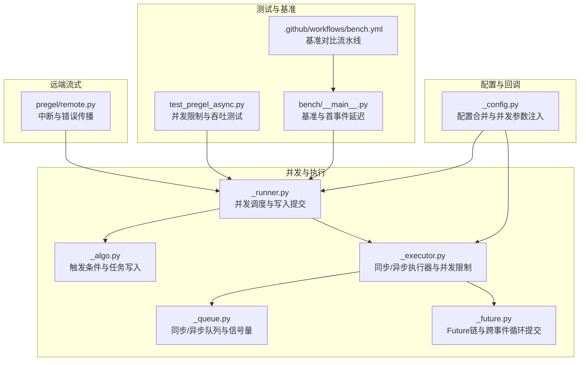
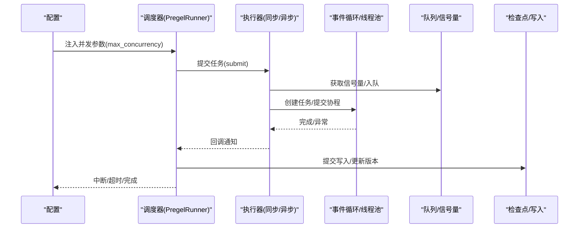
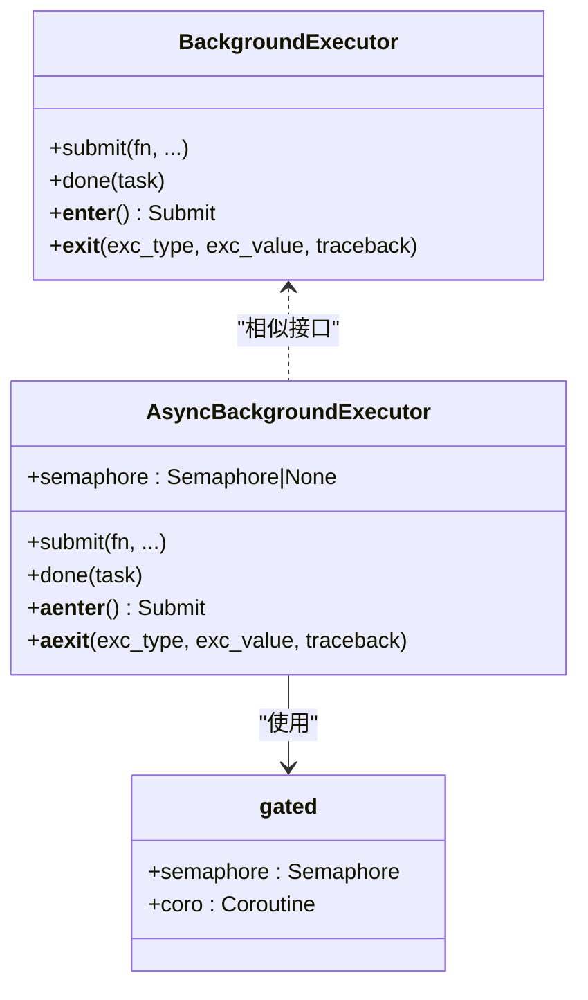
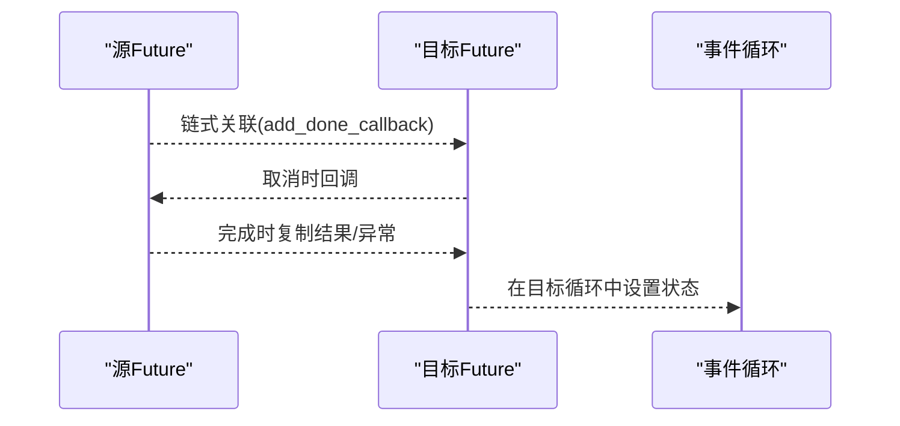
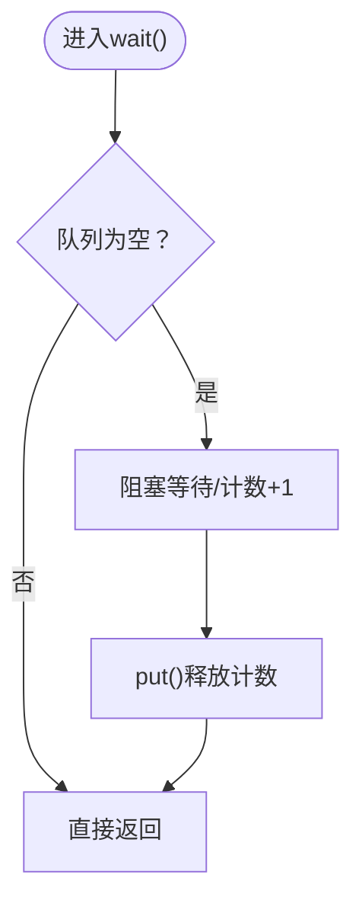
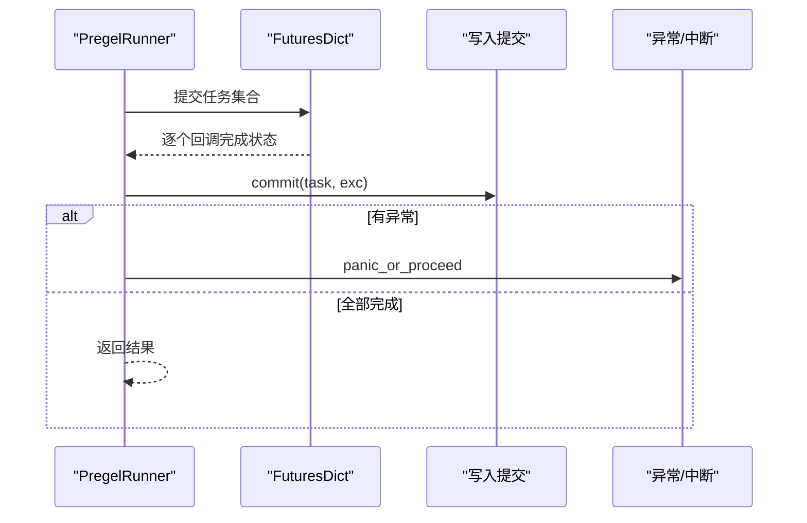
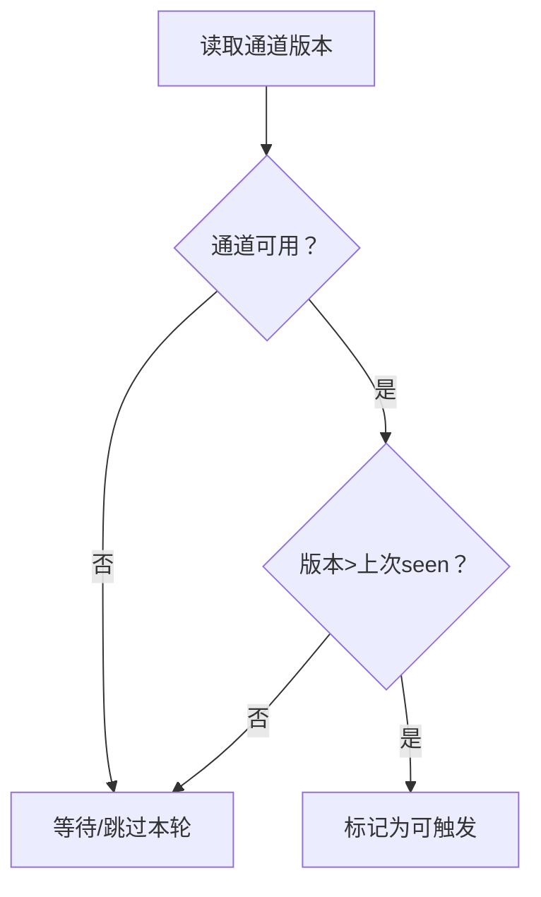
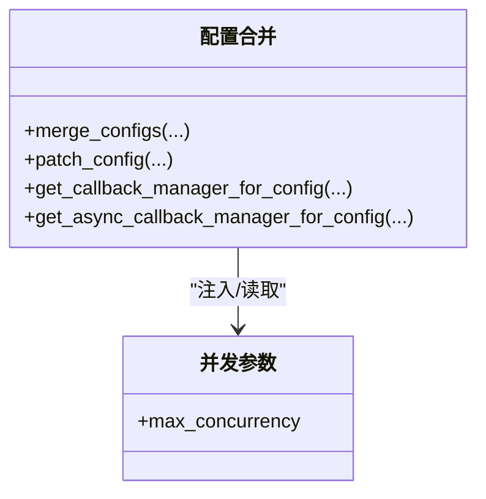
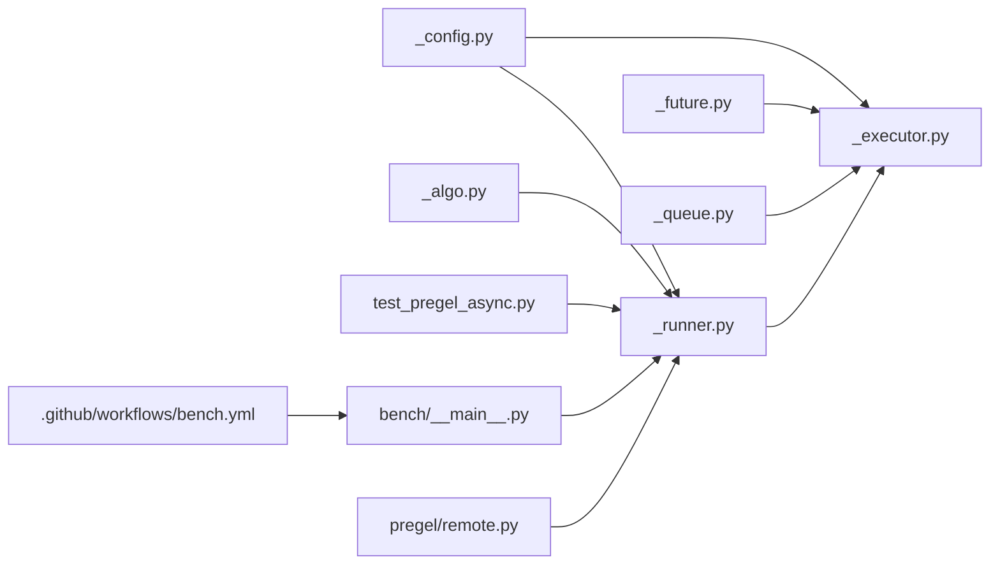
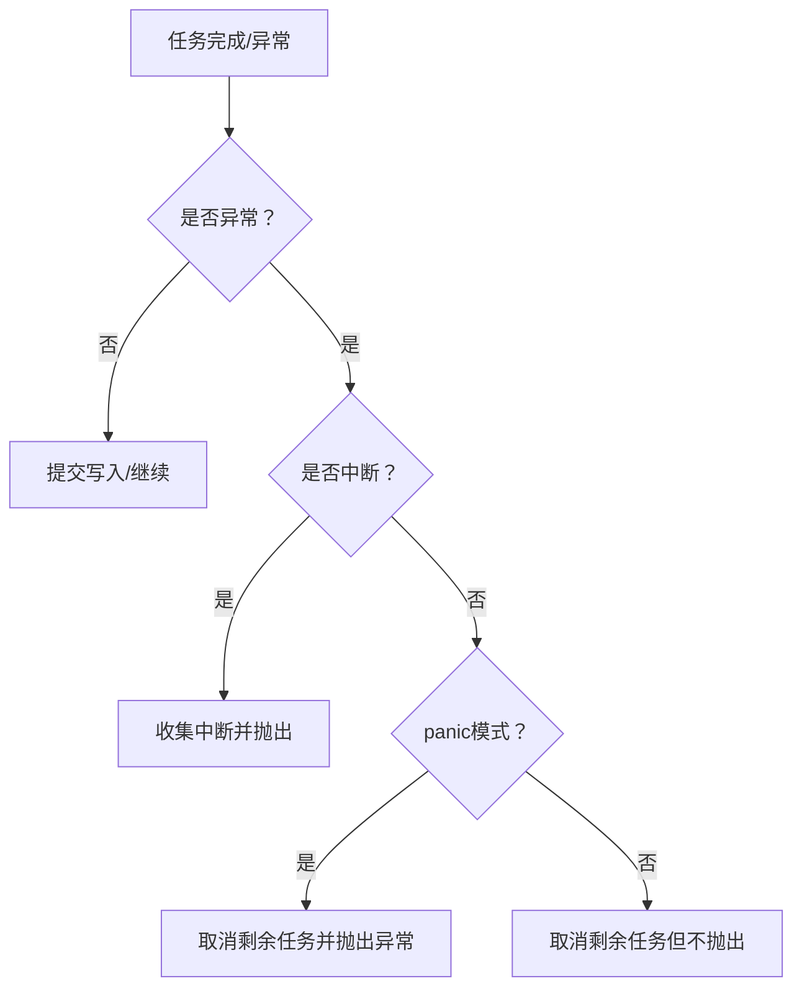

# 并发控制

<cite>
**本文引用的文件**
- [libs/langgraph/langgraph/pregel/_executor.py](file://libs/langgraph/langgraph/pregel/_executor.py)
- [libs/langgraph/langgraph/_internal/_future.py](file://libs/langgraph/langgraph/_internal/_future.py)
- [libs/langgraph/langgraph/_internal/_queue.py](file://libs/langgraph/langgraph/_internal/_queue.py)
- [libs/langgraph/langgraph/pregel/_runner.py](file://libs/langgraph/langgraph/pregel/_runner.py)
- [libs/langgraph/langgraph/pregel/_algo.py](file://libs/langgraph/langgraph/pregel/_algo.py)
- [libs/langgraph/langgraph/_internal/_config.py](file://libs/langgraph/langgraph/_internal/_config.py)
- [libs/langgraph/tests/test_pregel_async.py](file://libs/langgraph/tests/test_pregel_async.py)
- [libs/langgraph/bench/__main__.py](file://libs/langgraph/bench/__main__.py)
- [.github/workflows/bench.yml](file://.github/workflows/bench.yml)
- [libs/langgraph/langgraph/pregel/remote.py](file://libs/langgraph/langgraph/pregel/remote.py)
</cite>

## 目录
1. [引言](#引言)
2. [项目结构](#项目结构)
3. [核心组件](#核心组件)
4. [架构总览](#架构总览)
5. [详细组件分析](#详细组件分析)
6. [依赖关系分析](#依赖关系分析)
7. [性能考量](#性能考量)
8. [故障排除指南](#故障排除指南)
9. [结论](#结论)
10. [附录](#附录)

## 引言
本文件聚焦于 LangGraph 的并发控制机制与任务调度算法，系统性阐述其并行执行模型、并发限制与资源管理策略、死锁检测与避免机制，并提供高并发场景下的调优建议、监控指标与诊断方法。内容基于仓库中的执行器、运行时调度器、队列与信号量、配置合并与回调管理等实现进行深入分析。

## 项目结构
围绕并发控制的关键模块主要位于以下路径：
- 执行器与并发限制：pregel/_executor.py
- 事件循环与跨线程/协程桥接：_internal/_future.py
- 同步/异步队列与信号量：_internal/_queue.py
- 调度与并发执行：pregel/_runner.py
- 算法与触发条件：pregel/_algo.py
- 配置与并发参数注入：_internal/_config.py
- 测试与基准：tests/test_pregel_async.py、bench/__main__.py
- 远端流式中断与错误传播：pregel/remote.py

**图表来源**
- [libs/langgraph/langgraph/pregel/_executor.py:1-224](file://libs/langgraph/langgraph/pregel/_executor.py#L1-L224)
- [libs/langgraph/langgraph/_internal/_future.py:1-221](file://libs/langgraph/langgraph/_internal/_future.py#L1-L221)
- [libs/langgraph/langgraph/_internal/_queue.py:1-125](file://libs/langgraph/langgraph/_internal/_queue.py#L1-L125)
- [libs/langgraph/langgraph/pregel/_runner.py:1-200](file://libs/langgraph/langgraph/pregel/_runner.py#L1-L200)
- [libs/langgraph/langgraph/pregel/_algo.py:1-200](file://libs/langgraph/langgraph/pregel/_algo.py#L1-L200)
- [libs/langgraph/langgraph/_internal/_config.py:1-330](file://libs/langgraph/langgraph/_internal/_config.py#L1-L330)
- [libs/langgraph/tests/test_pregel_async.py:3493-3529](file://libs/langgraph/tests/test_pregel_async.py#L3493-L3529)
- [libs/langgraph/bench/__main__.py:467-520](file://libs/langgraph/bench/__main__.py#L467-L520)
- [.github/workflows/bench.yml:53-71](file://.github/workflows/bench.yml#L53-L71)
- [libs/langgraph/langgraph/pregel/remote.py:954-970](file://libs/langgraph/langgraph/pregel/remote.py#L954-L970)

**章节来源**
- [libs/langgraph/langgraph/pregel/_executor.py:1-224](file://libs/langgraph/langgraph/pregel/_executor.py#L1-L224)
- [libs/langgraph/langgraph/_internal/_future.py:1-221](file://libs/langgraph/langgraph/_internal/_future.py#L1-L221)
- [libs/langgraph/langgraph/_internal/_queue.py:1-125](file://libs/langgraph/langgraph/_internal/_queue.py#L1-L125)
- [libs/langgraph/langgraph/pregel/_runner.py:1-200](file://libs/langgraph/langgraph/pregel/_runner.py#L1-L200)
- [libs/langgraph/langgraph/pregel/_algo.py:1-200](file://libs/langgraph/langgraph/pregel/_algo.py#L1-L200)
- [libs/langgraph/langgraph/_internal/_config.py:1-330](file://libs/langgraph/langgraph/_internal/_config.py#L1-L330)
- [libs/langgraph/tests/test_pregel_async.py:3493-3529](file://libs/langgraph/tests/test_pregel_async.py#L3493-L3529)
- [libs/langgraph/bench/__main__.py:467-520](file://libs/langgraph/bench/__main__.py#L467-L520)
- [.github/workflows/bench.yml:53-71](file://.github/workflows/bench.yml#L53-L71)
- [libs/langgraph/langgraph/pregel/remote.py:954-970](file://libs/langgraph/langgraph/pregel/remote.py#L954-L970)

## 核心组件
- 同步/异步执行器与并发限制
  - 同步执行器通过线程池执行任务，并在退出时等待完成或取消未开始的任务；支持“在退出时重新抛出”异常策略。
  - 异步执行器使用当前事件循环调度协程任务，支持可选的最大并发数（信号量）以限制同时运行的任务数量。
- 事件循环与跨线程/协程桥接
  - 提供在不同事件循环之间安全提交协程的方法，并将 Future 状态相互链式传递，确保跨循环的取消与结果传播一致。
- 队列与信号量
  - 提供带 wait() 的异步队列与同步队列，配合信号量实现阻塞等待但不立即消费元素的能力，支撑无界队列的高效等待。
- 并发调度与写入提交
  - 调度器负责并发提交多个可执行任务，按需重试，收集完成状态并提交写入，必要时中断其他任务或超时处理。
- 触发条件与任务写入
  - 基于通道可用性与版本比较判断节点是否可触发，支持静态写入与条件写入的分析与应用。
- 配置与回调
  - 将并发参数（如最大并发）注入到运行配置中，并合并回调、标签与元数据，保证并发上下文的一致性。

**章节来源**
- [libs/langgraph/langgraph/pregel/_executor.py:40-121](file://libs/langgraph/langgraph/pregel/_executor.py#L40-L121)
- [libs/langgraph/langgraph/pregel/_executor.py:122-224](file://libs/langgraph/langgraph/pregel/_executor.py#L122-L224)
- [libs/langgraph/langgraph/_internal/_future.py:189-221](file://libs/langgraph/langgraph/_internal/_future.py#L189-L221)
- [libs/langgraph/langgraph/_internal/_queue.py:12-125](file://libs/langgraph/langgraph/_internal/_queue.py#L12-L125)
- [libs/langgraph/langgraph/pregel/_runner.py:71-121](file://libs/langgraph/langgraph/pregel/_runner.py#L71-L121)
- [libs/langgraph/langgraph/pregel/_algo.py:1058-1096](file://libs/langgraph/langgraph/pregel/_algo.py#L1058-L1096)
- [libs/langgraph/langgraph/_internal/_config.py:151-191](file://libs/langgraph/langgraph/_internal/_config.py#L151-L191)

## 架构总览
LangGraph 的并发控制由“配置注入 → 执行器调度 → 事件循环桥接 → 队列/信号量协调 → 写入提交”的链路构成。异步执行器通过信号量限制并发，同步执行器通过线程池与任务集合管理；调度器统一处理异常、中断与超时，确保在高并发下稳定收敛。

**图表来源**
- [libs/langgraph/langgraph/_internal/_config.py:151-191](file://libs/langgraph/langgraph/_internal/_config.py#L151-L191)
- [libs/langgraph/langgraph/pregel/_runner.py:140-200](file://libs/langgraph/langgraph/pregel/_runner.py#L140-L200)
- [libs/langgraph/langgraph/pregel/_executor.py:142-170](file://libs/langgraph/langgraph/pregel/_executor.py#L142-L170)
- [libs/langgraph/langgraph/_internal/_queue.py:44-86](file://libs/langgraph/langgraph/_internal/_queue.py#L44-L86)
- [libs/langgraph/langgraph/pregel/_algo.py:1058-1096](file://libs/langgraph/langgraph/pregel/_algo.py#L1058-L1096)

## 详细组件分析

### 组件A：执行器与并发限制
- 同步执行器
  - 使用线程池执行器提交任务，支持“在退出时取消未开始任务”和“在退出时重新抛出异常”的策略。
  - 通过回调清理已完成任务，避免泄漏。
- 异步执行器
  - 在当前事件循环中调度协程任务，支持可选的信号量以限制最大并发数。
  - 支持“下一帧再执行”策略（next_tick），用于让出控制权给其他任务。
  - 退出时取消标记为需要取消的任务，并等待所有任务完成，按策略重新抛出异常。
- 死锁避免
  - 通过信号量限制并发，避免过多任务占用资源导致饥饿。
  - 通过下一帧调度与事件循环桥接，减少主线程阻塞风险。

**图表来源**
- [libs/langgraph/langgraph/pregel/_executor.py:40-121](file://libs/langgraph/langgraph/pregel/_executor.py#L40-L121)
- [libs/langgraph/langgraph/pregel/_executor.py:122-224](file://libs/langgraph/langgraph/pregel/_executor.py#L122-L224)

**章节来源**
- [libs/langgraph/langgraph/pregel/_executor.py:40-121](file://libs/langgraph/langgraph/pregel/_executor.py#L40-L121)
- [libs/langgraph/langgraph/pregel/_executor.py:122-224](file://libs/langgraph/langgraph/pregel/_executor.py#L122-L224)

### 组件B：事件循环桥接与Future链
- 跨事件循环提交协程，返回 Future，确保异常与结果在目标循环中可见。
- 将两个 Future（asyncio 或 concurrent）链式关联，任一完成后复制结果/异常到另一个，且取消行为互相传播。
- 在不同事件循环间调用时，通过 call_soon_threadsafe 安全传递。

**图表来源**
- [libs/langgraph/langgraph/_internal/_future.py:82-141](file://libs/langgraph/langgraph/_internal/_future.py#L82-L141)
- [libs/langgraph/langgraph/_internal/_future.py:189-221](file://libs/langgraph/langgraph/_internal/_future.py#L189-L221)

**章节来源**
- [libs/langgraph/langgraph/_internal/_future.py:82-141](file://libs/langgraph/langgraph/_internal/_future.py#L82-L141)
- [libs/langgraph/langgraph/_internal/_future.py:189-221](file://libs/langgraph/langgraph/_internal/_future.py#L189-L221)

### 组件C：队列与信号量
- 异步队列 AsyncQueue：在空队列时等待，但不取出元素，仅唤醒等待者。
- 同步信号量 Semaphore：提供 wait() 方法，可在不消耗许可的情况下等待许可变为可用。
- 同步队列 SyncQueue：无界 FIFO 队列，结合信号量实现等待与计数。

**图表来源**
- [libs/langgraph/langgraph/_internal/_queue.py:12-42](file://libs/langgraph/langgraph/_internal/_queue.py#L12-L42)
- [libs/langgraph/langgraph/_internal/_queue.py:44-67](file://libs/langgraph/langgraph/_internal/_queue.py#L44-L67)
- [libs/langgraph/langgraph/_internal/_queue.py:70-125](file://libs/langgraph/langgraph/_internal/_queue.py#L70-L125)

**章节来源**
- [libs/langgraph/langgraph/_internal/_queue.py:12-125](file://libs/langgraph/langgraph/_internal/_queue.py#L12-L125)

### 组件D：并发调度与写入提交
- FuturesDict：维护并发任务集合，跟踪完成/进行中数量，在最后一个任务完成或满足停止条件时设置事件。
- tick：单任务快速路径、多任务并发路径，结合重试策略与回调提交写入。
- panic_or_proceed：在失败时取消剩余任务，按策略重新抛出异常或中断。

**图表来源**
- [libs/langgraph/langgraph/pregel/_runner.py:71-121](file://libs/langgraph/langgraph/pregel/_runner.py#L71-L121)
- [libs/langgraph/langgraph/pregel/_runner.py:140-200](file://libs/langgraph/langgraph/pregel/_runner.py#L140-L200)
- [libs/langgraph/langgraph/pregel/_runner.py:490-530](file://libs/langgraph/langgraph/pregel/_runner.py#L490-L530)

**章节来源**
- [libs/langgraph/langgraph/pregel/_runner.py:71-121](file://libs/langgraph/langgraph/pregel/_runner.py#L71-L121)
- [libs/langgraph/langgraph/pregel/_runner.py:140-200](file://libs/langgraph/langgraph/pregel/_runner.py#L140-L200)
- [libs/langgraph/langgraph/pregel/_runner.py:490-530](file://libs/langgraph/langgraph/pregel/_runner.py#L490-L530)

### 组件E：触发条件与任务写入
- 触发判断：基于通道可用性与版本比较，决定节点是否可触发；支持“自上次中断以来是否有更新”的逻辑。
- 静态写入：对条件边进行静态分析，生成直接边或条件映射，减少运行时开销。

**图表来源**
- [libs/langgraph/langgraph/pregel/_algo.py:1058-1096](file://libs/langgraph/langgraph/pregel/_algo.py#L1058-L1096)

**章节来源**
- [libs/langgraph/langgraph/pregel/_algo.py:1058-1096](file://libs/langgraph/langgraph/pregel/_algo.py#L1058-L1096)

### 组件F：配置与回调
- 配置合并：支持合并多个配置，处理回调、标签、元数据、可配置键等，确保并发上下文一致。
- 并发参数注入：将 max_concurrency 注入配置，供执行器使用。

**图表来源**
- [libs/langgraph/langgraph/_internal/_config.py:79-191](file://libs/langgraph/langgraph/_internal/_config.py#L79-L191)

**章节来源**
- [libs/langgraph/langgraph/_internal/_config.py:79-191](file://libs/langgraph/langgraph/_internal/_config.py#L79-L191)

## 依赖关系分析
- 执行器依赖事件循环桥接与队列/信号量，以实现跨循环提交与并发限制。
- 调度器依赖执行器与算法模块，负责任务生命周期管理与写入提交。
- 配置模块贯穿始终，为执行器与调度器提供统一的并发参数与回调环境。
- 测试与基准验证并发限制、吞吐与首事件延迟等指标。

**图表来源**
- [libs/langgraph/langgraph/_internal/_config.py:151-191](file://libs/langgraph/langgraph/_internal/_config.py#L151-L191)
- [libs/langgraph/langgraph/pregel/_executor.py:1-224](file://libs/langgraph/langgraph/pregel/_executor.py#L1-L224)
- [libs/langgraph/langgraph/_internal/_future.py:1-221](file://libs/langgraph/langgraph/_internal/_future.py#L1-L221)
- [libs/langgraph/langgraph/_internal/_queue.py:1-125](file://libs/langgraph/langgraph/_internal/_queue.py#L1-L125)
- [libs/langgraph/langgraph/pregel/_runner.py:1-200](file://libs/langgraph/langgraph/pregel/_runner.py#L1-L200)
- [libs/langgraph/langgraph/pregel/_algo.py:1-200](file://libs/langgraph/langgraph/pregel/_algo.py#L1-L200)
- [libs/langgraph/tests/test_pregel_async.py:3493-3529](file://libs/langgraph/tests/test_pregel_async.py#L3493-L3529)
- [libs/langgraph/bench/__main__.py:467-520](file://libs/langgraph/bench/__main__.py#L467-L520)
- [.github/workflows/bench.yml:53-71](file://.github/workflows/bench.yml#L53-L71)
- [libs/langgraph/langgraph/pregel/remote.py:954-970](file://libs/langgraph/langgraph/pregel/remote.py#L954-L970)

**章节来源**
- [libs/langgraph/langgraph/_internal/_config.py:151-191](file://libs/langgraph/langgraph/_internal/_config.py#L151-L191)
- [libs/langgraph/langgraph/pregel/_executor.py:1-224](file://libs/langgraph/langgraph/pregel/_executor.py#L1-L224)
- [libs/langgraph/langgraph/_internal/_future.py:1-221](file://libs/langgraph/langgraph/_internal/_future.py#L1-L221)
- [libs/langgraph/langgraph/_internal/_queue.py:1-125](file://libs/langgraph/langgraph/_internal/_queue.py#L1-L125)
- [libs/langgraph/langgraph/pregel/_runner.py:1-200](file://libs/langgraph/langgraph/pregel/_runner.py#L1-L200)
- [libs/langgraph/langgraph/pregel/_algo.py:1-200](file://libs/langgraph/langgraph/pregel/_algo.py#L1-L200)
- [libs/langgraph/tests/test_pregel_async.py:3493-3529](file://libs/langgraph/tests/test_pregel_async.py#L3493-L3529)
- [libs/langgraph/bench/__main__.py:467-520](file://libs/langgraph/bench/__main__.py#L467-L520)
- [.github/workflows/bench.yml:53-71](file://.github/workflows/bench.yml#L53-L71)
- [libs/langgraph/langgraph/pregel/remote.py:954-970](file://libs/langgraph/langgraph/pregel/remote.py#L954-L970)

## 性能考量
- 最大并发数（max_concurrency）
  - 通过配置注入后由异步执行器的信号量生效，限制同时运行的协程数量，避免资源争用与上下文切换开销过大。
  - 测试用例验证了并发上限与实际并发峰值的关系，可用于评估吞吐与延迟。
- 线程池配置
  - 同步执行器使用线程池执行器，可通过底层执行器配置调整线程数量与任务队列长度，以适配 CPU 密集型与 I/O 密集型节点混合场景。
- 首事件延迟与编译时间
  - 基准脚本测量异步/同步运行时间、首事件延迟与图编译时间，便于定位瓶颈。
- 写入与检查点
  - 调度器在任务完成后批量提交写入，减少频繁持久化带来的抖动；触发条件与静态写入分析有助于降低运行时分支成本。

**章节来源**
- [libs/langgraph/langgraph/_internal/_config.py:151-191](file://libs/langgraph/langgraph/_internal/_config.py#L151-L191)
- [libs/langgraph/tests/test_pregel_async.py:3493-3529](file://libs/langgraph/tests/test_pregel_async.py#L3493-L3529)
- [libs/langgraph/bench/__main__.py:467-520](file://libs/langgraph/bench/__main__.py#L467-L520)
- [.github/workflows/bench.yml:53-71](file://.github/workflows/bench.yml#L53-L71)
- [libs/langgraph/langgraph/pregel/_runner.py:140-200](file://libs/langgraph/langgraph/pregel/_runner.py#L140-L200)
- [libs/langgraph/langgraph/pregel/_algo.py:1058-1096](file://libs/langgraph/langgraph/pregel/_algo.py#L1058-L1096)

## 故障排除指南
- 中断与错误传播
  - 远端流式场景中，当收到“updates”事件携带中断信息时，会抛出可恢复的中断异常；错误事件则抛出远程异常，便于上层捕获与处理。
- 超时与取消
  - panic_or_proceed 在任务失败时取消剩余任务，并根据 panic 标志决定是否重新抛出异常；超时场景同样会取消剩余任务并抛出超时异常。
- 死锁检测与避免
  - 通过信号量限制并发，避免过多任务占用资源；通过下一帧调度与事件循环桥接减少主线程阻塞；队列的 wait() 方法避免忙等。
- 回调与追踪
  - 调度器在异常时移除特定帧以简化追踪，便于定位真实问题。

**图表来源**
- [libs/langgraph/langgraph/pregel/remote.py:954-970](file://libs/langgraph/langgraph/pregel/remote.py#L954-L970)
- [libs/langgraph/langgraph/pregel/_runner.py:490-530](file://libs/langgraph/langgraph/pregel/_runner.py#L490-L530)

**章节来源**
- [libs/langgraph/langgraph/pregel/remote.py:954-970](file://libs/langgraph/langgraph/pregel/remote.py#L954-L970)
- [libs/langgraph/langgraph/pregel/_runner.py:490-530](file://libs/langgraph/langgraph/pregel/_runner.py#L490-L530)

## 结论
LangGraph 的并发控制以“配置驱动 + 执行器限流 + 事件循环桥接 + 队列/信号量协调 + 调度器统一管理”为核心，既保证了高并发下的稳定性，又提供了可观测与可调试能力。通过合理设置最大并发、优化线程池与事件循环策略、利用静态写入与触发条件分析，可在复杂工作负载中获得更优的吞吐与延迟表现。

## 附录
- 监控指标建议
  - 并发度：当前活跃任务数、最大并发峰值、信号量等待队列长度
  - 延迟：首事件延迟、平均/尾延迟、超时率
  - 错误：异常类型分布、中断次数、重试次数
  - 资源：CPU 使用率、线程池排队长度、事件循环阻塞时长
- 调优步骤
  - 从基准脚本与测试用例出发，确定当前配置下的瓶颈点
  - 逐步提升 max_concurrency，观察吞吐与延迟变化
  - 对 CPU 密集型节点增加线程池大小，对 I/O 密集型节点提高并发上限
  - 利用静态写入与触发条件分析减少运行时分支
  - 在生产环境启用中断与错误事件的可观测性，结合日志与追踪定位问题