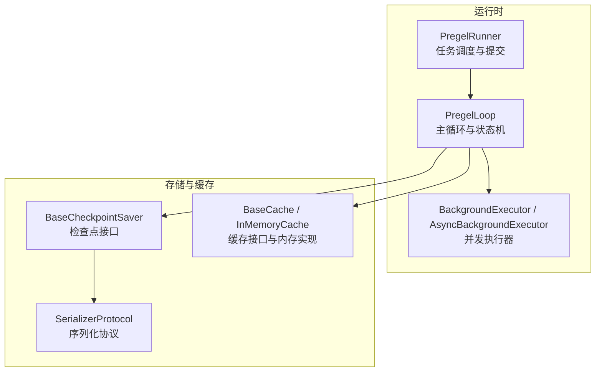
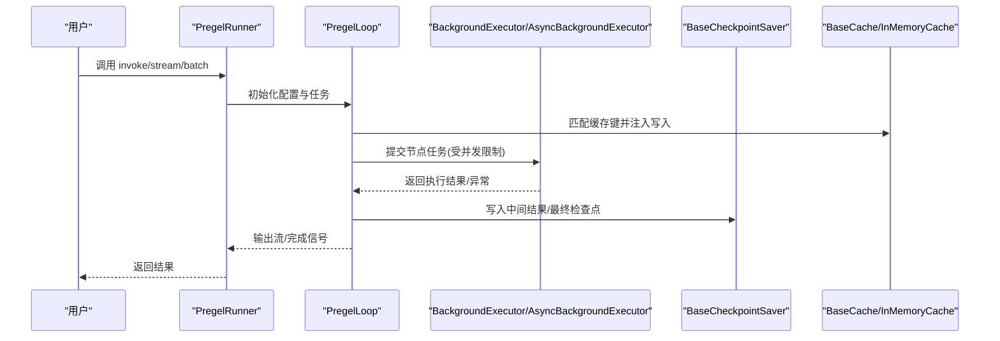
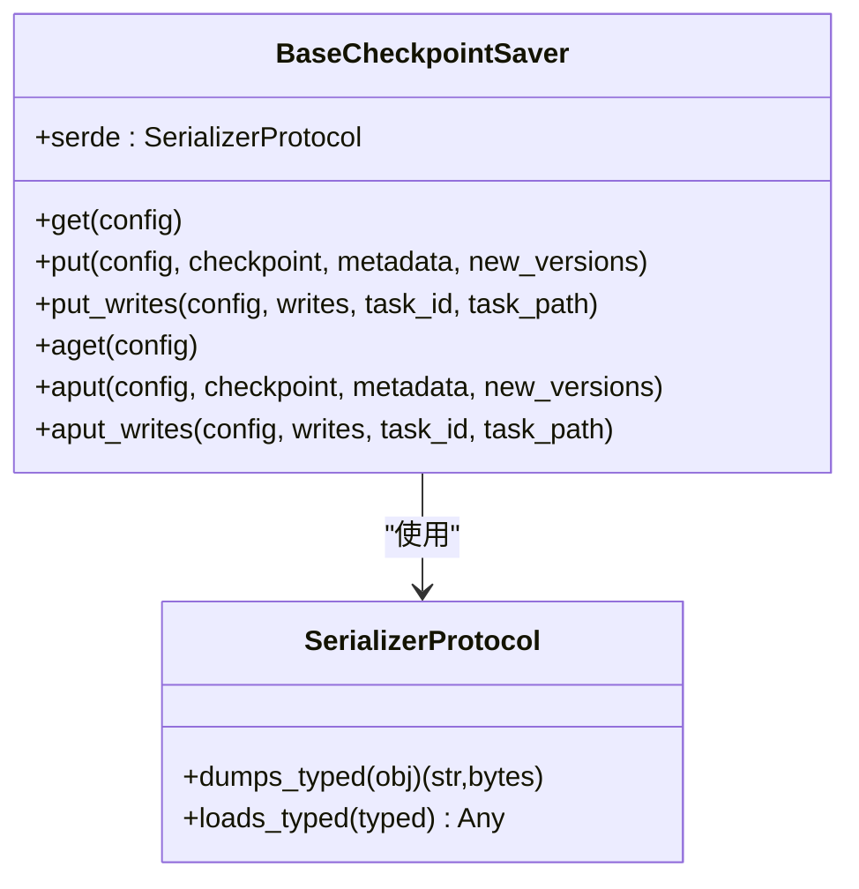
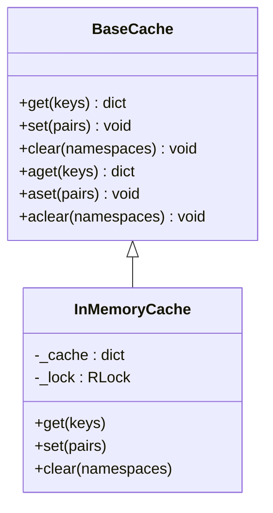
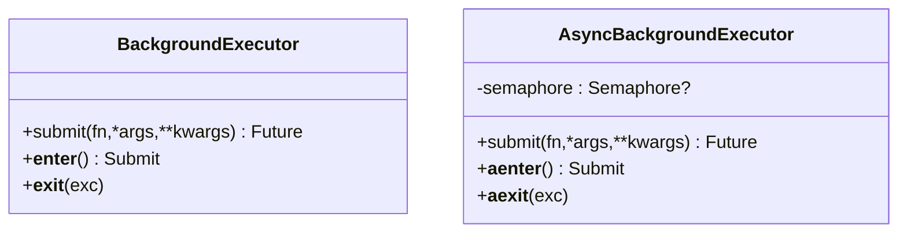
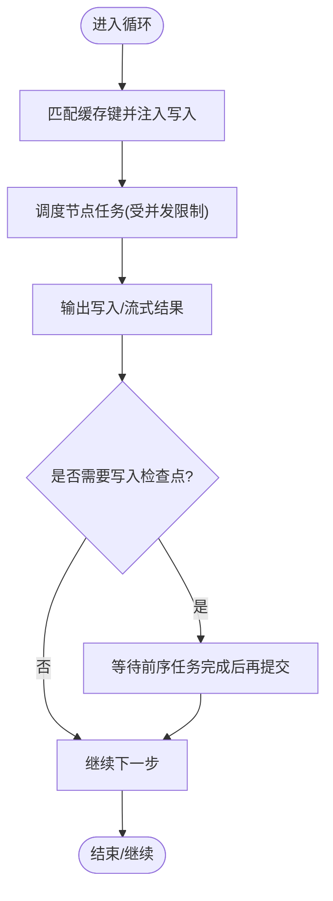
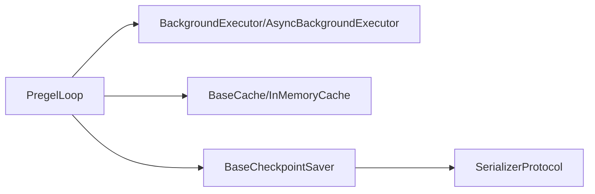

# 性能优化

<cite>
**本文引用的文件**
- [README.md](file://README.md)
- [libs/checkpoint/langgraph/checkpoint/base/__init__.py](file://libs/checkpoint/langgraph/checkpoint/base/__init__.py)
- [libs/checkpoint/langgraph/checkpoint/serde/base.py](file://libs/checkpoint/langgraph/checkpoint/serde/base/__init__.py)
- [libs/checkpoint/langgraph/cache/base/__init__.py](file://libs/checkpoint/langgraph/cache/base/__init__.py)
- [libs/checkpoint/langgraph/cache/memory/__init__.py](file://libs/checkpoint/langgraph/cache/memory/__init__.py)
- [libs/langgraph/langgraph/pregel/_executor.py](file://libs/langgraph/langgraph/pregel/_executor.py)
- [libs/langgraph/langgraph/pregel/_runner.py](file://libs/langgraph/langgraph/pregel/_runner.py)
- [libs/langgraph/langgraph/pregel/_loop.py](file://libs/langgraph/langgraph/pregel/_loop.py)
- [libs/langgraph/bench/__main__.py](file://libs/langgraph/bench/__main__.py)
- [.github/workflows/bench.yml](file://.github/workflows/bench.yml)
</cite>

## 目录
1. [引言](#引言)
2. [项目结构](#项目结构)
3. [核心组件](#核心组件)
4. [架构总览](#架构总览)
5. [详细组件分析](#详细组件分析)
6. [依赖分析](#依赖分析)
7. [性能考量](#性能考量)
8. [故障排查指南](#故障排查指南)
9. [结论](#结论)
10. [附录](#附录)

## 引言
本指南聚焦于 LangGraph 在实际生产中的性能优化实践，围绕以下目标展开：识别常见性能瓶颈、优化内存与序列化开销、提升 CPU 密集型任务并发能力、给出大规模部署的调优参数与配置建议、展示性能监控与关键指标分析方法，并提供跨硬件环境的基准测试思路与诊断流程。内容基于仓库中与检查点、缓存、执行器、运行时循环以及基准测试相关的源码进行提炼与总结。

## 项目结构
LangGraph 的性能相关能力主要分布在如下模块：
- 检查点（Checkpoint）：负责状态快照、版本管理与持久化接口，影响 IO 与内存占用。
- 缓存（Cache）：提供可插拔的键值缓存，支持 TTL 与序列化，显著降低重复计算成本。
- 执行器（Executor）：统一调度同步/异步任务，支持并发度控制与资源回收。
- 运行时循环（Pregel Loop）：协调节点执行、写入输出、中断与恢复、缓存命中匹配等。
- 基准测试（Bench）：提供编译耗时、吞吐与首事件延迟等指标采集框架。

**图表来源**
- [libs/langgraph/langgraph/pregel/_runner.py:122-200](file://libs/langgraph/langgraph/pregel/_runner.py#L122-L200)
- [libs/langgraph/langgraph/pregel/_loop.py:142-200](file://libs/langgraph/langgraph/pregel/_loop.py#L142-L200)
- [libs/langgraph/langgraph/pregel/_executor.py:40-120](file://libs/langgraph/langgraph/pregel/_executor.py#L40-L120)
- [libs/checkpoint/langgraph/checkpoint/base/__init__.py:122-170](file://libs/checkpoint/langgraph/checkpoint/base/__init__.py#L122-L170)
- [libs/checkpoint/langgraph/checkpoint/serde/base.py:14-48](file://libs/checkpoint/langgraph/checkpoint/serde/base/__init__.py#L14-L48)
- [libs/checkpoint/langgraph/cache/base/__init__.py:15-38](file://libs/checkpoint/langgraph/cache/base/__init__.py#L15-L38)
- [libs/checkpoint/langgraph/cache/memory/__init__.py:11-36](file://libs/checkpoint/langgraph/cache/memory/__init__.py#L11-L36)

**章节来源**
- [README.md:1-83](file://README.md#L1-L83)

## 核心组件
- 检查点与序列化
  - 检查点格式包含版本、时间戳、通道值、通道版本、已见版本映射、更新通道等字段，用于状态快照与版本追踪。
  - 序列化协议提供 typed dumps/loads，支持类型元信息与高效二进制编码；可通过 allowlist 控制可序列化对象集合以减少开销。
- 缓存
  - 提供命名空间隔离的键值缓存，支持 TTL 过期与异步读写；内存实现采用线程锁保护，适合单进程内共享。
- 并发执行器
  - 同步/异步两类后台执行器，统一管理任务生命周期、异常聚合与退出行为；异步执行器支持最大并发度限制与上下文传递。

**章节来源**
- [libs/checkpoint/langgraph/checkpoint/base/__init__.py:65-120](file://libs/checkpoint/langgraph/checkpoint/base/__init__.py#L65-L120)
- [libs/checkpoint/langgraph/checkpoint/base/__init__.py:460-490](file://libs/checkpoint/langgraph/checkpoint/base/__init__.py#L460-L490)
- [libs/checkpoint/langgraph/checkpoint/serde/base.py:14-48](file://libs/checkpoint/langgraph/checkpoint/serde/base/__init__.py#L14-L48)
- [libs/checkpoint/langgraph/cache/base/__init__.py:15-38](file://libs/checkpoint/langgraph/cache/base/__init__.py#L15-L38)
- [libs/checkpoint/langgraph/cache/memory/__init__.py:11-36](file://libs/checkpoint/langgraph/cache/memory/__init__.py#L11-L36)
- [libs/langgraph/langgraph/pregel/_executor.py:40-120](file://libs/langgraph/langgraph/pregel/_executor.py#L40-L120)

## 架构总览
LangGraph 的执行路径从 Runner 进入 PregelLoop，由执行器提交节点任务，期间通过缓存命中加速写入，必要时落盘检查点。整体数据流强调“并发 + 版本 + 缓存”的组合优化。

**图表来源**
- [libs/langgraph/langgraph/pregel/_runner.py:140-200](file://libs/langgraph/langgraph/pregel/_runner.py#L140-L200)
- [libs/langgraph/langgraph/pregel/_loop.py:1095-1112](file://libs/langgraph/langgraph/pregel/_loop.py#L1095-L1112)
- [libs/langgraph/langgraph/pregel/_executor.py:131-170](file://libs/langgraph/langgraph/pregel/_executor.py#L131-L170)
- [libs/checkpoint/langgraph/checkpoint/base/__init__.py:223-244](file://libs/checkpoint/langgraph/checkpoint/base/__init__.py#L223-L244)
- [libs/checkpoint/langgraph/cache/memory/__init__.py:17-36](file://libs/checkpoint/langgraph/cache/memory/__init__.py#L17-L36)

## 详细组件分析

### 组件一：检查点与序列化（内存与 IO 优化）
- 关键点
  - 检查点包含通道版本与“已见版本”映射，用于判定节点可执行性，避免不必要的重复计算。
  - 序列化协议支持 typed 编解码与可选加密包装，允许通过 allowlist 精简可序列化对象集合，降低序列化体积与 CPU 开销。
  - 提供浅拷贝与深拷贝辅助函数，便于在高并发场景下减少锁竞争与复制成本。
- 优化建议
  - 仅序列化必要通道，避免将大对象放入通道值。
  - 使用带 allowlist 的序列化器，减少反射与未知类型带来的开销。
  - 对频繁更新的小对象启用缓存，减少重复序列化。
  - 合理设置检查点频率，平衡恢复成本与 IO 压力。

**图表来源**
- [libs/checkpoint/langgraph/checkpoint/base/__init__.py:122-170](file://libs/checkpoint/langgraph/checkpoint/base/__init__.py#L122-L170)
- [libs/checkpoint/langgraph/checkpoint/serde/base.py:14-48](file://libs/checkpoint/langgraph/checkpoint/serde/base/__init__.py#L14-L48)

**章节来源**
- [libs/checkpoint/langgraph/checkpoint/base/__init__.py:65-120](file://libs/checkpoint/langgraph/checkpoint/base/__init__.py#L65-L120)
- [libs/checkpoint/langgraph/checkpoint/base/__init__.py:493-510](file://libs/checkpoint/langgraph/checkpoint/base/__init__.py#L493-L510)
- [libs/checkpoint/langgraph/checkpoint/serde/base.py:14-48](file://libs/checkpoint/langgraph/checkpoint/serde/base/__init__.py#L14-L48)

### 组件二：缓存（命中率与过期策略）
- 关键点
  - 支持命名空间隔离与 TTL 过期，异步读写接口便于在并发场景下快速返回缓存值。
  - 内存实现使用 RLock 保证线程安全，适合单进程内共享。
- 优化建议
  - 将热点中间结果放入缓存，结合 TTL 避免无限增长。
  - 使用命名空间对不同任务/路径隔离缓存，防止误命中。
  - 对大对象启用压缩或更高效的序列化器，权衡 CPU 与内存。

**图表来源**
- [libs/checkpoint/langgraph/cache/base/__init__.py:15-38](file://libs/checkpoint/langgraph/cache/base/__init__.py#L15-L38)
- [libs/checkpoint/langgraph/cache/memory/__init__.py:11-36](file://libs/checkpoint/langgraph/cache/memory/__init__.py#L11-L36)

**章节来源**
- [libs/checkpoint/langgraph/cache/base/__init__.py:15-38](file://libs/checkpoint/langgraph/cache/base/__init__.py#L15-L38)
- [libs/checkpoint/langgraph/cache/memory/__init__.py:11-74](file://libs/checkpoint/langgraph/cache/memory/__init__.py#L11-L74)

### 组件三：并发执行器（并发度与资源回收）
- 关键点
  - 同步执行器基于线程池，异步执行器基于事件循环与信号量，统一处理任务取消、等待与异常重抛。
  - 异步执行器支持通过配置设置最大并发度，避免资源争用导致的抖动。
- 优化建议
  - 根据 CPU 核数与 IO 密集程度设置 max_concurrency，避免过度并发造成上下文切换开销。
  - 对阻塞型 LLM 调用使用异步执行器，配合信号量限流。
  - 在退出时确保等待所有任务完成，避免悬挂线程/协程。

**图表来源**
- [libs/langgraph/langgraph/pregel/_executor.py:40-120](file://libs/langgraph/langgraph/pregel/_executor.py#L40-L120)
- [libs/langgraph/langgraph/pregel/_executor.py:122-200](file://libs/langgraph/langgraph/pregel/_executor.py#L122-L200)

**章节来源**
- [libs/langgraph/langgraph/pregel/_executor.py:40-120](file://libs/langgraph/langgraph/pregel/_executor.py#L40-L120)
- [libs/langgraph/langgraph/pregel/_executor.py:131-170](file://libs/langgraph/langgraph/pregel/_executor.py#L131-L170)

### 组件四：运行时循环（写入合并与检查点提交）
- 关键点
  - 循环中支持缓存命中后直接注入写入，减少重复计算。
  - 检查点提交采用“等待前序任务完成后写入”的模式，保证一致性与顺序性。
- 优化建议
  - 合理设计节点间发送/接收，减少不必要的写入合并与回溯。
  - 对长链路图，适当增加检查点间隔，降低回放成本。

**图表来源**
- [libs/langgraph/langgraph/pregel/_loop.py:1095-1112](file://libs/langgraph/langgraph/pregel/_loop.py#L1095-L1112)
- [libs/langgraph/langgraph/pregel/_loop.py:1275-1290](file://libs/langgraph/langgraph/pregel/_loop.py#L1275-L1290)

**章节来源**
- [libs/langgraph/langgraph/pregel/_loop.py:1095-1112](file://libs/langgraph/langgraph/pregel/_loop.py#L1095-L1112)
- [libs/langgraph/langgraph/pregel/_loop.py:1275-1290](file://libs/langgraph/langgraph/pregel/_loop.py#L1275-L1290)

## 依赖分析
- 组件耦合
  - PregelLoop 依赖执行器、缓存与检查点接口；检查点依赖序列化协议；缓存依赖序列化协议。
- 外部依赖
  - 基于线程池与事件循环的任务调度；可配置的执行器选择（来自 RunnableConfig）。
- 潜在环路
  - 当前结构为单向依赖，未发现循环导入。

**图表来源**
- [libs/langgraph/langgraph/pregel/_loop.py:142-200](file://libs/langgraph/langgraph/pregel/_loop.py#L142-L200)
- [libs/langgraph/langgraph/pregel/_executor.py:40-120](file://libs/langgraph/langgraph/pregel/_executor.py#L40-L120)
- [libs/checkpoint/langgraph/cache/base/__init__.py:15-38](file://libs/checkpoint/langgraph/cache/base/__init__.py#L15-L38)
- [libs/checkpoint/langgraph/checkpoint/base/__init__.py:122-170](file://libs/checkpoint/langgraph/checkpoint/base/__init__.py#L122-L170)
- [libs/checkpoint/langgraph/checkpoint/serde/base.py:14-48](file://libs/checkpoint/langgraph/checkpoint/serde/base/__init__.py#L14-L48)

**章节来源**
- [libs/langgraph/langgraph/pregel/_loop.py:142-200](file://libs/langgraph/langgraph/pregel/_loop.py#L142-L200)
- [libs/langgraph/langgraph/pregel/_executor.py:40-120](file://libs/langgraph/langgraph/pregel/_executor.py#L40-L120)
- [libs/checkpoint/langgraph/cache/base/__init__.py:15-38](file://libs/checkpoint/langgraph/cache/base/__init__.py#L15-L38)
- [libs/checkpoint/langgraph/checkpoint/base/__init__.py:122-170](file://libs/checkpoint/langgraph/checkpoint/base/__init__.py#L122-L170)
- [libs/checkpoint/langgraph/checkpoint/serde/base.py:14-48](file://libs/checkpoint/langgraph/checkpoint/serde/base/__init__.py#L14-L48)

## 性能考量
- 内存使用优化
  - 仅保存必要通道值，避免将大型中间结果写入通道。
  - 使用命名空间隔离缓存，定期清理过期键，避免缓存膨胀。
  - 对频繁序列化的对象启用 allowlist，减少反射与未知类型开销。
- 垃圾回收策略
  - 减少大对象在热路径上的复制与持有，及时释放临时变量。
  - 利用弱引用与事件回调机制，避免强引用导致的泄漏。
- CPU 密集型任务优化
  - 使用异步执行器与信号量限制并发度，避免过多上下文切换。
  - 将阻塞型调用（如网络请求、模型推理）放入后台执行器，保持事件循环不被阻塞。
- 大规模部署调优
  - 根据 CPU 核心数与 IO 特性设置 max_concurrency，观察队列长度与等待时间。
  - 对检查点写入采用批量/异步提交策略，降低磁盘压力。
  - 在多实例部署中使用外部缓存（如 Redis 实现）替代内存缓存，提升共享效率。
- 监控与指标
  - 关注吞吐（每秒节点数）、首事件延迟、检查点写入耗时、缓存命中率、并发度与等待队列长度。
  - 使用基准测试框架对比不同配置下的性能变化。

**章节来源**
- [libs/checkpoint/langgraph/checkpoint/base/__init__.py:493-510](file://libs/checkpoint/langgraph/checkpoint/base/__init__.py#L493-L510)
- [libs/langgraph/langgraph/pregel/_executor.py:131-170](file://libs/langgraph/langgraph/pregel/_executor.py#L131-L170)
- [libs/langgraph/bench/__main__.py:467-520](file://libs/langgraph/bench/__main__.py#L467-L520)
- [.github/workflows/bench.yml:53-71](file://.github/workflows/bench.yml#L53-L71)

## 故障排查指南
- 常见问题定位
  - 并发过高导致 CPU 抖动：检查 max_concurrency 设置与任务类型分布。
  - 缓存命中率低：确认命名空间与键生成策略，评估 TTL 是否过短。
  - 检查点写入慢：评估序列化器与存储介质，考虑异步写入与批量化。
- 诊断步骤
  - 启用调试模式，观察节点执行顺序与写入路径。
  - 记录首事件延迟与吞吐曲线，定位瓶颈阶段。
  - 对比基准测试结果，验证优化效果。
- 解决方案
  - 调整并发度与任务粒度，避免细粒度过小导致调度开销过大。
  - 优化序列化策略与通道结构，减少大对象传输。
  - 使用外部缓存与异步检查点，提升可扩展性。

**章节来源**
- [libs/langgraph/langgraph/pregel/_runner.py:140-200](file://libs/langgraph/langgraph/pregel/_runner.py#L140-L200)
- [libs/langgraph/langgraph/pregel/_loop.py:1095-1112](file://libs/langgraph/langgraph/pregel/_loop.py#L1095-L1112)
- [libs/langgraph/bench/__main__.py:467-520](file://libs/langgraph/bench/__main__.py#L467-L520)

## 结论
LangGraph 的性能优化围绕“并发控制、缓存命中、序列化效率与检查点策略”四大支柱展开。通过合理配置执行器并发度、利用缓存与 allowlist、优化通道结构与序列化器，可在不同硬件环境下获得稳定且可扩展的吞吐表现。结合基准测试与可观测性指标，可以持续迭代调优参数，满足生产级性能要求。

## 附录
- 基准测试与比较
  - 仓库提供了基准测试入口与 GitHub Actions 流水线，可用于对比不同配置与变更的性能差异。
  - 可关注“完整图运行时间”“首事件延迟”“编译耗时”“序列化 allowlist 收集”等维度。

**章节来源**
- [libs/langgraph/bench/__main__.py:467-520](file://libs/langgraph/bench/__main__.py#L467-L520)
- [.github/workflows/bench.yml:53-71](file://.github/workflows/bench.yml#L53-L71)