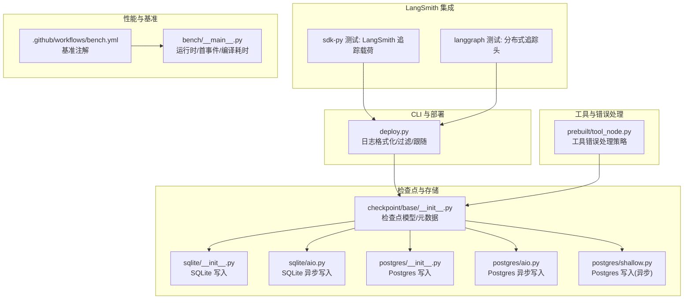
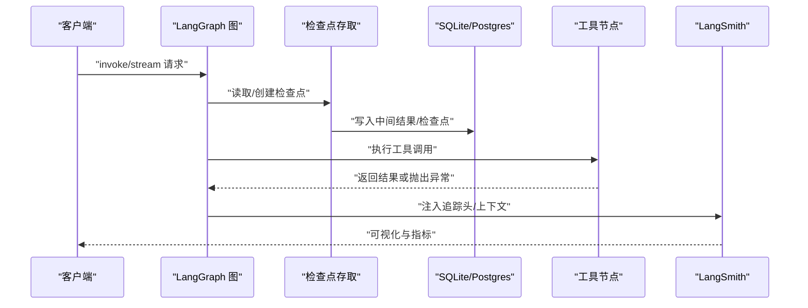
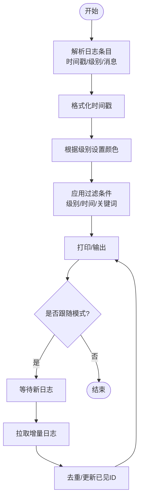
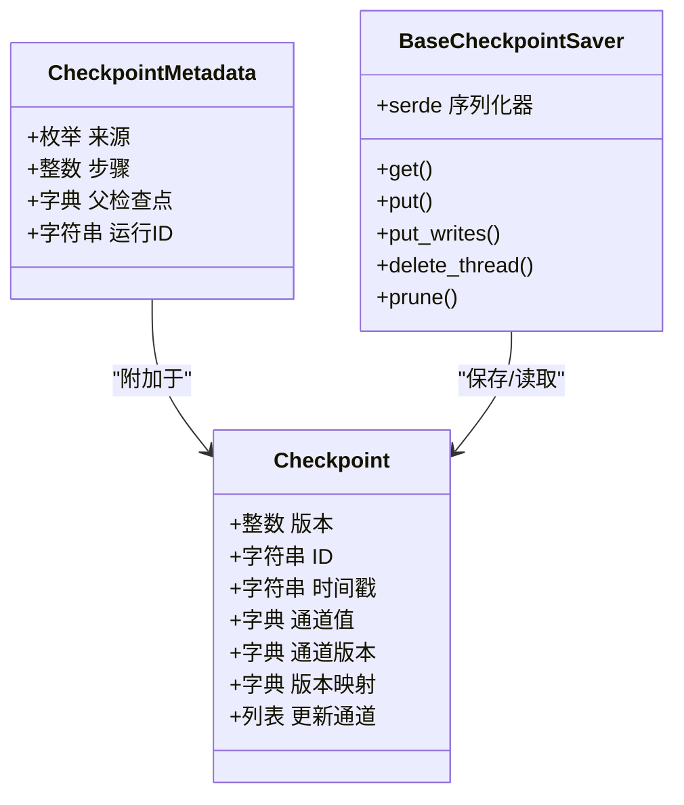
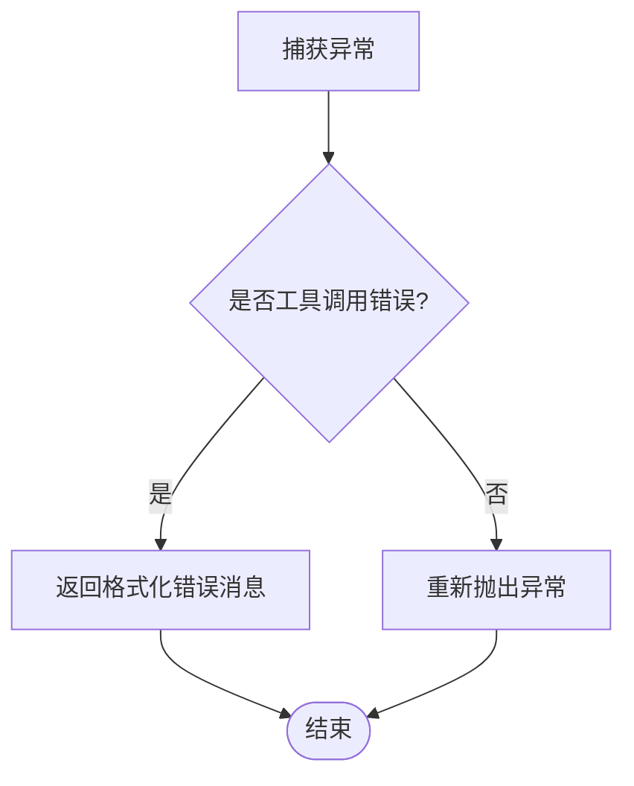
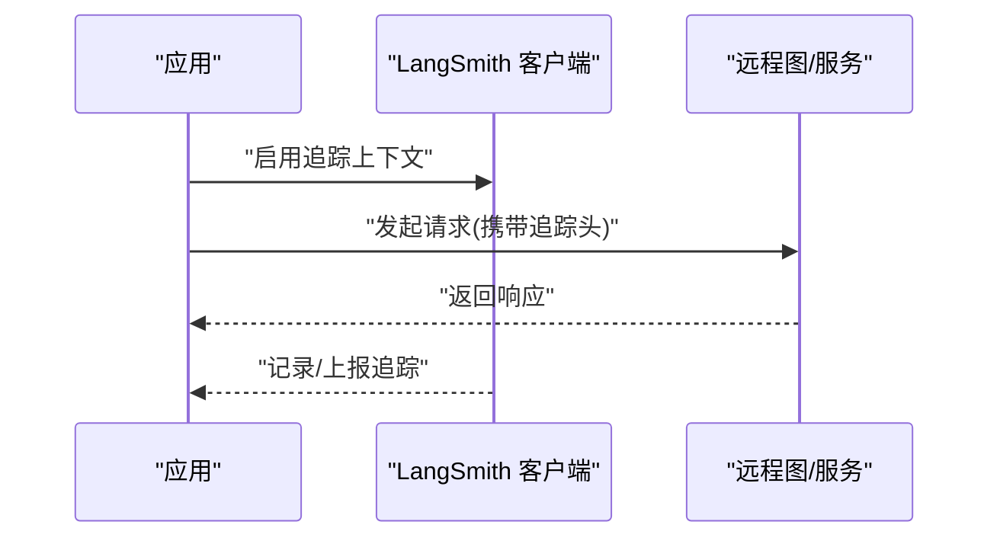
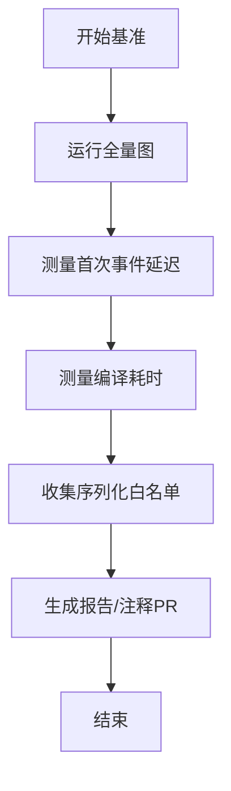
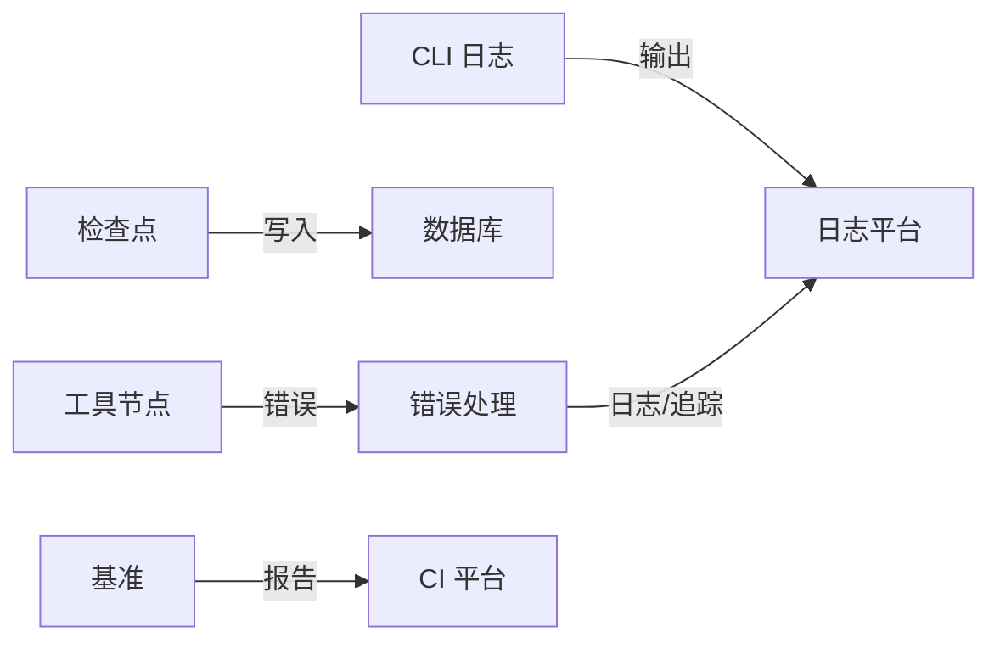

# 监控和调试

<cite>
**本文引用的文件**
- [README.md](file://README.md)
- [libs/langgraph/README.md](file://libs/langgraph/README.md)
- [libs/cli/langgraph_cli/deploy.py](file://libs/cli/langgraph_cli/deploy.py)
- [libs/cli/tests/unit_tests/test_logs_helpers.py](file://libs/cli/tests/unit_tests/test_logs_helpers.py)
- [libs/checkpoint/langgraph/checkpoint/base/__init__.py](file://libs/checkpoint/langgraph/checkpoint/base/__init__.py)
- [libs/checkpoint-sqlite/langgraph/checkpoint/sqlite/__init__.py](file://libs/checkpoint-sqlite/langgraph/checkpoint/sqlite/__init__.py)
- [libs/checkpoint-sqlite/langgraph/checkpoint/sqlite/aio.py](file://libs/checkpoint-sqlite/langgraph/checkpoint/sqlite/aio.py)
- [libs/checkpoint-postgres/langgraph/checkpoint/postgres/__init__.py](file://libs/checkpoint-postgres/langgraph/checkpoint/postgres/__init__.py)
- [libs/checkpoint-postgres/langgraph/checkpoint/postgres/aio.py](file://libs/checkpoint-postgres/langgraph/checkpoint/postgres/aio.py)
- [libs/checkpoint-postgres/langgraph/checkpoint/postgres/shallow.py](file://libs/checkpoint-postgres/langgraph/checkpoint/postgres/shallow.py)
- [libs/prebuilt/langgraph/prebuilt/tool_node.py](file://libs/prebuilt/langgraph/prebuilt/tool_node.py)
- [libs/sdk-py/tests/test_langsmith_tracing.py](file://libs/sdk-py/tests/test_langsmith_tracing.py)
- [libs/langgraph/tests/test_remote_graph.py](file://libs/langgraph/tests/test_remote_graph.py)
- [.github/workflows/bench.yml](file://.github/workflows/bench.yml)
- [libs/langgraph/bench/__main__.py](file://libs/langgraph/bench/__main__.py)
- [libs/checkpoint-conformance/langgraph/checkpoint/conformance/report.py](file://libs/checkpoint-conformance/langgraph/checkpoint/conformance/report.py)
</cite>

## 目录
1. [简介](#简介)
2. [项目结构](#项目结构)
3. [核心组件](#核心组件)
4. [架构总览](#架构总览)
5. [详细组件分析](#详细组件分析)
6. [依赖关系分析](#依赖关系分析)
7. [性能考量](#性能考量)
8. [故障排查指南](#故障排查指南)
9. [结论](#结论)
10. [附录](#附录)

## 简介
本指南面向在生产环境中使用 LangGraph 的工程师，系统性介绍监控与调试的完整方案：包括可观测性指标体系（运行时指标、吞吐量、延迟、错误率）、日志最佳实践与级别配置、调试工具与技巧、异常跟踪与错误诊断、与 LangSmith 等外部监控平台的集成方式，以及生产环境的告警与响应流程建议。文档同时结合仓库中已实现的日志格式化、部署日志拉取、工具节点错误处理、检查点持久化写入等能力，给出可落地的实施路径。

## 项目结构
围绕监控与调试，本仓库的关键位置如下：
- CLI 部署与日志：提供部署日志拉取、过滤与实时跟随输出的能力，便于线上问题定位。
- 检查点与写入：检查点保存与中间写入持久化，是状态恢复与可观测性的基础。
- 工具节点错误处理：统一的工具调用失败处理策略，便于在调试与生产中一致地暴露或隐藏错误信息。
- LangSmith 集成：通过请求头与追踪上下文传递，实现端到端链路追踪。
- 基准测试：提供运行时、首次事件延迟、编译耗时等基准维度，支撑性能基线与回归检测。

图表来源
- [libs/cli/langgraph_cli/deploy.py:1-200](file://libs/cli/langgraph_cli/deploy.py#L1-L200)
- [libs/checkpoint/langgraph/checkpoint/base/__init__.py:1-120](file://libs/checkpoint/langgraph/checkpoint/base/__init__.py#L1-L120)
- [libs/checkpoint-sqlite/langgraph/checkpoint/sqlite/__init__.py:447-475](file://libs/checkpoint-sqlite/langgraph/checkpoint/sqlite/__init__.py#L447-L475)
- [libs/checkpoint-sqlite/langgraph/checkpoint/sqlite/aio.py:542-570](file://libs/checkpoint-sqlite/langgraph/checkpoint/sqlite/aio.py#L542-L570)
- [libs/checkpoint-postgres/langgraph/checkpoint/postgres/__init__.py:345-374](file://libs/checkpoint-postgres/langgraph/checkpoint/postgres/__init__.py#L345-L374)
- [libs/checkpoint-postgres/langgraph/checkpoint/postgres/aio.py:305-333](file://libs/checkpoint-postgres/langgraph/checkpoint/postgres/aio.py#L305-L333)
- [libs/checkpoint-postgres/langgraph/checkpoint/postgres/shallow.py:461-827](file://libs/checkpoint-postgres/langgraph/checkpoint/postgres/shallow.py#L461-L827)
- [libs/prebuilt/langgraph/prebuilt/tool_node.py:381-440](file://libs/prebuilt/langgraph/prebuilt/tool_node.py#L381-L440)
- [libs/sdk-py/tests/test_langsmith_tracing.py:1-49](file://libs/sdk-py/tests/test_langsmith_tracing.py#L1-L49)
- [libs/langgraph/tests/test_remote_graph.py:1442-1485](file://libs/langgraph/tests/test_remote_graph.py#L1442-L1485)
- [.github/workflows/bench.yml:53-71](file://.github/workflows/bench.yml#L53-L71)
- [libs/langgraph/bench/__main__.py:467-520](file://libs/langgraph/bench/__main__.py#L467-L520)

章节来源
- [README.md:35-46](file://README.md#L35-L46)
- [libs/langgraph/README.md:69-88](file://libs/langgraph/README.md#L69-L88)

## 核心组件
- 日志与部署观测
  - CLI 提供日志时间戳格式化、级别高亮、按级别/时间/关键词过滤、实时跟随输出等能力，便于快速定位线上问题。
- 检查点与中间写入
  - 检查点保存与中间写入持久化是可观测性与可恢复性的基础，支持 SQLite 与 Postgres 实现，并提供同步与异步接口。
- 工具节点错误处理
  - 统一的工具调用失败处理策略，支持布尔、字符串、可调用函数、异常类型等多种配置，便于在调试与生产中灵活控制错误可见性。
- LangSmith 集成
  - 通过请求头与追踪上下文传播分布式追踪信息，便于在 LangSmith 中进行端到端可视化与分析。
- 性能基准
  - 提供运行时、首次事件延迟、图编译耗时等基准维度，支撑性能基线与回归检测。

章节来源
- [libs/cli/langgraph_cli/deploy.py:265-293](file://libs/cli/langgraph_cli/deploy.py#L265-L293)
- [libs/checkpoint/langgraph/checkpoint/base/__init__.py:122-314](file://libs/checkpoint/langgraph/checkpoint/base/__init__.py#L122-L314)
- [libs/prebuilt/langgraph/prebuilt/tool_node.py:381-440](file://libs/prebuilt/langgraph/prebuilt/tool_node.py#L381-L440)
- [libs/sdk-py/tests/test_langsmith_tracing.py:21-49](file://libs/sdk-py/tests/test_langsmith_tracing.py#L21-L49)
- [libs/langgraph/tests/test_remote_graph.py:1442-1485](file://libs/langgraph/tests/test_remote_graph.py#L1442-L1485)
- [.github/workflows/bench.yml:53-71](file://.github/workflows/bench.yml#L53-L71)
- [libs/langgraph/bench/__main__.py:467-520](file://libs/langgraph/bench/__main__.py#L467-L520)

## 架构总览
下图展示了从调用到持久化、再到 LangSmith 可视化的整体链路，以及日志采集与性能基准的位置。

图表来源
- [libs/checkpoint/langgraph/checkpoint/base/__init__.py:246-264](file://libs/checkpoint/langgraph/checkpoint/base/__init__.py#L246-L264)
- [libs/checkpoint-sqlite/langgraph/checkpoint/sqlite/__init__.py:447-475](file://libs/checkpoint-sqlite/langgraph/checkpoint/sqlite/__init__.py#L447-L475)
- [libs/checkpoint-postgres/langgraph/checkpoint/postgres/__init__.py:345-374](file://libs/checkpoint-postgres/langgraph/checkpoint/postgres/__init__.py#L345-L374)
- [libs/prebuilt/langgraph/prebuilt/tool_node.py:381-440](file://libs/prebuilt/langgraph/prebuilt/tool_node.py#L381-L440)
- [libs/sdk-py/tests/test_langsmith_tracing.py:21-49](file://libs/sdk-py/tests/test_langsmith_tracing.py#L21-L49)

## 详细组件分析

### 日志与部署观测
- 功能要点
  - 时间戳格式化：支持毫秒时间戳与 ISO 字符串，保证日志可排序与可读性。
  - 级别高亮：对 ERROR/CRITICAL 使用红色、WARNING 使用黄色，提升可读性。
  - 过滤与查询：支持按级别、时间范围、关键词过滤；支持实时跟随输出。
  - 交互体验：支持 Ctrl+C 中断，优雅退出。
- 最佳实践
  - 生产环境默认 INFO 或 WARNING，配合关键词过滤快速定位问题。
  - 对关键路径（如工具调用、检查点写入）增加 DEBUG 级别以辅助排查。
  - 使用“实时跟随”模式配合时间窗口，避免错过新日志。

图表来源
- [libs/cli/langgraph_cli/deploy.py:265-293](file://libs/cli/langgraph_cli/deploy.py#L265-L293)
- [libs/cli/langgraph_cli/deploy.py:1640-1704](file://libs/cli/langgraph_cli/deploy.py#L1640-L1704)
- [libs/cli/tests/unit_tests/test_logs_helpers.py:1-58](file://libs/cli/tests/unit_tests/test_logs_helpers.py#L1-L58)

章节来源
- [libs/cli/langgraph_cli/deploy.py:265-293](file://libs/cli/langgraph_cli/deploy.py#L265-L293)
- [libs/cli/langgraph_cli/deploy.py:1640-1704](file://libs/cli/langgraph_cli/deploy.py#L1640-L1704)
- [libs/cli/tests/unit_tests/test_logs_helpers.py:1-58](file://libs/cli/tests/unit_tests/test_logs_helpers.py#L1-L58)

### 检查点与中间写入
- 数据结构
  - 检查点包含版本、ID、时间戳、通道值、通道版本、版本映射、更新通道等字段，用于状态快照与后续恢复。
  - 元数据支持来源（输入/循环/更新/分叉）、步骤号、父检查点映射、运行 ID 等。
- 写入策略
  - 支持同步与异步写入，针对 SQLite 与 Postgres 提供不同 SQL/参数化写入策略，确保一致性与性能。
  - 特殊写入（错误、调度、中断、恢复）使用负索引避免与常规写入冲突。
- 最佳实践
  - 为每个线程/会话设置唯一 thread_id，确保检查点可检索与可恢复。
  - 在关键节点处写入中间结果，便于中断后恢复与审计。
  - 对写入失败进行重试与降级策略，避免丢失中间状态。

图表来源
- [libs/checkpoint/langgraph/checkpoint/base/__init__.py:35-97](file://libs/checkpoint/langgraph/checkpoint/base/__init__.py#L35-L97)
- [libs/checkpoint/langgraph/checkpoint/base/__init__.py:122-314](file://libs/checkpoint/langgraph/checkpoint/base/__init__.py#L122-L314)

章节来源
- [libs/checkpoint/langgraph/checkpoint/base/__init__.py:35-97](file://libs/checkpoint/langgraph/checkpoint/base/__init__.py#L35-L97)
- [libs/checkpoint/langgraph/checkpoint/base/__init__.py:246-264](file://libs/checkpoint/langgraph/checkpoint/base/__init__.py#L246-L264)
- [libs/checkpoint-sqlite/langgraph/checkpoint/sqlite/__init__.py:447-475](file://libs/checkpoint-sqlite/langgraph/checkpoint/sqlite/__init__.py#L447-L475)
- [libs/checkpoint-sqlite/langgraph/checkpoint/sqlite/aio.py:542-570](file://libs/checkpoint-sqlite/langgraph/checkpoint/sqlite/aio.py#L542-L570)
- [libs/checkpoint-postgres/langgraph/checkpoint/postgres/__init__.py:345-374](file://libs/checkpoint-postgres/langgraph/checkpoint/postgres/__init__.py#L345-L374)
- [libs/checkpoint-postgres/langgraph/checkpoint/postgres/aio.py:305-333](file://libs/checkpoint-postgres/langgraph/checkpoint/postgres/aio.py#L305-L333)
- [libs/checkpoint-postgres/langgraph/checkpoint/postgres/shallow.py:461-827](file://libs/checkpoint-postgres/langgraph/checkpoint/postgres/shallow.py#L461-L827)

### 工具节点错误处理
- 错误处理策略
  - 默认策略：若为工具调用错误，返回格式化后的错误消息；否则重新抛出。
  - 配置项支持：布尔（使用默认模板）、字符串（直接作为错误消息）、可调用函数（自定义生成）、异常类型/元组（仅捕获指定异常）。
  - 类型推断：可从签名类型注解推断处理器所处理的异常类型集合。
- 调试技巧
  - 在开发阶段使用布尔或字符串策略快速暴露问题；在生产阶段使用可调用函数屏蔽敏感细节。
  - 结合检查点与日志，定位具体工具调用与输入参数。

图表来源
- [libs/prebuilt/langgraph/prebuilt/tool_node.py:381-440](file://libs/prebuilt/langgraph/prebuilt/tool_node.py#L381-L440)
- [libs/prebuilt/langgraph/prebuilt/tool_node.py:442-505](file://libs/prebuilt/langgraph/prebuilt/tool_node.py#L442-L505)

章节来源
- [libs/prebuilt/langgraph/prebuilt/tool_node.py:381-440](file://libs/prebuilt/langgraph/prebuilt/tool_node.py#L381-L440)
- [libs/prebuilt/langgraph/prebuilt/tool_node.py:442-505](file://libs/prebuilt/langgraph/prebuilt/tool_node.py#L442-L505)

### LangSmith 集成
- 追踪上下文
  - 通过 tracing_context 与 trace 包裹，自动在请求头中注入分布式追踪信息，支持异步与同步调用。
- 请求载荷
  - LangSmith 追踪配置被映射到请求载荷中的特定键，便于服务端识别与关联。
- 最佳实践
  - 在关键入口（如 API 入口、工具调用前）启用追踪上下文。
  - 将运行 ID 与日志关联，形成端到端可追溯的线索。

图表来源
- [libs/sdk-py/tests/test_langsmith_tracing.py:21-49](file://libs/sdk-py/tests/test_langsmith_tracing.py#L21-L49)
- [libs/langgraph/tests/test_remote_graph.py:1442-1485](file://libs/langgraph/tests/test_remote_graph.py#L1442-L1485)

章节来源
- [libs/sdk-py/tests/test_langsmith_tracing.py:21-49](file://libs/sdk-py/tests/test_langsmith_tracing.py#L21-L49)
- [libs/langgraph/tests/test_remote_graph.py:1442-1485](file://libs/langgraph/tests/test_remote_graph.py#L1442-L1485)

### 性能基准与监控指标
- 基准维度
  - 全量图运行时：评估整体吞吐与延迟。
  - 首次事件延迟：衡量冷启动与首个事件处理耗时。
  - 图编译耗时：评估静态构建成本。
  - 序列化白名单收集：评估序列化开销与兼容性。
- 指标建议
  - 关键指标：P50/P90/P99 运行时、首次事件延迟、编译耗时、错误率、吞吐量。
  - 告警阈值：基于历史基线设定阈值，区分严重与警告级别。
- 基准工作流
  - GitHub Actions 自动比较当前与基线的基准结果，并在 PR 注释中标注差异。

图表来源
- [.github/workflows/bench.yml:53-71](file://.github/workflows/bench.yml#L53-L71)
- [libs/langgraph/bench/__main__.py:467-520](file://libs/langgraph/bench/__main__.py#L467-L520)

章节来源
- [.github/workflows/bench.yml:53-71](file://.github/workflows/bench.yml#L53-L71)
- [libs/langgraph/bench/__main__.py:467-520](file://libs/langgraph/bench/__main__.py#L467-L520)

## 依赖关系分析
- 组件耦合
  - CLI 与部署日志模块耦合度低，主要通过网络接口与本地文件输出；适合独立演进。
  - 检查点子系统与数据库实现松耦合，通过抽象接口适配不同存储后端。
  - 工具节点错误处理与检查点系统无直接耦合，但共同服务于可观测性与可恢复性。
- 外部依赖
  - LangSmith SDK 作为可选依赖，提供 OpenTelemetry 可选功能，便于扩展分布式追踪。
  - Python JSON Logger 等日志库用于结构化日志输出，便于与日志平台对接。

图表来源
- [libs/cli/langgraph_cli/deploy.py:1-200](file://libs/cli/langgraph_cli/deploy.py#L1-L200)
- [libs/checkpoint/langgraph/checkpoint/base/__init__.py:246-264](file://libs/checkpoint/langgraph/checkpoint/base/__init__.py#L246-L264)
- [libs/prebuilt/langgraph/prebuilt/tool_node.py:381-440](file://libs/prebuilt/langgraph/prebuilt/tool_node.py#L381-L440)
- [.github/workflows/bench.yml:53-71](file://.github/workflows/bench.yml#L53-L71)

章节来源
- [libs/cli/langgraph_cli/deploy.py:1-200](file://libs/cli/langgraph_cli/deploy.py#L1-L200)
- [libs/checkpoint/langgraph/checkpoint/base/__init__.py:246-264](file://libs/checkpoint/langgraph/checkpoint/base/__init__.py#L246-L264)
- [libs/prebuilt/langgraph/prebuilt/tool_node.py:381-440](file://libs/prebuilt/langgraph/prebuilt/tool_node.py#L381-L440)
- [.github/workflows/bench.yml:53-71](file://.github/workflows/bench.yml#L53-L71)

## 性能考量
- 指标体系
  - 吞吐量：单位时间内完成的请求数（RPS）。
  - 延迟：平均/分位延迟（P50/P90/P99），区分总体与首次事件延迟。
  - 错误率：失败请求占比，区分工具调用错误与系统错误。
  - 资源占用：CPU、内存、IO，结合数据库写入耗时分析瓶颈。
- 优化方向
  - 编译优化：缓存编译结果、减少重复编译。
  - IO 优化：批量写入检查点与中间结果，选择合适的存储后端。
  - 序列化优化：合理使用序列化白名单，避免不必要的序列化开销。
  - 并发与限流：结合负载与资源上限，设置合理的并发与限流策略。

## 故障排查指南
- 快速定位
  - 使用 CLI 日志的“实时跟随+关键词过滤”，快速定位最近异常。
  - 结合 LangSmith 追踪，查看端到端链路与关键节点耗时。
- 常见问题
  - 工具调用失败：检查工具节点错误处理配置，确认是否需要暴露详细错误信息。
  - 恢复失败：检查检查点与中间写入是否成功，核对 thread_id 与命名空间。
  - 性能退化：对比基准报告，关注编译耗时与首次事件延迟变化。
- 诊断步骤
  - 采集日志与追踪：确保追踪上下文开启，日志级别设置为 DEBUG。
  - 回放与重放：利用检查点进行时间旅行调试，逐步回放状态变更。
  - 压测与回归：在变更前后运行基准，观察指标波动。

章节来源
- [libs/cli/langgraph_cli/deploy.py:1640-1704](file://libs/cli/langgraph_cli/deploy.py#L1640-L1704)
- [libs/prebuilt/langgraph/prebuilt/tool_node.py:381-440](file://libs/prebuilt/langgraph/prebuilt/tool_node.py#L381-L440)
- [libs/langgraph/bench/__main__.py:467-520](file://libs/langgraph/bench/__main__.py#L467-L520)

## 结论
通过结构化的日志与部署观测、可靠的检查点与中间写入、统一的工具错误处理策略、完善的 LangSmith 集成以及系统的性能基准，LangGraph 应用可以在开发、测试与生产环境中获得全面的监控与调试能力。建议将上述实践纳入标准流程，持续优化指标体系与告警策略，确保系统稳定与高性能。

## 附录
- 生产环境建议
  - 日志：统一结构化输出，按级别与关键词过滤，保留至少 7 天滚动日志。
  - 追踪：默认开启 LangSmith 追踪上下文，关键路径强制追踪。
  - 告警：基于基准与历史基线设置阈值，区分严重与警告级别，联动值班流程。
  - 回归：每次发布运行基准，对比差异并在 PR 中标注，防止性能回退。