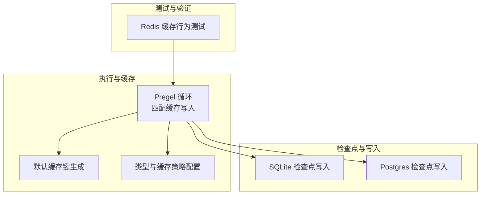
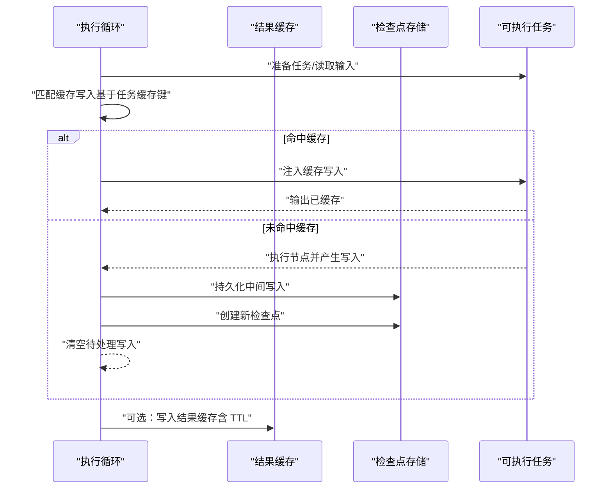
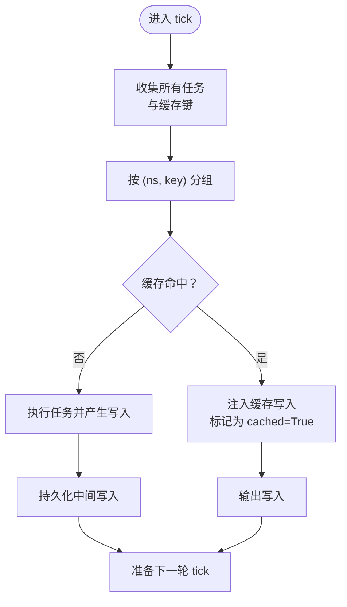
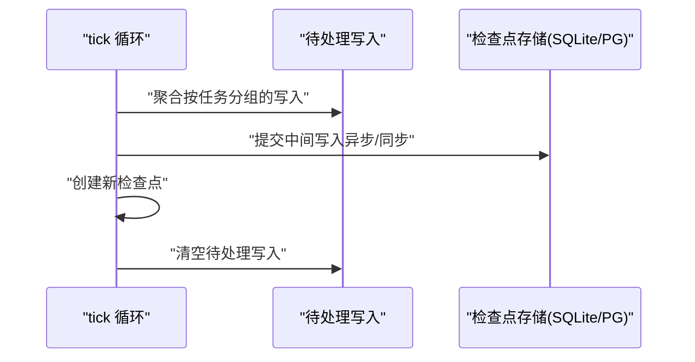
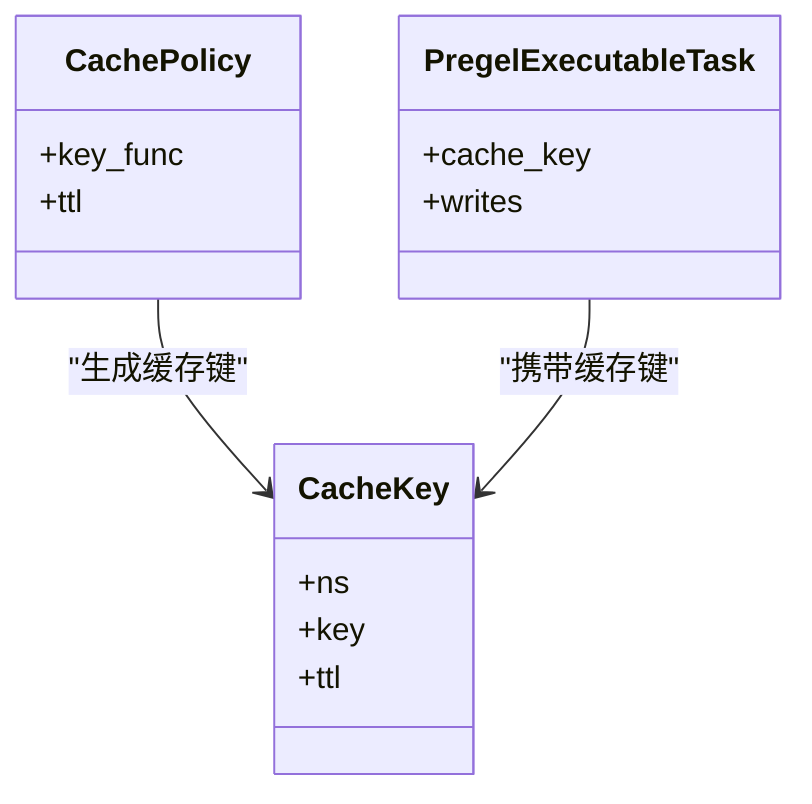
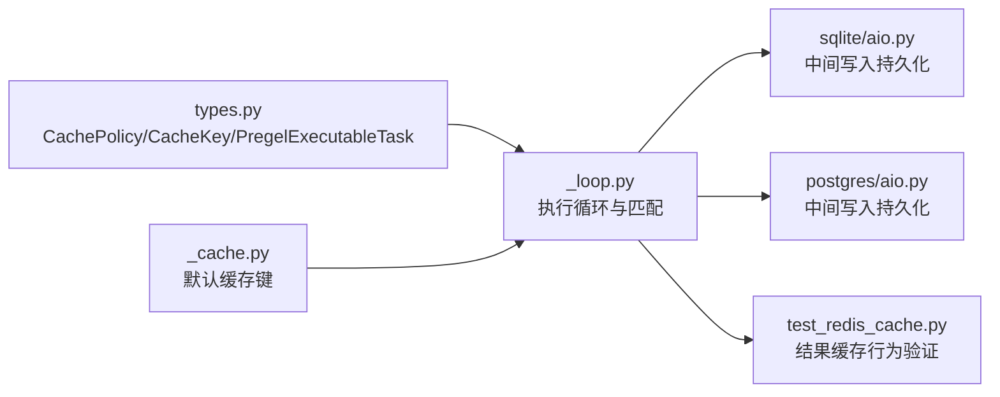

# 缓存策略

<cite>
**本文引用的文件**
- [libs/langgraph/langgraph/pregel/_loop.py](file://libs/langgraph/langgraph/pregel/_loop.py)
- [_cache.py](file://libs/langgraph/langgraph/_internal/_cache.py)
- [types.py](file://libs/langgraph/langgraph/types.py)
- [libs/checkpoint/tests/test_redis_cache.py](file://libs/checkpoint/tests/test_redis_cache.py)
- [libs/checkpoint-sqlite/langgraph/checkpoint/sqlite/aio.py](file://libs/checkpoint-sqlite/langgraph/checkpoint/sqlite/aio.py)
- [libs/checkpoint-postgres/langgraph/checkpoint/postgres/aio.py](file://libs/checkpoint-postgres/langgraph/checkpoint/postgres/aio.py)
</cite>

## 目录
1. [简介](#简介)
2. [项目结构](#项目结构)
3. [核心组件](#核心组件)
4. [架构总览](#架构总览)
5. [详细组件分析](#详细组件分析)
6. [依赖关系分析](#依赖关系分析)
7. [性能考量](#性能考量)
8. [故障排除指南](#故障排除指南)
9. [结论](#结论)
10. [附录](#附录)

## 简介
本文件系统化梳理 LangGraph 的多层缓存架构与策略，重点覆盖：
- 通道级缓存（基于任务缓存键与写入匹配）
- 检查点缓存（持久化检查点与中间写入）
- 结果缓存（可插拔缓存接口与 TTL 支持）
- 失效与更新机制（检查点推进、写入合并、命名空间隔离）
- 配置项与调优参数（缓存键函数、TTL、持久化模式）
- 场景化建议（高并发、长运行代理）
- 命中率监控与性能指标
- 技术细节与内部机制
- 故障排除

LangGraph 在执行循环中通过“任务缓存键”进行通道级缓存匹配，并结合检查点持久化与中间写入存储实现“检查点缓存”，同时提供可插拔的“结果缓存”接口以支持外部缓存系统（如 Redis）。

## 项目结构
围绕缓存的关键模块与文件如下：
- 执行循环与缓存匹配：pregel/_loop.py
- 默认缓存键生成：langgraph/_internal/_cache.py
- 类型定义与缓存策略配置：langgraph/types.py
- 缓存行为测试（Redis）：checkpoint/tests/test_redis_cache.py
- 检查点写入（SQLite 异步）：checkpoint-sqlite/aio.py
- 检查点写入（Postgres 异步）：checkpoint-postgres/aio.py

**图表来源**
- [libs/langgraph/langgraph/pregel/_loop.py](file://libs/langgraph/langgraph/pregel/_loop.py)
- [libs/langgraph/langgraph/_internal/_cache.py](file://libs/langgraph/langgraph/_internal/_cache.py)
- [libs/langgraph/langgraph/types.py](file://libs/langgraph/langgraph/types.py)
- [libs/checkpoint/tests/test_redis_cache.py](file://libs/checkpoint/tests/test_redis_cache.py)
- [libs/checkpoint-sqlite/langgraph/checkpoint/sqlite/aio.py](file://libs/checkpoint-sqlite/langgraph/checkpoint/sqlite/aio.py)
- [libs/checkpoint-postgres/langgraph/checkpoint/postgres/aio.py](file://libs/checkpoint-postgres/langgraph/checkpoint/postgres/aio.py)

**章节来源**
- [libs/langgraph/langgraph/pregel/_loop.py](file://libs/langgraph/langgraph/pregel/_loop.py)
- [libs/langgraph/langgraph/_internal/_cache.py](file://libs/langgraph/langgraph/_internal/_cache.py)
- [libs/langgraph/langgraph/types.py](file://libs/langgraph/langgraph/types.py)
- [libs/checkpoint/tests/test_redis_cache.py](file://libs/checkpoint/tests/test_redis_cache.py)
- [libs/checkpoint-sqlite/langgraph/checkpoint/sqlite/aio.py](file://libs/checkpoint-sqlite/langgraph/checkpoint/sqlite/aio.py)
- [libs/checkpoint-postgres/langgraph/checkpoint/postgres/aio.py](file://libs/checkpoint-postgres/langgraph/checkpoint/postgres/aio.py)

## 核心组件
- 通道级缓存（任务维度）
  - 通过任务的缓存键在执行循环中进行写入匹配，命中后直接注入缓存写入并输出，避免重复计算。
- 检查点缓存（持久化维度）
  - 中间写入按任务聚合后异步/同步写入检查点存储；新检查点创建时清空上一检查点的待处理写入。
- 结果缓存（可插拔维度）
  - 通过统一的缓存接口支持外部缓存（如 Redis），支持 TTL、批量操作、命名空间隔离与清理。

**章节来源**
- [libs/langgraph/langgraph/pregel/_loop.py](file://libs/langgraph/langgraph/pregel/_loop.py)
- [libs/langgraph/langgraph/types.py](file://libs/langgraph/langgraph/types.py)
- [libs/checkpoint/tests/test_redis_cache.py](file://libs/checkpoint/tests/test_redis_cache.py)

## 架构总览
LangGraph 的缓存分层如下：
- 通道级缓存：在每次 tick 前，将“待处理写入”与“任务缓存键”进行匹配，命中则直接应用缓存写入。
- 检查点缓存：将中间写入持久化到检查点存储（SQLite/Postgres 等），并在每步结束或退出时创建新的检查点。
- 结果缓存：通过可插拔的缓存接口，将节点结果缓存到外部系统，支持 TTL 与批量操作。

**图表来源**
- [libs/langgraph/langgraph/pregel/_loop.py](file://libs/langgraph/langgraph/pregel/_loop.py)
- [libs/checkpoint-sqlite/langgraph/checkpoint/sqlite/aio.py](file://libs/checkpoint-sqlite/langgraph/checkpoint/sqlite/aio.py)
- [libs/checkpoint-postgres/langgraph/checkpoint/postgres/aio.py](file://libs/checkpoint-postgres/langgraph/checkpoint/postgres/aio.py)

## 详细组件分析

### 通道级缓存：任务缓存键与写入匹配
- 任务对象包含缓存键信息，执行循环在每次 tick 前对所有任务进行缓存键去重与匹配。
- 匹配成功后，将缓存写入追加到任务的写入队列，并标记为“来自缓存”的输出。
- 这种机制避免了重复执行相同输入的任务，显著降低延迟与资源消耗。

**图表来源**
- [libs/langgraph/langgraph/pregel/_loop.py](file://libs/langgraph/langgraph/pregel/_loop.py)

**章节来源**
- [libs/langgraph/langgraph/pregel/_loop.py](file://libs/langgraph/langgraph/pregel/_loop.py)

### 检查点缓存：中间写入与检查点推进
- 中间写入按任务 ID 聚合后提交至检查点存储，支持异步提交与任务路径记录。
- 新检查点创建时，会清空上一个检查点的待处理写入，确保后续读取一致性。
- 写入持久化采用“存在即替换/忽略”的策略，保证幂等性与性能。

**图表来源**
- [libs/checkpoint-sqlite/langgraph/checkpoint/sqlite/aio.py](file://libs/checkpoint-sqlite/langgraph/checkpoint/sqlite/aio.py)
- [libs/checkpoint-postgres/langgraph/checkpoint/postgres/aio.py](file://libs/checkpoint-postgres/langgraph/checkpoint/postgres/aio.py)

**章节来源**
- [libs/checkpoint-sqlite/langgraph/checkpoint/sqlite/aio.py](file://libs/checkpoint-sqlite/langgraph/checkpoint/sqlite/aio.py)
- [libs/checkpoint-postgres/langgraph/checkpoint/postgres/aio.py](file://libs/checkpoint-postgres/langgraph/checkpoint/postgres/aio.py)

### 结果缓存：接口、TTL 与命名空间
- 结果缓存通过统一接口支持外部缓存系统（如 Redis），具备以下能力：
  - 批量 set/get
  - TTL 控制
  - 命名空间隔离与按命名空间清理
  - 容错：跳过损坏数据条目
- 测试覆盖了 TTL 行为、命名空间隔离、批量操作、清理等关键场景。

**图表来源**
- [libs/langgraph/langgraph/types.py](file://libs/langgraph/langgraph/types.py)

**章节来源**
- [libs/langgraph/langgraph/types.py](file://libs/langgraph/langgraph/types.py)
- [libs/checkpoint/tests/test_redis_cache.py](file://libs/checkpoint/tests/test_redis_cache.py)

### 默认缓存键生成与冻结
- 默认缓存键函数会对输入参数进行“冻结”处理（递归冻结映射/序列，必要时使用对象的二进制表示），再进行序列化与哈希，确保键稳定且可比较。
- 该机制保证不同顺序的映射也能得到相同的键，提升命中率。

**章节来源**
- [libs/langgraph/langgraph/_internal/_cache.py](file://libs/langgraph/langgraph/_internal/_cache.py)

## 依赖关系分析
- 执行循环依赖：
  - 任务对象携带缓存键，用于通道级缓存匹配
  - 检查点存储负责中间写入与检查点推进
  - 可插拔缓存接口用于结果缓存
- 类型与常量：
  - CachePolicy、CacheKey、PregelExecutableTask 等类型定义了缓存策略与任务结构

**图表来源**
- [libs/langgraph/langgraph/types.py](file://libs/langgraph/langgraph/types.py)
- [libs/langgraph/langgraph/pregel/_loop.py](file://libs/langgraph/langgraph/pregel/_loop.py)
- [libs/langgraph/langgraph/_internal/_cache.py](file://libs/langgraph/langgraph/_internal/_cache.py)
- [libs/checkpoint-sqlite/langgraph/checkpoint/sqlite/aio.py](file://libs/checkpoint-sqlite/langgraph/checkpoint/sqlite/aio.py)
- [libs/checkpoint-postgres/langgraph/checkpoint/postgres/aio.py](file://libs/checkpoint-postgres/langgraph/checkpoint/postgres/aio.py)
- [libs/checkpoint/tests/test_redis_cache.py](file://libs/checkpoint/tests/test_redis_cache.py)

**章节来源**
- [libs/langgraph/langgraph/types.py](file://libs/langgraph/langgraph/types.py)
- [libs/langgraph/langgraph/pregel/_loop.py](file://libs/langgraph/langgraph/pregel/_loop.py)
- [libs/langgraph/langgraph/_internal/_cache.py](file://libs/langgraph/langgraph/_internal/_cache.py)
- [libs/checkpoint-sqlite/langgraph/checkpoint/sqlite/aio.py](file://libs/checkpoint-sqlite/langgraph/checkpoint/sqlite/aio.py)
- [libs/checkpoint-postgres/langgraph/checkpoint/postgres/aio.py](file://libs/checkpoint-postgres/langgraph/checkpoint/postgres/aio.py)
- [libs/checkpoint/tests/test_redis_cache.py](file://libs/checkpoint/tests/test_redis_cache.py)

## 性能考量
- 命中率优化
  - 使用稳定的默认缓存键（冻结映射/序列），减少因参数顺序导致的不命中
  - 合理设置 TTL，避免过期数据占用缓存空间
- 写入与持久化
  - 异步提交中间写入，降低阻塞；在退出或需要一致性时强制落盘
  - 按任务分组提交，减少存储往返次数
- 并发与长运行
  - 高并发场景建议启用外部缓存（如 Redis），并合理设置连接池与超时
  - 长运行代理建议开启检查点持久化，结合合理的 TTL 与清理策略

[本节为通用指导，无需列出具体文件来源]

## 故障排除指南
- 缓存未命中
  - 检查任务是否正确设置缓存键
  - 确认输入参数是否被“冻结”为稳定的结构
- TTL 不生效
  - 确认缓存接口支持 TTL 参数并正确传入
  - 检查外部缓存系统的时间同步
- 命名空间冲突
  - 使用唯一 ns 组合，避免不同图/子图之间的键冲突
- 清理无效数据
  - 使用按命名空间清理功能，或全量清理后重建
- 检查点写入异常
  - 确认检查点存储可用性与权限
  - 关注幂等性策略（存在即替换/忽略）

**章节来源**
- [libs/checkpoint/tests/test_redis_cache.py](file://libs/checkpoint/tests/test_redis_cache.py)
- [libs/checkpoint-sqlite/langgraph/checkpoint/sqlite/aio.py](file://libs/checkpoint-sqlite/langgraph/checkpoint/sqlite/aio.py)
- [libs/checkpoint-postgres/langgraph/checkpoint/postgres/aio.py](file://libs/checkpoint-postgres/langgraph/checkpoint/postgres/aio.py)

## 结论
LangGraph 的缓存体系通过“通道级缓存 + 检查点缓存 + 结果缓存”的分层设计，在保证一致性的同时提供了灵活的性能优化手段。通过合理的配置（缓存键函数、TTL、持久化模式）与场景化策略（高并发、长运行代理），可在吞吐与延迟之间取得平衡。配合监控与测试用例，可有效保障缓存系统的稳定性与可观测性。

[本节为总结，无需列出具体文件来源]

## 附录

### 配置项与调优参数
- 缓存策略（CachePolicy）
  - key_func：自定义缓存键生成函数，默认使用冻结后的输入进行序列化
  - ttl：缓存条目的过期时间（秒），None 表示永不过期
- 执行循环中的持久化模式（Durability）
  - sync：同步持久化
  - async：异步持久化
  - exit：仅在退出时持久化
- 检查点写入
  - 支持按任务与任务路径提交，确保幂等与一致性

**章节来源**
- [libs/langgraph/langgraph/types.py](file://libs/langgraph/langgraph/types.py)
- [libs/langgraph/langgraph/pregel/_loop.py](file://libs/langgraph/langgraph/pregel/_loop.py)