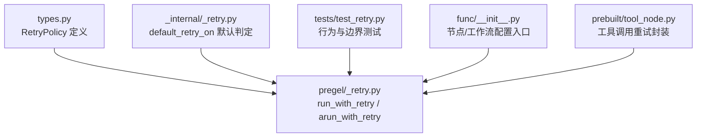
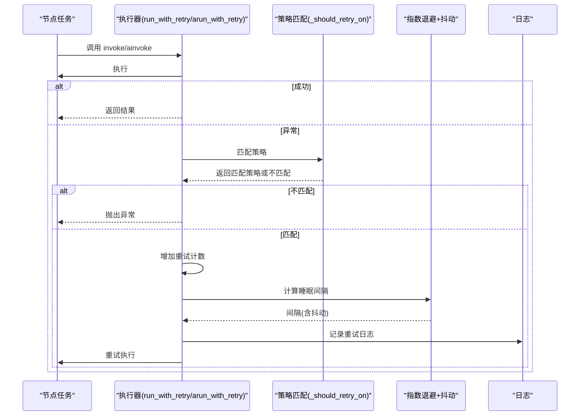
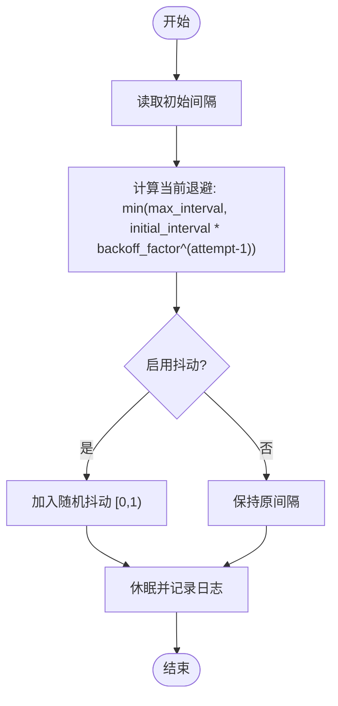
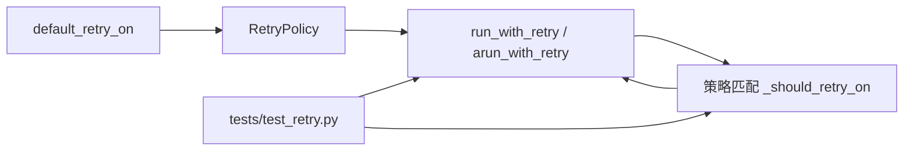

# 重试机制

<cite>
**本文引用的文件**
- [libs/langgraph/langgraph/pregel/_retry.py](file://libs/langgraph/langgraph/pregel/_retry.py)
- [libs/langgraph/langgraph/_internal/_retry.py](file://libs/langgraph/langgraph/_internal/_retry.py)
- [libs/langgraph/langgraph/types.py](file://libs/langgraph/langgraph/types.py)
- [libs/langgraph/tests/test_retry.py](file://libs/langgraph/tests/test_retry.py)
- [libs/langgraph/langgraph/func/__init__.py](file://libs/langgraph/langgraph/func/__init__.py)
- [libs/prebuilt/langgraph/prebuilt/tool_node.py](file://libs/prebuilt/langgraph/prebuilt/tool_node.py)
- [libs/prebuilt/tests/test_on_tool_call.py](file://libs/prebuilt/tests/test_on_tool_call.py)
</cite>

## 目录
1. [简介](#简介)
2. [项目结构](#项目结构)
3. [核心组件](#核心组件)
4. [架构总览](#架构总览)
5. [详细组件分析](#详细组件分析)
6. [依赖分析](#依赖分析)
7. [性能考虑](#性能考虑)
8. [故障排查指南](#故障排查指南)
9. [结论](#结论)
10. [附录](#附录)

## 简介
本文件系统性阐述 LangGraph 中的重试机制，覆盖自动重试触发条件、指数退避策略、重试上下文与状态保持、多类错误的差异化策略、最佳实践与性能影响、失败后的降级处理以及监控与告警建议。内容基于仓库中的实现与测试，确保可操作与可验证。

## 项目结构
与重试机制直接相关的核心文件与职责如下：
- pregel/_retry.py：运行时重试主流程（同步与异步）、指数退避与抖动、执行上下文注入、日志记录
- _internal/_retry.py：默认重试判定函数 default_retry_on，用于区分可重试与不可重试异常
- types.py：RetryPolicy 数据模型与字段含义
- tests/test_retry.py：重试行为、指数退避、抖动、多策略匹配、执行上下文一致性等测试
- func/__init__.py：在节点与工作流中配置 retry_policy 的入口与兼容逻辑
- prebuilt/tool_node.py 与 prebuilt/tests/test_on_tool_call.py：工具调用场景下的重试封装示例

图表来源
- [libs/langgraph/langgraph/pregel/_retry.py:86-303](file://libs/langgraph/langgraph/pregel/_retry.py#L86-L303)
- [libs/langgraph/langgraph/_internal/_retry.py:1-29](file://libs/langgraph/langgraph/_internal/_retry.py#L1-L29)
- [libs/langgraph/langgraph/types.py:404-423](file://libs/langgraph/langgraph/types.py#L404-L423)
- [libs/langgraph/tests/test_retry.py:1-570](file://libs/langgraph/tests/test_retry.py#L1-L570)
- [libs/langgraph/langgraph/func/__init__.py:190-211](file://libs/langgraph/langgraph/func/__init__.py#L190-L211)
- [libs/prebuilt/langgraph/prebuilt/tool_node.py:418-452](file://libs/prebuilt/langgraph/prebuilt/tool_node.py#L418-L452)

章节来源
- [libs/langgraph/langgraph/pregel/_retry.py:86-303](file://libs/langgraph/langgraph/pregel/_retry.py#L86-L303)
- [libs/langgraph/langgraph/_internal/_retry.py:1-29](file://libs/langgraph/langgraph/_internal/_retry.py#L1-L29)
- [libs/langgraph/langgraph/types.py:404-423](file://libs/langgraph/langgraph/types.py#L404-L423)
- [libs/langgraph/tests/test_retry.py:1-570](file://libs/langgraph/tests/test_retry.py#L1-L570)
- [libs/langgraph/langgraph/func/__init__.py:190-211](file://libs/langgraph/langgraph/func/__init__.py#L190-L211)
- [libs/prebuilt/langgraph/prebuilt/tool_node.py:418-452](file://libs/prebuilt/langgraph/prebuilt/tool_node.py#L418-L452)

## 核心组件
- RetryPolicy：重试策略数据模型，包含初始间隔、退避因子、最大间隔、最大尝试次数、抖动开关、可重试异常类型或谓词
- run_with_retry / arun_with_retry：同步与异步执行器，负责捕获异常、选择策略、指数退避、抖动、写入清理、执行上下文更新与日志
- default_retry_on：默认异常分类函数，将常见编程错误排除在重试之外，对网络/HTTP错误进行条件重试
- _should_retry_on：策略匹配器，支持单类、序列、可调用谓词三种形式
- 执行上下文：通过 Runtime.execution_info 注入线程/任务/运行标识与首次尝试时间戳，保证重试期间状态一致

章节来源
- [libs/langgraph/langgraph/types.py:404-423](file://libs/langgraph/langgraph/types.py#L404-L423)
- [libs/langgraph/langgraph/pregel/_retry.py:86-303](file://libs/langgraph/langgraph/pregel/_retry.py#L86-L303)
- [libs/langgraph/langgraph/_internal/_retry.py:1-29](file://libs/langgraph/langgraph/_internal/_retry.py#L1-L29)

## 架构总览
重试在执行器内部以“节点任务”为单位进行，每个任务拥有独立的重试策略集合。执行流程如下：

图表来源
- [libs/langgraph/langgraph/pregel/_retry.py:144-185](file://libs/langgraph/langgraph/pregel/_retry.py#L144-L185)
- [libs/langgraph/langgraph/pregel/_retry.py:260-302](file://libs/langgraph/langgraph/pregel/_retry.py#L260-L302)
- [libs/langgraph/langgraph/pregel/_retry.py:305-318](file://libs/langgraph/langgraph/pregel/_retry.py#L305-L318)

## 详细组件分析

### 指数退避与抖动实现
- 初始间隔 initial_interval：第一次重试前等待秒数
- 退避因子 backoff_factor：每次退避按该倍率递增
- 最大间隔 max_interval：退避上限
- 抖动 jitter：启用后在间隔基础上加 [0,1) 随机抖动，缓解同质化重试风暴
- 计算公式（简化）：interval = min(max_interval, initial_interval * backoff_factor^(attempt-1))
- 实现位置：同步与异步执行器均采用相同逻辑

图表来源
- [libs/langgraph/langgraph/pregel/_retry.py:166-177](file://libs/langgraph/langgraph/pregel/_retry.py#L166-L177)
- [libs/langgraph/langgraph/pregel/_retry.py:283-294](file://libs/langgraph/langgraph/pregel/_retry.py#L283-L294)

章节来源
- [libs/langgraph/langgraph/pregel/_retry.py:166-177](file://libs/langgraph/langgraph/pregel/_retry.py#L166-L177)
- [libs/langgraph/langgraph/pregel/_retry.py:283-294](file://libs/langgraph/langgraph/pregel/_retry.py#L283-L294)

### 重试触发条件与策略匹配
- 默认重试判定 default_retry_on：将网络连接错误与 5xx 类 HTTP 错误视为可重试；将多数编程类异常排除；未显式匹配则默认可重试
- 策略匹配 _should_retry_on：支持三类 retry_on
  - 单个异常类：如 ValueError
  - 异常类元组/列表：如 (ValueError, KeyError)
  - 可调用谓词：根据业务语义自定义判断
- 多策略匹配：按顺序遍历策略，命中即停止；若无匹配则抛出异常

章节来源
- [libs/langgraph/langgraph/_internal/_retry.py:1-29](file://libs/langgraph/langgraph/_internal/_retry.py#L1-L29)
- [libs/langgraph/langgraph/pregel/_retry.py:305-318](file://libs/langgraph/langgraph/pregel/_retry.py#L305-L318)
- [libs/langgraph/tests/test_retry.py:27-86](file://libs/langgraph/tests/test_retry.py#L27-L86)

### 重试上下文与状态保持
- 执行信息注入：当分布式运行时缺少 execution_info 时，从配置中补全线程/任务/运行标识与命名空间
- 节点首次尝试时间与尝试次数：在每次重试前更新 execution_info 的 node_attempt 与 node_first_attempt_time，确保同一轮重试共享相同首参时间戳
- 恢复信号：设置 CONFIG_KEY_RESUMING 标记，通知子图恢复

章节来源
- [libs/langgraph/langgraph/pregel/_retry.py:33-54](file://libs/langgraph/langgraph/pregel/_retry.py#L33-L54)
- [libs/langgraph/langgraph/pregel/_retry.py:109-121](file://libs/langgraph/langgraph/pregel/_retry.py#L109-L121)
- [libs/langgraph/langgraph/pregel/_retry.py:220-231](file://libs/langgraph/langgraph/pregel/_retry.py#L220-L231)
- [libs/langgraph/tests/test_retry.py:413-473](file://libs/langgraph/tests/test_retry.py#L413-L473)

### 不同错误类型的重试策略
- 网络错误（ConnectionError）：默认可重试
- HTTP 5xx 错误：默认可重试
- HTTP 4xx 错误：默认不重试
- 编程类异常（如 ValueError、TypeError 等）：默认不重试
- 其他异常：默认可重试
- 自定义策略：通过 retry_on 指定具体异常类型、类型集合或谓词函数，实现精细化控制

章节来源
- [libs/langgraph/langgraph/_internal/_retry.py:5-29](file://libs/langgraph/langgraph/_internal/_retry.py#L5-L29)
- [libs/langgraph/tests/test_retry.py:113-177](file://libs/langgraph/tests/test_retry.py#L113-L177)

### 配置入口与最佳实践
- 节点级配置：在节点定义时传入 retry_policy 或 retry_policy 序列
- 工作流级配置：通过工作流构造参数传入全局重试策略
- 兼容旧接口：保留 retry 参数并在内部映射到 retry_policy
- 最佳实践建议
  - 初始间隔与退避因子：结合上游稳定性设定，避免过短导致雪崩
  - 最大间隔：限制退避上限，防止极端情况下的长尾延迟
  - 尝试次数：避免无限重试，结合业务容忍度设置上限
  - 抖动：生产环境建议开启，降低热点冲突
  - 策略分层：对不同异常类型配置不同策略，避免“一刀切”

章节来源
- [libs/langgraph/langgraph/func/__init__.py:190-211](file://libs/langgraph/langgraph/func/__init__.py#L190-L211)
- [libs/langgraph/langgraph/func/__init__.py:269-271](file://libs/langgraph/langgraph/func/__init__.py#L269-L271)
- [libs/langgraph/langgraph/func/__init__.py:401-420](file://libs/langgraph/langgraph/func/__init__.py#L401-L420)

### 失败后的降级处理
- 当达到最大尝试次数仍未成功时，抛出异常，由上层捕获并执行降级逻辑（例如返回缓存、兜底数据、人工介入）
- 工具调用场景：通过包装器在多次重试后返回最后一次响应或抛出最终异常，便于上层统一处理
- 建议：在工作流中为关键节点配置降级分支或中断处理，确保失败可控

章节来源
- [libs/langgraph/langgraph/pregel/_retry.py:163-164](file://libs/langgraph/langgraph/pregel/_retry.py#L163-L164)
- [libs/langgraph/langgraph/pregel/_retry.py:280-281](file://libs/langgraph/langgraph/pregel/_retry.py#L280-L281)
- [libs/prebuilt/tests/test_on_tool_call.py:794-839](file://libs/prebuilt/tests/test_on_tool_call.py#L794-L839)

## 依赖分析
- RetryPolicy 是策略核心，被 run_with_retry / arun_with_retry 使用
- default_retry_on 提供默认异常分类，作为 RetryPolicy.retry_on 的默认值
- _should_retry_on 将策略与异常进行类型/谓词匹配
- 测试覆盖了策略匹配、退避计算、抖动、执行上下文一致性等关键路径

图表来源
- [libs/langgraph/langgraph/types.py:404-423](file://libs/langgraph/langgraph/types.py#L404-L423)
- [libs/langgraph/langgraph/pregel/_retry.py:86-303](file://libs/langgraph/langgraph/pregel/_retry.py#L86-L303)
- [libs/langgraph/langgraph/_internal/_retry.py:1-29](file://libs/langgraph/langgraph/_internal/_retry.py#L1-L29)
- [libs/langgraph/tests/test_retry.py:1-570](file://libs/langgraph/tests/test_retry.py#L1-L570)

章节来源
- [libs/langgraph/langgraph/types.py:404-423](file://libs/langgraph/langgraph/types.py#L404-L423)
- [libs/langgraph/langgraph/pregel/_retry.py:86-303](file://libs/langgraph/langgraph/pregel/_retry.py#L86-L303)
- [libs/langgraph/langgraph/_internal/_retry.py:1-29](file://libs/langgraph/langgraph/_internal/_retry.py#L1-L29)
- [libs/langgraph/tests/test_retry.py:1-570](file://libs/langgraph/tests/test_retry.py#L1-L570)

## 性能考虑
- 指数退避会放大延迟，应合理设置初始间隔与最大间隔，避免长尾延迟拖垮整体吞吐
- 抖动可显著降低重试风暴概率，建议在高并发场景开启
- 日志记录包含异常详情，频繁重试会产生大量日志，需结合采样或级别控制
- 写入清理与执行上下文更新为轻量操作，但过多重试仍会增加 CPU 与 IO 压力

## 故障排查指南
- 现象：未按预期重试
  - 检查 retry_on 是否正确配置（单类/序列/谓词）
  - 确认异常类型是否被 default_retry_on 排除
- 现象：退避间隔不符合预期
  - 核对 initial_interval、backoff_factor、max_interval 设置
  - 验证是否启用了 jitter
- 现象：执行上下文不一致
  - 确认 Runtime.execution_info 是否正确注入
  - 检查 node_attempt 与 node_first_attempt_time 是否随重试更新
- 现象：重试次数过多
  - 调整 max_attempts 或在策略中精确限定可重试异常

章节来源
- [libs/langgraph/tests/test_retry.py:180-376](file://libs/langgraph/tests/test_retry.py#L180-L376)
- [libs/langgraph/tests/test_retry.py:413-473](file://libs/langgraph/tests/test_retry.py#L413-L473)

## 结论
LangGraph 的重试机制以 RetryPolicy 为核心，结合默认异常分类与灵活的策略匹配，实现了对网络/服务异常的稳健处理，并通过指数退避与抖动控制重试节奏。配合执行上下文的一致性维护与日志记录，既保证了可观测性，也为失败后的降级提供了清晰的边界。实践中应依据业务特性与上游稳定性，精细化配置初始间隔、退避因子、最大间隔与尝试次数，并在高并发场景开启抖动以提升系统韧性。

## 附录
- 监控与告警建议
  - 指标：每节点/每任务的重试次数、平均/95 分位退避等待时间、失败率
  - 告警：重试次数超过阈值、连续失败比例上升、退避时间异常增长
  - 日志：记录异常类型、策略名称、退避间隔、抖动幅度、执行上下文标识
- 降级策略示例
  - 缓存回源：在重试失败后读取缓存
  - 人工干预：触发告警并暂停流程，等待人工确认
  - 回退分支：切换到备用服务或降级输出