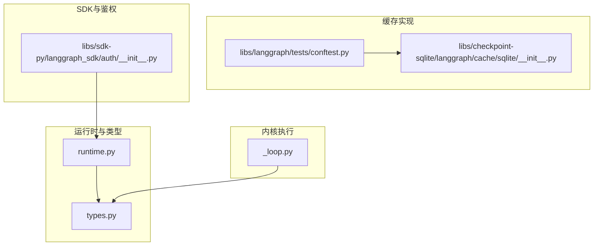
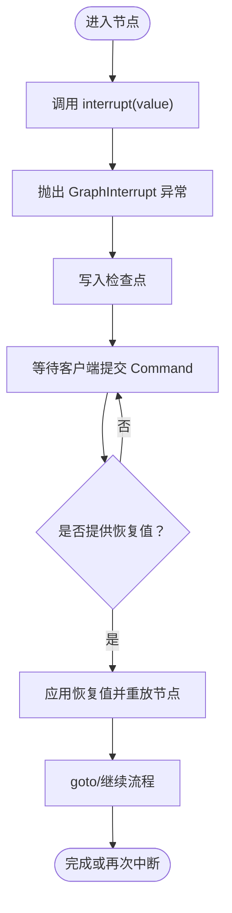
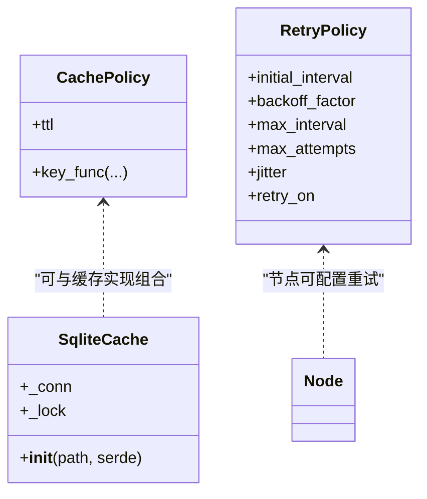
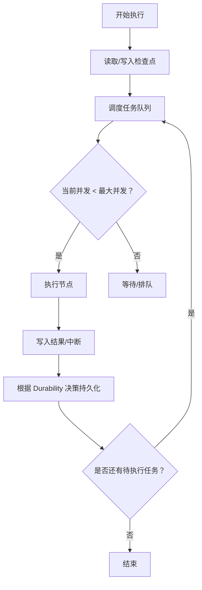
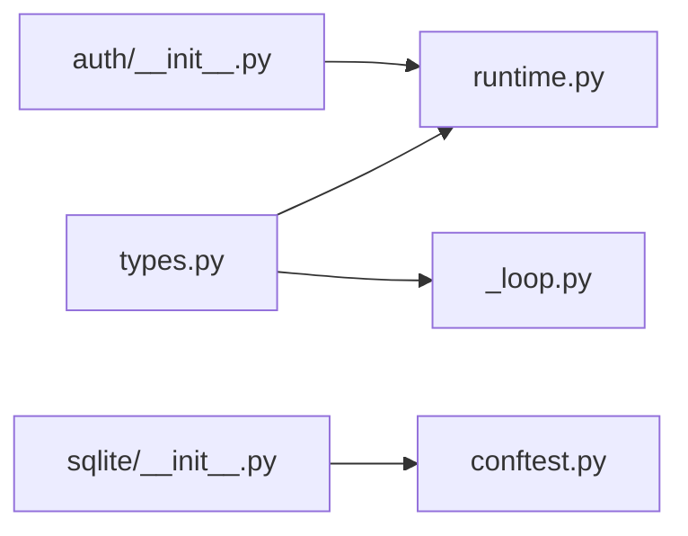

# 高级特性

<cite>
**本文引用的文件**
- [README.md](file://README.md)
- [_loop.py](file://libs/langgraph/langgraph/pregel/_loop.py)
- [runtime.py](file://libs/langgraph/langgraph/runtime.py)
- [types.py](file://libs/langgraph/langgraph/types.py)
- [conftest.py](file://libs/langgraph/tests/conftest.py)
- [sqlite/__init__.py](file://libs/checkpoint-sqlite/langgraph/cache/sqlite/__init__.py)
- [auth/__init__.py](file://libs/sdk-py/langgraph_sdk/auth/__init__.py)
</cite>

## 目录
1. [简介](#简介)
2. [项目结构](#项目结构)
3. [核心组件](#核心组件)
4. [架构总览](#架构总览)
5. [详细组件分析](#详细组件分析)
6. [依赖分析](#依赖分析)
7. [性能考量](#性能考量)
8. [故障排除指南](#故障排除指南)
9. [结论](#结论)
10. [附录](#附录)

## 简介
本文件聚焦 LangGraph 的高级特性与工程化实践，围绕以下主题展开：人机协作（中断、恢复、状态修改）、缓存策略与重试机制、并发控制与性能优化、复杂场景使用模式与最佳实践、安全与权限管理、监控与调试工具、以及常见问题排查。内容基于仓库中的源码与测试夹具进行系统性梳理，并通过图示帮助读者建立从概念到落地的完整认知。

## 项目结构
LangGraph 采用多库分层组织，核心能力分布在如下模块：
- libs/langgraph：运行时、类型定义、流式输出、执行控制等
- libs/checkpoint-*：检查点持久化与缓存实现（内存、SQLite、Redis 等）
- libs/sdk-py：服务端 SDK 与鉴权授权能力
- examples：示例与教程（部分已迁移至集中文档）



图表来源
- [runtime.py:1-245](file://libs/langgraph/langgraph/runtime.py#L1-L245)
- [types.py:1-800](file://libs/langgraph/langgraph/types.py#L1-L800)
- [_loop.py:646-671](file://libs/langgraph/langgraph/pregel/_loop.py#L646-L671)
- [sqlite/__init__.py:1-44](file://libs/checkpoint-sqlite/langgraph/cache/sqlite/__init__.py#L1-L44)
- [conftest.py:60-89](file://libs/langgraph/tests/conftest.py#L60-L89)
- [auth/__init__.py:81-689](file://libs/sdk-py/langgraph_sdk/auth/__init__.py#L81-L689)

章节来源
- [README.md:35-46](file://README.md#L35-L46)

## 核心组件
- 运行时上下文与注入
  - Runtime 提供节点与中间件可访问的上下文（如 context、store、stream_writer、previous、execution_info、server_info），并支持合并与覆盖。
  - get_runtime 可在运行时获取当前注入的 Runtime 实例。
- 类型与流式输出
  - StreamMode 定义了 values、updates、messages、checkpoints、tasks、debug、custom 等流式输出模式。
  - GraphOutput、CheckpointPayload、TaskPayload 等类型用于标准化输出与调试事件。
- 中断与命令
  - interrupt 函数用于在节点中抛出可恢复异常，触发客户端介入；Command 支持更新状态、跳转节点、指定恢复值等。
- 缓存与重试
  - CachePolicy 与 RetryPolicy 分别描述缓存键函数与重试策略（初始间隔、退避因子、最大间隔、最大尝试次数、抖动、触发条件）。
- 并发控制
  - 测试夹具展示了 max_concurrency 控制与并发上限，配合持久化与检查点实现稳定并发执行。

章节来源
- [runtime.py:24-245](file://libs/langgraph/langgraph/runtime.py#L24-L245)
- [types.py:85-132](file://libs/langgraph/langgraph/types.py#L85-L132)
- [types.py:356-424](file://libs/langgraph/langgraph/types.py#L356-L424)
- [types.py:429-440](file://libs/langgraph/langgraph/types.py#L429-L440)
- [types.py:444-500](file://libs/langgraph/langgraph/types.py#L444-L500)
- [types.py:652-703](file://libs/langgraph/langgraph/types.py#L652-L703)
- [types.py:705-800](file://libs/langgraph/langgraph/types.py#L705-L800)
- [conftest.py:60-89](file://libs/langgraph/tests/conftest.py#L60-L89)

## 架构总览
LangGraph 的执行路径由 Pregel 内核驱动，结合检查点与缓存实现“可中断、可恢复、可观测”的长流程执行。下图展示从节点执行到流式输出的关键交互：

```mermaid
sequenceDiagram
participant Client as "客户端"
participant Graph as "编译后的图"
participant Loop as "Pregel 执行循环"
participant Node as "节点函数"
participant CP as "检查点/缓存"
participant RT as "Runtime 上下文"
Client->>Graph : "invoke/stream(...)"
Graph->>Loop : "启动执行"
Loop->>CP : "读取/写入检查点"
Loop->>RT : "注入 Runtime"
Loop->>Node : "调用节点"
Node-->>Loop : "返回值/抛出中断"
Loop->>Client : "按模式发送流事件"
Client->>Graph : "提交 Command 或恢复值"
Graph->>Loop : "继续执行"
Loop->>CP : "写入检查点"
Loop-->>Client : "完成或再次中断"
```

图表来源
- [_loop.py:646-671](file://libs/langgraph/langgraph/pregel/_loop.py#L646-L671)
- [types.py:705-800](file://libs/langgraph/langgraph/types.py#L705-L800)
- [runtime.py:90-245](file://libs/langgraph/langgraph/runtime.py#L90-L245)

## 详细组件分析

### 人机协作：中断、恢复与状态修改
- 中断机制
  - 在节点中调用 interrupt(value) 触发 GraphInterrupt 异常，将 value 与中断标识暴露给客户端。
  - 多个 interrupt 按任务内的顺序匹配恢复值，且恢复值仅在当前任务范围内有效。
- 恢复与命令
  - 使用 Command(resume=...) 指定恢复值，或以 goto 指定下一跳节点。
  - 更新状态可通过 Command.update 或节点返回的更新结构实现。
- 状态修改与时间旅行
  - 检查点机制允许在子图或父图之间进行“时间旅行”式恢复，内部逻辑会处理 RESUME 写入的清理与保留，确保多中断场景下先前解析值被正确保留。



图表来源
- [types.py:705-800](file://libs/langgraph/langgraph/types.py#L705-L800)
- [_loop.py:646-671](file://libs/langgraph/langgraph/pregel/_loop.py#L646-L671)

章节来源
- [types.py:444-500](file://libs/langgraph/langgraph/types.py#L444-L500)
- [types.py:652-703](file://libs/langgraph/langgraph/types.py#L652-L703)
- [types.py:705-800](file://libs/langgraph/langgraph/types.py#L705-L800)
- [_loop.py:646-671](file://libs/langgraph/langgraph/pregel/_loop.py#L646-L671)

### 缓存策略与重试机制
- 缓存策略
  - CachePolicy 提供 key_func 与 ttl 配置，默认键函数基于输入哈希；ttl 支持过期控制。
  - 测试夹具展示了多种缓存后端（内存、SQLite、Redis），便于在不同场景选择合适实现。
- 重试机制
  - RetryPolicy 支持指数退避、抖动、最大尝试次数与可配置的异常过滤器，适配不稳定外部服务。
- SQLite 缓存实现要点
  - 使用 WAL 模式提升并发与原子性；表结构包含 ns、key、expiry、encoding、val 等字段；线程锁保证共享连接安全。



图表来源
- [types.py:429-440](file://libs/langgraph/langgraph/types.py#L429-L440)
- [types.py:404-424](file://libs/langgraph/langgraph/types.py#L404-L424)
- [sqlite/__init__.py:1-44](file://libs/checkpoint-sqlite/langgraph/cache/sqlite/__init__.py#L1-L44)
- [conftest.py:60-89](file://libs/langgraph/tests/conftest.py#L60-L89)

章节来源
- [types.py:404-440](file://libs/langgraph/langgraph/types.py#L404-L440)
- [sqlite/__init__.py:1-44](file://libs/checkpoint-sqlite/langgraph/cache/sqlite/__init__.py#L1-L44)
- [conftest.py:60-89](file://libs/langgraph/tests/conftest.py#L60-L89)

### 并发控制与性能优化
- 并发上限
  - 测试夹具演示通过 max_concurrency 控制节点并发度，避免资源争用与过载。
- 执行持久化与异步持久化
  - Durability 模式支持同步、异步与退出时持久化，平衡吞吐与一致性。
- 任务与通道
  - Pregel 通过 LastValue 等通道模型实现数据传播，结合检查点减少重复计算。



图表来源
- [conftest.py:3493-3529](file://libs/langgraph/tests/conftest.py#L3493-L3529)
- [types.py:85-91](file://libs/langgraph/langgraph/types.py#L85-L91)

章节来源
- [conftest.py:3493-3529](file://libs/langgraph/tests/conftest.py#L3493-L3529)
- [types.py:85-91](file://libs/langgraph/langgraph/types.py#L85-L91)

### 复杂场景使用模式与最佳实践
- 子图与父图协作
  - 通过 Command.graph 指定父图或当前图，实现跨子图的状态修改与恢复。
- 条件分支与动态发送
  - 使用 Send 动态向不同节点发送不同状态，实现 map-reduce 等模式。
- 流式输出与调试
  - 使用 stream_mode="debug" 获取 checkpoints 与 tasks 事件，辅助定位问题。
- 安全命名空间
  - 基于用户身份对存储命名空间进行前缀化，避免越权访问。

章节来源
- [types.py:574-647](file://libs/langgraph/langgraph/types.py#L574-L647)
- [types.py:652-703](file://libs/langgraph/langgraph/types.py#L652-L703)
- [auth/__init__.py:81-689](file://libs/sdk-py/langgraph_sdk/auth/__init__.py#L81-L689)

### 安全考虑与权限管理
- 鉴权与授权
  - 支持全局与资源/动作粒度的授权处理器，请求按最具体匹配规则执行。
- 存储操作作用域
  - 默认将用户身份作为命名空间前缀，限制对他人数据的访问。
- 认证入口
  - 提供 authenticate 回调验证凭据并返回用户范围。

章节来源
- [auth/__init__.py:81-689](file://libs/sdk-py/langgraph_sdk/auth/__init__.py#L81-L689)

### 监控、日志记录与调试工具
- 流式事件
  - values、updates、messages、checkpoints、tasks、debug、custom 等模式满足不同观测需求。
- 调试事件结构
  - CheckpointPayload、TaskPayload、DebugPayload 统一了调试事件的数据结构，便于可视化与分析。
- 运行时元数据
  - ExecutionInfo 提供当前节点尝试次数、首次尝试时间戳等信息，辅助性能分析。

章节来源
- [types.py:118-132](file://libs/langgraph/langgraph/types.py#L118-L132)
- [types.py:192-247](file://libs/langgraph/langgraph/types.py#L192-L247)
- [runtime.py:24-76](file://libs/langgraph/langgraph/runtime.py#L24-L76)

## 依赖分析
- 运行时与类型
  - runtime.py 依赖 types.py 中的执行信息与流式类型定义。
- 执行循环与中断
  - _loop.py 依赖 types.py 中的中断与命令类型，并在回放时处理 RESUME 写入。
- 缓存与测试
  - conftest.py 提供多种缓存后端（内存、SQLite、Redis）的 fixture，sqlite 实现位于 libs/checkpoint-sqlite。
- SDK 鉴权
  - auth/__init__.py 为 SDK 层提供认证与授权钩子，与 runtime 注入的 server_info 协同。



图表来源
- [runtime.py:1-245](file://libs/langgraph/langgraph/runtime.py#L1-L245)
- [types.py:1-800](file://libs/langgraph/langgraph/types.py#L1-L800)
- [_loop.py:646-671](file://libs/langgraph/langgraph/pregel/_loop.py#L646-L671)
- [sqlite/__init__.py:1-44](file://libs/checkpoint-sqlite/langgraph/cache/sqlite/__init__.py#L1-L44)
- [conftest.py:60-89](file://libs/langgraph/tests/conftest.py#L60-L89)
- [auth/__init__.py:81-689](file://libs/sdk-py/langgraph_sdk/auth/__init__.py#L81-L689)

## 性能考量
- 缓存命中与 TTL
  - 合理设置 key_func 与 ttl，避免热点失效导致的抖动。
- 重试退避
  - 结合抖动与最大间隔，降低级联失败风险。
- 并发上限
  - 通过 max_concurrency 限制同时执行的任务数，防止资源耗尽。
- 持久化模式
  - 在高吞吐场景优先考虑异步持久化，兼顾延迟与可靠性。

## 故障排除指南
- 中断未生效
  - 确认已启用检查点保存器；未启用时中断无法持久化状态。
- 恢复值不匹配
  - 多个中断按顺序匹配，确保恢复值列表长度与中断数量一致。
- 并发超限
  - 检查 max_concurrency 设置与下游资源容量，必要时降低并发或扩容。
- 缓存污染
  - 使用独立命名空间或前缀隔离不同测试/租户，避免键冲突。
- 鉴权拒绝
  - 核对认证回调与授权处理器的匹配规则，确认命名空间前缀是否正确。

章节来源
- [types.py:705-800](file://libs/langgraph/langgraph/types.py#L705-L800)
- [conftest.py:60-89](file://libs/langgraph/tests/conftest.py#L60-L89)
- [auth/__init__.py:81-689](file://libs/sdk-py/langgraph_sdk/auth/__init__.py#L81-L689)

## 结论
LangGraph 通过“可中断、可恢复、可观测”的内核设计，结合灵活的缓存与重试策略、严格的并发控制与完善的监控调试能力，为构建生产级长流程智能体提供了坚实基础。配合 SDK 的鉴权与命名空间管理，可在团队与多租户场景下安全地扩展与演进。

## 附录
- 快速参考
  - 中断与恢复：参见 types.py 中 interrupt 与 Command 的定义与示例路径。
  - 缓存策略：参见 types.py 中 CachePolicy 与 sqlite 缓存实现。
  - 并发控制：参见 conftest.py 中并发测试用例。
  - 鉴权与命名空间：参见 sdk-py 的 auth 模块。